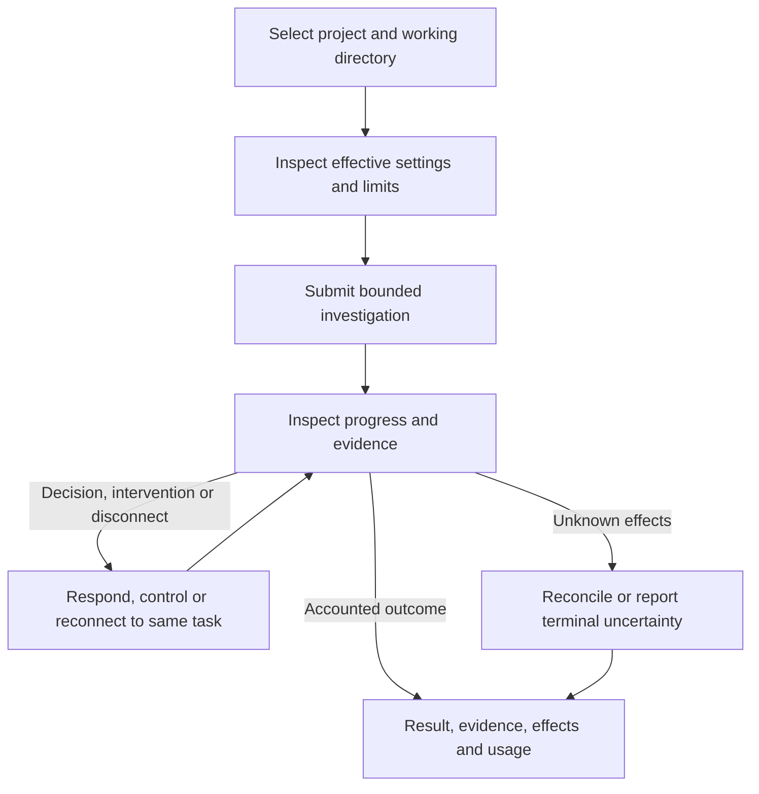

# D0 product workflows and objectives

Status: first-release capability scope selected by the owner on 2026-09-22.
Workflow refinements and numerical acceptance targets remain proposals for review.
Existing required behavior is linked to its canonical contract.
No implementation or performance evidence exists.

## Selected first-release scope

Required behavior: the first release targets local CLI/TUI with on-device
assistance. This selects functionality through I4: a non-interactive CLI and
interactive chat/TUI for bounded local investigation using the on-device decision subsystem.
Both embedded and configured external SurrealDB modes remain required at I2.
“Local” describes task execution and inference, not the database deployment.
I9 release qualification remains mandatory for this scope, including installation,
upgrade, recovery, security, sustained workloads and distribution evidence.

The initial workflows inspect source and may run authorized tools with writes
limited to explicitly granted scratch/generated-output locations. Source remains
read-only, including through scripts and descendants, under the
[I2 boundary](../plans/implementation.md#i2-source-protection-boundary).
The product must explain that boundary before accepting an unsupported edit task.

Remote inference (I5), validated source changes (I6), remote hosts (I7) and the
GUI (I8) remain later delivery scopes. Their boundaries remain part of D1-D8
architecture work. Excluding them from the first release does not waive
their designs or permit implementations to bypass the shared control contract.

The owner's scope selection resolves the release-capability decision only.
Domain refinements, workflow details and numerical targets still require review.
The selection does not authorize implementation.

### Workflow overview

Proposed user journey. Arrows show user-visible progression, not exact API calls.
The lifecycle owner remains the orchestrator.

## W1: Select and inspect a project

**Initial state:** One OS user has two clients, multiple contexts, and parent
configuration shared by some working directories.

**Trigger:** Register or select a location and inspect its effective settings.

**Required result:** The service returns explicit context/location identities,
configuration revision and redacted source reasons. Clients can work in different
contexts concurrently. Registration does not grant filesystem access. Unreadable,
malformed or unstable applicable configuration rejects affected work; sibling
settings do not leak. See [C1-C4](user-service-configuration.md#validation-required-before-delivery).

**Proposed refinement:** Ambiguous overlapping registrations require explicit
selection under the [domain model](domain-model.md#resolving-aliases-and-overlap).

**Checks:** Unit scope/precedence rules; integration with real directory aliases,
overlap, replacement and permissions; CLI/TUI inspection and submission using the
same revision. Environment: supported macOS, real service and filesystem.

## W2: Submit and investigate

**Initial state:** A valid selected context has source fixtures, granted output
locations, a task budget and an available on-device model.

**Trigger:** Ask why a fixture test fails and request supporting evidence.

**Required result:** Acceptance identifies durable task state before execution.
The agent retrieves scoped evidence, proposes bounded operations and reports
observations. Model proposals cannot grant authority. The final report separates
observed results from hypotheses, names evidence versions, and discloses omissions,
residual effects and unsettled usage. Success requires verified task criteria and
accounted operations under the [harness contract](core-harness-brief.md).

**Checks:** Unit proposal validation and budgets; integration through the real
model adapter, policy, storage and constrained process tree; CLI/TUI investigation
with attempted source writes denied and authorized output writes verified.
Environment: supported macOS with actual Foundation Models and host enforcement.
Deterministic fixtures verify control logic but cannot establish model quality.

## W3: Handle a decision or unavailable capability

**Initial state:** A task needs information, a policy-permitted approval, or an
unavailable model/tool capability.

**Trigger:** Present the condition, then receive a timely response, refusal, late
response or deadline expiry. Repeat while another client cancels the task.

**Required result:** The client explains what is needed and which effects are
permitted. Responses bind to the pending decision and task revision. A response
cannot bypass policy or an accepted cancellation. Required-decision expiry uses
the [common failure procedure](core-harness-brief.md#user-decision-expiry-contract).
No unavailable local model may silently cause remote disclosure.

**Proposed refinement:** An unavailable required capability produces a stable,
actionable reason. Inspection and cancellation remain available. It does not
produce an invented model result or an unbounded retry loop. D4 selects bounded
retry/failure behavior; D6 defines refusal versus task-redirection presentation.

**Checks:** Unit response/expiry arbitration; integration with concurrent clients,
real adapter unavailability and durable restart; CLI/TUI approval, refusal,
expiry and unavailable-model journeys. Environment: supported macOS; actual model
availability failures are required in addition to injected adapter errors.

## W4: Control and reconnect

**Initial state:** A task has queued, running, waiting or reconciling operations.

**Trigger:** Disconnect a client; attach another; request pause, resume, explicit
goal revision or cancellation. Restart after a durable acknowledgement.

**Required result:** Clients see the same task identity and authoritative revision.
Pause/cancel acknowledgement means durable intent, not completed interruption.
Cancellation survives reconciliation and restart. Unknown effects remain visible;
recovery exhaustion reports failure with uncertainty. Late results cannot reopen
a terminal task. Task deadlines continue during pause and restart. Revision and
resume require fresh context and current authority. See
[control and recovery](core-harness-brief.md#proposed-interruption-and-recovery-states).

**Checks:** Unit intent precedence and stale revisions; integration with process
death at each persistence/dispatch boundary; two-client end-to-end recovery in
both storage modes. Environment: real macOS processes and durable stores.

## W5: Recover configuration and storage

**Initial state:** A bound installation has active tasks in two contexts. One
branch's configuration changes, or its external database becomes unavailable.

**Trigger:** Replace a parent source, remove external settings, interrupt a binding
change, revoke policy, or restart with a mismatched graph identity.

**Required result:** Preserve the saved binding and accepted task identities.
Reject invalid affected admissions. Do not initialize a replacement graph or
partially activate configuration. Show recovery state and available repair/control
operations. Unknown effects and reserved usage remain recorded. An unrelated
configuration branch remains usable unless a shared dependency also failed.
See [storage B1-B5](context-storage-candidates.md#binding-acceptance-cases) and
[configuration C4](user-service-configuration.md#c4-parent-changes-and-restart).

**Checks:** Unit binding/configuration state rules; integration with actual embedded
and external stores, authentication failure, partitions and interrupted cutover;
CLI/TUI repair and reopen. Environment: supported macOS plus a real external
SurrealDB server. No remote AI credentials are needed to prove external storage.

## Proposed measurable objectives

These are acceptance candidates, not measured capabilities. D1-D2 must establish
feasibility; owners must accept or revise them before D0 exit. D7 pins hardware,
OS/SDK/dependency versions, fixture hashes and reproducible measurement commands.
Threshold changes require a documented design revision, never a silent test edit.

### P0: Workload and measurement profile

Propose a supported Apple-silicon Mac with 16 GiB RAM and local SSD, on mains power.
Measure a warm service over 30 minutes after five minutes of warm-up. Use 20
registered contexts, five active contexts, ten attached clients and twenty active
tasks. Bound simultaneous model invocations to one and tool operations to four
for this profile; these are workload parameters, not selected product defaults.

Use 100,000 graph node versions and 300,000 edges, ten configuration ancestors,
at most 64 KiB per source, and 100 task events/second with at most 4 KiB per event.
Drive 20 control requests/second, evenly split among submission, status,
subscription/reconnect and pause/cancel against eligible fixture tasks. Report
the sample count and percentile separately for each operation class. Use at least
1,000 samples for each measured latency class across repeated runs.

Repeat with an unreachable telemetry collector and one deliberately stalled
model invocation. Run storage tests in both modes. For external performance,
use a server with recorded hardware and at most 10 ms measured network RTT;
report server cost and client cost separately. Test outages as separate fault
profiles; do not mix them into the healthy latency percentile or omit their results.

### Objective thresholds

| ID | Proposed target and measurement boundary |
| --- | --- |
| P1 | Status response p95 ≤250 ms and p99 ≤1 s, from client send to rendered/structured response |
| P2 | Task acceptance and pause/cancel durable acknowledgement p95 ≤500 ms and p99 ≤2 s; exclude action completion time |
| P3 | Committed progress visible to connected clients p95 ≤500 ms and p99 ≤2 s, from durable event position to client presentation |
| P4 | Reconnect gives authoritative state and pending decisions within 2 s p95 and 5 s p99; expired cursors produce explicit resync |
| P5 | After process start, reach either verified ready state or explicit bounded recovery state within 10 s for the P0 dataset |
| P6 | At the frozen durable-admission winner, zero new task dispatch after accepted cancel/failure intent; zero duplicate effects from request replay |
| P7 | After injected crashes, zero lost acknowledged task/control records and zero unsupported release of reservations within the chosen durability contract |
| P8 | Control/orchestration/graph client processes together peak at ≤1 GiB resident memory during P0; account for helpers and bounded queues |
| P9 | At least 4 of 5 representative users complete W1, W2 and W4 without facilitator intervention, with no scope or cancellation misunderstanding |

For P5, recovery state must name the cause, remaining uncertainty and available
controls. It is not permission to dispatch or claim full recovery. D3-D5 select
separate deadlines and resource bounds for reconciliation and remote operations.

For P8, report model runtime, tool descendants and external server memory
separately. They are excluded from this control-service threshold, not from total
resource reporting or host limits. D2/D4 must set those separate resource ceilings.
If the embedded graph cannot meet the control-process target, revise the proposal
using measurements before implementation acceptance criteria are frozen.

For P9, record participant experience, completion, errors and time per workflow.
Also verify all required TUI controls by keyboard and the supported accessibility
interface. D6 chooses exact presentation/accessibility criteria and review methods.
Five participants provide formative evidence, not a population-wide usability claim.

Model answer quality needs a versioned D4 evaluation corpus, scoring rubric and
thresholds for routing, evidence fidelity, uncertainty and completion. P1-P9 do
not prove those outcomes. D7 must add saturation, long-duration, cold-start and
large-dataset profiles; P0 alone cannot establish production scalability.

## Exit and next designs

The [requirements matrix](requirements-validation.md) owns coverage and readiness
tracking. D0 exit requires reviewed release scope, domain semantics, initial
workflows and measurable targets. D1 then establishes platform/threat evidence;
D2-D7 refine mechanisms and tests. D8 and explicit implementation authorization
remain mandatory before coding. UI mockups, transport choices and test-runner
selection are outside this D0 artifact.
