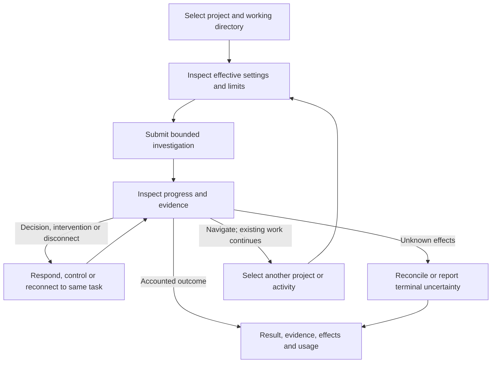
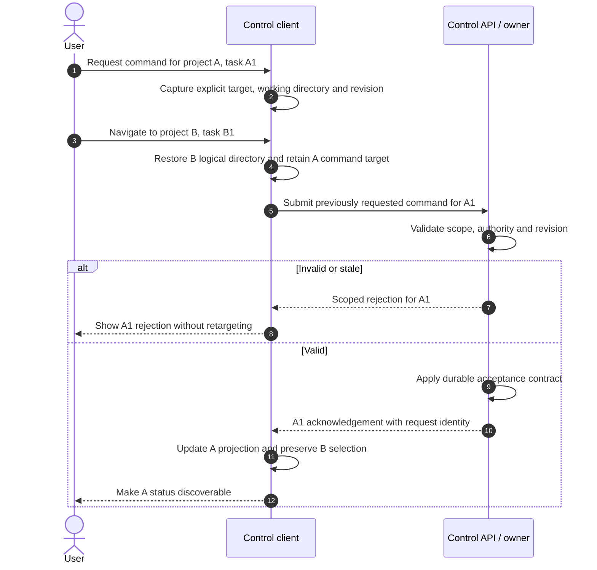

# D0 product workflows and objectives

Status: first-release capability scope selected by the owner on 2026-09-22.
Ratatui, the Rust chat backend and default chat launch were selected on 2026-09-23.
Navigation across projects and concurrent activities in one interface is required
by [ADR-0007](../decisions/0007-multi-project-control-interface.md), recorded on 2026-09-24.
Workflow refinements and numerical acceptance targets remain proposals for review.
Existing required behavior is linked to its canonical contract.
No production workflow implementation or performance evidence exists. The isolated
TUI experiment qualifies only its synthetic editor and presentation scope.

## Selected first-release scope

Required behavior: the first release targets local CLI/TUI with on-device
assistance. This selects functionality through I4: a non-interactive CLI and
interactive chat/TUI for bounded local investigation using the on-device decision subsystem.
Both embedded and configured external SurrealDB modes remain required at I2.
Runtime AGENTS.md support enters I2 and is part of this first release.
Agent Skills enter I3 and are also part of this release. Skill scripts use the
ordinary admitted I2 tool path; a skill does not grant permission.
LSP support also enters I2, with source files remaining read-only under that
increment's host boundary. Rust and Swift are the first qualified languages;
their servers come from explicitly configured, identity-checked installed
toolchains. An absent or mismatched toolchain produces an explicit unavailable
capability. D4 must define the conformance profile.
“Local” describes task execution and inference, not the database deployment.
I9 release qualification remains mandatory for this scope, including installation,
upgrade, recovery, security, sustained workloads and distribution evidence.

The initial workflows inspect source and may run authorized tools with writes
limited to explicitly granted scratch/generated-output locations. Source remains
read-only, including through scripts and descendants, under the
[I2 boundary](../plans/implementation.md#i2-source-protection-boundary).
The product must explain that boundary before accepting an unsupported edit task.

Remote inference (I5), validated source changes (I6), remote hosts (I7) and the
GUI (I8) remain later delivery scopes. Their boundaries remain part of D1-D8
architecture work. Excluding them from the first release does not waive
their designs or permit implementations to bypass the shared control contract.
MCP support starts in I6 with local stdio servers. Remote HTTP transport is a
later profile. The first profile includes tools, resources and prompts. MCP
prompts require explicit activation and provenance; discovery alone does not
make them chat commands.

The owner's scope selection resolves the release-capability decision only.
Domain refinements, workflow details and numerical targets still require review.
The selection does not authorize implementation.

### Workflow overview

Proposed user journey. Arrows show user-visible progression, not exact API calls.
The lifecycle owner remains the orchestrator.

## W0: Launch chat by default

**Required behavior:** [ADR-0005](../decisions/0005-default-ratatui-chat.md) selects
Ratatui chat as the default launch mode, backed by the shared Rust user service.

**Initial state:** The user has a supported interactive terminal. The service may
already be running or require startup through the selected service mechanism.

**Trigger:** Launch `asura` without an explicit command. Repeat with an explicit
non-interactive command, a second terminal, and an unavailable service.

**Required result:** The no-command launch enters chat. Explicit non-interactive
commands retain their own output contract. All clients use the same backend owner
and authoritative task state. Opening chat does not submit a task or grant access.
Connection failure must remain visible; the client cannot claim service readiness
or successful task acceptance without evidence. Closing chat detaches that client;
task cancellation requires an explicit control request.

**Open decisions:** D3/D6 must define argument grammar, service startup feedback,
non-TTY/unsupported-terminal behavior, help/version precedence, terminal restoration
and event-loop limits before implementation. Framework and backend selection do
not resolve these contracts.

**Checks:** Unit launch-mode selection and errors; integration with the actual
Ratatui client, shared service and concurrent attachment; end-to-end default launch,
explicit commands, keyboard interaction, resize, reconnect and terminal restoration
after exit/failure. Repeat with redirected input/output under D6's selected rules.
Environment: supported macOS, real terminal sessions and the actual Rust backend.

## W1: Select and inspect a project

**Initial state:** One OS user has two clients, multiple contexts, and parent
configuration shared by some working directories.

**Trigger:** Register or select a location and inspect its effective settings.

**Required result:** The service returns explicit context/location identities,
configuration revision and redacted source reasons. Clients can work in different
contexts concurrently. Registration does not grant filesystem access. Unreadable,
malformed or unstable applicable configuration rejects affected work; sibling
settings do not leak. See [C1-C4](user-service-configuration.md#validation-required-before-delivery).

**Proposed refinement:** Ambiguous overlapping registrations require explicit
selection under the [domain model](domain-model.md#resolving-aliases-and-overlap).

**Checks:** Unit scope/precedence rules; integration with real directory aliases,
overlap, replacement and permissions; CLI/TUI inspection and submission using the
same revision. Environment: supported macOS, real service and filesystem.

## W2: Submit and investigate

**Initial state:** A valid selected context has source fixtures, granted output
locations, a task budget and an available on-device model.

**Trigger:** Ask why a fixture test fails and request supporting evidence.

**Required result:** Acceptance identifies durable task state before execution.
The agent retrieves scoped evidence, proposes bounded operations and reports
observations. Model proposals cannot grant authority. The final report separates
observed results from hypotheses, names evidence versions, and discloses omissions,
residual effects and unsettled usage. Success requires verified task criteria and
accounted operations under the [harness contract](core-harness-brief.md).

**Checks:** Unit proposal validation and budgets; integration through the real
model adapter, policy, storage and constrained process tree; CLI/TUI investigation
with attempted source writes denied and authorized output writes verified.
Environment: supported macOS with actual Foundation Models and host enforcement.
Deterministic fixtures verify control logic but cannot establish model quality.

## W3: Handle a decision or unavailable capability

**Initial state:** A task needs information, a policy-permitted approval, or an
unavailable model/tool capability.

**Trigger:** Present the condition, then receive a timely response, refusal, late
response or deadline expiry. Repeat while another client cancels the task.

**Required result:** The client explains what is needed and which effects are
permitted. Responses bind to the pending decision and task revision. A response
cannot bypass policy or an accepted cancellation. Required-decision expiry uses
the [common failure procedure](core-harness-brief.md#user-decision-expiry-contract).
No unavailable local model may silently cause remote disclosure.

**Proposed refinement:** An unavailable required capability produces a stable,
actionable reason. Inspection and cancellation remain available. It does not
produce an invented model result or an unbounded retry loop. D4 selects bounded
retry/failure behavior; D6 defines refusal versus task-redirection presentation.

**Checks:** Unit response/expiry arbitration; integration with concurrent clients,
real adapter unavailability and durable restart; CLI/TUI approval, refusal,
expiry and unavailable-model journeys. Environment: supported macOS; actual model
availability failures are required in addition to injected adapter errors.

## W4: Control and reconnect

**Initial state:** A task has queued, running, waiting or reconciling operations.

**Trigger:** Disconnect a client; attach another; request pause, resume, explicit
goal revision or cancellation. Restart after a durable acknowledgement.

**Required result:** Clients see the same task identity and authoritative revision.
Pause/cancel acknowledgement means durable intent, not completed interruption.
Cancellation survives reconciliation and restart. Unknown effects remain visible;
recovery exhaustion reports failure with uncertainty. Late results cannot reopen
a terminal task. Task deadlines continue during pause and restart. Revision and
resume require fresh context and current authority. See
[control and recovery](core-harness-brief.md#proposed-interruption-and-recovery-states).

**Checks:** Unit intent precedence and stale revisions; integration with process
death at each persistence/dispatch boundary; two-client end-to-end recovery in
both storage modes. Environment: real macOS processes and durable stores.

## W5: Recover configuration and storage

**Initial state:** A bound installation has active tasks in two contexts. One
branch's configuration changes, or its external database becomes unavailable.

**Trigger:** Replace a parent source, remove external settings, interrupt a binding
change, revoke policy, or restart with a mismatched graph identity.

**Required result:** Preserve the saved binding and accepted task identities.
Reject invalid affected admissions. Do not initialize a replacement graph or
partially activate configuration. Show recovery state and available repair/control
operations. Unknown effects and reserved usage remain recorded. An unrelated
configuration branch remains usable unless a shared dependency also failed.
See [storage B1-B5](context-storage-candidates.md#binding-acceptance-cases) and
[configuration C4](user-service-configuration.md#c4-parent-changes-and-restart).

**Checks:** Unit binding/configuration state rules; integration with actual embedded
and external stores, authentication failure, partitions and interrupted cutover;
CLI/TUI repair and reopen. Environment: supported macOS plus a real external
SurrealDB server. No remote AI credentials are needed to prove external storage.

## W6: Navigate projects and concurrent activities

**Required behavior:** One interactive client must let the user discover and
navigate authorized projects and their conversations, tasks and agent instances.
The same interface must support different activities concurrently. Here,
“activity” describes a user-visible view of those existing entities; it does not
introduce a second task lifecycle or execution owner.

The validated launch directory selects a unique authorized context/location
association for the initial visible project. If no association matches, the
client offers an explicit choice about the directory and any known projects;
it does not silently restore the last viewed project. Overlap also requires
explicit choice. The user may explicitly mark an unmatched directory as a
[project parent](domain-model.md#service-project-and-location-identity) for
discovery; this does not register its children or create task scope.
This initial view creates no task or
authority; the [production selection flow](production-bootstrap-status.md#initial-visible-selection)
defines the priority. A user must be able to open
the interface outside a project directory, select an existing authorized context
and switch projects without restarting or launching another client. Last-viewed
persistence and empty-registry onboarding remain D3/D6 decisions. Non-interactive
CLI commands retain their explicit context/location-resolution contract.

### Navigation and command scope

The client owns its visible selection. The orchestrator retains task identities,
agent assignments and lifecycle. Navigation alone must not create, pause, cancel,
restart, migrate or revise work. Different clients can view the same or different
activities independently. A busy or failed background task must not force a view
change or prevent navigation to another authorized context.
Switching to a known project restores that client's last valid logical working
location and directory for the project. If no such selection exists and the
project has one current location, use its validated root; if several locations
remain possible, require explicit location choice. The TUI process's OS working
directory does not change. A command captures the chosen directory with its
project target before navigation can occur.
Each conversation stays in one project context. Navigating to another project
selects another conversation or task; it does not change the first one's scope.
The [linked-evidence rule](domain-model.md#project-visibility-and-linked-evidence)
may permit selected data from an open or group-visible project to inform a
different task in the same installation. Navigation alone never grants that use.
New project contexts start closed, so cross-context selection requires an
explicit visibility change before a source can become eligible.

Before submission or control, the interface must identify the destination project,
working location and task, conversation or agent where applicable. Each command
must carry that explicit scope and the revisions required by its owning contract.
Commands directed at an agent still pass through the orchestrator; selecting an
agent is not a direct execution channel or an authorization grant.

A composed draft retains its intended destination when the user navigates away
and returns. Moving draft content to another destination requires an explicit
user action and current authorization. Pending submissions, retries, cancellation
requests and decision responses must retain their captured target. A delayed
command must never resolve its target from the newly visible project.

Pending decisions must show their originating scope when opened or answered.
The service must validate target identity, current authority and decision/task
revision before acceptance. Navigation must not make an expired or stale approval
valid, nor turn an old cancellation into cancellation of the newly selected task.

### Background activity and reconnect

The interface must make authorized background progress, failures and pending
decisions discoverable without requiring the user to visit every project.
Summaries must identify their scope and distinguish current, stale and unavailable
state. They must not expose unauthorized names, counts, content or actions.

Events must update only the projection for their identified scope. A late event
from project A must not overwrite project B's visible conversation or command
target. Events and notifications cannot silently change selection or submit work.
Changing selection must not release task budgets or reuse another task's model
session, configuration snapshot or effective context.

Reconnect must recover authorized activity from the service through replay or an
explicit resynchronization. The client must not resubmit work to reconstruct a
view. A removed, replaced or inaccessible location must show an unavailable scope;
it must not redirect an existing task or draft to a different project. Current
authorization governs refreshed summaries and controls. D3/D6 must define how
revocation invalidates cached views, retained drafts and queued commands.

### Selection and delayed command sequence

Required semantic ordering. Arrows show local navigation, scoped control and
result delivery; they do not select a transport or concurrency mechanism.
The command retains its original target even after the visible selection changes.

The sequence describes an explicit submission already requested by the user;
typing or navigating alone never submits it. D3 must preserve the authorization
and revision checks through acceptance, including concurrent revocation.

### W6-A: Navigation preserves concurrent work

- **Initial state:** One client observes tasks in projects A and B, with distinct
  agent assignments and different selected working directories. A second client
  observes A. A has a scoped draft.
- **Trigger:** Navigate between projects, conversations, tasks and agents; return
  to A. Repeat from a launch directory outside both projects.
- **Required result:** The user can operate both projects in one client. Existing
  tasks continue with unchanged identities, scopes and assignments. The second
  client's selection is unaffected. Each project restores its logical directory;
  the draft retains its A destination and the process cwd does not change.
- **Unit:** Selection transitions, per-project directory restoration, draft
  binding and absence of lifecycle commands.
- **Integration:** Actual concurrent clients, service, scoped tasks and agent events.
- **End-to-end:** Real-terminal navigation, distinct activity submission and control,
  returning to the original draft without task restart or cross-project effects.
- **Environment:** Supported macOS, real TUI/backend, distinct project fixtures and
  both storage modes; actual model/host boundaries for activity execution claims.

### W6-B: Commands retain their destination

- **Initial state:** A command for A1 is pending while B1 becomes visible.
- **Trigger:** Deliver the command after navigation. Separately repeat with a
  submission retry, cancellation and response to an A1 decision. Race a stale
  revision or authority revocation against acceptance.
- **Required result:** Only A1 can receive the command. Invalid scope, authority
  or revision produces a scoped rejection. B1 receives no effect. Reconnect or
  retry cannot create duplicate work or revive an expired decision.
- **Unit:** Immutable target capture, request identity and revision validation.
- **Integration:** Delay messages through the actual control boundary; inject
  navigation, revocation and reconnect before and during acceptance.
- **End-to-end:** Switch while submission, cancellation or a decision response is
  pending; inspect both activities and their observed effects afterward.
- **Environment:** Supported macOS, real TUI/service and durable control records.
  D7 must assign a separate test ID to each command and race variant.

### W6-C: Scoped background events and recovery

- **Initial state:** B is visible; A has progress and a pending decision. One
  project is unauthorized, and one authorized location can become unavailable.
- **Trigger:** Deliver late A events, saturate background output, disconnect and
  reconnect. Separately revoke access, remove a location or expire an event cursor.
- **Required result:** Authorized background work remains discoverable and B stays
  usable. A events cannot overwrite B or alter its target. Hidden projects remain
  undisclosed. Recovery shows scoped current or unavailable state without replaying
  effects or silently selecting a replacement location.
- **Unit:** Scoped projection routing, status freshness and filtering rules.
- **Integration:** Actual subscriptions, bounded delivery, missed events, access
  changes and resynchronization under background load.
- **End-to-end:** Observe a background decision, navigate to its originating task,
  reconnect and recover the same activity; verify keyboard control and scope clarity.
- **Environment:** Supported macOS, real terminal/backend and both graph modes.
  D7 must separate late-event, overload, revocation and recovery variants.

### W6-D: Initial selection from the launch directory

- **Initial state:** The installation has authorized registrations for a directory,
  an overlapping pair and another project. The client may have a last-viewed
  project from an earlier session.
- **Trigger:** Launch inside the uniquely registered directory, inside the overlap,
  and from an unregistered directory. Repeat after revocation or replacement.
- **Required result:** A unique current match becomes the visible project and
  location. An overlap or no match opens an explicit choice. The unmatched path
  does not silently become a new project, project parent or the last-viewed
  project. Marking it as a parent creates only a validated discovery container;
  child projects still need registration. No initial selection creates work or
  grants access.
- **Unit:** Selection priority, ambiguity, stale-reference and no-action rules.
- **Integration:** Service-side matching against real aliases, overlap,
  replacement and authorization changes; client view updates by identity.
- **End-to-end:** Inspect initial project, status and choice in Ghostty and
  Terminal.app, then navigate to another known project without losing its draft.
- **Environment:** Supported macOS, real TUI/service and filesystem, both graph
  modes and registered/unregistered directory fixtures.

### Open presentation and mechanism decisions

D3 must define authorized listing/subscriptions, target schemas, replay and
revocation semantics. D6 must select the navigation controls, overview layout,
draft retention, per-client restoration and keyboard/accessibility behavior.
Tabs, panes and a particular dashboard layout are not selected by this requirement.

D2/D3 must specify bounded work and event scheduling so one project cannot starve
another's control traffic. D6/D7 must set and measure selection-to-usable-view
latency under concurrent model work and background output, with cold and warm
views distinguished. The existing control objectives alone do not prove smooth
navigation. All W6 behavior remains subject to the first release's source-write
and remote-capability boundaries.

## Proposed measurable objectives

These are acceptance candidates, not measured capabilities. D1-D2 must establish
feasibility; owners must accept or revise them before D0 exit. D7 pins hardware,
OS/SDK/dependency versions, fixture hashes and reproducible measurement commands.
Threshold changes require a documented design revision, never a silent test edit.

### P0: Workload and measurement profile

Propose a supported Apple-silicon Mac with 16 GiB RAM and local SSD, on mains power.
Measure a warm service over 30 minutes after five minutes of warm-up. Use 20
registered contexts, five active contexts, ten attached clients and twenty active
tasks. Bound simultaneous model invocations to one and tool operations to four
for this profile; these are workload parameters, not selected product defaults.

Use 100,000 graph node versions and 300,000 edges, ten configuration ancestors,
at most 64 KiB per source, and 100 task events/second with at most 4 KiB per event.
Drive 20 control requests/second, evenly split among submission, status,
subscription/reconnect and pause/cancel against eligible fixture tasks. Report
the sample count and percentile separately for each operation class. Use at least
1,000 samples for each measured latency class across repeated runs.

Repeat with an unreachable telemetry collector and one deliberately stalled
model invocation. Run storage tests in both modes. For external performance,
use a server with recorded hardware and at most 10 ms measured network RTT;
report server cost and client cost separately. Test outages as separate fault
profiles; do not mix them into the healthy latency percentile or omit their results.

### Objective thresholds

| ID | Proposed target and measurement boundary |
| --- | --- |
| P1 | Status response p95 ≤250 ms and p99 ≤1 s, from client send to rendered/structured response |
| P2 | Task acceptance and pause/cancel durable acknowledgement p95 ≤500 ms and p99 ≤2 s; exclude action completion time |
| P3 | Committed progress visible to connected clients p95 ≤500 ms and p99 ≤2 s, from durable event position to client presentation |
| P4 | Reconnect gives authoritative state and pending decisions within 2 s p95 and 5 s p99; expired cursors produce explicit resync |
| P5 | After process start, reach either verified ready state or explicit bounded recovery state within 10 s for the P0 dataset |
| P6 | At the frozen durable-admission winner, zero new task dispatch after accepted cancel/failure intent; zero duplicate effects from request replay |
| P7 | After injected crashes, zero lost acknowledged task/control records and zero unsupported release of reservations within the chosen durability contract |
| P8 | Control/orchestration/graph client processes together peak at ≤1 GiB resident memory during P0; account for helpers and bounded queues |
| P9 | At least 4 of 5 representative users complete W1, W2 and W4 without facilitator intervention, with no scope or cancellation misunderstanding |

For P5, recovery state must name the cause, remaining uncertainty and available
controls. It is not permission to dispatch or claim full recovery. D3-D5 select
separate deadlines and resource bounds for reconciliation and remote operations.

For P8, report model runtime, tool descendants and external server memory
separately. They are excluded from this control-service threshold, not from total
resource reporting or host limits. D2/D4 must set those separate resource ceilings.
If the embedded graph cannot meet the control-process target, revise the proposal
using measurements before implementation acceptance criteria are frozen.

For P9, record participant experience, completion, errors and time per workflow.
Also verify all required TUI controls by keyboard and the supported accessibility
interface. D6 chooses exact presentation/accessibility criteria and review methods.
Five participants provide formative evidence, not a population-wide usability claim.

Model answer quality needs a versioned D4 evaluation corpus, scoring rubric and
thresholds for routing, evidence fidelity, uncertainty and completion. P1-P9 do
not prove those outcomes. D7 must add saturation, long-duration, cold-start and
large-dataset profiles; P0 alone cannot establish production scalability.

## Exit and next designs

The [requirements matrix](requirements-validation.md) owns coverage and readiness
tracking. D0 exit requires reviewed release scope, domain semantics, initial
workflows and measurable targets. D1 then establishes platform/threat evidence;
D2-D7 refine mechanisms and tests. D8 and explicit implementation authorization
remain mandatory before coding. UI mockups, transport choices and test-runner
selection are outside this D0 artifact.
