# Production bootstrap, project registration and status

Status: proposed D2-D3-D6 design for review. The per-user root, one backend
owner, multi-project control interface and status presentation are required by
the linked contracts. The owner selected registration of an existing directory
as the first initiation flow on 2026-09-24 and selected a live, service-backed
production status bar on 2026-09-25. This document does not authorize
code, directory creation or use of the isolated TUI experiment as a production
client. D1-D4 and D6 decisions listed below prevent implementation readiness.

This design connects the [per-user service contract](user-service-configuration.md),
[project identity model](domain-model.md#service-project-and-location-identity),
[multi-project workflow](product-workflows.md#w6-navigate-projects-and-concurrent-activities),
and [status presentation](tui-project-status.md). Those documents retain ownership
of their respective rules. The [implementation sequence](../plans/implementation.md)
retains the I0-I4 dependencies.

## Scope and outcome

The first production path starts or attaches to one per-user service. The service
reports an uninitialized state or recovers the installation under the validated
user's `$HOME/.asura/`. New initialization requires an explicit user action.
The user explicitly registers a working location as a project context. A client
can then select that context and receive a status snapshot for the selected
location and conversation. The TUI renders the snapshot with the proven compact
layout from the experiment. It does not read managed files or calculate Git or
model telemetry itself. The owner selected real data for the production composer
status bar. Missing sources remain explicitly unavailable; no synthetic fixture
value can enter a production status snapshot.

Selected scope: project registration associates an existing directory with Asura. It does not
create a source repository, infer permission to work there, start a task, select
a database, or alter repository contents. Project creation from a template is
outside this scope. Multiple clients and projects use the same service and graph
binding. A launch directory may suggest a location, but does not register it or
bind work to it without an explicit user action.

### First-use interaction proposal

When no installation exists, the TUI offers an explicit Initialize Asura action
with the resolved account-home destination. The service must explain that a
missing root does not prove no prior installation existed. If it finds partial
state or a conflicting graph identity, it enters recovery instead of initializing.
When initialization succeeds and the registry is empty, the TUI offers one
relevant choice near the composer about the launch directory. Registration as a
new project is available only after the service validates it; continuing without
a selected project or marking the directory as a project parent also remains
possible after validation. The user sees the
resolved path and proposed project name before confirming registration. D6 must
define keyboard focus, dismissal and the result of declining the candidate.
The client remains usable for help and service inspection without registration.

When the registry is not empty, the service returns authorized contexts for
selection. The first visible project comes from a unique, authorized registration
that matches the validated launch directory. If no registration matches, the
client offers an explicit choice. It must not silently restore the last viewed
project or classify the new directory. The choice can offer registration as a
new project context, marking it as a project parent, selection of a known project,
or continuation without a selected project. A project parent is a discovery
container only; marking one creates no project or task scope. D1/D3 must design
its validated marker and bounded child discovery before enabling that action.
If several associations match, require explicit choice instead of
choosing the deepest root. The service owns matching and authority checks.
Initial visible selection does not register a location, create a conversation or
task, or authorize work. A failed registration leaves the draft, selection and
existing registry intact and shows one actionable error. This interaction does
not add a permanent second row above the composer.
Switching to a known project restores the client's last valid logical working
location and directory for that project. A project with one current location
and no saved selection uses its validated root. Several possible locations
require explicit choice. The TUI process keeps its OS working directory; commands
carry the selected directory explicitly. D3/D6 must define how the client saves,
validates and invalidates each per-project selection.

### Initial visible selection

Selected D6 priority. Arrows show selection of a view or an explicit choice, not
registration or task admission. D3 must define any last-viewed reference used
inside the chooser; the control API resolves canonical identities and returns
only authorized matches. An unmatched path remains unclassified until the user
selects an action.

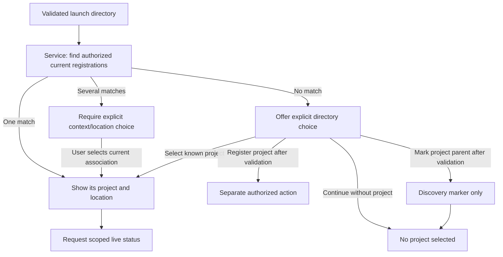

### Production ownership view

Proposed D2-D3 view. Solid arrows are typed requests or observations. The dotted
arrow is a presentation update. Boxes do not select process or transport details.

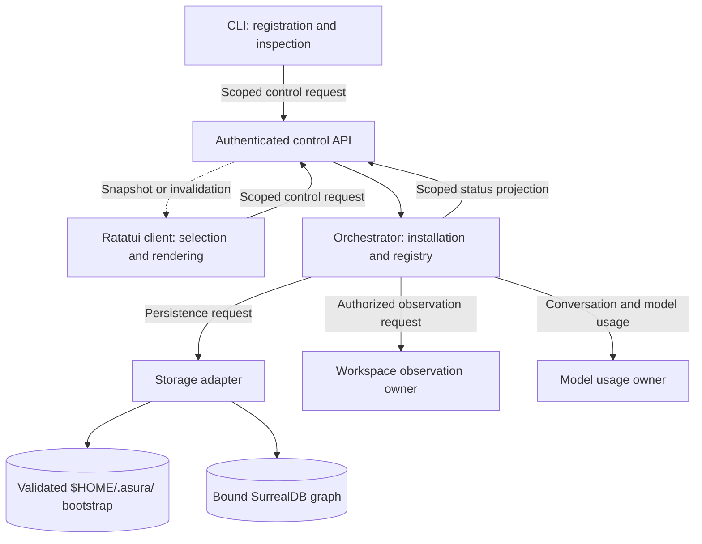

The orchestrator owns installation and registration identity. The configuration
resolver owns settings and provenance. The context subsystem owns graph evidence.
The selected D2 design must name the owner of read-only Git observations and the
source of context-window accounting. A storage adapter implements physical access
without becoming a second authority. The TUI owns the draft length and spinner
presentation, because those describe its editor and delivered activity view.

### Language and process boundary for the early slice

Required ownership, with detailed allocation still proposed in the
[language plan](../plans/architecture-and-design.md#proposed-language-ownership).
The Rust CLI/TUI and reusable control client run outside the Rust user-service
process. The selected Unix-domain socket carries scoped control requests.
The Rust orchestrator owns registry transitions and status projection inside
that service. Storage access and Git collection report to that owner; neither
may publish directly to a client or create a second registry.

The selected supervised Swift helper owns the first Foundation Models
implementation under the [model boundary](swift-rust-boundary.md). The early
status slice has no model operation and does not need that helper for status.
D1-D2 still decide whether narrow native identity or filesystem adapters require
Swift. Such an adapter would return evidence to the Rust owner, not own policy,
registration or publication. The Git observer's module, language and any helper
process remain D2/D4 decisions; this document does not select a new process.

## First-use and project-registration contract

Proposed behavior for D3/D6 review:

1. The client asks the service to attach. The service validates its OS-user
   identity and locates its own home directory. Client environment values cannot
   redirect the installation.
2. The service establishes exclusive active ownership. It recovers an existing
   installation or reports an uninitialized state. A new installation requires
   an explicit initialization request after checking for conflicting state.
   Damaged or ambiguous bootstrap enters recovery. The service verifies its
   saved graph binding before claiming graph readiness.
3. The client requests authorized context discovery. An empty registry produces
   an explicit first-use state, not an invented current project.
4. The user requests registration of a named existing directory. The service
   validates the working location, resolves aliases, checks authorization and
   pins its identity evidence. Immediately before its conditional durable write,
   the service rechecks path identity and current authority against that evidence.
   A mismatch detected before the write rejects the request without an
   association. The durable record binds the pinned object identity, not the
   current path occupant. After commit, the service rechecks the named entry.
   If replacement occurred across the commit, it returns a committed but stale
   association that cannot be used for status or work. Repeating the same
   request in the same context returns the existing association and its state.
5. The service returns context and location identities, registration revision and
   an inspectable configuration result. If several registrations match a location,
   the user selects one explicitly before work is admitted.
6. Selection changes only the client's view. A subsequent status request carries
   explicit context, location and optional conversation identities. The service
   rechecks current authorization and location validity before returning data.

The initial CLI command spelling and TUI onboarding controls belong to D6.
`asura project register <path>` is a proposed CLI spelling, not a selected
command. In-chat command integration must follow the
[command-system design](command-system.md) and cannot create a second registry.

### Registration sequence

Proposed D3-D6 sequence. Requests have stable IDs. An acknowledgement denotes
the stated durable result only after the relevant owner commits it. An ambiguous
transport result is resolved by request ID; the client does not send a fresh
registration with a new identity merely because it lost an acknowledgement.

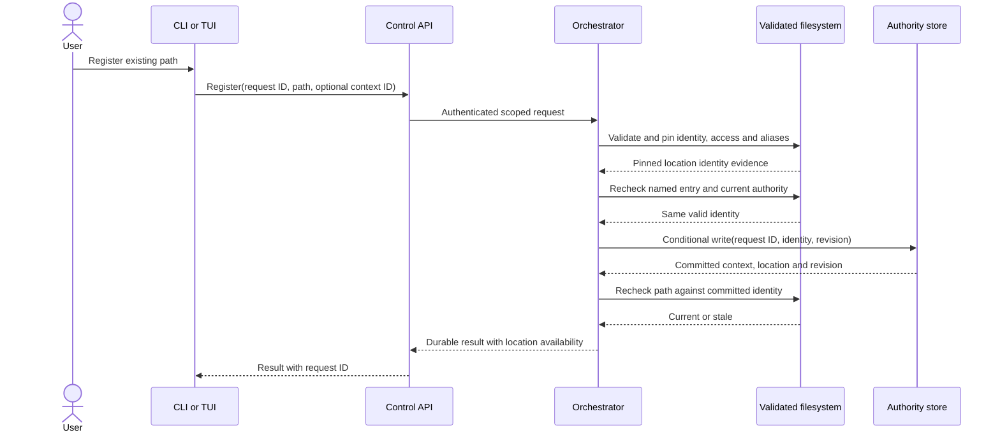

### Registration failure and reconciliation sequence

Proposed D3 failure view. A rejected check creates no registration. If the write
outcome is unknown, the owner resolves the original request ID before reporting
absence or success; no caller allocates a new operation to guess the result.

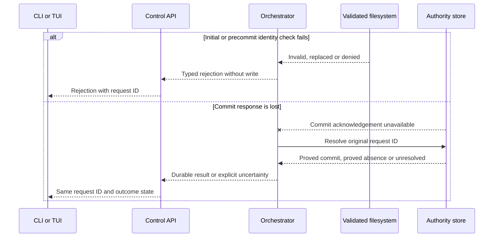

### Status refresh sequence

Proposed D3-D6 sequence. The client captures the selected scope and view
generation before sending. The service returns an authorized snapshot. A scoped
change notification is only a refresh trigger; it cannot replace authorization
or publish data for another selection. D3 must define notification identity,
replay position, coalescing and the bounded refresh rate.

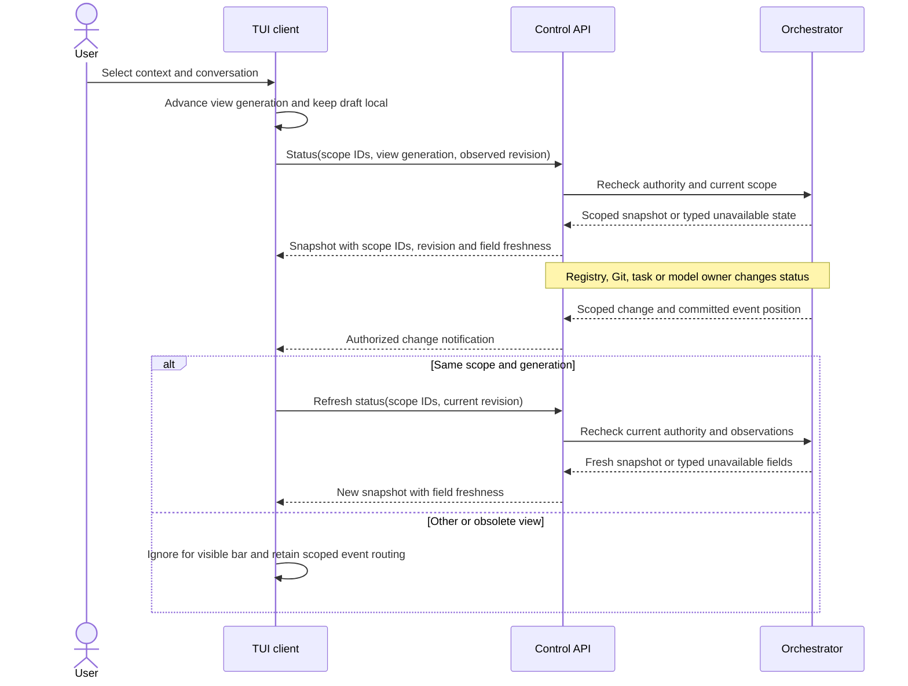

### Installation and registration states

Proposed state views. The service cannot publish a usable registry while its
installation identity or graph binding is uncertain. Registration is a separate
operation from service readiness; failure leaves existing registrations intact.

The first diagram covers initialization and restart recovery. A durable
PendingInit resumes the original graph operation. It neither creates a second
installation nor claims graph readiness.

#### Explicit initialization state

Proposed state view. Arrows name the durable condition or explicit user action
that permits each transition.

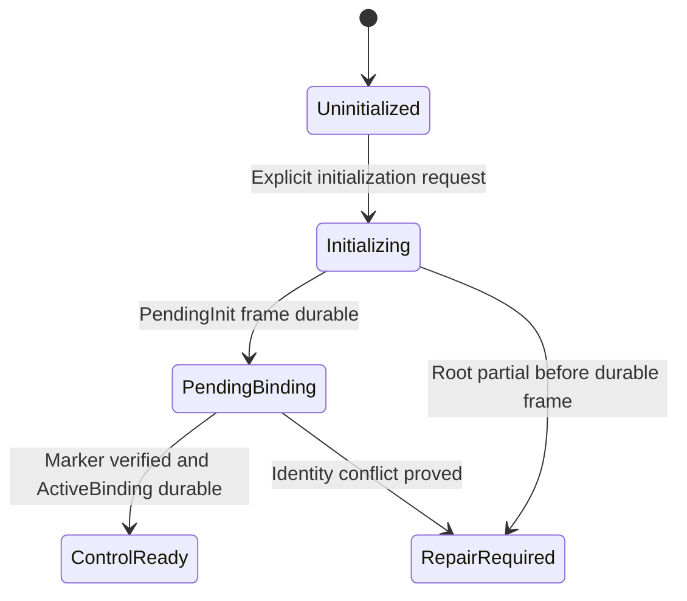

PendingBinding retains the original installation and operation IDs. The service
reports recovery status but does not call the installation GraphReady or admit
registration. A graph outage alone preserves PendingBinding for a later retry.

#### Restart recovery state

Proposed state view. Arrows are replay results after the service establishes
sole ownership. A valid pending frame resumes its original operation ID.

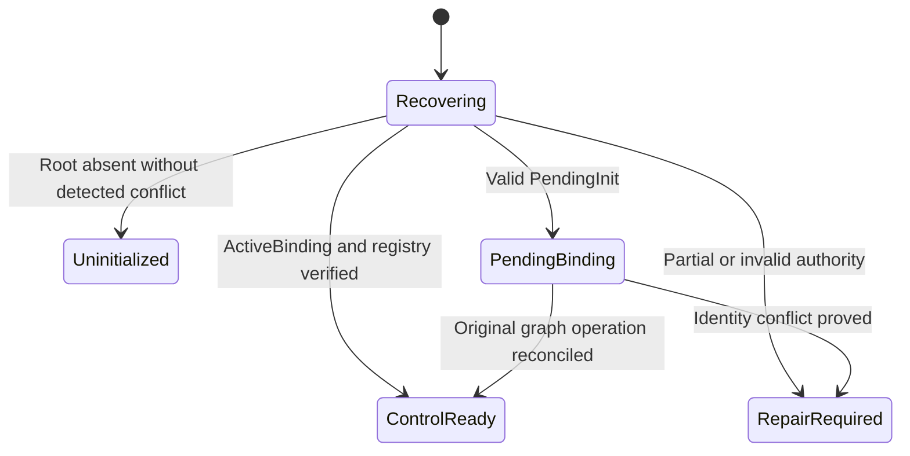

#### Bound graph availability state

Proposed state view after ActiveBinding. Arrows name verification and loss
events. ControlReady still permits authorized local status and registry
inspection while an external graph is unavailable. It cannot register a new
location or admit graph-dependent work. An owner loss returns to the
[service ownership flow](user-service-configuration.md#service-ownership-and-recovery).

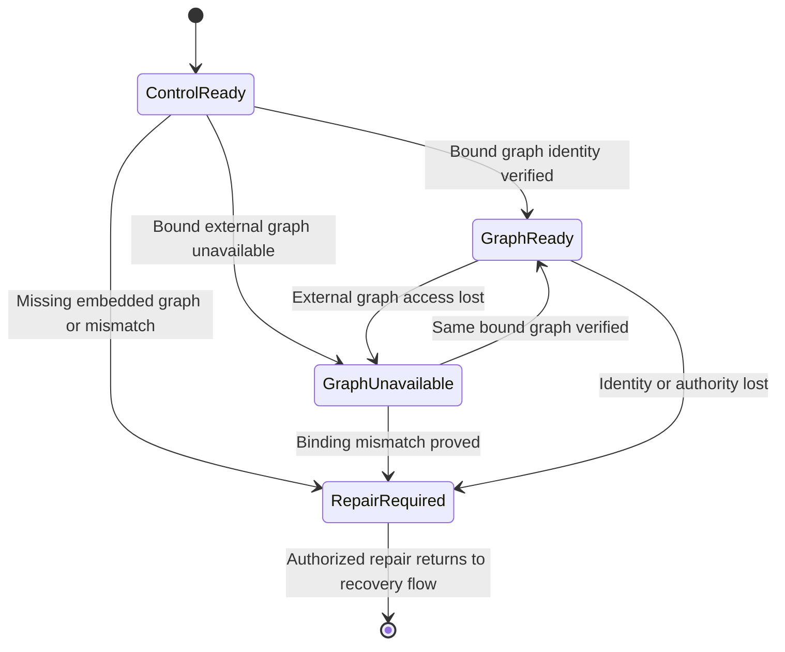

The next diagram describes a registration operation within a ready service.
The prior registry remains authoritative until a new association commits.

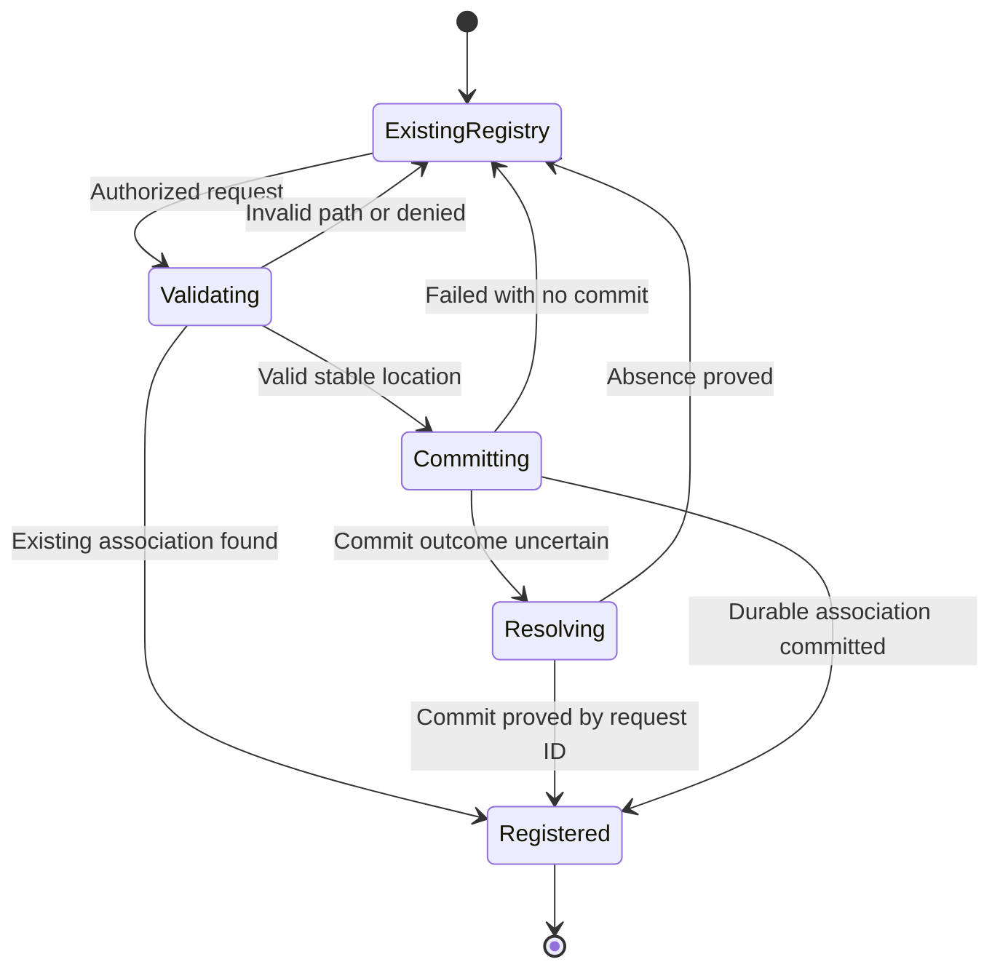

## Status snapshot and freshness

Proposed production control response, not an experiment-local Rust type. The
snapshot identifies its installation, project context, working location,
validated working directory and optional conversation. It includes a monotonic
scope revision, observation time
and availability per field. The API authorizes the entire scope before returning
any name, path, task count or model information. The client discards an event if
its scope or generation does not match the view it updates.

| Visible field | Source and ownership | Unavailable result |
| --- | --- | --- |
| Project name and path | Durable registration plus revalidated selected working directory, projected by orchestrator | Show unavailable scope; never substitute the launch directory |
| Branch, additions, deletions, merge or rebase | Read-only observation for the selected working location, owned by the selected workspace observer | Show `git ?`; omit Git fields for a verified non-repository |
| Draft character count | Current TUI editor state | Omit for empty draft |
| Running indicator | Delivered task state for the selected scope, projected by orchestrator | No inferred spinner when delivery is unavailable |
| Context-window percentage | Actual usage and limit for the selected conversation's effective model context, owned by the model/session contract | Show `?%` until both numerator and denominator are verified |
| Model name, version and fast mode | Active model configuration or session for that conversation, projected by its owner | Show an explicit unavailable value; never use host Codex metadata |

The Git observer must count working-tree additions and deletions against HEAD
without double-counting staged changes. It must report detached HEAD and active
merge or rebase as distinct typed states. A clean repository reports `+0-0`;
unknown observation never means clean. D3 selects observation freshness, limits,
invalidations and error codes. D4 selects the model-session usage source and
accounting semantics. Until I3 supplies actual model usage, the production client
may display `?%`; it must not estimate from draft size or fixture values.

The snapshot is a projection, not permission to access the filesystem or execute
work. Navigation does not change a task target. Each registration and status
request is authorized independently. Subscription reconnect must obtain a fresh
snapshot or replay from a verified revision before it marks the view current.

Status delivery must not delay local editing. The client can render the last
authorized snapshot only while its scope and revision remain valid. It labels
expired observations as unavailable, rather than retaining a branch or usage
value as if it were current. D3/D6 must select field-level freshness and the
visible stale-state treatment; the spinner uses delivered task state, not the
freshness of a Git observation.
The client coalesces repeated refresh triggers and applies a snapshot only to
the matching view generation. Disconnect, authorization loss, location
replacement and observation expiry remove claims of current status. Reconnect
obtains a fresh authorized snapshot before restoring a live label. The service
must continue to admit local editing and unrelated control work while a Git or
model observation is slow; D3/D7 must define and test the bound.

The installed macOS 27 Foundation Models SDK exposes model context size and
transcript token counting, but their relationship to Asura's full effective
context is unqualified. D4 must measure instructions, tools, retained history,
context transformation and invalidation before calculating a percentage. It
must not use cumulative session usage as a current-window numerator without
that evidence. Unknown remains `?%`.

### Publication and attachment validity

Proposed D3 refinement of the existing scope, freshness and owner-generation
requirements. The service control API owns disclosure checks. The orchestrator
owns the identity and revision used to assemble its projection. The reusable
control client owns attachment identity and response routing; the TUI owns view
generation and presentation. None of these checks grants new authority.

An observation can finish after its authorizing scope changes. Before publication,
the API must recheck the current owner, caller authority, registration identity
and logical working directory. An expired, replaced or revoked scope cannot
publish a previously collected branch, path or project name. The owner discards
the candidate and returns a disclosure-safe unavailable result. Repeating the
request remains bounded by the future D3 refresh and resource limits.

D3 must define how validation, queueing and invalidation are ordered. A check
before slow collection is insufficient. A check followed by an unguarded queue
is also insufficient when a queued response can escape after invalidation wins.
The protocol cannot retract bytes already delivered under valid authority; its
contract must identify the disclosure point and the handling of queued results.
This ordering mechanism remains a readiness blocker.

| Identity or order | Owner and purpose | Must not be substituted with |
| --- | --- | --- |
| Installation and service owner generation | Service establishes the current authority instance during attachment | A reusable socket path or process ID |
| Attachment identity | Control client retires outstanding responses when a connection ends | The TUI's unchanged project selection |
| Scope identity and registration revision | Orchestrator identifies the current project, location and logical directory | A pathname or display name alone |
| View generation | TUI prevents a prior selection from changing the current view | A server authorization decision |
| Observation order and freshness | Projection owner and observer distinguish newer observations within a valid scope | A registration revision or wall-clock timestamp alone |

A reconnect retires the prior attachment even when the endpoint, project and
view generation are unchanged. The client obtains the current service identity
and a fresh authorized snapshot before restoring live status. A reply retained
from the old attachment cannot satisfy that refresh. Per-field expiry continues
to apply while requests are outstanding.

Within one attachment and view, two observations may complete out of order.
The owner and client must not allow an older result to replace a newer accepted
observation. Registration revisions alone cannot order Git changes that perform
no registry write. D3 must select observation ordering and its reset semantics;
D7 must qualify those semantics across restart. The wire schema, counter format,
clock choice and numeric freshness bounds remain open.

#### Observation publication race

Proposed interaction view. Arrows show candidate collection, a final disclosure
decision, and client routing. The final check and publication need the D3 ordering
contract above; the sequence does not claim an atomic OS or database mechanism.

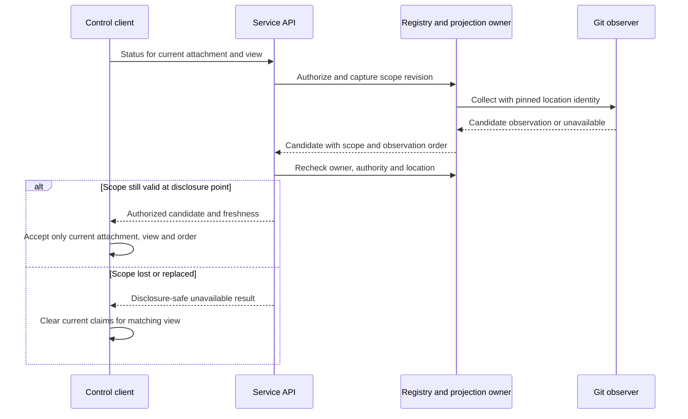

### Status data relationships

Proposed logical model. IDs and revisions are contracts; physical tables and
file formats remain D3 decisions. A conversation is optional for project-level
status; context usage requires a selected conversation and model session.

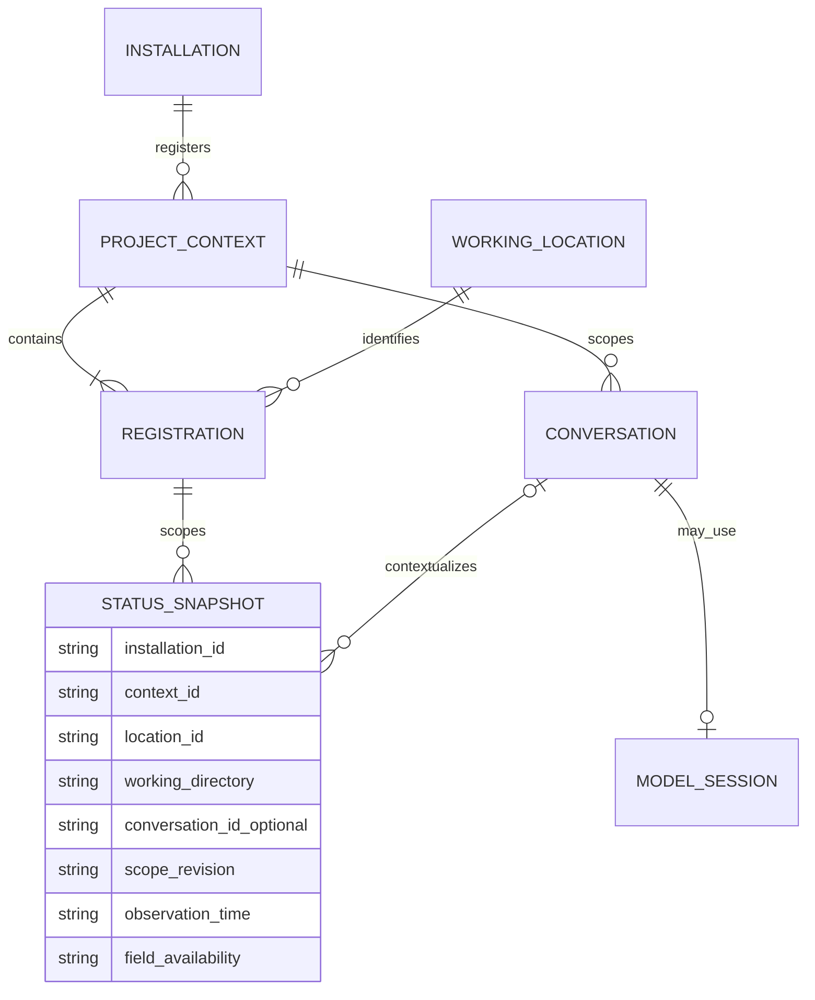

## Failure, security and operations

The D1 threat model must define home resolution, private permissions, symlink
and replacement defenses before directory creation. D2 must select one-owner
arbitration, service supervision and authenticated attachment. D3 must select
record placement, format versions, initialization commit point, graph binding,
atomic update and recovery. A partial initialization cannot become a second
installation after restart. External graph mode still writes only its local
bootstrap under `.asura/`; it cannot create embedded graph files as fallback.

Registration must reject an unreadable, replaced or unstable path. The service
must not expose registration existence or metadata to an unauthorized caller.
The registry records validated object identity, not a path string alone. No
separate database commit can make a filesystem pathname stay unchanged. The
service checks again immediately after commit and before each later use. A
replacement makes the committed registration stale; the service does not retarget
it or silently delete its history. D1-D3 must select identity evidence and the
recheck mechanism. Inject replacements before the precommit check, between that
check and commit, and immediately after commit.
Filesystem reads for Git status use only the selected location and a bounded,
read-only observer; D1-D3 must choose how to enforce and measure those bounds.
A slow Git read or unavailable database cannot block local typing or falsely
report a current snapshot. Status errors remain visible and recoverable.

Backups must preserve installation identity, graph binding, registry and any
authority records as one recoverable set. D3 must define a consistent backup
point and restore validation before this feature is implemented. Neither a
copied directory nor a changed external URL may silently rebind an installation.
An absent root alone cannot distinguish first use from complete deletion of a
prior installation. D3 must define the limits of conflict detection and the
warning before explicit reinitialization. Automatic launch must not create a
new identity or graph merely because `.asura/` is absent.

For the I1 slice, the [ordinary-file authority journal](persistence-recovery.md)
is the single local authority for installation identity, binding, project
registry and request outcomes. The first PendingInit frame is the logical
bootstrap record; ActiveBinding and later frames advance that same authority
stream. This keeps authorized registry inspection available when a bound
external graph is temporarily unavailable. New registration and graph-dependent
work remain gated until binding verification succeeds. The bootstrap fields
include format version, installation ID, graph mode and identity, binding
generation, pending operation ID and phase. They contain credential references,
not secret values. D3 must fix encoding, durability, compaction and rollback
detection before this becomes an implementation contract.

I1 must contain the minimum adapter needed to establish and verify both embedded
and external graph identities. I2 adds context-graph semantics, queries and
workspace observations. This refines the [implementation plan](../plans/implementation.md#i1-local-control-and-durable-lifecycle)
without moving the full context subsystem into I1.

## Validation contract

Each case needs unit, integration and end-to-end evidence at the increment that
delivers its boundary. I1 proves bootstrap and registration end to end through
the real CLI; I4 repeats those journeys through the real TUI. I2 proves Git
observation through its actual service and CLI boundary, and I4 repeats its
presentation. I3 proves model usage through its actual model/service boundary,
and I4 repeats the conversation view. D7 selects exact commands, macOS versions,
supported terminals, timing targets and fixtures.

| Case | Initial state and trigger | Required result and evidence |
| --- | --- | --- |
| PBS1 | No installation; two clients launch concurrently | One installation and owner; both attach to the same registry. Test arbitration in-process and across real processes, with CLI E2E at I1 and TUI E2E at I4. |
| PBS2 | Missing root, or existing root with missing or corrupt bootstrap; launch or restart | Missing root presents explicit initialization with data-loss warning; partial or ambiguous state requires repair. No automatic new identity or embedded fallback. Inject faults at each initialization commit point and reopen through CLI. |
| PBS3 | Valid directory, alias, repeated registration and overlap; replace the path before, during or after the commit interval | Stable identity for the same association and explicit selection for overlap. Reject a prewrite mismatch; if a replacement crosses the commit, preserve the recorded identity but report it stale. No status or work may follow the replacement. Exercise aliases, swap races and two clients. |
| PBS4 | Location replaced, removed or denied after registration | Stale or unavailable scope; no silent redirect or leaked metadata. Exercise a real filesystem and TUI status. |
| PBS5 | Git clean, dirty, detached, merge, rebase, non-repo and observer failure | Typed observations, correct counts, explicit unknown state. Compare real Git fixtures and rendered TUI cells. |
| PBS6 | No model session, then active session with measured usage | `?%` until verified; percentage belongs to selected conversation. Test owner contract, real model integration and project switching. |
| PBS7 | Delayed status event from project A after selecting B | B remains selected and unchanged. Exercise event routing with two projects and real client/service transport. |
| PBS8 | External graph configured, unavailable or changed after binding | Preserve binding and local bootstrap; no embedded graph or fallback. Exercise a real external SurrealDB server. |
| PBS9 | Git, task and model observations change while the user edits; then delivery stalls, disconnects and reconnects | The matching bar refreshes without blocking editing. Expired fields become unavailable, the draft survives, and reconnect restores only a fresh authorized snapshot. Unit-test scope generations and coalescing; integrate actual observer and stream faults; repeat through the real TUI in both terminals. |
| PBS10 | Launch inside one registered location, an overlapping location, an unregistered directory or an unavailable prior selection; then switch between known projects | A unique authorized launch match becomes visible first. Overlap and no match require an explicit choice; the unmatched directory is not silently classified or replaced with the last viewed project. Each known project restores its last valid logical directory without changing process cwd. No path hint creates registration, conversation, task or grant. Unit-test priority and ambiguity; integrate real aliases, revocation and replacement; inspect startup in both terminals. |
| PBS11 | Explicitly mark an unmatched directory as a project parent; inspect child candidates, aliases, changes and a large tree | The marker aids bounded discovery only. No child is registered, selected for work or granted access automatically. Unit-test classification and limits; integrate real filesystem aliases, escaped symlinks and changes; use the real TUI to register a chosen child separately. |

Real-terminal end-to-end checks run in Ghostty and Terminal.app, matching the
user's equal-support requirement. The synthetic experiment's PTY and fixture
checks can inform presentation tests but cannot satisfy any service, persistence,
Git, model or authorization case above.

### Detailed status race cases

These cases refine PBS4, PBS7 and PBS9. D7 must keep each trigger below as a
separate executable case. Their required environments are supported macOS,
real client/service transport and real Git fixtures. TUI evidence runs separately
in Ghostty and Terminal.app. No runtime result is claimed here.

#### PBS12: Scope changes before status disclosure

**Initial state:** A caller has a valid registration and an observation is in
progress or awaiting publication.

**Trigger:** PBS12-A revokes scope during collection; PBS12-B replaces the
location during collection; PBS12-C invalidates scope after collection while
the result is queued. Use distinct schedules at the D3 disclosure point.

**Required result:** If invalidation wins, no old scoped metadata is disclosed.
The service reports unavailable without following a replacement path. If valid
disclosure wins first, subsequent invalidation clears current claims under the
selected delivery contract. The design does not promise retraction of delivered
bytes.

**Unit checks:** Exercise both event orders at the publication decision.

**Integration checks:** Delay the real observer and delivery queue independently;
change authority or replace the real directory before releasing each barrier.

**End-to-end checks:** Keep typing during each fault and inspect the resulting
unavailable status and preserved draft in both terminals.

#### PBS13: Old attachment response after reconnect

**Initial state:** A client has selected project A and requested its status.

**Trigger:** PBS13-A disconnects and reconnects to the same owner; PBS13-B restarts
the service before reconnect. Deliver the retained old response after the new
attachment, without changing project A or its view generation.

**Required result:** The old response cannot restore live status. Only a fresh
snapshot from the current authorized attachment can do so. Owner replacement
cannot reuse an obsolete authority identity.

**Unit checks:** Retire attachment routing independently of view generation.

**Integration checks:** Retain a real transport response across disconnect and
across real service restart; verify current identity negotiation and rejection.

**End-to-end checks:** Reconnect the selected project in both terminals; verify
that drafts survive and status remains unavailable until fresh data arrives.

#### PBS14: Older observation completes last

**Initial state:** The same scope, attachment and view have two in-flight Git
observations; the registration revision remains unchanged.

**Trigger:** PBS14-A delivers the newer observation first, then the older
observation. PBS14-B expires the accepted observation while the older result
is pending.

**Required result:** The older result cannot replace the newer values or revive
expired status. Unknown and verified clean remain distinct.

**Unit checks:** Exercise observation ordering, duplicates and expired results.

**Integration checks:** Use real Git changes and controlled completion barriers
without changing the registry; verify bounded refresh behavior.

**End-to-end checks:** Edit a draft while repository status changes; inspect the
bar for regression and expiry in both terminals.

## Decisions required before implementation

### Decision register

This register distinguishes owner-selected scope from mechanisms that still need
review. An open entry blocks only the packet whose behavior depends on it.

| ID | Current status | Decision and next evidence |
| --- | --- | --- |
| PBS-D1 | Selected by owner | First initiation registers an existing directory; no source-project or repository creation. |
| PBS-D2 | Required by architecture | One backend per OS user owns `$HOME/.asura/` and the registry; clients use scoped control requests. |
| PBS-D3 | Selected storage boundary; mechanism proposed | I1 uses only ordinary files and SurrealDB. The [authority recovery design](persistence-recovery.md) proposes a framed ordinary-file journal; D3 must fix its format and recovery. |
| PBS-D4 | Proposed | I1 contains minimal embedded/external graph-binding verification; I2 adds graph semantics. Qualify both modes before I1 graph-ready claims. |
| PBS-D5 | Principal, installation and Unix socket selected; remaining mechanism proposed | I1 uses a standalone command, per-user service and one macOS-user principal. The [service design](system-architecture.md) proposes peer-UID checks and owner fencing over the selected Unix socket; D1-D2 must qualify homes and mechanism. |
| PBS-D6 | Open | D3 chooses conflict detection for absent roots, atomic explicit initialization, authority-store schema, commit-time location identity checks, migrations and cross-store backup/restore. |
| PBS-D7 | Initial selection and parent role selected; other UX open | D6 uses a unique authorized launch-directory match first. Overlap or no match requires explicit choice; no automatic last-viewed fallback. A marked project parent is a discovery container only. Project naming, exact first-use controls, unavailable-status wording and measurable responsiveness remain open. |
| PBS-D8 | Open by later increment | D4 defines Git observation and actual model-context accounting; I4 consumes their typed results. |

The design spans four delivery increments. Readiness is assessed per bounded
packet; a missing I3 model-usage contract does not prevent an I1 packet from
implementing truthful installation and registration behavior. The status client
must still show unknown usage until the real owner supplies it.

| Packet | Prerequisite design and delivered capability | Cannot claim until |
| --- | --- | --- |
| I0 contracts and toolchain | D2 module and process topology, D3 schema source, D7 checks | Clean build, version negotiation and cross-language contract checks pass |
| I1 service bootstrap and registry | D1 home/identity threat model, D2 owner arbitration, D3 installation/registry/configuration/control contracts and minimal binding adapter | Concurrent startup, restart, denied caller and both graph-binding modes pass |
| I2 workspace observation | D1 filesystem boundary, D3 scoped status API, D4 observation owner | Real Git fixtures and source-access denial pass |
| I3 context usage | D4 model-session and token accounting contract | Actual on-device session evidence and invalidation checks pass |
| I4 TUI status presentation | D6 first-use/navigation/status UX using I1-I3 contracts | Real service and real-terminal journeys pass in both supported terminals |

These packets refine the [I0-I4 sequence](../plans/implementation.md#increment-sequence);
they do not skip other deliverables or acceptance gates in those increments.

| Stage | Decision needed |
| --- | --- |
| D0 | First initiation is registration of an existing directory; a project parent is a discovery container only (selected). Review project naming and numerical status responsiveness targets. |
| D1 | Select macOS identity, home and working-location validation, filesystem race defenses and Git read boundary. |
| D2 | Select repository layout, service supervision, process topology, authentication bootstrap and one-owner fencing; complete the selected Unix-socket control contract. |
| D3 | Specify installation files and schema, graph/registry placement, atomicity, migration, backup/restore, request IDs, revisions, status API, disclosure ordering, attachment identity, observation ordering, freshness and error codes. |
| D4 | Specify model-session identity, effective context-window numerator/denominator and invalidation. |
| D6 | Select CLI spelling, first-use TUI journey, status unavailable presentation and navigation controls. |
| D7-D8 | Pin toolchains and test environments, render diagrams, review the complete contract and approve bounded implementation packets. |

The first implementation packet cannot begin until these decisions are resolved
for its scope and the [implementation entry gate](../plans/implementation.md#entry-gate)
is satisfied. The service may deliver truthful registration and Git status before
model usage exists, provided the context field remains explicitly unknown.

## Proposal checks

On 2026-09-24, Mermaid CLI 11.16.0 rendered all seven diagrams. Visual inspection
found their owners, branch labels, transitions and entities legible at normal
document width. The local links resolve to existing files and headings.
`git diff --check` and a trailing-whitespace scan passed. These checks validate
the document's form; they do not resolve its open design decisions or establish
runtime behavior.

On 2026-09-25 the live-refresh sequence was rendered with Mermaid CLI 11.16.0
and visually inspected. The revised initial-selection and status-relationship
diagrams were also rendered and inspected after the launch-directory and logical
working-directory decisions. Local links and `git diff --check` passed. These
sequences and PBS9-PBS10 remain design contracts, not runtime evidence.

On 2026-09-26, Mermaid CLI 11.16.0 rendered the new observation-publication
sequence. Visual inspection at a 1000-pixel document width found the request
labels and both disclosure branches legible without clipping. The review added
PBS12-PBS14 as acceptance specifications; none has runtime evidence. Local-link,
whitespace and baseline-scope checks passed for the two status design documents.
Publication ordering, protocol identity encoding and numerical bounds remain
open D3/D7 decisions.
