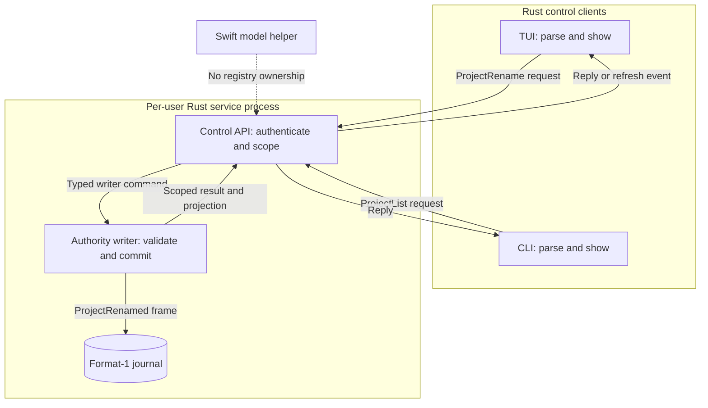
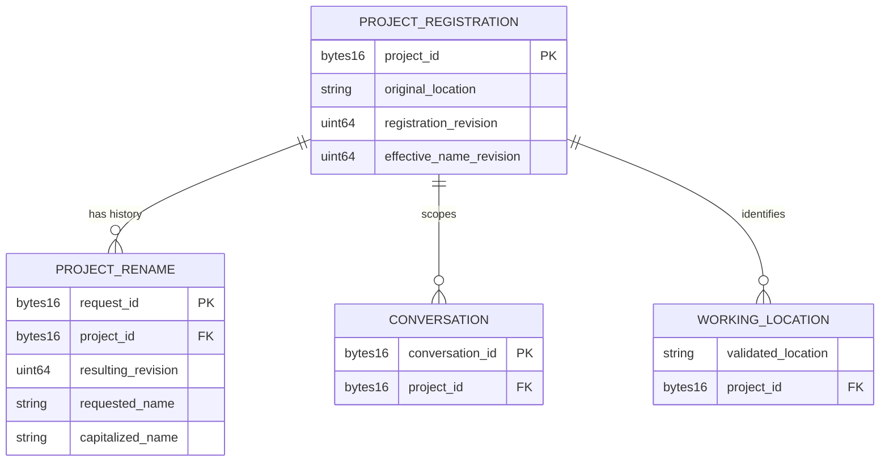
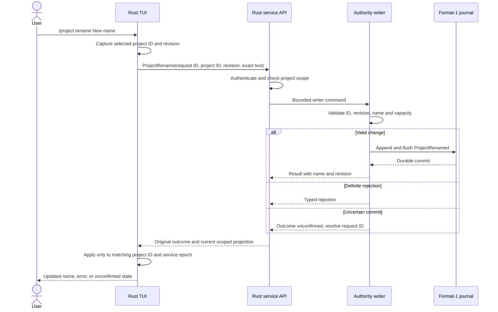
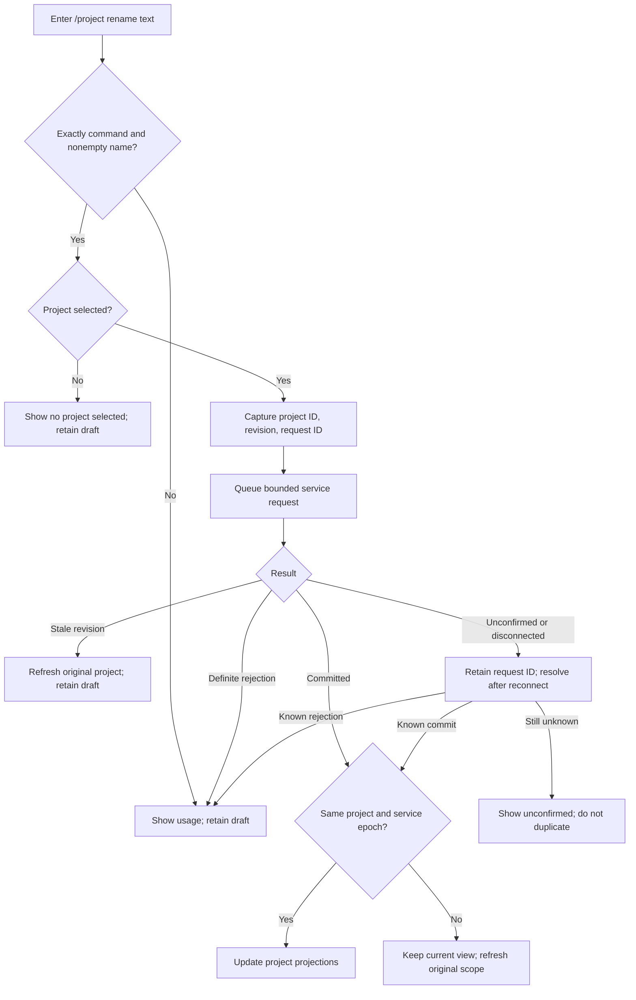

# Project names and rename

Status: selected design for the owner-requested capitalized project names and
`/project rename <name>`. The storage, service, client, CLI, and TUI paths are
implemented. Focused unit, service, and isolated terminal journeys pass; the
full PN1–PN12 acceptance matrix remains open.
This design amends the earlier project-registration slice, which left naming open
and implemented no registration updates. Project identity and location rules in
[conversation admission](conversation-admission.md) still apply.

## Behavior and ownership

A registered project has a stable project ID and an editable display name. Its
name is presentation data. Renaming never changes its ID, registered location,
filesystem identity, visibility, conversations, memory, queued input, or grants.
The user names the **selected** project with `/project rename <name>`. The command
does not select a project or create a project. The status bar, selector, project
list, and CLI list show the current capitalized name. Each also retains enough
location or ID context to distinguish two projects with the same name.

The Rust authority writer is the sole owner of the name and its separate name
revision. The registration revision remains 1.
The Rust service authenticates, scopes, and routes the typed control request to
that writer. The Rust client carries the request and result. The Rust TUI parses
the command, captures the selected project ID, and renders the resulting
projection. The noninteractive CLI lists the same names from the service
projection; this slice does not add a one-shot rename command. The Swift
model helper has no project-registry role. The TUI never writes project names
into a file or SurrealDB directly. The existing format-1 journal remains the
authority; any graph document is a rebuildable projection and cannot rename a
project independently.

### Ownership view — selected design

Arrows identify control or projection flow. The service process owns the writer;
clients and the Swift helper cannot edit the registry.

## Name data and presentation

The immutable registration record keeps its original location, device, inode,
project ID, and registration revision 1. The effective project name is the last
valid `ProjectRenamed` value for that ID, if present. Before the first rename, the
service derives the name from the final component of the registered location.
The name revision is 0 until the first rename and increases by one per change.
Apply the same display capitalization to the derived component. If it fails
validation or exceeds 128 bytes, use the stable `Project ` fallback instead.
It never derives it from the client's launch directory or a mutable symlink.
For a root path or a component with no alphabetic character, use `Project ` plus
the first eight hexadecimal digits of the project ID. This fallback is stable.

Names are UTF-8 and at most 128 encoded bytes both before and after
capitalization. They must be
nonempty after trimming ASCII spaces. Reject leading or trailing ASCII spaces,
ASCII or Unicode control characters, line breaks, and bidi formatting controls.
Permit internal single spaces and ordinary printable punctuation. The client
may keep the exact draft on a rejection; the service applies the same validation.
The service finds the first Unicode alphabetic scalar and applies Unicode default
uppercase conversion to it. It preserves all other scalars, including their case.
If uppercase expands that scalar, the 128-byte limit applies to the result. A
user-supplied name without an alphabetic scalar is invalid. The default fallback
handles filesystem components without one. This is display capitalization, not
locale-sensitive title casing or identity normalization.

The writer stores the capitalized value verbatim. Names need not be unique.
Neither case folding nor Unicode normalization participates in project lookup:
all commands and links use the stable project ID. A project picker shows its
name together with a shortened location or ID when names collide. A rename with
a new request ID appends a frame and increments the name revision even if the
displayed text is unchanged. Only an exact retry of the original request ID
returns the original result without a new frame.

### Data view — selected design

The diagram describes logical state, not a second physical registry. Cardinality
and revision changes are governed by the journal records below.

## Control and journal contract

Add a typed `ProjectRename` request to the existing protocol **0.1** envelope:
16-byte request ID, 16-byte project ID, expected name revision, and the
unmodified name text. The reply identifies the original request result: project,
effective name, resulting name revision, and whether the visible text changed.
It also carries a separate `current_project` projection from the latest replay
state. An exact retry after a later rename returns the original result and the
newer current projection; clients display the latter and never lower a known
name revision. Add `name`
and `name_revision` to `ProjectReply`; `registry_revision` stays 1. Old peers
that omit the new fields use the service-derived default from the registered
location. The service rejects a rename request from a peer that lacks
the typed operation rather than treating it as conversation text. No protocol,
API, or journal format number changes.

Use a new format-1 `ProjectRenamed` kind 20. Its bounded payload contains request
ID, request digest, project ID, expected name revision, resulting name revision,
exact requested name, and capitalized name. The digest covers command kind,
project ID, expected name revision, and exact requested name bytes. Replay
recomputes the digest and capitalization from the retained requested name.
The writer validates the current project
and name revision, name, journal capacity, and request identity before append. It
atomically appends and flushes one frame; only that commit changes the name.
Replay requires an existing project, a valid digest/name, and a resulting
name revision exactly one greater than the prior name revision. It rebuilds the
name and request-result index. An unknown kind remains a hard replay error for
older binaries, so rollout must upgrade the writer before using rename.

Existing `ProjectRequestAlias` records still refer to immutable registration
revision 1. Rename replay must not mutate that field or replace the original
registration record; otherwise old aliases and client validation would fail.
Registration retries retain their historical request identity and must never
reset the effective name. New registration aliases still point at the existing
project ID and report its current name.

The expected revision prevents one client from overwriting another client's
rename. A stale revision returns `stale_project_name_revision` with the current
project projection; it writes nothing. A request ID replayed with the same
digest returns the committed result and a separate current projection even when
the current name has changed again. Reuse with different content returns
`request_conflict`. A definite
validation failure writes nothing. An uncertain append or missing reply retains
the request ID and resolves it against the writer's durable request index;
the client does not invent a replacement request ID for automatic retry.

### Interaction — selected design

The sequence marks the journal commit and the late-result guard. A selected
project is captured before transport dispatch; later selection changes cannot
retarget the command.

### Command flow — selected design

All edges are mutually exclusive decision outcomes. The parser keeps an invalid
draft. A valid command captures scope once and exits through an explicit result.

## Async execution, failure and security

The command parser and render loop perform no journal or network I/O. The TUI
uses one dedicated project-admin transport worker with one in-flight request and
no pending backlog. This thin worker carries typed requests; it owns no project
policy. If its slot is busy, the TUI reports busy and retains the draft. The
model/conversation worker remains independent, so a running model does not block
rename. A name with spaces is parsed from the full remainder after the command,
not split into separate arguments. The existing bounded event delivery returns
results to the TUI's scoped projection. The TUI captures an editor-interaction
generation with the submitted command. It clears that command after success only
if both the generation and exact text still match; an equal newer draft is not
cleared. Definite service rejection retains the draft and request reason.
Unknown transport outcome retains the original request ID for `/retry`.
The service uses the existing bounded control frame and serialized writer queue;
rename cannot bypass that owner. The client request deadline is 3 seconds. The
eight-slot writer uses its existing 2-second mutation deadline and settlement
rules. Cancellation of client waiting does not
cancel an uncertain append. If the writer cannot settle, service status reports
repair/unavailable while the UI remains responsive. On overload the service
returns its typed busy result and the TUI retains the command draft. On restart,
replay rebuilds the name before publishing project views. Shutdown settles or
retains uncertain writer ownership under the existing cleanup contract.

The service checks the authenticated local peer and current project visibility
before disclosing names or accepting a rename. The supplied name is untrusted
text; reject control and bidi formatting characters to protect terminal output.
The command has no filesystem effect and no model or tool execution. It does not
grant access to project content. Log project ID and result code, not the new name,
unless the audit contract explicitly authorizes content logging.

Existing limits remain: 64 projects, 40 KiB project-list reply, 64 KiB journal
frame and 8 MiB journal. The 128-byte name and one-writer command keep one rename
within those bounds. A full journal rejects the mutation without altering the
effective name. A rename does not extend project-list pagination by name; pages
still use project IDs, so concurrent renames cannot skip or duplicate IDs.
Clients can refresh rows whose revision changed between pages.

## Acceptance cases

Each case needs unit, integration, and real end-to-end evidence before runtime
completion is claimed. Tests use a private Asura home and stop any service they
start. The terminal journey checks both visual capitalization and command flow.

| ID | Initial state and trigger | Required result | Evidence |
| --- | --- | --- | --- |
| PN1 | Register a directory named `asura`; list it | Name is `Asura`; ID and location match registration | Unit derivation; service registration/list integration; TUI and CLI end-to-end |
| PN2 | Rename selected `Asura` to `my project` | `My project` appears in status, selector and lists; ID, path and conversations do not change | Unit normalization; journal/service integration; TUI rename and CLI list end-to-end |
| PN3 | Two projects have the same name; rename one | Both remain selectable by distinct ID/location; only target changes | Unit projection; two-client integration; TUI selector end-to-end |
| PN4 | No selection, malformed text or terminal controls | Typed rejection; draft retained; no frame | Parser and validator units; API integration; TUI end-to-end |
| PN5 | Clients A and B read name revision 0; A renames, then B submits | A gets name revision 1; B gets stale revision and current projection; no lost update | Writer unit; concurrent service integration; two-client end-to-end |
| PN6 | Reply is lost after commit; same request ID resolves | Exactly one rename frame; original result returned; new request ID not generated | Replay/idempotency unit; fault integration; reconnect end-to-end |
| PN7 | Old registration alias exists, then rename and restart | Alias replays against registration revision 1; effective name remains renamed | Replay unit; real restart integration; CLI list end-to-end |
| PN8 | Project A command is in flight; UI selects B | Late A reply cannot rename B's displayed status or selector entry | Scope unit; delayed API integration; TUI end-to-end |
| PN9 | Writer stalls, queue overloads or journal fills | UI stays responsive; busy/uncertain result truthful; no partial name | Timeout unit; fault integration; TUI responsiveness end-to-end |
| PN10 | Unicode name uppercases to multiple scalars or exceeds limit | Deterministic capitalized UTF-8 or definite rejection; never truncate | Unicode unit; API integration; TUI end-to-end |
| PN11 | Model is running and project-admin worker is free; rename selected project | Rename completes without waiting for model; model keeps its project ID and inputs | Worker unit; concurrent service integration; TUI/model end-to-end |
| PN12 | New request ID renames to the already displayed name | New frame and name revision commit; exact same-ID retry returns the original result | Writer unit; restart integration; TUI end-to-end |

PN11 requires a running model to prove independence. The other end-to-end cases
need no model, external database, or Swift process. Verify the actual macOS TUI
and the real per-user Rust service.

## Integration dependencies and proof limits

The implementation packet must update the control schema, client, service,
authority codec/replay/writer, CLI/TUI command parser, project projections, help,
and the project-list/display tests. It must update the earlier no-update and
open-name statements in `conversation-admission.md` and
`production-bootstrap-status.md`; this document governs the new rename scope.
The managed input queue remains independent because rename preserves project ID.

Recorded checks for this implementation include the embedded storage suite,
service unit and isolated integration tests, 154 CLI unit tests, and the
isolated TUI lifecycle and PTY journey. The terminal journey exercised rename,
restart persistence, the CLI project list, and cleanup of the test backend.
The final client timeout and delayed-list race fixes have unit coverage. The
isolated PTY suite passed again after those changes. PN11 still needs a real
running-model journey. Do not treat these checks as completion of every
fault and end-to-end cell in PN1–PN12.
