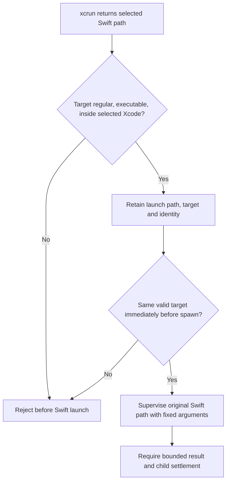
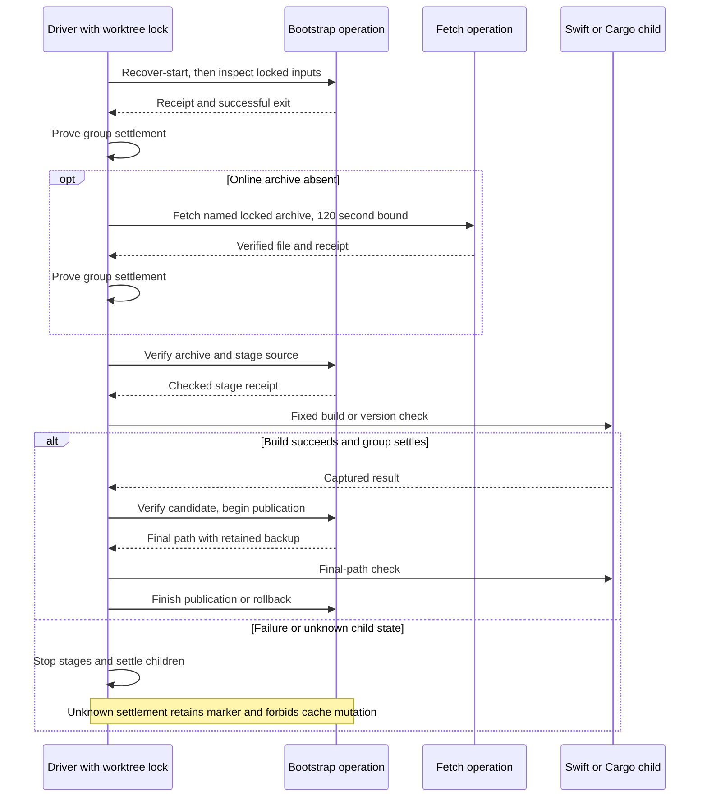
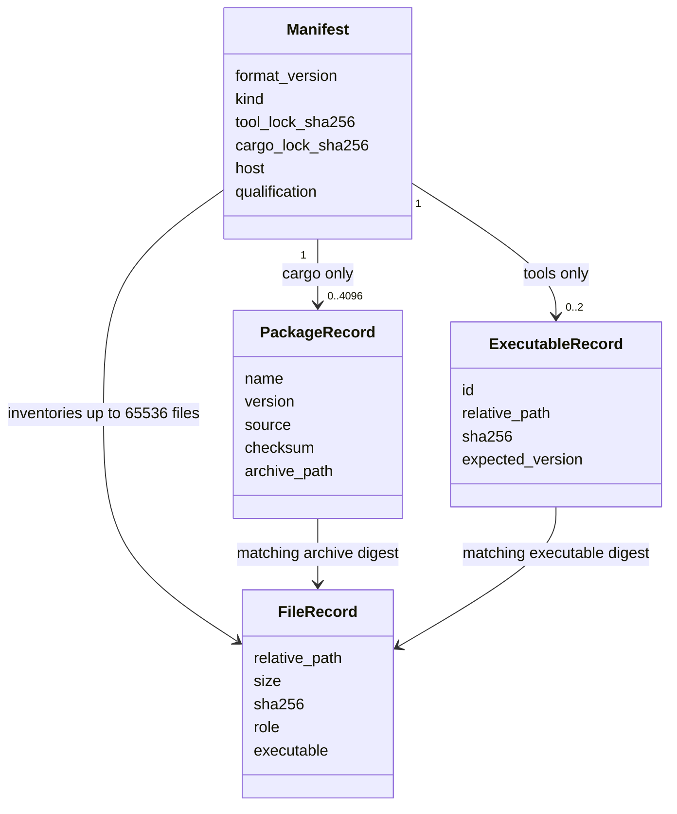
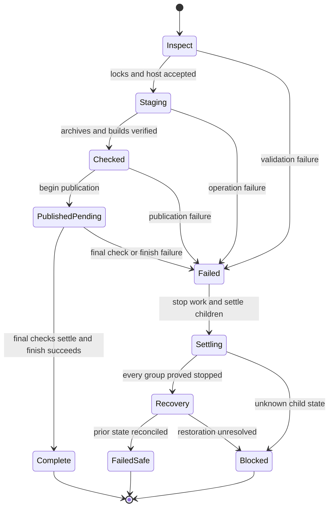

# Protobuf cache preparation

Status: selected PB0.3 detail design, approved by the owner on 2026-09-26.
The owner authorized its implementation within PB0.3.
No behavior in this document is runtime proof.
The owner approved the Swift launch correction when resuming PB0.3 on 2026-09-26.
The driver suite now passes its native process-settlement cases. Live preparation
is in progress and is not yet qualified. The owner selected the qualified-toolchain
cleanup contract on 2026-09-26. The
[cleanup correction](protobuf-process-settlement.md) records its mechanism,
residual discovery risk and required qualification before live preparation.

The [bootstrap design](protobuf-toolchain-bootstrap.md) owns tool identities,
cache roots, one build per worktree, deadlines and recovery requirements.
The [implementation packet](../plans/protobuf-bootstrap-implementation.md)
owns delivery order. This document proposes the missing operation and data
contracts. It does not change the model or service protocol.

## Scope and decisions

PB0.3 verifies archives, extracts source, builds and qualifies the Swift generator,
and prepares a Cargo snapshot for the current lock. PB0.4 adds the smoke schema,
Rust build script, Swift root package, plugin and exchange executables.
The full portable snapshot remains unqualified until those targets pass offline.

| Review decision | Proposed choice | Reason |
| --- | --- | --- |
| P3-D1 | Driver owns every process; bootstrap operations spawn no children | Reuse the existing supervisor and settlement proof |
| P3-D2 | Fixed operations, receipts and manifests below | Make preparation and partial failure implementable |
| P3-D3 | Add exact `toml` 1.1.4+spec-1.1.0 with only `std`, `serde`, `parse` features | Reuse a TOML parser instead of maintaining a Cargo syntax subset |
| P3-D4 | Approved 2026-09-26: accept only the locked leading PAX comment | Permit the measured source archive without accepting extraction metadata overrides |
| P3-D5 | Initial Cargo build precedes full snapshot manifest validation | Break the verifier bootstrap dependency, with the restricted copy and Cargo checksum checks below |

The owner approved P3-D1–P3-D5 on 2026-09-26. Review the changed dependency
graph before executing any new dependency build.

## Ownership and fixed operations

Selected mechanism. The standard-library driver keeps the worktree lock and
incomplete marker. It owns process creation, deadlines, output and cleanup.
The Rust bootstrap crate owns lock parsing, archive policy, manifests and
published cache mutation. Swift owns generator compilation only.

The bootstrap binary accepts internal fixed operations. These are not general
user commands. The driver supplies a canonical worktree root and a unique run
directory beneath `.build/`. The binary rejects extra arguments and paths outside
that root. It never reacquires the worktree lock or spawns a process.

The complete internal argument grammar is
`<binary> <operation> --root <absolute-worktree> --run-id <run-id>`.
Argument order is fixed. There are no optional flags. The root must equal the
driver's canonical worktree. The operation selects inputs from the paths below;
it accepts no caller-supplied archive, executable or output path.

| Artifact | Path relative to the worktree |
| --- | --- |
| Run inputs, receipts and captured version output | `.build/asura-protobuf/.runs/<run-id>/` |
| Tool candidate and backup | `.build/asura-protobuf/.stage-<run-id>/`, `.backup-<run-id>/` |
| Published tools | `.build/asura-protobuf/<tool-lock-sha256>/` |
| Cargo candidate and backup | `.build/asura-deps/cargo/.stage-<run-id>/`, `.backup-<run-id>/` |
| Published Cargo snapshot | `.build/asura-deps/cargo/snapshot/` |
| Disposable Cargo build inputs and outputs | `.build/asura-deps/cargo/work/`, `target/` |

Within a run, filenames are `host.json`, `protoc.version`, `swift.version`,
`generator.version`, `cargo-metadata.json`, and `<operation>.receipt`.
`host.json` uses exactly the existing host schema and is capped at 4 KiB.
The driver writes these files exclusively. Output from a failed child is never
an accepted version record. Each executable version record is at most 4 KiB.
Require exactly `libprotoc <expected_tool_version>` followed by LF for protoc,
and `protoc-gen-swift <expected_tool_version>` followed by LF for the generator.
The expected value comes from the relevant lock entry. Extra lines or diagnostic
text reject qualification. The generator format was inspected in the pinned
source's `CodeGenerator.swift`; actual executable output remains a runtime gate.
Candidate and backup directories must share their destination filesystem.

The candidate tool layout is `archives/protoc.zip`, `archives/swift.tar.gz`,
`protoc/`, `swift/source/<locked-top-level>/` and `bin/protoc-gen-swift`.
Run-local `archives/` holds fetched inputs. `swift-build/` contains a disposable
copy of the verified package root; `swift-scratch/` contains SwiftPM output.
Resolve `swift-scratch/release/protoc-gen-swift` to a regular executable inside
that scratch root before copying it into the candidate. The SwiftPM-created
`release` alias is permitted only for this derived output resolution.
Final-path captures use `published-protoc.version` and `published-generator.version`.
Each version process has a ten-second deadline within the aggregate limit.

Cargo candidates contain a `registry/` tree and `manifest.json`. Qualification
copies their registry inputs to run-local `cargo-verify/` and builds into a fresh
`cargo-target/`. Only after the fixed offline bootstrap build succeeds may the
driver create `offline-build.receipt` containing exactly `bootstrap-only` plus LF.
The bootstrap cannot create that build receipt itself. Published manifests are
named `manifest.json` in each snapshot root.

| Operation | Input | Result |
| --- | --- | --- |
| `inspect` | Repository tool lock, Cargo lock, observed host record | Validated identities and required stage paths |
| `fetch-protoc`, `fetch-swift` | Validated lock; online mode | One bounded archive in run staging |
| `stage-tools` | Verified cached or fetched archives | Immutable source inventory and separate Swift build copy |
| `verify-tools` | Driver-captured executable version output | Checked archive, source and executable manifest candidate |
| `stage-cargo` | Current Cargo work cache and lock | Candidate containing only index metadata and compressed packages |
| `verify-cargo` | Candidate plus successful driver offline-build evidence | Checked manifest with the exact target qualification |
| `begin-publish-tools`, `begin-publish-cargo` | Fully checked candidate | Prior directory retained as backup; candidate at final path |
| `finish-publish-tools`, `finish-publish-cargo` | Successful driver final-path checks | Reverified publication; backup removed |
| `rollback-tools`, `rollback-cargo` | Failed publication or final-path check | Prior valid directory restored, or explicit unresolved recovery |
| `recover` | Published directories and prior backup records | Revalidated state after independently proved child settlement |
| `recover-start` | Same recovery inputs before normal preparation | Separate startup receipt; cannot collide with a later failed-run recovery receipt |

The driver starts fixed Cargo and Swift commands itself. The bootstrap cannot
return shell text, arguments or an arbitrary executable for the driver to run.
Paths follow the documented roots and validated digest. Generator build output
is separate from the retained source. The driver resolves the selected Xcode
toolchain and checks its identity. The selected
[Swift launch correction](#swift-command-launch-correction) defines executable selection.

The driver runs `swift build --disable-sandbox --configuration release --product protoc-gen-swift`
with explicit package and scratch paths in the staged build copy. SwiftPM
resolution must use only the checked package's local dependency closure.
An uncached remote dependency fails offline preparation. The driver checks
`protoc --version` and `protoc-gen-swift --version` before publication and at
their final paths. The bootstrap compares those captured outputs to the lock.
Version output is bounded by the existing child output limit.

Online preparation invokes both named fetch operations. Each may reuse a verified
archive instead of requesting it again. Offline preparation invokes neither;
`stage-tools` chooses only verified run-local or published inputs. An absent
input fails before building the generator.

The driver keeps separate stdout bytes for metadata and version records while
bounding combined stdout/stderr output. A failed process never supplies accepted
metadata. Preparation children use physical Rust executables and the selected
validated Swift launch path. They use a fixed tool and system PATH, private
run-local HOME and TMPDIR, and explicit selected DEVELOPER_DIR. Do not inherit Cargo/Rust flags, wrappers, proxy settings or
credentials. Preserve only the system variables needed by the selected tools.

The initial registry copier accepts only real `cache/` and `index/` subtrees,
single-link regular files and validated relative names. It never copies Cargo
configuration, credentials, extracted source, synchronization locks or targets.
Offline startup requires a snapshot; online startup may begin with an empty
work cache. Replacement of disposable work uses a private run backup under the
same lock; an uncertain previous run still blocks all such access.
Before the first online bootstrap build, the driver runs fixed
`cargo fetch --locked` with a ten-minute bound inside the aggregate deadline.
This acquires locked packages for inactive target platforms as well as the host.
Offline startup never runs that fetch command.
If a prior publication left exactly one Cargo backup, initial copying may use
its restricted registry inputs before the bootstrap validates it. Multiple
backups reject. After building the verifier, the driver runs `recover-start`
before `inspect`; no copied input becomes a qualified snapshot at the copy step.
The initial incomplete-marker check still requires independent proof of prior
child settlement. Executable version probes reject stderr diagnostics, except
the exact selected [Swift host identity](#swift-host-version-streams);
Cargo metadata keeps its JSON stdout separate from permitted stderr diagnostics.

After a possibly mutating helper fails, the driver may invoke recovery only when
all groups are settled, no signal is pending and the aggregate deadline remains.
Otherwise it retains the incomplete marker and reports `cleanup_required`.
Recovery cannot extend the aggregate deadline or turn the failed run into success.

### Swift command launch correction

Selected mechanism, approved on 2026-09-26. This corrects Swift command selection
without changing the process supervisor, arguments, environment or deadlines.
The installed Xcode `swift` path links to `swift-frontend`. Executing the canonical
target changes `argv[0]` and broke `swift package` dispatch in the native fixture.
That fixture failed before readiness; native descendant settlement remains unverified.

The driver obtains one absolute `swift` path from supervised `xcrun --find swift`
with the selected `DEVELOPER_DIR`. Its parent and canonical target must resolve
inside that selected Xcode directory. The target must be a regular executable.
The driver retains the returned launch path, canonical target and target device/inode.
It rejects an absent, non-executable or out-of-tree target before invocation.

Before each Swift invocation, the driver repeats those checks. The canonical target
and device/inode must match the retained selection. A changed selection fails the
run without invoking Swift. The driver executes the original validated `swift`
path. It must preserve that path as `argv[0]` for Swift command dispatch.
When network denial applies, `sandbox-exec` receives that same launch path and the
fixed arguments. Do not substitute `swift-frontend` or add a shell wrapper.

The selected Xcode installation is a trusted toolchain input. It must remain
unchanged during the run. Rechecking detects changes before spawn; validation and
execution are not atomic. Hostile replacement between those actions remains outside
the existing same-user threat boundary. A concurrent Xcode update requires a new
run. This exception applies only to the selected Swift launch path; Rust compiler
and Cargo selection keep their existing physical-binary rules.

#### Swift launch decision view

Proposed mechanism. Arrows show validation results and the supervised launch.
A failed branch cannot start Swift or qualify its output.

**P3-T10 validation.** Unit cases reject missing, non-executable, out-of-tree and
changed targets. Integration cases use the installed alias to run `--version` and
the existing native SwiftPM readiness/timeout fixture. The fixture must reach its
readiness write before timeout and prove the manifest PID stopped. The preparation
command must build the generator through the same validated launch path and retain
all existing version, network-denial and cleanup checks. A failed native fixture
or generator build leaves its corresponding qualification incomplete.

#### Swift host version streams

Selected correction, approved by the owner on 2026-09-26. On the selected Xcode build, the
validated `swift --version` exits zero and writes its compiler version to stdout.
It also writes exactly `swift-driver version: 1.168.6 ` to stderr, including the
trailing space and no newline. The native test therefore stopped before readiness
under the existing blanket stderr rejection rule.

For this selected host, accept only those exact stderr bytes for the Swift host
version probe. Preserve them as `swift-driver.version` in the run records. Continue
validating stdout against the locked Swift version and host identity. Reject empty,
changed or additional stderr output. Other probes, including `protoc --version`
and `protoc-gen-swift --version`, still require empty stderr. This exception does
not apply to general command output or build results. A changed Swift driver
identity needs a reviewed toolchain update.

P3-T10 unit cases must accept the exact line and reject missing, altered or extra
diagnostics. The real version probe and native timeout fixture must then pass.
No native process-settlement proof is claimed by the diagnostic probe alone.

### SwiftPM sandbox composition

Selected correction, approved by the owner on 2026-09-26. The native fixture's Swift version
probe passed, but SwiftPM reported `sandbox_apply: Operation not permitted` before
manifest readiness inside the outer network-denial sandbox. Installed help for
both `swift build` and `swift package` lists `--disable-sandbox` for subprocesses.

For PB0.3 generator compilation and the native manifest fixture, pass the fixed
`--disable-sandbox` option to SwiftPM while retaining the driver's outer
OS-enforced network-denial sandbox. Never invoke these commands without that outer
profile. Keep verified source, private HOME/TMPDIR, explicit package/scratch paths,
output limits, deadlines and process settlement requirements unchanged. The
version probe does not need this option. Future Swift plugins remain PB0.4 work.

This disables SwiftPM's additional subprocess sandbox. The outer profile denies
network access; it does not provide general filesystem confinement. PB0.3 builds
only the reviewed pinned generator or the isolated test manifest. This selection
does not authorize arbitrary untrusted packages or claim protection against
malicious build code reading or writing other files accessible to the build user.

P3-T10 must check the fixed option and outer profile together. Its native fixture
must reach readiness, time out, and prove its manifest PID is absent. Real generator
preparation must retain network denial and final-path verification. Missing outer
confinement must fail before dispatch, with no unsandboxed fallback.

### Receipt contract

Selected mechanism. Each operation writes one receipt at a driver-selected path
inside its run directory. It creates the file exclusively after its work succeeds.
Stdout and stderr contain bounded diagnostics; they are not a control protocol.

The receipt is one ASCII line, at most 512 bytes, ending in one LF:

`ASURA-PB03 1 <operation> <run-id> <tool-lock-sha256> <cargo-lock-sha256> <qualification>`

Fields use one space. Digests are 64 lowercase hexadecimal characters. Run IDs
contain 1–64 ASCII letters, digits or hyphens. Operation and qualification are
closed enumerations from this document. Extra fields, lines or bytes fail.
Qualification values are `unqualified`, `tools-verified`, `bootstrap-only` and
`smoke-complete`. Inspection, fetching, staging, rollback and recovery receipts
use `unqualified`. Verification and publication receipts identify only the
qualification they checked; the driver still waits for final-path completion.
The driver rejects an existing, linked, oversized or mismatched receipt.
The `inspect` receipt establishes identities for the current run; later receipts
must match them. The bootstrap rechecks input digests for every operation.

Successful exit and a valid receipt are both necessary. Neither proves process
settlement. The driver accepts the result only after its supervisor proves
the child group stopped. The driver records completion in memory before the
next fixed operation. A stale receipt cannot resume an interrupted run.

### Interaction view

Selected mechanism. Arrows show requests and completed results; the driver owns
all child groups. Bootstrap boxes represent separate one-shot invocations.

## Manifest contracts

Selected mechanism. Both manifests use strict JSON and format version 1.
Reject duplicate, unknown and missing keys. Serialize inventories in bytewise
path order. Each manifest is at most 16 MiB, with at most 65,536 entries.
Every relative path is valid UTF-8 and at most 4,096 bytes. Every size is an
unsigned 64-bit integer. Add sizes with checked arithmetic.

Common fields are `format_version`, `kind`, `tool_lock_sha256`,
`cargo_lock_sha256`, `host`, `qualification`, `directories` and `files`.
`host` uses the existing lock host fields. `directories` lists retained directories.
Each file record has exactly `path`, `size`, `sha256`, `role` and `executable`.
The manifest itself is excluded from its inventory. Its parser validates its
structure; the consumer rehashes every inventoried file and rejects unlisted
files. Thus the manifest does not contain a circular self-hash.

| Kind | Additional fields | Qualification |
| --- | --- | --- |
| `tools` | `archives`, `executables`, `generator_build_path` | `tools-verified` |
| `cargo` | `packages`, `checked_targets` | `bootstrap-only` or later `smoke-complete` |

An archive record has `id`, `version`, `sha256`, `path` and `source_commit`.
`id` is `protoc` or `swift`; `source_commit` is null for protoc.
An executable record has `id`, `path`, `sha256` and `expected_version`.
Its path is relative to the tool cache. `generator_build_path` records the
absolute intended publication path for path qualification. This is generated
local evidence, not tracked configuration. Relocation requires a fresh check
and, when necessary, a staged generator rebuild.

A package record has `name`, `version`, `source`, `checksum` and `archive_path`.
Each registry package in Cargo.lock has exactly one record. The initial source
allowlist contains only `registry+https://github.com/rust-lang/crates.io-index`.
The inventory includes the sparse index configuration, index files and archives
needed by these packages. It excludes extracted source, credentials, Cargo
configuration, lock files used for cache synchronization and build output.
`checked_targets` is a sorted list of Cargo package names, not arbitrary commands.

Roles are `archive`, `source`, `executable` and `registry-index`.
Permissions are restricted: directories use 0700; regular files use 0600, plus
owner execute when the checked archive member has an executable bit.
Record executable status in the source inventory as a Boolean `executable`
field on every file record. Reject executable registry metadata and crate archives.
Never preserve setuid, setgid, group access, other access or ownership metadata.

### Data view

Selected mechanism. Edges identify membership and digest binding. A qualification
belongs to the exact lock and checked targets, never to another workspace lock.

## Cargo lock parsing and initial bootstrap

Selected mechanism. Add `toml = "=1.1.4"`, with default features disabled and
`std`, `serde`, `parse` enabled. The full published version is
`1.1.4+spec-1.1.0`; Cargo.lock records it. This parser declares Rust 1.85 and
MIT OR Apache-2.0. Its cached archive matches the local registry checksum;
the local index does not mark it yanked. This does not approve its new graph.
Review the resolved graph and checksums before executing new dependency builds.

Parse a maximum 1 MiB lock into typed version-4 records. Limit packages to 4,096.
Reject duplicate identities, missing registry checksums, unsupported sources
and unknown fields. Preserve exact lock bytes for its identity.
Use stable `cargo metadata --locked --offline --format-version 1` to confirm
source-less records are workspace packages inside the canonical worktree.
The TOML inventory remains authoritative for all packages, including inactive
platform dependencies. Cargo metadata is not a checksum inventory.

Alternative: implement a restricted Cargo-generated TOML subset with no new
dependency. This saves a dependency but adds a second language parser and rejects
otherwise valid lock formatting. This document recommends the maintained parser.
Neither unstable Cargo options nor `-Z` flags are proposed.

P3-D5 addresses a bootstrap dependency: the manifest validator cannot run before
its crate is built. Propose that the driver first copies only regular index and
compressed archive files into a fresh work cache. It rejects symlink ancestors,
symlinks and extracted sources. It runs physical Cargo with the reviewed lock;
offline mode passes `--locked --offline`. Cargo checks package archive checksums
before compiling the bootstrap. Then the bootstrap validates the complete
retained manifest before any further preparation or publication.
The initial copy admits at most 65,536 entries (files and directories), 4,096-byte paths, 32 MiB per
compressed archive, 16 MiB per index file and 2 GiB total copied bytes.
Enforce limits while copying. Failure removes only the fresh work cache after
child settlement. These limits apply specifically to this initial copy.
Online fetches enter disposable staging only. The first Cargo build cannot
publish or mark any snapshot accepted. Complete manifest and inventory validation
must pass before the bootstrap publishes an accepted artifact.

This ordering does not claim that the complete manifest was verified before
the first build. The owner approved this order as a refinement of the parent design's restore
wording. The driver must not duplicate the bootstrap's manifest policy.

## Archive and fetch boundaries

The selected [PB0.3 archive contract](protobuf-toolchain-bootstrap.md#pb03-archive-verification-and-extraction)
owns the extraction API, member rules, ZIP framing checks, limits and cleanup.
The owner approved its narrow leading PAX comment exception on 2026-09-26.
The exception derives the expected comment from the locked source commit;
it does not put another tool pin in compiled code.

The archive API performs no fetching, process execution or publication.
Cache preparation calls that owner with checked bytes and an absent staging
path under its private run directory. It consumes the returned inventory and
preserves the primary failure plus any cleanup failure.

The following fetch mechanism remains proposed under P3-D1 and P3-D2.
The fetch child uses `ureq` with automatic redirects and environment proxies
disabled. Require HTTPS, no credentials, identity content encoding and the locked
redirect allowlist. Resolve each Location then revalidate scheme, authority,
credentials and redirect count before requesting it. Never forward headers from
an upstream response. Reject unexpected content encoding. Hash streamed bytes
and compare the final archive length and digest before success.
Offline mode never starts the fetch child.

## Publication and failure states

Selected mechanism. The parent design owns the replacement algorithm and operator
recovery boundary. The operations above separate publication from executable
checks so the driver remains the only process owner.

`begin-publish` retains the backup. A failed final-path check invokes rollback
only after the check's process group settles. `finish-publish` rechecks inventories
before deleting the backup. A helper failure between renames is a failed run;
the driver invokes recovery only when all its children have settled.
Before its first rename, `begin-publish` exclusively records the candidate and
prior directory device/inode identities in the run directory. Rollback uses this
intent to distinguish an untouched prior directory from a first publication.
With no intent, rollback makes no change. With no backup, only the directory
identified as the candidate may be quarantined. An unknown identity requires repair.
On a later run, a retained backup means publication did not finish. Recovery
restores that verified backup; structural validity alone cannot replace the
missing final-path execution proof or justify deleting the backup.

Inspection verifies immutable tool inputs before staged rebuilding. A missing
or changed derived generator, or an old generator build path after relocation,
does not authorize its execution. These conditions require the normal fresh
staged build. Archive/source identities and all other manifest checks still apply.
If recovery cannot prove a valid published directory or restore a valid backup,
retain the marker and return `cleanup_required`. No partial pair is complete.

### State view

Selected mechanism. Arrows show events. A failure stays failed after successful
recovery; recovery does not convert that invocation into success.

## Qualification and acceptance

PB0.3 checks use the existing supervised bootstrap selector. Internal operations
are exercised through that driver with isolated fixture roots. New public normal,
offline and prepare-only behavior must not claim full PB0 readiness before PB0.4.
The fixed selectors `--check preparation` and `--check preparation-offline`
run PB0.3 online and offline preparation respectively. They report
`bootstrap-only`, leaving the final normal, `--offline` and `--prepare-only`
interfaces unavailable until their complete smoke-target contract exists.
The offline selector runs its preparation children with OS-enforced network
denial. Neither selector accepts arbitrary commands, tool versions or paths.
The PB0.3 Cargo manifest records `bootstrap-only` and the bootstrap package.
PB0.4 changes Cargo.lock, rebuilds the inventory and proves both bootstrap and
smoke targets before recording `smoke-complete`. Final portable proof stays PB0.5.

Each case starts with an isolated cache and a known lock unless stated otherwise.
All integration and command checks run on the selected macOS ARM64 host.

| Case | Initial state and trigger | Required result and layers |
| --- | --- | --- |
| P3-T1 | Valid fixture; mutate each manifest or lock field | Unit rejects malformed/duplicate/bounded fields; integration rejects mismatched files; driver command reports failure without publication |
| P3-T2 | Checked archive; inject traversal, links, aliases, duplicate ZIP names or metadata overrides | Unit classifies each member; real extraction leaves destination unchanged; command fails before tool execution |
| P3-T3 | Pinned tar fixture; valid and modified leading comment | Unit enforces exact exception; integration consumes only allowed metadata; command prepares source or rejects before build |
| P3-T4 | Archive fetch stalls, redirects wrongly or exceeds bytes | Unit tests redirect/count policy; real child faults prove deadline and cleanup; driver command never publishes and retains marker on unknown cleanup |
| P3-T5 | Valid prior cache; fault each rename, final check or backup removal | Unit checks failure state; filesystem integration preserves/restores valid prior state; command fails and retry validates recovery |
| P3-T6 | Cargo candidate; remove an inactive package, index entry or archive | Unit requires full lock inventory; isolated offline build checks current targets; command cannot mark candidate qualified |
| P3-T7 | PB0.3 qualified cache; request final portable completeness | Unit rejects insufficient qualification; integration binds targets and lock digest; command reports PB0.4/PB0.5 pending |
| P3-T8 | Fetch or build child survives parent failure | Existing supervisor integration proves group settlement or retained marker; command rejects subsequent cache use until operator recovery |
| P3-T9 | Copy tools to another worktree; remove or invalidate generator | Unit preserves source identity; real offline staged rebuild and final-path check pass; command reports only current target qualification |

Assign individual fault variants stable suffixes in tests. Do not replace actual
process, filesystem or network-denial checks with receipt-only mocks.
Publication tests may inject errors at private rename/removal call boundaries.
All other operations use real temporary directories. Production calls always
use the standard filesystem functions; there is no runtime fault flag or new API.
Fetch policy and streaming tests exercise the same private helpers as real downloads.
Live online redirect evidence and real Swift compilation are separate from fixture
success. Missing evidence remains pending; it is not a passing exception.

### Native process fault fixtures

Selected PB0.3 test mechanism. In an isolated no-dependency Swift package, a
test-only manifest writes its PID to a harness-owned readiness file, then sleeps
for 90 seconds. The selected Swift launch correction selects the installed alias via
a supervised ten-second `xcrun` query. It runs `swift package --disable-sandbox dump-package` with
explicit package/scratch paths, private HOME/TMPDIR and network denial, using a
30-second test deadline. Passing requires the readiness file, a deadline result,
settled process group and proof that the recorded manifest PID is absent.
If that PID escaped group cleanup, the harness terminates only the known fixture
process with the existing two-second TERM/KILL bounds and fails the test.
Unknown cleanup prevents a settlement receipt. This probes native SwiftPM
descendants; a shell-only timeout cannot substitute for it.

If the recorded PID is still present, the fixture captures a bounded diagnostic
before its known-PID cleanup. A supervised, five-second `/bin/ps` query records
that PID's parent, process group, state, start time and command. The manifest also
records its PID, parent, process group and POSIX session beside the readiness file.
Record the test supervisor's session too; the current group-only launch retains
that session. These identities help evaluate a proposed session ownership boundary.
Retain the
query output, readiness identity and supervisor result/settlement status with
the failed test result. The query has no cleanup authority; missing diagnostics
cannot convert a failure to a pass. PID existence alone does not distinguish a
live escaped process from a zombie awaiting reaping.

A separate malformed-manifest fixture runs physical Cargo metadata offline with
network denial and a five-second deadline. It must return an actual nonzero exit
with settled children. Neither native fixture downloads a dependency or adds a
public command. Failure before readiness is an unavailable fault proof, not pass.

## Dependency evidence and proof limits

Installed source inspected on 2026-09-26:

- `zip` 3.0.0 provides `name_raw`, `unix_mode`, `size` and indexed iteration.
  `enclosed_name` permits internal `..` components; apply the stricter policy first.
- `tar` 0.4.46 provides `entries().raw(true)` and original header type/path access.
- `flate2` 1.1.10 provides buffered single-member decoding; verify trailing input explicitly.
- `ureq` 2.12.1 provides `redirects(0)`, `https_only(true)`,
  `try_proxy_from_env(false)` and streaming response readers.
- `toml` 1.1.4+spec-1.1.0 provides Serde parsing without display features.
  Archive SHA-256 is `3aace63f4bbcdfc2c965b059de67119c89c4017a70d633be6c104910f67056f5`.

These are API and cached-input observations. They do not prove extraction,
network confinement, generator compatibility, publication recovery or offline
snapshot completeness. No dependency installation is authorized by this document.
