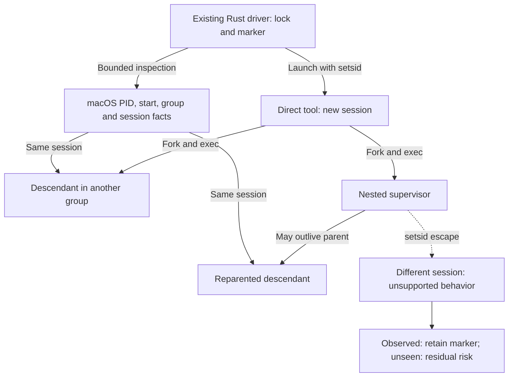
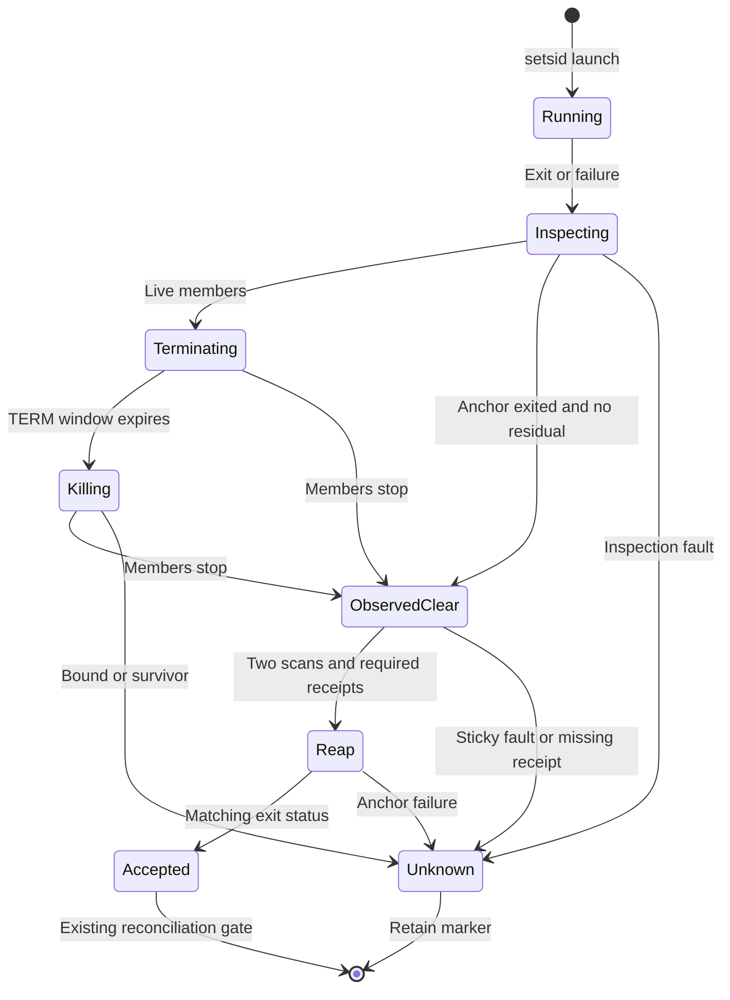
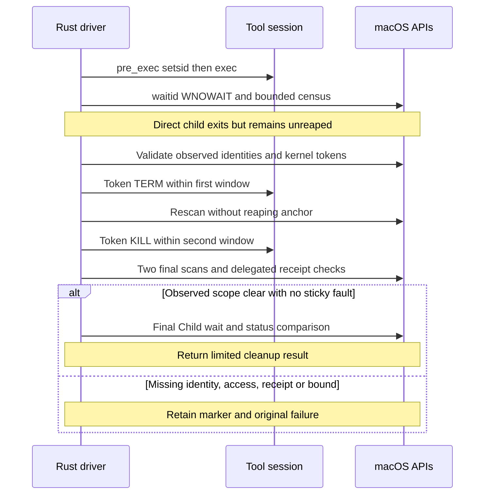
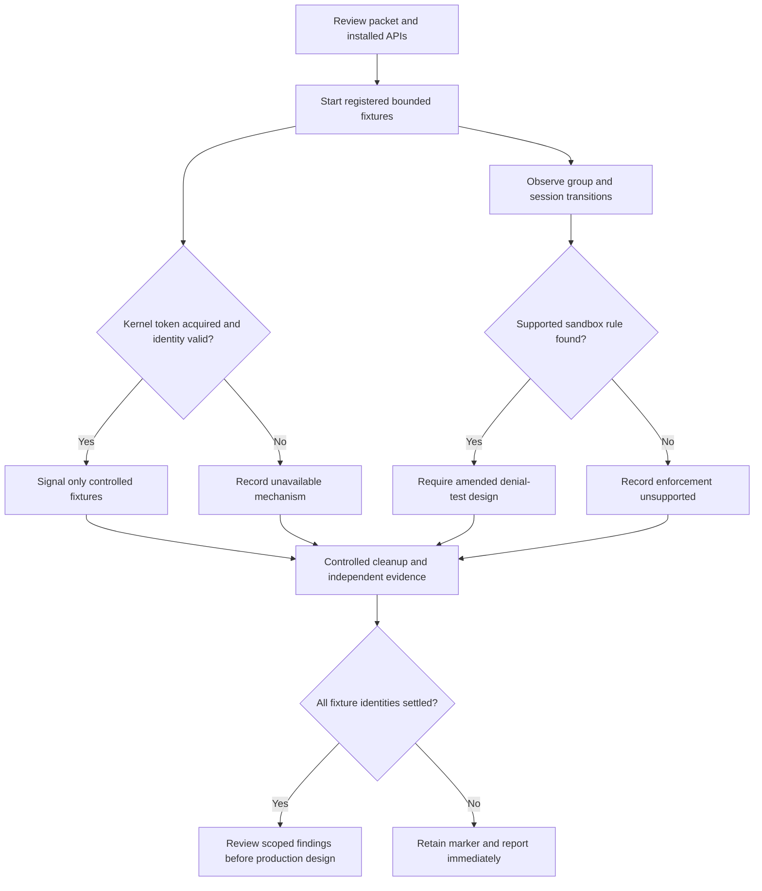

# Protobuf child-process settlement correction

Status: selected qualified-toolchain cleanup contract, chosen by the owner on
2026-09-26 after review of the residual discovery risk. The production correction
below defines the implementation-ready PS-D1–PS-D4 mechanics and preserves the
existing delegated test-harness contract. Implementation and native validation
remain incomplete. The earlier qualification experiment remains recorded.

The [bootstrap design](protobuf-toolchain-bootstrap.md) owns the cleanup guarantee,
deadlines and cache gate. The [preparation design](protobuf-cache-preparation.md)
owns PB0.3 operations. The
[implementation packet](../plans/protobuf-bootstrap-implementation.md) owns scope
and execution evidence. This detail implements their selected limited assurance;
it does not claim unconditional descendant discovery or adversarial containment.

## Failure and required outcome

The native SwiftPM diagnostic suite passed 36 of 37 cases in 162.22 seconds.
The manifest reached readiness with PID 71848, parent 71820, group 71848 and
session 68071. The supervising fixture also recorded session 68071. After the
supervisor returned a deadline error with `settled=true`, the manifest remained
in state `S`, parent 1 and its own group 71848. Controlled harness cleanup ran;
incomplete run marker 68136 remained.

This evidence establishes that this native descendant changed process group and
stayed in the original session. It supports session tracking for this observed
behavior. It does not qualify every pinned tool or prove that descendants cannot
call `setsid`. The harness cleanup is not proof of production supervisor settlement.
The parent supplied this runtime evidence; this design task ran no process probe.

**Selected cleanup contract:** Supported tools must keep descendants in the
session created for their command. Process-group changes are permitted. The driver
must stop every observed owned process before accepting cleanup. Its success
means the bounded observed-scope checks passed, with the stated discovery risk.
It does not prove that every possible descendant stopped.

Explicitly delegated test scopes use the receipt contract below. Other observed
session changes are unsupported escape. An unobserved descendant can change
session between scans and lose its ancestry.
The owner accepted this residual discovery risk. Observed session escape, identity
failure, inspection or token-access failure, exceeded bounds, or missing required
delegated receipts must return `cleanup_required` and retain the marker. Detection
of unsupported behavior remains a failure even if observed processes later stop.
No cache publication, rollback or reuse follows unknown cleanup.

## Canonical ownership and supported scope

The existing standalone Rust driver owns launch, inspection, tokens, deadlines,
output, cancellation and cleanup. Narrow macOS wrappers supply facts and execute
signals; they do not decide cache validity. The bootstrap remains a one-shot Rust
storage operation and starts no children. SwiftPM and Swift are supervised tools.
No new crate, service, helper, process supervisor or public command is introduced.

The correction covers driver-supervised commands and their fixture paths only.
The initial compiler launcher keeps its separate process-group watchdog. Existing
launcher tests remain required; this session mechanism does not extend its scope.

The selected qualification baseline is macOS 27.0 build `26A428`, Apple silicon,
Xcode `27A266a`, Swift 6.4, Rust/Cargo 1.98.0, protoc 36.2 and SwiftProtobuf 1.38.1.
Use the fixed commands and environment in the bootstrap/preparation contracts.
The tool lock digest is
`0c614780b4e7a792485de20bba11bcbb499a68e91ac5216290cdd706fbacecb6`;
the reviewed Cargo lock digest is
`302a34ab4c96f1f67f1f9917bd49ce4f92239dcee55b8fc5dfd9da8538a64774`.
These identify the reviewed inputs, not an already successful cleanup build.

The tuple and digests above record qualification evidence and requalification
scope. Reuse the existing host/tool-lock validation owners and bootstrap digest
checks. Add no hash implementation, `shasum` subprocess, new lock schema or
circular preflight gate. The cleanup mechanism operates while those existing
fixed validation commands run. Changing the OS build, binaries, lock inputs,
dependency behavior, commands/environment or cleanup mechanism requires review
and qualification before accepting new build evidence. Existing validation errors
remain failures; this paragraph does not add a second validation owner.

The supported behavior excludes daemonization into a new session. Detection keeps
the failure marker; it does not expand the supported scope. Trusted inputs do not
make the observation algorithm complete. Same-user hostile mutation, unknown tool
versions and arbitrary untrusted build scripts remain outside this assurance.

### Supervision boundary

Selected ownership view. Arrows show launch or inspection, not containment.
An unobserved escape is residual risk; an observed escape fails the cleanup gate.

## Installed API evidence

Read-only inspection of the installed macOS 27.0 SDK identified these interfaces.
Header declarations establish availability, not successful runtime behavior.
No subprocess probe or new executable was used for this design.

| Installed interface | Evidence and consequence |
| --- | --- |
| `setsid()` and `getsid(pid)` | Declared in `unistd.h`; the installed `setsid(2)` page states that a successful caller becomes session and group leader |
| `POSIX_SPAWN_SETSID` | Declared by Darwin `sys/spawn.h`; an alternative launch mechanism, not a portable Rust `Command` option |
| `proc_listallpids`, `proc_listpids`, `proc_pidinfo` | Declared in `libproc.h`; bounded process inspection is available without invoking `ps` |
| `proc_bsdinfo` | `sys/proc_info.h` provides PID, parent, group, status and start seconds/microseconds; it does not provide a session ID |
| `PROC_ALL_PIDS`, `PROC_PGRP_ONLY`, `PROC_PPID_ONLY` | Process-list selectors exist; there is no session selector in that header |
| `SZOMB` | Declared in `sys/proc.h`; distinguish an exited unreaped process from live execution |

There is no proposed session-wide signal syscall. Session discovery requires
PID enumeration and separate session queries. `kill(-id, signal)` targets a
process group, not all groups in a session. Parent traversal alone loses orphans.

## Selected launch and inspection contract

### Dedicated session and unreaped anchor

Use `CommandExt::pre_exec` with only `setsid()` and its syscall/error path.
Replace `process_group(0)` for that child; never set a group before `setsid`.
No allocation, locking, logging or extra process creation belongs in the hook.
A failed `setsid` fails spawn before tool execution. Preserve current arguments,
environment, descriptors, output capture and outer network-denial profile.

A successful child becomes session leader with SID and PGID equal to its PID.
The driver retains exclusive ownership of its `Child` handle and its unreaped
PID until session cleanup ends. No signal handler or other code may reap it.
Do not call `Child::try_wait`, `wait`, `waitpid` or another reaping path during
work or cleanup observation. `try_wait` can reap a finished child and release
the numeric identity that anchors session inspection.

Use `waitid(P_PID, child_pid, ..., WEXITED | WNOHANG | WNOWAIT)` instead.
On the installed SDK these values are 1, 4, 1 and 32 respectively. Zero the full
`siginfo_t` before each call. A zero result with `si_pid=0` means no exit event.
A matching child PID and `CLD_EXITED`, `CLD_KILLED` or `CLD_DUMPED` records exit
without reaping. Other codes, short/invalid ABI assumptions or `ECHILD` are
cleanup uncertainty. Retry `EINTR` only within the current deadline.

The installed arm64 `siginfo_t` layout is 104 bytes, alignment 8, with `si_pid`
at offset 12. Narrow FFI wrappers and layout checks must verify this declaration;
no hand-written untested union interpretation is permitted. `waitid` is the exit
observer. `Child::wait` runs exactly once at the final reap point, after observed
scope checks succeed. Compare the final exit status with the observed event.
Mismatch or unexpected reap failure retains the marker.

On failed cleanup, reap an already-exited direct child only at final return,
after stopping all further session inspection/signalling. If it is still alive,
retain unknown status and the marker. The driver must not block beyond the fixed
cleanup deadline. It must not start another command or recover caches.

### Process records and bounded census

| Record | Fields and purpose |
| --- | --- |
| Launch scope | Run/command identity, unreaped direct-child PID, expected SID, start identity, exit observation, deadlines and sticky cleanup failures |
| Observed member | PID/start seconds/microseconds, PPID/PGID/SID/status, authentic audit token and generation when acquired, last observation and signal result |
| Census | PID-list completion, stable members, transient disappearance, errors and limits; it is not a complete descendant proof |
| Cleanup result | Direct-child reap/status, observed-member outcomes, two final scans, required delegated receipt and explicit residual-discovery scope |

Each census uses `proc_listpids(PROC_ALL_PIDS)`. Zero is failure. Require a positive
byte count, a multiple of PID size and smaller than buffer capacity. A full
buffer may be truncated; retry within the fixed bounds. Reject negative PIDs;
skip PID 0. The current Apple implementation takes a locked PID-list snapshot,
but later session attribution is a separate operation.

For a previously unknown PID, call `getsid` first. A positive different SID is
outside this session and requires no privileged process-info query. `ESRCH` for
an unknown census entry records transient disappearance and skips that entry.
Any other error is uncertainty. This handling accepts the documented census race;
it is not proof that a disappearing parent had no children.

An owned process lifetime is identified by PID and start seconds/microseconds.
Its audit-token generation is a separate, current execution identity. The inspected
[Apple exec implementation](https://github.com/apple-oss-distributions/xnu/blob/main/bsd/kern/kern_exec.c#L6630)
changes `p_idversion` on exec. A generation change with unchanged PID/start does
not establish PID reuse and must not discard the owned lifetime.

Request `PROC_PIDTBSDINFO` with `proc_pidinfo` argument 1 to include zombies;
argument 0 excludes them in the inspected Apple implementation. Require the full
BSD-info structure, including status. The direct exited anchor still belongs to
the `waitid(WNOWAIT)` owner and is reaped only at its established final gate.

For a possible member, obtain full `proc_bsdinfo`, authentic token and repeated
PID/start/SID facts. Require the full ABI record and stable PID/start identity.
Obtain two authentic kernel tokens around the final identity/session reads.
Require their token PID and execution generation to agree within that acquisition.
If exec changes generation between these reads while PID/start and permitted
session remain unchanged, discard the unstable token pair and retry at the next
existing observation opportunity. The original command or cleanup-phase deadline
and all existing caps still apply. No retry receives a fresh window.

If a candidate disappears during acquisition, use the bounded fresh census and
identity lookup to confirm absence. Confirmed absence completes that observation.
An actual PID/start replacement, ambiguous identity, denied access to a remaining
process or exhausted retry window is cleanup uncertainty. Never signal a replacement
or reconstruct an audit token. A different current execution generation alone
is not replacement.

Retain owned PID/start identities for the whole command. A known non-delegated
member that changes SID remains an unsupported escape and a sticky failure;
continue token-only cleanup of that verified lifetime. Exec does not relax this
session rule. A known actual PID/start replacement remains unknown cleanup and
must not inherit ownership or receive a signal. Ambiguous facts are not grounds
to synthesize a token from PID/start data.

For a retained member, a full-facts read can obtain BSD information and then
receive `ESRCH` from `getsid` during an exit or exec transition. Read fresh BSD
information with the zombie-inclusive argument. If it confirms the same retained
PID/start lifetime, in any status, keep that ownership pending and unsignalled
until the next existing bounded scan. Do not require zombie status for this rule.
The partial read establishes neither current session membership nor absence.

A pending member prevents an observed-clear scan or successful cleanup. Later
complete facts may resume normal validation; later confirmed absence uses the
existing absence gate. Pending state at the original deadline remains unknown
cleanup and retains the marker. Changed PID/start, `EPERM`, other errors or a
short BSD record retain their existing failure handling. This rule adds no retry
window, signal fallback, owner or assurance claim.

A known member is absent only after it is absent from a complete census and
process-info lookup confirms absence. `getsid` returning `ESRCH` alone is not
sufficient: a zombie may lack a queryable live-process SID. A non-child zombie
is not live work, but remains unresolved until its disappearance is observed.
The unreaped direct child is the sole permitted final-scan entry. It is handled
through `waitid` and the final reap, not mistaken for a live survivor.

The source basis is the [Apple PID census](https://github.com/apple-oss-distributions/xnu/blob/main/bsd/kern/proc_info.c),
[libproc wrappers](https://github.com/apple-oss-distributions/xnu/blob/main/libsyscall/wrappers/libproc/libproc.c)
and [session query](https://github.com/apple-oss-distributions/xnu/blob/main/bsd/kern/kern_prot.c#L245).
These are API/source evidence; real supported-host acceptance is still required.

### Token-only signalling

Acquire a task-name right with `task_name_for_pid`, then obtain
`task_info(TASK_AUDIT_TOKEN)`. Require success, a non-null right, exactly eight
`natural_t` words and the validated identity checks above. Release the Mach right
on every path and treat release failure as an operation failure. Store only the
authentic token in bounded driver memory; do not log token bytes.

Send only TERM or KILL through `proc_signal_with_audittoken`. Its result is zero
or an errno value directly. No raw `kill(pid)`, process-group signal, `Child::kill`,
fabricated token or privilege fallback belongs in this cleanup path. Signal zero
is not a liveness check: the experiment returned `EINVAL` for current and stale
tokens. A zero TERM/KILL result means accepted delivery, not exit.

Before each signal, revalidate the retained PID/start lifetime and permitted
session, then acquire a stable current authentic token as above. Its generation
may differ from a token saved before exec. Replace the saved token only after the
current acquisition succeeds; never signal with a token known to be stale.
A detected session escape remains sticky failure even when a refreshed valid
token can terminate that observed lifetime.

An `ESRCH` signal result requires a bounded current observation. Confirmed absence
completes the observation. If the same PID/start lifetime remains and exec changed
generation, reacquire a stable current token and retry within the existing phase
window. Actual lifetime replacement, access denial, ambiguous evidence or any
other nonzero signal result remains cleanup uncertainty. Never fall back to a
numeric PID or process-group signal. Non-direct-child token access still requires
the real qualification cases; this exec correction adds no broader assurance.

Controlled direct-child token TERM/KILL passed. The inspected Apple source checks
token generation before signalling; installed-kernel PID-reuse behavior was not
forced in the experiment. This API contract and current tests support the selected
identity-bound mechanism, not a claim of complete discovery. Real nested and
orphan token cases must pass before live preparation.

### Fixed bounds

The 45-minute aggregate deadline, command deadlines and 16 MiB output cap remain
unchanged. Cleanup reserves the existing two-second TERM window and two-second
KILL/reap window within the driver's existing deadline handling. All inspection,
token acquisition, signalling and reaping consume those same windows. There is
no fresh timeout per member, scan, API failure or newly discovered process.

| Bound | Fixed value and exhaustion result |
| --- | --- |
| Census buffer | At most 65,536 PID entries; at most two growth retries per scan; exhaustion is unknown cleanup |
| Retained members | At most 4,096 unique identities per command; reuse does not recycle capacity |
| Scan cadence | Once per 100 ms during work and cleanup; at most 64 scans in each two-second cleanup phase |
| Existing I/O poll | 10 ms; continue servicing output/deadlines between scans |
| Final observations | Two complete scans at least 100 ms apart, within the same cleanup windows |
| Work-scan count | Bounded by the command deadline and 100 ms cadence, not by the per-phase 64-scan limit |

An immediate scan on transition into cleanup does not require waiting 100 ms.
Check monotonic deadlines between PID/API operations. Bound every allocation by
the capacities above. OS calls themselves are not made into hard real-time calls;
retain the outer runner watchdog. A stalled OS call or killed driver cannot clear
the marker. Failed bounds do not authorize broader signalling or cache repair.

### Existing delegated scopes and fixture cleanup

A launch has one of two fixed modes, selected by the existing driver call site
before spawn. Ordinary tools have no delegated receipt and must keep descendants
in their session. An existing trusted test/nested-supervisor launch with a
`delegated_receipt` path owns explicitly delegated child scopes. It may create
registered sessions, including the qualification fixtures. This is not inferred
from a child asking to escape or from a receipt found after launch.

Retain the existing fresh, run-owned receipt path and exact accepted receipt
format. The nested owner publishes it only after its registered child scopes
settle. Delegated acceptance requires a successful nested command and its exact fresh
settlement receipt. A nonzero nested test command retains the marker and evidence
even if a receipt exists. Missing,
malformed or unsuccessful settlement receipts remain `cleanup_required`. Do not
accept parent exit, EOF or a cache receipt as a substitute.

During delegated execution, retain observed delegated identities and session
changes without immediately classifying the registered delegation as unsupported
escape. The parent still settles all its own-session members. Before accepting
the delegated receipt, recheck every retained delegated identity: any observed
live survivor, unavailable identity check or token-access failure invalidates
cleanup. Token-only cleanup may stop a verified survivor, but the contradictory
receipt remains a sticky failure. An unseen delegated descendant is covered only
by the trusted owner receipt and the selected residual-discovery scope.

The existing three test-only direct-driver/backpressure cleanup paths may retain
their explicit process-group fixture helper. Keep that helper under `cfg(test)`;
it applies only to fixtures deliberately launched in that group, with their
existing identity and settlement checks. It must not assume SID equals PID or
be called by production `supervise`. Production launches use the canonical session
owner and token-only signals. Preserve the launcher watchdog and fixture tests;
this narrow fixture compatibility does not introduce a production PID fallback.

## Cleanup algorithm and result gates

1. While the command runs, observe exit with `waitid` and census at the fixed cadence.
   Keep the direct child unreaped. Record every observed owned member.
2. On deadline, output cap, interruption, nonzero exit or cleanup fault, stop admission
   and begin cleanup. Preserve the first command failure.
3. A zero exit also enters cleanup. If a stable live residual is found, record
   `unexpected_descendant`; even successful cleanup cannot make that command pass.
4. TERM currently verified live members and rescan through the first two-second
   window. Newly observed live members receive TERM within that same window.
5. At the TERM boundary, KILL remaining verified live members. New live members
   discovered in this phase receive KILL. Observe exit and absence within the
   second two-second window. Never restart a window for additional members.
6. Permit early completion after all observed members are absent, except the exited
   unreaped anchor, and two final scans plus delegated receipts satisfy the gate.
   Empty scans do not establish unconditional completeness.
7. Reap the anchor once and compare its recorded status. Only then return the
   observed-scope cleanup result. On any sticky failure, return cleanup uncertainty
   and retain the marker even if all currently observed members stopped.

Normal success requires zero tool exit, no unexpected live residual, no scope or
inspection fault, all observed identities settled and every required delegated
receipt. A nested supervisor's death does not replace its receipt. Do not recover
or publish caches from output alone. A failed command with known cleanup may use
only the existing bounded failure-recovery path; it cannot publish success.

Map the existing outcome explicitly: timeout, nonzero exit or unexpected live
residual returns `result=Err` with `settled=true` only when cleanup and required
receipts succeed. Inspection, token, unsupported escape, receipt or bound uncertainty
returns `settled=false`, even if observed processes later disappear. A delegated nonzero test exit also retains `settled=false`, the marker and evidence,
even with a receipt; preserve the existing failed-test receipt regression.

Return the original command error plus cleanup status. `cleanup_required` is the
reported cleanup reason when uncertainty exists; it must not erase the original
timeout, signal, output or tool error. Retain the worktree lock through cleanup
and permitted reconciliation. Unknown cleanup permits only bounded diagnostics
and marker retention before releasing the lock.

### Cleanup states

Selected state view. `ObservedClear` denotes this limited observation contract.
Sticky faults prevent acceptance even after observed processes disappear.

### Anchor and signal interaction

Selected sequence. The anchor remains unreaped throughout inspection. All signals
use authentic tokens; a failed token path never falls back to numeric PID signals.

## Recovery and validation

A later run with the incomplete marker returns `cleanup_required` before cache
access. Operator recovery requires independent settlement evidence; a stale PID,
missing parent or acquired lock is not proof. Persist only bounded identity facts,
errors, phase and timing, never raw tokens or credential-bearing command lines.
Automatic recovery from driver death is unchanged and outside this correction.

PS1–PS8 and the earlier experiment cases remain required. PS6 now asserts the
selected scope explicitly: an observed session escape fails closed; an unobserved
escape fixture demonstrates residual risk and must not be labelled containment.
No existing native settlement or nested-supervisor test may be disabled.

| Case | Initial state and trigger | Unit / integration / command acceptance |
| --- | --- | --- |
| PS1 | Child changes group and parent exits | Unit retains identity across groups; real integration observes/reaps correct scope; command reports no known survivor |
| PS2 | Real SwiftPM manifest reaches readiness then times out | Unit deadline rules; native integration verifies token access and manifest absence; command fails timeout with known cleanup and no counted harness fallback |
| PS3 | Member ignores TERM or forks during cleanup | Unit shared phase bounds; real token KILL and new-member discovery; command stays bounded or retains marker |
| PS4 | Census/API truncation, denial, short data or changed identity | Unit each typed fault; integration actual ABI and controlled errors; command preserves marker and blocks reuse |
| PS5 | Exited anchor, non-child zombie or PID replacement | Unit no premature reap or replacement signal; real waitid/final wait evidence; command records truthful exit/unknown outcomes |
| PS6 | Registered descendant changes SID | Unit sticky scope violation; real observed escape token cleanup; command remains cleanup_required even after cleanup; separately expose unseen-escape limitation |
| PS7 | Driver or nested supervisor dies, or delegates a registered session | Unit marker/receipt modes; actual successful and missing receipt cases; command accepts only settled delegated scopes, rejects a contradictory live survivor and preserves failing test status |
| PS8 | Setup fails, zero exit leaves live child, or cap expires | Unit failure precedence; real fixtures; command rejects parent success and never publishes early |
| PS9 | Real same-session grandchild and orphan need TERM/KILL tokens | Unit denial has no numeric fallback; real acquisition/signal/absence evidence; command fails closed when any API is unavailable |
| PS10 | Direct child exits during census or deadline transition | Unit WNOWAIT ABI/status and single final reap; real rapid exit/descendant fixture; command retains anchor until cleanup and rejects ECHILD/status mismatch |
| PS11 | An observed shell execs sleep, or exec occurs inside token acquisition | Unit distinguishes unchanged lifetime/new generation from replacement and bounds retries; real shell-exec-sleep integration refreshes the token and proves cleanup; rerun native SwiftPM PS2 through the command without fallback being counted as driver success |
| PS12 | Full facts returns ESRCH after BSD succeeds; fresh BSD reports the same retained PID/start with live or zombie status | Unit injects this exact read order and both statuses, asserts pending ownership, no signal and no clear result; unchanged-deadline expiry remains unknown, while later complete facts or confirmed absence follow existing gates. Integration repeats short-lived native child churn; rerun Swift preparation through the driver and retain truthful cleanup evidence |

Use the selected macOS host, real process APIs, actual installed native tools and
isolated scratch roots. Unit mocks cannot establish kernel permissions or native
cleanup. Run `--check driver` through the existing entry point, preserve launcher
watchdog tests, then run live PB0.3 preparation only after PS1–PS12 pass for their
stated supported scope. PS6's demonstration of accepted residual risk is not a
production guarantee failure, but any observed escape in a supported tool is.

## Bounded API qualification packet

This packet asks whether installed APIs can close the identity and session gaps.
It produces measurements and pass/fail evidence, not a replacement supervisor.
Production settlement, cache publication and the existing all-descendant contract
remain unchanged. A failed or unsupported API result is useful evidence; it must
not be converted to a successful production cleanup result.

### Selected experiment ownership and sequence

The canonical driver implementer owns `rust/check-i0-driver.rs` only:
`#[cfg(test)]` qualification cases, fixture dispatch and narrow test-only FFI
wrappers. Reuse the existing fixture modes and `--check driver` runner. Do not add
a public arbitrary-command selector, crate dependency, second supervisor or
separate workspace. No change to the bootstrap, launcher or production command
paths is included. If test isolation requires another path, revise this packet
before introducing it. The primary owns integration and evidence recording.

Run Q-A1–Q-A5 through one sequential qualification coordinator inside the existing
test harness. A standalone libtest failure does not stop other tests. The
coordinator must stop admitting later qualification cases after unknown cleanup;
it records skipped-dependent cases and retains the original failure and marker.
Do not implement these as independent tests that continue after a cleanup error.

| Stage | Work and prerequisite | Exit evidence |
| --- | --- | --- |
| Q0 | Review exact installed declarations and this packet; identify one driver writer | Approved experiment scope, ABI and fixed fixture commands |
| Q1 | Add test-only return/identity validation and cooperative bounded fixtures | Unit checks for size, return-code, token provenance and denial classification |
| Q2 | Run audit-token and session/group experiments on fixture processes | Exact API outcomes, PID/start/SID/PGID facts, controlled cleanup and limitations |
| Q3 | Run a sandbox experiment only if research identifies an applicable operation | Paired allowed/denied syscall outcomes, or explicit unsupported result without inventing a rule |
| Q4 | Run existing driver regressions and review evidence | Scoped unit/integration/command report; separate decision on any production correction |

Q0–Q4 are the authorized executable qualification plan. Independent technical
review and primary review are complete. Implementation and execution evidence
must be recorded separately. PS-D1–PS-D4 remain production blockers.

### Audit-token acquisition and signalling experiment

The installed macOS 27.0 SDK declares `task_name_for_pid`, `TASK_AUDIT_TOKEN`
and `proc_signal_with_audittoken`. The candidate acquisition chain is a task-name
right for a controlled fixture PID, followed by `task_info(TASK_AUDIT_TOKEN)`.
`TASK_AUDIT_TOKEN` is 15; its count is measured in `natural_t` words, not bytes.
Validate the installed structure size and count. `proc_signal_with_audittoken`
returns zero or an errno value directly; do not read it as `-1` plus `errno`.
Installed `bsm/libbsm.h` supplies token PID and PID-version accessors.
Release every acquired Mach right on every result path. Do not substitute `task_for_pid`, request
privileges, change entitlements or install a helper if access is denied.

The signalling target is a direct child of the harness. It reports its PID/start
identity over an inherited bounded channel and waits for an explicit release.
Keep it alive and unreaped through acquisition and signalling, so its PID cannot
be replaced during this case. A retained `Child` value alone is insufficient if
another path has already reaped it. Validate its PID/start immediately before and after
acquisition. Obtain the audit token from the kernel response, not from caller data
or reconstructed PID/start fields. Validate returned count and supported token
identity fields before any signal. Acquisition failure or identity mismatch ends
that case without using the candidate signal path.

First send signal 0 with the kernel token. Then use a separate fixture to test
TERM and verify actual exit/reaping; successful delivery alone is insufficient.
A deliberately TERM-ignoring fixture tests KILL with the same safety boundary.
After fixture exit, reuse its authentic old token only for signal 0. Do not force
system-wide PID reuse, forge a token or send a destructive stale-token signal.
A separate decoy fixture must remain alive. This tests ordinary/stale outcomes;
it cannot by itself prove all PID-reuse interleavings.

Record Mach return codes, returned counts, token acquisition provenance and
signalling results. Do not persist raw token bytes as credentials or expose an
arbitrary-PID signalling interface. Source review must establish whether the
kernel binds signalling to process generation; runtime success alone cannot
establish that property. Permission denial is a supported experiment outcome,
not evidence that this mechanism can be used in production.

### Session observation and possible sandbox enforcement

Use separate fixture cases for `setpgid` and `setsid`. Before either call, the
fixture sends a readiness identity and waits. The parent records PID/start,
PPID, PGID and SID. After the call, record its return value, errno and new facts.
A fixture must be in a POSIX-valid initial state: testing `setsid` on an existing
group leader would produce a meaningless denial for sandbox qualification.

One case keeps all direct parents alive; another reaps the intermediate parent
after its registered child changes group or session. Each spawned child registers
before the state change. A test barrier can place fork/exit between PID census
and session inspection. Its known fixture identities expose omitted children;
this registration is test instrumentation, not a proposed production assumption.

The existing outer sandbox denies network access. That rule does not establish
control over `setsid` or `setpgid`. Before adding a candidate profile, research
must find an applicable installed operation or current Apple enforcement hook.
A profile merely accepting a rule name does not prove that the syscall is denied.
If no supported rule is established, Q3 reports unsupported and performs no
invented-profile test. Q2 session observations remain useful independently.

Current research found no applicable rule in the installed sandbox profiles.
The current [Apple session/group syscall source](https://github.com/apple-oss-distributions/xnu/blob/main/bsd/kern/kern_prot.c)
has POSIX checks but no MAC policy check in the inspected `setsid` and `setpgid`
handlers. This supports **no verified enforcement mechanism found**; it does not
prove impossibility on the installed kernel. Q3 therefore records unsupported
for this packet and performs no sandbox-denial experiment. A later supported
mechanism needs an amended design with valid syscall controls, launch ordering,
network-denial preservation and native tool compatibility before execution.

### Fixture safety and resource bounds

All fixtures live in the existing private test scratch root. They cannot touch
user-home state, production caches or unrelated processes. No dependency download,
network endpoint, privileged call or persistent service is included.

Use at most six concurrent fixture processes and eight total spawns per case.
No fixture spawns further children after its registered one-level topology is complete.
Each cooperative fixture has a hard 15-second self-exit deadline established before
readiness. Its channels accept at most 64 KiB per case, with a 1 MiB total report
cap. The test case has a 30-second work bound plus the existing two-second TERM
and two-second KILL cleanup windows. The complete added experiment set has a
five-minute bound. Existing regression deadlines, including the 120-second
compiler watchdog test, remain unchanged and count against the driver aggregate.

Keep direct child handles until reaping. Record every fixture identity before
allowing parent exit or session changes. The harness requests cooperative exit over the retained channel. Fallback signals
are limited to direct children that remain unreaped and whose ownership is retained
by the harness. Do not use PID/start checks alone as race-free cleanup for orphaned
fixtures. Session/orphan cases must use their registered channel and established
self-exit bound; inability to verify their disappearance stops the packet.
Never signal by command name, whole user, stale SID or unknown PID.
Fallback cleanup must be recorded separately from candidate API success.
If cleanup cannot be proved, retain the incomplete marker, stop further cases
and report the identities and failure immediately to the primary. The bounded
fixture lifetime reduces cleanup exposure; it is not proof of the candidate API.

### Qualification control flow

Selected experiment view. Arrows show evidence gates; an unsupported branch stops
only its dependent experiment. Q3 currently follows the unsupported branch.
A newly identified rule requires a design amendment before testing. Every launched
case reaches controlled cleanup.

### Qualification acceptance and proof limits

| ID | Initial state and trigger | Unit / integration / end-to-end evidence |
| --- | --- | --- |
| Q-A1 | A held fixture has an exact identity; acquire token and signal 0, TERM or KILL | Unit validates counts/errors and disallows fabricated tokens; real integration records kernel acquisition and target exit; command run distinguishes API success, permission denial and cleanup failure |
| Q-A2 | The token's fixture exits; probe authentic stale token with signal 0 while a decoy lives | Unit rejects mismatched identities; integration records stale result and unchanged decoy; command report states that forced PID reuse and destructive stale-token signalling were not tested |
| Q-A3 | Registered children change group/session and an intermediate parent exits | Unit models identity/session transitions; integration captures before/after facts and census-race barriers; command never treats an empty observed session as unconditional descendant proof |
| Q-A4 | A supported sandbox rule exists and the syscall would otherwise succeed | Unit verifies fixed profile construction and separates POSIX errors from sandbox denial; integration compares allowed/denied cases; command records enforcement evidence or unsupported without changing the production profile |
| Q-A5 | A case fails or exceeds a bound with a fixture alive | Unit preserves original error and cleanup uncertainty; real integration exercises fixture self-exit and fallback; command retains marker on unknown settlement and starts no later case |

End-to-end here means the existing build-check command through real fixtures,
not an Asura production task or complete PB0.3 preparation. Full driver regression
remains required, but a known native settlement failure must remain visible.
The experiment established the measurements below. The owner subsequently selected
the limited cleanup contract above; experiment success alone did not make that decision.

## Resolved decisions and implementation handoff

| ID | Selected resolution |
| --- | --- |
| PS-D1 | Owner-selected qualified-toolchain operational assurance; no session-completeness claim; observed escape/uncertainty is sticky failure; unseen escape risk explicit |
| PS-D2 | Existing driver uses pre_exec setsid, bounded getsid-first census and waitid WNOWAIT anchor; launcher remains a separately qualified boundary |
| PS-D3 | Fixed capacities/cadence above; existing TERM/KILL and command deadlines; bounds never grow during cleanup |
| PS-D4 | Authentic kernel-token TERM/KILL only; permission/identity failures fail closed; no numeric PID/group fallback |

The production implementer owns `rust/check-i0-driver.rs` for the correction and
its required tests. Promote the existing qualified token/facts wrappers into one
canonical internal owner; do not duplicate them beside the experiment. Preserve
its experimental records and negative cases. No launcher, crate, service, lock
schema or public selector change is required by this packet.

The parent integrates canonical bootstrap/cache contracts and the implementation
packet. The selected contract and compatibility rules above need no fresh owner
choice. The production implementer owns `rust/check-i0-driver.rs`, reuses one
canonical facts/token wrapper set, and preserves all earlier experiment checks.

Implementation and native validation remain incomplete. In particular, waitid
lifetime handling and non-direct-child token access must be demonstrated; an API
failure is a supported fail-closed result, not permission to weaken a check.
A failure that prevents useful cleanup returns to design before live preparation.

## Design validation record

The previous four-diagram revision was rendered and visually inspected with
Mermaid CLI 11.16.0. The current cleanup revision changes the first three diagrams;
the qualification flow remains unchanged. Rendering the three changed diagrams
is blocked: bundled headless Chrome 131, installed Chrome 146 and system Chrome
stalled before producing updated images. Parallel and sequential attempts were
bounded and their identified renderer/browser processes were stopped. No browser
installation, global configuration change or product process probe was performed.

Current visual validation remains incomplete. Earlier PNG files do not validate
the changed diagrams. The primary accepted the content handoff with this explicit
proof gap and will handle visual review separately. Source review and whitespace
checks do not substitute for that inspection.

Three local document links resolved. A full document whitespace scan and
`git diff --check` passed. Installed macOS 27.0 SDK declarations and current
Apple source were reviewed as API evidence; no inspection or signal mechanism
was qualified by this task. The runtime finding above is parent-supplied evidence.
That design review performed no executable probes. The subsequently authorized
qualification implementation and runtime evidence are recorded below. The selected resolutions
PS-D1–PS-D4 remain distinct from implementation and native validation.

### Bounded qualification measurements

On 2026-09-26, the test-only driver packet ran on the supported macOS host.
The coordinator recorded controlled cleanup for every experiment case.

| Measurement | Observed result | Proof limit |
| --- | --- | --- |
| Kernel token acquisition | `task_name_for_pid` and `task_info` returned zero; token count was eight words | Controlled, held direct children only |
| Mach right release | No release error recorded | Does not establish access to arbitrary production descendants |
| Token-based TERM and KILL | Returned zero; target exit and reaping followed | Ordinary controlled signals, not forced PID reuse |
| Signal zero with current and stale authentic tokens | Returned `EINVAL` (22) | No evidence of stale-generation rejection |
| Group and session transitions | Both succeeded; registered children also survived parent exit and were reparented to PID 1 | Session-only discovery remains insufficient |
| Fixture safety | Self-exit and injected-failure KILL fallback completed; each case recorded cleanup | Harness cleanup is separate from production supervision |
| Sandbox escape denial | Unsupported; no candidate profile executed | Network denial is not process containment |

The inspected [pinned Apple source](https://github.com/apple-oss-distributions/xnu/blob/xnu-10063.121.3/bsd/kern/proc_info.c#L3277)
compares the target's process generation with the audit token before an accepted
signal. It rejects signal zero before that check. This older source explains a
candidate identity guarantee; it is not proof of the installed macOS 27 kernel.
The experiment does not close the descendant-discovery gap. The later owner
selection accepts the stated residual risk; it does not turn this measurement into
production session-cleanup evidence. Complete driver regression results belong in the implementation
packet.
