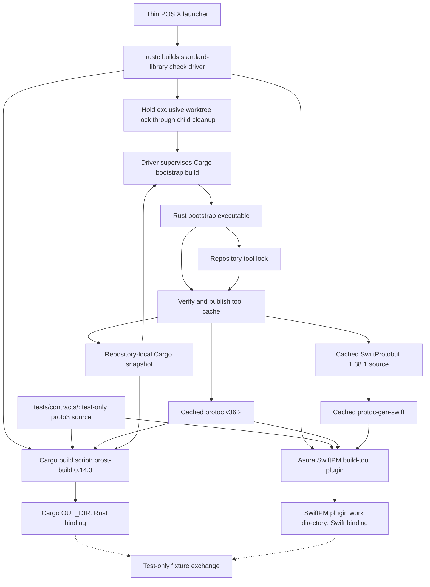
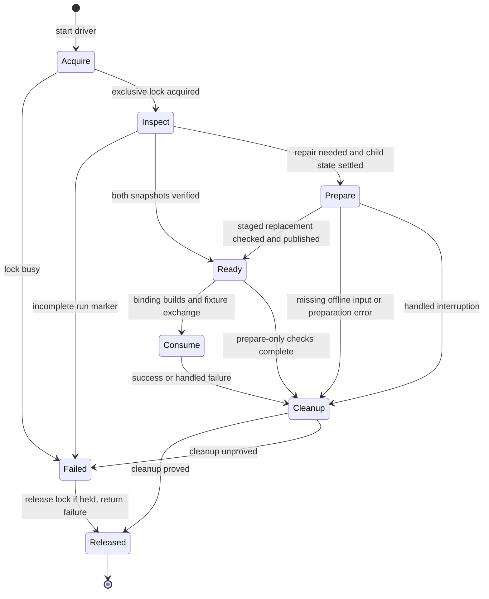
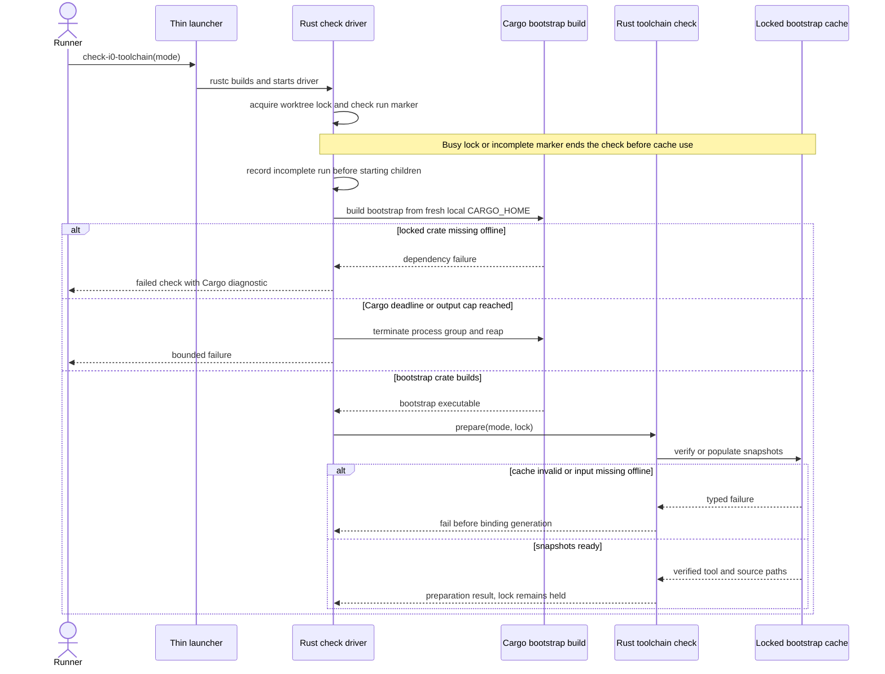
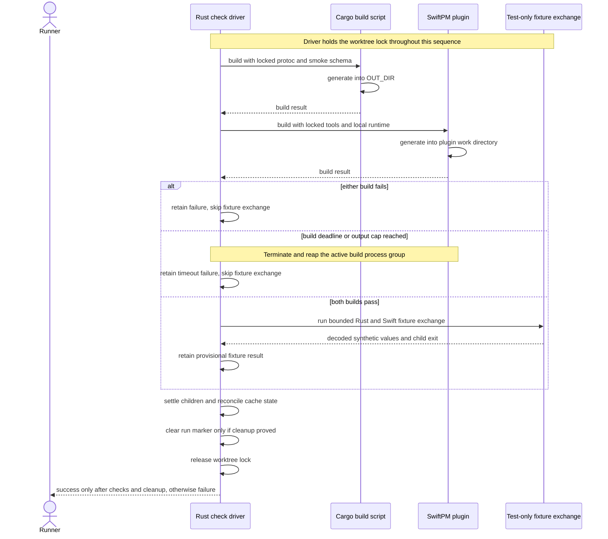

# Protobuf toolchain bootstrap before the I0 model-channel probe

Status: scoped D2/D7 design ready for owner review. The owner selected a
repository-owned, locked bootstrap and a bootstrap-first packet on 2026-09-25.
On 2026-09-26, the owner selected one active build per worktree. Separate
worktrees may build independently. This document defines tool preparation and
test-schema generation before the
real I0 channel schema and probe. D8, design/plan owner review and explicit
authorization still gate implementation. This status does not claim that the
selected tools build together. The [model-channel design](swift-rust-boundary.md)
owns message semantics, framing and the later test-only process probe.

## Scope and ownership

The developer starts one repository bootstrap check; CI repeats it before I0
completion. The check prepares the pinned tools, generates Rust and Swift
bindings from one test-only schema,
then exchanges a synthetic message across compiled fixtures. The first
preparation may download verified archives. A later clean checkout can rebuild
and run the bootstrap check fully offline from a retained cache snapshot.
Generated bindings and preinstalled Protobuf generators are unnecessary.

The standard-library-only Rust check driver owns preparation order,
environment, the exclusive worktree build lock, child-process supervision, and
the smoke result. The Rust
bootstrap crate owns archive verification, extraction and cache publication.
Cargo's build script owns Rust generation through `prost-build`. An Asura SwiftPM build
tool plugin owns Swift generation. `tests/contracts/` owns the test-only
`proto3` smoke schema. Neither generated binding is checked in. This packet
does not create the production `contracts/` channel schema. The model-channel
owner, not either generator, will validate decoded semantic fields and authority.

The first slice targets macOS 27 or later on Apple silicon. It does not package
generators for end users, introduce a service or model call, or choose I0's
probe limits or I3's production channel limits. Other platforms need a new
qualified lock entry and runner before they can claim this bootstrap works.

The scoped file ownership is `tools/protobuf/lock.json` for archive identities,
`rust/crates/asura-toolchain-bootstrap/` for the Rust bootstrap,
`rust/check-i0-driver.rs` for the standalone Rust check driver,
`scripts/check-i0-toolchain` for the thin POSIX launcher,
`tests/contracts/` for the smoke schema and fixtures,
`rust/` for Cargo generation, repository-root `Package.swift` for SwiftPM, and
`swift/` for Swift targets and the Asura plugin.
The tool cache is `.build/asura-protobuf/`; the Cargo dependency cache is
`.build/asura-deps/cargo/`, with separate `snapshot/` and disposable `work/`
subdirectories. Both are ignored by Git. Each worktree owns its physical caches
and build outputs. Cache roots must be real directories inside that worktree;
symlinks to shared caches and shared derived binaries are rejected. A restored
snapshot is copied into the receiving worktree before use. Cargo targets,
SwiftPM scratch output and the derived generator remain worktree-local.
The implementation packet
must keep these owners disjoint from the TUI experiment and later service trees.
The launcher compiles the check driver directly with the pinned `rustc` into a
unique temporary directory, then runs it. This initial compiler step does not
read or write the worktree caches or build outputs. The driver acquires the
worktree lock before any subsequent build or cache access. The driver uses only
Rust's standard library and macOS process APIs;
it has no Cargo dependencies. The launcher owns a two-minute shell watchdog
for this initial compiler step. It starts `rustc` in a separate process group,
terminates and reaps that group on expiry, and fails if it cannot establish
supervision. The launcher does not download, parse archives or decide whether
a cache is valid.

The smoke schema is `tests/contracts/toolchain_smoke.proto`, with `proto3`
package `asura.toolchain.v1`. Its sole `ToolchainSmoke` message has a string
`id` at field 1 and bytes `payload` at field 2. `proto3` does not make these
fields wire-required; both fixtures reject empty `id` and test
the exact payload. The test sends `id = "toolchain-smoke"` and payload bytes
`00 7f ff`. Rust encodes the message; a Swift fixture decodes it, checks both
fields, and re-encodes it. Rust decodes the reply and checks the same values.
The Rust parent writes at most 1 KiB to child stdin, then closes stdin. The
Swift child reads to EOF and writes at most 1 KiB of binary Protobuf to stdout,
then exits with code zero. The parent rejects oversized, malformed, missing or
nonzero-exit results. A 10-second absolute work deadline covers spawn through
normal exit. On expiry or protocol failure, the parent closes pipes, requests
termination, waits at most two seconds, then forces termination and waits at
most two more seconds for exit. Failure to reap fails the check. The fixture
does not use the private model-channel framing or claim channel compatibility.
The schema and fixture are test-only and never appear in a release artifact.

### Tool and source identities

The repository lock records the exact URL, archive SHA-256, version, platform,
expected executable version and source identity. Initial I0 selections are:

| Item | Locked selection | Evidence and qualification |
| --- | --- | --- |
| `protoc` | v36.2, `protoc-36.2-osx-aarch_64.zip`, SHA-256 `9cd98a532c5c5e0c4161314de0225de27e4c8a323917b6ea7b1b714d3ae23466` | Official [Protobuf release](https://github.com/protocolbuffers/protobuf/releases/tag/v36.2); local archive hash matched. Execution with Asura's schema remains unverified. |
| SwiftProtobuf source and `protoc-gen-swift` | 1.38.1 source tag, tag target `55d7a1cc5666b85c13464aea1c4b4a90feccb4c8`, locally measured archive SHA-256 `7e35c119afe8f16fe4de45c2143b0f50a205db83738092336562d610469283ac` | [Apple SwiftProtobuf release](https://github.com/apple/swift-protobuf/releases/tag/1.38.1); the measured archive digest is local evidence, not a published upstream checksum. Its package declares Swift tools 6.2 and a generator executable. Build and generated-code compatibility remain unverified. |
| Rust generator and runtime | `prost` and `prost-build` 0.14.3, exact versions in `Cargo.lock` | [Prost releases](https://github.com/tokio-rs/prost/releases); Cargo checksum and lock verification remain required in I0. |
| First local qualification host | macOS 27, arm64, Xcode 27.0 build `27A266a` / Swift 6.4, Rust and Cargo 1.98.0 | Record the actual OS build and tool identities with each local check. Remote CI is deferred; its runner must be selected and qualified before the I0 exit gate. |

`lock.json` has a format version, one supported host/toolchain tuple, and one
entry for each archive. Each archive entry has an HTTPS URL, SHA-256, archive
kind, expected top-level directory or members, expected tool version, and an
explicit set of permitted HTTPS redirect hosts. The Swift source entry also
records the release tag target commit. The initial `protoc` URL is
`https://github.com/protocolbuffers/protobuf/releases/download/v36.2/protoc-36.2-osx-aarch_64.zip`.
The initial Swift source URL is
`https://github.com/apple/swift-protobuf/archive/refs/tags/1.38.1.tar.gz`.
The proposed redirect hosts are `release-assets.githubusercontent.com` for
`protoc` and `codeload.github.com` for Swift source. The first online check
must verify the observed redirect chain; a different host requires a reviewed
lock update. The parser rejects duplicate keys, unknown keys, invalid digests,
unsupported formats, non-HTTPS URLs and redirect hosts outside an entry's set.

The Rust bootstrap selects `ureq` 2.12.1 with default features disabled and
only `tls` enabled; `sha2` 0.10.9; `zip` 3.0.0 with default features disabled
and only `deflate-flate2` enabled; `tar` 0.4.46; `flate2` 1.1.10;
`serde` 1.0.229 with `derive`; and `serde_json` 1.0.151 as direct dependencies.
`libc` 0.2.189 supplies the macOS signal constants and process-group signal
call; Rust's standard library supplies process-group creation and file locks.
The manifest must pin each exact version; the committed `Cargo.lock` must pin
the full transitive graph. These selections were inspected in the local
Cargo registry, but no Asura lockfile or combined clean build exists yet.
Online preparation must first produce and review the complete lockfile.

The Swift target depends on the same verified SwiftProtobuf source version as the
generator. A different runtime version is a build error. The official `protoc`
archive supplies the compiler; the repository builds `protoc-gen-swift` from
the verified source using SwiftPM. Neither `PATH`, Homebrew nor SwiftPM's own
download resolution may silently replace a locked tool. A tool update changes
the lock and requires fresh clean, offline, cross-language and negative checks.
`Cargo.lock` is a separate input to the complete offline snapshot. The
repository build entry point rejects a snapshot made for a different lock,
platform or Rust/Swift toolchain identity.
The local check verifies architecture, macOS major version, Xcode build, Swift
version and Rust/Cargo versions before preparing tools. It records the OS build.
A mismatch fails the check instead of silently changing the qualified
environment. The same checks and BT4-BT8 cases must run in remote CI before I0
can meet the
[implementation plan's exit gate](../plans/implementation.md#i0-repository-and-contracts).

### Ownership and dependency view

Selected design. Solid arrows are build dependencies; the dotted arrow is a
verification dependency. The bootstrap cannot change schema semantics.

## Bootstrap and build contract

The lock is source-controlled data. It names only HTTPS upstream archives and
their exact digest. The entry point accepts preparation and offline modes.
Before the Rust bootstrap runs, the launcher compiles the standalone check
driver directly from `rust/check-i0-driver.rs`. After acquiring the worktree
lock, the driver copies the retained
Cargo snapshot into a fresh disposable work cache and sets `CARGO_HOME` to that
work cache. It copies only registry index metadata and compressed crate
archives, never extracted source trees or build output. In online mode, an
absent snapshot starts with an empty work cache. The driver then supervises
Cargo's build of the bootstrap crate from the committed `Cargo.lock`. Online
mode permits Cargo to fetch those locked crates. Offline mode passes
`--locked --offline` to this first Cargo invocation. A
missing bootstrap crate is an immediate offline failure; the bootstrap cannot
repair a dependency it needs in order to start. After startup, the Rust
bootstrap may fetch missing locked archives and smoke-fixture Cargo dependencies
only in online mode.
`--prepare-only` produces a portable snapshot of the verified archives,
SwiftProtobuf source and Cargo registry packages needed for this toolchain
check. It records the tool lock, `Cargo.lock`, target platform and compiler
identities. The Cargo snapshot contains the registry index metadata and the
compressed `.crate` archive for every registry package in the committed
workspace `Cargo.lock`. This packet rejects Git and path dependencies outside
the workspace. For each package, the bootstrap verifies the archive SHA-256
against `Cargo.lock`. It records the package name, version, registry, lock
checksum and cache-relative archive path in a versioned manifest. The manifest
also records every included cache file's relative path and SHA-256; it rejects
unlisted files, duplicate paths, symlinks and missing files on restore.
Extracted Cargo source trees and compiled targets are not snapshot inputs.
Before publishing the manifest, preparation restores the candidate snapshot
into an isolated cache and builds the bootstrap and smoke-fixture Cargo targets
with `--locked --offline`. A missing index entry, archive or dependency fails
preparation before it can mark the snapshot complete.
The retained snapshot consists of the published tool-cache directory and the
Cargo `snapshot/` directory with their complete manifests. A fresh checkout
restores both under the same relative `.build/` paths; restoring one alone is
incomplete. `--offline`
makes no network request, runs Cargo with `--locked --offline`, uses only the
local SwiftProtobuf path dependency and fails if any required cached dependency
is missing. Under the worktree lock, it rebuilds derived tools from verified
source if a restored binary is absent or not qualified for the current path.
The platform and toolchain must still match the selected lock tuple. A rebuild
uses staging and the replacement procedure below. SwiftPM
resolution must not introduce an uncached remote dependency. Repeated
preparation of a valid cache is idempotent.
The planned commands are `scripts/check-i0-toolchain --prepare-only`,
`scripts/check-i0-toolchain` and `scripts/check-i0-toolchain --offline`.
A clean checkout runs the second command. The local validation prepares in one
checkout, restores the recorded snapshot in another clean checkout and runs
binding generation and fixture exchange with network access disabled. It also
tests an empty offline cache separately. Remote CI repeats these cases before
the I0 exit gate. After D2 defines the real schema and probe,
`scripts/check-i0 --offline` must extend the same preparation
contract to the complete I0 build and probe. Its new `Cargo.lock` and any
additional dependencies require a new snapshot and separate end-to-end proof.

The Rust bootstrap writes only under the ignored repository-local tool and
dependency caches. It downloads to a unique temporary file, caps archive
bytes, verifies SHA-256 before extraction, and rejects absolute paths, `..`
traversal, backslashes, empty interior path components, normalized-path collisions,
symlinks and nonregular member types. The `protoc` ZIP may contain only
`bin/`, `include/` and `readme.txt` and must contain `bin/protoc`. The Swift source
archive may contain only one `swift-protobuf-1.38.1/` tree with regular files
and directories. Any other top-level member fails preparation. The bootstrap
extracts accepted members into a private staging directory.
It builds the Swift generator in that verified source tree, checks executable
identity, then writes a manifest inside staging. The complete directory is keyed by the
tool-lock digest. Verified archive and source bytes are immutable inputs;
derived build output may be replaced under the exclusive worktree lock.
The bootstrap builds in a staging copy of verified source. It does not modify
the retained source inputs. A lock update selects a different cache directory.
The tool-lock digest is SHA-256 of the exact `lock.json` bytes. The Cargo
snapshot key is SHA-256 of the exact `Cargo.lock` bytes. A format-only lock
change therefore invalidates the corresponding snapshot.
The manifest records lock digest, source/archive digests, tool versions,
relative executable paths, and each extracted source file's relative path and
SHA-256. A consumer rechecks the archives, source files, manifest, and
executable content hashes and versions before use. A partial or stale cache is
never treated as complete. The driver holds the worktree lock until every tool
consumer has stopped.
Cache replacement cannot overlap a build in that worktree.

### One build per worktree

Selected design. The Rust check driver owns one exclusive OS file lock at
`.build/asura-toolchain.lock`. It does not use per-digest preparation locks.
The lock file remains at a stable path and is never removed or replaced during
normal cleanup. A second driver uses a nonblocking acquisition and returns
`worktree_busy` without touching caches or starting Cargo. It does not wait.
Different tool locks or Cargo locks still use this same worktree lock.

The driver retains the lock through preparation, cache replacement, binding
builds, fixture exchange and child cleanup. `--prepare-only` retains it through
preparation checks and cleanup. Snapshot export and restore must also hold the
same lock. A child receives no independent permission to replace the cache.
The bootstrap reports completion to the driver; it does not release the lock.
Direct builds outside the entry point remain unsupported. These rules govern
cooperating repository tools, not hostile same-user processes.

Before starting a build child or cache mutation, the driver records an incomplete
run marker under the lock. It clears that marker only after its children have
stopped and cache state has been reconciled. A handled timeout or interruption
uses the existing termination and reap deadlines before releasing the lock.
Failure to prove cleanup leaves the marker and fails the check.

An abruptly killed driver can release its OS lock while a child still runs.
A later driver that finds the incomplete marker returns `cleanup_required`.
It does not restore, replace, quarantine or consume that worktree's caches.
Lock acquisition or a missing parent PID alone is not proof of child exit.
The operator must establish that the previous process tree stopped before
clearing the marker and retrying. Automatic recovery from unknown child state
is outside this packet. A separate clean worktree can proceed with independently
copied, verified inputs. It must not copy live build output from the blocked tree.

### Cache replacement and recovery

Selected design. Only the bootstrap mutates published tool and Cargo snapshots,
while the driver holds the worktree lock. The same rules apply to each snapshot.
The bootstrap checks a complete replacement in a unique staging directory on
the same filesystem as its destination. It verifies source and archive hashes,
builds the derived generator when needed, and checks the manifest and executable.
For a Cargo snapshot, it also performs the specified offline completeness build.
The candidate manifest records the intended final path. A final-path executable
check after publication must pass; staging-path success alone is insufficient.
Failure before publication leaves the prior directory unchanged.

After validation and child settlement, the bootstrap renames an existing
published directory to a unique backup. It then renames staging to the published
path and verifies the published result before reporting success. If publication
fails, it restores the backup and reports failure. If restoration fails, it
retains the incomplete marker and reports `cleanup_required`. It never merges directories
or repairs derived binaries in place. The lock prevents a consumer from observing
the temporary missing path. The two renames are not one atomic transaction.
No guarantee of survival across power loss is claimed.

On retry after proved child settlement, the bootstrap revalidates the published
path and any backup before using them. A complete published directory wins; a
verified backup restores a missing or invalid published directory. An invalid
published directory is first moved aside under the lock, never merged. If neither
is valid, the bootstrap reconstructs from verified inputs or reports the missing
offline input. An ambiguous set of backups fails for manual inspection.
Staging never counts as a published result. The bootstrap moves abandoned
staging to a unique quarantine path only after child settlement is established.
It deletes its own failed staging only after its children have stopped. It
removes a backup only after the replacement passes published-path checks.

Tool and Cargo snapshots publish separately under the one lock. A partial pair
never passes the complete preparation check. The next safe retry validates both
lock identities and repairs the missing member before generation. Publication
of one snapshot alone does not claim a complete portable snapshot.

The build entry point stops on download, checksum, extraction, compiler,
generator, version or cache errors. It does not fall back
to an ambient tool or stale generated source. Each compressed archive is capped
at 32 MiB; each extracted archive is capped at 256 MiB. The check driver
enforces a 45-minute aggregate deadline after it starts. It gives the first
Cargo build 10 minutes, each later Cargo or SwiftPM fixture build 10 minutes,
and the Swift generator build 20 minutes. Each fetch has a 120-second wall
deadline. A separate supervised fetch process enforces the fetch deadline:
the HTTP client's timeout alone cannot bound DNS resolution. The parent
terminates and reaps the fetch process on expiry. It accepts HTTPS only, disables
automatic redirects and follows at most five HTTPS redirects whose hosts are
explicitly named in the lock. It sends no credentials and requests identity
content encoding. The parent starts the Swift build in a separate process group
and sends bounded termination signals to that group on expiry so compiler
descendants cannot continue running. The bootstrap caps captured
child output at 16 MiB and terminates the process group on a limit. The check
driver applies the same output cap and process-group cleanup to every build
child. It sends termination, waits at most two seconds, then forces termination
and waits at most two more seconds. Failure to reap fails the check. The driver
cannot supervise its own initial `rustc` compilation; the launcher applies its
two-minute watchdog to that step. The check runner may
impose a tighter aggregate deadline.
A cap change requires updating this design and its failure tests before code.

The Swift package root is the repository root. Swift targets and the Asura
plugin remain under `swift/`; the canonical smoke schema remains under
`tests/contracts/`. The package uses the verified local SwiftProtobuf source
as a path dependency. Repository-root `Package.swift` names the stable
lock-digest cache path;
the build entry point checks that manifest path against `lock.json` before
starting SwiftPM. A lock update changes both files in one reviewed revision.
The Asura build-tool plugin takes explicit locked `protoc` and
`protoc-gen-swift` paths from the build entry point. It declares the test-only
schema as an input and its `.pb.swift` file in the plugin work directory as an
output for a test-only fixture target. The Rust generated module is likewise
used only by the test fixture. Missing paths or a schema change must fail or
regenerate before Swift
compilation. The Rust build script takes the locked compiler path, declares a
Cargo rerun dependency on the test schema and lock, and emits into `OUT_DIR`.
Direct language builds without a prepared cache and locked environment fail
clearly. The repository entry point is the supported clean-build command.

The root package and `tests/contracts/` layout must pass a SwiftPM integration
check. The plugin must declare the schema and lock identity as inputs, write
the generated source inside its work directory, and register that source with
the fixture target. The check must prove that the plugin executes the verified
cached tools, reacts to schema and lock changes, and rebuilds after generated
output is removed. If SwiftPM rejects any path or invocation, D2 must revise
the build integration before bootstrap implementation continues. Copying the
schema into Swift sources or accepting stale output is not a fix.

### Decision rationale and qualification limits

The owner selected repository-owned preparation over relying on preinstalled
generator binaries. The latter would simplify the repository but leave tool
identity and first-build setup outside its checks. The owner selected the
official prebuilt `protoc` archive over building the compiler from source; the
archive digest is pinned, while local compiler reproducibility is not claimed.
The Swift generator is built from pinned source because the selected release
does not supply the required prebuilt generator in this design.

The owner selected Rust for the bootstrap. Cargo can fetch the bootstrap crate's
locked dependencies before `protoc` exists, so there is no dependency cycle.
This adds Rust archive and digest dependencies to the first online step and
to the offline snapshot. A Swift bootstrap would start from Xcode alone but
would need a separately qualified safe archive-extraction path. The POSIX
launcher carries no bootstrap policy. The owner selected a standard-library
Rust check driver to bound the first Cargo build without downloaded crates.

The owner selected a repository-root SwiftPM package for this packet. It keeps
`swift/` as the Swift source tree while placing the one schema and cached tools
inside the package directory. A `swift/` package would have needed proof of
plugin access to sibling inputs before this layout could be selected. The root
layout still needs an integration check of plugin tool execution and derived
source registration.

Apple's SwiftProtobuf package includes a build-tool plugin. Asura proposes a
small plugin so the repository can pass only verified cached tool paths and
declare the test schema and derived output explicitly. This costs an Asura
plugin and SwiftPM integration tests. The upstream plugin remains an alternative
if a later review proves the same lock, offline and output guarantees without
ambient-tool fallback. Neither plugin choice changes the one-schema rule.

The test-only packet qualifies tool acquisition and cross-language generation.
It cannot settle field evolution, framing, credit, cancellation or model-helper
packaging. Those remain with the later D2 channel design and I0 probe.

The owner selected one active build per worktree on 2026-09-26. Holding the
worktree lock through all tool consumers permits staged cache replacement at a
stable path. Concurrent builds in one tree and a shared derived binary cache
would require another lifetime design; neither is part of this packet.

### Preparation and failure state

Selected design. Arrows name the trigger or check. `Ready` is a complete
verified cache, not implementation readiness under the design process. The lock
remains held through `Consume` and `Cleanup`. Abrupt driver death leaves the run
marker; a later driver fails in `Inspect` until the operator proves child exit.
`Cleanup` preserves the original result. Successful cleanup cannot turn a failed
build into success. Unproved cleanup retains the marker and returns failure.

### Bootstrap entry sequence

Selected design. The standalone driver supervises Cargo before the bootstrap
program can verify tools. Failure to resolve a locked crate offline ends the
check first. Every failure then follows the cleanup state above before lock
release. Only successful preparation can reach the binding sequence below.

### Binding and smoke sequence

Selected design. The check driver passes verified paths to each generator.
It stops and reaps a timed-out build before it can run the fixture exchange.

## Security, operations and validation

The upstream archives are untrusted until their lock digests match. Digest
checks detect substitution against the recorded lock; they do not establish
upstream authorship. The lock update is a reviewed source change. Extraction
must not write outside the staging directory. Bootstrap logs include URLs,
versions and failure categories, but no model prompt, schema payload or
credentials. The cache is build state, not `$HOME/.asura/` runtime state. The
signed release contains compiled artifacts, not build tools or the cache.

No service persistence, user cancellation or model operation is introduced by
this slice. Handled build interruption follows bounded child cleanup and the
cache recovery procedure. An abrupt driver loss requires operator proof of
child exit before retry. Cache recovery repeats verification. An offline cache miss is
an explicit failure, not a prompt to use a global installation.

| ID | Trigger | Required evidence |
| --- | --- | --- |
| BT1 | Matching lock and cache | Unit tests accept exact manifest and tool identities; repeated preparation leaves the same usable cache. |
| BT2 | Wrong digest, version, platform, archive member, manifest or redirect host | Rust unit rejection tests and integration preparation failures show no published partial cache or ambient fallback. |
| BT3 | Interrupted, timed-out or overlapping checks | Unit transitions and the detailed integration/end-to-end cases below prove exclusive worktree use, child cleanup and safe replacement recovery. |
| BT4 | First online clean checkout | Local end-to-end command downloads, verifies and builds both bindings from the test-only smoke schema on the supported macOS host. Repeat in CI before I0 exit. |
| BT5 | Fresh clean checkout restores the prepared tool and Cargo snapshot with network disabled | Local end-to-end command builds the Rust bootstrap from cache, regenerates both bindings and passes the bounded fixture exchange offline using `cargo --locked --offline`. Repeat in CI before I0 exit. |
| BT6 | Missing bootstrap crate, tool archive or smoke dependency in offline mode | Local end-to-end command fails at the correct stage and identifies the missing locked item; it never fetches or falls back. Repeat in CI before I0 exit. |
| BT7 | Test schema or lock change, or generated output removed | Integration rebuild regenerates both languages or fails before compilation; no stale binding passes. |
| BT8 | Rust–Swift smoke fixture exchange | The bounded test process checks decoded `id` and payload in both directions, child exit and failure cleanup. It does not exercise BP1-BP31 or model-channel framing. |

### Worktree lock and replacement acceptance cases

Required behavior on the supported macOS host. Each row is an independently
identified case within BT3 or BT5. Unit checks cover the named state rule;
integration checks use real file locks, directories and supervised processes.
End-to-end checks invoke the repository command and inspect exit status, cache
hashes and surviving processes. A mock lock or process is insufficient.

| ID | Initial state and trigger | Required result and checks |
| --- | --- | --- |
| BT3a | One command holds the lock during preparation; a second starts in the same worktree. | Unit acquisition rules reject overlap. Integration and command tests return `worktree_busy` before Cargo or cache access. Repeat with different tool-lock and Cargo-lock digests. |
| BT3b | One command has completed preparation but is building bindings or running the fixture; another starts. | Unit lifecycle retains the lock. Integration and command tests reject the second run until child cleanup completes. |
| BT3c | Two separate worktrees start checks together. | Unit path rules reject shared-cache aliases. Integration and command tests let each use its own lock, cache, Cargo targets and SwiftPM output without changing the other tree. |
| BT3d | A prior cache exists; replacement validation fails before publication. | Unit publication rules forbid an early rename. Integration fault and command tests preserve prior cache hashes and report failure. |
| BT3e | Replacement is interrupted after backup rename, after staging rename, or during published-path verification. | Unit recovery rules select only verified state. Separate integration faults and command retries restore a verified backup or accept a verified published result after child settlement. No partial cache is consumed. |
| BT3f | Initial rustc, first Cargo build, fetch, generator or later build stalls or exceeds its output cap. | Unit deadline/output rules and separate process faults prove bounded termination and cleanup. Command tests fail, preserve recovery evidence when cleanup is unproved, and never run the smoke fixture after a failed build. |
| BT3g | The driver dies while a build child remains alive. | Unit marker rules reject unsafe recovery. Integration and command retry return `cleanup_required` without cache access despite lock acquisition. After the test harness stops the old process tree and clears the marker, retry revalidates cache state. |
| BT3h | Tool publication succeeds but Cargo snapshot publication fails. | Unit completeness rules reject the partial pair. Integration and command tests report failure; safe retry repairs or rejects the missing snapshot before generation. |
| BT5a | A prepared snapshot is copied to another worktree; its derived generator is removed or fails path qualification. | Unit repair rules retain pinned source/toolchain identity. With network disabled, integration and command tests rebuild in staging under the destination lock, check the final path, generate both bindings and pass the fixture exchange. |

BT3e includes failed backup restoration and ambiguous backups as separate fault
variants. Each must retain recovery evidence and fail without starting a build.
BT3f keeps the existing initial compiler watchdog and child deadlines; it does
not extend them. Operator recovery is tested through controlled harness cleanup,
not inferred from a stale PID. No case claims automatic recovery after an
unobserved process tree exit or durable publication across power loss.

BT4-BT8 require actual local build/process evidence for the bootstrap packet;
this document records design only. Remote CI evidence remains an I0 exit
condition. The later [I0 channel probe](swift-rust-boundary.md#i0-contract-probe-boundary)
must define its real schema, numeric limits and BP1-BP31 evidence before its own
code. I3 must select and qualify production limits separately from I0's
probe-only limits. SwiftPM plugin execution with cached tools and the selected
version combination are explicit qualification risks. Failure requires design
revision before bootstrap implementation continues.
