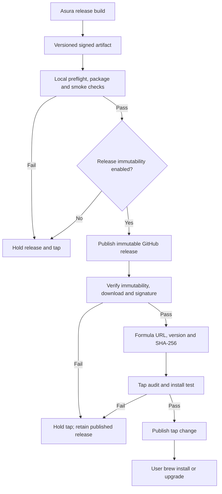
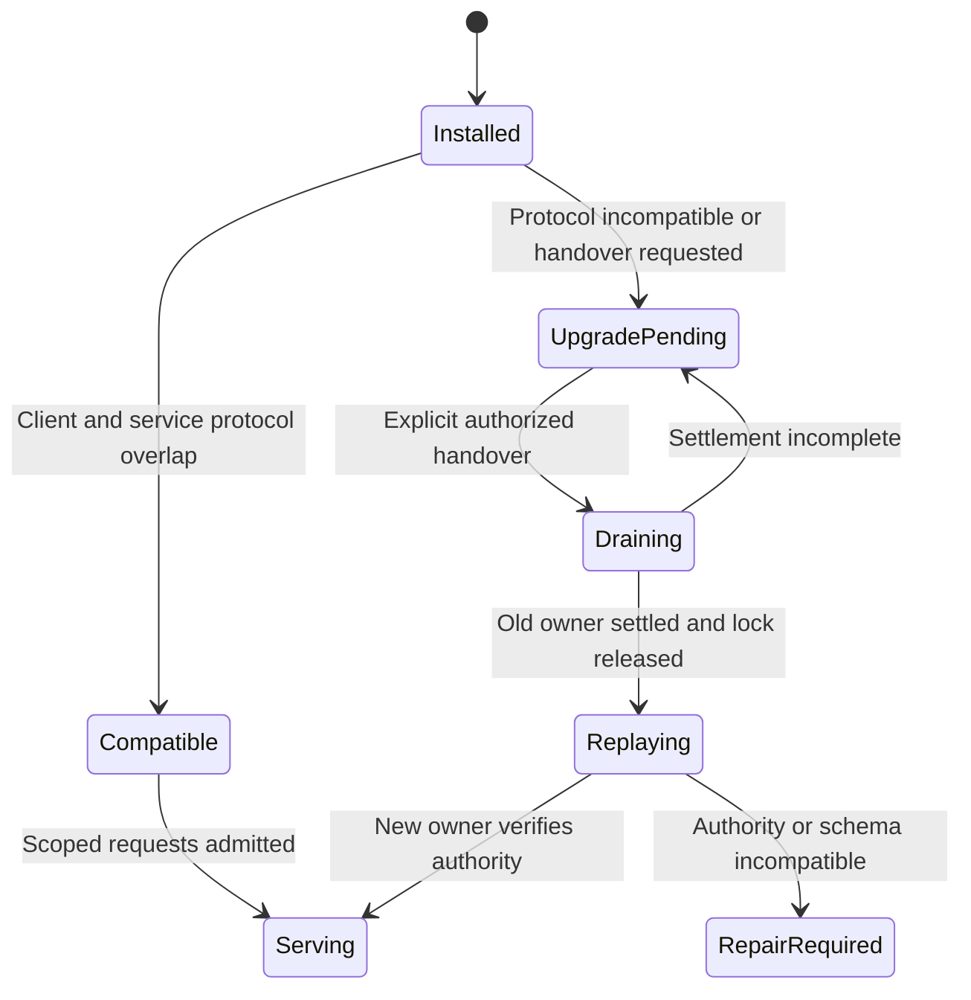

# D7 release distribution through the Homebrew tap

Status: proposed D7/I9 distribution design. [ADR-0008](../decisions/0008-homebrew-tap-distribution.md)
selects the existing `pidster/homebrew-tap` and prebuilt GitHub release pattern.
The exact Asura archive layout, signing/notarization procedure, formula update
automation and service handover remain open. No release is implemented or
qualified.

The [system architecture](system-architecture.md) owns standalone service
startup and protocol negotiation. The [authority recovery design](persistence-recovery.md)
owns durable state and schema migration. This design owns distribution artifacts,
formula behavior and installation/upgrade validation. The tap contains the
[Wisp formula](https://github.com/pidster/homebrew-tap/blob/main/Formula/wisp.rb),
which installs two prebuilt executables. Wisp's
[release script](https://github.com/pidster/wisp/blob/main/scripts/release)
builds both language components, packages the executables and `LICENSE`, hashes
the archive and generates the formula. Its dry run performs local build and
packaging but prints remote publication steps. These are reference behavior,
not Asura implementation or proof of Wisp's signing. The
[Wisp release guide](https://github.com/pidster/wisp/blob/main/docs/release.md)
currently calls the package single-binary; Asura must test its actual archive
contents against its own manifest instead of relying on prose alone.

## Artifact and formula contract

The release pipeline must produce a versioned macOS artifact for each supported
architecture and macOS floor. For the first release, architecture support is
Apple silicon and macOS 27 or later, matching the architecture baseline. The
artifact must contain the `asura` command and all runtime libraries, helpers,
resources and metadata needed by its CLI, TUI and per-user service. D2 decides
whether these are one or several executables; Wisp's two-binary layout does not
decide Asura's process topology. The release must state the exact minimum OS,
architecture, protocol range and authority schema range. D2 must fix the
Swift/Rust packaging layout and runtime resource lookup before a formula can
name an asset. Relocating the archive into a Homebrew keg must not leave a
runtime dependency on a build-tree path or the developer's machine.
The first Rust and Swift LSP adapters use identity-checked installed toolchains;
the Asura artifact does not include those language servers. If a toolchain is
absent or mismatched, Asura reports that LSP capability unavailable and retains
ordinary source inspection. I9 must test both the qualified-toolchain and
missing-toolchain paths from a relocated installation.
The [local-model boundary proposal](swift-rust-boundary.md#artifact-and-resource-boundary)
currently places a private Swift model helper beside the Rust command; D2 must
qualify that layout before it becomes a release manifest.

The `asura` formula in `pidster/homebrew-tap` must use a versioned, immutable
Asura GitHub release URL and its exact SHA-256. It must install only the declared
release payload and run a no-state `--version` test for every installed Asura
executable, as Wisp's formula does. [Homebrew formula tests](https://docs.brew.sh/Formula-Cookbook#add-a-test-to-the-formula)
run with a temporary
`HOME`, while Asura resolves the actual account home. I9 must therefore prove
that every formula test performs no service startup or authority write. A
version assertion alone is insufficient release evidence. The formula must
also exercise one offline package/resource check without opening the service;
D2/D7 must choose its exact command and expected result. The
formula must declare the supported architecture and macOS floor. It must not launch the
service, initialize `.asura`, migrate authority, or delete user data in install,
upgrade, test or uninstall hooks. An archive digest verifies downloaded bytes;
I9 must separately verify the selected code-signing and notarization contract.
The formula update is published only after the artifact and fresh-install test
pass. The canonical release version in every binary, archive, GitHub tag and
formula must match. The prospective install command is
`brew install pidster/tap/asura`; [Homebrew tap trust](https://docs.brew.sh/Tap-Trust#installing-from-a-tap)
grants trust to that formula rather than requiring whole-tap trust.

### Release promotion contract

The release operator starts from one reviewed, clean source revision and a
version not already tagged. A dry run executes the local preflight, build,
package inspection and smoke checks without changing a tag, GitHub release or
tap. The release pipeline records the source revision, locked dependencies,
toolchains, artifact names, checksums and signature verification results. It
checks that all expected executables and resources are present and no private
path, credential, model weight or undeclared binary is packaged.

Before release, the repository must enable
[GitHub release immutability](https://docs.github.com/en/code-security/how-tos/secure-your-supply-chain/establish-provenance-and-integrity/prevent-release-changes).
The operator prepares a draft with all required assets, then publishes it and
verifies that the release is marked immutable. GitHub documents that this locks
the associated tag and assets after publication; the formula checksum still
verifies the downloaded bytes independently. If immutability is unavailable
before publication, the release stops. If publication succeeds but its
immutability or downloaded bytes cannot be verified, the published release
remains visible, but the tap update stops. A corrected artifact needs a new
version and tag; the operator must not replace the published bytes. The operator
verifies the downloaded asset against the local digest and signature before
making the tap change. The tap
formula is generated from that qualified version, asset URL and digest. Its
audit, formula test and a clean-host installation against the published asset
must pass before the tap commit is published. A failure after the release exists
holds the tap update and retains the last published formula. D7 must specify
the exact script, required checks,
signing identity and publication permissions before this is ready.

### Publication path

Proposed release view. Arrows show artifact promotion and consumer checks.
The tap update follows artifact qualification; it does not build Asura.

## Service lifecycle across Homebrew operations

Installing the command does not create an Asura installation. First launch
attaches to an existing service or starts one under the selected per-user
contract. Explicit Initialize remains the only action that can create the
authority root. Homebrew itself is not a service supervisor.

An upgrade may make a new client executable available while the old service
continues running. The client and service must exchange a bounded, stable
maintenance handshake before any stateful request. It identifies the service
build, compatible control-protocol range, authority-schema version, owner
generation and lifecycle state. The first release must define this minimum
handshake so future clients can report incompatibility without interpreting
unknown control frames. An incompatible client reports UpgradePending without
changing state. A compatible client may continue through the old service and
must identify which service version supplied its results.
Before requesting handover, the new client checks the advertised authority
schema against its reader and any explicitly designed migration. It refuses
handover when it cannot safely open the current state.

An explicit authorized handover request names the observed owner generation
and has a stable request ID. The old service rejects a stale generation. Its
orchestrator serializes a drain barrier with task and action admission: no new
work passes the barrier, and one durable frame records the drain and the set of
already accepted work. Status and cancellation remain available under their
normal control contract. It acknowledges the drain only after that frame is
committed. It then settles or durably records existing tasks, closes the
endpoint and releases the owner lock last. The new executable can replay authority only
after it acquires the same lock and verifies its own schema compatibility. A
live failed or incomplete drain leaves the old owner serving recovery and
control. If the old process crashes, the next lock winner replays the drain
frame and all prior accepted requests before admission; it does not assume a
successful handover. Neither case may create a second owner. D2-D3 must define the exact maintenance
frame, drain result and settled-task criteria before implementation.

Neither a formula hook nor a client version mismatch may kill the active
service, discard a task, start a competing owner or migrate data implicitly.
An authority migration needs its own recorded operation and compatibility
decision. It cannot be inferred from an updated Homebrew symlink.

If installation or formula publication fails, the prior published artifact and
formula remain the rollback reference; Homebrew may have removed an old local
keg. An older executable must reject an authority
schema it cannot read; a binary downgrade cannot silently restore older
authority files. Uninstall removes installed binaries, not `.asura`, the
runtime guard or external SurrealDB. After uninstall, a running service may
still exist; D2/I9 must select and validate the user-facing shutdown and
reinstall behavior before release.

[Homebrew normally removes old formula versions during upgrade](https://docs.brew.sh/FAQ#how-do-i-keep-old-versions-of-a-formula-when-upgrading).
An old service can therefore outlive the executable, helper or resource path
from which it started. It must not assume that path remains usable or re-exec
it to hand over. Before each helper/resource-dependent action, the service
checks that the required versioned resource remains available and authentic.
The private Rust–Swift model channel requires the service's exact packaged
helper-build and protocol identities. This differs from the client-to-service
control handshake, which may accept a compatible protocol range. An old
service cannot substitute the newly installed helper when its matching keg
disappears; it keeps control available and reports model work unavailable
until a valid matching helper returns or service handover completes.
If a required resource is unavailable, the service rejects new dependent work. It resolves
accepted work through the
[common failure-settlement contract](core-harness-brief.md#common-failure-and-deadline-contract):
a proved unstarted action can complete with a typed missing-resource failure,
while an action with an
uncertain external effect remains in reconciliation until its effect is known.
The service keeps status, cancellation and handover responsive. A newly
installed client starts its own
verified executable only after the old owner releases the lock. D2 must select
how long-running operations retain their resources and how to settle effects
if a path disappears mid-operation; the design cannot claim seamless active
work across Homebrew cleanup until those cases pass.

### Upgrade admission state

Proposed state view. Arrows show version and handover outcomes. A client never
infers that an installed binary replaced a live service.

## Qualification gates

| ID | Scenario | Required evidence |
| --- | --- | --- |
| HD1 | Clean supported macOS host installs from tap | Formula resolves the exact qualified artifact; version, signature, resources and no-state install behavior pass. |
| HD2 | Unsupported architecture or macOS | Formula or binary rejects before service or authority creation. |
| HD3 | Upgrade while an old service has active work | New client negotiates compatibility or reports UpgradePending; the drain barrier accounts for every accepted request before handover. |
| HD4 | Service crash during handover | Sole-owner recovery replays original requests and tasks before new admission. |
| HD5 | Formula or download digest failure | Installation fails without changing `.asura` or the bound graph. |
| HD6 | Uninstall then reinstall | User data persists; compatible reinstall reopens the original installation only after binding verification. |
| HD7 | Older binary after authority schema migration | It rejects the unknown schema and does not write or roll back state. |
| HD8 | Formula test runs on an account with existing Asura state | Version checks create no socket, service or authority write, regardless of Homebrew's temporary `HOME`. |
| HD9 | Relocated archive includes several executables or runtime resources | Manifest, exact shared build and private-protocol identities, signature and executable resource lookup pass from an installed keg without build-tree paths. |
| HD10 | Release dry run or prepublication check fails | No tag, release asset or tap commit is changed; the previous formula remains installable. |
| HD11 | Homebrew removes the old keg while its service runs | Old owner neither re-execs a missing path nor dispatches with missing helpers; accepted effects reconcile, controls respond and new owner waits for the lock. |
| HD12 | GitHub release immutability is disabled or unverified | The release gate stops before tap publication; a checksum alone does not satisfy immutable-asset availability. |
| HD13 | Remote asset or clean-install check fails after release publication | The published release remains, the tap stays on its prior formula, and any corrected artifact gets a new version. |
| HD14 | Installed service finds a helper from another package build or private protocol | It rejects before model content, never substitutes a helper from a new keg, reaps any spawned mismatch and reports model unavailability while control remains usable. Unit identity checks, installed-artifact integration and CLI end-to-end evidence. |

D7 must map each case to unit checks for version/admission decisions,
integration checks for real artifact/formula/service interactions, and end-to-end
checks on clean supported hosts. I9 must record commands, host versions, signing
identity, artifact digest and observed results. The distribution design remains
proposed until D2-D3 define exact service handover, D7 defines the release
procedure and I9 has a runnable qualification packet.
