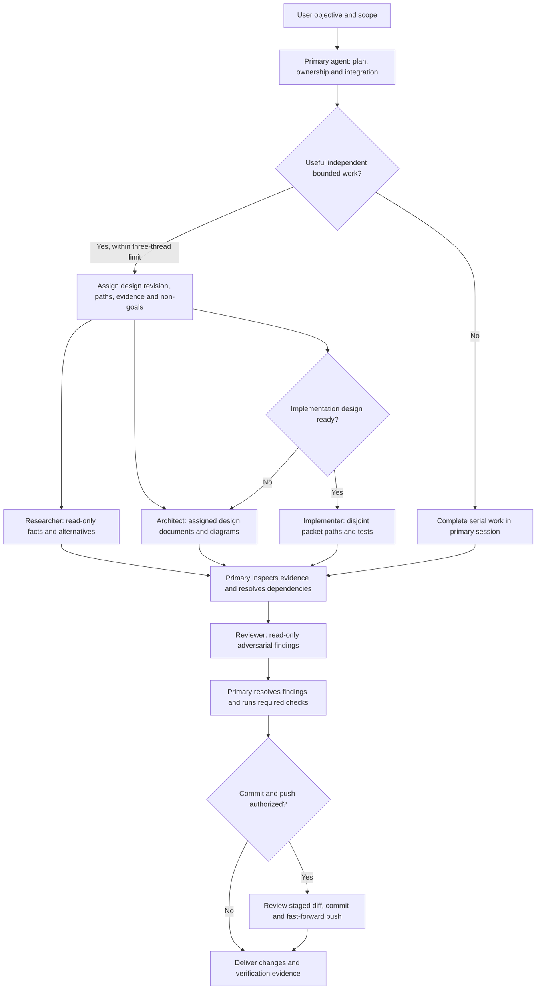

# Repository agent configuration

Status: ready configuration design for development agents working on Asura.
This configures Codex as a development tool; it does not implement Asura's own
orchestrator or select its runtime dependencies.

## Scope and ownership

`AGENTS.md` owns shared conduct, design/testing gates, delegation rules and
publishing practices. `.codex/config.toml` owns project-local Codex settings.
Standalone files in `.codex/agents/` add narrow role instructions; they reference
the shared guidance and do not duplicate or override its contracts.

The selected settings enable live documentation search and native subagent tools,
with at most three concurrent spawned threads. Model and reasoning choices remain
inherited. Project settings do not change the user's approval mode, parent sandbox,
credentials, providers, global trust, telemetry destinations, MCP servers or plugins.
Read-only roles declare a read-only default and must also follow their explicit
no-edit instruction; runtime permission overrides can affect sandbox defaults.

The configuration uses the installed Codex 0.154.0 interface and the current
[official configuration reference](https://learn.chatgpt.com/docs/config-file/config-reference).
Project settings require project trust. Trust remains a user/machine decision and
is not set in this repository. See [configuration precedence](https://learn.chatgpt.com/docs/config-file/config-basic).

## Roles and workflow

| Role file | Responsibility | Allowed changes |
| --- | --- | --- |
| `researcher.toml` | Verify repository/SDK/API evidence and alternatives with sources and proof limits | None |
| `architect.toml` | Produce scoped designs, Mermaid views, contracts and test specifications | Assigned documentation only |
| `implementer.toml` | Deliver a ready design packet using canonical owners and all required test layers | Only assigned packet paths |
| `reviewer.toml` | Review correctness, security, recovery, duplication, diagrams and validation evidence | None |

Selected coordination flow. Arrows name assignments and evidence delivery; the
primary agent remains responsible for reconciling findings and integrating edits.

Roles are available for useful bounded work, not an instruction to spawn every
role for every task. Their TOML structure follows the
[official subagent documentation](https://learn.chatgpt.com/docs/agent-configuration/subagents).
No model overrides or external endpoints are bundled with these roles.

## Capability use and boundaries

Use native code search, parallel read-only calls, long-running tool sessions,
current primary-source browsing, appropriate skills, and local visual inspection
as the task needs. UI automation serves UX verification when applicable. These
are workflow instructions, not promises that every installation exposes each tool.
Missing capabilities must be reported or replaced with an equivalent verified
method within the task's authority.

The configuration adds no shell hooks, executable skills, unattended automation,
external communications, or recursive agent servers. Product code remains gated
by the existing design process. Configuration does not bypass any managed policy.

## Validation and failure handling

This change is configuration and documentation, not a new executable component.
Validate at three boundaries:

1. Structural: parse each TOML file; require unique role names and the documented
   `name`, `description`, and `developer_instructions` fields; inspect the shared
   instruction references and owned-path restrictions.
2. Integration: use the installed CLI's strict config loader and read-only
   diagnostics to verify supported settings and project/role discovery. An ignored
   untrusted project or unsupported field is not a passing activation check.
3. User workflow: inspect the loaded agent catalog/instruction input without
   starting model work if local diagnostics expose it. State the limit if only
   parsing/loading was tested; do not claim that each role completed a live task.

Render this diagram using the repository's diagram validation procedure. Keep
temporary diagnostics and previews outside the repository. If inspection reveals
an incompatible field, correct the configuration within this design; if the role
mechanism differs, revise the design before adding an alternative mechanism.

Future build/test commands and implementation-dependent hooks require their own
designs. Do not add placeholders that silently pass or pin machine-local tool paths.

### Initial verification

On 2026-09-19, Codex 0.154.0 accepted the configuration through its strict loader.
A read-only `config/read` call confirmed the repository config layer, live search,
enabled agents, and the three-child concurrency limit. All four standalone role
files parsed and met the required-field and ownership checks. Local prompt
inspection confirmed the updated `AGENTS.md` instructions were included.

The standalone role catalog was not exposed by that prompt inspection; no live
model task was started to test role selection. The broader doctor command also
reported unrelated local-state and connectivity issues, so it was not a clean
overall health check. These results establish configuration loading and structural
validity, not end-to-end execution of each role.
