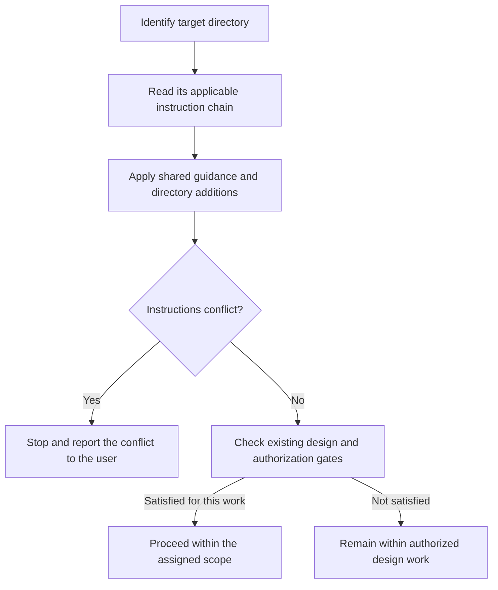
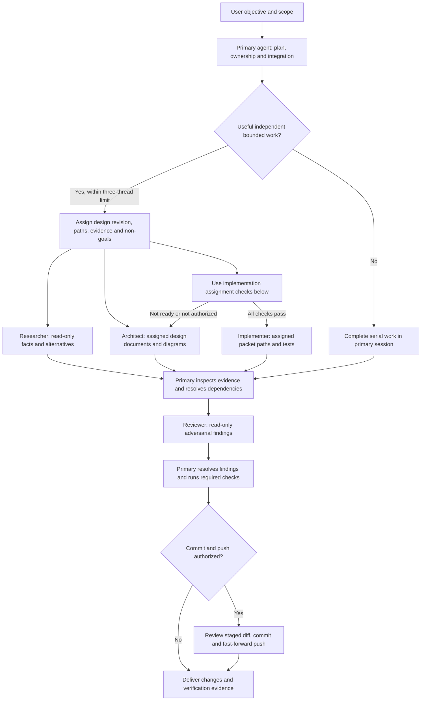
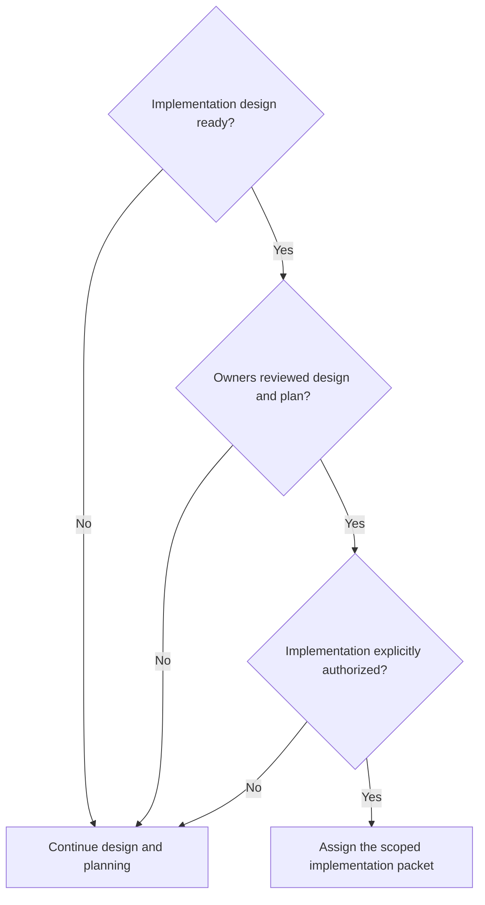
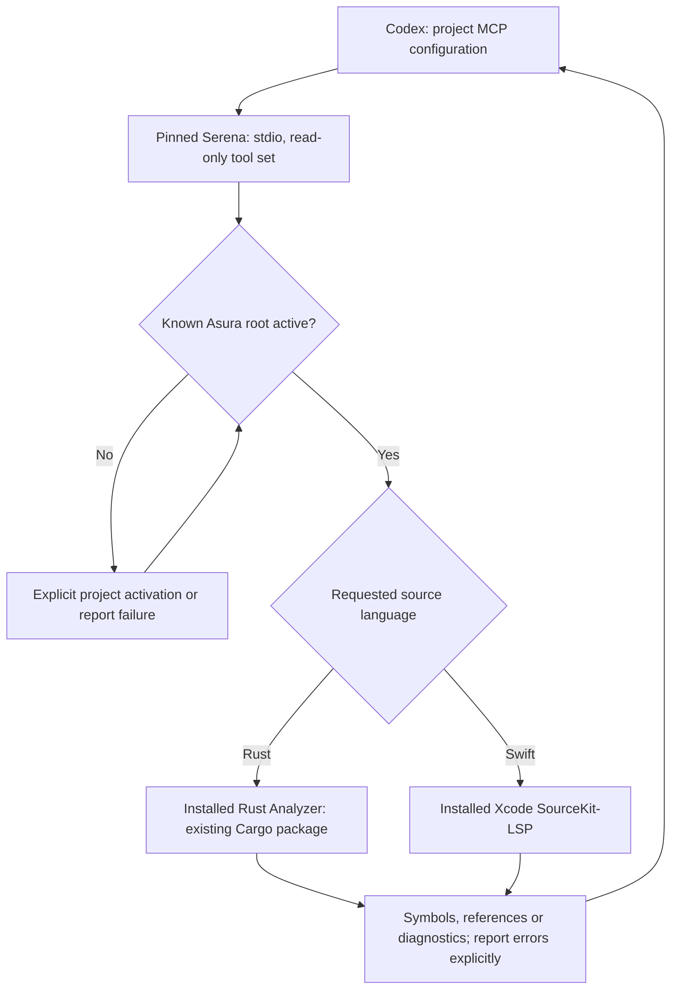

# Repository agent configuration

**Status: Selected design.** This document governs the existing Codex development
configuration. Its recorded validation is in [Initial verification](#initial-verification).

**Required behavior:** Product work remains limited to design and planning until
repo owners review the design and plan, then explicitly authorize implementation.
This configuration does not select Asura's runtime dependencies.

## Scope and ownership

`AGENTS.md` owns shared conduct, design/testing gates, delegation rules and
publishing practices. `.codex/config.toml` owns project-local Codex settings.
Standalone files in `.codex/agents/` add narrow role instructions; they reference
the shared guidance and do not duplicate or override its contracts.

The selected settings enable live documentation search and native subagent tools,
with at most three concurrent spawned threads. Model and reasoning choices remain
inherited. Project settings do not change the user's approval mode, parent sandbox,
credentials, providers, global trust, telemetry destinations or plugins. The
subsequently authorized local LSP bridge is specified below.
Read-only roles declare a read-only default and must also follow their explicit
no-edit instruction; runtime permission overrides can affect sandbox defaults.

The configuration uses the installed Codex 0.155.1 interface and the current
[official configuration reference](https://learn.chatgpt.com/docs/config-file/config-reference).
Project settings require project trust. Trust remains a user/machine decision and
is not set in this repository. See [configuration precedence](https://learn.chatgpt.com/docs/config-file/config-basic).

## Directory-scoped instructions

**Selected on 2026-09-24:** Use nested `AGENTS.md` files for instructions specific
to a directory and its descendants. The root
[instruction policy](../../AGENTS.md#directory-scoped-instructions) owns the reading,
scope and conflict rules. Role files continue to reference that shared policy.

| Location | Responsibility | Delivery state |
| --- | --- | --- |
| Root `AGENTS.md` | Shared conduct, design gates, required validation and instruction discovery | Exists |
| `rust/AGENTS.md` | Rust-specific guidance and links to canonical language rules and selected checks | Planned with the Rust code tree |
| `swift/AGENTS.md` | Swift-specific guidance and links to canonical language rules and selected checks | Planned with the Swift code tree |
| Deeper `AGENTS.md` | Additional component instructions where its contract requires them | Add only when that directory needs distinct guidance |

The language paths follow the [proposed layout](../plans/architecture-and-design.md#proposed-repository-layout).
This decision selects instruction scoping, not the remaining module layout or
implementation mechanisms. Create each language instruction file with its
authorized code tree. The [coding standard](../coding-standards.md) remains a draft;
selecting nested instructions does not adopt its proposed rules.

Codex's documented startup discovery follows the project-root-to-working-directory
chain. A session started at the root must still inspect instructions for a deeper
edit target. The root policy therefore requires explicit discovery for every
affected subtree. See [official instruction discovery](https://learn.chatgpt.com/docs/agent-configuration/agents-md).

### Instruction scope before editing

Selected reading process. Arrows show the next check for each target subtree.
“Applicable chain” includes the root and ancestor directories of that target;
sibling guidance does not apply. The existing implementation gate remains separate.

When nested files are introduced, validate their links, declared scope and
consistency with parent guidance. Inspect instruction discovery from the root
and from each affected subtree in fresh sessions. Also verify that a cross-tree
assignment reads both applicable chains. Record automatic loading and explicit
file reads separately; neither establishes automated enforcement of coding rules.

## Roles and workflow

| Role file | Responsibility | Allowed changes |
| --- | --- | --- |
| `researcher.toml` | Verify repository/SDK/API evidence and alternatives with sources and proof limits | None |
| `architect.toml` | Produce scoped designs, Mermaid views, contracts and test specifications | Assigned documentation only |
| `implementer.toml` | Deliver a ready design packet using canonical owners and all required test layers | Only assigned packet paths |
| `reviewer.toml` | Review correctness, security, recovery, duplication, diagrams and validation evidence | None |

### Development-agent workflow

Selected coordination flow. Arrows show assignments and evidence delivery.
The primary agent inspects delegated work and integrates accepted edits.
Design readiness, owner review, and implementation authorization are separate checks.

### Implementation assignment checks

Required behavior. Arrows show whether the primary agent may assign product
implementation. These checks also apply when the primary agent works alone.

Use a role when independent work will help complete the task. Their TOML structure follows the
[official subagent documentation](https://learn.chatgpt.com/docs/agent-configuration/subagents).
No model overrides or external endpoints are bundled with these roles.

## Capability use and boundaries

Use native code search, parallel read-only calls, long-running tool sessions,
current primary-source browsing, appropriate skills, and local visual inspection
as the task needs. UI automation serves UX verification when applicable. These
are workflow instructions, not promises that every installation exposes each tool.
Missing capabilities must be reported or replaced with an equivalent verified
method within the task's authority.

The configuration adds no shell hooks, executable skills, unattended automation,
external communications, or recursive agent servers. Product code remains gated
by the existing design process. Configuration does not bypass any managed policy.

## Validation and failure handling

This change is configuration and documentation, not a new executable component.
Validate at three boundaries:

1. Structural: parse each TOML file; require unique role names and the documented
   `name`, `description`, and `developer_instructions` fields; inspect the shared
   instruction references and owned-path restrictions.
2. Integration: use the installed CLI's strict config loader and read-only
   diagnostics to verify supported settings and project/role discovery. An ignored
   untrusted project or unsupported field is not a passing activation check.
3. User workflow: inspect the loaded agent catalog/instruction input without
   starting model work if local diagnostics expose it. State the limit if only
   parsing/loading was tested; do not claim that each role completed a live task.

Render this diagram using the repository's diagram validation procedure. Keep
temporary diagnostics and previews outside the repository. If inspection reveals
an incompatible field, correct the configuration within this design; if the role
mechanism differs, revise the design before adding an alternative mechanism.

Future build/test commands and implementation-dependent hooks require their own
designs. Do not add placeholders that silently pass or pin machine-local tool paths.

### Initial verification

On 2026-09-19, Codex 0.154.0 accepted the configuration through its strict loader.
A read-only `config/read` call confirmed the repository config layer, live search,
enabled agents, and the three-child concurrency limit. All four standalone role
files parsed and met the required-field and ownership checks. Local prompt
inspection confirmed the updated `AGENTS.md` instructions were included.

The standalone role catalog was not exposed by that prompt inspection; no live
model task was started to test role selection. The broader doctor command also
reported unrelated local-state and connectivity issues, so it was not a clean
overall health check. These results establish configuration loading and structural
validity, not end-to-end execution of each role.

## Rust and Swift semantic tooling

Selected on 2026-09-24 at the owner's request to configure Rust and Swift LSP
servers for Codex. This is development tooling, separate from Asura's runtime LSP
integration. Current Codex configuration exposes MCP rather than a native LSP
server registry. Use [Serena's Codex integration](https://oraios.github.io/serena/02-usage/030_clients.html#codex-cli-and-app)
as a local stdio bridge to the installed Rust Analyzer and Xcode SourceKit-LSP.
Do not register raw LSP executables as MCP servers.

Pin Serena to source revision `7a2968335f2198b966864de1ce3655c8e485a653`;
its declared package version is `2.0.0.dev0`. Inspect and qualify this revision,
then use the installed `uvx` runner to launch it. Installation may fetch the
bridge and its declared Python dependencies; code queries use local processes.
Do not install another Rust/Swift toolchain or change terminal/application settings.

`.codex/config.toml` owns the Asura-only MCP entry. `.serena/project.yml` owns
language selection (`rust`, `swift`), UTF-8, read-only mode and ignored generated
files. Retain standard gitignore handling; exclude target, virtual environments,
Swift build outputs and Serena caches. The existing Cargo package remains the
Rust build root; do not create a root Cargo workspace or Swift product scaffolding.
Swift project-wide validation remains unavailable until a Swift tree exists.

Expose only project activation, current configuration, initial instructions,
symbol overview, symbol search, reference search and file diagnostics. Match the
bridge's fixed tool set with Codex's allowlist. No editing, shell, memory-writing,
onboarding or dashboard tools are selected. Disable the web dashboard, browser
opening and GUI log window. Existing host permissions and project instructions
continue to apply; read-only tools are not an OS sandbox for language servers.
The new local Serena configuration trusts only Asura; existing Codex trust is
unchanged. Project Rust settings use the installed `rust-analyzer` executable and
link the existing experiment Cargo manifest, avoiding automatic toolchain setup.
Keep local logs and caches untracked. Do not copy machine-specific paths into
tracked configuration.

Start with `--context codex --project-from-cwd`. Explicit activation of the known
Asura root is available when the app starts its server outside that directory.
Never infer a project from a different working directory. The agent must check
current configuration before querying. A failed startup or inactive project is
reported; it does not silently fall back to a different repository.

### Language-server request flow

Selected tooling flow. Arrows show local requests; source content is returned to
the Codex conversation under its existing permissions. No Asura service is involved.

### Tooling qualification

- **LS1 configuration:** Parse TOML/YAML, validate supported tool names and the
  exact source pin, and inspect Codex's resolved MCP entry. Existing entries and
  approval/sandbox settings must remain unchanged.
- **LS2 integration:** Initialize the actual MCP subprocess, enumerate its tool
  catalog and verify the allowlist excludes editing, shell and memory writes.
  Activate Asura and obtain symbol results from `experiments/tui-chat/src/editor.rs`.
  Shut down and confirm subprocess cleanup.
- **LS3 Swift and failure handling:** Use a disposable local Swift fixture outside
  tracked product paths to check SourceKit-LSP initialization and symbol retrieval.
  Missing/invalid files must produce an explicit result without changing source.
  This is server smoke evidence, not a Swift product build or cross-file proof.
- Render and inspect the diagram. Record installed server/toolchain versions,
  results and limitations. A subprocess smoke test is not proof that this already
  running Codex session has reloaded its tool catalog; reconnect or start a new
  session when required by the client.

Primary owns design, configuration, installation and integration. A read-only
researcher checks the pinned upstream contracts before configuration changes.

### LSP setup verification on 2026-09-24

Installed and cached the pinned Serena revision with `uvx`; subsequent offline
launch succeeded. The source pin fixes Serena itself, not every transitive Python
package. The project MCP entry resolves as enabled in Codex CLI 0.155.1. TOML/YAML
settings select the same seven tools. Serena's local base catalog is also limited
to those seven: project-only filtering leaves inactive tools in the MCP catalog.
The local Serena configuration trusts only Asura and leaves Codex trust unchanged.

A real MCP subprocess reported Asura active and both language servers ready.
Rust symbol overview and `Editor` lookup returned the expected definitions from
the current `editor.rs`. A separate disposable Swift fixture returned `LspProbe`
and its source location through SourceKit-LSP. Both rejected a missing file with
an explicit error and closed their language-server processes successfully.
The fixture does not qualify Swift build integration or cross-file references.
Diagnostics and reference tools are configured; these smoke checks qualify symbol
retrieval and initialization, not every operation those servers support.

Installed tools: Homebrew Rust Analyzer commit `682a84e95b` dated 2026-09-13;
Apple Swift 6.4 and Xcode 27.0 (`27A266a`) provide SourceKit-LSP. The default
Rust Analyzer build/check behavior remains enabled for the existing Cargo package.
No new Asura runtime code, root workspace or Swift product code was introduced.
No editing, shell, onboarding or memory-writing tool is exposed by this bridge.

The current conversation's tool catalog was established before configuration.
Reconnect the MCP server or start a new Codex session to expose `asura_lsp` tools.
Then read its initial instructions and verify Asura is the active project; use
explicit project activation if the app launched the bridge from another directory.
The fresh client connection itself remains a separate check.

The LSP diagram rendered and was visually inspected with Mermaid CLI 11.16.0.
Final documentation checks passed for 42 Markdown files, 426 local links/anchors
and four directory indexes. `git diff --check` passed. Independent tracked-config
review found no material issue; it did not repeat the MCP smoke checks or inspect
local secrets. No commit or push was requested.
