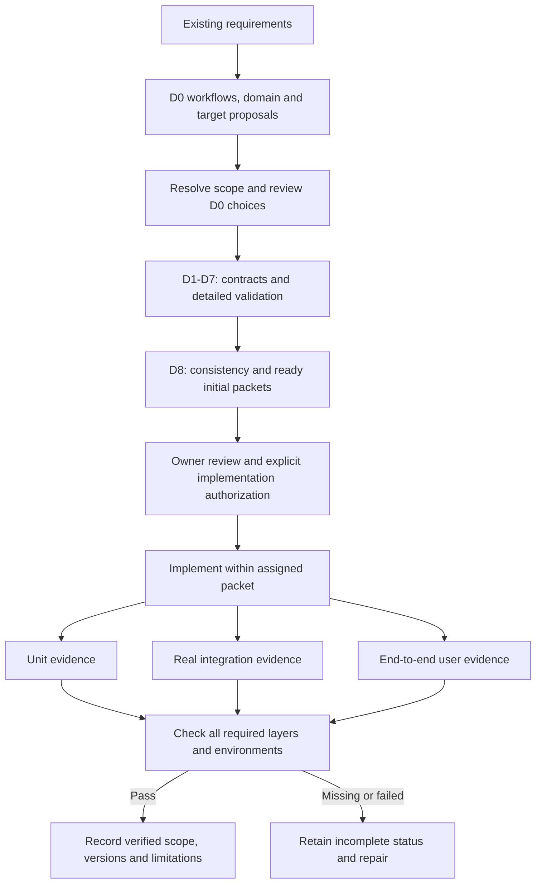

# D0 requirements and validation matrix

Status: initial traceability proposal for the selected local CLI/TUI release with
on-device assistance. Existing requirements remain required; D0 refinements and
objective values await review. All product implementation,
runtime verification and release states are **not started**. No row is a passing
test or an implementation authorization.

## Ownership and use

This matrix owns coverage tracking, not duplicate behavioral contracts. The
[workflows](product-workflows.md) define W0-W6 and proposed P0-P9 objectives.
The [domain model](domain-model.md) defines proposed relationships. Existing
briefs retain their lifecycle, storage, configuration and security contracts.

The primary design coordinator maintains this index. D1-D6 resolve the named
contracts. D7 assigns distinct executable test IDs to each fault/race combination,
pins environments and commands, and records artifacts. D8 checks completeness.
Unit, integration and end-to-end evidence are cumulative; mocks cannot substitute
for real platform, storage, model or remote-boundary evidence.

### Requirement to delivery

Required traceability with proposed D0 artifacts. Arrows show dependencies and
evidence flow. Review approval and implementation authority remain separate.

## Preserved architecture scenarios

R01-R13 preserve the numbered
[architecture review scenarios](../plans/architecture-and-design.md#scenarios-that-must-survive-the-design-review).
An increment is the first delivery boundary for the stated behavior, not a reason
to postpone its architectural design. Later increments repeat relevant earlier
cases when a new boundary changes their proof obligations.

| ID | Behavior and workflow | Governing contract / design stage | Delivery |
| --- | --- | --- | --- |
| R01 | Non-interactive investigation returns evidence and deterministic status; W2 | Harness; D3-D4, D6 | I1 control; I2-I3 investigation |
| R02 | Interactive investigation, remote help, permitted edits and validation | Harness and provider/edit designs; D4-D6 | I4 interaction, I5 inference, I6 edits |
| R03 | Second client sees and controls the same task; W3-W4 | Service C1, harness control; D3, D6 | I1, repeated I4 |
| R04 | Stalled model does not stall status/cancel; W3-W4 | Architecture control API; D2-D4 | I3 |
| R05 | Crash after effect does not cause blind replay; W4-W5 | Harness failure, storage B4; D3-D4 | I1-I2, repeat I5-I7 |
| R06 | Changed source invalidates evidence and proposal; W2 | Harness context/model contract; D4 | I2-I3 |
| R07 | Denied/unavailable inference explains options without disclosure | Policy and provider designs; D1, D5-D6 | I5; no remote fallback in I3 |
| R08 | Remote disconnect preserves ownership, expiry and recovery | Harness remote budget contract; D5 | I7 |
| R09 | Hostile input cannot expand authority; collector outage preserves control | Policy brief, architecture telemetry; D1-D4, D6 | I1-I3, repeat I5-I7 |
| R10 | Pause/cancel during reconciliation survives restart; W4 | Harness H3, implementation A3; D3-D4 | I1-I2 |
| R11 | Response/expiry/cancel race has one durable winner; W3 | Harness H4, implementation A3; D3-D4 | I1-I2 |
| R12 | Revoked/deleted retained model input cannot affect later work; W2-W3 | Model-session contract, implementation A5; D4 | I3 |
| R13 | Build descendants and aliases cannot write protected source; W2 | Implementation A4 and I2 boundary; D1, D4 | I2; extend for I6 |

For R01, D3/D6 must distinguish accepted/running, succeeded, failed with known
effects, failed with uncertainty and cancelled outcomes in structured output.
They select exact exit codes and whether a request waits or detaches. Transport
failure must not be reported as proof that a task failed or never started.

R02, R07 and R08 remain required architecture scenarios beyond the selected I4
first-release functionality. That release cannot claim remote-assisted editing
or remote-host completion. Their later designs still constrain earlier interfaces.

## Required evidence by scenario

U, I and E describe unit, integration and end-to-end evidence. Each cell describes
a validation obligation, not an existing test suite. Canonical detailed cases are
linked below; D7 must split combined conditions into independently identifiable tests.

| ID | U: isolated rules | I: real boundaries | E: user-visible result |
| --- | --- | --- | --- |
| R01 | Typed status and scope validation | Durable submission, tool evidence and result records | CLI investigation with status and cited evidence |
| R02 | Edit preconditions, budgets and completion criteria | Provider, edit transaction and validation tools | TUI investigation through permitted validated change |
| R03 | Revision conflicts and decision ownership | Two clients, shared service and restart | Attach, respond and cancel without duplicate task |
| R04 | Deadlines and independent control scheduling | Stall real adapter boundary while control remains live | Status/cancel under P0 stalled-inference profile |
| R05 | Intent/outcome distinction and retry decisions | Crash before/after dispatch and durable result | Reopen task and disclose reconciled or unknown effects |
| R06 | Dependency invalidation and proposal versions | Change source between retrieval and operation start | Explain stale evidence and re-evaluate before work |
| R07 | Disclosure manifests and rejection reasons | Actual provider authentication/outage plus deny path | Explain denied help; verify no unauthorized egress |
| R08 | Owner epoch, expiry and reserved envelope rules | Two real hosts, partition and late results | Disconnect, cancel, reconnect and inspect residual effects |
| R09 | Untrusted attributes and bounded telemetry buffers | Host enforcement, unauthorized client, collector outage | Hostile input denied while authorized control remains usable |
| R10 | Cancel precedence and no resume after accepted intent | Persist intent during reconciliation, then crash | Reconnect and observe preserved cancellation and effects |
| R11 | Response/deadline/cancel arbitration | Race and restart at authoritative update boundary | Expired decision cannot restart inference or task work |
| R12 | Effective-context manifest and generation checks | Real model sessions, caches and in-flight invalidation | No reuse across tasks/principals; stale result rejected |
| R13 | Structured request and output-scope rules | Real scripts, subprocesses, aliases and file replacement | Build output permitted; protected source unchanged |

## Cross-cutting coverage

These cases are required in addition to R01-R13. Their canonical definitions
include the initial state, trigger, result and required layers.

| ID | Existing acceptance source | Workflows and delivery | Required environment |
| --- | --- | --- | --- |
| R14 | [Service C1-C5](user-service-configuration.md#validation-required-before-delivery), including the per-user `.asura` root | W1, W4-W5; I1-I2 | macOS service, separate OS users, filesystem, both graph modes |
| R15 | [Storage B1-B5](context-storage-candidates.md#binding-acceptance-cases) and [hybrid H1-H3](context-storage-candidates.md#hybrid-storage-acceptance-cases) | W5; I2 | Actual embedded/external store, managed files, interrupted rebinding and cross-store recovery/restore |
| R16 | [Failure A1](../plans/implementation.md#a1-common-failure-settlement) | W3-W5; I1-I2 | Real durable state and process failures |
| R17 | [Budget A2](../plans/implementation.md#a2-shared-budget-reservations-and-recovery) | W2-W5; I2, extended I3/I5/I7 | Concurrent admission, real store, provider/host usage where claimed |
| R18 | [Security policy deliverables](security-policy-brief.md#required-design-and-validation-deliverables) | W1-W5; I1 onward | Selected evaluator and actual macOS enforcement |
| R19 | [P0-P9 objectives](product-workflows.md#proposed-measurable-objectives) | W1-W5; I1-I4 | Frozen workload, supported hardware, real clients/models/stores |
| R20 | [Default Ratatui chat launch W0](product-workflows.md#w0-launch-chat-by-default) | W0; I4 | Actual Rust backend, concurrent clients, real terminals and redirected input/output |
| R21 | [Async input/signal pipeline validation](../decisions/0006-async-event-pipelines.md#design-handoff-and-validation) | W0-W5; I1 onward, terminal input in I4 | Actual queues, stores, adapters, OS signals and slow consumers |
| R22 | [Multi-project navigation W6-A through W6-D](product-workflows.md#w6-navigate-projects-and-concurrent-activities) | W6; I1 scoped control, I4 single-client navigation | Real TUI and shared service, initial selection, concurrent scoped tasks/agents, second-client races and both graph modes |
| R23 | [Instruction, skill and protocol support IX2-IX3](interaction-and-extension-boundaries.md#validation-obligations) | Delivery assignments open in D0/D4; Agent Plugins later | Real filesystem, supported servers, host enforcement and canonical context/tool paths |
| R24 | [Intuitive interaction goals](interaction-and-extension-boundaries.md#interaction-goals-for-d6) | D6 chat design, I4 interaction; processor separation unselected | Real chat journeys, representative users, accessibility and model evaluation where applicable |
| R25 | [Three in-chat command categories IX4](interaction-and-extension-boundaries.md#ix4-in-chat-command-categories-and-admission) | [Command system](command-system.md) and [TUI discovery](tui-command-discovery.md) proposals; D3-D4/D6 and delivery scope open | Client-only controls, real service admission, extension and skill fixtures, identity/collision/revocation cases |

R18 preserves the distinction between required security capabilities and proposed
policy mechanisms. D1/D3 must resolve policy composition, approval semantics,
activation and audit failure behavior; this matrix does not select an engine.

R19 unit evidence covers timing accounting, metric definitions and bounded
resource policies. Integration evidence runs the profile through real boundaries.
End-to-end evidence measures client-observed results and completes usability and
accessibility review. P6/P7 are invariants across fault tests, not percentile goals.

The [runtime sketch](runtime-architecture.md#validation-and-open-decisions) refines
R20-R21 with proposed RT1-RT5 cases for scheduling, publication, cancellation,
slow consumers and recovery. Its process/queue mechanisms remain proposals.

R22 adds one-client navigation to the existing multi-client coverage. W6-A requires
unit selection/draft rules, real service integration and real-terminal navigation.
W6-B adds delayed commands, decision races and scope-safe retries. W6-C adds
authorized discovery, background event routing, overload and reconnect. D7 must
give every independent fault variant an executable case ID. D6/D7 must also set
and verify navigation latency under load; no numeric navigation target is selected.
W6-D adds service-resolved launch matching and explicit choice for overlap or an
unmatched directory, including stale and unauthorized candidates.

The proposed [status race cases PBS12-PBS14](production-bootstrap-status.md#detailed-status-race-cases)
refine R22 for the early production status slice. They cover scope loss before
disclosure, old responses after reconnect and older observations that finish last.
Each case requires unit rules, real service/transport and Git fault tests, and
draft-preserving journeys in Ghostty and Terminal.app. D3 must resolve publication
ordering and identity semantics before D7 can qualify these cases.

R23 adds required product integration support, not conformance or an implicit I4
scope expansion. IX2/IX3 require unit format/scope/protocol rules, actual integration
boundaries and end-to-end permitted/denied capability use. D0/D4 must select each
delivery profile before implementation.

R24 requires D6/D7 to define observable interaction criteria and usability measures.
Unit message/decision rules, real client/control integration and end-to-end user
journeys remain cumulative requirements. The input processor separation and IX1
are proposals; if selected, its lifecycle and invalidation cases join that coverage.

R24 also covers multiline composition and dynamic information/controls around
the input pane. The [TUI prototype TP1-TP5](tui-interaction-prototype.md#validation-and-owner-trial)
proposes geometry, editing, focus, navigation and terminal trials. Its scripted
driver provides experiment evidence only; production service/agent integration,
end-to-end checks and owner usability evaluation remain required.

## D0 refinement acceptance cases

These proposed cases make the new domain relationships reviewable. They extend
existing coverage and must not replace C1-C5 or the harness regression cases.

### N1: Alias and overlap selection

- **Initial state:** A parent project, nested repository and two worktrees are
  registered. Two contexts explicitly reference one location; an alias reaches it.
- **Trigger:** Resolve by path with and without explicit context/location IDs;
  include overlapping locations within one context. Repeat using the alias, a
  matching remote URL, invalid supplied IDs and an unauthorized registration.
- **Required result:** The proposed domain model yields the same location for
  aliases, distinct identities for worktrees/clones, and explicit ambiguity where
  appropriate. No hidden context is disclosed and no new allowance is created.
- **Unit:** Candidate selection, idempotent association and scope rejection.
- **Integration:** Actual aliases, nested repositories, worktrees and context
  subscriptions; race relocation or replacement against resolution.
- **End-to-end:** Two clients select different contexts without changing each
  other's task scope or exposing private evidence. Report a replaced location.
- **Environment:** Supported macOS filesystem and actual version-control fixtures.

### N2: Conversation is not execution authority

- **Initial state:** One conversation references two tasks. Each task has its own
  model state and budget; a second principal lacks access to the conversation.
- **Trigger:** Attach a second authorized client, send a follow-up, request a task
  revision, then attempt cross-task model-state reuse and unauthorized attachment.
- **Required result:** Explicit commands determine new work versus task revision.
  A transcript cannot mutate goals, extend budgets, grant access or carry retained
  model state into another task. Authorized evidence reuse records provenance.
- **Unit:** Membership, revision conflict and message-kind validation.
- **Integration:** Durable conversation/task references, session isolation and
  concurrent updates through the shared control contract.
- **End-to-end:** Reconnect in another client, inspect both tasks and revise one;
  verify the other task's goals and session remain unchanged.
- **Environment:** Real macOS service, clients, persistence and Foundation Models.

### N3: Attempt identity and uncertain retry

- **Initial state:** An admitted operation has reserved usage; its outcome is unknown.
- **Trigger:** Repeat the control request, restart, and later request another attempt.
- **Required result:** Recover the original identity before dispatching anything
  new. Duplicate delivery cannot allocate again. A new executable attempt requires
  fresh admission and a reservation under all applicable ancestor budgets.
- **Unit:** Action/operation relationships and replay classification.
- **Integration:** Crash around admission/dispatch/settlement with actual persistence;
  race duplicates against recovery and verify retained reservations.
- **End-to-end:** Repeat a timed-out command and inspect one original attempt;
  show any separately admitted retry and its usage without hiding uncertainty.
- **Environment:** Real control clients and stores; actual provider or remote-host
  evidence is additionally required when those boundaries become available.

### N4: Project visibility and linked evidence

- **Initial state:** A newly registered closed context, an open context and two
  contexts in one project group have versioned evidence in the same installation.
- **Trigger:** Select linked evidence for a destination task, then change source
  visibility, group membership or source content before a later model operation.
- **Required result:** Closed data cannot cross contexts. Open and group data
  are only eligible within the same installation and still require per-use
  authorization. A context cannot belong to two project groups at once, and
  group selection requires the source and destination to share their current
  group. Every selected item retains origin and derivation provenance.
  Revocation or source change invalidates affected views and retained input.
  Instructions, task authority and model sessions do not transfer.
- **Unit:** Visibility eligibility, one-group cardinality, current shared
  membership and per-use policy checks; provenance and derived-data invalidation
  decisions.
- **Integration:** Real graph and authority stores, concurrent membership changes,
  rejected second-group membership, stale query results and two clients with
  different project selections.
- **End-to-end:** Request linked evidence, inspect its cited origin, revoke
  sharing and verify that later work cannot reuse it or reveal a closed project.
- **Environment:** Supported macOS service and clients, both SurrealDB modes,
  multiple contexts and a versioned evidence fixture.

## Evidence records and D0 readiness

Each future evidence record must name requirement/case IDs, design and code
revisions, test command, environment versions, fixture identity, observed outcome
and retained artifacts. Record designed, implemented, verified and released states
separately. An unavailable environment leaves its evidence pending.

| D0 exit item | Current state | Resolution needed |
| --- | --- | --- |
| First-release scope | Selected by owner on 2026-09-22: local CLI/TUI with on-device assistance, through I4 plus I9 qualification | Resolved; both storage modes remain required |
| Chat technology and default mode | Ratatui, Rust chat backend and default chat selected on 2026-09-23 | Resolve W0 terminal/startup details in D3/D6 |
| Processing architecture | Fully asynchronous and event-driven, with input/signal pipelines, selected on 2026-09-23 | Resolve ADR-0006 mechanisms and limits in D2-D6 |
| Multi-project interface | One client navigates projects and concurrent activities; ADR-0007, 2026-09-24 | Resolve W6 presentation, discovery, revocation and navigation-latency details in D3/D6/D7 |
| Interaction and integrations | Intuitive chat and AGENTS.md, Agent Skills, MCP/LSP support required; plugins later. AGENTS.md and Rust/Swift LSP enter I2, Skills I3 in the first release; MCP local stdio with tools, resources and prompts enters I6. LSP uses configured, identity-checked installed toolchains | Detailed UX deferred to D6; define MCP prompt activation and LSP identity/conformance details in D4; input processor separation remains proposed |
| Workflows | W0 selected launch behavior; draft W1-W5 | Review workflow refinements and unsupported-capability behavior |
| Domain and identity semantics | One-context conversations, closed-default local visibility, at-most-one group membership and project-parent discovery selected; other relationships remain draft. N1-N4 specify validation | Review overlap, relocation, attempt, parent discovery, membership transitions and revocation semantics |
| Measurable objectives | Proposed P0-P9; no measured baseline | Accept targets or revise from D1-D2 feasibility evidence |
| Traceability | R01-R25 and N1-N4 specified; IX1 proposed, IX2-IX3 await detailed profiles | Review completeness; D7 expands concrete tests and environments |

D0 is not marked complete while these decisions await review. D1 may gather
read-only platform evidence, but must not treat an unreviewed target as a proven
capability. The remaining D1-D8 mechanisms and implementation gate still apply.

## Documentation verification on 2026-09-22

An independent read-only review found three draft issues: observation cardinality,
ambiguity between overlapping locations within one context, and omission of I9
from the release-scope explanation. All three were corrected and rechecked.

Mermaid CLI 11.16.0 rendered all six diagrams in the three new D0 documents.
Each output was visually inspected; the workflow overview was simplified for
readability. All 184 local Markdown links and anchors passed. Whitespace checks
passed for the tracked changes and new documents. Generated previews remained
outside the repository. These are documentation checks only; no product code,
runtime tests, benchmarks or model evaluations were run.
