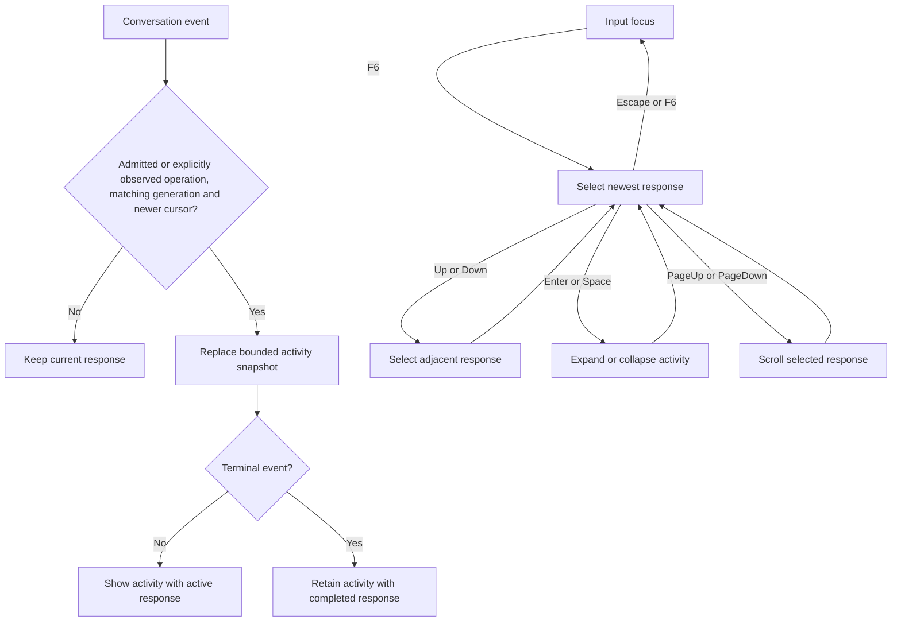
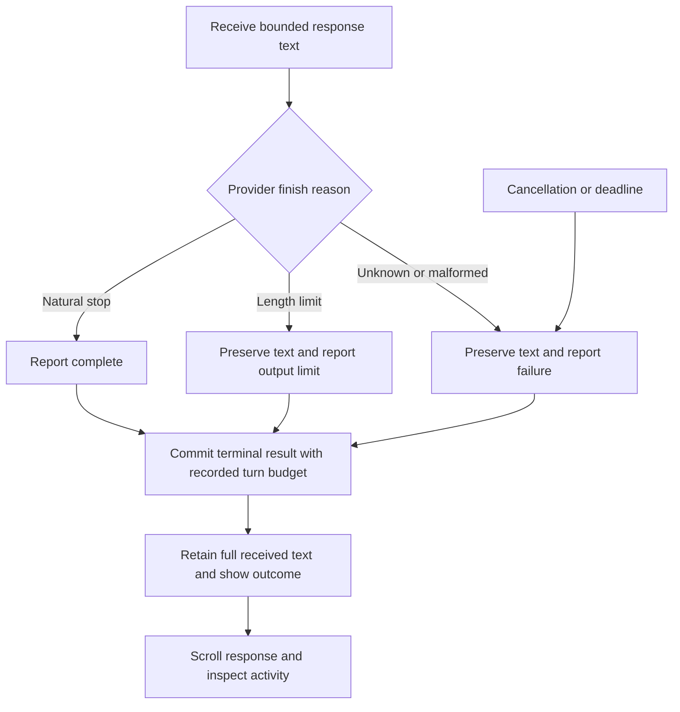
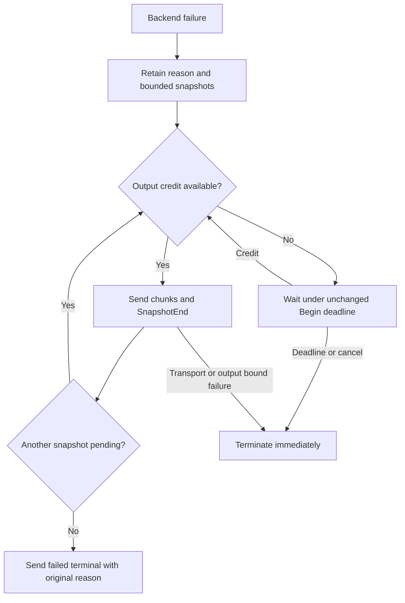
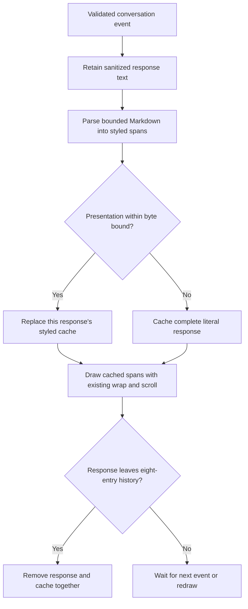

# Response activity and navigation

Status: selected implementation design for live activity and expandable response history.

## Ownership and data

The service owns tool execution and durable intent/result records. Existing
`ConversationEvent.tools` carries a cumulative snapshot of at most eight tools.
Each entry contains ordinal, name, state and result status. Tool acknowledgements
advance the event cursor independently of generated text. The TUI consumes these
snapshots through its existing conversation worker, including pending events.
No transport, journal or protocol numbering changes are needed.

The TUI retains activity beside each of its eight retained response entries.
Operation identity, generation and monotonic cursor prevent a late event from changing another
response. Repeated snapshots replace metadata; they never append duplicate tools.
Equal-cursor empty pending heartbeats preserve the last snapshot. Explicit `/observe`
creates a recovered entry if the operation is absent from local history.
Terminal state closes the response. Disconnect preserves the last observed state;
absence of an event never implies successful completion. Explicit observation can
recover cumulative activity from the service journal. This packet does not add a
browser for conversations from previous TUI launches.

## Interaction

Active responses show their tool list automatically. Each row shows its ordinal,
name and running, complete, failed or interrupted state. Failed rows also show the
result reason. The lifecycle row shows waiting, generating, complete, failed,
cancelled or interrupted. This is execution metadata, not private model reasoning.
Raw arguments, tool output and shell output streaming are outside this packet.

Completed responses show a compact activity summary. F6 enters response navigation
at the newest entry. Up/Down select a response; Home/End select oldest/newest.
Enter or Space expands or collapses its activity. PageUp/PageDown scroll the selected
response by a viewport; selection and scroll remain stable while new events arrive.
Escape or F6 returns to input and follows the newest response. The draft is preserved.
Ctrl+P/N retain their existing input recall function outside response navigation.
Quit and cancellation retain existing routing. The hint row explains the focused
interaction. Selection uses the existing lighter grey-blue palette, without inversion.
Activity text has one character of horizontal padding at each edge; input blue stays
reserved for composer input. The history input's half-block separator supplies the
vertical spacing. Do not add blank rows around activity text between input and
response. Tiny terminals may clip content but must remain operable.

## Selected flow

Arrows describe validated event delivery and user actions.

## Limits, failures and validation

No file, network, model or blocking operation runs in render/key handlers. No new
worker or polling timer is added. Existing conversation cancellation, wakeup and
backpressure contracts remain authoritative. Metadata is limited to eight entries
per response with names limited to 64 bytes, plus scalar state/identity/cursor.
The eight response limit and existing prompt/output bounds remain unchanged.
Evicting an old response also evicts its metadata. Navigation clamps after eviction
or resize. Strings pass through existing terminal-control sanitization.

Unit tests must cover pending activity before text, completed/failed/interrupted
states, duplicate/stale events, operation separation, eviction, expansion, navigation,
scroll, resize and unchanged drafts. Render previews must show active and expanded
activity with the established palette. The actual PTY journey must exercise F6,
response selection, expand/collapse and return to a preserved draft. Service tests
must show tool progress without text and durable terminal/reconnect snapshots.
Run CLI unit and lifecycle checks, focused service coverage, lint and final build.

## Response limits and truthful completion

Selected correction: new admissions reserve 2,048 output tokens. Local custom model
inference with tools allocates 1,024, 512 and 512 tokens across at most three passes.
This replaces the overly small 256/128/128 split. The service retains its 60-second
turn deadline, eight-tool limit and 61,440-byte response bound. Limits remain
necessary; reaching one must preserve received text and mark the response incomplete.
The TUI retains every received response byte within the wire bound, sanitizes control
characters and permits scrolling through the complete retained text.

Historical journal turns retain their recorded 512-token reservation. New turns use
2,048. Replay accepts both and validates each terminal charge against its own turn's
reservation. Recovery charges the recorded reservation if usage is unknown. Journal
format remains 1 and protocol remains 0.1. Model wire limits permit up to 2,048;
per-turn enforcement still uses the actual Begin reservation. Context checks reserve
the actual requested output budget before generation. Small contexts reject excessive
input with context-limit status rather than silently clipping context or output.

The Ollama adapter inspects its finish reason. A length stop preserves the delivered
prefix and reports output-limit. A natural stop reports completion. Unsupported or
ambiguous finish reasons fail explicitly rather than claiming completion. The shared
bounded executor records a typed failure in its turn-local budget state, so SDK error
wrapping cannot turn output-limit into success or an unrelated error. Cancellation
and deadline checks remain active between inference passes and during streaming.

Validation includes natural and length stops, final-chunk text preservation, wrapped
executor failure, exact pass allocations, legacy and new journal accounting, and a
native local Ollama post-tool response longer than 128 tokens with an expected ending.
No heuristic based on punctuation decides whether an answer is complete.

### Selected completion flow

Arrows describe provider finish classification and durable publication.

Ollama `stop` is a natural stop, including tool-call responses. `length` is an
output limit. A missing or empty reason with eval_count at the requested cap is
also an output limit; otherwise it is invalid-response. Unknown reasons are invalid.
The adapter emits valid final-chunk text before classifying the finish. The shared
wrapper retains typed errors for both tool and plain-text inference. Plain-text
inference uses one dispatch with the admitted maximum, not the tool-pass split.

The turn-local executor budget starts with the actual Begin token reservation.
Each tool dispatch reserves the smaller of its fixed allocation and remaining
reservation before provider I/O. A smaller provider request cap does not refund
that reservation. Zero remaining tokens or a fourth tool dispatch fails before
provider I/O. Plain-text dispatch reserves its actual admitted maximum once.
The first typed executor failure is retained through SDK error wrapping; cancellation
still takes priority. Tests cover smaller legacy reservations and separate turns.

The installed SDK drops buffered response text if its executor throws. For a typed
executor failure, the bounded adapter therefore records the failure and returns
normally to drain the SDK channel, then the outer backend throws the recorded
failure. This does not authorize tool execution: native callbacks wait for the
current inference dispatch to settle and check its recorded failure before calling
the service. The existing turn-local actor retains at most eight cancellation-aware
callback continuations; overload rejects before host effects. Cancellation removes
its waiter. Every success, typed failure, other failure and cancellation settles
this gate. Further inference reservations reject the retained failure. Tests prove
partial text is delivered, failed inference cannot invoke a native host handler,
and cancelled waiters leave no retained callback.

Unknown terminal finish classification becomes a typed protocol-fault at the
executor boundary, so its valid received prefix uses the same drain-before-failure
path. Callback gate overload records output-limit and rejects all pending callbacks.

### Failure delivery under output backpressure

The helper session retains one pending backend failure reason while its existing
current snapshot and replaceable latest snapshot drain through output credit.
It accepts no further backend snapshots or tool requests after that failure.
After the final SnapshotEnd, it sends a failed terminal with the original reason
and unknown usage. This adds no snapshot queue and does not reset the Begin
absolute deadline. Control cancellation and deadline expiry terminate immediately;
transport failure or an output bound reached by the drain also terminates without
retrying the failed pump. Thus a peer withholding credit cannot retain the helper
beyond the existing deadline. Socket tests cover delayed credit preserving both
snapshots, withheld credit reaching timeout, and cancellation during the drain.

## Terminal Markdown presentation

**Selected design.** The TUI formats model response text in the history pane.
The service keeps the original response bytes and remains the owner of durable
conversation data. The TUI keeps its sanitized response string for inspection and
builds Ratatui styled text when a response event changes that string. The draw
loop reads this cached text. Prompts, activity, notices and configuration remain
literal. This is presentation only; Markdown and embedded HTML cannot execute or
authorize work.

Use the pinned CommonMark event parser already available in the local Rust source
cache. Render strong emphasis as bold, emphasis as italic, strike as crossed out,
inline code and fenced code in the muted code style, and headings as bright bold
text. Show list markers, quote guides, rules, task markers and table cell separators.
Show link labels with an underline and their destination as visible text. Keep
literal HTML visible as text; do not interpret it. Keep the established response
gutter, marker, wrapping, scrolling and palette. Styling must not inject terminal
control sequences.

An event supplies at most 61,440 response bytes. The presentation cache retains
at most eight responses and at most 65,536 emitted bytes per response. If rich
presentation exceeds that bound, show the complete sanitized original response
literally. A malformed or unfinished Markdown fragment also remains visible.
The renderer performs bounded local CPU work only when a response changes. It has
no I/O, dependency wait, retry or timer; incoming replacement events cancel the
relevance of older cached output. Eviction removes both text and cache entry.
The input and response event pipeline remain responsive under rapid snapshots.

Arrows describe response presentation and its failure fallback:

Unit checks cover bold punctuation removal and cell style, nested emphasis,
Unicode, escaped markers, inline and fenced code, lists, links, raw HTML, incomplete
Markdown, the byte fallback, cache replacement and eviction. A TUI integration
check delivers a Markdown response event and inspects its rendered cells and F6
history without changing the draft. The existing PTY journey checks that a real
terminal can navigate and exit cleanly after rendering. Run CLI tests, formatting,
strict lint and a final build. No control schema or numbering change is needed.

**Verified behavior, 2026-09-28.** The CLI library suite passed 137 tests.
The Markdown test checks the Ratatui cell's bold modifier and removed markers
after a conversation event; parser tests cover nested styles and the literal
fallback. The isolated CLI lifecycle and PTY suite passed, including history
navigation and terminal restoration. Workspace Clippy with warnings denied,
Rust formatting, diff checks and the final CLI build passed. The local Mermaid
CLI rendered this flow and its output was inspected. The PTY fixture does not
inject a deterministic Markdown model response; the Ratatui buffer test provides
the direct styled-cell evidence.
