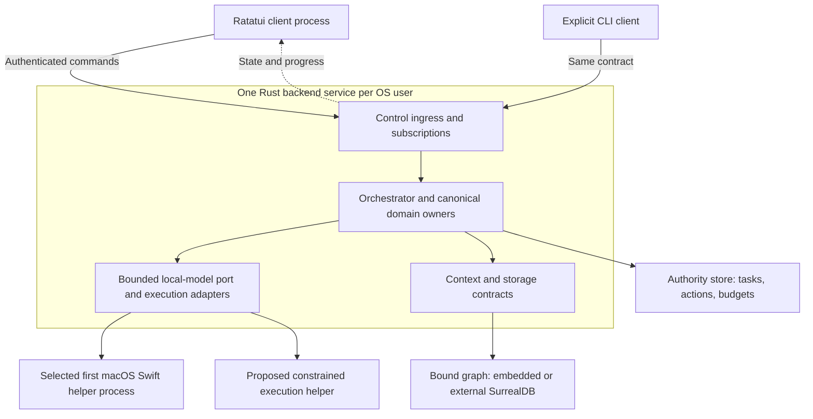
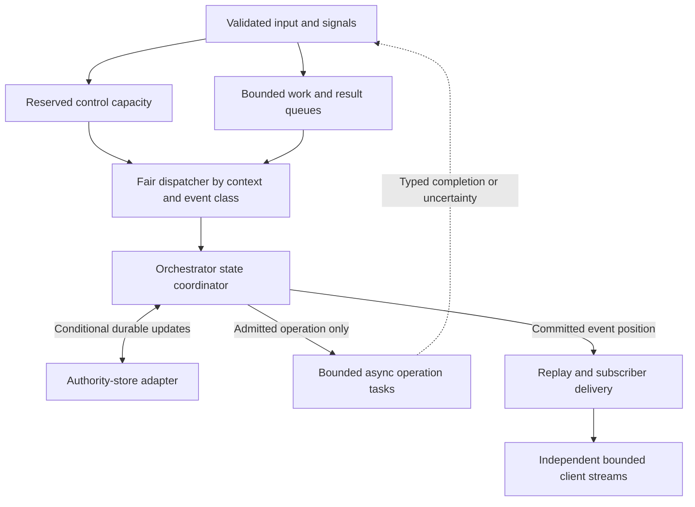
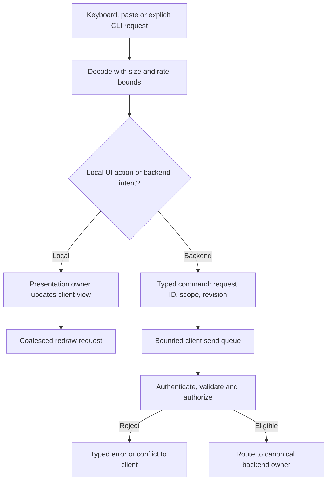
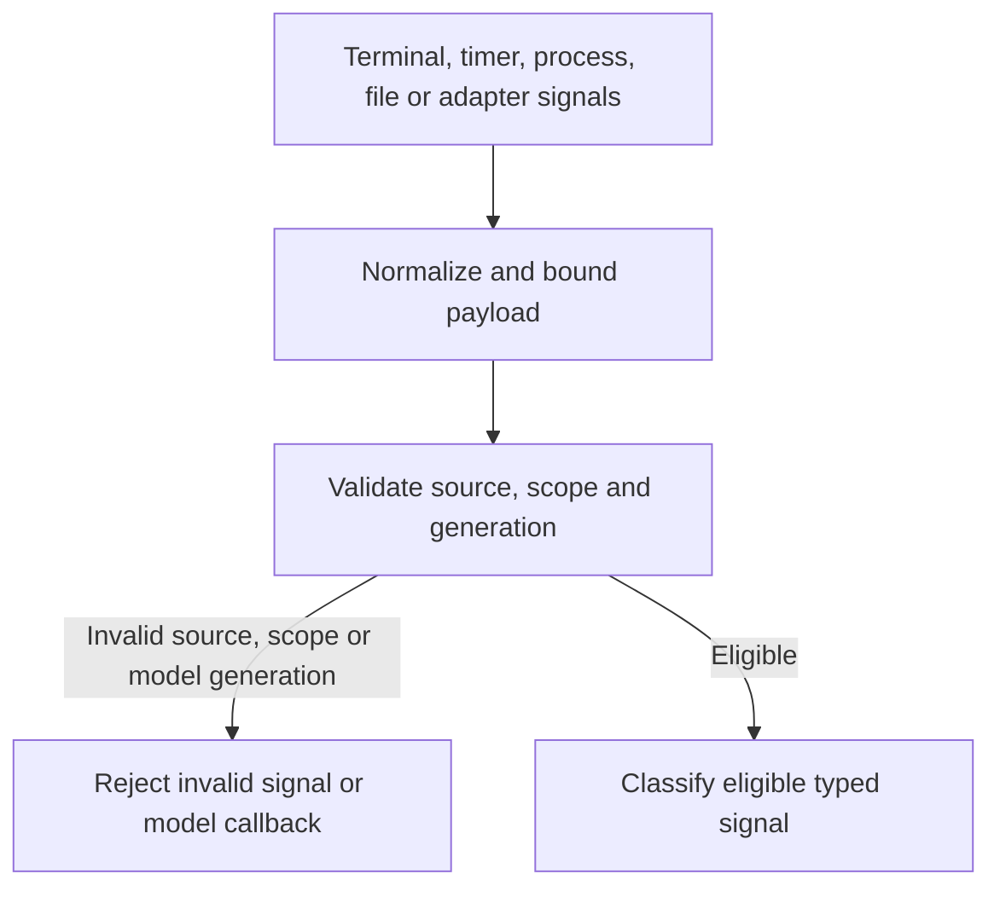
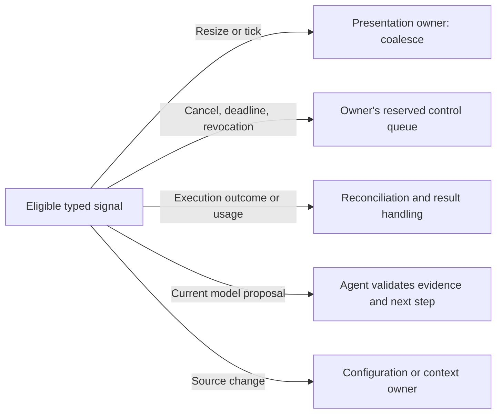
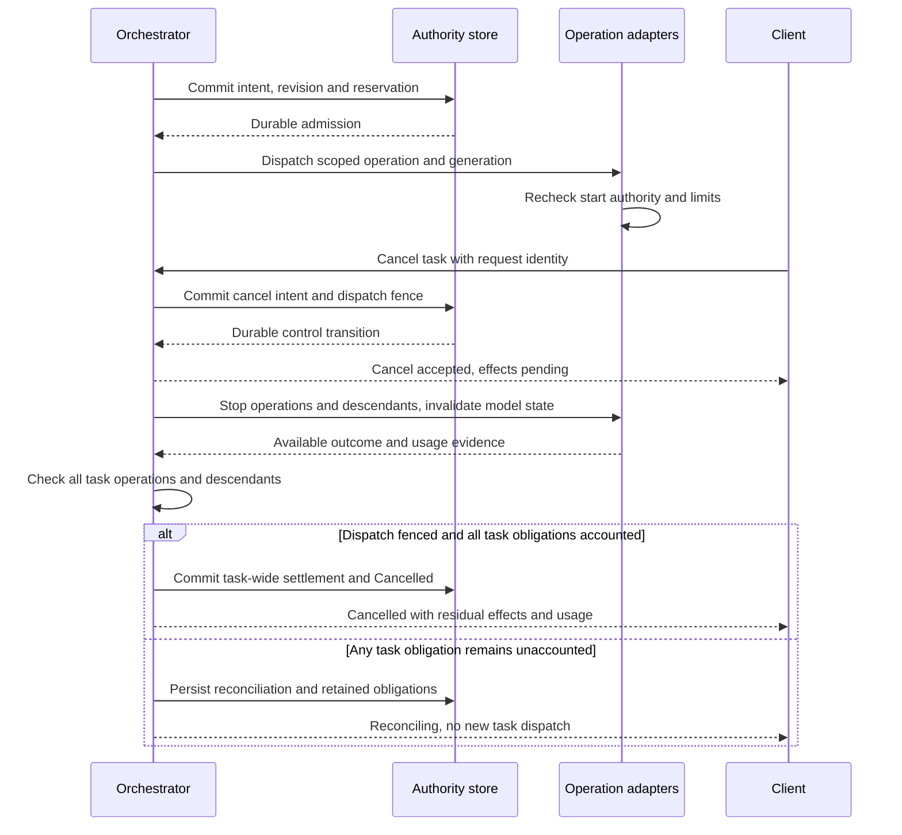
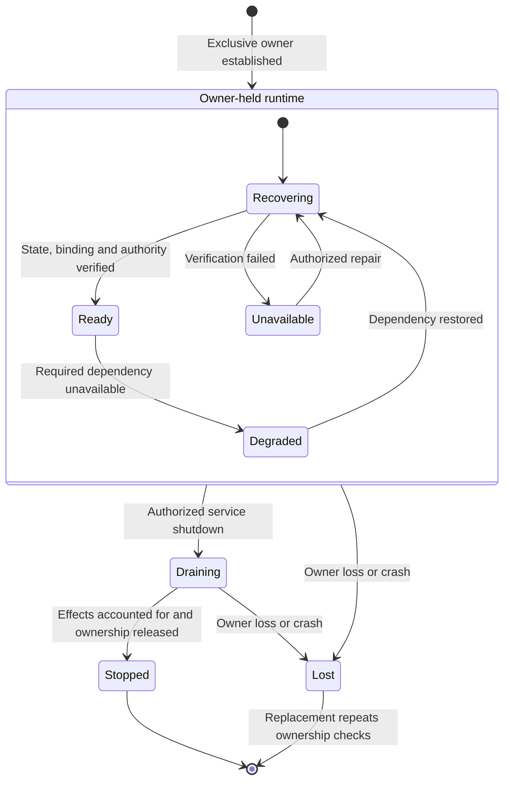

# Runtime, processing pipelines and asynchronous coordination

Status: proposed runtime sketch for D2-D6, requested on 2026-09-23.
Ratatui, the Rust chat backend and default chat launch are selected in
[ADR-0005](../decisions/0005-default-ratatui-chat.md). Asynchronous input/signal
processing is required by [ADR-0006](../decisions/0006-async-event-pipelines.md).
The process layout, task groups and queue mechanisms below are proposals.
This is not an implementation-ready design or evidence that D0-D8 are complete.

## Scope and canonical owners

The sketch covers the first-release local CLI/TUI and on-device assistance,
including both graph storage modes. Remote AI and remote hosts remain later
adapters to these contracts. No runtime library, IPC protocol, OS supervisor,
database version, schema or numeric queue limit is selected here.

The [architecture](../architecture.md) owns component responsibilities. The
[service contract](user-service-configuration.md) owns per-user identity and
configuration. The [harness](core-harness-brief.md) owns lifecycle, admission,
model context and budgets. This sketch proposes how those owners execute and
exchange work; it does not create new domain authorities.

## 1. Runtime topology

Propose a separate terminal client process and one Rust backend service per OS
user/device. The [D2 local-model boundary](swift-rust-boundary.md) defines a
portable semantic port. [ADR-0009](../decisions/0009-supervised-local-model-helper.md)
selects a supervised Swift process for the first macOS implementation.
Host execution may use a separately constrained helper; D1-D2 must prove its
enforcement and identity boundaries. Separate processes alone do not establish
confinement. Platform adapters may require a different placement after SDK review.

### Proposed processes and persistence boundaries

Solid arrows show commands, requests and state access. The dashed arrow returns
scoped events. Storage boxes are logical responsibilities, not selected physical
databases. Only the graph has the already-required embedded/external mode choice.

The service owns task/conversation state; the TUI owns a presentation projection.
One client can exit while another continues observing the same task. Helpers
receive scoped operation identities, generations and enforceable limits. They
cannot schedule new task work or invent grants. Model tool callbacks return through
normal admission before any tool starts.

Graph writes use the context/storage owners. An external graph connection does
not move the authority store or change task ownership. D3 selects the authority
store location and transaction boundaries. Graph projections may be asynchronous
only where the context contract permits it; stale or missing required evidence
must gate the dependent operation. Binding changes retain all existing cutover
and reference-safety requirements.

## 2. Asynchronous execution structure

Propose supervised async task groups inside each process. The Rust service has
bounded queues for control commands, work proposals and operation results. A
fair dispatcher gives control traffic reserved capacity while preventing any
context from monopolizing the service. Exact scheduling and capacities remain
D2-D3 decisions; queue priority is not permission to reorder committed semantics.

### Proposed task groups and state coordination

Arrows show work delivery or completion notifications. Each box is a logical task
group, not necessarily one thread. The state coordinator belongs to the
orchestrator and is the only writer of its authoritative transitions.

The coordinator serializes conflicting task transitions and shared-budget
admission. Per-task queues cannot independently spend an installation or ancestor
budget. A candidate transition carries its expected revision; durable admission
must recheck that revision and all relevant limits atomically. D3 must choose and
prove that mechanism. No model call or external effect occurs inside it.

Slow awaits must not hold a global execution lock or prevent unrelated status
handling. Propose completion messages for pending persistence and operations,
with explicit in-flight state per conflict domain. The coordinator must not use
an old snapshot to authorize dispatch while a relevant commit is unresolved.
Status may report the last verified revision with an explicit degraded/pending
condition; it must not claim a durable cancellation that has not committed.

Blocking APIs and expensive CPU work run behind bounded isolation adapters.
Propose worker pools for finite blocking work and helpers for work needing a
separate failure boundary. A cancelled async task does not prove that its worker,
process tree or external effect stopped. Retain occupancy and usage reservations
until completion/non-execution evidence supports their release.

Propose recording a replay obligation with each authoritative transition, then
publishing independently of the consumer. D3 must decide whether an outbox or
another durable event mechanism satisfies this requirement. A publisher crash
must not lose accepted state or cause duplicate execution. A stalled subscriber
cannot hold a task transition or admission transaction open.

## 3. Input processing pipeline

Propose one TUI presentation owner that applies local input and backend events
to a client view, then schedules bounded redraws. Terminal reading, connection
I/O and frame preparation remain separate from backend execution. Ratatui draws
the view; it does not own task scheduling, permission checks or budget accounting.

### Proposed input routing

Arrows show transformations and handoffs. Local editing and navigation stop at
the presentation owner. A backend command crosses a fresh authorization boundary.

Typing text does not submit work. Explicit submission distinguishes a new task,
task revision and response to a pending decision. The client associates outcomes
with request identities; reconnect or a timed-out send cannot turn uncertainty
into a new task. An accepted command is not dependent on the client's queue surviving.

The required [W6 navigation contract](product-workflows.md#w6-navigate-projects-and-concurrent-activities)
adds multiple scoped projections within one client. Capture the command target
before enqueueing; the send path must not read the client's later selection to
determine its destination. Route acknowledgements and events by their identities
to the appropriate projection. D3/D6 must design authorized discovery, subscription
changes and resynchronization; closing a view cannot cancel its task or lose a
durable decision. The navigation sequence in W6 governs delayed-command behavior.

Command syntax, shortcuts, paste rules and non-TTY behavior remain D6 work.
Local validation improves feedback; the backend independently validates every
request. Rejection and queue saturation must produce an explicit client state,
not a success indicator. Terminal cleanup must run on the designed exit/failure
paths without implicitly cancelling service-owned tasks.

## 4. Signal processing pipeline

Propose source-specific adapters that normalize bounded notifications before
routing them. A timer tick, file notification, OS signal and model callback have
different trust and loss rules. They must not share a generic “execute” handler.

### Proposed signal validation

Arrows show classification and routing. Validation includes source identity,
scope and the generation/revision checks required for that signal type.

### Proposed signal destinations

Arrows route validated signals by type. These owners retain their own acceptance
checks; reaching a destination does not authorize execution.

Model results from invalidated generations remain rejected. Late execution-outcome
and usage evidence may reconcile a tracked operation under its owner's checks,
including after a terminal task outcome. It cannot reopen that task. D3-D4 must
define distinct envelope types so these paths cannot be confused.

OS signal mappings must distinguish client detach, explicit task cancellation
and authorized service shutdown. An interrupt delivered to the TUI is not, by
itself, proof of any backend transition. File notifications are hints: admission
and restart still validate configuration/source identity when required.

### Proposed queue policies

| Class | Candidate handling | Constraint before selection |
| --- | --- | --- |
| Task/control command | Reserved bounded ingress, durable acknowledgement after commit | Define overload rejection and fair per-principal limits |
| Operation outcome/usage | Per-operation completion capacity and recoverable result records | Never silently discard obligations; define helper handoff and crash recovery |
| Presentation update | Coalesce redraw/resize, bounded subscription delivery | Define which state can be replaced and when resync is mandatory |
| Source invalidation | Coalesce hints by identity/version | Revalidate at admission/restart; do not infer freshness from queue emptiness |
| Telemetry | Independent bounded buffering and documented overflow | Collector failure cannot stall control; audit retains its own durability rules |

D2-D6 must select limits for payload bytes, queue entries, concurrent operations,
render cadence, scheduling delay and recovery time. Define overload before work
starts; reserve enough result-path capacity for admitted operations or provide a
durable recovery path. An unbounded spill file is not a bounded queue.

## 5. Admission and cancellation across async work

The outer lifecycle owns operation execution. The proposed operation task is a
worker, not a detached agent with independent permission. The
[admission and failure contracts](core-harness-brief.md#aggregate-budget-ownership-and-admission)
govern every model call, tool callback and retry.

### Proposed operation and control sequence

Arrows show asynchronous requests and notifications. Host/model adapters must
coordinate fresh authorization with actual start, not rely on an earlier queue
check. The sequence begins with an eligible proposal and shows cancellation after
dispatch; pre-start cancellation must instead prevent the operation starting.

Commit failure or ambiguity follows ADR-0006's durable-control sequence; no
success acknowledgement or new dispatch is inferred. Cancellation races task
completion and failure through one authoritative revision. If success already
won durably, later cancellation cannot reopen it. If bounded reconciliation ends
with unknown effects, report failed with uncertainty rather than cancelled.
Accounting evidence is separate from rejected invalidated model output.
The terminal guard covers every admitted operation and descendant: all effects
are known and every usage obligation is settled or held by a durable reservation.
One adapter's successful stop cannot satisfy that guard for the whole task.

## 6. Supervision, restart and shutdown

Propose a service supervisor task that watches runtime task groups and helpers.
It reports failure to the owning lifecycle component instead of silently restarting
effectful work. Client disconnect, helper failure and service shutdown are distinct
events. A helper restart cannot reuse a stale owner/model generation.

### Proposed runtime recovery coordination

Arrows show service-level triggers. These are runtime coordination states, not
replacement task states. The existing service ownership checks precede startup.

In recovery/degraded states, stop admissions that require unavailable authority
or dependencies. Serve only authorized status/repair/control paths whose guarantees
can be met; report persistence outages without false durable acknowledgements.
Unrelated contexts may continue only if their dependencies and admission checks
remain valid. Recovery must reconcile outstanding effects before redispatch.

Draining closes new work ingress, records the shutdown transition where possible,
stops helpers under existing authority and preserves unresolved obligations. It
must not discard accepted queued work. D2-D3 must define the finite drain deadline
and crash-safe forced-exit behavior; the diagram's graceful `Stopped` transition
requires accounted effects. A replacement must fence the old owner before dispatch.

## Validation and open decisions

The following cases refine R20-R21 in the
[requirements matrix](requirements-validation.md). All checks are future obligations.

| Case | Unit | Integration | End-to-end |
| --- | --- | --- | --- |
| RT1: responsive control under output/model load | Fair routing and class limits | Actual queue saturation and stalled adapters | TUI resize/status/cancel with a second active context |
| RT2: commit/publication failure | Duplicate IDs and revision arbitration | Crash around real commit and publisher restart | Reconnect shows accepted work once and disclosed uncertainty |
| RT3: cancel versus start/completion | Transition precedence and invalidated generations | Real adapter start fencing, process exits and late callbacks | Cancel active work and inspect residual effects after restart |
| RT4: slow or lost consumer | Allowed coalescing and cursor rules | Block client delivery without blocking commits | Reattach and receive replay or explicit snapshot/resync |
| RT5: shutdown and owner replacement | State guards and accepted-work retention | Concurrent startup, drain failure and helper/store outages | Restart from another terminal without duplicate execution |

Each case requires supported macOS, real terminal/client/service boundaries and
both graph modes where storage participates. Actual model/process behavior is
required for its claims. D7 must split fault/race combinations into individual
test IDs with initial state, trigger, expected outcome and reproducible commands.
P0-P9 provide proposed workload targets, not measured feasibility.

Before this sketch can govern implementation, resolve:

1. D1-D2: OS supervision, endpoint/peer identity, confinement, Swift helper viability,
   runtime library and pinned versions, thread/executor placement and blocking bounds.
2. D3: typed envelopes, ordering/conflict domains, transaction and publication
   mechanisms, status consistency, overload limits and durable recovery procedures.
3. D4: model/session lifecycle, result handoff, tool callbacks and enforced operation
   limits, with explicit cancellation/start races and provenance checks.
4. D5-D6: remote extensions, terminal I/O and signal mappings, launch grammar,
   keyboard/accessibility behavior, render bounds and subscription resynchronization.
5. D7-D8: environment availability, benchmark/evaluation criteria, required test
   commands and adversarial design review. Owner review and explicit implementation
   authorization remain separate requirements.

This sketch is an input to those designs. It does not replace the planned
system architecture, Swift/Rust boundary, control API or lifecycle specifications.

## Documentation verification on 2026-09-23

An independent read-only review found that the cancellation sequence needed an
explicit task-wide settlement guard. The diagram and prose now cover every
admitted operation and descendant; the correction was rechecked.

Mermaid CLI 11.16.0 rendered all seven diagrams. Each was visually inspected;
signal routing and recovery views were reorganized for readability. All 215 local
Markdown links/anchors and whitespace checks passed. Previews remained outside
the repository. These are documentation checks only; no runtime, API, scheduling,
confinement or performance behavior has been implemented or verified.
