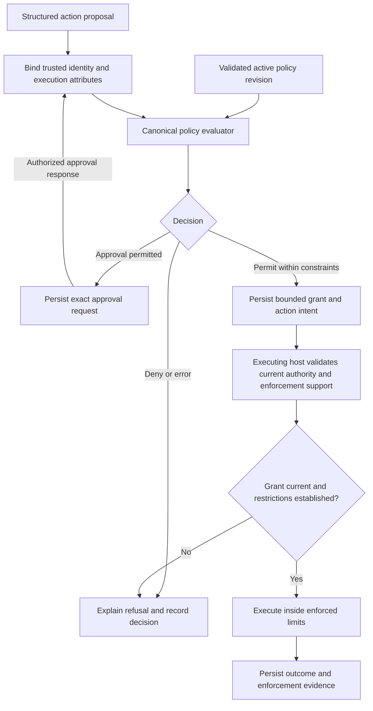
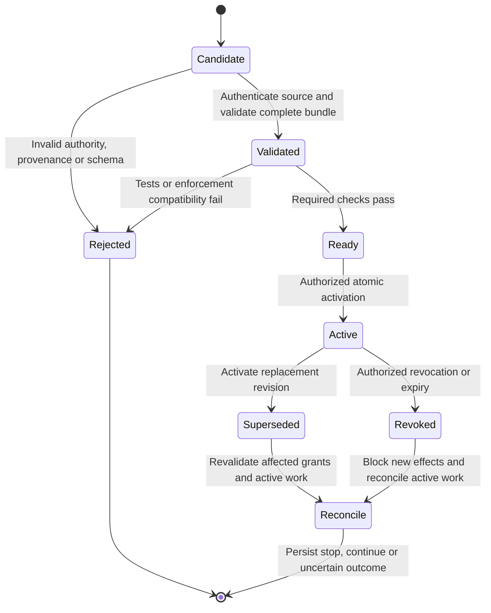

# Security policy design brief

Status: required capabilities with a proposed authorization contract.

Open decisions: policy format, evaluator and macOS enforcement mechanisms.
Runtime behavior is not implemented or verified. Terms are defined in the
[glossary](../glossary.md).

## Required capability

Asura must support a documented, versioned policy format or standard for command
invocation, sandbox access control and other security controls. Policies must be
reviewable, testable and configurable independently of prompts and model output.
The same authorization semantics must serve CLI, TUI, GUI and remote control.

The proposed canonical Rust policy component owns evaluation and decision
semantics. Host services enforce decisions using the selected OS facilities.
Swift platform adapters must not implement a second policy language. On-device
AI may classify or propose an action, but cannot authorize it or modify policy.

## Scope and inputs

The detailed design must define typed requests and trusted sources for every
security-relevant attribute. Repository content and model-supplied claims cannot
establish caller identity, policy provenance or granted capabilities.

| Control | Required design coverage |
| --- | --- |
| Command invocation | Executable identity, argument vector, working directory, environment, interpreter/script identity, subprocesses, inherited descriptors, execution time and output/resource bounds |
| Sandbox access | Read/write/create/delete filesystem rights, workspace boundaries, temporary files, network access, IPC, devices and selected platform capabilities |
| Data and credentials | Context retrieval, sensitive-data egress, remote inference destinations, secret access and credential use without exposing secret values to models |
| Control and delegation | Caller permissions, task/agent/host scope, remote grants, delegation limits, expiry, revocation and policy administration |
| Operational protection | Resource budgets, audit obligations, enforcement availability, policy version compatibility and behavior on evaluator failure |

Command authorization must operate on structured execution requests. A command
name allowlist alone cannot establish the safety of arguments, scripts or child
processes. The design must address shell expansion, PATH resolution, executable
replacement, symlinks and filesystem races. Where a required restriction cannot
be enforced on the executing host, reject the action rather than silently weaken
the restriction. This is an implementation requirement, not a claim that every
listed restriction is supported by macOS.

## Proposed authorization contract

The following are proposed invariants to resolve into `security-policy.md` and
the threat model before implementation:

- Default deny. Explicit denies take precedence over permits. Unknown required
  fields, incompatible versions, evaluation errors and exceeded evaluation limits
  cannot become permission to execute.
- Define authority and composition explicitly across installation, user,
  workspace, task and remote-host scopes. A less trusted scope can narrow its
  delegated authority, never expand it. A repository policy file is untrusted
  input until admitted through the policy administration contract.
- Separate a denial from a request that policy permits a user to approve. User
  approval must bind to the exact action, limits and expiry; it cannot override a
  hard deny. An authorized policy change is a separate operation.
- Each decision and grant must identify the action, principal, host, policy
  revision and enforced limits. Before the host starts an action, it must check
  the current grant. The design must coordinate policy activation, revocation and
  action start. It must prevent a concurrent policy change from allowing work
  under a grant that is no longer valid. A check immediately before launch does
  not, by itself, prevent this race.
- Remote hosts retain their own authority. Effective permission is constrained
  by both delegated authority and the executing host's policy. A remote permit
  cannot override a host denial or an unsupported enforcement requirement.
- Return stable reason codes, relevant rule identifiers and redacted explanations
  to all clients. Record policy revision, decision and enforcement outcome with
  the durable action/audit contract; telemetry is not authorization evidence.

An authorization result and an OS sandbox profile are different artifacts. The
policy design must define how permitted constraints map to host enforcement and
how the host reports that the restrictions were established. Do not assume the
policy engine itself confines processes.

### Decision and enforcement boundary

Proposed flow for one effectful request. The canonical action persistence and
recovery sequence remains in the [core harness brief](core-harness-brief.md).

### Policy lifecycle and active work

Policy changes require separate authorization and an audit record. The policy
component must verify the source and integrity of each change. The detailed design
must define parsing and evaluation limits, schema checks, and version checks.
It must also define test tools, decision explanations, atomic activation, restart
recovery and authorized rollback.

An invalid update must not activate in part. The design must choose whether to
retain a valid previous revision or suspend affected work. If no valid policy
applies at startup, the host must deny actions that can produce effects.

An in-flight process may already have produced irreversible effects. Specify which
operations are stopped, which may finish, the bound on revocation propagation,
and how uncertainty is reported. Policy replacement must not erase the old
revision needed to explain an earlier decision. Any continuing work must satisfy
the currently applicable policy and the defined transition contract.

## Format and evaluator evaluation

Prefer evaluating established languages before inventing an Asura-specific rule
language. A versioned Asura bundle/schema may still be needed for domain-specific
attributes, sandbox constraints, provenance and migration. Such a wrapper must
not create an independent rule evaluator. These are candidates, not a promise to
support multiple policy engines or a claim of formal standards conformance.

| Candidate | Primary-source evidence | Questions to resolve for Asura |
| --- | --- | --- |
| Cedar | The official implementation provides a Rust `cedar-policy` crate and schema validation. Its authorization semantics include default deny and forbid precedence. | Model command/resource constraints, scope composition and approval obligations; reject evaluation errors consistently; assess update tooling and embedding cost |
| OPA / Rego | Rego evaluates structured data. OPA documents a Go embedding API and a Wasm integration path with runtime/ABI requirements and built-in limitations. | Choose and validate a Rust-hosted integration path, constrain built-ins and resource use, define deny/obligation semantics, and measure packaging and latency |

Sources checked 2026-09-19: [Cedar implementation](https://github.com/cedar-policy/cedar),
[Cedar authorization semantics](https://docs.cedarpolicy.com/auth/authorization.html),
[Rego language](https://www.openpolicyagent.org/docs/policy-language),
[OPA integration](https://www.openpolicyagent.org/docs/integration), and
[OPA WebAssembly](https://www.openpolicyagent.org/docs/wasm).
These document engine capabilities; no Asura integration or performance is proven.

Use the same representative policy corpus for both candidates. Compare expressive
coverage, strict error handling, deterministic offline evaluation, schema tooling,
explainability, Rust/Swift boundaries, compatibility, dependency/license posture,
bundle size, startup cost and bounded p50/p95/p99 latency under concurrency. Set
numeric acceptance budgets in D0/D3 before measurements. Any executable evaluation
spike needs its own scoped ready design, as required by the repository design gate.

## Required design and validation deliverables

D1 must identify protected resources and policy administrators. D3 must produce
`security-policy.md` and a format/evaluator decision record: exact versions,
grammar/schema, action/resource vocabulary, source trust and precedence, decision
contract, update/revocation lifecycle and failure behavior. D4 must define the
enforcement mapping, launch races and unsupported-capability handling in
`tools-execution.md`. D5 extends this contract to remote hosts and inference;
D6 covers editing, validation, explanation, approvals and audit UX.

Detailed Mermaid diagrams must refine the two proposal views above with ownership,
request/decision schemas, activation/launch sequencing and revocation failures.
The implementation packets must reference these resolved contracts.

| Layer | Required evidence before its affected feature ships |
| --- | --- |
| Unit | Parser/schema rejection, deny precedence, scope narrowing, deterministic decisions, bounded failures, redaction and exact approval binding |
| Integration | Canonical evaluator to host enforcement, atomic activation/restart, stale grants, revocation/launch races, symlink/executable substitution, subprocess confinement and unsupported controls |
| End-to-end | Permit and denial through real CLI/TUI, safe non-interactive approval handling, policy update during a task, malicious repository policy, expired/revoked remote grants and host policy disagreement |
| Adversarial and performance | Fuzz malformed policies/requests, attempt scope escalation and shell bypasses, saturate evaluation, and measure declared latency/resource limits |

Enforcement tests must run on supported macOS with real attempted prohibited
effects. Mock denials cannot prove sandbox confinement. Add GUI and remote-host
journeys as those surfaces arrive, using the same policy conformance fixtures.
