# Sensors: observations and agent stimulation

Status: selected architectural direction, 2026-09-27. The user accepts the
observation pipeline and System 1 / System 2 direction, and requires passive
stimuli and agent-directed information gathering. SN1 is integrated; its selected
limits and scoped runtime evidence appear in the implementation section below.
Earlier proposal sections describe the broader direction. They do not establish
implemented external adapters or permission for automatic background model work.

## Purpose and first slice

A **sensor** is a scoped source of observations. It supports one or both modes:

- **Observe:** an agent requests a bounded snapshot through the common tool owner.
- **Subscribe:** the service maintains an authorized source and receives changes.

A subscription is a service resource, not a continuously running model session.
An observation is evidence, not an instruction, permission, or accepted task.
The signal pipeline can propose work after receiving evidence. The orchestrator
alone admits and schedules that work through its canonical durable input queue.

Propose a small first slice:

1. A directed service-status observation reuses the existing status projection.
2. Committed foreground activity and an inactivity timer produce local signals.
3. Deterministic rules record observations and proposed background work.
4. The control surface shows pending, suppressed, expired and admitted proposals.

Automatic model activation remains disabled until canonical admission supports
sensor origins and an explicit standing grant names the destination and budget.
The current input-queue packet requires an existing project, conversation and
active operation, with explicit Queue or Steer intent. It cannot be reused by
fabricating a user message or an active target. Sensor wakes never imply steering.

File watchers, OS resource sampling, external webhooks, MCP subscriptions and
remote integrations are later adapter examples. They are not delivered features.
No network listener, credential access, dependency installation or external
subscription is selected here. The first slice requires no new runtime or broker.

## Observation pipeline and System 1 / System 2

Required behavior: observations pass through an explicit pipeline, as inputs do.
Both pipelines use scoped envelopes, stable identities, bounded stages, typed
outcomes and canonical admission. They preserve different meanings: user intent
is a command candidate; sensor content is evidence.

Selected conceptual split; detailed mechanisms and thresholds remain proposed:

| Stage | Work | Outcome |
| --- | --- | --- |
| System 1: immediate triage | Deterministic validation, source/provenance checks, freshness, deduplication, scope, debounce and optional local classification | Reject, coalesce, retain evidence, update an authorized projection, or propose escalation |
| System 2: deliberate work | Scheduled context-rich analysis, reconciliation, planning and reflection using an eligible local or remote conversation model | Evidence-linked conclusions and action proposals through existing policy and task owners |

These names describe processing policies, not claims of human cognition. System 1
need not invoke a model. System 2 need not run for each event. Batch related
observations under one admitted task and preserve the batch's source references.
Optional classification is a separately admitted operation; it cannot hold the
signal handler or bypass limits. Uncertainty or high impact can propose escalation,
but cannot force a model call when authority or budget is absent.

A routine action may follow System 1 only when an explicit standing grant already
names the action, scope, preconditions and limits. It still passes canonical
admission and host enforcement. Classifier confidence never supplies that grant.
System 2 output can propose improved filters or classifier candidates. Evaluation
and authorized activation must precede any change to active policy.

### Observation processing flow

Proposed stage view. Arrows carry evidence or proposals; execution uses the same
canonical queue as other admitted work.

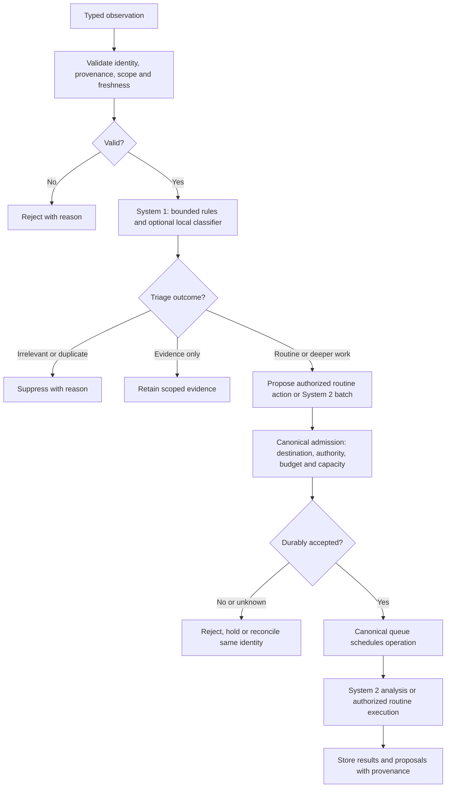

Example: a project-change signal enters System 1. It is validated and coalesced
with nearby changes, without reading file contents implicitly. An authorized rule
can propose one System 2 consistency review. The task obtains its own read grants,
retrieves current evidence and reports differences. Five minutes of inactivity
can instead propose reflection on completed work. Neither path starts a remote
model or changes a classifier without the applicable grant and budget.

Open product decisions: which routine actions to pre-authorize, which event kinds
need deliberate analysis, and whether deeper work defaults to a local model.
The first slice keeps model wakes disabled, so these decisions do not delay
observation capture and visible proposals.

## Canonical owners and provider boundary

Apply [ADR-0006](../decisions/0006-async-event-pipelines.md), the
[execution rules](../engineering.md#asynchronous-execution-and-recovery), and the
[interaction boundaries](interaction-and-extension-boundaries.md).

| Owner | Responsibility |
| --- | --- |
| Service signal owner | Subscription lifecycle, ingress limits, source generation, timer and observation normalization |
| Host services / adapter | Enforced source access, bounded capture and cancellation |
| Common tool registry and executor | Directed observation schema, discovery, grants, execution and result settlement |
| Context owner | Evidence provenance, retention, freshness and per-use disclosure checks |
| Local classification owner | Optional advisory labels under an admitted, bounded operation |
| Orchestrator and durable input owner | Wake policy, destination resolution, budgets, durable acceptance and execution |
| Control client | Inspection and user decisions; no subscription or execution authority |

Local and remote conversation models use the same observation tools. A provider
adapter translates structured calls into the common tool contract. A provider
without supported tool calling reports unavailable; generated prose cannot execute
an observation. Models do not need a generic subscription capability. The service
can provide admitted observations as context on any supported inference path.

Classifiers remain local, receive only authorized evidence, and cannot call tools,
create subscriptions or grant a wake. Classification failure records unavailable
or unknown; it never switches to remote classification. First-slice filtering uses
exact event kinds and scoped rules, so it needs no classifier implementation.

### Ownership flow

Proposed logical view. Arrows name data or requests, not new processes.

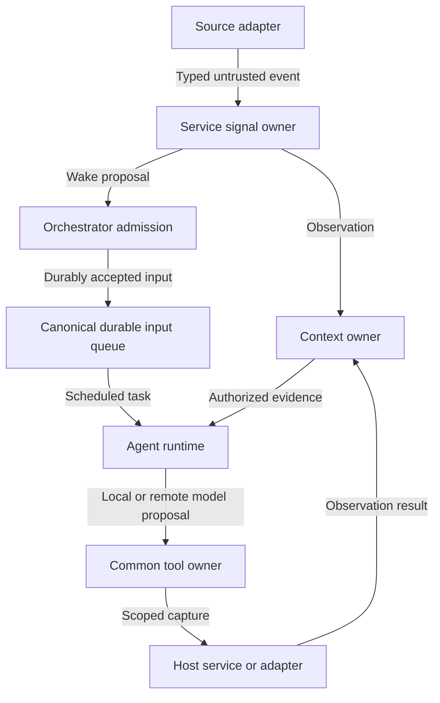

## Contracts and storage

Identifiers below are semantic fields, not a selected Protobuf encoding. Do not
change protocol 0.1 or journal format 1. Reuse canonical request, operation,
project, conversation, grant and generation types when adding schema fields.

| Record | Required fields |
| --- | --- |
| Sensor descriptor | Stable source ID, owner principal, supported modes, observation schema, allowed scope, effect/disclosure class, replay and coalescing capabilities |
| Subscription | ID, descriptor ID, explicit project or installation scope, source configuration digest, grant/policy revision, destination rule, expiry, generation, state, cursor and limits |
| Observation | ID, subscription or directed operation ID, source identity and generation, source event ID/sequence when available, scope, observed time, received time, expiry, payload type and bounded payload, provenance, sensitivity, correlation and causal parent IDs |
| Wake proposal | Stable ID, observation references, rule revision, intended destination and purpose, expiry, state and reason, canonical admission request ID when assigned |
| Capture result | Observation or typed denial, invalid request, unavailable, overload, stale, cancelled, deadline exceeded or outcome unknown |

A source-provided timestamp is untrusted. Use service receipt time and a monotonic
clock for in-process deadlines. Store wall-clock expiry for restart checks. Clock
rollback or unknown freshness holds work for revalidation. Installation scope must
be explicit; a missing project field never means unrestricted access.

SurrealDB stores observation documents, provenance links, source cursors,
subscription records and wake proposals through the existing storage owner.
Use the existing authority journal for admission, grants and settlement where its
contract requires it. Graph projections must not become a second authority ledger.
Reference existing task/plan/progress records; do not copy task state into sensors.

`$HOME/.asura/config.yaml` retains declarative settings. `logs/` holds bounded
redacted diagnostics; `sessions/` and `tmp/` retain their existing owners. The
embedded database stays under `db/`. Classifier artifacts remain in
`data/classifiers/`; model artifacts remain in `data/models/coreai/` and
`data/models/mlx/`. No raw payload spool or new sensor directory is proposed.

## Passive path: receipt through proposed wake

Proposed decision flow. Each terminal box is a visible outcome. Receiving,
persisting, proposing and admitting are separate acknowledgements.

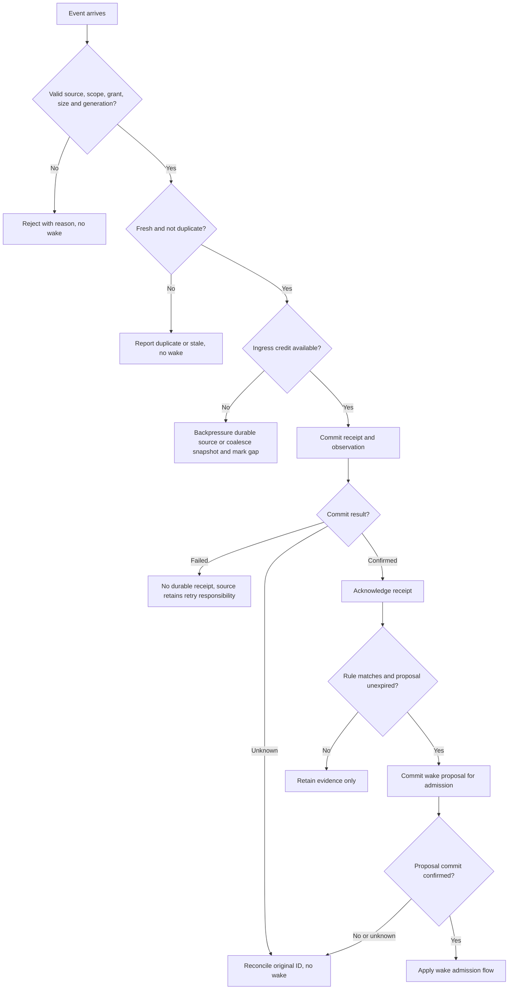

Duplicate identity is `(source ID, source generation, source event ID)` when the
source guarantees stable IDs. A reused identity with changed content is a source
error. Without stable IDs, snapshot coalescing may reduce duplicates but cannot
claim exactly-once capture. Mark ordering unknown where no sequence exists.

Only source-local order is meaningful. Detect cursor gaps and report resync
required. Filesystem notifications describe possible changes; a later authorized
snapshot must establish current content. Never replay an event as a file read.

### Wake admission flow

Proposed flow. This extends the canonical intake rather than creating a queue.

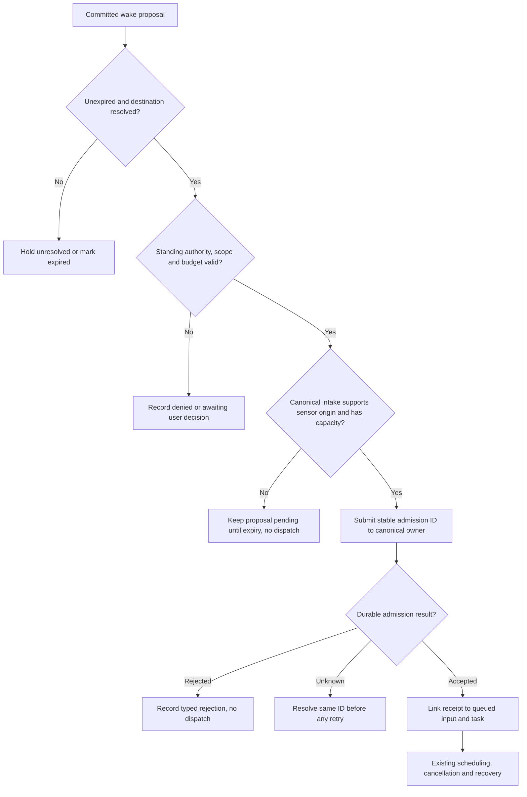

Persist the admission request ID before dispatch. A crash between queue acceptance
and source acknowledgement resolves that same ID. Never submit a new ID because
an acknowledgement was lost. Pending source receipts are not executable work.
Queue rejection or saturation cannot silently convert a wake into steering.

## Directed observation flow

Proposed flow for an admitted agent operation. The common tool contract owns the
execution loop and provider translation. This document adds observation semantics.

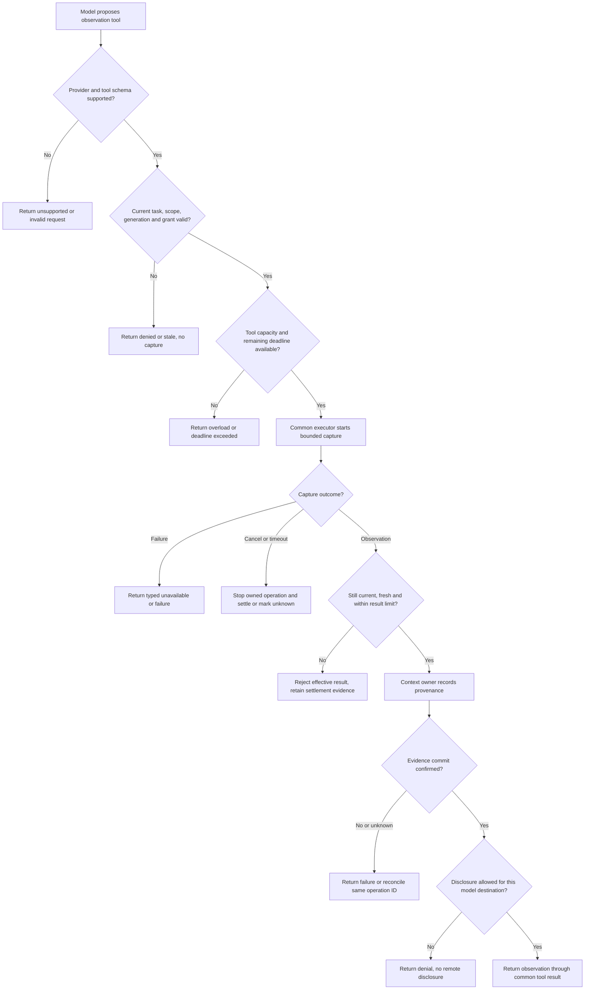

Project registration grants no source-read authority. A service-status observation
returns only the requesting principal's authorized projection. Remote inference
needs a separate disclosure grant even when capture occurred locally. A result
cannot carry executable instructions, credentials or a grant embedded in its text.

## Subscription lifecycle

Proposed states. Arrows name owner decisions; cancel requests precede closure.

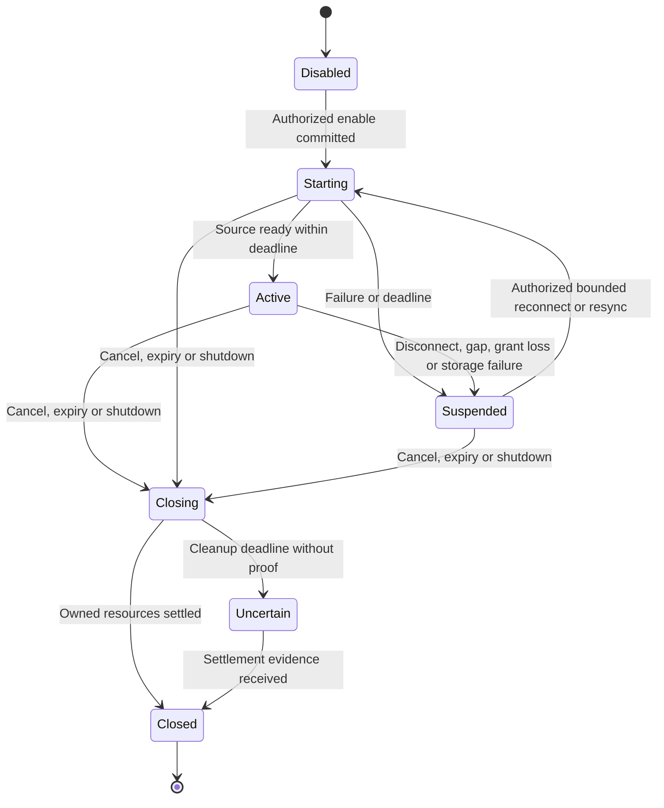

Disable ingress before closing. Late events from the prior generation are rejected.
Keep accepted receipts and admission obligations recoverable. Restart revalidates
grants, expiry and source cursors before reconnect. A persisted enabled flag is
not a perpetual grant. An uncertain source cannot start a replacement instance.
Subscription closure does not cancel already admitted tasks; those need an explicit
canonical cancellation request. Service shutdown follows existing task settlement.

## Bounds, overload and recovery

Proposed first-slice limits. Existing stricter tool, service or storage limits win.
No synchronous filesystem, network, database, process wait or join runs in the
signal handler. Reuse bounded storage and tool workers; do not add a thread per
sensor. Internal timer and committed-activity adapters perform no external I/O.

| Boundary | Limit and outcome |
| --- | --- |
| Subscriptions | 16 per project, 64 per installation; reject excess before activation |
| Observation | 16 KiB payload, 4 KiB metadata; reject before allocation beyond limit |
| Ingress | 32 entries per source, 256 entries and 5 MiB total per service |
| Fair dispatch | At most 8 entries per source per reactor turn, 64 total; preserve control/deadline capacity |
| Snapshot flood | Coalesce by source, scope and kind for 250 ms, maximum delay 2 s; keep latest plus count and gap flag |
| Durable receipts | 1,024 pending and 20 MiB globally; backpressure before acceptance, never evict accepted obligations |
| Retention | Settled observations expire after 7 days unless referenced by retained evidence; quota exhaustion stops new retention and receipt acceptance |
| Pending wake proposals | 1 per rule and destination, 64 total; merge observation references up to 32, then retain a summary with explicit omitted count |
| Freshness | Status snapshot 30 s; activity or idle proposal 5 min; expired proposals cannot dispatch |
| Persistence or capture | 5 s absolute, including queue wait; timeout becomes unknown if commit/capture cannot be disproved |
| Reconnect | 1, 2, 4, 8, 16, then 30 s delays with up to 20% jitter; suspend after 5 min; no retry resets subscription expiry |
| Shutdown | Stop ingress immediately; 2 s subscription cleanup budget within existing service shutdown bound; retain uncertainty if not settled |
| Wake budget | 1 background operation globally, 1 proposal admitted per project per 60 s, 6 per installation per hour |
| Model cost | Zero automatic model calls without explicit standing budget; reserve token/cost allowance under existing parent budgets before dispatch |

Durable event sources receive retryable overload without an acceptance receipt.
Nonreplayable snapshot sources report loss and require resync. Do not coalesce
accepted commands, cancellation, usage or operation outcomes. Observation ingress
cannot consume the control capacity reserved for these obligations.

For the first slice, a database stall blocks sensor persistence, not status or
cancel. Timeout leaves the existing storage owner responsible for reconciliation;
no replacement worker may write around an unresolved operation. Future adapters
must specify cancellable I/O or supervised process cleanup before implementation.
A bounded thread alone is not sufficient isolation for an uninterruptible API.

## Activity, inactivity and feedback control

This design supplies triggers for the required
[background reconciliation capability](../plans/production-status-implementation.md#follow-up-requirement-background-reconciliation-and-learning).
It does not implement the learning or reconciliation algorithms.

Propose activity as committed foreground input, foreground tool settlement, or an
independently observed project change. Background work, status reads, sensor
receipts and client repaint events do not reset inactivity. Activity can propose
consolidation, reconciliation or cross-data checks after the 250 ms debounce.

Propose inactivity after 5 minutes without qualifying activity and with no active
foreground task. Use one timer per project. A new foreground event invalidates
its idle proposal. Do not infer elapsed inactivity across service downtime; restart
begins a new observation interval. Sleep/wake triggers revalidation, not catch-up
execution of every missed timer.

An inactivity proposal can request reflection, deeper analysis or classifier
candidate preparation. Foreground activity holds queued background work and
requests active background work to pause/cancel at its supported boundary.
Retain partial progress and usage through the existing task contract. A sensor
cannot install or activate a learned classifier; independent evaluation and model
activation authority remain mandatory.

Carry causal root and parent IDs. Suppress automatic wakes caused solely by the
same background causal root. Permit at most 2 automatic causal hops. Unknown
external causality still obeys debounce and wake budgets. Budget counters survive
restart; restarting the service cannot refill an hourly allowance.

## Validation required before implementation is complete

Use the normal unit and integration runners and the existing real CLI/TUI process
gate. Tests use private state and must stop every backend and adapter they start.
No mock result proves OS subscriptions, provider behavior or remote enforcement.
For each row, implement separate cases for each named failure or race.

| ID and initial trigger | Unit | Integration | End-to-end required result |
| --- | --- | --- | --- |
| SN1: authorized status capture and denied project/egress scope | Schema, scope, redaction | Common executor with real owner and provider translation | Local model observes authorized status; denial discloses no protected data |
| SN2: valid, malformed, oversized or stale passive event | Each validation branch | Real ingress with bounded storage | Client shows receipt or reason, never an unsolicited instruction |
| SN3: duplicate, reordered, conflicting ID or missing cursor | Dedup and sequence rules | Restart and source replay | No duplicate admitted input; gaps are visible |
| SN4: ingress saturation and slow storage | Credit/coalescing limits | Flood at all configured maxima, stall persistence | Input/status/cancel respond within 100 ms on supported test host; no silent durable loss |
| SN5: crash before commit, after commit, or after canonical acceptance | Identity and state decisions | Kill service at each checkpoint, reopen real DB | One admission identity, uncertainty disclosed until reconciled |
| SN6: wake denied, unsupported intake, full queue, or expired | Every admission branch | Real queue and budget owner | Held/rejected reason visible; no fabricated user intent or steering |
| SN7: idle threshold, resumed activity, sleep and restart | Controlled monotonic clock | Real service timers plus fake-clock deadline injection | One proposal, no catch-up storm, foreground work remains responsive |
| SN8: self-triggered activity and repeated restarts | Causal hops and budget counters | Loop-producing adapter and persisted quotas | Wake cap holds, no recursive work storm |
| SN9: cancel during start, capture, persistence or shutdown | State transitions and fencing | Stall each boundary and deliver late results | No replacement source before settlement; stopped or uncertain state is accurate |
| SN10: classification absent, invalid or timed out | Deterministic fallback rules | Local classifier boundary when implemented | No remote classification or permission escalation |

Future external adapters add real authentication, replay, reconnect, token expiry,
SSRF and revoked-access tests. Remote model tool tests require a real supported
provider under authorized credentials and disclosure. Neither applies as passed
evidence to the initial local-only sensor slice.

## Integration decisions and evidence limits

- Queue owner: add sensor-origin admission separately from the current explicit
  Queue/Steer contract. Resolve destination creation and durable publication before
  enabling automatic wakes. Reuse its queue, request identities and recovery.
- Tool owner: extend [model tool execution](model-tool-execution.md), which currently
  names `project_read_file` and `project_list_directory`. Reuse operation ID,
  generation and ordinal identity. Its 2 s call deadline and 16 KiB result cap
  are stricter than the generic sensor limits in this design. Settle the status-observation descriptor name and typed payload in
  the common registry. Do not create a parallel sensor executor or adapter loop.
- Storage owner: assign observation/cursor/proposal records to the existing graph
  mutation boundary and reconcile their publication with canonical admission.
- Product follow-up: subscription management UI and standing-grant configuration
  need a scoped design. No new slash command is selected by this packet.
- Later adapters need their own source API evidence, resource isolation and replay
  guarantees. This design assumes no universal model subscription API and needs
  no vendor-specific API claim.

The SN1 selection below resolves its scoped integration decisions. Broader sensor
admission remains a prerequisite for automatic execution. Root owns index/glossary integration and review. No production
code, dependency, subscription, database or model configuration is changed here.

## Design verification

On 2026-09-27, all six Mermaid diagrams rendered with the installed Mermaid CLI
12.0.0 and were visually inspected. The charts show ownership, processing,
admission, capture and lifecycle failure paths. `git diff --check` passed.
This is documentation evidence only. No Cargo build, runtime test, external source
connection or model execution was performed for this design.

## SN1 implementation selection

Status: implemented with the scoped evidence recorded below, 2026-09-28.
This section replaces proposed
limits and open integration decisions for SN1 only. Broader adapters remain future
work. SN1 delivers internal passive activity and idle observations, typed status
capture, persisted evidence and inspectable proposals. It does not invent authority
to run a background model. Proposals stay held with `sensor_admission_unavailable`
until the canonical intake accepts sensor origins under a standing grant.

The service sensor owner has no executor, database handle or thread. It receives
committed foreground lifecycle events from the conversation owner and cached status
from the reactor. Only these internal sources are enabled. A timer uses monotonic
time. Status reads, sensor writes, telemetry and background activity cannot reset
foreground inactivity. The tool owner supplies directed status identity and scope;
provider adapters cannot call the sensor owner directly.

### Selected records and bounds

Each project has one typed persisted state. It contains at most 64 observations
and eight proposals; each proposal references at most 32 observations. At most
64 project states are resident. Source and payload are closed enums: foreground
activity, inactivity and service status. Payloads contain identifiers, generation,
counts and status enums; they contain no prompt, path, credential or arbitrary
instruction. Each encoded project state is at most 128 KiB. Source epoch, source
sequence, project and causal identity are preserved. Stable receipt IDs derive
from source identity and scope. Reusing an ID with different content is a conflict.

Foreground activity coalesces over 250 ms with a maximum two-second delay. Idle
fires once after five minutes with no foreground work. Restart starts a fresh
idle interval. Each source event enters validation, freshness and deduplication
before retention or proposal creation. A foreground event invalidates pending idle
proposals. Background causal roots and more than two causal hops cannot propose
another automatic wake. The first slice issues no automatic model calls.

Status freshness is 30 seconds. Proposal freshness is five minutes. Clock rollback
holds recovered proposals for revalidation. Expired settled observations may be
removed within the bounded state; referenced live evidence is not evicted. Full
state returns an explicit limit result before receipt acceptance. A producer must
retain an unaccepted durable event and retry its original identity.

### Persistence and integration

The existing serialized authority writer owns all database access. Sensors never
open a second embedded engine. A new typed sensor storage adapter validates and
encodes records, and fixed queries use the existing installation binding. The
additive `sensor_state` table holds one document per project. Its schema does not
change the existing graph marker or schema/version numbers. It is installed
idempotently before the first store. Reads never treat a database error as absence.
The closed YAML codec rejects anchors, aliases and tags before deserialization. One
project state replacement is atomic and requires its expected revision. A stable
write identity and digest distinguish retry from conflicting reuse. An observation
is durable only after the writer confirms the replacement. Timeout reports an
unconfirmed outcome; recovery loads and reconciles the original write identity.
No graph record is a task grant or an authority journal entry.

The service owner exposes pending persistence separately from committed state.
Only one sensor write is submitted at a time through the existing writer. The
writer's existing queue, two-second operation deadline and retained settlement
rules apply. Storage failure suspends new receipt acceptance for the affected
project; the reactor continues status, cancellation and shutdown handling.

Directed `service_observe_status` uses the common tool registry, operation ID,
generation and ordinal. It returns lifecycle, installation and reason from the
cached service projection, plus the durable observation identity, project, source epoch, operation/generation/ordinal correlation and freshness timestamps.
The stored observation retains project, source epoch and operation correlation.
The common tool owner validates status-read and destination disclosure authority.
The observation must be stored before the tool result is committed and exposed.
A repeated tool identity resolves its original observation. The tool's two-second
deadline and 16 KiB result cap remain authoritative. No extra capture worker exists.

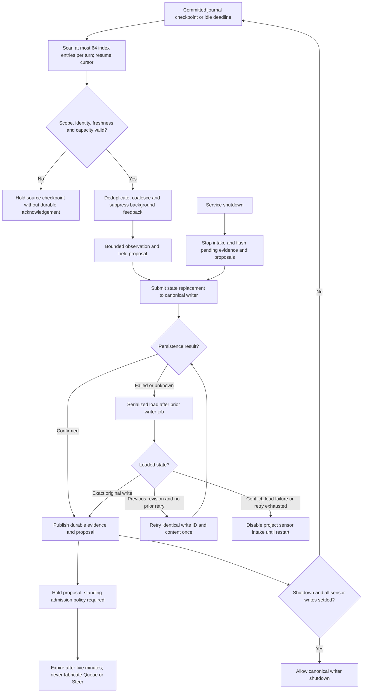

SN1 unit tests cover typed validation, byte/count bounds, duplicate versus conflict,
coalescing, idle suppression, activity invalidation, freshness and clock rollback.
Storage integration tests cover atomic replacement, stale revisions, idempotent
retry, binding mismatch and reopen recovery using private databases. Service tests
cover delayed persistence and rejected admission without blocking controls. Tool
integration tests cover status-read denial, stale task identity, remote disclosure
denial and persistence before result delivery. Root owns serial runtime validation.

### SN1 service wiring

The conversation owner retains the sensor owner and submits sensor load/store work
through its existing writer ticket. Sensor jobs never create a second writer.
The reactor supplies its actual service epoch and cached Inspect projection.
Registered projects load once before ingress. Foreground acceptance and settlement
feed typed activity with the committed journal revision; failed admission and
uncommitted model output do not count. Passive activity coalesces from canonical
journal checkpoints, as specified below; it is not a second lossless receipt
queue. Background activity does not manufacture user intent.

Sensor writes yield to cancellation and foreground admission. A failed sensor job
marks only its project unavailable and does not disable conversation control.
Uncertain writes reconcile through a serialized load after the prior writer job.
A matching write identity confirms success; the old revision permits retry of the
original identity; conflicting state remains unavailable. Restart reloads persisted
observations, and starts a fresh idle interval with active foreground state seeded
from canonical replay. No historical inactivity is inferred.

The status tool adds ToolIntent kind 3 with empty path and zero offset/limit, under
journal format 1. It uses the same ordinal budget and durable result record as
project tools. Status capture waits for its observation commit before producing
ToolResult. Its two-second deadline produces a typed timeout if storage is slow;
late evidence persistence cannot deliver a late tool result. Cancellation follows
the same common tool result path. Status metadata supplies no file-read grant.

### Coalesced journal activity checkpoints

The service recovers passive activity from the canonical journal replay. It
captures the latest accepted or settled operation per registered project, using
its journal frame offset as the activity sequence. Multiple changes before the
sensor writer is available coalesce to the latest checkpoint; this is a state
observation, not an audit event stream. The journal preserves every operation.
Restart starts a fresh source epoch and records a current checkpoint before the
idle timer can fire. Sensor persistence failures disable that project's intake
and are logged; they do not disable foreground conversations. The service keeps
at most 64 project sensor owners. No new executable queue is introduced.

Sensor write errors trigger one serialized load through the same writer. An exact
saved write confirms success. An unchanged previous revision permits one retry
with the same write ID and content. A second failure, conflicting revision or
failed load holds that project's sensor state until service restart. Other
projects continue. Shutdown stops new observations, flushes pending evidence and
proposals through the writer, then closes it. The existing service shutdown
deadline remains authoritative; an uncertain commit is recovered by load on
restart. This does not claim rollback of an uncertain database transaction.

The fixed additive sensor schema is established at the verified database load or
write boundary before querying the table. Missing schema is not interpreted as
empty sensor state. Real database fixtures serialize through the storage test
owner guard because the embedded database has one process owner.

Replay checkpoint discovery examines at most 64 operation index entries per
reactor turn. A cursor resumes the scan on an immediate deadline; completed scans
are reused until the journal revision changes. The checkpoint map retains at most
64 registered projects. Foreground events remain ahead of this bounded work.

### Earlier validation checkpoint

Root ran the embedded storage suite after adding the fixed table establishment
and shared fixture owner guard: 22 unit tests and 35 integration tests passed.
This includes the real sensor CAS, idempotent retry and reopen fixture. The service unit suite also passed 60 tests, including activity/idle, durability,
shutdown flush, uncertainty reconciliation and failed-project isolation. Platform
unit tests passed 70 checks. Native status-tool execution had not been checked at
that checkpoint. The integrated evidence below records the subsequent result.

### Delivered scope and remaining work

SN1 implements internal passive activity and inactivity capture, typed durable
observations, held consolidation/reflection proposals, and the status observation
path through the common tool registry. The system model's status tool is enabled
and has passed the native journey recorded below. Other provider activation and
qualification follow the [common tool contract](model-tool-execution.md). The result reports its captured
status and freshness, not a live proposal inventory.

No automatic System 2 model wake is enabled. A standing policy must select the
destination and permitted model, actions, cost/token budget and source scope.
Canonical admission must represent sensor origin without inventing a user Queue
or Steer request. Held proposals make this missing authority explicit.

External webhooks/subscriptions, filesystem observations beyond the existing Git
path, optional classifiers, classifier candidate training, arbitrary observation
queries and an inspection UI remain design extensions. The internal source path
does not imply a credentialed external adapter or a generic sensor registration
API. The existing Git observer remains its own canonical scope-specific source;
SN1 does not persist Git events into this new sensor state.

Sensor timers yield while the canonical writer has pending work; its completion
wake and deadline resume the sensor owner. An expired debounce cannot spin the
reactor while storage is stalled. Failed project intake remains unavailable until
restart, after the single reconciliation/retry path is exhausted.

### Foreground requests during sensor persistence

Sensor storage uses the same writer, but it must not turn a foreground registry
refresh or mutation into `conversation_busy`. The conversation owner retains up
to 32 transport requests (at most 2 MiB under the existing 64 KiB request bound)
while a sensor load, store or reconciliation owns the writer ticket. Each retained
request has a two-second deadline. Overflow returns an explicit busy response;
expiry returns `storage_timeout` without submitting that request to storage.
Cancellation and observation controls continue through their existing paths.

When the current ticket settles, one retained request is dispatched before any
new sensor work. The normal command validation still applies. This transport
backlog does not accept a conversation task or duplicate the durable input queue.
Project listing keeps its canonical writer directory-identity check; the service
does not invent a fresh `current` flag from journal metadata. Shutdown rejects
retained requests before closing the writer. Regression coverage includes project
registration followed by sensor persistence and an immediate registry refresh.

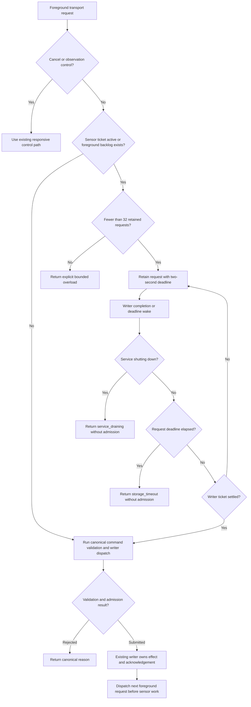

The six unit fixtures that start the canonical writer share a test owner guard: two conversation fixtures, three installation reactors and one config reactor.
Parallel test execution must not compete for its process singleton or turn a
fixture setup collision into an observation-protocol failure.

### Integrated SN1 evidence, 2026-09-28

The service suite passed 68 unit tests, including foreground request priority,
status-result durability, idle detection after worker release, and writer failure
fencing. The CLI lifecycle and setup PTY journey passed after the foreground queue
correction: project registration selected the project while sensor work continued.
The native system-tool journey observed a successful committed status call and
preserved recorded tool results through restart. The embedded storage suite
verified sensor compare-and-swap, retry and reopen in a private database.

Idle timing and proposal decisions use controlled-clock tests. These results do
not claim a live five-minute idle experiment, automatic model admission, external
sensor subscriptions, or classifier training.

Service and helper terminal precedence follows the
[conversation contract](conversation-admission.md#service-terminal-precedence-during-helper-settlement).

## SN2: bounded inspection of durable sensor evidence

Status: implemented and verified in isolated local tests, 2026-09-28.
The local authenticated control client can
inspect one registered project's persisted observations and held proposals. The
sensor owner returns its committed projection, loaded by the canonical writer.
The handler performs no database, filesystem, network or model calls. This adds
no source, standing grant, wake or raw query capability. Protocol remains 0.1.

`SensorsInspect` requires a nonzero project ID, an observation offset (0–64),
and a page size (1–16). A continuation requires the exact revision returned by
the first page. A changed revision returns `revision_conflict`; restart or
reconnect callers restart at offset zero. Each response includes at most 16
observation summaries and all eight proposal summaries, with bounded evidence
IDs (32 per proposal). Summaries include source identity, sequence, timestamps,
correlation and source-specific typed fields. They contain no raw prompts or
paths. Proposals expose purpose, stored state, reason, evidence IDs and expiry.
Stored held state is not a claim of current authority or freshness. Clients use
timestamps and the reported clock uncertainty; inspection never admits work.

The reply reports the committed revision, total observation count, next offset,
pending persistence, failed intake and clock uncertainty separately. It never
publishes an unconfirmed working record. An empty loaded project has revision
zero and no evidence. A registered project still loading returns `sensor_loading`;
an unknown project returns `project_unknown`. Failed project loads return
`sensor_unavailable`. A failed intake with an existing committed snapshot returns
that snapshot and `intake_unavailable=true`. Installation startup, repair and
shutdown use the existing typed service reasons. The fixed error whitelist is
shared with protocol validation.

A request copies at most 16 observations and eight proposals; at most 64 records
are indexed. The frame limit remains 64 KiB. Existing connection limits, reply
backpressure and disconnect cleanup apply. The client uses the existing isolated
control-worker boundary and a two-second request deadline, with no retries.
There is no pending query task to cancel or drain. Queries remain available while
sensor persistence is stalled because they only read committed memory. Restart
visibility waits for the existing serialized sensor load and never treats a
failed load as empty evidence.

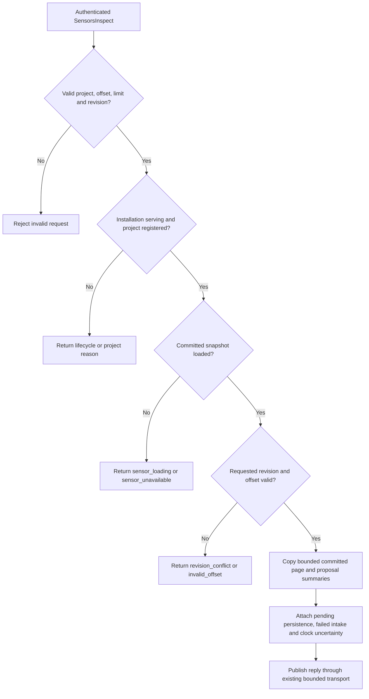

Required evidence: owner unit tests cover pagination, revision conflict, dirty
state isolation, failed intake and recovery visibility. Control tests cover
missing fields, enum and count bounds, invalid continuation, directions and frame
round trips. Service integration exercises the typed client against a private
service, unknown and registered projects, committed evidence and restart. A
control-client journey is this slice's end-to-end surface; a TUI panel is later
presentation work. Root runs serial builds and records actual results before
claiming runtime completion.

### SN2 design verification

Protocol tests (2), service inspection tests (2), and CLI tests (3) passed.
The real `conversation_flow --sensors` journey passed paged reads, revision
rejection, control responsiveness and restart recovery. The full CLI lifecycle
suite passed, including the sensor inspection command. Fixtures used private
homes and stopped their owned services. This does not qualify automatic model wake.

The new SN2 and CF11 flow charts rendered with installed Mermaid CLI 12.0.0
and were visually inspected on 2026-09-28. All branches and labels are visible.
The sandboxed browser launch failed; the local renderer then succeeded with
host browser permission. `git diff --check` passed. Runtime checks are assigned
to the root serial runner; this diagram evidence does not establish their result.

## Live clock recovery

Required behavior: the sensor owner detects wall-clock rollback during operation,
including quiet periods. It holds proposal creation and expiry until wall time
reaches the last accepted clock sample. Inspection reports `clock_uncertain`.
The owner schedules one monotonic recheck per second while held. It does not
return an expired debounce or proposal timer during that hold.

Each valid sample refreshes the wall-to-monotonic anchor used for proposal expiry.
Forward jumps therefore expire due proposals in the current turn. A backward jump
cannot cause an expired monotonic deadline to spin the reactor. The existing
monotonic activity and idle timers retain their original meaning. No worker, I/O,
model call or execution grant is added. Pending storage settlement retains its
existing priority and suppresses timer work.

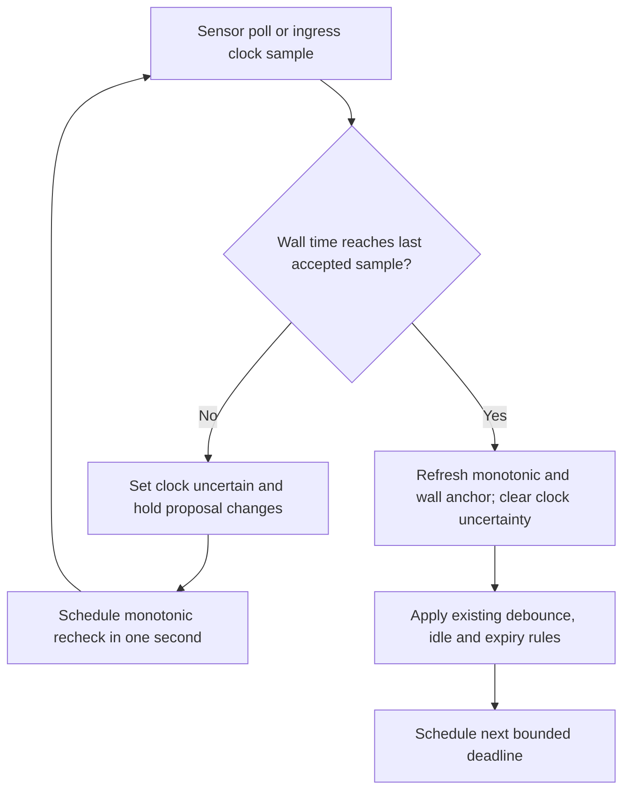

Validation: controlled-clock owner tests must cover live rollback with an expired
debounce, repeated held polls, recovery without ingress, rollback after a long
quiet period, and forward jumps. Existing persistence and service responsiveness
journeys remain required. This refinement changes no wire or stored schema.

## SN3: model inspection of sensor evidence

Status: proposed implementation packet. Public tool grouping belongs to the common
tool owner. No automatic background execution policy is selected by this packet.

The grouped `service` tool accepts `command: sensors` and a required `kind` of
`observations` or `proposals`. The active admitted operation supplies the project;
model arguments cannot select a different project. The existing sensor owner
supplies its committed snapshot. No adapter opens storage or maintains a second
projection. This read does not emit another observation or propose a wake.

Observation requests accept `offset` (0–64), `limit` (1–16, default 8), and optional
`revision`. Nonzero offsets require the first page's exact revision. Proposal
requests return at most eight proposals and require offset zero; observation
pagination parameters are rejected for this kind. Both kinds return revision,
clock uncertainty, pending persistence and intake health. The result names
observations or proposals as persisted evidence, never as executable instructions.

The common tool owner checks the current operation generation, local model
eligibility and the existing status-read grant. Remote disclosure is denied for
this first packet. Discovery reports the read-only capability. Tool intent and
result use the existing durable sequence and eight-call turn limit. Cancellation
and generation changes discard pending delivery through the existing owner.
There is no capture worker or new query deadline: the bounded in-memory read is
part of the common two-second tool deadline. Serialized output must fit 16 KiB;
overflow fails explicitly without publishing an incomplete JSON object.

The result uses a fixed JSON structure, with numeric enum values accompanied by
closed readable labels. It includes no prompts, filesystem paths or raw payloads.
Every proposal includes its evidence IDs, purpose, stored state and reason,
creation and expiry timestamps. Consumers must inspect the clock and expiry
fields; a stored held proposal alone does not establish current eligibility.
Observation summaries preserve the source identity, sequence and typed metadata
already exposed by SN2. The tool never traverses evidence from another project.

Unknown projects, loading snapshots, unavailable intake without a committed
snapshot, revision conflicts and invalid offsets use the SN2 errors. A failed
intake with a committed snapshot returns that snapshot and its health flag.
An exact retry resolves the existing committed tool result. Restart retrieves
that result from the journal; it does not repeat a read under the same tool ID.

### SN3 request and result flow

Proposed interaction view. Arrows carry typed requests or results. The common
tool lifecycle remains the canonical authority for admission and settlement.

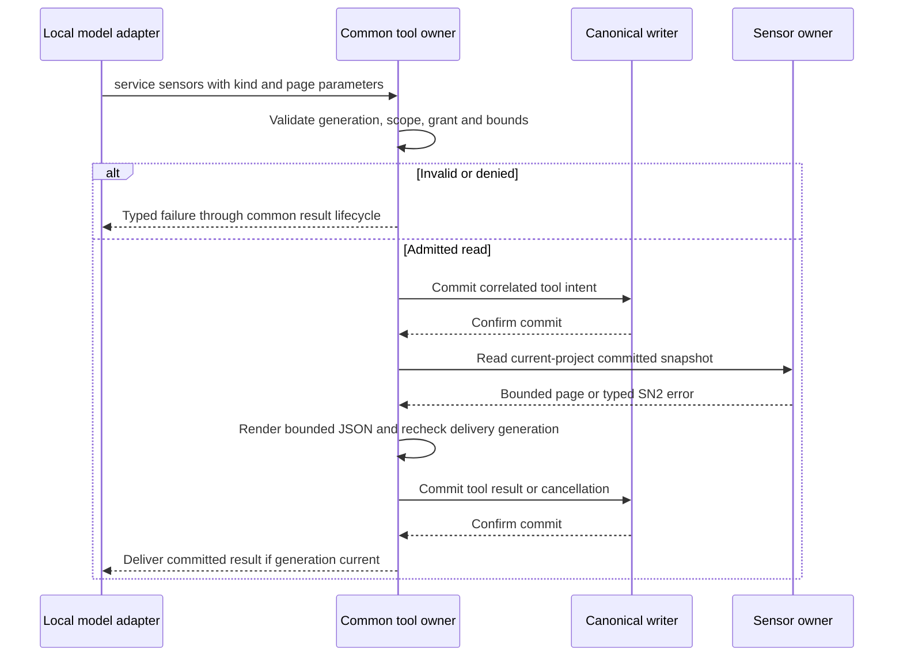

Required unit checks cover both kinds, unknown arguments, missing or changed
revision, JSON byte limits, loading and failed intake, clock flags and project
scope. Integration checks must establish intent-before-read-result ordering,
remote denial, cancellation, generation fencing and exact retry after restart.
A native local-model journey must request both kinds and verify the committed
results against an isolated service's SN2 inspection. It must stop its owned
service. Root owns serial builds and the final native journey.

Implementation seams: the common registry and model adapters own public syntax;
the service sensor owner owns a bounded formatter over its existing projection;
the authority writer owns additive intent validation and result replay. Exact
schema field numbers and tool-kind allocation are assigned at integration. Wire
protocol 0.1 and journal format 1 remain unchanged. This packet is not yet a
claim that the grouped tool or these seams are implemented.

### Autonomous work remains separate

Automatic consolidation or reflection needs a standing policy naming project,
destination conversation, permitted local or remote model, actions, budget and
expiry. Canonical admission must represent sensor origin and evidence IDs without
inventing a user Queue or Steer request. Budget exhaustion, revocation and restart
must retain their original admission identity. These decisions remain open;
SN3 inspection supplies no execution grant and cannot close that gap by itself.

The live-clock and SN3 diagrams rendered with installed Mermaid CLI 12.0.0 and
were visually inspected on 2026-09-28. Both diagrams have readable labels and
complete branches. Sandbox browser launch failed; authorized local rendering
succeeded. This evidence establishes diagram presentation only. Root owns the
pending serial Rust checks and any SN3 runtime implementation evidence.
