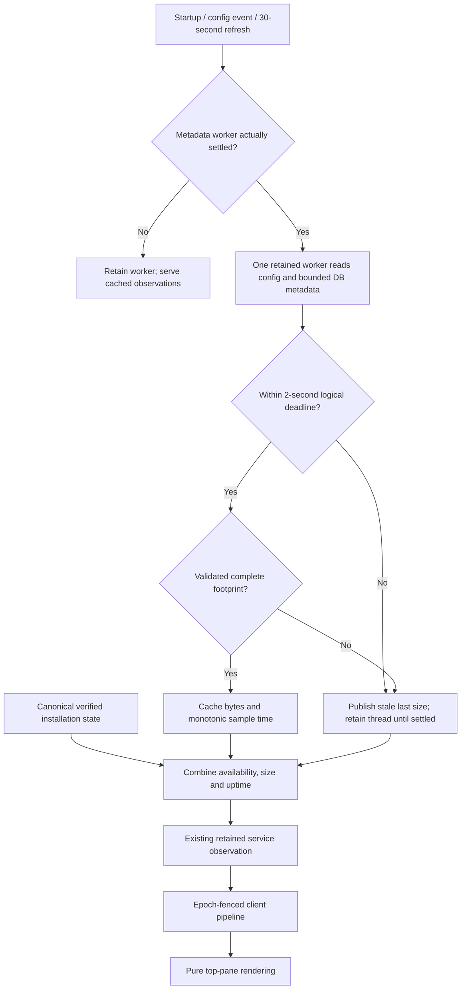

# Service status pane

Status: selected implementation packet, 2026-09-28. Protocol remains 0.1.

The top pane reports `Asura · Connected (process|local|remote) · uptime · memory:
status size · graph: state reason`. Process means this TUI launched the current
service with its lifetime lease; local means it attached to an existing Unix-socket
service. The canonical `start_owned` result decides ownership, including startup
races. No remote service transport exists yet; do not label remote model inference
as a remote service. Retain ownership only for the same service epoch.

## Owners and measurement

The existing service observer owns status publication and one retained metadata
worker. The storage adapter owns the stored-memory size operation; platform owns
its descriptor-relative traversal. This does not open another database engine or
read records, prompts, logs, configuration values or model assets for measurement.

Stored size means the sum of regular-file logical lengths below the validated
embedded database directory. It includes engine indexes, manifests and write-ahead
logs, and excludes config, logs, sessions, scratch and model assets. It is neither
RAM usage nor allocated disk blocks. Files can change during an engine update, so
this is a bounded sampled footprint, not a transactional database snapshot.

Open the database directory without creation. Traverse no more than 20,000 entries,
64 directories and eight nested directory levels. Check cancellation/deadline
between entries. Never follow symlinks, hard-linked files or special files. Validate
owner, non-writable-by-others mode, ACL and held/named directory identity. Read
metadata only, sum checked u64 lengths, and discard the whole measurement on error
or overflow. Pin and revalidate ancestor descriptors; memory remains bounded by the
traversal stack and counters. Database directories/files can have engine-created
owner-readable modes; do not rewrite their permissions.

The retained observer worker samples on startup, configuration refresh and no more
than once every 30 seconds otherwise. Its two-second logical deadline revokes the
sample but never releases an unfinished worker slot. Results after expiry are
ignored. Keep the last valid byte count and sample time as stale; never replace an
unknown value with zero. A failed worker may be replaced only after actual thread
settlement and the next bounded refresh. Cached graph readiness comes from the
existing verified authority installation observation; a successful footprint scan
cannot establish database availability.

Uptime is monotonic elapsed time since the service observer was constructed during
reactor startup. Each response carries server-sampled milliseconds. It is not TUI
age or wall-clock subtraction. The client can display the latest lower bound, or
advance it locally only while the same live service epoch remains current.

## Observation fields

Extend ServiceObservation with optional uint64 uptime_ms field 5 and
StoredMemoryStatus stored_memory field 6. New fields are required in current
service replies; no version increment is made. StoredMemoryStatus has:

| Field | Type | Meaning |
| --- | --- | --- |
| available 1 | bool | Existing GraphReady and GraphVerified pair |
| size_bytes 2 | optional uint64 | Last valid sampled byte sum |
| sampled_uptime_ms 3 | optional uint64 | Server uptime when that sample finished |
| stale 4 | bool | Size is absent or refresh failed/expired |
| size_reason 5 | uint32 | 1 ready, 2 pending, 3 timeout, 4 unsafe, 5 unavailable/IO, 6 limit, 7 cancelled |

Size and sample time are present together; sample time cannot exceed reply uptime.
Ready requires a present size and stale=false. Other reasons require stale=true.
Availability must match the canonical installation pair in the same observation.
Graph text uses that same pair directly, including unavailable/repair outcomes.
Client ServiceUpdate exposes uptime_ms and stored_memory; clients perform no file
scan. Ordinary one-second retained observation heartbeats carry current uptime
without adding a status revision or creating new workers each second.

## Validation

SS-U1 checks footprint byte sums, nested limits, symlink/hardlink/FIFO rejection,
replacement and deadline/cancellation using private scratch roots. SS-U2 checks
strict wire presence, state/reason combinations, paired size/time, future timestamps
and graph-availability agreement. SS-U3 holds a worker past deadline and checks
nonblocking cached replies, no replacement until settlement, retained stale bytes,
30-second cadence and uptime continuity across client reconnects. SS-I1 uses a real
embedded database under scratch, obtains service observations and verifies stored
size against bounded fixture files while a separate client attaches. SS-E1 checks
TUI owned/local labels, epoch reset, uptime and graph status without render IO.
Root owns integration, serial builds and runtime qualification; source tests alone
are not end-to-end evidence.
