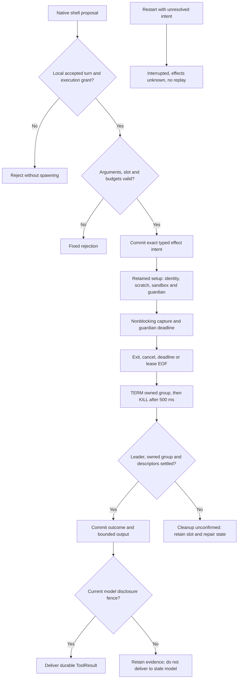
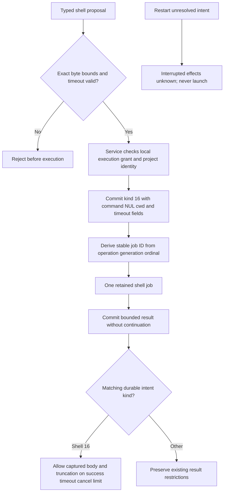
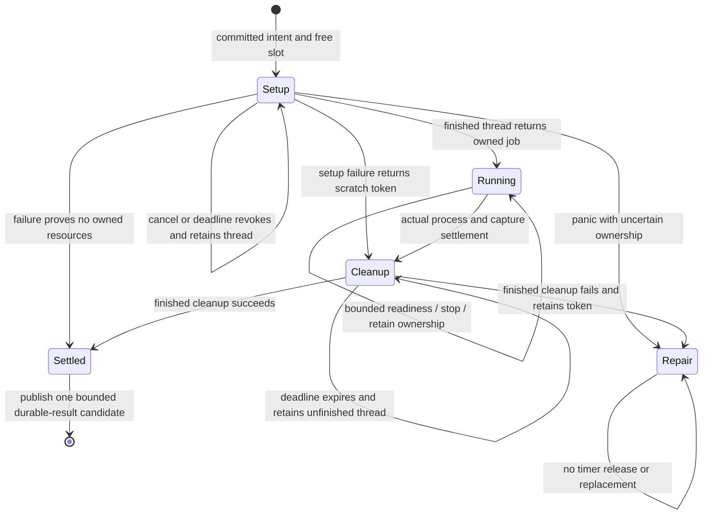

# Bounded noninteractive shell tool

Status: implemented, with scoped native process and system-model validation on
2026-09-28. The evidence below defines the verified scope. Protocol numbering
remains 0.1 and journal format remains 1.

## Scope and existing owners

Expose one native model tool named `shell`. It runs one noninteractive command
with `/bin/sh -c`, closed stdin, separate bounded stdout/stderr capture and an
explicit exit outcome. It creates no interactive session, PTY, Send/Read interface,
terminal pane, remote delegation or automatic command retry.

The inspected Wisp owners are `WispCore/Tools/RunCommandTool.swift` and
`WispCore/Exec/{CommandRunner,CommandPolicy}.swift`. Reuse their useful command/result
shape, not their default network permission, broad caches or unbounded output
accumulation. Wisp source inspection is not Asura runtime evidence.

| Canonical owner | Responsibility |
| --- | --- |
| Service tool registry and conversation owner | Schema, execution grant, admission, budgets, durable intent/result, cancellation and model delivery |
| Platform process support | Verified descriptors and identities, spawn, sandbox, owned process group, lease guardian, readiness and reap |
| Existing authority writer | Typed shell intent and result, duplicate detection and recovery projection |
| Swift native tool adapters | Typed arguments and existing service callback only |
| Existing service reactor | Fair readiness dispatch and deadlines; no blocking process or filesystem calls |

Extend `asura-platform` using `startup.rs` checked spawn/file actions,
`model_process.rs` nonblocking pipe/reap patterns, `project_identity.rs` identity
checks, `lifetime.rs` private lease pattern and `git_observer.rs` mandatory sandbox
construction. Those components are reusable primitives; none currently implements
a shell guardian. Do not copy a complete model owner or add a generic orchestrator.

## Arguments, results and limits

| Argument | Contract |
| --- | --- |
| `command` | Required string, 1–8192 UTF-8 bytes, no NUL; exact bytes passed as the single argument after `-c` |
| `cwd` | Optional project-relative directory, at most 1024 UTF-8 bytes; absent or `.` means project root; reject absolute paths, NUL and parent traversal |
| `timeout_seconds` | Optional integer 1–60, default 30; fresh per-command deadline independent of elapsed turn time |

Preserve command bytes without quoting, interpolation or rewriting by another
shell. The shell itself interprets them. Reject invalid native arguments before
spawn; bounded semantic rejections follow the existing rejected-tool path. Private
wire fields require presence and strict unknown-field/direction validation. Root
allocates free schema/tool-kind fields at integration; do not reuse inventory,
audit or pending Memory create allocations.

The existing eight-call limit and 64 KiB aggregate result limit apply. One shell
job may be live service-wide. It occupies the existing retained tool slot through
setup, execution and cleanup; a second proposal gets Busy. No unbounded pending
shell queue is introduced.

The shell replaces the ordinary two-second execution allowance with this explicit
budget: setup has at most 2 seconds; command runtime is at most the selected
timeout, independent of turn age; cleanup has at most 2.5 seconds before it becomes
unconfirmed. Unsettled cleanup may remain retained beyond the command deadline;
it cannot authorize new effects. Authority journal work retains its existing
deadlines.
A timeout is not evidence that execution did not occur.

Capture raw stdout and stderr in separate 8 KiB tail rings,16 KiB total. Track
saturating received-byte counts and whether earlier bytes were overwritten. Drain
at most 16 KiB across both descriptors per reactor dispatch, alternating streams.
Readiness reschedules remaining work without an unconditional poll loop. After a
combined 64 MiB of output, terminate with output_limit; memory must never grow with
cumulative output. Closed stdin is `/dev/null`, not an unconsumed pipe.

Return a fixed textual envelope with outcome, optional exit_code or signal,
stdout_truncated, stderr_truncated, cleanup state, and labelled stdout/stderr.
Keep each rendered stream at most 6144 UTF-8 bytes and fixed metadata at most 512
bytes; the complete ToolResult remains below 16384 bytes. Sanitize terminal escape
and control bytes before text rendering; preserve newline/tab and replace invalid
UTF-8 explicitly. A bounded streaming sanitizer must not retain an unbounded
unfinished escape sequence. Tail loss, replacement or rendering truncation sets
truncated. A result never contains a continuation offset.

A normal nonzero exit is a successfully executed tool with an explicit exit code;
it is not a service failure. Timeout, cancellation and output-limit outcomes map
to the corresponding existing ToolStatus and include bounded captured output under
the shell-specific durable result contract. Missing sandbox, invalid identity,
spawn failure and absent grant return fixed failure codes without fabricated exit
status. A signalled leader records the signal, not a guessed exit code.

## Authority and confinement

An admitted foreground user turn in a registered project receives a separate
`execute_authorized` grant under this selected shell policy. This is not derived
from `read_authorized`. Its immutable snapshot binds installation, project identity,
turn operation and generation. Unaccepted input, observations, classifiers,
background reconciliation and remote delegates receive no execution grant.

Only qualified local model providers may propose shell calls. Apply the existing
supported/enabled native-tool intersection and local destination fence. The verified
local Ollama fence remains mandatory. CoreAI qualification remains separate; a
registered shell entry is not evidence its provider can call it successfully.

Recheck grant, owner generation, cancellation, project registration and retained
project identity immediately before effect submission. The shell model cannot
choose another project, environment, executable shell, network policy or write root.
Resolve cwd relative to a retained project directory with no symlink traversal;
check the selected directory identity at spawn. A pathname/cwd check is not the
filesystem access boundary.

The mandatory OS sandbox permits writes only inside the admitted project and a
new private per-job scratch directory below the existing Asura tmp owner. It denies
network access by default, including loopback. It denies reads of account data,
Asura configuration/journals/model assets, personal credentials and other projects
unless those paths are deliberately inside the registered project itself. Do not
claim secret detection inside the user's project. Retained directory/identity
checks prevent a substituted project root from silently widening the grant.

Start with read/execute access to the project, scratch and fixed system executable/
runtime roots needed by `/bin/sh` and ordinary system utilities. System roots are
`/bin`, `/usr/bin`, `/sbin`, `/usr/sbin`, `/usr/lib`, `/usr/share`, `/System` and the
selected system developer directory after validation. Do not grant the whole home,
`/private/var`, arbitrary build caches or all of `/Applications`. Exact Seatbelt
operations and developer-runtime exceptions must be backed by installed-platform
source and real process tests. Missing required support fails closed, with no
unsandboxed fallback or automatic download. Toolchain/cache access outside this
contract requires a subsequent scoped design refinement.

Use a fixed environment: PATH=/usr/bin:/bin:/usr/sbin:/sbin, LC_ALL=C,
LANG=C, HOME and TMPDIR set to private scratch. Unset ENV, BASH_ENV, shell functions,
DYLD variables, service credentials and all inherited variables not on this list.
Do not source personal startup files. Close every inherited descriptor except the
specified stdin/stdout/stderr and guardian-private control endpoints; shell children
must never inherit the service lease writer, service socket, authority descriptors
or guardian status channel. File creation uses umask 077. Scratch is 0700.

## Guardian, process ownership and cleanup

Use a private guardian mode in the packaged Asura executable, selected only by
inherited validated descriptors, not a public CLI feature. The service spawns the
guardian through checked platform actions. The guardian owns the command leader,
its process group and the sole wait/reap responsibility. It remains outside the
command's confined group and receives one inherited lease read endpoint. The service
holds its sole writer; EOF requests cleanup even after abrupt service death.
A hard monotonic job deadline also lives in the guardian, independent of the reactor.

Setup and filesystem operations run in one retained platform setup worker, with a
two-second logical deadline and cancellation checks. Never start a replacement
worker before actual settlement. Steady-state pipe and guardian status readiness
feed the existing reactor through nonblocking descriptors. The guardian uses bounded
readiness/timers and a fixed 128-byte maximum status receive buffer; no generic RPC
server, command dispatcher or model access is added.

On cancellation, expiry, steering, generation invalidation, turn end, output limit
or lease EOF: send TERM to the owned group immediately, then KILL after 500 ms if
needed. Also perform this cleanup when the leader exits but group members or pipe
writers remain. Reaping the leader does not finish cleanup. Wait up to 2 further
seconds for owned-group settlement and descriptor EOF. All group signals use the
still-owned group identity; do not rediscover targets by executable name or a
persisted PID after restart. Retain ownership until signal/reap races are resolved. The installed macOS SDK
exposes waitid/WNOWAIT and proc_listpids/PROC_PGRP_ONLY. The platform packet must
retain the exited leader as a waitable child while signalling/checking its group,
then reap it last. Bound each group-membership inspection to 256 PIDs; overflow or
an unverifiable result means cleanup_unconfirmed. Never send another group signal
after releasing the leader PID fence. Qualify this ordering with actual process
races; header availability alone is not runtime proof.

Report `owned_group_settled` only after the direct leader is reaped, the guardian's
owned group is gone and capture/status descriptors have settled. A bounded cleanup
deadline produces `cleanup_unconfirmed`, retains the slot and prevents replacement
execution. The reactor stays responsive and enters its existing repair/drain path.
A later real settlement may release resources but never changes an unknown command
outcome into proof it had no effects. Root shutdown must keep its owner lock while
its guardian/setup ownership is unsettled.

**Selected engineering boundary:** process groups are not complete descendant
containment. A command can deliberately change session/group or double-fork and
close inherited pipes. The inspected platform has no verified Seatbelt operation
that prevents every such escape. This first runner supports cooperative build/test
commands and guarantees its owned-group cleanup only. If an escape is observed,
report cleanup_unconfirmed. An undetected escaped descendant is a documented limit;
never claim all descendants are absent. The guardian protects against service death,
not a malicious same-user actor killing the guardian. Do not invent unsupported
sandbox operations to hide this limit or add a repeated approval gate.

Scratch deletion runs in the retained cleanup owner only after known ownership
settles. An observed escape or uncertain cleanup retains scratch and its identity
for repair; it does not recursively delete paths still in use. Ordinary successful
cleanup removes only validated private job entries. Unknown/kernel-stalled cleanup
retains ownership; a timer never authorizes deletion or owner-lock release.

## Durable intent, result and restart

Commit a typed shell intent before launching the guardian. It binds operation,
generation, ordinal, project, a stable service-derived job ID, command/cwd digest,
requested/effective timeout and the grant/project identity snapshot. Store bounded
command/cwd data only where the existing private authority retention contract needs
exact duplicate comparison; never put them in audit metadata or diagnostic logs.
The implementation packet must select the exact journal encoding before writing it.

A duplicate live call with identical bytes returns its existing pending/result
state; changed arguments under the same call identity conflict. No retry may spawn
another command. Commit the typed result only after its actual execution/cleanup
outcome is known. Result persistence failure keeps the effect unconfirmed and never
causes another spawn. Delivery to a model also requires current disclosure fences.

On restart, an unresolved shell intent becomes interrupted/outcome-unconfirmed;
it is never automatically executed again. The old guardian reacts to lease EOF.
Do not reattach or signal by journaled PID. An interrupted result must say effects
may have occurred. A newly started service must not assert old process-tree absence
merely because it acquired the service lock; lease cleanup and the stated descendant
boundary remain separate evidence. Do not promise rollback of files or child effects.

## Concrete platform packet

The owner approved the narrow cleanup helper after the process-supervisor rule was
identified. The Rust rule permits this private lease helper within the existing
platform process owner. It adds no service lifecycle, generic supervisor, daemon,
public shell command or independent policy owner.

### Shared platform interface

Add `asura-platform::shell` and a narrow module export. The root agent owns private
CLI routing and service integration. `PreparedShell::prepare` runs on the retained
setup worker. Inputs are the validated RuntimeDirectory, retained project identity,
bounded command/cwd, job ID, absolute monotonic deadline and current executable.
It validates/pins cwd, creates private scratch and capture/lease/status pipes, and
returns the prepared owned descriptors. No command is started during preparation.
`PreparedShell::spawn` performs the final identity/cancellation/deadline check and
starts the private guardian through existing checked spawn actions.

`ShellJob` owns the guardian PID, sole lease writer, nonblocking stdout/stderr/status
readers, capture rings and cleanup state. It exposes readiness interests,
`poll(now)`, `next_deadline()`, `stop(reason)`, `result()` and `settled()`. Root retains
this object in the active turn until actual settlement. The existing service has
one active turn; a retained shell setup/cleanup worker extends that owner. The
file-read executor does not execute commands. Filesystem preparation/deletion remains in
retained workers; poll performs only bounded nonblocking reads, status parsing and
WNOHANG reap. It must not unlink scratch, read directories or block in Drop. After process
settlement, transfer the private scratch cleanup token to a retained cleanup
worker; that worker alone calls the blocking validated cleanup operation.

The guardian entrypoint is `run_guardian` in this same platform module. Root's CLI
recognizes only the fixed private marker `--asura-shell-guardian` followed by job ID,
absolute monotonic deadline nanoseconds and command as separate argv elements.
The parser never joins/reinterprets argv. Command size remains 8192 bytes; the total
private argv payload is at most 8704 bytes. No user-supplied executable/profile/env
is accepted. The validated inherited descriptors, not the marker or argv, authorize
this entrypoint. A normal invocation without all private descriptors fails closed.

### Descriptor and notice contract

The service maps only these descriptors into the guardian, with exact type/access
validation before taking ownership:

| FD | Meaning |
| --- | --- |
| 0,1,2 | `/dev/null` for guardian input/output; no user terminal |
| 3 | Read-only nonblocking lease pipe |
| 4 | Write-only nonblocking status pipe |
| 5,6 | Write-only stdout/stderr capture pipes |
| 7 | Read-only admitted project directory |
| 8 | Read-only validated cwd directory |
| 9 | Read-only private scratch directory |

Validate directory owner/mode/identity using existing platform rules. Project and
cwd may be the same retained directory. The service retains matching directory
identities; the guardian derives OS paths from descriptors and revalidates them
immediately before compiling the sandbox and spawning. Reject mismatched types,
access modes, symlinks, unexpected data on the lease or invalid job/deadline args.
A lease is never cloned or inherited by the command. Close all guardian-only FDs
in the command's posix_spawn actions. Command receives only 0=/dev/null,1=capture 5,
2=capture 6. Guardian stdout/stderr never contain command or provider data.

Use a fixed 32-byte native startup/status notice, following the existing bounded
StartupNotice primitive. This is not a public control envelope and introduces no
new version number or RPC service. Encoding is exactly:

| Bytes | Meaning |
| --- | --- |
| 0–3 | ASCII `ASSH` |
| 4 | Kind:1 spawned,2 settled,3 setup_failed,4 cleanup_unconfirmed |
| 5 | Reason:0 none,1 timeout,2 cancel,3 output_limit,4 lease_ended,5 spawn_failed,6 sandbox_unavailable,7 identity_invalid,8 protocol_fault,9 cleanup_failed |
| 6 | Exit kind:0 absent,1 exit_code,2 signal |
| 7 | Cleanup:0 unconfirmed,1 owned_group_settled |
| 8–23 | Exact nonzero 16-byte job ID |
| 24–27 | Big-endian u32 exit/signal value; zero when absent |
| 28–31 | Reserved, all zero |

At most three notices are accepted; buffer at most 128 bytes. Spawned has absent
exit, none reason and unconfirmed cleanup. Setup_failed has absent exit, a fixed
failure reason and settled cleanup only if no command exists. Settled has an exit
code 0–255 or signal 1–127 and settled cleanup. Cleanup_unconfirmed never sets the
settled bit. Unknown values, changed job IDs, duplicate/out-of-order notices,
trailing bytes and partial EOF are protocol faults that initiate cleanup; they
never prove absence of an effect. The sole writer emits at most 96 bytes total into an initially empty private
pipe. This is below the POSIX minimum PIPE_BUF of 512 bytes, so valid notices
cannot fill the pipe even if the service never reads. An unexpected WouldBlock
is a protocol fault that triggers retained cleanup; there is no retry queue. The service must
observe guardian exit and pipe EOF as well as a valid settled notice.

The guardian and service use platform CLOCK_MONOTONIC nanoseconds for the absolute
command expiry; reject overflow, expired values or more than 60 seconds remaining.
No wall clock or cross-process serialization of Rust Instant is used. Root fixes
the deadline before committing the intent, after reserving cleanup inside the
current turn. A delayed intent acknowledgement never resets or extends it. Guardian rechecks it
before spawn and independently while waiting. The guardian checks readiness or its
next deadline at least every 100 ms; it never waits indefinitely for a status write.

### Exact sandbox baseline

Generate the profile from retained validated OS paths using the existing strict
Seatbelt string quoting helper. Never interpolate command text into a profile.
Launch `/usr/bin/sandbox-exec -p PROFILE /bin/sh -c COMMAND`; absence or profile
rejection is a bounded failure, never an unsandboxed retry.

The compiled baseline is `(version 1) (deny default)`, with only process-fork,
process-exec and file-map-executable filtered to the fixed system roots/project/scratch, file-read* filtered
to the same runtime roots, file-write* filtered to project/scratch, sysctl-read,
and literal `/` directory read/test-existence for dyld bootstrap,
and literal `/private/var/select/sh` read for the system-owned `/bin/sh`
selector (installed root-owned symlink to `/bin/bash`), with metadata access
to its three ancestors only, and explicit `/dev/null` read/write plus `/dev/random` and `/dev/urandom` read.
No network operation, unrestricted mach-lookup, no-sandbox exec, home/cache wildcard
or preference-write exception is granted. Inherited output pipes are the only
output channels. Include metadata traversal of ancestor directories only where
required for the selected roots; this does not grant their file contents. The
literal root-directory read exception is required by macOS 27 libignition to
open `/` as its openat root, as documented in the installed dyld-support.sb.
It is not a subpath grant and does not expose other file contents.

Set private umask 077 before spawning. Use only the environment and roots fixed
above. Sandbox denial may make unsupported developer tools fail normally; do not
broaden access until a concrete runtime requirement is reviewed. Qualification
must prove allowed writes and denied outside writes/network with actual children;
profile syntax or inspection alone is not proof of enforcement.

The implementation must qualify installed spawn/group/sandbox behavior before
native model activation. Failed qualification keeps shell unavailable and reports
the concrete limitation; it does not add another supervisor or approval mechanism.

## Implementation packets and required evidence

This document fixes public behavior and authority. Root reviews the concrete
platform guardian handshake/status schema, exact sandbox profile and journal
encoding before their code. Routine implementation refinement is already authorized.

1. Platform packet: checked guardian spawn/lease, confined command spawn, process
   group state, pipes, bounded capture, deadlines and cleanup. Reuse existing
   primitives and assign any internal executable-mode routing explicitly.
2. Service/storage packet: execution grant, typed intent/result, duplicate/restart
   projection, shell slot and existing reactor integration. Do not put process
   execution in the file-read worker or create a second conversation loop.
3. Model packet: one canonical registry entry and native schemas through the existing
   service callback across qualified local providers; no direct Swift process calls.

SH-U1: exact argument and wire bounds; timeout arithmetic including cleanup reserve;
separate execution grant; local destination denial; duplicate versus changed call;
ring wrap, stream fairness, invalid UTF-8 and bounded escape sanitization; fixed
result size and truncation; syscall/error and guardian-state transition fixtures.

SH-I1: real scratch commands return separate stdout/stderr and exact zero/nonzero
exit status; stdin is EOF; shell has only the selected environment; project/scratch
writes work and outside writes/network fail. Test symlink and project replacement,
missing sandbox, blocked setup, inherited-descriptor absence, output flood/limit,
TERM-resistant leader and ordinary grandchildren remaining after leader exit.

SH-I2: kill the service after spawn; guardian observes EOF, terminates the ordinary
owned group and exits. Inject failure before intent, before spawn, after spawn,
after exit and before result acknowledgement. Verify no repeated side effect, no
PID-based restart reattachment, explicit unconfirmed outcome, retained cleanup slot
and responsiveness of status/input/cancel under stalled setup or reap.

SH-I3: deliberately escaped-session fixture documents the owned-group limit. The
test parent explicitly owns and cleans this fixture; it must never leave a daemon.
Do not turn a group-empty assertion into an all-descendant claim. Prove ordinary
owned children absent before scratch deletion and test cleanup-unconfirmed retention.

SH-E1: isolated real service and qualified local model executes a command producing
a unique scratch proof, reports exact exit/output, and demonstrates one durable
intent/result and one effect despite response retry. Verify denial without execution
grant and a real cancel/deadline journey. Root stops/reaps every test child and
reports each provider separately; mocked callbacks do not qualify native inference.

## Model wire packet

Model ToolCall field 19 is Shell. Shell fields are required command string 1,
optional cwd string 2 and optional timeout_seconds uint32 field 3. Command is
1–8192 UTF-8 bytes with no NUL. Present cwd is 1–1024 UTF-8 bytes, must be relative,
has no NUL or parent (`..`) component; `.` means the project root. Present timeout
is 1–60 seconds; absence means 30. Rust and Swift strict codecs reject missing
command, invalid bounds, forbidden cwd, unknown nested fields and wrong direction
before any effect. The native shell function has optional cwd/timeout arguments
and supplies default timeout 30 through its existing service callback. It never
executes a process in Swift.

The shared private ToolResult permits bounded text and truncation on failure,
but never a continuation offset on failure. The service's durable result owner
permits nonempty failed text/truncation only for a matching shell intent; other
tool policies remain unchanged. Shell's Swift adapter renders the fixed status
plus bounded service-owned body on failure so timeout/output-limit evidence remains
visible. Other adapters retain their existing failed-result rendering. No new wire
fields or version increment are needed.

SH-U1 includes both-language valid/default/max and missing/zero/oversized/NUL/
traversal/wrong-direction/unknown-field fixtures. Swift adapter tests prove optional
argument defaulting and failure-output delivery through the service callback,
including cancellation and duplicate callback tests for all existing local backend
selectors. Native execution qualification remains SH-E1.

## Durable encoding packet

ToolIntent kind 16 uses the unchanged record layout. Its path contains the exact
command (1–8192 UTF-8 bytes, no NUL), one NUL delimiter, then cwd (1–1024 UTF-8
bytes). Absent cwd normalizes to `.`. Reject NUL, absolute paths and any `..`
component; permit `./subdir`, repeated separators and trailing separators. The
combined payload is at most 9217 bytes. Existing tool kinds retain their 1024-byte
path bound. The platform walks relative descriptors without rewriting the stored
command/cwd bytes or widening the grant.

Offset stores effective runtime milliseconds 1–60000, no greater than limit*1000.
Limit stores requested seconds 1–60, default 30. Existing accepted turn, registered
project and owner records identify the admitted grant. A committed typed shell
intent is the durable evidence of the canonical service authorization check, never
a restart execution grant. Derive job ID from the first 16 SHA-256 bytes of ASCII
`asura.shell.job`, one zero byte, operation 16 bytes, generation big-endian u64 and
ordinal big-endian u32. Only if all 16 result bytes are zero, set the final byte to 1.
The exact payload digest is derivable; do not store a duplicate snapshot.

ToolResult layout is unchanged. Structural decode permits truncation for statuses
5,6,7 because the result has no tool kind. Replay permits this only for kind 16,
with no continuation offset. Denied/invalid/unavailable statuses 2,3,4 cannot have
truncation or continuation. Preserve every other tool's result restriction.
Shell body is at most 16384 bytes and aggregate results at most 65536 bytes. An
unresolved intent on restart remains interrupted with effects unknown. Never replay
it automatically or infer rollback from a missing result.

SH-DU1 covers minimum/maximum command/cwd lengths, one NUL delimiter, UTF-8 byte
bounds, traversal/absolute rejection, timeout relation, nonzero IDs, old path bounds
and exact round-trip layout. Job ID tests use fixed vectors, deterministic results
and changes to each input.
SH-DI1 uses real journal replay with an accepted/helper-started turn. It covers
captured timeout/cancel/limit, forbidden continuation, unchanged other-tool rules,
changed arguments under one identity, unresolved owner-restart intent and 64 KiB
aggregate bounds. Native no-duplicate effect and cleanup remain SH-I2/E1 service
and platform evidence; codec tests cannot prove them.

### Retained service wrapper and cleanup bounds

Scratch deletion uses retained descriptors, never follows symlinks, and permits
at most 4096 visited entries and 32 directory levels per cleanup attempt. Every
iteration checks cancellation and its absolute deadline. An exhausted bound retains
the cleanup token. No Drop implementation waits, joins, or deletes files.

All fallible guardian spawn preparation precedes posix_spawn. Once spawn succeeds,
the platform always returns the owned ShellJob, including a concurrent cancellation.
A failed preparation returns ShellFailure with its optional retained scratch token.
A poll failure retains the job and initiates lease closure; it never loses process
ownership. Deterministic wrapper tests hold setup/cleanup workers and verify reactor
responsiveness, busy admission, cancellation, late settlement and wake ordering.

## Service wrapper packet

The service `shell_worker` owns one retained stage: Setup, Running, Cleanup or
Repair. Setup runs in one thread with a two-second logical deadline. It resolves
the current executable, opens the admitted project and rechecks device/inode,
then calls platform prepare/spawn. The absolute command deadline was fixed before
intent commit; setup and delayed acknowledgement never extend it. Cancellation
revokes setup through its atomic token but does not release the thread slot. A
late returned job receives the pending stop request immediately.

The existing reactor joins only finished threads. A completion guard wakes that
reactor on return or unwind. While Running, the wrapper exposes platform readiness
interests and bounded nonblocking poll calls. It does not perform filesystem
operations there. A platform poll error stops the retained job; it cannot discard
process ownership. A panic with uncertain resources enters Repair.

After platform settlement, the wrapper takes the scratch cleanup token and moves
it to one cleanup thread. The cleanup thread returns both its result and the token.
Successful cleanup permits one ToolResult publication; a failure retains the token
in Repair. Cleanup has a 2.5-second logical deadline. Deadline expiry reports repair
without releasing ownership or starting a replacement. No automatic retry is
selected. A completed failure has no repeating immediate timer. Late successful
cleanup may settle resources, but cannot prove that execution had no effects.

SH-WU1 uses deterministic blocked setup/cleanup fixtures to prove nonblocking poll,
busy admission, deadline cancellation, retained slots and wake-before-thread-exit
ordering. It checks late settlement and failed cleanup without replacement or a
busy timer. These tests do not qualify sandbox execution; SH-I1/I2/E1 remain the
real process and service proof requirements.

## Implementation evidence, 2026-09-28

The platform command owner, retained service worker, durable kind-16 records and
shared native model adapter are integrated. The private cleanup helper is covered
by the owner-approved Rust instruction exception.

- Twelve platform unit tests pass, including lost PID ownership, repeated clock
  failure, replaced project/cwd, strict notices, bounded capture and failed setup.
- The native process harness passes: separate output, nonzero exit, stdin EOF,
  fixed environment, project writes, outside-write and live loopback denial,
  closed private descriptors, deadline/cancellation, TERM resistance, grandchildren,
  output flood, deliberate session escape and parent-exit lease cleanup.
- The real system-model journey passes: exact scratch proof and command record,
  one effect through request retry and restart, timeout/cancel output and independent
  owned-group absence checks. Its service is stopped and reaped.
- The shared contract suites pass: 42 Rust control tests and 57 Swift tests,
  including exported cross-language fixtures and local-adapter callback paths.
- Storage encoding/replay and service grant/worker tests pass. The complete CLI/TUI
  lifecycle harness passes after the audit startup ordering correction.

The escaped-session test demonstrates the documented containment limit; the test
waits for its deliberately escaped process to exit. It does not prove that the
cleanup helper can find arbitrary escaped descendants. Native shell inference is
qualified for the system model only. Other local adapters remain separately
unqualified for this new tool. No cloud execution is enabled.

### Turn expiry removal — selected 2026-09-30

The [cancellation-driven turn policy](model-provider-integration.md#cancellation-driven-turn-lifetime--selected-2026-09-30)
replaces reduction by a remaining whole-turn duration. A validated shell request
retains its own 1–60 second duration, default 30. Shell cancellation, cleanup,
process-group enforcement and recovery contracts remain unchanged.
