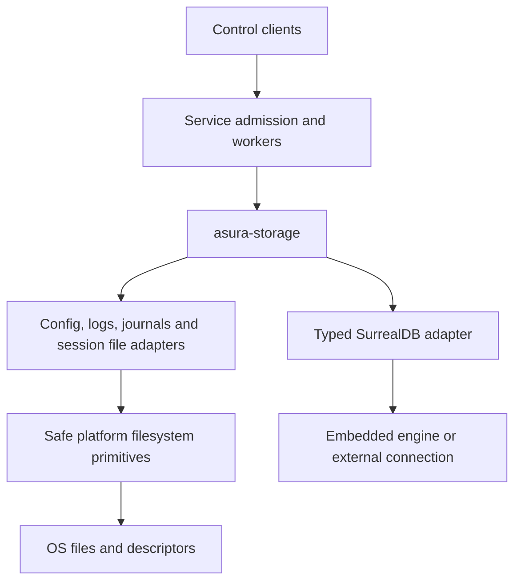

# Storage adapter ownership

Status: selected integration contract, 2026-09-27. The owner clarified that
`asura-storage` owns file persistence and SurrealDB persistence. This contract
supersedes packet assignments that placed complete persistence adapters in the
service or platform crates. It does not authorize real-user database initialization.

## Component boundaries

| Component | Owns |
| --- | --- |
| asura-storage | Config YAML read/validate/serialize/write, file logs and journals, retained session artifacts, SurrealDB typed documents/graph records |
| asura-platform | Account paths, retained filesystem descriptors, OS permissions/ACLs, atomic file primitives, process/socket operations and other narrow unsafe OS calls |
| asura-service | Command admission, active configuration snapshots, event meaning, lifecycle, scheduling and bounded worker supervision |
| Clients | Command syntax and presentation; no persistence writes |

Use safe platform primitives from storage. Storage remains free of unsafe code.
Do not create another YAML parser, file writer, model registry or runtime owner.
Move existing implementations where needed, preserving their validation and tests.
Config get/set and audit policy stay governed by the
[config contract](config-commands.md). Graph operations follow
[HM0](hybrid-memory-ontology.md#minimum-embedded-slice-hm0).
The independent authority journal remains file based; SurrealDB does not replace it.

## First migration and implementation packets

1. Move the existing service config module into `asura-storage::config`; expose
   the same bounded execute interface to the service config worker. Move its
   existing tests intact. Storage owns YAML dependencies and schema validation.
2. Generalize the existing platform config snapshot into a private-file primitive
   if necessary; keep descriptor/ACL/rename safety in platform. Storage selects
   `config.yaml` and format semantics. Preserve scratch-only tests and atomicity.
3. Put diagnostic file sink selection in `asura-storage::logs`, backed by safe
   platform operations. Console tracing and subscriber installation remain CLI
   presentation. Move path/filename choices out of platform where practical;
   preserve the account-home trust boundary and test resolver behavior.
4. Implement HM0-A under an optional `embedded-memory` feature. Production service
   linkage, initialization and admission remain subsequent reviewed packets.
5. Implement audit persistence in storage, with service-owned typed event production
   and bounded scheduling. Do not implement the old platform-owned audit adapter.

Each packet owns disjoint modules. Root owns manifests, module exports, integration
and serial builds. Dependency graph review precedes any new dependency build.
No wire version bump is needed; keep 0.1. No data migration is performed by this
module ownership change. Existing files retain their paths and formats.

## Validation and failure handling

Preserve config schema, permission, symlink/FIFO, change-detection, cancellation
and atomic-write tests. Re-run real-service config persistence/rejection/restart
and terminal config journeys after moving ownership. Diagnostic stdout/stderr and
file destinations retain their existing argument and lifecycle tests. HM0 and
audit packets retain their detailed fault and workload checks. Missing dependencies
or insufficient graph evidence do not authorize a user-home DB or synthetic proof.

## Typed note discovery

[HM1](hybrid-memory-ontology.md#hm1-bounded-note-discovery) adds bounded,
context-scoped note summaries to the existing memory adapter. The service must
route future note tools through its bound authority worker and the same database
methods. The scratch `Memory` owner remains a qualification interface. Listing
never loads file payloads or changes note/source/receipt state.

[HM2](hybrid-memory-ontology.md#hm2-typed-read-only-memory-tools) specifies the
next model-facing read integration. Its service dispatcher must submit to the
existing authority worker, retain a per-job settlement token across deadline expiry,
and persist tool outcomes before model continuation. Storage remains the sole
owner of graph reads and durable replay; adapters receive bounded evidence only.

[HM3](hybrid-memory-ontology.md#hm3-create-immutable-notes-through-admitted-tools)
specifies bounded note creation through the admitted tool lifecycle. The canonical
PutNote transaction owns note/link/receipt atomicity. The authority journal retains
typed preparation metadata and publication outcomes, with no second body store.
Receipt reconciliation is read-only; uncertain writes cannot become blind retries.
