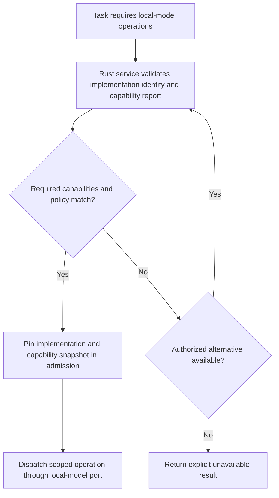
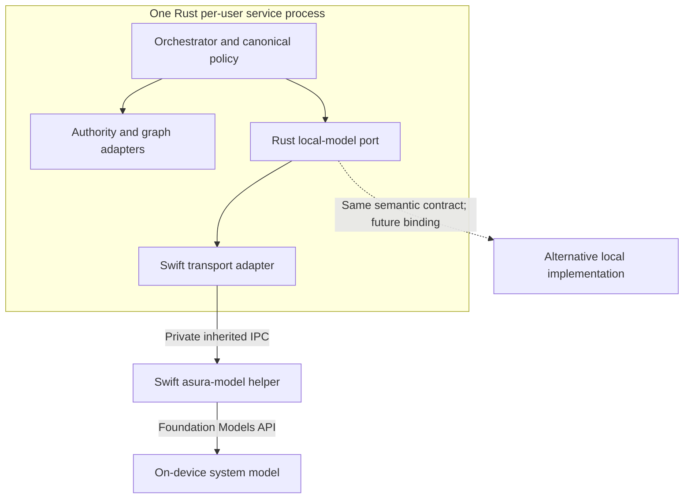
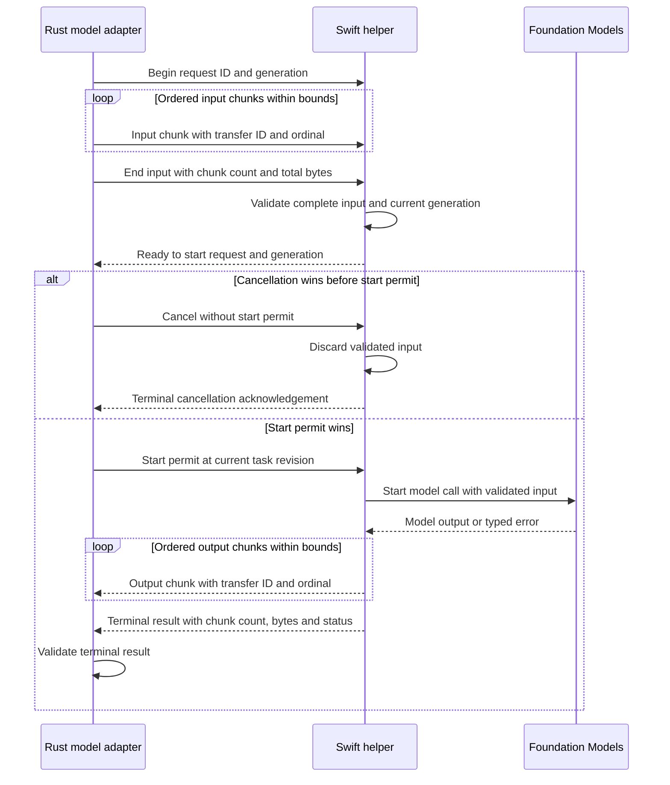
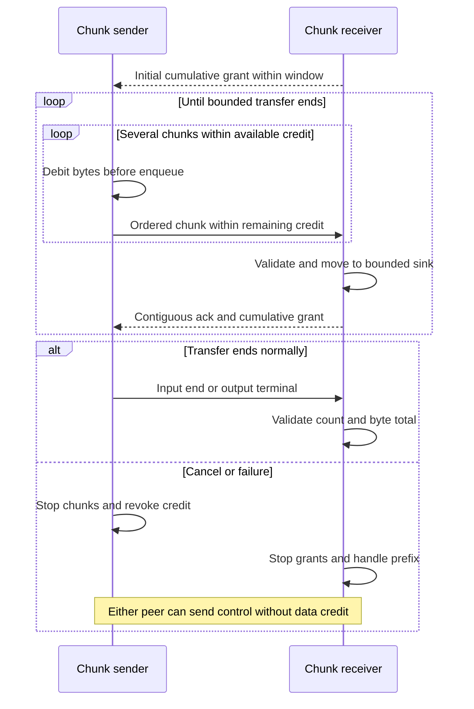
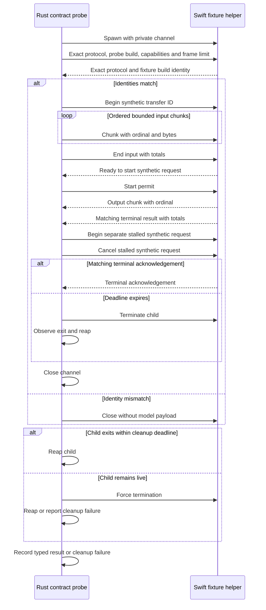
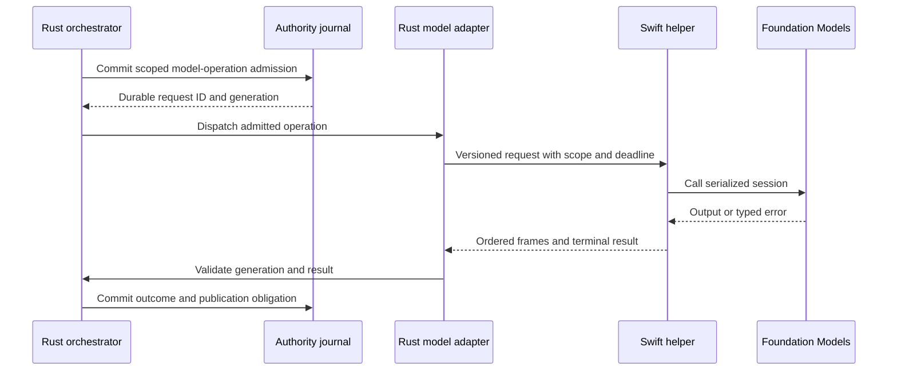
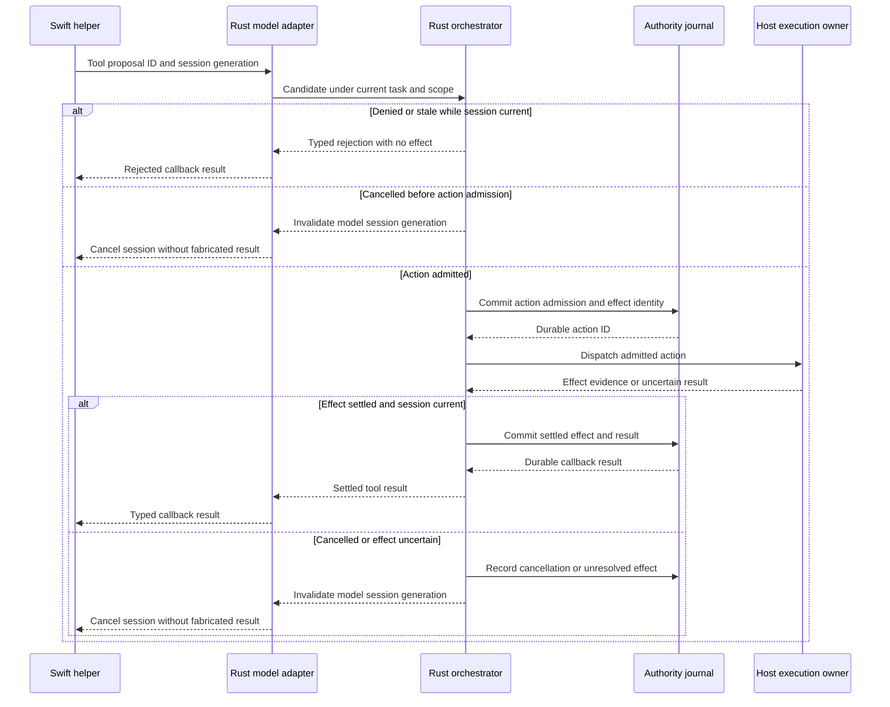
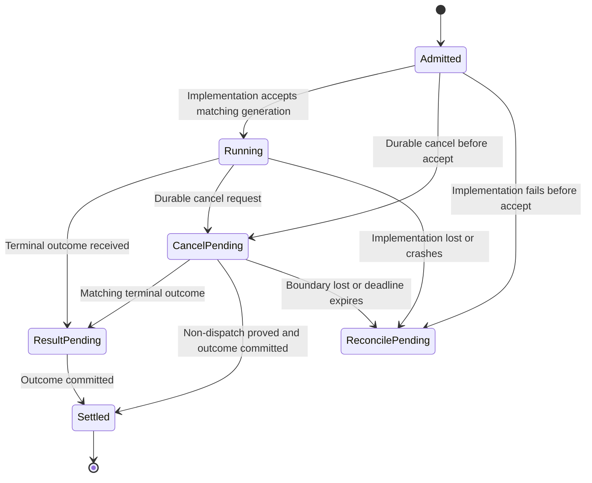
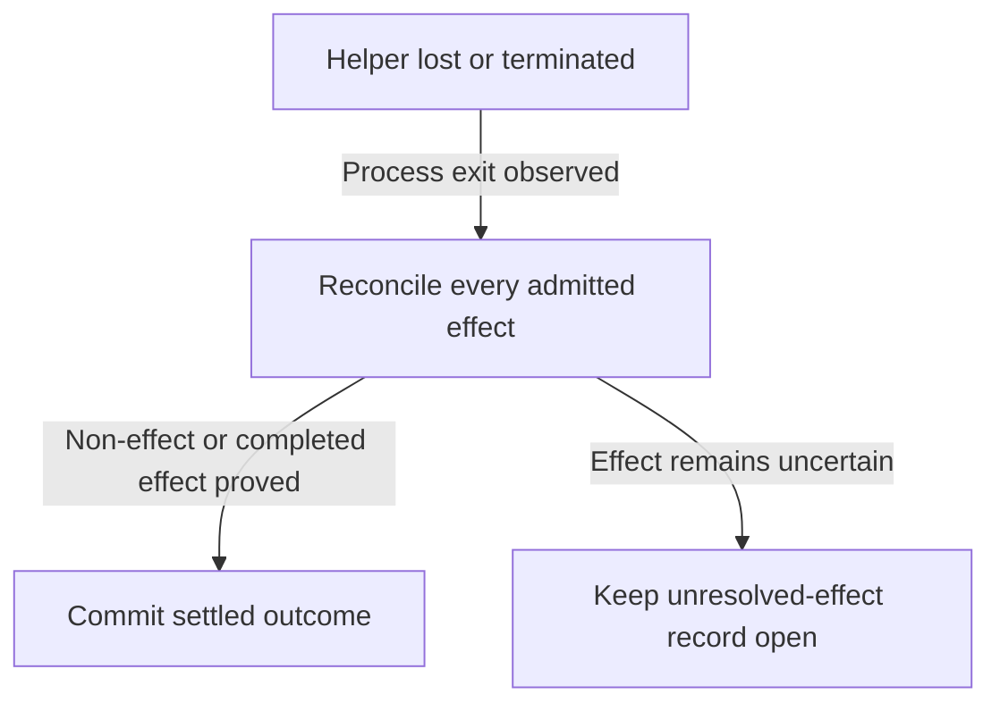

# D2 local-model boundary and Swift implementation

Status: proposed D2 design for I0 and I3. Rust and Swift are selected languages;
Ratatui and the Rust chat backend are selected. The Rust-owned local-model
contract must admit alternative implementations on other platforms or with
different capabilities. The owner selected a supervised Swift helper process
and a Protocol Buffers wire contract with chunked payloads for the first macOS
Foundation Models implementation on 2026-09-25. The owner also selected a
bounded credit window for each chunk transfer and an exact packaged
helper-build match. Session lifetime, helper resource layout, numeric window
and framing limits, and deadlines remain open.
This document does not authorize implementation or claim support for another OS.

The [architecture](../architecture.md) owns logical responsibilities. The
[runtime sketch](runtime-architecture.md) owns the wider async proposal. The
[standalone service design](system-architecture.md) owns per-user service
arbitration. The [release design](release-distribution.md) owns artifact
publication and upgrade behavior. D3 owns authoritative task state, policy,
ledger and command/event schemas; D4 owns model context and tool callbacks.

## Ownership and implementation choice

The Rust service remains the sole orchestrator and durable authority owner. It
admits tasks and model operations, reserves budgets, chooses scoped input,
selects an eligible local-model implementation, authorizes every tool effect,
records outcomes and publishes events. A local-model implementation owns only
its runtime availability, model session mechanics, inference and model-specific
errors. It cannot register projects, alter policy, write the authority journal,
select a graph, launch host tools or present a user approval as granted. The
Rust CLI/TUI is a control client of the same service. A future Swift GUI uses
the control API; it does not call a model implementation directly.

The service owns one semantic local-model port for all implementations. The
port's operations are capability discovery, session creation or restoration when supported,
scoped generation, tool proposal delivery, cancellation, session invalidation
and terminal outcome. A transport adapter carries those operations to a helper;
it cannot choose the model, relax policy or change task state. The first macOS
implementation maps this port to Foundation Models through Swift. Other local
implementations may use different runtimes and process mechanisms. Swift and
Rust remain the selected project languages; another language needs its own
architecture decision before implementation.
Remote AI adapters remain separate because remote egress and provider budgets
have different authority requirements; they still use the orchestrator's
canonical model-selection and task contracts.

The first macOS process choice is selected in
[ADR-0009](../decisions/0009-supervised-local-model-helper.md):

| Binding | Advantage | Cost and consequence |
| --- | --- | --- |
| Supervised Swift process, selected | A model crash stays outside the authority-owning Rust service; Rust can terminate and reap a stalled helper. | Requires bounded IPC, helper identity checks, private resources and Homebrew upgrade handling. |
| In-process Swift FFI, rejected for the first implementation | Avoids process startup and transport framing for local calls. | Shares crash fate with the service and requires explicit C ABI, buffer, executor, callback and cancellation contracts. A blocked call cannot be treated as cancelled merely because Rust stopped waiting. |

### Capability selection and portability

The service must decide eligibility from a versioned capability report and the
task's required operations, not from an OS name, executable name or presumed
Foundation Models behavior. The report must identify the implementation version,
model identity or declared version, and current availability. It must describe
supported input/output forms, structured results, tool proposals, streaming,
session retention, cancellation semantics and usage measurement. D4 must
define exact capability IDs, required quality evidence and which tasks may use
a reduced-capability model. An unsupported required
capability produces an explicit unavailable result or an authorized alternative
selection before admission. The service must not silently drop a tool proposal,
replace structured output with unchecked text or imply that cancel requested
means cancelled. Capability data is advisory until the service validates the
versioned implementation identity and checks each operation against its admitted
capability snapshot.

Propose that the service discover implementations from a verified installation manifest,
not from project configuration, model output, an MCP server or an arbitrary
executable on `PATH`. The manifest binds each implementation identity to its
platform eligibility, semantic-contract range, transport binding and installed
resource identity. D2/D7 must define its format and verification before the
first package is ready. A missing or unverified implementation is unavailable;
it does not weaken the service's authority checks.

Every operation retains the same task, scope, context-generation, budget and
deadline identities regardless of implementation. A stateless implementation
still receives a session-generation identity so late results can be rejected;
it does not have to retain a transcript. An implementation that retains context
must report and invalidate that state under D4's provenance contract. The
service owns selection and fallback decisions. It may switch implementations
only at a new admitted operation with a valid context and budget; it cannot
replay an uncertain operation merely because another implementation is present.

### Proposed capability decision

Arrows show the selection decision before admission. The chosen implementation
is fixed in the admitted operation record; a later capability or availability
change affects new admissions and may fail the current operation explicitly.

The candidate loop must be finite and deterministic; D4 must define ordering,
maximum candidates and whether a failure can fall back before admission.

### First macOS implementation

The Swift helper maps the local-model port to Foundation Models availability,
one `LanguageModelSession` per admitted session generation, model streaming and
typed model errors. These are implementation details, not requirements imposed
on every local-model backend.

The selected boundary uses a separate `asura-model` executable, spawned only by
the Rust service.
It has no named listener and no independent user-facing mode beyond a no-state
package/version check. A private `socketpair` endpoint is passed at spawn; the
service closes unrelated inherited descriptors and does not put prompts or
credentials in arguments or environment. The helper exits when the channel
closes or its scoped session ends. One helper serves one model-session generation
at a time. The service bounds concurrent helpers under its shared scheduler.
There is no cross-project helper pool in the first release. D4 fixes the exact
session lifetime and effective-context rules before I3 work. The inherited
channel is the proposed Swift transport binding, not the semantic local-model
port or a requirement on future platforms.

Open D2/D4 security question raised by the owner on 2026-09-25: revisit how
the on-device model and OS sandboxes interact before selecting the helper's
confinement and model-input exposure. No sandbox policy or capability grant is
selected by this note.

The installed macOS 27 SDK exposes `socketpair`, spawn file actions and
Foundation Models session APIs. It also exposes distinct availability reasons
and errors for concurrent session use. Those interfaces make this boundary
plausible; header availability is not packaged-runtime proof. An in-process
Swift FFI bridge avoids IPC cost but shares crash fate with the authority-owning
service and needs explicit C ABI buffer, callback, executor, cancellation and
unwinding contracts. The selected process boundary still requires measured
responsiveness and packaged-runtime qualification on supported hosts.

The evidence is Xcode 27.0 (27A266a), Swift 6.4 and the macOS 27 SDK installed
on the inspected host. SDK `sys/socket.h`, `spawn.h` and `sys/spawn.h` expose
the socketpair and spawn-file-action candidates. The Foundation Models Swift
interface exposes session state, typed availability and session errors; see
Apple's [session](https://developer.apple.com/documentation/foundationmodels/languagemodelsession)
and [tool-calling](https://developer.apple.com/documentation/foundationmodels/expanding-generation-with-tool-calling)
contracts. Apple's [Swift cancellation API](https://developer.apple.com/documentation/swift/task/cancel%28%29)
does not supply process-exit or task-wide settlement evidence. The
[Rust FFI guidance](https://doc.rust-lang.org/nomicon/ffi.html) informs the
alternative's obligations. None of these sources proves the packaged helper
can run Foundation Models or meet cancellation latency on the supported host.

### Proposed deployment view

Arrows show scoped model operations and authority ownership. The control client
and physical stores appear in the linked system architecture. Results and tool
proposals return over the same binding to the Rust owner.
Only one local-model implementation is selected for an admitted operation. The
future implementation box is a contract consumer, not a first-release artifact.
Neither implementation receives direct host-effect or graph authority.

## Model operation contract

The semantic local-model contract is owned by Rust and independent of the
Swift wire binding. [ADR-0010](../decisions/0010-protobuf-model-channel.md)
selects binary Protocol Buffers for that binding. I0 must establish one
canonical `proto3` schema source and generate Rust and Swift types from it
during every clean build. Generated source for this channel is an untracked
build output; neither language checks in a competing generated contract or
maintains handwritten request types. The
[I0 toolchain bootstrap design](protobuf-toolchain-bootstrap.md) records the
selected compiler, generator, cache and build-output contracts. Its first
packet uses a test-only smoke schema; it does not satisfy this channel's
schema, framing or BP1-BP31 probe checks. Their cross-language compatibility
remains an I0 qualification check.
Generation failure, a missing tool or a version mismatch fails the build
before compiling a stale binding. The release packages compiled outputs and
does not require generators on the end user's machine.
The inspected host has `protoc` 36.2 but no `protoc-gen-swift`.
No binding generation has been verified.

The private stream carries a 4-byte unsigned big-endian length followed by that
many Protobuf bytes per message. A zero length, a length above the negotiated
or local hard maximum, and EOF within either prefix or body reject the channel.
Readers check length before allocating the body and never attempt
resynchronization after malformed framing. D2 still owes numeric frame and
field limits. The first handshake uses the local pre-negotiation hard maximum.
Later frames use the smaller of both advertisements and that hard maximum.
EOF at a frame boundary is orderly only after a valid terminal
result or handshake rejection with no admitted operation. Otherwise it is a
lost channel requiring reconciliation. Handshake, per-frame completion and
absolute operation deadlines bound silence and byte dribbling. Aggregate
frame-count and byte limits reject a stream of individually valid small frames.
Receiving one byte cannot restart a frame deadline. A completed frame cannot
extend the absolute operation deadline.
Before model content, both sides exchange the package-build identity, exact
private-protocol identity, capability bits and maximum frame size. Both
identities must match the service's expected package and protocol. A mismatch
closes the channel without interpreting request content, and the service
performs bounded child cleanup. There is no compatible-version negotiation
or fallback to an unversioned protocol on this private binding. Capability
and frame-size negotiation can only reduce the supported scope. A decoded
Protobuf message is not an authorized
operation. Rust must validate required semantic fields, known critical enum
values, request and generation identity, admitted capabilities and bounds.
Unknown fields cannot add authority. D2/D7 must select the limits and exact
identity fields before I0 scaffolding. A future binding must preserve the semantic
identities, outcomes and authority boundary even if its framing differs.

### Chunked payload transfer

Input and output content for the first macOS binding use ordered Protobuf chunk
messages within bounded frames. Every chunk carries a stable request and
transfer identity, direction, consecutive zero-based chunk ordinal and bounded
nonempty bytes. A transfer ends with one explicit marker recording the final
chunk count and total bytes. The receiver starts at ordinal zero and increments
only after it accepts a chunk. It separately advances a checked cumulative
byte cursor by each chunk's payload length. Ordinal or byte-count overflow,
an empty data chunk, or a total above the aggregate cap rejects the transfer.
The output terminal result doubles as the output end marker. It records the
final chunk count, total bytes and success or typed failure, even after zero
output chunks. The receiver requires the declared count and byte total to equal
its accepted cursors. It checks identities and aggregate limits and rejects
duplicate, missing, stale or post-terminal chunks. No transfer digest is sent
or checked on this private channel. A same-length payload change can pass these
structural checks; this contract does not claim cryptographic integrity or
authenticate the helper. D4's context provenance and D7's artifact digests are
separate contracts.

Each transfer has an independent byte-denominated credit ledger keyed by
request, transfer, generation and direction. The receiver grants initial
credit no larger than its negotiated window and available transport staging
capacity. The sender debits a chunk's payload bytes before enqueueing it. It
cannot send a chunk whose bytes exceed remaining credit, the frame cap or the
aggregate transfer cap. An empty transfer uses its end marker without data
credit. Input and output credit cannot be exchanged or applied to another
request.

The receiver acknowledges only a contiguous, validated prefix of payload
bytes. After moving accepted bytes out of transport staging into a separately
bounded input accumulator or output sink, it may extend cumulative credit.
The receiver must keep cumulative granted bytes at or below released staging
bytes plus the negotiated window. This keeps sent but unreleased bytes within
the window. The receiver still enforces the separate aggregate transfer limit;
releasing staging space does not grant unlimited total payload. An output sink
may hold provisional data, but a credit acknowledgement does not settle or
publish the model operation.

Each credit message carries the same identities, direction, a cumulative
accepted-byte position and a monotonically increasing cumulative grant. The
sender rejects a regressing or repeated credit message, an acknowledgement
beyond bytes sent, a grant below bytes already sent, or a grant above the
acknowledged position plus the window. The receiver rejects chunks beyond its
grant, including frames already queued when a limit is reached. No peer may
increase the negotiated window by advertising more credit. The exact Protobuf
field numbers and numeric window remain D2/I0 decisions.

Control messages have reserved processing and outbound capacity. Waiting for
data credit cannot block cancellation, terminal status or channel-failure
handling. On cancellation or transfer failure, both sides stop issuing credit;
the sender stops new chunks and invalidates unused credit. Bytes already in
flight remain bounded by the window and are rejected or discarded under the
cancelled transfer. Late credit or data after a terminal result is a protocol
fault. A stalled grant cannot extend the absolute operation deadline. A credit
acknowledgement is never evidence that the model call began or completed.

The Swift helper validates the full input transfer against the admitted request
and current generation, then asks Rust for a start permit. The Rust orchestrator
serializes that permit with cancellation under the current task revision. If
cancellation wins, Rust withholds the permit and Swift discards the input without
calling Foundation Models. If the permit wins, later cancellation follows the
running-operation protocol even if Swift has not entered the model API yet.
No unpermitted model call is allowed.

Transport chunks do not themselves enable user-visible streaming. If D3/D6
select provisional output publication, Rust marks each prefix as provisional
and publishes a failure or invalidation event when the transfer fails. A final
outcome requires the terminal result and durable settlement. D3/D6 own exact
presentation and replay rules. The first binding transfers content over the channel, not
through a project path or helper-readable file reference.

A cancellation or channel loss before a start permit discards partial input and
does not call the model. A loss during output transfer leaves the operation
pending reconciliation; the received prefix is not a complete result. D2 must
set the numeric credit window, schema field types and cleanup deadlines.
D4 still owns effective-context provenance and
what content may enter an input transfer.

### Proposed chunk sequence

Proposed semantic sequence for one request. Arrows identify request, chunk and
terminal ownership. The [credit sequence](#selected-credit-window-sequence)
defines per-transfer flow control; this diagram cannot by itself authorize
implementation.

### Selected credit-window sequence

Selected flow-control mechanism for either transfer direction. `Sender` is Rust
for input and Swift for output; `Receiver` is the other process. Arrows carry
one transfer's identities. The loop can carry several chunks before a credit
update. A grant acknowledges transport acceptance only.

### I0 contract probe boundary

I0 has no per-user service, task journal, project registry or real model loop.
Its cross-language probe uses a Rust test entry point and a separate deterministic
Swift test fixture through the private channel. The fixture is a test target and
is not shipped as the production model helper. It proves exact-identity matching,
bounded request/response framing, mismatch rejection and bounded cancellation
of connected components. Probe identities are synthetic and have no task or
installation authority. The fixture cannot call host tools, create an Asura
installation or claim Foundation Models quality. The production helper has no
probe-only mode. D2/D7 must define the exact test-target packaging and probe
invocation before I0 is ready.
I0 sends only synthetic, length-bounded chunks. It does not interpret a
payload reference as a file path or grant the fixture workspace access. The
fixture must prove full-transfer validation before producing a result.
The probe and fixture use one exact probe-build identity generated for that
test pair and one exact private-protocol identity. This tests mismatch
rejection, not a production package's signature or resource authenticity.

One probe coordinator serializes start and cancellation for each synthetic
request. A cancellation observed before spawn prevents spawn. A cancellation
observed after spawn but before request dispatch closes the channel and reaps
the child without sending content. After dispatch, the coordinator sends one
cancel signal and waits for a matching terminal acknowledgement or forces a
bounded exit. It cannot mark cancellation complete while a child remains live.
The I0 race test must exercise every ordering at the spawn and dispatch fences.
Every branch, including handshake rejection, closes the channel and waits for a
bounded child exit. If the child remains live, the probe terminates it, then
escalates to forced termination and bounded reaping. Failure to observe exit
is a failed probe with an explicit unresolved-child report, never success.

Proposed I0 sequence. Arrows show the cross-language contract and the mismatch
branch. The final assertion observes the child process and its channel, not a
durable task outcome.

### Runtime model operation envelope

Each admitted operation carries a stable request ID, installation and task
identities, scope revision, implementation identity and capability snapshot,
model-session generation, input-context generation, the service's remaining
deadline and a versioned input identity. The first macOS binding adds transfer
identities to its chunk messages. Each response carries the same operation
identities. Where streaming is negotiated,
it carries an ordered position. It carries typed availability/error status,
measured usage when supported, and a single terminal
result. The service rejects a response whose generation, sequence or request
identity is stale or mismatched. A model implementation may report a tool
proposal only when that capability was admitted. The Rust orchestrator alone
checks policy, budget and task state before any effect. D4 defines tool callback
and transcript contracts; a proposed tool is never an executed tool.
Apple's tool callbacks may run concurrently within one model response. The
semantic port gives each proposal a separate stable ID, bounds outstanding
callbacks, and does not infer ordering from callback arrival. Rust authorizes
and settles each admitted effect through its normal task ledger. Another
implementation must meet the same proposal contract if it advertises tools.

The Swift helper serializes Foundation Models calls on one session. Apple’s current
session interface reports concurrent-request and transcript-mutation errors;
the service must not interpret concurrent calls as independent safe work. A
retained transcript is effective context. The helper does not export or persist
one merely because the SDK type is Codable. After crash, timeout or context
invalidation, Rust invalidates that session generation. D4 must define whether
a transcript is eligible for durable, provenance-preserving restoration before
any automatic reconstruction is allowed.

### Admitted model request

Proposed direct-result sequence. The journal records admission and terminal
outcomes; the helper has no journal access. A helper contract mismatch after
admission becomes a durable bridge failure, not an absent state change. A model
tool proposal follows the separate callback view below.

### Model tool proposal boundary

Proposed authority sequence. A callback result is sent to Swift only after
the action is denied or its separately admitted effect has settled. If the
task is cancelled or the effect remains uncertain, Rust invalidates the model
session instead of fabricating a tool result. D4 must still fix the exact
Foundation Models callback API, deadlines and resumed-session semantics.

## Cancellation, failure and isolation

Cancellation semantics vary by implementation. `CancelRequested` means an
implementation was asked to stop; it does not prove the model operation, a tool
callback or descendant work stopped. The Rust owner records cancellation under
the common failure contract, sends one idempotent cancel signal, and waits for
a matching terminal result or evidence that the implementation cannot continue.
Each binding must define its stop mechanism, deadline and evidence. For the proposed
Swift helper, Swift task cancellation is cooperative. If it does not settle
within the designed deadline, Rust terminates that helper process and records
process-exit evidence. It invalidates the session generation. Task-wide
`Cancelled` is published only after all admitted operations and effects meet
their settlement conditions. D3-D4 fix numeric deadlines and exact recovery
records; I0 must prove bounded cancellation through the real bridge.

A local-model implementation crash, lost channel, malformed frame, wrong
version or missing package resource cannot reset the Rust service or trigger a
silent model retry. Rust reports the operation as pending reconciliation or a
proved non-effect failure, according to the durable ledger. It can start a new
implementation instance only with a new generation and an
explicitly valid input context. Status, cancellation and unrelated contexts
remain responsive. Model unavailability is a typed operation result, not proof
that the per-user service or graph is unhealthy.

### Model operation cancellation

Proposed state view for one model operation through the semantic port. Arrows
name evidence; a cancel signal is separate from settled cancellation.
ReconcilePending continues in the Swift helper-loss view below. A future
binding must define equivalent loss evidence without assuming process exit.

### Helper-loss reconciliation

Proposed state view after helper loss or forced termination. Arrows name
process-exit and effect evidence. An uncertain effect cannot close the
operation merely because its model helper is gone.

New effect evidence reopens reconciliation from the unresolved record. The
service never equates helper exit with effect settlement.

For the proposed Swift binding, the channel is a capability only between parent
and child. It does not expand the selected same-UID principal boundary or make
model output trusted. The
helper must not receive project filesystem handles, graph credentials or host
tool grants. It may receive bounded prompt content and must redact that content
from diagnostics. D1/D7 must verify helper binary integrity, code signing,
resource location and other-UID isolation in the actual Homebrew package.

## Artifact and resource boundary

The first macOS artifact candidate contains the Rust `asura` command, a Swift
`asura-model` helper private to the package and declared runtime resources.
The formula exposes `asura` in `bin`; it installs the helper and its resources
in one versioned private location such as `libexec/asura`. Both executables
must report the same package-build identity and exact private-protocol
identity without starting the service. That report is diagnostic, not proof
that a file is authentic. The Rust service resolves the helper from its
verified installed package, not `PATH`, a project directory or an attaching
client's path. It checks the helper against the package manifest before spawn
and rejects a handshake mismatch before model content. D2/D7 must select
exact paths, identity generation and signature/manifest checks before packaging.

Homebrew can remove an old keg while its service runs. If the matching helper
file or resource is gone before spawn, the old service rejects new model work
and retains control availability. It must not use a helper from a new keg or
an attaching client's package. If a running helper loses a lazy resource, the
model operation follows the reconciliation rules above; it cannot be marked
complete merely because the process exited. A new `asura` client may start
its packaged helper only after the old service drains and releases ownership.
I9 must test cleanup during an admitted call and before a later helper spawn.
Another platform may package a different local-model implementation and
transport. Its release design must prove identity, resource lifetime, failure
isolation and the same semantic contract before claiming support. The first
Homebrew formula does not need to ship an unselected alternative.

## Validation and remaining D2 decisions

The first design target is a ready **I0 bridge-probe slice**, not a claim that
the whole local-model system is ready. I0 can qualify a connected Rust/Swift
contract without durable task admission or real inference. The later runtime
contract depends on the I1 service and D3 state design. The first real model
operation depends on D4 context, callback and budget rules. I9 separately
qualifies a signed installed artifact and Homebrew handover.

| Readiness slice | Decisions and evidence needed before its design is ready |
| --- | --- |
| I0 bridge probe | Apply selected process, Protobuf, fixed-prefix, chunking, credit-window, exact-identity, position-plus-total and build-time-generation choices; pin generators, schema, numeric window, per-frame and aggregate limits, probe-build identity, start/cancel ordering, deadlines, probe command, clean-build and fault checks BP1-BP31. |
| I1 service prerequisite | D1-D3 select per-user owner, local peer identity, durable task and operation records, recovery, and control API. I0 cannot substitute for these contracts. |
| I3 local-model runtime | D4 selects capability eligibility, retained-context provenance, tool callbacks, budget and usage accounting, model evaluation and failure settlement. Prove SR2-SR6 and SR8-SR11 through the real service. |
| I9 packaged release | D7 selects signed artifact, helper/resource identity and upgrade procedure. Prove SR1, SR4 and SR7 on a clean supported host. |

The [D8 consistency gate](../plans/architecture-and-design.md#d8-consistency-and-implementation-readiness)
reviews these boundaries with the rest of the architecture. A ready slice is
still subject to the separate owner review and implementation authorization in
the [design process](../design-process.md#design-readiness-lifecycle).

| ID | Initial state and trigger | Required result and evidence |
| --- | --- | --- |
| SR1 | Clean supported host installs the signed artifact and submits a model-dependent CLI task | The packaged Swift helper negotiates the contract and returns a typed real-model result through the service. Unit schema checks, installed-process integration and CLI end-to-end evidence; the test-only fixture is absent from the release. |
| SR2 | Helper reports a different package build or private protocol after admission | Rust rejects before model content or model call, reaps the helper and durably settles the admitted operation with a typed bridge failure. Unit identity checks, integration mismatched helpers for each identity and CLI typed failure. |
| SR3 | One session receives two concurrent calls | Requests serialize or the second is rejected without transcript mutation. Unit scheduler check, real Foundation Models integration, CLI task result. |
| SR4 | Cancel while Swift model call is blocked | Rust stops admission, observes helper settlement or exit, and keeps control responsive. Unit state checks, process integration, CLI cancellation. |
| SR5 | Helper crashes after a tool proposal | Rust never assumes the tool ran; it reconciles any separately admitted effect. Unit identity check, crash integration, CLI recovery. |
| SR6 | Context generation changes before a late frame | Rust rejects the stale frame; no cross-context output or tool effect escapes. Unit generation check, process integration, multi-context CLI. |
| SR7 | Old Homebrew keg disappears before helper spawn or during a call | No unverified executable starts; accepted effects reconcile, while status and cancellation work. Unit decision checks, real-upgrade integration, CLI recovery. |
| SR8 | Helper emits a malformed frame after a model call began | Rust rejects the frame, invalidates that helper generation and reconciles admitted work before any terminal claim. Unit decoder checks, process fault integration, CLI recovery. |
| SR9 | Candidate lacks a required structured-result or tool capability | Service rejects that candidate before admission and returns explicit unavailability or selects an authorized eligible candidate. Unit matching and snapshot checks, two-implementation integration, CLI result. |
| SR10 | Capability changes or another implementation appears while work runs | Admitted work remains pinned to its identity and capability snapshot; no silent replay or cross-implementation result is accepted. Unit generation checks, process integration with fault injection, CLI recovery. |
| SR11 | A stateless local implementation runs the same scoped request | It uses the shared task/context/deadline identities without a retained transcript; cancellation and terminal outcomes obey the same service contract. Unit port conformance, second binding integration, CLI end-to-end probe. |

I0 covers only bridge-probe cases BP1-BP31 below. I3 introduces durable model
admission and covers SR2-SR6 and SR8-SR11 with the real service, real model
where required, and a deterministic alternative for contract faults. I9
covers SR1, SR4 and SR7 from a signed installed artifact. D7 must assign
exact commands, fixture versions, deadlines, model availability conditions
and performance budgets. An I0 probe cannot claim task recovery, model quality
or support for another OS.

| ID | I0 trigger | Required evidence and limit |
| --- | --- | --- |
| BP1 | Clean checkout runs the Rust probe with the Swift fixture | Generated versions and byte-for-byte matching synthetic input/output chunks with a terminal result cross real processes. Unit schema checks, process integration and probe-command end-to-end result; no service or real model claim. |
| BP2 | Fixture advertises a different private-protocol identity | Probe rejects before model payload. Unit identity checks, real-process mismatch fixture and probe-command failure result. |
| BP3 | Fixture advertises or sends an oversized frame | Probe rejects before allocating the claimed size or interpreting content. Unit length checks, real-process fault fixture and probe-command failure result. |
| BP4 | Cancel wins before child spawn | No child starts and no synthetic request dispatches. Unit ordering checks, race integration and probe-command result. |
| BP5 | Cancel wins after spawn but before request dispatch | Probe closes the channel and reaps the child without sending content. Unit ordering checks, process race integration and probe-command result. |
| BP6 | Cancel follows dispatch of a stalled synthetic request | Probe observes matching terminal acknowledgement or kills and reaps the child within the selected deadline. Unit timeout checks, process stall integration and probe-command result; no task-wide cancellation claim. |
| BP7 | Deterministic second binding has different capabilities | Shared semantic port accepts supported operations and rejects missing ones. Unit capability checks, two-binding integration and probe-command result; no platform-support claim. |
| BP8 | Fixture sends a zero-length frame or malformed Protobuf body | Probe rejects without dispatch and performs bounded child cleanup. Unit decoder checks, real-process fault fixtures and probe-command failure results for each variant. |
| BP9 | Fixture closes halfway through the 4-byte prefix or declared body | Probe reports truncated transport, not a completed request; it reaps the child. Unit partial-read checks, real-process fixtures and probe-command failure results for each truncation point. |
| BP10 | Decoded message lacks a semantic identity or contains an unknown critical enum | Probe rejects before interpretation or capability grant. Unit field-validation checks, generated Rust/Swift fixture exchange and probe-command failure results for each variant. |
| BP11 | Fixture stays silent, dribbles bytes or floods small valid frames | Handshake, per-frame and absolute deadlines plus cumulative limits end the probe without unbounded memory or work. Unit limit checks, process fault fixtures and bounded probe-command failures for each variant. |
| BP12 | Fixture emits duplicate terminal results or frames after terminal | Probe rejects the extra frames and never reports a second success. Unit sequence checks, process fault integration and probe-command failure result. |
| BP13 | Fixture sends a duplicate, missing or out-of-order chunk | Probe rejects the transfer before any fixture result is accepted. Unit sequence checks, real-process variants and probe-command failure results. |
| BP14 | Cancel arrives during an incomplete input transfer | Fixture discards partial content, makes no model-equivalent call and settles or exits within the selected cleanup deadline. Unit state checks, process race integration and probe-command result. |
| BP15 | End marker chunk count or total bytes disagrees with accepted chunks | Receiver rejects the transfer without constructing a complete input or output. Unit total checks, real-process fault integration and probe-command failure result. |
| BP16 | Channel closes after a valid output prefix but before the terminal result | Probe reports incomplete transfer, not success; partial output remains provisional and child cleanup is bounded. Unit terminal checks, process integration and probe-command failure result. |
| BP17 | Cancel races the final input marker, ready-to-start reply and start permit | The probe serializes cancellation and permit. A winning cancel prevents the fixture's model-equivalent call; a winning permit makes later cancel follow the running-operation path. Unit transition checks, process race integration and probe-command results for each ordering. |
| BP18 | A chunk has the wrong request identity | Receiver rejects it before including its bytes. Unit identity checks, real-process fault integration and probe-command failure result. |
| BP19 | A chunk has the wrong transfer identity or direction | Receiver rejects it before including its bytes. Unit transfer checks, real-process variants and probe-command failure results. |
| BP20 | A chunk arrives after the input end marker | Receiver rejects the protocol violation. If no start permit exists, the fixture makes no model-equivalent call; after a permit, the probe fails and settles the running operation through cancellation. Unit sequence checks, real-process variants and probe-command failure results. |
| BP21 | A typed failure follows an output prefix, or the terminal reports inconsistent output totals | Receiver rejects inconsistent totals. For a valid failure terminal, the probe reports failure and never reports the prefix as a settled result. Unit terminal checks, process variants and probe-command failure results. |
| BP22 | Input or output exceeds one window but remains within the aggregate cap | Several chunks can be in flight. The sender pauses at zero credit and resumes only after a matching grant; outstanding transport bytes stay within the window. Unit ledger checks, real-process transfer integration and probe-command success in both directions. |
| BP23 | A credit message repeats, regresses, overgrants or acknowledges unsent bytes | Sender rejects the credit and fails the transfer without sending extra content. Unit ledger checks, real-process fault variants and probe-command failure results for each variant. |
| BP24 | Credit names another request, transfer, generation or direction | Sender rejects it; no other transfer gains credit. Unit identity checks, real-process fault variants and probe-command failure results. |
| BP25 | Receiver stops granting credit while a transfer remains incomplete | The sender remains bounded; cancellation and status remain responsive, and the absolute deadline ends the stalled transfer. Unit deadline checks, stalled-fixture integration and bounded probe-command failure result. |
| BP26 | Cancellation races queued chunks and a credit grant | Neither peer sends new chunks or grants after observing cancellation. In-flight bytes stay within the window; late credit cannot revive the transfer. Unit transition checks, process race integration and probe-command results for each ordering. |
| BP27 | Fixture reports a different probe-build identity with the same private protocol | Probe rejects before model payload and reaps the child. Unit equality checks, real-process mismatched fixture and probe-command failure result. This does not prove packaged-helper authenticity. |
| BP28 | Fixture sends an empty data chunk | Probe rejects it; a zero-byte transfer is valid only through its end marker. Unit chunk checks, real-process fault integration and probe-command failure result. |
| BP29 | Chunk ordinal or cumulative byte arithmetic overflows or exceeds its cap | Probe rejects before accepting the chunk or granting more credit. Unit checked-arithmetic and cap checks, real-process fault variants and probe-command failure results. |
| BP30 | A clean checkout lacks a pinned generator or finds a mismatched version | The build fails before compiling generated bindings and does not use stale output. Unit version-policy checks, clean-build integration for missing and wrong tools, and CI command failure evidence. |
| BP31 | The schema changes while prior generated output exists | The build regenerates both language bindings or fails before compilation; it cannot silently use old output. Unit build-dependency checks, isolated clean/rebuild integration and CI command evidence. |

This proposal still needs exact semantic capability IDs and eligibility rules,
generator versions and framing, helper spawn and resource-identity mechanism,
numeric frame/queue/deadline limits, session invalidation contract, signed
package layout and real packaged-runtime tests. D2/D4 must specify the second
conformance binding without confusing a test substitute with platform support.
The owner must review the resulting ready design and plan before any code.
