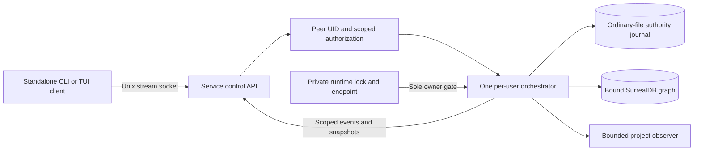
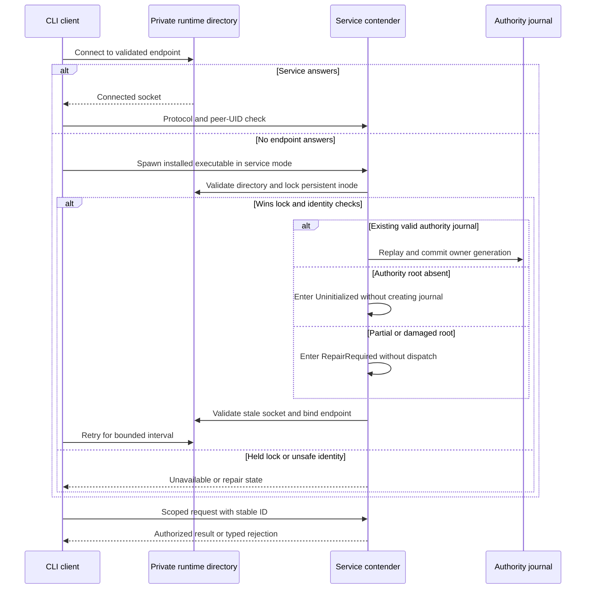

# D2 standalone per-user service boundary

Status: proposed I1 D2 design for owner review. The selected installation form
is a standalone command with a per-user service. The owner selected a Unix-domain
socket for its local control channel on 2026-09-25. The selected I1 principal is
one macOS account. Runtime path, arbitration, fencing and same-UID behavior
below are design proposals, not validated host behavior. This slice does not
select the eventual Swift/Rust boundary, agent helper layout or GUI transport.
The [local-model boundary proposal](swift-rust-boundary.md) develops the first
of those choices without changing this service's sole authority.

The [runtime architecture](runtime-architecture.md) owns the wider execution
model. The [threat model](threat-model.md) owns adversary scope; the
[authority recovery design](persistence-recovery.md) owns committed state. The
[production bootstrap design](production-bootstrap-status.md) owns client-visible
initialization, registration and status.

## One owner and one attachment contract

The standalone `asura` command runs as a client by default. It attempts to
connect to the selected per-user Unix stream socket. If no service answers, one client
may spawn the same installed executable in service mode and all clients retry
for a bounded interval. A service process owns the orchestrator, registry,
policy checks, journal writer, bound graph adapter and command admission. A
client owns input and display only. The service cannot use a client's `HOME`,
cwd, socket path or claimed UID to choose its own installation.

Before `.asura/` exists, the service must still answer Uninitialized. Propose a
private runtime directory under the service account's resolved home at
`Library/Caches/com.asura/run`, containing `owner.lock` and `control.sock`.
This directory is outside the authority root and contains no installation
identity. The service validates every path component and opened descriptor for
type, owner and private access; it rejects aliases, replacement and a socket
path too long for `sockaddr_un`. Initial support is limited to local account
homes and qualified filesystems. An unsupported or ambiguous layout returns a
specific unavailable/repair state without a fallback path. D1-D2 must qualify
the exact cache lifecycle on a real host; losing this runtime directory while
the service is live must not cause a second owner.

The only process allowed to bind the endpoint is the holder of an exclusive
lock on a persistent `owner.lock` inode. Startup never unlinks or recreates a
present lock file to win. The winner validates that the lock's named entry
still refers to its held inode, then may inspect and remove a stale socket and
bind a new one. The lock stays held through service lifetime. If the lock is
held but the endpoint does not answer, clients report service unavailable;
they do not break the lock using a PID or timeout. An owner losing descriptor
or path identity must stop admission and dispatch. A restarted owner replays
the journal and commits a new owner generation before admitting work. Any
worker or helper request must carry that generation and be rejected if stale.
The journal generation is a fencing record, not a substitute for OS-level
exclusive ownership; D2-D3 must qualify old-process and helper termination.

### I1 deployment view

Proposed component view. Arrows show requests, results and write ownership;
the runtime guard gates the sole orchestrator owner.

## Startup and endpoint identity

`posix_spawn` with a new session is the proposed standalone launch mechanism.
The CLI must pass a fixed service-mode argument, not project-controlled
environment or arbitrary inherited descriptors. Packaging must pin the
executable path and version contract; a client connecting to an older service
negotiates protocol compatibility or fails clearly. The service can outlive a
terminal session, but restart, logout and update behavior need real-process
qualification. There is no LaunchAgent or Mach service in this I1 choice.
The selected [Homebrew tap distribution](../decisions/0008-homebrew-tap-distribution.md)
installs this standalone command. A formula update does not itself replace a
live service; [release distribution](release-distribution.md) owns the proposed
upgrade and handover behavior. D2-D3 must define the stable maintenance
handshake, owner-generation-guarded drain and version negotiation before an
older live service can be replaced. The owner lock remains authoritative for
handover; a changed Homebrew symlink cannot transfer ownership.
Homebrew may remove the old keg while its service is still alive. The old
service cannot re-exec a path from that keg or dispatch through a helper or
resource that disappeared. It preserves control and recovery, and settles
affected work under the [release resource-loss contract](release-distribution.md#service-lifecycle-across-homebrew-operations).

On accepted connections the service obtains the kernel-provided effective
peer UID (`getpeereid` candidate) and requires its own UID; clients also verify
the service peer UID. A successful peer check establishes only the selected
macOS-account principal. The service checks each request's scope, revision,
policy and installation state. Same-UID processes can invoke the genuine CLI
or access same-UID files; this release does not claim malicious same-UID
resistance. Socket pathname permissions and code signing do not supply human
intent. Versioned length-bounded protocol frames, bounded queues and timeouts
are required; D3 must finish the command/event schema before implementation.

### Standalone startup sequence

Proposed sequence. Arrows show client attachment, owner arbitration and the
authority checks before the first scoped request.

The socket is bound only after the owner can serve explicit uninitialized,
ready, unavailable or repair states. A journal or graph failure must not be
converted into a new installation. A full shutdown stops admission, settles
or records in-flight controls under their durable contract, closes the socket
and releases the lock last. Another contender can start only after lock
release and journal replay. Crashes leave a stale socket that the next lock
winner may remove after identity validation.

## Failure and qualification contract

| ID | Trigger | Required outcome |
| --- | --- | --- |
| S1 | Two clients start with no endpoint | At most one owner binds and writes; losers attach or receive bounded unavailable. |
| S2 | Lock held, socket absent or hung | No PID-based takeover; client reports unavailable with recovery guidance. |
| S3 | Process dies after lock but before bind | Next lock winner validates the existing inode and stale endpoint before replay/bind. |
| S4 | Runtime directory, lock or socket is replaced | Reject ambiguous identity, stop admission and preserve authority files. |
| S5 | Client from another UID connects | Reject before disclosing status, paths or project names. |
| S6 | Old owner/helper survives a replacement attempt | It cannot append, dispatch or publish under a stale generation. |
| S7 | Root absent, partial or corrupt at startup | Expose Uninitialized or RepairRequired as appropriate; never silently reset. |
| S8 | Client and service protocol versions differ | Negotiate a supported version or reject without interpreting unknown frames. |
| S9 | Old keg is removed while its service still runs | Service detects missing helper/resource before dependent dispatch, settles affected work, and never spawns from a missing or changed path. |
| S10 | Handover races another accepted request | One serialized durable drain barrier accounts for every request accepted before it; no request disappears during ownership transfer. |

Unit checks cover path/identity decisions, framing, revision and admission
state. Real-process integration must cover S1-S10, multiple login sessions for
the same UID, another UID, process kill/restart, lock/socket replacement and
same-UID endpoint races on supported macOS filesystems. CLI end-to-end checks
must show bounded startup, typed recovery and intact original request results
after reconnect. TUI proof follows in I4. SDK availability alone is not
runtime evidence. D7 must assign executable cases and pin host, filesystem,
timeouts and acceptance thresholds.

This I1 slice is not implementation-ready until lock-inode retention, socket
replacement handling, cached runtime-directory lifecycle, owner fencing and
protocol schema are exact and qualified. D2 still owes the Swift/Rust process
allocation, helper boundaries and full deployment view before its whole stage
can be ready.
