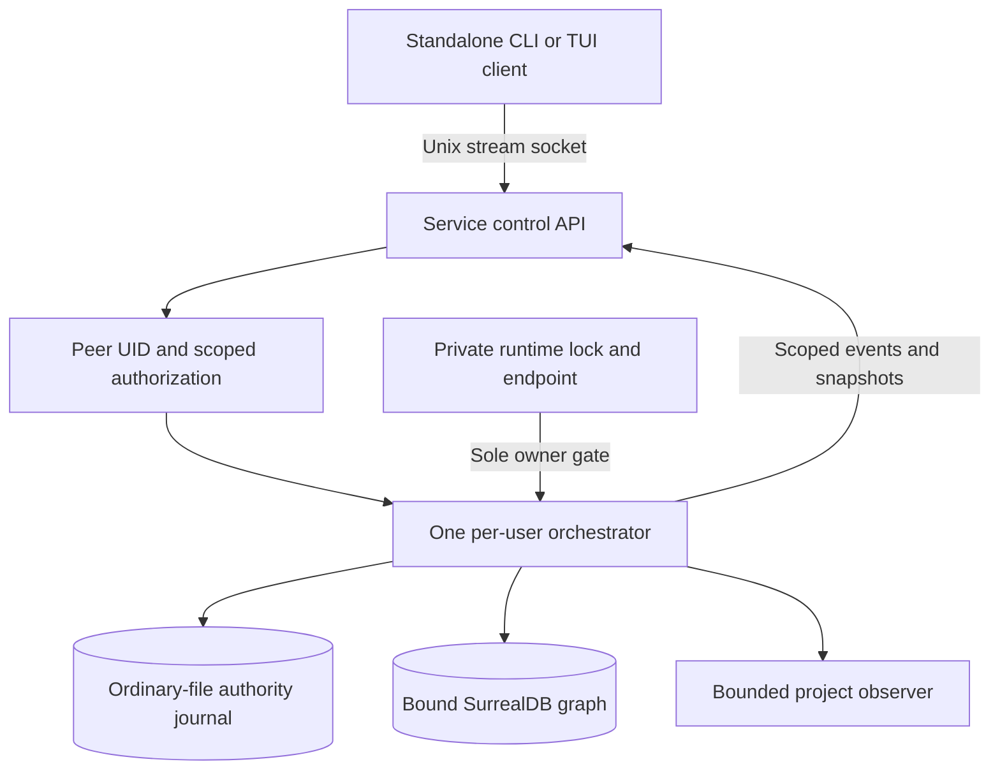
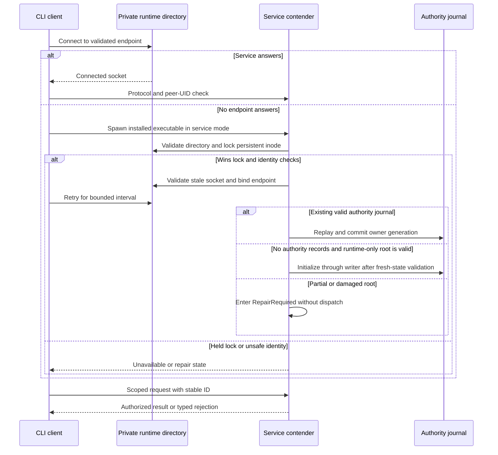
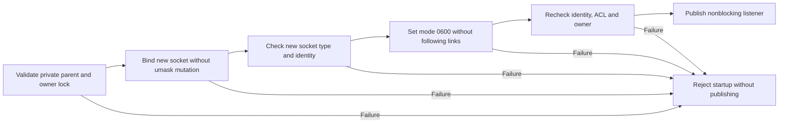
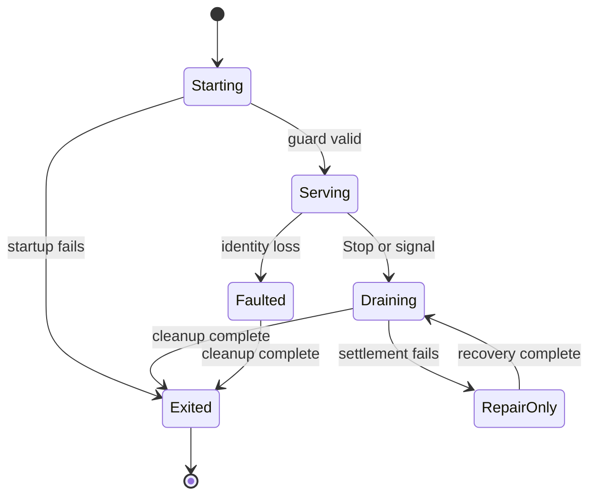
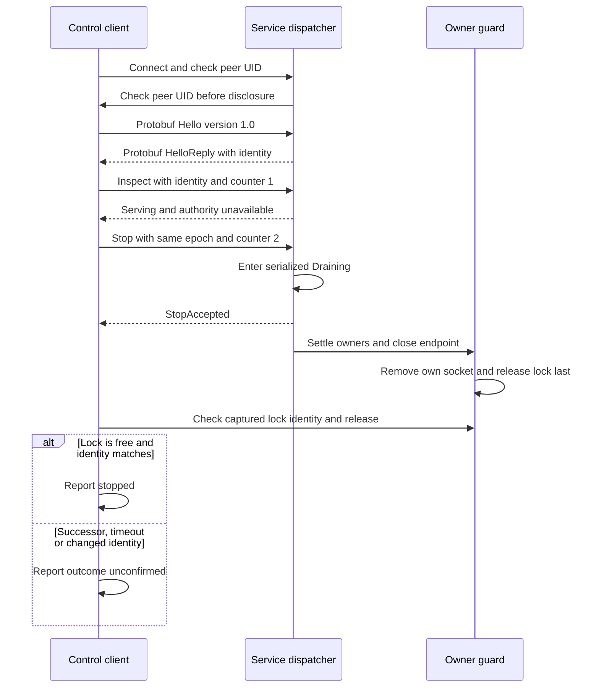

# D2 standalone per-user service boundary

Status: proposed I1 D2 design for owner review. The selected installation form
is a standalone command with a per-user service. The owner selected a Unix-domain
socket for its local control channel on 2026-09-25. The selected I1 principal is
one macOS account. The owner selected `~/.asura/run/` for runtime files on 2026-09-26.
Arbitration, fencing and same-UID behavior below remain proposals, not host proof. This slice does not
select the eventual Swift/Rust boundary, agent helper layout or GUI transport.
The [local-model boundary proposal](swift-rust-boundary.md) develops the first
of those choices without changing this service's sole authority.

The [runtime architecture](runtime-architecture.md) owns the wider execution
model. The [threat model](threat-model.md) owns adversary scope; the
[authority recovery design](persistence-recovery.md) owns committed state. The
[production bootstrap design](production-bootstrap-status.md) owns client-visible
initialization, registration and status.

Current implementation extension: the [config command contract](config-commands.md)
adds typed YAML get/set to the existing service owner using protocol 0.1. The
foundation and inspection contracts below retain their original packet scope.

## One owner and one attachment contract

The standalone `asura` command runs as a client by default. It attempts to
connect to the selected per-user Unix stream socket. If no service answers, one client
may spawn the same installed executable in service mode and all clients retry
for a bounded interval. A service process owns the orchestrator, registry,
policy checks, journal writer, bound graph adapter and command admission. A
client owns input and display only. The service cannot use a client's `HOME`,
cwd, socket path or claimed UID to choose its own installation.

The selected runtime directory is `~/.asura/run/`, containing `owner.lock` and
`control.sock`. Startup may create the validated `.asura/` and `run/` directories
before initialization. Their existence does not prove initialization. The
[conversation admission contract](conversation-admission.md#automatic-initialization-and-explicit-registration-workflow)
owns automatic initialization of verified fresh state.
The runtime directory contains no installation identity. Before the authority
module exists, inspection reports `Unavailable(authority_not_installed)`. Once
that module exists, it classifies the authority root independently. The service validates every path component and opened descriptor for
type, owner and private access; it rejects aliases, replacement and a socket
path too long for `sockaddr_un`. Initial support is limited to local account
homes and qualified filesystems. An unsupported or ambiguous layout returns a
specific unavailable/repair state without a fallback path. D1-D2 must qualify
the exact runtime-directory lifecycle on a real host; losing this runtime directory while
the service is live must not cause a second owner.

The only process allowed to bind the endpoint is the holder of an exclusive
lock on a persistent `owner.lock` inode. Startup never unlinks or recreates a
present lock file to win. The winner validates that the lock's named entry
still refers to its held inode, then may inspect and remove a stale socket and
bind a new one. The lock stays held through service lifetime. If the lock is
held but the endpoint does not answer, clients report service unavailable;
they do not break the lock using a PID or timeout. An owner losing descriptor
or path identity must stop admission and dispatch. A restarted owner replays
the journal and commits a new owner generation before admitting work. Any
worker or helper request must carry that generation and be rejected if stale.
The journal generation is a fencing record, not a substitute for OS-level
exclusive ownership; D2-D3 must qualify old-process and helper termination.

### I1 deployment view

Proposed component view. Arrows show requests, results and write ownership;
the runtime guard gates the sole orchestrator owner.

```mermaid
flowchart TB
    CLI["Standalone CLI or TUI client"] -->|Unix stream socket| API["Service control API"]
    API --> Auth["Peer UID and scoped authorization"]
    Auth --> Orch["One per-user orchestrator"]
    Orch --> Journal[("Ordinary-file authority journal")]
    Orch --> Graph[("Bound SurrealDB graph")]
    Orch --> Observe["Bounded project observer"]
    Guard["Private runtime lock and endpoint"] -->|Sole owner gate| Orch
    Orch -->|Scoped events and snapshots| API
```

## Startup and endpoint identity

`posix_spawn` with a new session is the proposed standalone launch mechanism.
The CLI must pass a fixed service-mode argument, not project-controlled
environment or arbitrary inherited descriptors. Packaging must pin the
executable path and version contract; a client connecting to an older service
negotiates protocol compatibility or fails clearly. An independently started service outlives attached terminal sessions; a
TUI-owned service follows its launching TUI lifetime. Restart, logout and update
behavior need real-process
qualification. There is no LaunchAgent or Mach service in this I1 choice.
The selected [Homebrew tap distribution](../decisions/0008-homebrew-tap-distribution.md)
installs this standalone command. A formula update does not itself replace a
live service; [release distribution](release-distribution.md) owns the proposed
upgrade and handover behavior. D2-D3 must define the stable maintenance
handshake, owner-generation-guarded drain and version negotiation before an
older live service can be replaced. The owner lock remains authoritative for
handover; a changed Homebrew symlink cannot transfer ownership.
Homebrew may remove the old keg while its service is still alive. The old
service cannot re-exec a path from that keg or dispatch through a helper or
resource that disappeared. It preserves control and recovery, and settles
affected work under the [release resource-loss contract](release-distribution.md#service-lifecycle-across-homebrew-operations).

On accepted connections the service obtains the kernel-provided effective
peer UID (`getpeereid` candidate) and requires its own UID; clients also verify
the service peer UID. A successful peer check establishes only the selected
macOS-account principal. The service checks each request's scope, revision,
policy and installation state. Same-UID processes can invoke the genuine CLI
or access same-UID files; this release does not claim malicious same-UID
resistance. Socket pathname permissions and code signing do not supply human
intent. Versioned length-bounded protocol frames, bounded queues and timeouts
are required; D3 must finish the command/event schema before implementation.

### Standalone startup sequence

Proposed sequence. Arrows show client attachment, owner arbitration and the
authority checks before the first scoped request.

```mermaid
sequenceDiagram
    participant C as CLI client
    participant R as Private runtime directory
    participant S as Service contender
    participant J as Authority journal
    C->>R: Connect to validated endpoint
    alt Service answers
        R-->>C: Connected socket
        C->>S: Protocol and peer-UID check
    else No endpoint answers
        C->>S: Spawn installed executable in service mode
        S->>R: Validate directory and lock persistent inode
        alt Wins lock and identity checks
            S->>R: Validate stale socket and bind endpoint
            C->>R: Retry for bounded interval
            alt Existing valid authority journal
                S->>J: Replay and commit owner generation
            else No authority records and runtime-only root is valid
                S->>J: Initialize through writer after fresh-state validation
            else Partial or damaged root
                S->>S: Enter RepairRequired without dispatch
            end
        else Held lock or unsafe identity
            S-->>C: Unavailable or repair state
        end
    end
    C->>S: Scoped request with stable ID
    S-->>C: Authorized result or typed rejection
```

The socket is bound only after the owner can serve explicit uninitialized,
ready, unavailable or repair states. A journal or graph failure must not be
converted into a new installation. A full shutdown stops admission, settles
or records in-flight controls under their durable contract, closes the socket
and releases the lock last. Another contender can start only after lock
release and journal replay. Crashes leave a stale socket that the next lock
winner may remove after identity validation.

## Failure and qualification contract

| ID | Trigger | Required outcome |
| --- | --- | --- |
| S1 | Two clients start with no endpoint | At most one owner binds and writes; losers attach or receive bounded unavailable. |
| S2 | Lock held, socket absent or hung | No PID-based takeover; client reports unavailable with recovery guidance. |
| S3 | Process dies after lock but before bind | Next lock winner validates the existing inode and stale endpoint before replay/bind. |
| S4 | Runtime directory, lock or socket is replaced | Reject ambiguous identity, stop admission and preserve authority files. |
| S5 | Client from another UID connects | Reject before disclosing status, paths or project names. |
| S6 | Old owner/helper survives a replacement attempt | It cannot append, dispatch or publish under a stale generation. |
| S7 | Root absent, runtime-only, partial or corrupt at startup | Authority owner exposes Uninitialized only after fresh-layout validation; otherwise RepairRequired. Stage 2 reports authority unavailable. Never silently reset. |
| S8 | Client and service protocol versions differ | Negotiate a supported version or reject without interpreting unknown frames. |
| S9 | Old keg is removed while its service still runs | Service detects missing helper/resource before dependent dispatch, settles affected work, and never spawns from a missing or changed path. |
| S10 | Handover races another accepted request | One serialized durable drain barrier accounts for every request accepted before it; no request disappears during ownership transfer. |

Unit checks cover path/identity decisions, framing, revision and admission
state. Real-process integration must cover S1-S10, multiple login sessions for
the same UID, another UID, process kill/restart, lock/socket replacement and
same-UID endpoint races on supported macOS filesystems. CLI end-to-end checks
must show bounded startup, typed recovery and intact original request results
after reconnect. TUI proof follows in I4. SDK availability alone is not
runtime evidence. D7 must assign executable cases and pin host, filesystem,
timeouts and acceptance thresholds.

This I1 slice is not implementation-ready until lock-inode retention, socket
replacement handling, runtime-directory lifecycle, owner fencing and
protocol schema are exact and qualified. D2 still owes the Swift/Rust process
allocation, helper boundaries and full deployment view before its whole stage
can be ready.

## Foundation service proposal: stages 1–2

**Selected mechanism, 2026-09-26.** The owner authorized the real manual service
checkpoint under this reviewed stages 1–2 contract. The owner's later instruction
prioritizes service implementation with ordinary Cargo builds. Swift smoke and
portable-cache qualification are deferred. This selection does not complete I1 or establish
full host qualification.
The [foundation packet](../plans/production-foundation-implementation.md) owns
paths, delivery order and test commands. This section owns the service contract.
Later persistence and status work extends these owners through the same API.

### Ownership anchor and supported filesystem

**Selected location:** the owner chose `~/.asura/run/` on 2026-09-26.
This replaces the earlier cache-location proposal. `owner.lock` and `control.sock`
stay here through the service lifetime. Runtime directory creation is permitted
before initialization. It must not create an installation identity or graph binding.

A root containing only the validated runtime directory is not evidence of an
initialized installation. The later authority owner classifies fresh, partial and
repair states. Unknown files, an invalid runtime layout or partial authority
records must not be discarded or treated as a fresh installation. Stage 2 does
not classify or modify those records; it reports authority unavailable.

The first qualified host is macOS 27 on Apple silicon with a local APFS home.
Resolve the home through `getpwuid_r(geteuid())`, not environment variables.
Reject UID 0, remote homes, unsupported filesystems and paths over 103 UTF-8 bytes.
The length limit includes the socket filename but excludes its terminating NUL.
There is no shortened-path fallback.

Open each directory component relative to a held descriptor with no symlink
following. Require system ownership for system ancestors and account ownership
for account directories. Reject group/world write permission in that chain.
Require mode 0700 on the Asura directories and 0600 on the lock and socket.
Inspect extended ACLs and reject entries that grant another principal access.
Do not chmod an existing unsafe path into compliance. Return `unsafe_runtime`.
Fresh creation uses restrictive modes; re-open and validate before use.

Socket creation must not change the process-wide umask. A temporary umask also
changes unrelated filesystem operations on other threads. Bind only beneath the
retained, validated 0700 runtime directory. Before accepting clients, inspect the
new socket without following links, require account ownership and one link, set
its mode to 0600 relative to the retained parent with no symlink following, and
recheck its identity, permissions, ACL and the owner lock. The private parent
prevents other users from reaching the socket before its final mode is set.
Never chmod a pre-existing entry; stale-entry validation and removal precede bind.
A failed bind or permission/identity check does not publish a listener.

The platform regression runs repeated socket binds concurrently with private
directory and file creation. It verifies socket mode 0600 and unchanged unrelated
creation modes. Existing replacement, unsafe-entry and authenticated peer tests
remain required. This corrects startup isolation without a global filesystem lock.

```mermaid
flowchart LR
    Parent["Validate private parent and owner lock"] --> Bind["Bind new socket without umask mutation"]
    Bind --> Check["Check new socket type and identity"]
    Check --> Mode["Set mode 0600 without following links"]
    Mode --> Validate["Recheck identity, ACL and owner"]
    Validate --> Publish["Publish nonblocking listener"]
    Parent -->|Failure| Reject["Reject startup without publishing"]
    Bind -->|Failure| Reject
    Check -->|Failure| Reject
    Mode -->|Failure| Reject
    Validate -->|Failure| Reject
```

Create the lock with exclusive creation when absent. Otherwise open the named
regular file without truncation or links. Require one hard link. Acquire
nonblocking `flock(LOCK_EX)` and retain its descriptor until shutdown settles.
Recheck device/inode identity after acquisition and before binding. Only the
winner can remove a stale socket. It must first verify socket type, owner and
parent identity. A non-socket entry causes failure without removal.

Recheck directory, lock and endpoint identities before each admitted operation
on the isolated validation worker under [event routing](event-routing.md).
Each request waits for its own validation ticket. Idle operation does not scan
filesystem identities periodically. On replacement, enter `Faulted`, stop disclosure,
close connections and exit without deleting the replacement entry. The guard
retains the old lock until process cleanup ends. This detects ordinary loss; it
does not make separate inode locks mutually exclusive after deliberate replacement.

**Selected location and lifecycle restriction.** The threat model excludes
malicious same-UID tampering. An administrator or a
same-UID process must stop the service before removing its anchor directory.
A filesystem manager that can remove it while live is unsupported. Qualification
must test that normal logout, restart and cache cleanup preserve the anchor.
Moving the anchor does not make replacement safe.
If that contract is unacceptable, select a kernel-managed ownership mechanism
before implementation. Do not claim that polling proves fencing across replacement.

### Local command and lifecycle contract

Use these explicit commands for the foundation. Bare `asura` remains reserved
for the production TUI. Until that client exists, it explains that it is unavailable.
It must not start the synthetic experiment or silently select service mode.

| Command | Selected behavior |
| --- | --- |
| `asura service start` | Attach to a compatible owner, or start one if connection reports absent/refused. Return only after authenticated Hello. |
| `asura service status --json` | Inspect without starting. Distinguish absent, incompatible, unavailable and a current service snapshot. |
| `asura service stop` | Inspect without starting. Capture the current epoch and request its drain. Never signal a PID from a file. |
| `asura service run` | Explicit foreground service mode. Use the same owner guard and event loop. |

`start` uses the current executable's resolved absolute path. It rejects a missing
or changed executable before spawning. Use `posix_spawn`, `POSIX_SPAWN_SETSID`
and `POSIX_SPAWN_CLOEXEC_DEFAULT`. Use the fixed private launch mode below. Set cwd to
`/`; clear inherited environment except fixed locale values. Resolve account
paths independently. Redirect stdin/stdout to `/dev/null`; preserve the selected
logging sink on stderr as specified below. A bounded startup
pipe carries a typed failure or readiness notice; it carries no project data.
Close all other inherited descriptors. Losing the pipe does not transfer ownership.
The caller reaps its child if it exits during startup. For explicit `service start`, the service outlives the
caller after successful startup. TUI-owned startup follows the lifetime channel
contract below. A spawn loser exits normally; the client retries
attachment. The retry deadline is five seconds with 50 ms intervals.

#### Private startup notice

The standalone-service spawned argv is the resolved executable path, `service`,
`run`, and `--internal-startup-notice`. TUI-owned startup additionally appends
`--internal-owner-lifetime` and maps a read-only lifetime pipe to fd4, under the
[selected lifetime contract](early-production-status-slice.md#backend-lifetime-ownership).
The launching TUI retains the sole writer; closure requests canonical service
drain. A TUI attached to an existing service owns no such channel. OS-started
and explicit standalone services therefore survive attached TUI exits.
These fixed internal markers are not public commands
or capabilities; they select only the private launch channels. No arbitrary descriptor,
path, command or environment value is accepted. Plain `service run` remains
foreground mode and does not interpret descriptor 3 as a notice channel.

The platform spawn owner maps the child's write end to descriptor 3 using file
actions. The parent retains only the read end. Preserve descriptor 3 explicitly
under close-on-exec-default, preserve fd4 only for owned startup, and close all
other nonstandard descriptors. Duplicate spawn sources above both reserved fds. Set
`LANG=C` and `LC_ALL=C`; inherit no other environment. For this detached mode,
redirect only stdin/stdout to `/dev/null`. Stderr inherits the selected logging
sink. This replaces the earlier detached-stderr suppression. The child validates that
descriptor 3 is a writable pipe before using it. An invalid private invocation
fails without binding or modifying the runtime directory.

One notice is exactly eight bytes: ASCII `ASST`, version byte 1, kind byte,
and an unsigned big-endian 16-bit code. There is no payload or text. The cap is
eight bytes, followed by EOF. Close the write end immediately after the notice.
The fixed cases are:

| Kind | Code | Meaning |
| --- | --- | --- |
| 1 | 0 | Listener bound under a valid owner guard; proceed to authenticated attachment |
| 2 | 0 | Another owner won; child exits normally and client retries attachment |
| 3 | 1 | Unsafe runtime; child exits with failure |
| 3 | 2 | Startup unavailable; child exits with failure |
| 3 | 3 | Internal startup failure; child exits with failure |

Reject other versions, kinds, codes, extra bytes or EOF before eight bytes.
Read partial pipe data nonblockingly within the existing five-second startup
deadline; partial progress never resets it. A malformed notice reports unavailable
without forced takeover or PID signalling. A lost notice is not successful startup.
Any already-running owner remains inspectable through the normal control path.

Kind 1 is only a launch diagnostic. `start` succeeds only after the normal peer
UID checks and valid Hello/HelloReply exchange. Neither notice bytes nor EOF can
establish service identity or readiness. The existing startup sequence remains
unchanged: spawn, then authenticated attachment. Unit and real startup integration
cases must cover partial/oversized notices, each kind, wrong version, early EOF,
invalid descriptor and a kind-1 notice followed by failed Hello. These refine FND2,
FND4 and FND10; command tests assert bounded failure and no false readiness.

#### Service logging

**Selected user requirement:** Use standard Rust `tracing` events and a
`tracing_subscriber::fmt` subscriber. The CLI owns subscriber installation and
sink selection. It filters events to Asura-owned targets. Dependency events can
include database paths or raw payloads and must not pass into the user-facing sink. Dependency
failures are reported through the owning Asura component's bounded error codes.
The service emits events through `tracing`; platform code owns
file descriptors, safe file opening and spawn actions. There is one subscriber
per process, including the internal child. No logging daemon or separate queue
is introduced. Exact dependency pins are recorded by the primary before builds.

All public service commands accept optional `--logs DIR`, including
`service status --json --logs DIR`. Accept the option once, reject a missing or
empty value and unknown/duplicate flags, and preserve the existing command set.
Resolve a relative directory against the invoking client's cwd before changing
any spawn state. Plain `service run` uses the same sink selection. The internal
startup flag accepts no log path; the child receives its sink through descriptor 2.

| Selection | Behavior |
| --- | --- |
| No `--logs` | Emit formatted events to stderr; stdout remains command results or JSON |
| `--logs DIR` | Create the directory if absent, then append events to `DIR/asura.log` |
| Log setup fails | Report stable `log_unavailable` before connect, spawn, Stop or runtime-directory mutation; exit 3, with no silent fallback |

Initialize logging after valid argument parsing and before service effects.
A log-setup failure may emit one bounded bootstrap diagnostic on stderr because
the requested sink is unavailable. For a valid JSON status request, emit its
normal unavailable object with `error_code: log_unavailable`; never print the
requested path or raw OS error. Invalid arguments retain exit code 2.

The platform opens the selected directory and final file through held descriptors.
Create missing directories with mode 0700; require the final directory to be owned
by the current user, without group/world write permission. Reject a symlink at
the selected directory or final log entry. Open `asura.log` with create/append and
no-follow semantics; require a regular file, current-user owner, one hard link
and mode 0600. Do not truncate, chmod unsafe existing entries or follow a log-file
symlink. Revalidate the opened entry before use. A setup failure may leave a newly
created empty log directory/file, but cannot perform a service operation.

The parent keeps its selected writer for CLI events. When it spawns the service,
the platform receives the borrowed writer descriptor and duplicates it onto child
stderr, or inherits the parent's stderr when no file was selected. Preserve
startup descriptor 3 and close all other nonstandard descriptors. The child installs
its standard stderr subscriber and never reopens a path or inherits extra config.
When `start` attaches to an existing owner, `--logs` changes only that invocation's
CLI sink. It does not reconfigure the existing service; emit a bounded
`service_already_running` event with `sink_unchanged=true`.

Use the standard formatter's UTC timestamp, level and stable event name, with
ANSI styling disabled. The fixed level is INFO, including WARN and ERROR; do not
read `RUST_LOG` in this slice. Event fields are bounded lifecycle metadata such as
PID, service epoch and stable error code. Emit `service_serving`, `service_draining`,
`service_stopped` and `service_error` at their actual transitions. A stopped event
follows owner cleanup; it does not replace the control client's lock check.
Never log prompts, control payloads, environment values, credentials, cwd or raw
paths. Do not add per-frame/request-body logging or unbounded formatting.

One append file is shared by invocations and their spawned services. Preserve prior
contents. There is no rotation, retention worker, global event ordering or crash
persistence claim in this slice. Use synchronous standard formatting for these
small lifecycle events. Sink backpressure can delay a write; no nonblocking logging
guarantee is claimed. After successful setup, logging is diagnostic best effort:
a later write failure does not authorize another sink, change task authority or
turn a failed service operation into success. Disable the formatter's internal
fallback diagnostics for a selected file sink; no silent stderr fallback is allowed.

A detached service retains inherited stderr when no file sink was selected.
That may keep a parent's captured pipe open after `start` exits. Tests and manual
harnesses must use a regular file or `/dev/null` for detached stderr, or drain and
manage that pipe independently. Do not wait for stderr EOF as proof that the
start command or service finished. Foreground mode follows normal terminal stderr.

These synchronous lifecycle diagnostics are a narrow exception to the reactor's
no-blocking-work rule below; they add no background worker or queue. Slow-sink
latency remains an explicit limitation of this initial logging feature.

A connection failure other than absent/refused does not authorize spawning.
A held lock never permits takeover. An incompatible live owner remains running.
There is no automatic upgrade, force-stop or timeout-based lock breaking.

The service uses one nonblocking reactor and a serialized control dispatcher.
The platform owner supplies readiness polling; codecs never perform I/O.
Connection parsing, signals and future observation completions become bounded
input events. No request handler waits on disk, Git, a model or another client.
Later modules submit completion events with their original scope and identity.

A fresh process creates a random 128-bit `service_epoch`. This is an attachment
identity, not the durable owner generation introduced by persistence. `Hello`
creates another random 128-bit attachment ID. Reconnect creates a new attachment.
An old attachment never becomes valid again. The service checks the epoch and
attachment before handling every post-Hello request.

`Stop` captures the displayed epoch. A mismatched epoch returns `stale_owner`.
A matching request enters the canonical `Draining` state and rejects later work.
Stage 2 has no durable operations, so it closes other connections and flushes
`StopAccepted` within one second. The requester then observes EOF. The owner
validates ownership, removes only its own socket entry, closes the listener and
releases the lock last. Keep the listener and lock while attempting removal.
If removal fails with ownership intact, retain them in `RepairOnly`; Inspect
remains available and a later Stop may retry. An identity replacement enters
`Faulted` and exits without deleting the replacement. This runtime cleanup order
does not add the durable-operation barrier required in stage 3.
`StopAccepted` means drain started; EOF alone does not prove successful settlement.
The client reports success only after its retained lock descriptor can acquire
the released lock and its identity still matches. It releases that check lock
immediately. A successor owner causes `outcome_unconfirmed`; it is never stopped.

Stage 3 must install the durable drain barrier before adding a mutating command.
That barrier accounts for every accepted operation before lock release. On a
settlement failure, the owner retains its lock and serves only repair/control
inspection. A stop deadline produces `outcome_unconfirmed`, not forced exit.
SIGINT, SIGTERM and SIGHUP enter the same drain path. A crash permits stale-socket
cleanup by the next lock winner; stage 2 has no state to replay.

### Service state transitions

Selected service state view. Arrows name triggers. Installation state belongs
to the later persistence owner and is independent of these process states.

```mermaid
stateDiagram-v2
    [*] --> Starting
    Starting --> Serving: guard valid
    Starting --> Exited: startup fails
    Serving --> Draining: Stop or signal
    Serving --> Faulted: identity loss
    Draining --> RepairOnly: settlement fails
    Draining --> Exited: cleanup complete
    Faulted --> Exited: cleanup complete
    RepairOnly --> Draining: recovery complete
    Exited --> [*]
```

### Framing, messages and authentication

**Selected wire technology, 2026-09-26:** the owner chose Protobuf for local
control and the Rust–Swift model channel. Their schemas and semantic owners stay
separate. Local control uses `contracts/control/v1/control.proto`, package
`asura.control.v1`. The following framing and schema are selected for stages 1–2.
They do not inherit model inference, credit, chunking or cancellation semantics.

`asura-control/build.rs` uses pinned `prost-build` and an explicit `ASURA_PROTOC`
absolute path to protoc 36.2. For the developer trial, the operator verifies the
existing pinned archive and supplies its executable. The build script requires
a regular executable and checks its version against the shared tool lock.
It generates Rust bindings and a descriptor set into `OUT_DIR`. The schema,
tool lock, executable and generator configuration are regeneration inputs.
Missing tools fail the build. There is no checked-in binding, second downloader,
ambient compiler fallback or local-control Swift binding. Standard Cargo owns
the developer build; custom driver integration and portable-cache qualification
remain deferred work in the foundation packet.

The frame header is exactly 12 bytes: ASCII `ASUR`, unsigned big-endian 16-bit
major, unsigned big-endian 16-bit minor, and unsigned big-endian 32-bit body length.
Initially accept version 1.0 only. The first frame proposes 1.0; a successful
HelloReply accepts it. For another version, the authenticated server sends its
own supported version in a header with body length zero, then closes. This is
the sole zero-length form; it is valid only as a server negotiation rejection.
The client reports incompatible protocol without interpreting a body. EOF without
that rejection is unavailable, not proof of a version mismatch. There is no
downgrade retry. Ordinary frame length must be 1–65,536 bytes. Allocate only after checking it. Each body contains
exactly one `Envelope` message. The outer length supplies the message boundary;
there is no additional Protobuf delimited-length prefix.

### Proposed local control schema

The schema uses `proto3`. Optional scalars retain presence for semantic checks.
All enum zero values are `UNSPECIFIED` and invalid where a value is required.
Field numbers below are selected immutable v1 assignments. Deleted numbers must
be reserved. There are no maps, `Any`, opaque command bytes or recursive messages.

| Message | Fields: number, name and Protobuf type |
| --- | --- |
| `Envelope` | 1 `service_epoch`: optional bytes; 2 `attachment_id`: optional bytes; 3 `request_counter`: optional uint64; oneof `body` fields listed below. |
| Envelope body | 10 `hello`: Hello; 11 `hello_reply`: HelloReply; 12 `inspect`: Inspect; 13 `inspect_reply`: InspectReply; 14 `stop`: Stop; 15 `stop_accepted`: StopAccepted; 16 `error`: Error. |
| `Hello` | 1 `client_build`: optional string. |
| `HelloReply` | 1 `service_build`: optional string; 2 `capabilities`: repeated Capability, packed; 3 `max_frame_bytes`: optional uint32. |
| `Inspect` | Empty message. Identity comes from Envelope. |
| `InspectReply` | 1 `lifecycle`: optional Lifecycle; 2 `installation`: optional InstallationState; 3 `unavailable_reason`: optional UnavailableReason. |
| `Stop` | 1 `expected_epoch`: optional bytes. Must equal Envelope epoch. |
| `StopAccepted` | Empty message. It acknowledges drain admission only. |
| `Error` | 1 `code`: optional ErrorCode; 2 `message`: optional string. |

`Capability` values are 0 Unspecified, 1 Inspect and 2 Stop. `Lifecycle` values
are 0 Unspecified, 1 Starting, 2 Serving, 3 Draining, 4 Faulted and 5 RepairOnly.
`InstallationState` is 0 Unspecified or 1 Unavailable in foundation v1.0.
`UnavailableReason` is 0 Unspecified or 1 AuthorityNotInstalled.
`ErrorCode` values are 0 Unspecified, 1 UnsupportedOperation, 2 InvalidSequence,
3 StaleOwner, 4 Draining, 5 Timeout, 6 InvalidRequest and 7 InternalUnavailable.
Unknown numeric values are rejected. Do not map them to Unspecified or success.

Hello carries no envelope identity or counter. HelloReply requires both 16-byte
IDs and no counter. Every later message requires both IDs and a nonzero counter.
Replies echo the request identity and counter. IDs must not be all zero. Build
strings are nonempty ASCII printable text, at most 128 bytes. Error messages
use the same character rule and a 256-byte cap; they never echo a request or path.
HelloReply advertises exactly the supported capabilities, with no duplicates,
at most 16 entries. Its frame limit must equal 65,536. Foundation InspectReply
requires Unavailable with AuthorityNotInstalled. The service never reports a
ready installation before its later owner exists.

### Strict wire and semantic validation

`asura-control` owns a bounded wire validator before generated decoding. Its
field/type/oneof metadata comes from the generated descriptor set, not a second
handwritten schema. At build time, reject descriptor recursion and unsupported
map, group or extension forms. Generate only immutable validation tables; no
runtime descriptor loading or schema download is permitted.

Before `prost` decoding, reject unknown field numbers, wrong wire types, field
number zero, truncated or overflowing varints, overflowing lengths and nesting
above 16. Reject repeated encodings of a singular field and multiple oneof
members, including repeated encodings of the same member. The capabilities
field may appear once as a packed segment or as unpacked repeated scalar values,
never both; count decoded values against its limit before allocation. A message
must contain exactly one recognized body. A raw concatenation that creates two
bodies therefore fails. Bytes inside a valid bytes field are not another frame.
The scan must consume the whole declared frame and perform checked arithmetic.

Generated decoding then checks strings and scalar representation. Semantic
validation checks presence, lengths, enum membership, message direction and
attachment state. Only the validated domain message reaches the dispatcher.
Malformed wire closes the connection without dispatch. A structurally valid
message with invalid semantics receives bounded InvalidRequest if an authenticated
attachment and matching counter exist; otherwise close. Generated decoding
success alone cannot establish identity, permission or valid message state.

This strict profile intentionally narrows normal Protobuf merge/unknown-field
behavior. The [Protobuf encoding specification](https://protobuf.dev/programming-guides/encoding/)
describes merge behavior; the extra checks prevent ambiguous control requests.
The [prost-build configuration API](https://docs.rs/prost-build/0.14.3/prost_build/struct.Config.html)
provides explicit compiler selection and descriptor-set output. Documentation
availability is not proof that the proposed validator or build works.

Stage 3 extends the same schema and dispatcher with durable request identities
and status scope fields under a reviewed protocol revision, proposed 1.1.
Its implementation must define version/capability compatibility before serving
those messages. These identities are not foundation request counters. The same
control owner serializes authorization changes with queued-response removal and
final disclosure. No status module may add a second transport or output queue.
JSON output from `asura service status --json` is a CLI presentation format only.
It is not sent over the local control socket.

#### CLI JSON and build labels

`service status --json` emits exactly one JSON object and a trailing LF on stdout.
Use these fixed fields; unavailable values are JSON null, not invented defaults:

| Field | Value |
| --- | --- |
| `schema_version` | Integer 1 |
| `service` | `absent`, `current`, `incompatible` or `unavailable` |
| `service_epoch` | Lowercase 32-digit hex epoch for a current authenticated snapshot; otherwise null |
| `service_build` | Validated HelloReply build label for that current snapshot; otherwise null |
| `lifecycle` | `starting`, `serving`, `draining`, `faulted` or `repair_only` for a current snapshot; otherwise null |
| `installation` | `unavailable` for a current foundation snapshot; otherwise null |
| `unavailable_reason` | `authority_not_installed` for that snapshot; otherwise null |
| `error_code` | Null for a current or absent result; `incompatible_protocol`, `unsafe_runtime`, `log_unavailable` or `service_unavailable` for the corresponding failure |

Malformed arguments retain the packet's exit code 2 and stderr diagnostic; they
are not a status result. Valid status requests use the packet's existing exit
codes: absent/current 0, unavailable 3, incompatible 4, unsafe runtime 5.
`unsafe_runtime` uses `service: unavailable`. A failed Inspect cannot reuse an
older successful snapshot. JSON contains no attachment IDs, raw paths, request
bodies, OS error strings or environment. Stderr uses bounded stable diagnostics.
No field order is significant. JSON remains a CLI presentation schema, not a
second control protocol.

The binary constructs one build label, `asura/` followed by its compile-time
`CARGO_PKG_VERSION` from `asura-cli`. It supplies that same label to the client
Hello and in-process service HelloReply. Libraries do not substitute their own
package versions. No runtime Git, filesystem, environment or network query supplies
the label. Validate it with the existing nonempty printable-ASCII 128-byte rule.
It is a diagnostic version label, not an authenticated executable hash or epoch.

FND1 covers label validation. FND10 and CLI end-to-end cases cover each JSON
outcome, null fields, exact exit code, absent-without-starting behavior and the
failure to reuse an old snapshot. These definitions add no service capability.

Both endpoints call `getpeereid` before exchanging data and require their own
non-root effective UID. The account is the principal. This authenticates neither
an individual human nor a particular signed client. Before reading data, the
client also validates the runtime path and retains a validated lock descriptor.
No status, executable path or version is disclosed to another UID.

| Message | Fields and result |
| --- | --- |
| `Hello` | Client build string, capped at 128 bytes. Reply carries service build, epoch, new attachment, supported capabilities and frame limit. |
| `Inspect` | Epoch, attachment and request counter. Reply echoes all three and contains lifecycle plus installation status. |
| `Stop` | Same identity fields and expected epoch. Reply is `StopAccepted` or a typed error. |
| `Error` | Matching identity when available, stable code and bounded safe message. No paths or request body are echoed. |

Post-Hello counters start at 1 and increase strictly on each attachment. One
request may be outstanding per attachment. A duplicate or out-of-order counter
closes the connection with `invalid_sequence`; it never executes again.
Malformed frames close the connection. A well-formed unsupported operation returns
`unsupported_operation`. No opaque method, shell command or arbitrary extension
payload is admitted. Dropped Stop replies are reconciled by inspection and the
captured lock; clients never replay Stop against a new epoch.

Foundation inspection reports installation `Unavailable(authority_not_installed)`.
It does not inspect `.asura/` or infer Uninitialized. Stage 3 supplies
`Uninitialized`, `Recovering`, `ControlReady`, `GraphReady`, `GraphUnavailable`
and `RepairRequired` through the same projection owner. Agent/model capabilities
are absent. Health of the local channel is not installation readiness.

| Resource | Selected bound and exhaustion result |
| --- | --- |
| Connections | 32; close excess accepts before allocating body buffers. |
| Buffered data | One 64 KiB input and one 64 KiB output body per connection; no unbounded queue. |
| Requests | One in flight per connection; 32 total. Reject extra pipelined requests. |
| Per-reactor turn | At most 32 frames total and one frame per ready connection; then process signals and timers. |
| Hello/frame progress | Two-second absolute deadline from accept/first byte; partial progress does not reset it. |
| Idle attachment | Close after 60 seconds without a request; clients reconnect explicitly. |
| Ordinary control result | Two seconds; emit typed timeout or close if output cannot drain. |
| Startup/stop client wait | Five seconds each; report unavailable or outcome_unconfirmed on expiry. |
| Telemetry | Counters for connections, rejection code and latency; no payload, cwd or project path. |

### Attachment and shutdown sequence

Selected sequence. Arrows carry messages or ownership checks. The lock remains
held through settlement; the client never converts an acknowledgement into proof.

```mermaid
sequenceDiagram
    participant C as Control client
    participant S as Service dispatcher
    participant G as Owner guard
    C->>S: Connect and check peer UID
    S->>C: Check peer UID before disclosure
    C->>S: Protobuf Hello version 1.0
    S-->>C: Protobuf HelloReply with identity
    C->>S: Inspect with identity and counter 1
    S-->>C: Serving and authority unavailable
    C->>S: Stop with same epoch and counter 2
    S->>S: Enter serialized Draining
    S-->>C: StopAccepted
    S->>G: Settle owners and close endpoint
    G->>G: Remove own socket and release lock last
    C->>G: Check captured lock identity and release
    alt Lock is free and identity matches
        C->>C: Report stopped
    else Successor, timeout or changed identity
        C->>C: Report outcome unconfirmed
    end
```

### SDK evidence and remaining proof

Read-only inspection on 2026-09-26 found `getpeereid` in the installed macOS SDK's
`unistd.h`. `sys/spawn.h` declares `POSIX_SPAWN_SETSID` and
`POSIX_SPAWN_CLOEXEC_DEFAULT`. `sys/un.h` defines 104 bytes for `sun_path`.
`sys/fcntl.h` supplies no-follow, close-on-exec and exclusive-lock constants.
The SDK also declares `arc4random_buf`. These are API availability observations.
They do not prove launch, lock, ACL or lifecycle behavior on a real host.

The first implementation must isolate FFI in the platform module. Its safety
review must state pointer lifetimes, descriptor ownership and error conversion.
All other crates forbid unsafe code. Installed API availability does not waive
that review. The foundation packet maps each proposed behavior to required tests.
