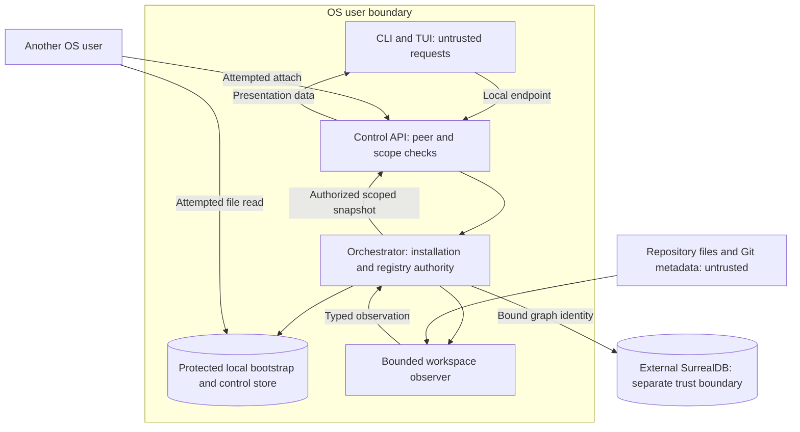
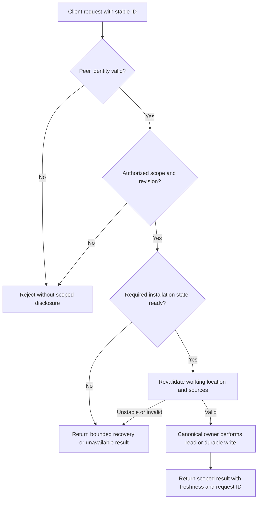

# D1 threat model for local bootstrap and project status

Status: proposed D1 threat model for the I1-I4 production path. It identifies
assets, boundaries and required defenses, but does not prove macOS confinement
or select all mechanisms. It must be reviewed with
[platform capabilities](platform-capabilities.md),
[service configuration](user-service-configuration.md) and the
[security policy brief](security-policy-brief.md) before implementation.

## Scope, assets and actors

The scope is one backend for one OS user on one macOS device, its `.asura` root,
registered working locations, local clients and the optional external graph.
Remote AI and remote Asura hosts require later threat models. Git status is a
read-only observation; it does not grant host-tool or source-write authority.

| Asset | Required protection |
| --- | --- |
| Installation identity and graph binding | Prevent silent replacement, rollback or fallback to another graph. |
| Registry, task controls and policy revisions | Preserve one authoritative owner, scope and recovery history. |
| Working-location identity and source files | Reject aliases or replacement that redirect a request; registration grants no access. |
| Project names, paths, status, conversations and model usage | Return only to a currently authorized caller for the requested scope. |
| Credentials and private prompts | Keep secrets in the selected credential facility; do not place plaintext secrets in bootstrap or status. |
| Service availability | Bound control latency even when Git, a model or an external graph is slow or unavailable. |

The OS account is the initial local principal boundary. Another UID must not
attach to this user's service or read its managed state. A same-UID process can
usually access that user's files and can present the same UID to a local endpoint.
UID checking therefore cannot make arbitrary same-UID software trustworthy.
D1-D3 selected same-UID processes as one principal for I1. The service still
authorizes every request against scope and current policy.

**Selected I1 trust choice:** treat processes under the service UID as one local
principal. The I1 backend must not claim to resist a malicious process already
running under that UID. It must still reject other UIDs, stale scopes and
unauthorized effects. I1 must not obtain remote-provider credentials or expose
effectful host tools merely because this narrower boundary was chosen. Before
later credential-bearing capabilities, D1-D5 must review whether user presence,
OS credential controls or stronger isolation is required. A client code-signing
check alone does not prove human intent: a same-UID attacker can invoke a valid
signed CLI as a deputy, and may tamper same-UID-writable local state.

Repository files, Git metadata, configuration documents, terminal input,
database responses and model output are untrusted data. They cannot assert a
caller identity, graph binding, project permission or instruction priority.
The local administrator and a compromised same-UID process are separate threat
cases; D1 must state which effects are preventable, detectable or outside the
first-release boundary. No file mode alone prevents administrator access or
same-UID tampering.

### Trust-boundary view

Proposed D1 view. Arrows are data/control flows; the API checks identity and
authority again even when a transport authenticated the peer.

The diagram shows an external graph for the boundary case; embedded mode keeps
engine files under the local root. Both modes use the same binding checks. The
observer may run in a helper after D2/D4 selects its process boundary.

## Threats and required outcomes

| ID | Threat trigger | Required outcome and owner |
| --- | --- | --- |
| TB1 | Client supplies a different `HOME`, cwd or state path | Service resolves its own account home and existing binding; API does not adopt client paths as installation authority. |
| TB2 | Another process pre-creates or replaces `.asura`, endpoint or bootstrap | Service detects unsafe owner/type/identity or ambiguous state and enters recovery; D2-D3 fence an obsolete owner. |
| TB3 | External graph settings disappear, server fails or database is recreated | Orchestrator retains binding and denies graph-dependent work; storage adapter never creates an embedded fallback. |
| TB4 | Caller names another context or observes a stale subscription | API rechecks caller, scope and revision; no unauthorized names, paths, counts or usage escape. |
| TB5 | Directory changes before, during or after registration commit, then moves or has alias overlap | Registry binds the pinned object identity, rechecks before and after commit and before later use; a committed mismatch becomes stale. Requests reject or require explicit selection, never silently redirect. |
| TB6 | Git metadata is malformed, huge or slow | Observer bounds input, time and output; status becomes unknown without blocking typing or control. |
| TB7 | Database, file or client acknowledgement is lost during commit | Owner resolves the original operation identity; it does not infer failure or create a second registration. |
| TB8 | Old backup restores stale policy, binding or graph references | Restore validation gates work until identity, generation, current authority and references are reconciled. |
| TB9 | Entire `.asura` root is absent at launch after prior loss | Service cannot infer first-ever use; it requires explicit initialization and warns about possible prior data loss. Known conflicting state enters recovery. |
| TB10 | A same-UID process calls the control API or launches the signed CLI | I1 treats it as the local principal but applies current scope and policy; no claim of same-UID adversary resistance. Credential-bearing later work needs a separate authority decision. |

The [installation binding contract](context-storage-candidates.md#selected-installation-binding-and-change-contract)
owns TB3 and cross-store recovery. The
[project identity model](domain-model.md#resolving-aliases-and-overlap) owns TB5.
The [production bootstrap design](production-bootstrap-status.md#validation-contract)
maps these threats to user-facing acceptance. This document does not replace
those canonical contracts.

### Request admission across boundaries

Required decision order. An authenticated peer can still submit an invalid or
unauthorized scope. A status snapshot is published only after its current scope
and data availability are checked; registration additionally needs graph-ready
installation state under the current bootstrap proposal.

## Evidence needed for D1 readiness

Create adversarial fixtures for TB1-TB10. Unit checks cover decisions and typed
rejections. Real-process integration must cover competing owners, peer identity,
filesystem replacement and external graph failures. CLI/TUI end-to-end checks
must show repair guidance and absence of cross-context disclosure. Repeat with
another OS user and both graph modes. A test using only mocks cannot establish
filesystem, peer-authentication or database isolation. D7 assigns each fault and
race its own executable test ID and pins supported environments.

The same-UID principal boundary was selected by the owner on 2026-09-25. D1 must
still select supported home layouts and mount types, code-identity requirements,
and the protection promised against rollback. Open D2-D3 work covers local
transport qualification, owner fencing, authority-file protocol and restore
authorization. Until those are
selected and validated, this threat model is a review input rather than a ready
implementation contract.
