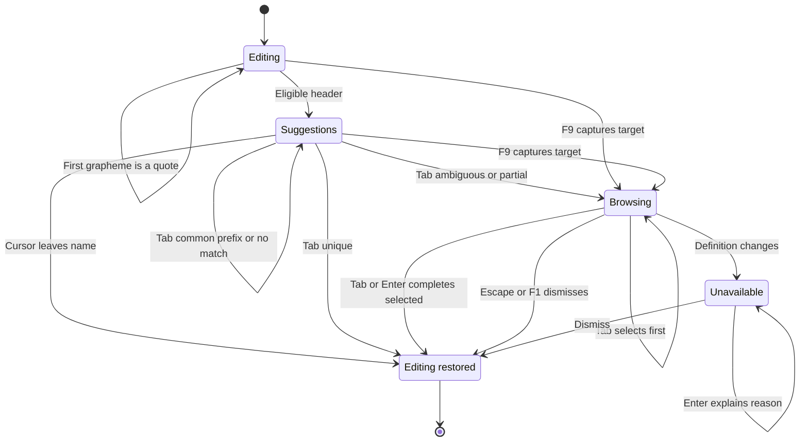
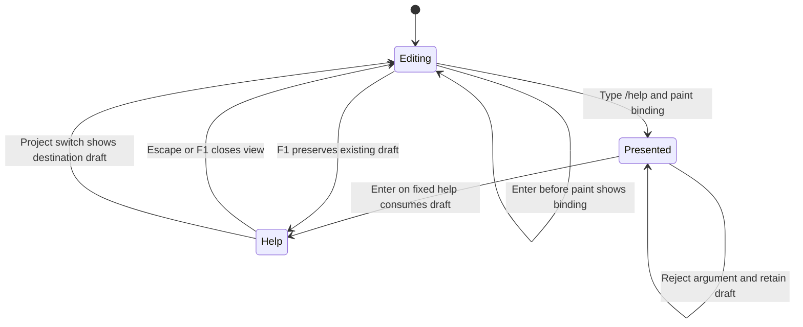
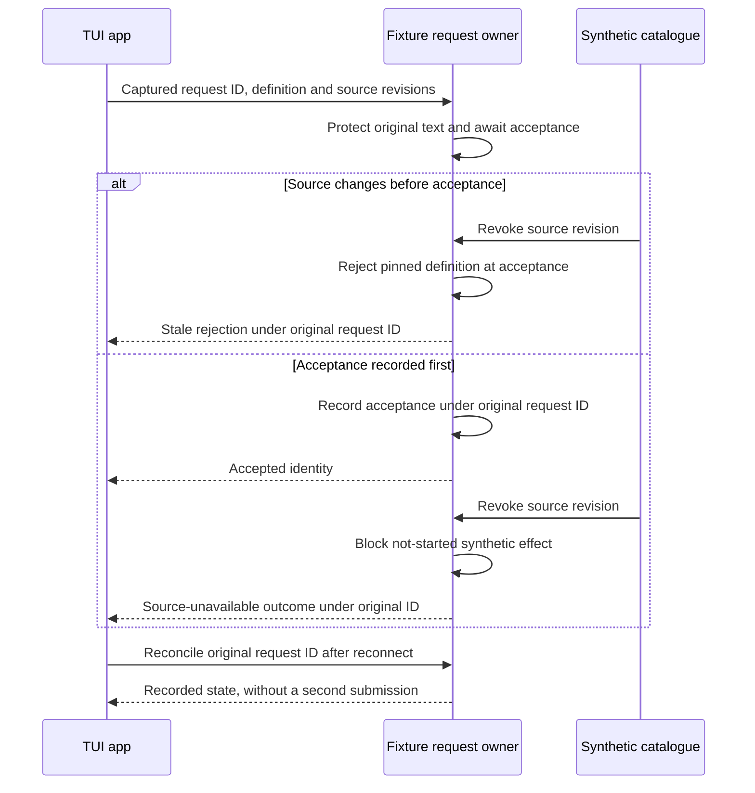

# TUI command discovery and invocation

Status: **selected and validated for the isolated TUI command trial** on 2026-09-24. After
reviewing the [trial packet](../plans/command-interaction-trial.md), the owner
said “go for it”. This selects the experiment syntax, controls, fixtures and
limits below. The [production command design](command-system.md) remains proposed;
no production service implementation is authorized.

The owner subsequently replaced the extension command prefix with `/ext:`.
This amendment changes only the displayed and typed qualified name. The existing
discovery, binding, admission and recovery diagrams still govern its behavior.
CT8 in the trial packet requires both the new path and rejection of the old path.

The owner then authorized one isolated first-party extension trial. It adds an
inert Asura-supplied work definition to the existing synthetic catalogue. It
does not authorize a production contribution API or change the built-in boundary.
The owner subsequently selected the reserved `core` source handle for that
definition in place of `asura`; `asura` remains reserved and unused by the trial.
The owner then selected `/help` as the second built-in and authorized its
addition to this isolated trial. It uses the existing F1 controls view.

The [interaction brief](interaction-and-extension-boundaries.md#in-chat-commands)
owns category and authority requirements. The selected [composer](tui-composer.md)
owns existing input, status bar and message tray behavior. The
[command-system design](command-system.md) owns service identity, catalogue
resolution and invocation semantics. The
[architecture](../architecture.md), [design plan](../plans/architecture-and-design.md)
and [implementation gate](../plans/implementation.md#entry-gate) continue to apply.

## Fixed constraints

- Identify category, source and destination. A friendly name grants no authority.
- Typing, browsing and completion must not execute commands, load skill instructions,
  query a workspace, start a server or call a model.
- Preserve drafts, selection and undo. Updates must not steal focus or replace the
  identity beneath a focused action.
- Capture submission scope. Navigation cannot retarget an invocation.
- Unknown, ambiguous, stale or denied commands cannot fall back to plain chat,
  another source or a different operation.
- Service operations use canonical admission, lifecycle, budgets and enforcement.
  Client-local actions remain within the requesting client.
- Extensions do not require Agent Plugins. An MCP capability becomes a command
  only through an explicit, supported contribution definition.

## Selected trial discovery workflow

A `/` at the start of a draft introduces a command header. While the cursor edits
its name, a passive suggestion list appears. The editor keeps focus. F9 opens the
focused browser, including from an empty draft. F1 documents F9. When a command
header is active, a short command cue may appear in the optional row above the
editor. No command hint or action menu appears in the status bar.

The browser groups **Built-ins**, **Extensions** and **Skills**. Each result shows
its qualified name, purpose, source and availability. Details expose the target
and whether it changes a view, controls work or requests new work. Colour is
supplementary; labels and selection markers carry the meaning.

The first selected built-in is `/quit`, with `/exit` as an alias for the same
client-session action. Its result is not a service request. Completion preserves
the name the user matched, so `/ex` completes to `/exit` and `/qu` to `/quit`.
The browser shows one command with both names. Enter on either complete name
requests the existing Ctrl+Q exit flow. The command draft itself is not treated
as unsaved text for that confirmation; other drafts, pending or held text still
require an explicit choice with no default. Cancelling retains the command draft
and focus. Confirming consumes that captured command and exits. No service task or
other client is stopped. Non-whitespace arguments are rejected without exiting.

`/help` is a separate client-view built-in with no alias. Tab completes `/he` to
`/help`; browsing and completion only edit the command name. Enter on a current,
presented `/help` opens the same controls view as F1 from the editor. The client
accepts trailing whitespace and rejects non-whitespace arguments with the draft
and undo history intact. On success it consumes only the `/help` draft, then
opens the view. Escape or F1 closes the view and returns to an empty editor.
Other project drafts, pending requests and active work remain untouched. Help is
available during work, disconnection and F10 source revocation. It never offers
Steer/Queue, changes service state or sends a fixture request.

Enter on a deliberately selected result completes the name and returns editor
focus. It never also invokes, sends or chooses Steer/Queue. The next explicit
submission follows the command's operation class below.

### Contextual Tab completion

**Selected interaction decision:** When the editor cursor is in an eligible
first-token slash header with no selection, Tab is a command-completion action.
In ordinary text, arguments, later lines and selected text, Tab keeps the
composer’s two-space insertion behavior. Tab never invokes or submits a command.
The browser may also complete a deliberately selected result with Tab or Enter.

For a complete, current catalogue namespace, one available match lets Tab replace
only the name span in one undo transaction. If several matches share a longer
prefix, Tab extends only to that common prefix without binding a definition.
If several matches have no further common prefix, Tab opens the focused browser
without choosing one. With an incomplete catalogue, Tab cannot infer uniqueness
or absence; it opens the browser and labels the result set incomplete. A stale or
unavailable match cannot auto-complete. Zero matches leave the draft unchanged
and explain whether the catalogue is complete or unavailable. No path falls back
to ordinary indentation while a slash header is eligible.

In the browser, arrows select a result. Tab with no selection selects the first
visible result but does not complete it. Tab or Enter with a selected, available
result completes the captured name span and restores editor focus. An unavailable
or changed selection stays visible with its reason. Selection and completion are
separate actions; neither submits the resulting command. The selected definition,
source revision, project, draft revision and name span are checked again before
the edit. A failed check preserves the draft and undo history.

### Names, namespaces and collisions

**Selected trial forms.** These examples illustrate the experiment grammar;
`/quit`, `/exit` and `/help` are selected production built-in names.

| Form | Meaning | Example |
| --- | --- | --- |
| `/name` or `/builtin:name` | Asura built-in | `/quit` |
| `/ext:source/name` | Explicit extension definition | `/ext:checks/test` |
| `/skill:source/name` | Explicit skill source and name | `/skill:project/review` |

Names and source handles use lowercase ASCII letters, digits and hyphens, beginning
with a letter. Friendly Unicode labels remain display data. Only built-ins receive
unqualified aliases; they cannot be overridden. Searching `/review` may find skills
or extensions, but completion inserts their qualified names before invocation.
The owner selected `/ext:` as the canonical extension prefix on 2026-09-24.
`/extension:` is not an alias: it remains an unknown command and keeps its draft
instead of invoking a definition or falling through to chat. Source and definition
identities remain stable across this display-name change.

The [production catalogue contract](command-system.md#catalogue-and-binding-contract)
owns source identities, collisions, revision changes and service resolution.
Completion never treats a friendly name as authority.

### Asura-supplied extension trial

**Selected trial behavior:** `/ext:core/check` is an inert Asura-supplied work
definition. Its stable source and definition IDs are `extension:core` and
`extension:core/check`. It appears in the Extension category, with an explicit
Asura origin label and source identity. `/ext:checks/test` remains an
integration-supplied synthetic definition. Both use the same catalogue,
resolution, mode validation, protected request, tray and recovery path. Neither
gets an executor or authority from its origin label. `/quit` and `/help` remain
fixed client-local built-ins, outside the fixture catalogue.

The source handles `asura`, `core` and `internal` are reserved for Asura-supplied
extensions under the [command contract](command-system.md#catalogue-and-binding-contract).
The trial uses only `core`; `asura` and `internal` have no fixture definitions.
The fixed fixture source variants cannot assign these handles to an integration.
This demonstrates static separation only: the trial has no external registration
API and cannot prove production registration enforcement.
The earlier `/ext:asura/check` trial name is not an alias. Enter on that name
reports an unknown command and retains the draft; it cannot fall through to chat
or bind `/ext:core/check`. This isolated fixture has no persisted catalogue to
migrate between trial builds.

The first-party fixture supports NewTurn, Steer and Queue like the existing
extension. Its body is optional text and is captured without transformation.
It reads no project content and has no real effect. F10 revokes or restores all
synthetic service sources in the selected project. A targeted update of
`extension:core` changes only that source; the integration source and other
project remain available. Replacing or revoking it before acceptance rejects the
original request and retains its text. After acceptance, revocation holds a
not-started queued effect under the original request ID. Restoration at a newer
revision never revives the old capture.

The fixture uses one bounded, in-memory extension contribution constructor for
Asura-supplied and integration-supplied definitions. Its fixed source variants
provide the qualified name and source identity, assign Extension and WorkRequest,
and cannot name the reserved `/quit` or `/exit` commands. Origin comes from the registered fixture
source, not from an invocation. The client routes a session exit only for the
fixed `builtin:quit` identity; all contributed definitions go to fixture
admission, which rejects a non-work operation claim. No dynamic loader or
production API is implied.

The [contribution ownership view](command-system.md#contribution-and-invocation-ownership-view)
defines the shared path. The existing [synthetic acceptance race view](#synthetic-acceptance-race-view)
applies equally to the Asura-supplied and integration-supplied source. No new
process, service, transport or command operation class is selected by this trial.

### Multiline editing and literal input

**Selected literal-input rule:** The command scanner activates only when `/` is
the draft's first grapheme. A quote character of any form before a path therefore
keeps the scanner inactive. The scanner does not need to recognize or enumerate
quote characters: any first grapheme other than `/` takes the ordinary-chat path.
For example, `'/tmp/file`, `"/tmp/file"`, `“/tmp/file”` and `` `/tmp/file` `` are
ordinary chat. A closing quote is optional. The draft is sent exactly as typed,
including the quote; Asura does not dequote, expand or interpret the path. Removing
the leading quote re-evaluates the current draft, so a newly leading `/` can
activate command discovery. Leading spaces, code blocks and slashes on later
lines remain ordinary chat.

**Selected trial command syntax:** A command requires `/` as the draft's first grapheme.
One draft contains at most one invocation; newlines cannot chain commands.

The first space or newline ends the name. The remaining text is the argument body,
preserving hard lines. Initial definitions accept either no arguments or one text
body. There is no shell expansion, interpolation, pipeline or command substitution.
The TUI captures that body unchanged. The canonical operation owner validates it
after admission. Richer production argument schemas remain D3/D6 work.

There is no `//` escape or payload transformation. A draft beginning `//tmp/file`
enters command scanning and fails as an unknown or invalid command; it does not
send `/tmp/file` as chat. A bare `/tmp/file` likewise produces an unknown-command
explanation, never silent fallback. A leading quote before that path is the
explicit literal route. The message tray shows the exact submitted text; rejection
and recovery retain the same raw draft and undo history. Ctrl+S/T retain their
existing direct-message behavior and send the unchanged draft as text.

Passive suggestions require editor focus, an empty selection and a cursor inside
the first name token. Cursor movement into arguments dismisses them. Soft wrapping
must not change eligibility. Paste does not open or focus suggestions; F9 after
paste permits explicit discovery. Reuse the editor adapter's grapheme/byte mapping.

F9 captures project, draft revision, name span and selection. Completion replaces
only the eligible name span in one undo transaction, preserving arguments and
following lines. An empty draft receives the name plus one space. With ordinary
text or a nonempty selection, browsing is read-only and explains the insertion
requirement. A stale revision/span rejects the edit atomically; no best-effort
replacement or whole-draft replacement is permitted.

### Focus and keys

**Selected trial addition:** F9 needs qualification in both native terminals. Existing
composer bindings are preserved; no terminal configuration change is assumed.
The owner subsequently requested Return-based submission controls. Ctrl+S/T below
remain the tested interim routes for this experiment; any later replacement
requires a design change and native key qualification.

| Focus | Input | Result |
| --- | --- | --- |
| Editor, ordinary text or command arguments | Arrows, Tab, Option+Return | Existing movement, two-space insertion and newline |
| Editor, eligible slash header | Tab | Complete a unique available name, extend a common prefix, or open browser without selecting |
| Editor | F9 | Capture insertion target; open browser without a selected result |
| Editor or command browser | F10 | Trial-only: revoke current project's synthetic extension and Skill sources; next press restores new revisions |
| Browser | Arrows; Tab with no selection | Deliberately select a definition identity; first Tab selects but does not complete |
| Browser | Tab or Enter with selection | Complete selected available result only; never invoke |
| Browser | Escape or F1 | Dismiss; restore captured editor cursor and selection |
| Browser | PageUp/PageDown | Scroll bounded results or an explicitly opened detail view |
| Browser | Ctrl+S/T/B, Option+Return | Consume without submitting or editing the hidden draft |

Existing global project switching, exit and stop retain their contracts. Project
switching dismisses the browser without transferring completion to another draft.
A global F10 source change leaves the current draft and focused browser in place;
its selected definition becomes unavailable rather than silently rebinding.
A changed or removed selected definition leaves an unavailable placeholder; Enter
explains the reason and cannot fall through. Name edits, undo/redo and source
changes invalidate resolution. Argument edits invalidate the captured payload.

### Discovery state view

**Selected trial state view.** Arrows show one discovery interaction's local input and catalogue
events. Tab can enter the browser for ambiguity or incompleteness. Enter without
a selected, available result stays in the browser. Return
to editing ends this view; no transition performs service work.

## Submission and active work

**Selected trial behavior.** The renderer presents a resolved binding: definition revision,
intended target and draft revision. Submission requires that binding to remain
valid. This extends the composer's presented-target rule without inferring a fresh
execution target when the key arrives.

If Enter arrives before presentation, consume it and show the locally resolved
details; another explicit submission is required. An unknown, incomplete, ambiguous
or unavailable command retains its draft and explains the reason. An incomplete
catalogue reports unavailability; it cannot prove a name does not exist.

| Operation class | Initial categories | Enter after valid presentation |
| --- | --- | --- |
| Client view | Built-in | Apply deterministic navigation or presentation |
| Client session | Built-in | Reuse the existing exit and protected-input confirmation flow |
| Service control | Built-in | Reuse that control's target, confirmation and admission contract |
| Work request | All three | Idle: request new work. Active: existing Steer/Queue choice without a default |

An active task does not turn `/quit`, `/exit` or `/help` into a Steer/Queue message.
The client-session operation class routes Enter to the captured exit action.
Completion alone never opens the exit confirmation.

The service validates operation class; contributions cannot self-declare a control
route. A definition declares supported submission modes. An unsupported mode stays
visible with its reason and cannot become a different action. The trial Skill
fixture permits Queue only during active work. Skill-based steering remains unavailable
until D4 defines task instruction activation and invalidation. Commands cannot
silently start parallel work or stop the current task.

Ctrl+S/T preserve literal draft submission, without slash interpretation. For a
command-looking draft, a contextual cue above the editor says
`Enter command · ^S/^T send text` when space permits. F1 retains the distinction
when the cue is absent.
This distinction needs an owner trial; it must not become an undocumented shortcut
exception. Focused browsers continue to consume these keys.

A submission choice captures definition revision, arguments, scope, observed target
revision and draft revision together. Expiry disables the captured choice. A new
source, successor task or selected project cannot inherit it. Reopening is explicit.

A successful local command consumes only its captured draft revision. A project
navigation command consumes the origin command before restoring the destination
draft. Delayed service acceptance cannot clear newer text. Rejections preserve undo;
service requests reuse existing protected input, message tray and recovery owners.

### Client help view

**Selected trial state view.** Arrows name user actions and the fixed-identity
guard. F1 enters the same controls view from ordinary editing; `/help` also
consumes its command draft after a valid presented binding. No arrow performs
service work.

### Synthetic command acceptance and source races

**Selected trial contract.** The existing fixture request owner stores one
immutable command capture with its request identity: source and definition IDs,
source and definition revisions, catalogue revision, argument text, selected mode,
project/conversation target, observed task revision and draft revision. This is
synthetic identity data, not a production wire schema. `app.rs` captures it once;
`model.rs` validates it at fixture acceptance and never resolves a name again.
The command request uses the existing protected-input capacity, tray identity and
acceptance/recovery path. The trial must not create a second scheduler or queue.
F10 changes both synthetic service sources in the selected project only. The
first press revokes their current revisions; the next restores new revisions.
It never changes local `/quit`, `/help` or the other project's catalogue. F10 is a fixture
control for testing races, not a production command or refresh contract.

If the source changes or is revoked after Enter but before fixture acceptance,
the fixture rejects the original request, retains its protected text and reports
the stale source. It cannot reinterpret the request as chat or a replacement
definition. If acceptance is recorded first, later revocation does not erase it
or clear text. The fixture blocks any not-yet-started synthetic successor effect
and reports a source-unavailable outcome under the original request identity.
If a synthetic effect was already recorded, recovery reports that evidence rather
than claiming revocation rolled it back. Reconnect reconciles the original ID;
it does not submit a second request. Both event orders are required tests.

### Synthetic acceptance race view

**Selected trial sequence.** Arrows are in-memory fixture calls and observations,
not production service traffic. The request identity and pinned revisions survive
both event orderings. This view maps to CT5B, CT5C and CT6.

## Client ownership and service boundary

**Selected trial responsibilities:** The existing Rust editor adapter owns command
header spans and atomic completion. `app.rs` owns browser focus, captured draft
revisions, project navigation and client-local command actions. `ui.rs` owns
bounded suggestions, browser rendering and contextual cues. The existing fixture
model may simulate source changes and acceptance for a trial; it does not become
a production catalogue or executor.

The [production command design](command-system.md#owners-and-operation-classes)
owns service definitions, authorization, admission and recovery. The client
presents delivered metadata and a captured target. It cannot convert a visible
name into execution authority. Only fixed client-local built-ins execute locally;
service entries use the shared control API. A version mismatch disables affected
service entries while local help remains available.

### Unavailable entries and client recovery

**Selected trial behavior.** Typing filters delivered metadata only. Opening discovery never
starts integration servers or loads Skill instructions. An explicit catalogue
refresh is separate from draft submission and cannot change focus or the draft.

Disconnection marks service entries stale and disables invocation. The client
redacts protected service metadata on disconnect or project-scope change; a generic
unavailable placeholder may remain for the focused selection. Local view commands
continue to work. This conservative trial behavior does not assume that an
unobserved offline revocation can be detected. Production cache policy remains
D3/D4 work under the [catalogue contract](command-system.md#catalogue-and-binding-contract).

A source update changes the delivered revision atomically. A captured selection
never rebinds to a replacement. Enter on an unavailable selection explains the
reason and retains the browser; it cannot fall through to chat or another command.
An incomplete or failed refresh cannot prove that a name is absent. A service
rejection preserves the original draft and undo history. An uncertain outcome
keeps the captured request protected and reconciles by its original identity.
Delayed results attach to the originating project without moving focus or
clearing newer text. The production durability and replay contract is owned by
[command-system.md](command-system.md#resolution-admission-and-outcomes).

## Layout and selected trial resource bounds

Passive suggestions sit above the message tray when space permits. Preserve the
tray, optional cue, status bar, one editor row and three transcript rows. The
contextual command cue shares the existing optional cue/exceptional-notice
allocation; it never adds a permanent row or displaces a higher-priority decision,
recovery or unread-output cue. Remove suggestions first when space is insufficient;
keep the F9 route. The focused browser reuses bounded overlay geometry with sticky
actions and scrollable details.

At 30 columns, retain category text and expose the source on a detail row. Truncate
excerpts at grapheme/cell boundaries; inspection provides full names and reasons.
Selection uses text and markers. Sort exact names, then prefixes, then purpose words;
category and qualified name break ties. No inference or usage ranking is proposed.
No mouse capture, clipboard access or new animation is added. Native screen-reader
compatibility needs separate evidence; buffer readability cannot establish it.

These are **selected experiment limits**, not production decisions. Reject oversized
updates/edits atomically; never truncate executable names, identities or arguments.

| Resource | Proposed limit |
| --- | --- |
| Catalogue and metadata | 128 definitions, 2 KiB each; 512 KiB total including retained snapshots/details |
| Names | 32 ASCII bytes per command segment, 64 per source handle, 128 qualified |
| Visible suggestions | At most 6 normal or 3 compact rows; existing minimum geometry takes precedence |
| Focused browser | 128 bounded results; render only the visible window |
| Draft/body | Existing 65,536-byte limit including header and arguments |
| Pending invocation | Existing protected-request capacity; one immutable definition/draft capture per slot |
| Filtering | One bounded local pass per relevant edit; no full-draft parsing on spinner paints |

Extend the existing p95 under-50-ms combined input/fixture/paint workload with the
full catalogue, Unicode drafts and invalidation. Production pagination, refresh
limits and cache lifetimes remain D3/D4/D7 decisions. Partial results must declare
incompleteness and cannot establish absence or uniqueness.

## Acceptance and proof plan

These future cases refine [IX4](interaction-and-extension-boundaries.md#ix4-in-chat-command-categories-and-admission).
Each race needs both event orderings with separate test IDs in its implementation
packet. Synthetic evidence qualifies interaction only. The
[production cases](command-system.md#validation-and-unresolved-decisions) require
actual client/API/orchestrator/store, contribution, context and host owners.

| Case | Initial state and trigger | Required result |
| --- | --- | --- |
| CD1: Discovery | Two projects, all categories, collisions and unavailable entries; type, paste, browse, complete and replace a source | Correct identity/source/category; no discovery effects; no override, silent substitution or false absence |
| CD2: Editing | Multiline Unicode draft, wrapped header, selection and undo; complete, undo, resize, switch and invalidate focus | One atomic name edit; retained drafts/selection; stale span rejection and unavailable placeholder without Enter fallthrough |
| CD3: Routing | Idle/running/decision states with all operation classes; race submission against completion, source change and navigation | Canonical owner, supported explicit mode, literal direct shortcuts, captured target; no successor retargeting or newer-draft clearing |
| CD4: Recovery | Pending/admitted work plus a newer draft; lose acknowledgement, restart, revoke, deny scripts or cancel | Original identity, truthful uncertainty, no duplicate effect or grant expansion; cancellation intent distinguished from outcome |
| CD5: Limits | Full catalogue/draft/protected capacity and background work; filter, update, overflow and resize | Bounded responsive controls, intact protected text and inspectable names/reasons |

| Case | Unit | Integration | End-to-end and environment |
| --- | --- | --- | --- |
| CD1 | Grammar, quote-prefix literal input, collisions and stable ranking | Actual editor with synthetic catalogue projection | PTY discovers all three synthetic categories without plugin installation; typing and quoted paths cause no fixture dispatch |
| CD2 | Span/revision guards and focus transitions | Actual editor cursor/undo and both palettes at 120x40, 80x24, 40x12, 30x8 | PTY completion/cancellation; native F9, multiline editing and compact readability in both terminals |
| CD3 | Presented binding, operation class and modes | Existing fixture acceptance path with duplicate delivery and both race orderings | PTY local views and synthetic queued work across project switches; unavailable skill steering preserves input |
| CD4 | Failure classification and identity guards | In-memory fixture replay and synthetic revocation only | PTY original request and newer draft retention; no durability, Skill loading or host-enforcement claim |
| CD5 | Byte/row limits, sanitization and atomic rejection | Extended measured workload and renderer artifact inspection | PTY overflow/resize/cleanup; native comprehension and accessibility checks separately |

## Selected trial decisions and boundaries

The owner selected these five choices for the offline experiment on 2026-09-24.
They do not select production command mechanisms.

1. Slash headers and qualified extension/skill names are selected for the trial.
   Leading quotes deactivate command scanning; `//` is not an escape.
2. Passive suggestions and F9 focus, preserving editor arrows. Contextual Tab
   completion uses the ambiguity and incomplete-catalogue rules above.
3. Enter invokes commands while Ctrl+S/T send literal text.
4. During active work, the synthetic extension permits Steer or Queue; the
   synthetic Skill permits Queue only. Unsupported Steer stays visible but inert.
5. `/quit` and `/exit` share one client-session identity. The extension and Skill
   fixtures and the limits above are selected for this experiment. `/help` and
   `/projects` remain outside this packet.

Qualified names prevent collisions but are verbose; discovery must carry that cost.
Literal Ctrl+S/T could surprise someone expecting to steer or queue an invocation.
The trial must evaluate both tradeoffs before selecting these mechanisms.

D3/D4 separately own catalogue identities, contribution sources, production arguments,
skill activation lifetime, fencing and durability. D2 owns process/Swift boundaries;
D7 owns production limits and accessibility. These remain dependencies, not inferred
selections. The existing design-process readiness diagram governs delivery.

Implement `/quit` and `/exit` as one client-session action first.
`/ext:checks/test` and `/skill:project/review` are inert synthetic service
entries. The latter two can produce only fixture acceptance, rejection and
uncertainty events. Discover, complete and undo without executing; explicitly
queue a fixture request, invalidate focused metadata and recover uncertain
acceptance. Test quoted literal paths and unknown leading-slash text with multiline
drafts. Verify every quote form takes the ordinary-chat path without a special
parser branch or payload change.
This inventory is selected experiment data, not a production built-in registry.
Runtime I/O remains terminal-only. No real integration, Skill loading, agent
execution or command service is in scope. The production implementation
assignment remains unchanged.

## Documentation evidence

On 2026-09-24, Mermaid CLI 11.16.0 rendered both trial diagrams locally; both
were visually inspected. The earlier four-diagram proposal was superseded by the
[production command-system diagrams](command-system.md). Local links, anchors
and whitespace were checked. Generated previews stayed in temporary storage.
The isolated TUI implementation passed Rust unit/integration tests and the PTY
process suite recorded in the [trial packet](../plans/command-interaction-trial.md).
Computer-use access to Ghostty and Terminal.app was denied. The owner then
reported that the short F9/F10, Tab-completion and compact-browser check passed
in both terminals on 2026-09-24. This is owner-observed native evidence, separate
from the automated checks; individual palette and size combinations were not
recorded. The later `/ext:` amendment passed Rust and PTY checks for completion,
submission and rejection of `/extension:` without chat fallback. The earlier
native result establishes key delivery but does not separately inspect the new
display spelling.
These checks do not prove production admission, real Skill activation or agent
execution.
