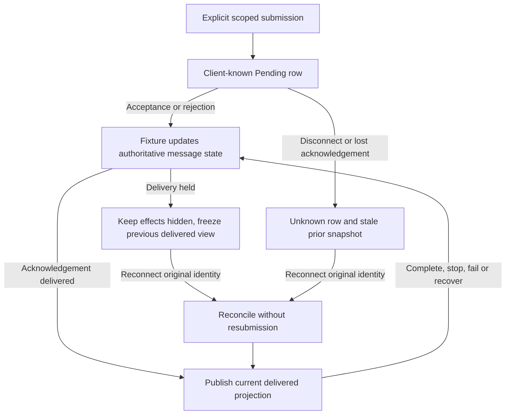
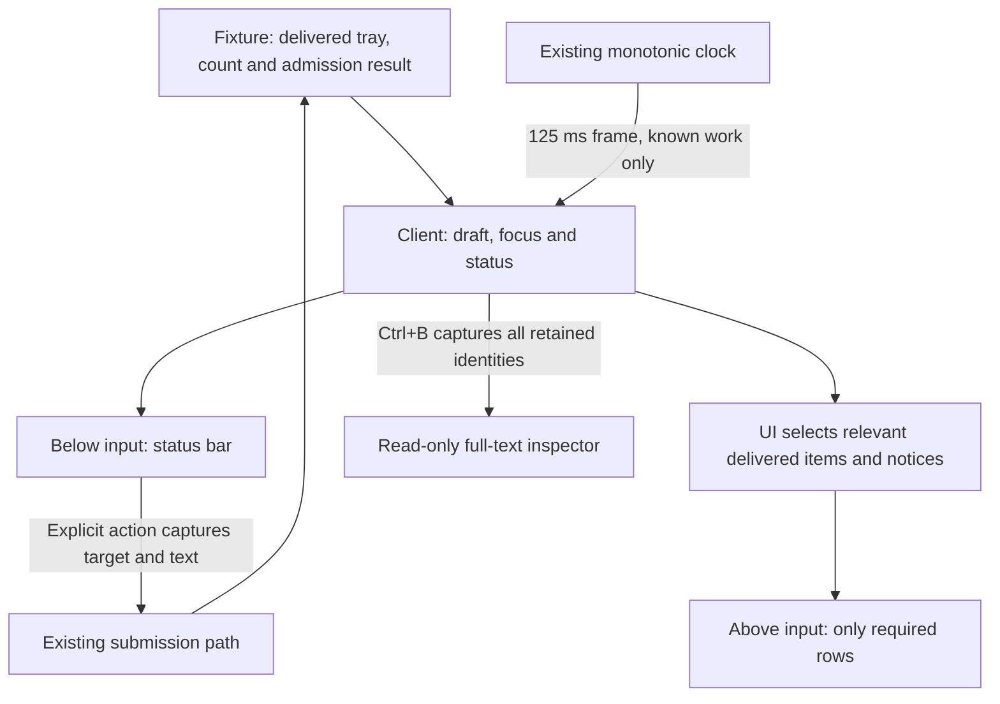

# TUI status bar and message tray

Status: implemented in the isolated prototype; automated qualification and the
owner-reported native shortcut smoke passed. Authorized by the owner on 2026-09-24
after the blue palette and native guided trial. This implements TP6/TP7 from the
[interaction design](tui-interaction-prototype.md#tp6-contextual-lower-status-during-drafting).
The [build packet](../plans/tui-prototype-implementation.md) still governs dependencies,
limits and terminal ownership. Command discovery and production storage remain
later work. Design and implementation review are recorded below.

CP6 is implemented and automatically qualified. Its separate follow-up evidence
below does not imply new native-terminal acceptance.

The subsequently selected [project status amendment](tui-project-status.md)
replaces the ordinary footer and permanent destination row described here. Its
field ownership, compact layout and exceptional-notice rules govern that change;
the remaining message and input contracts below continue to apply.

## User contract

The **status bar** is the single row below the input. The **message tray** is the
bounded submitted-message region above it. Together with the editor and existing
destination/notice areas, these form the **composer**.

During known active work, show activity and the delivered queue count. When a
nonempty draft is eligible for submission, show Steer and Queue with their direct
shortcuts. For example, at ordinary width:

```text
Working | · 3 queued · Next: Steer ^S / Queue ^T · Enter choose
```

Use a compact equivalent at 30–59 columns, retaining both action names and keys.
For an empty draft, show activity/count and invite composition. Idle input offers
Enter to send. Pending acceptance, disconnected/unknown state, exhausted protected
capacity, paste capture and focused overlays show the applicable reason or focus
controls instead of advertising an available send. Queue count is unavailable,
never an invented zero, when delivered state is unavailable. A pending decision
uses `Waiting`; known running work uses `Working`. Status is never inferred from
model prose or the last transcript line.

Use a four-frame ASCII spinner `| / - \\` only for connected, delivered running
work without a pending decision. Derive its frame from the existing monotonic
clock at 125 ms intervals; redraw only when the frame or application state changes.
Manual fixture mode may animate without advancing fixture work. The static word
and count remain meaningful independently of animation. No new thread, timer,
external I/O or dependency is introduced.

### Selected input routes

| Key | Effect with editor focus |
| --- | --- |
| Enter | Existing idle submission or active-work Steer/Queue choice, with no default |
| Ctrl+S | Explicit Steer of the current active task using the current draft |
| Ctrl+T | Explicit Queue of the current draft for the active task's successor |
| Ctrl+B | Inspect this project's message tray |
| Option+Return (Alt+Enter) | Newline; a distinct Shift+Enter remains an unadvertised compatibility alias |

The currently implemented editor inserts two spaces on Tab. The owner later
selected a contextual Tab completion action for an eligible slash-command header.
That [command interaction](tui-command-discovery.md#contextual-tab-completion)
is proposed for a future trial and is not implemented by this composer build.
Outside that future header context, Tab retains two-space insertion.

The owner selected Option+Return as the advertised newline binding after
[physical-key observations](tui-key-inspection.md#native-observations-and-decoder-investigation-on-2026-09-24)
confirmed `Enter` with `ALT` in both terminals. Remove the Ctrl+J editing binding;
it neither edits nor submits. Enter and modified-Enter handling still requires
press events. `app.rs` remains the event-routing owner; `editor.rs` owns the edit.
Update help, CLI instructions, fixture guidance and the tour to Option+Return.
No decoder, terminal mode or preference changes are needed.

Bracketed paste still preserves newlines. Explicit plain-text capture still accepts
LF bytes decoded as Ctrl+J because their origin cannot be distinguished from
pasted line endings. This is capture data handling, not a normal editing shortcut.
Unit checks cover Option+Return insertion, ignored Ctrl+J and no submission.
The tour exercises the same decoded Option+Return event. PTY checks send Alt+Enter,
verify multiline text and confirm an ordinary LF does not edit or submit. Existing
capture and bracketed-paste checks must continue to pass. Recorded native evidence
applies to the unchanged Option+Return route; no new physical-key claim is made.

The direct actions require press events, usable geometry, a nonempty draft, an
active task and canonical fixture admission. They cannot start a new turn if the
task ends. Capture target, revision and text once, then use the existing submit
path; rejection retains editor text/history. Paste and typing do not activate
commands. Overlay and paste-capture focus consumes these keys without submitting.
Repeat/release events cannot activate them. Existing global fixture controls,
project switching and exit keep their documented behavior.

Direct actions bind to the last known active target presented by the renderer,
including its task and connection revisions. The renderer records that target
through one client presentation hook, including when the draft is empty. Admission
and nonempty text are checked on activation, so typing and a shortcut may share
one input batch. If the target is absent or no longer valid, reject
the shortcut with a reason and retain the draft. A task finishing between paint
and key handling must not redirect the draft to a queued successor. Clear the
captured presentation on project switch/reset; blocked/focused rendering clears it.
Synthetic setup must render a checkpoint before a direct shortcut, through the
same renderer using a bounded TestBackend buffer. This uses no external I/O.

The installed rat-text 3.1.0 mappings leave Ctrl+S/T/B unused by this editor.
Raw terminal mode owns control-byte delivery; PTY checks must qualify these routes.
Physical delivery in both native terminals remains a separate short trial.
Command+Return and Option+Return are not selected for submission: the recorded Ghostty profile
reserves Command+Return and Option+Return is the selected newline shortcut.
The owner subsequently preferred Return-based submission shortcuts and requested
checking Control+Return and Command+Return. The [key-inspection packet](tui-key-inspection.md)
gathers that evidence; the current Ctrl+S/T bindings remain tested interim routes.

## Canonical message ownership

`model.rs` remains the sole lifecycle owner. Add a bounded typed presentation view,
not another executable queue. Do not parse transcript strings or `last_event` to
reconstruct message state. `app.rs` owns captured inspection focus and status
presentation. `ui.rs` owns geometry and rendering. Existing editor, viewport and
terminal owners keep their responsibilities.

The model exposes these Rust contracts; routine internal names may differ:

| Contract | Required contents |
| --- | --- |
| `MessageState` | Pending, Unknown, Acknowledged, Queued, Running, Held, Completed, Stopped, Failed |
| `MessageView` | Request ID, immutable captured target, original action, shared immutable full text, state, optional execution task, reason and stale flag |
| `MessageTray` | Bounded message items and a history-trimmed indicator |
| `Fixture::message_tray()` | Current delivered view with client-known pending identity overlaid once |
| `Fixture::can_submit(Action)` | Result from the same target/capacity/connection checks used by submission; no mutation |

Publish the exact public names and types to the client implementer before dependent
code. Submission continues to accept the existing draft text type. Presentation
snapshots share their immutable text with each other; existing lifecycle payloads
may retain their current representation. Both are owned by the same model.

Track all submitted request identities, including the initial turn. A new turn is
Running once acknowledged; Steer is Acknowledged; Queue is Queued until the fixture
starts its successor. Keep the captured prerequisite target unchanged and record
the successor's execution task separately. Completion, stop, failure and recovery
update the same identity. Rejection and queued work held after interruption use
Held with a reason. Explicit recovery/discard removes the held tray item. Acknowledged
Steer means receipt, not proof an agent followed the instruction.
Task completion, stop and failure update only the turn identity linked through
its execution task. An acknowledged Steer remains Acknowledged.

Retain all eight protected request IDs, the one running turn, and eight recent
acknowledged/settled items per project. Prune only the oldest settled items; never
pending, queued or held text. Each authoritative/delivered projection has at most
17 items and 17 × 65,536 bytes of logical text. The client-known pending overlay
may occupy one additional view row during a held snapshot (maximum 18). Shared
snapshots and the existing lifecycle payloads together must stay below a conservative
4 MiB of retained message text per fixture; no unbounded event or history log is added.
Set a persistent history-trimmed indicator when settled entries expire; reset clears
it. Transcript eviction does not remove retained tray text. Every retained item
provides full text; historical expiry is distinct from visually clipped excerpts.

### Delivery and uncertainty

Selected state flow for one request. Arrows are fixture transitions or observed
delivery, not client scheduling. A held snapshot retains previously observed text
while hiding all later authoritative effects.



Freeze the delivered projection before acceptance effects or disconnection first
hold delivery. While blocked, show prior rows as stale and overlay the immutable
pending request as Pending or Unknown. Do not reveal hidden acceptance, task start,
recovery or queue count. Reconciliation publishes current state, so acceptance
followed by completion before delivery cannot regress a successor to Queued.
Duplicate, foreign and obsolete-generation acknowledgements cannot add items.
Recovery/discard is unavailable while delivery is blocked or the same identity
still awaits acknowledgement. The fixture rejects these calls without removing
text, even if authoritative state already holds a recoverable copy.

## Layout and inspection

The owner requested less information above the editor on 2026-09-24. In an idle
conversation without an exceptional notice, show only the project/conversation
destination line. Do not allocate empty notice or tray rows. Generic Ready/help
text and ordinary working progress duplicate the status bar and are omitted.
The owner's minimal-UI rule assigns each fact one presentation location: the
destination identifies the project/conversation and unread output; the status bar
owns activity and input actions; the tray owns relevant submitted text. Do not
repeat Idle, Working or unavailable-state labels in the destination. Notices must
add information or a necessary action, not restate the status bar. For example,
pending acceptance adds only `F5 accepts` in manual mode and no notice in timed
mode; disconnection adds `F2 reconnects`; paste capture adds its byte count or
error, while the status bar owns its review shortcut. These fixture actions are
prototype controls, not additional product chrome.

`ui.rs` selects inline messages from the complete delivered `MessageTray`:
Pending, Unknown, Queued and Held remain visible. An acknowledged Steer remains
visible only for the currently delivered running task. Match its captured scope
and task ID against a Running entry's scope and `execution_task.id` in the same
unfiltered tray. Ignore task revision for this presentation association; steering
changes it. Never consult authoritative task state or admission validity here.
Frozen running/steering associations remain stale during blocked delivery, until
reconciliation updates the delivered projection. Running messages and settled
Completed/Stopped/Failed history stay available in inspection without inline rows.

Keep meaningful notices: explicit app feedback, paste size/error, manual acceptance
and reconnect actions, recovery, decisions and armed fixture rejection. Preserve
reading-position and transcript-truncation disclosures. The viewport exposes
whether it is reading or has an earlier-output scroll pending, so geometry can
reserve the notice before layout. Nonempty explicit feedback is meaningful without
parsing its text. Hiding a notice removes its row and gives that row to transcript.
Reading position owns the `Ctrl+E` route; the destination's unread cue does not
repeat that shortcut. A combined attention notice names the single Ctrl+O route
once rather than appending the same route for each item.
Reading, recovery and decision notices must fit their complete action shortcut
inside the 28-cell content width at 30x8. Use concise forms such as
`Reading earlier · Ctrl+E`, `1 held · Ctrl+O recover` and
`Decision · Ctrl+O reviews`; verify the actual minimum-size buffer.
Truncation uses a complete `Earlier output trimmed.` disclosure. An evicted
reading anchor uses `Reading trimmed · Ctrl+E`, with the same existing move to
earliest retained output; keep the disclosure and return action visible together.
Armed fixture rejection composes with the notice's typed action using a bounded
form such as `Reject next · Ctrl+E latest` or `Reject next · Ctrl+O recover`.
With trimming and no action, use `Reject next · Output trimmed`. Do not prepend
a long warning that hides the notice's action at minimum width.
Timed pending does not suppress independent recovery, decision, reading or
truncation information. When a collapsed tray or overflow heading already shows
the Messages shortcut, `ui.rs` asks the canonical app status formatter to omit
that shortcut from the status bar. The formatter accepts this presentation flag;
the UI must not rewrite rendered status strings to remove duplicate controls.

Place relevant tray items between any notice and the upper input tint strip.
Allocate up to four rows in full layouts and two in compact layouts. Omit the
heading when all relevant messages fit. When some are hidden, reserve the first
row for the hidden count and Messages shortcut; use remaining rows for excerpts.
If only one row is available for several items, collapse into the destination
summary instead. Geometry and painting consume the same filtered items/counts.
Preserve at least three transcript rows and
one editor row; retain up to six/three editor rows when space permits. At minimum
geometry, collapse the tray to a count and Ctrl+B route in existing surrounding
information if no dedicated row fits. Do not reduce the current 30x8 minimum.
In that collapsed layout, preserve the project, unread-output cue, count and
inspection route first. Expired settled history is disclosed in the first detail
row of Ctrl+B's message list; it must not bring settled rows back into the composer.

The overflow heading includes `Ctrl+B`/`^B` inspection and the count of hidden
relevant items. Order Pending/Unknown first, Held next, Queued in FIFO order, then
acknowledged Steer newest first. The complete inspector retains its existing order.
This keeps recent steering visible beside two queued excerpts
at ordinary width. Larger groups use the hidden count and inspection route; the
bounded tray does not promise every category an excerpt at once. Excerpts carry
action and observed state. Use `Queued` alone when it already conveys both the
Queue action and state, avoiding `Queue · Queued`. Use grapheme/cell-aware
truncation with an ellipsis, flattening hard lines only in excerpts. Full text
preserves its hard lines.
Build excerpts with bounded work; spinner paints must not scan or copy every
retained 64 KiB message. Preserve the existing one-cell inset and blue palette.

Ctrl+B opens a scoped list with captured request identities and no default choice.
Tab/arrows select; Enter opens read-only full text. A single item may open directly.
An inspection captures at most one additional 64 KiB immutable text snapshot. It
retains focus and text if that item settles or expires; show its current delivered
state or an expired placeholder. Enter in full-text inspection never submits or
recovers. Escape/F1 dismiss; existing PageUp/Down scroll. Recovery continues through
Ctrl+O's explicit Restore/Append/Discard path. Switching projects dismisses inspection
and restores that project's editor/viewport without moving message identities.

### Presentation dependency flow

Selected view. Arrows show read-only derivation and explicit requests; no view
owns admission or can reveal the hidden authoritative projection.



## Tour and validation

The tour must expose the actual status bar. Add one tour instruction row above the
ordinary UI, rendering the latter into the remaining rectangle through one shared
`ui::draw_in_area` function. Preserve the canonical project header and status bar;
ordinary `ui::draw` still uses the whole terminal. The tour's usable minimum becomes
30x9 to accommodate the extra row. Its locked overlay hint remains explicit.
All geometry and cursor coordinates must honor the rectangle's origin.

Add two checked scenes to the existing eight: active work with acknowledged Steer,
multiple queued messages and a newer draft; then full-text tray inspection while
state changes. Use the normal input routes, retaining the existing per-scene event
bound. Update tour count, help, export and PTY expectations. Existing scene assertions
remain required. Tour snapshots freeze the spinner; native physical shortcut checks
use ordinary manual mode. No new golden-image approval replaces behavioral assertions.

| Case | Required result | Unit | Integration | PTY / native |
| --- | --- | --- | --- | --- |
| CP1 | Typing changes valid hints, not lifecycle; empty/blocked/focused states truthful | Admission/status and 125 ms redraw rules | Actual editor cursor/selection/undo and palettes at 120x40, 80x24, 40x12, 30x8 | Real binary typing, direct keys, paste, idle/ended/focused rejection; native shortcut smoke |
| CP2 | Each submitted identity appears once with correct delivered state | Both acceptance/completion orders, rejection, cancellation/failure, lost Steer/Queue acknowledgement, duplicate/foreign/stale IDs | Fixture to tray and background project isolation | Queue/Steer, newer draft and reconnect visibly retain correct text |
| CP3 | Protected text survives retention and full text stays reachable | Protected capacity, 8-item settled pruning, snapshot and byte bounds | Transcript eviction, long Unicode/multiline excerpts, pinned inspection and expiry | Compact tray/inspector scroll and explicit recovery; inspect actual blue layout in both terminals |
| CP4 | Tour preserves ordinary status bar and all input remains locked | Updated tour navigation and preparation bounds | Ten scenes at all trial sizes/palettes plus translated geometry | Traverse added scenes, inspect/revisit, resize and cleanup |
| CP5 | Preserve responsiveness and terminal ownership | Existing cleanup/input tests | Existing 1,000-batch workload, extended with tray entries | Full existing PTY fault/signal suite; native feel remains owner judgement |
| CP6 | Idle composer has only destination above input; meaningful work/attention stays visible | Relevant-item selection including frozen running identity and Steer revision changes; conditional notice and overflow geometry | Empty/settled idle, active Steer/Queue, completion, unknown/reconnect, recovery, reading/trimming, minimum and translated layouts | Actual executable idle/settled row removal and Messages access; regenerate both-theme previews |

Run packet format, Clippy, unit/integration, build, PTY and explicit performance
checks. Export all ten scenes at three sizes and two palettes; inspect generated
images and changed Mermaid diagrams locally. PTY proof does not establish new
physical key compatibility; report that boundary without repeating unrelated
manual journeys. Runtime I/O remains terminal-only synthetic work.

## Dependency-aware assignments

1. Primary owns this design, glossary/index updates and integration. Obtain an
   independent read-only design review before implementation.
2. Model implementer owns only `src/model.rs` and its unit tests. Publish its typed
   view/admission API; implement and test delivery/retention before integration.
3. Client implementer owns only `src/app.rs`, `src/ui.rs` and
   `tests/composer_tray.rs`, including their unit tests. Reuse the agreed model API.
4. Primary owns `src/tour.rs`, existing integration tests, preview/PTY tests, README,
   final visual/behavioral verification and evidence. Keep editor/terminal owners
   unchanged unless a concrete defect requires a reviewed design amendment.
5. Read-only implementation review checks ownership, races, visibility, bounds and
   proof claims; primary resolves findings and records results before handoff.

### Design review

For CP6, the client delegate owns only `src/ui.rs` and its unit tests. The primary
owns the viewport reading accessor, app status formatter's Messages visibility
flag, external tests, documentation and integration.
This overrides the original broader client assignment for this amendment only.
Independent readiness review found no behavioral blocker in the delivered-state
filtering, conditional rows, overflow policy or reading-position reservation.

Independent review on 2026-09-24 found a possible direct-key retargeting race and
ambiguous completion wording for Steer. The selected rules above bind shortcuts
to the presented target and keep Steer as receipt-only. Review found no further
implementation blocker. Mermaid CLI 11.16.0 rendered both diagrams; both were
visually inspected. This is design evidence, not runtime verification.
Renderer review then prioritised acknowledged Steer before the running turn in
tray excerpts. Independent review accepted this presentation-only amendment;
retention order, queue execution and captured list identities remain unchanged.

## Recorded verification on 2026-09-24

The model and client delegates implemented their assigned files; the primary
integrated the tour, process tests, documentation and preview checks. No dependency,
editor/terminal backend, global configuration or production component changed.

| Check | Observed result |
| --- | --- |
| Format, lint and build | `cargo fmt --all -- --check`, `cargo clippy --locked --all-targets -- -D warnings` and `cargo build --locked` passed. |
| Rust suite | 108 unit and 30 integration tests passed. The timing measurement and preview export were run separately. |
| Process suite | All 28 named cases in `tests/terminal_e2e.py` passed against the real binary. New cases cover control-byte shortcuts, rejected actions, newer drafts, tray inspection, unknown Queue reconciliation and compact full-text scrolling. Fault/signal cleanup remains qualified. |
| Responsiveness | The extended 1,000-batch, 120x40 debug workload passed on Apple M4 Max: p95 14.060 ms, maximum 14.419 ms. It includes 30 editing events, both fixture clocks, a paint, periodic decisions, 200 transcript entries and a populated tray. The p95 target is below 50 ms. |
| Renderer artifacts | All 60 scene/size/palette combinations exported successfully. Puppeteer 23.11.1 rendered six contact sheets and individual scenes from the actual buffers. All sheets and selected full-size scenes were visually inspected. |
| Diagrams | Mermaid CLI 11.16.0 rendered both composer diagrams; both were visually inspected. |

CP1–CP3 are covered by model/unit tests and
[`composer_tray.rs`](../../experiments/tui-chat/tests/composer_tray.rs).
CP4 uses the ten checked tour preparations and
[`tour.rs`](../../experiments/tui-chat/tests/tour.rs); CP5 extends the existing
[`composer.rs`](../../experiments/tui-chat/tests/composer.rs) workload and
[`terminal_e2e.py`](../../experiments/tui-chat/tests/terminal_e2e.py) restoration checks.

Independent review found four presentation defects: lost unread cues in a collapsed
tray, whitespace-only eligibility hints, hidden rejection reasons and clipped
history-expiry markers. All were corrected with regression assertions. A final
closure review confirmed the complete rejection reason remains visible at 30x8,
including simultaneous held text and a pending decision. No findings remain in
that review scope.

This evidence covers the synthetic prototype, not a live orchestrator or agent.
The owner subsequently reported that the short
[composer smoke trial](../../experiments/tui-chat/README.md#composer-shortcut-smoke)
passed in both Ghostty and Terminal.app. This covers the reported Ctrl+S, Ctrl+T,
Ctrl+B and layout check. It does not identify individual palette/size combinations
or measure native input-to-paint latency. The agent did not control either native
terminal. Earlier editor/tour reports remain separate evidence. No commit or push was made.

### CP6 and transcript-spacing follow-up

The owner's screenshot and minimal-UI direction selected conditional composer
rows and one location per fact/control. A separate readiness review preceded
implementation. The UI delegate changed only `ui.rs`; the primary integrated the
viewport accessor, status formatter flag, external tests and documentation.
Settled messages remain inspectable but no longer occupy the inline tray.
The accompanying [transcript spacing amendment](tui-transcript-style.md)
removes redundant blank rows beside half-cell edges while preserving authored
blank lines and reading anchors.

- Format, Clippy with warnings denied, the locked build, 121 unit tests and
  39 integration tests passed. Performance and preview export passed separately.
- All 34 named CLI/PTY checks passed. CP6 verifies complete idle/settled composer
  frames and retained full-text access through the real executable. Existing
  unknown-outcome, recovery, project-switching and cleanup journeys still pass.
- The 1,000-batch debug responsiveness workload recorded p95 15.138 ms and maximum
  16.402 ms on Apple M4 Max, below its 50 ms p95 target. This is TestBackend timing,
  not native input-to-paint latency.
- All 60 tour combinations exported; six rendered contact sheets and selected
  full-size scenes were visually inspected. The changed composer and transcript
  Mermaid diagrams were rendered and inspected locally.
- Read-only implementation review found clipped action/trimming notices at
  minimum width, including simultaneous fixture rejection. Concise wording and
  actual 30x8 assertions in both palettes resolved the finding; closure review
  found no remaining issue in that scope.

No new native keyboard behavior was introduced or verified. Ctrl+B remains the
Messages route: the requested Ctrl+M aliases Return in the current terminal input
mode, so it cannot replace Ctrl+B while preserving Enter submission. A replacement
binding remains unresolved. No commit or push was requested or performed.
