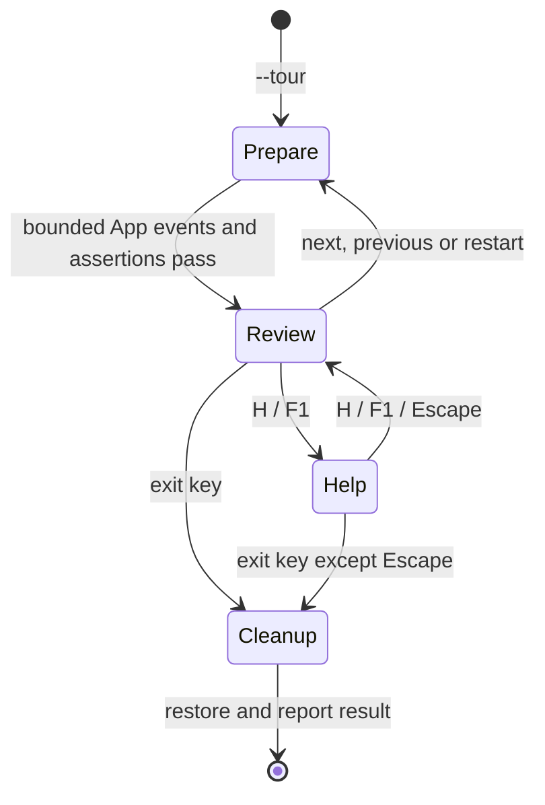
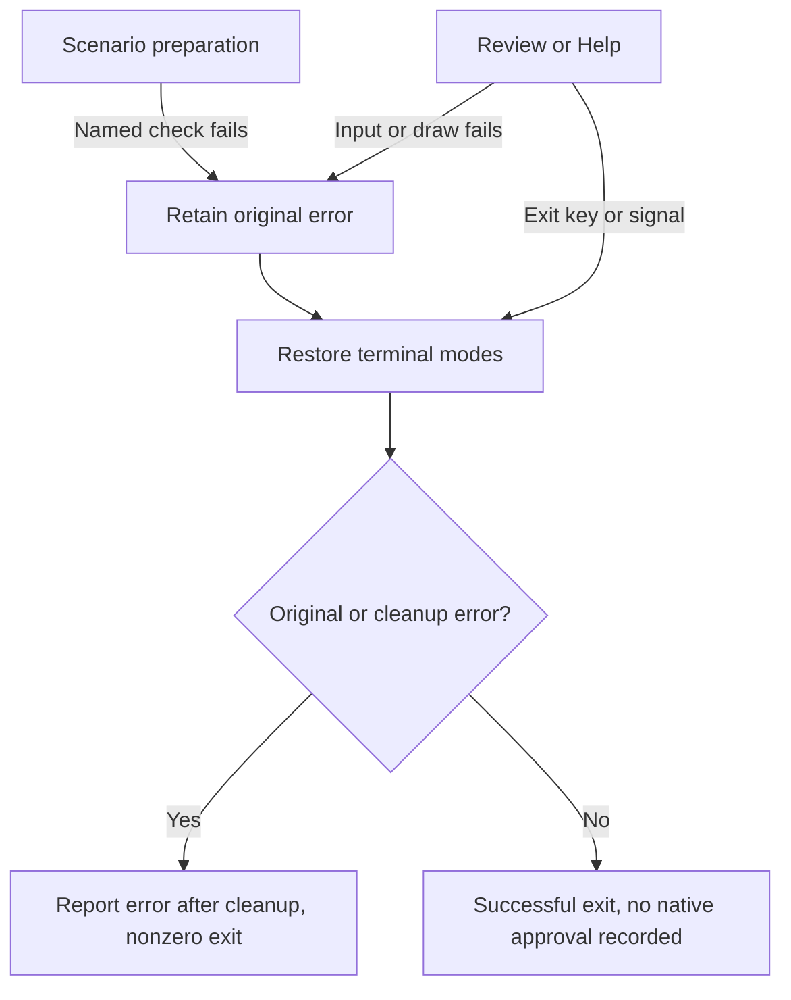

# Guided TUI validation tour

Status: selected scope for the isolated experiment on 2026-09-24. The owner accepted
a guided tour to reduce repetitive native testing. This supplements the
[prototype design](tui-interaction-prototype.md) and its
[implementation packet](../plans/tui-prototype-implementation.md). It does not
authorize production command or extension implementation.

The selected [composer increment](tui-composer.md) extends the tour to ten scenes
and preserves the ordinary status bar. Earlier eight-scene evidence below remains
historical evidence for that version.

## Purpose and proof boundaries

The executable prepares and checks representative interaction states. The owner
inspects those states in Ghostty and Terminal.app without manually recreating
every failure. Existing unit, editor/renderer integration and PTY regression cases
remain required, including branches omitted from the presentation tour.

The tour replaces the requirement to manually replay every TP3/TP4 transition in
both terminals. It does not replace native appearance, physical input, copy,
resize or usability evidence. The first editor trial remains owner-reported
evidence. Repeat affected physical-input checks when those paths change; repeat
the full editor trial when the terminal backend, editor or input protocol changes.
Inspect the guided states in both terminals and palettes at 120x40, 80x24 and
40x12. Report layout problems and whether the controls make sense. No tour result
automatically records a native pass or a usability judgement.

## Ownership and interface

`tour.rs` owns only synthetic scenario preparation, assertions, tour navigation
and tour instructions. `App::handle(Event)` remains the input owner; the existing
fixture remains the lifecycle owner. Scenario setup uses ordinary paste/key
events, with no direct fixture mutation or parallel implementation of transitions.
Each scene starts with a fresh `App::new(true)` and uses fewer than 100 events.
There is no wall-clock progression, scheduling, file access or subprocess work.
Direct-shortcut scenes first render a checkpoint through the shared renderer into
a bounded 120x40 TestBackend buffer. This establishes the same presented-target
guard used by the ordinary interface without terminal I/O or simulated admission.

`Tour::new() -> Result<Tour, String>` prepares the first checked state.
`Tour::handle(Event) -> Result<bool, String>` returns whether the tour should exit.
`Tour::draw(&mut Frame, light: bool)` reserves one instruction row at the top and
uses the shared renderer in the remaining rectangle. Read accessors expose the scene index, title and checked `App` for
integration tests. A palette toggle is owned by the tour and combined with the
initial `--light` choice. Scene preparation failures identify the scene and check;
the process restores terminal modes before reporting the error with a nonzero exit.

`main.rs` selects `--tour` before creating an ordinary editable session. `--manual`
is redundant and accepted with it. Existing fault-injection flags still qualify
the common terminal guard. `--fault=tour` is a tour-only qualification fault: fail
after the first rendered scene, then restore and return nonzero. No new dependency
or terminal mode is needed. Help and argument errors run before terminal setup.

### Selected control and state flow

Arrows represent local event routing and results. The fresh scenario owns only
synthetic text; tour controls never discard a user's ordinary editing session.

Resize, palette and ignored input preserve Review. Help scrolling and resize
preserve Help. The exit keys are Q, Escape, Ctrl+Q and Ctrl+C; Escape in Help
returns to Review. The following selected flow owns failure and signal exits.
Arrows represent termination requests and terminal restoration outcomes.

Signals also reach the existing cleanup path from every active state. Index bounds
clamp: previous at the first scene and next at the last scene stay there. Only
unmodified key presses activate tour controls; Ctrl+Q/C are explicit exceptions.
Repeat/release events, Enter, application fixture keys and paste cannot alter
checked state. Resize is forwarded to `App` with the instruction row excluded. Below 30x9, preserve the scene and
disable scene navigation; retain exit, palette and help dismissal. Preparation
always uses a valid logical viewport before applying the current terminal size.

## Presentation and checkpoints

Render the actual UI below one tour instruction row through `ui::draw_in_area`.
Preserve the canonical header, including the other project's activity cue,
destination, notice, message tray, composer, status bar and application overlays.
Use `Tour 1/10 N/P L H help Q quit` at compact widths; below 40 columns omit
the word `help` so the final scene's two-digit number and exit control still fit.
larger widths may also show the scene title. Help explains next/previous, palette
and locked editing. Progress and the exit/help keys must remain visible at 30x9.
The shared renderer accepts an overlay-footer hint: ordinary rendering retains
its existing hint, while the tour uses `Locked · H help Q quit`. This changes only
presentation and prevents suggesting that locked application controls are active.
Wide instruction rows also identify editing as locked. The ordinary overlay detail remains
visible for inspection, but its action instructions are not active in the tour.
The help view is a bounded, scrollable overlay with a visible dismissal hint;
it does not change application focus. Tiny terminals show a resize/exit hint.
The locked overlay hint cannot qualify the ordinary session's overlay controls;
use normal exploration for those observations. Integration tests compare ordinary
and tour hints at 40x12 and verify that the real status bar remains visible.

| Scene | Visible checkpoint and required automated assertions |
| --- | --- |
| 1. Multiline draft | Unicode and hard lines; Option+Return inserts, paste is atomic, undo/redo restores text, no pending submission |
| 2. Steer or Queue | Active work and explicit no-default choice; repeated Enter cannot submit. Also exercise Steer/newer draft and Queue/next-task success before rebuilding the visible choice |
| 3. Expired decision | Focused unavailable decision and retained draft; unselected or expired Enter cannot respond or submit |
| 4. Project switch | Observatory draft with Studio activity. Round-trip checks retain distinct drafts and editing history without retargeting |
| 5. Recovery | Rejected text appended to newer draft; recovery consumes no submission; undo/redo proves one append transaction |
| 6. Unknown outcome | Accepted request with lost acknowledgement; visible task/transcript effects withheld, independent draft retained |
| 7. Reconnected | The same request reconciles once; another disconnect/reconnect preserves task identity and exactly one accepted-request entry. Connection-status entries are permitted; independent draft retained |
| 8. Explicit reset | Reset confirmation without selection retains text in both projects. Also check explicit reset clears both before rebuilding the visible confirmation |
| 9. Message tray | Acknowledged Steer, two queued follow-ups and a newer draft; direct shortcuts preserve identities and status advertises the next explicit action |
| 10. Inspect full text | Open a captured tray item, change its lifecycle state and retain inspection focus and full text; Enter remains read-only |

All assertions return errors rather than panicking. Last-scene help states that
automated checks are complete, while native observations remain the user's report.
Next does not mean approval. The user can quit or revisit any scene.

## Renderer artifacts

An ignored integration test exports HTML contact sheets into the package's ignored
`target/tour-previews/` directory, using actual Ratatui TestBackend cell symbols,
foreground/background and relevant text modifiers. Export every scene at the three
trial sizes in both palettes. Include the scenario name, dimensions and a clear
synthetic-renderer label. Escape all text and do not load external resources.
Resolve terminal-default backgrounds to labelled preview-only samples under the
[status styling contract](tui-project-status.md#field-styling). Hardware cursors
and terminal-default font/color settings are not represented by these cell exports.
The test is the only file-writing component; the executable keeps terminal-only I/O.

Use the already installed local Puppeteer/Chromium tooling to capture these HTML
artifacts to temporary PNGs for inspection. This is renderer review, not automation
of either native terminal. Browser fonts and rendering do not establish terminal
glyph shaping, keyboard, clipboard or accessibility behavior. Artifacts are not
goldens that can silently bless a behavioral regression; state assertions remain
independent of image generation. Keep previews untracked.

## Validation cases

| Case | Initial state, trigger and required result | Unit | Integration | Process / native |
| --- | --- | --- | --- | --- |
| GT1 | At each scene, run ordinary input setup; every listed assertion passes or returns a named error | Scene assertions and index bounds | All scenes through actual editor, fixture and renderer | PTY traverses all scenes and revisits a prior one |
| GT2 | Checked state receives typing, paste, Enter, repeat/release, resize or help input; state remains intact and navigation remains usable | Control filtering, help, tiny bounds | Three sizes, tiny resize/recovery, both palettes | PTY ignored input, compact resize, help and theme toggle |
| GT3 | Tour exits, fails, receives a signal or rejects arguments; terminal cleanup and status remain correct | Argument/control decisions where separable | Existing terminal guard coverage | PTY quit, injected tour failure and signal; reject invalid flags before modes change |
| GT4 | Export actual scene buffers; all labels, escaped content and cell styles are represented | Pure escaping/color conversions | Every scene/size/palette exports successfully | Inspect generated PNGs; owner inspects native tour in both terminals |

The existing TP1 responsiveness measurement remains applicable. Tour preparation
is a bounded local batch; do not insert sleeps or simulate model latency. No new
production API, command registry, authority or data model is introduced, so their
architecture and persistence views remain with the governing prototype documents.
The palette PTY case uses an explicit truecolor child environment: unset inherited
`NO_COLOR` for that child and set `COLORTERM=truecolor`. Assert decoded dark and
light background values. Ordinary cases retain the inherited color preference;
the test does not change the executable's handling of `NO_COLOR` or global settings.

## Assignment and evidence

Primary owned this design, prototype validation amendments, `main.rs`, `lib.rs`,
the shared overlay-hint wrapper in `ui.rs`, README, renderer export integration
test and PTY integration. The tour implementer owned only `src/tour.rs` and
`tests/tour.rs`, and released those paths after integration. Independent design
and implementation review remained read-only.

Read-only design review identified that replacing the header would hide background
project activity. The selected presentation above preserves that canonical header.
The review found no further implementation blocker after that correction.

### Initial eight-scene verification on 2026-09-24

The guided tour is implemented in the isolated package. All eight scenes prepare
through ordinary application events and stop at checked states. No native terminal
application was automated and no personal configuration or state directory changed.

| Check | Observed result |
| --- | --- |
| Format, lint and build | `cargo fmt --all -- --check`, `cargo clippy --locked --all-targets -- -D warnings` and `cargo build --locked` passed. |
| Ordinary Rust suite | 91 unit and 15 integration tests passed. The measurement and artifact export remain explicitly ignored in this ordinary run. |
| Explicit artifact export | `cargo test --locked --test tour_previews export_tour_previews -- --ignored` passed, exporting all 48 scene/size/palette combinations to six HTML sheets. |
| Executable PTY suite | 24 named cases passed, including guided traversal/revisit, locked input, help, truecolor palette changes, compact resize, injected tour failure and signal cleanup. Existing interaction and terminal restoration cases passed. |
| Responsiveness | The packet's unchanged 1,000-batch debug measurement passed on Apple M4 Max: p95 14.445 ms, maximum 16.149 ms, below the 50 ms p95 target. This measures synthetic update/render work. |
| Visual artifacts | Local Puppeteer 23.11.1 captured the actual exported cells. Contact sheets covering all 48 combinations and selected full-size scenes were inspected. Mermaid CLI 11.16.0 rendered the two tour diagrams, which were visually inspected. |

Review corrections preserved the background-project header, explicitly labelled
locked controls, cleared old footer glyphs and asserted actual palette output.
The first palette PTY attempt inherited `NO_COLOR=1`; the final case uses the
documented child-only truecolor profile. No assertion was weakened.
The final read-only review confirmed those findings closed by source inspection.
All 371 local links and anchors across 37 Markdown documents passed; all four
documentation indexes cover their 32 entries. Whitespace and `git diff --check`
also passed.

The owner reported on 2026-09-24 that the guided tour worked in both Ghostty and
Terminal.app, with no issues reported. This is owner-observed native trial evidence;
the agent did not control either terminal. The report did not enumerate palettes,
dimensions or individual observations, so it does not establish exhaustive visual
coverage or a complete usability evaluation.

The owner also described the current UX as "very snappy" on 2026-09-24. This is a
positive qualitative responsiveness observation, separate from the synthetic
timing measurement above; no native input-to-paint latency was measured.

The automated artifacts do not prove physical key delivery, native glyph shaping,
hardware cursor presentation, copying or intuitive interaction. The prior
owner-reported editor pass remains separate. The new command categories, contextual composer
direction and hybrid storage requirements are documentation, not tour capabilities.
No production service/agent, storage, command-extension or security proof is claimed.
No commit or push was made.

### Composer extension on 2026-09-24

The [composer increment](tui-composer.md#recorded-verification-on-2026-09-24)
adds scenes 9 and 10 and moves tour controls above the ordinary interface. The real
status bar is now visible. Ten scenes passed preparation and renderer checks;
60 combinations were exported and visually inspected. The updated tour passed
PTY traversal, revisit, locked-input, resize, palette and cleanup cases. The owner
subsequently reported the new composer shortcut/layout smoke passed in both
terminals. This does not claim a separate exhaustive native tour/palette/size pass.
