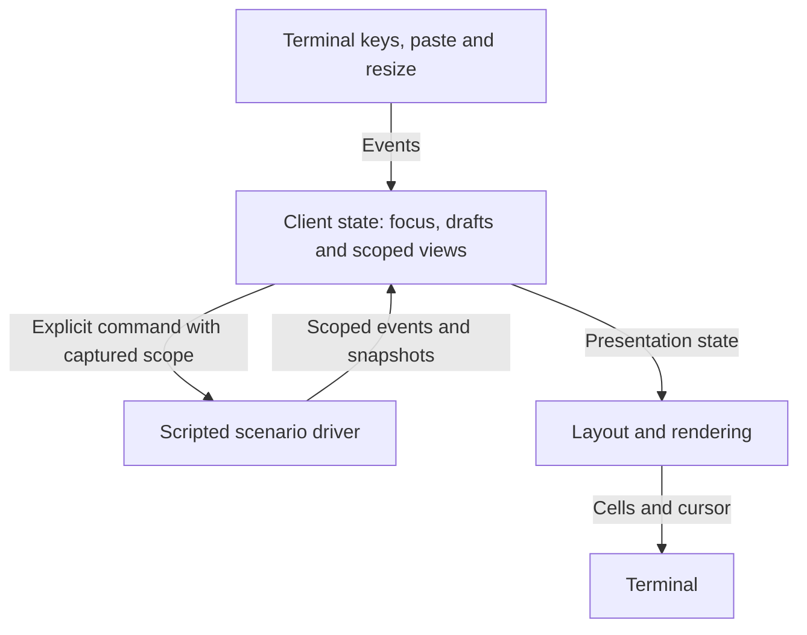
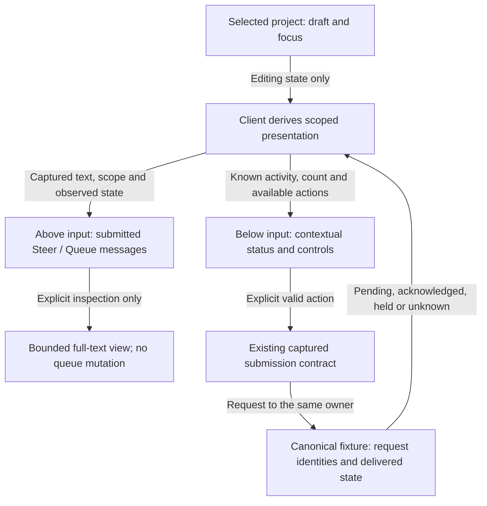
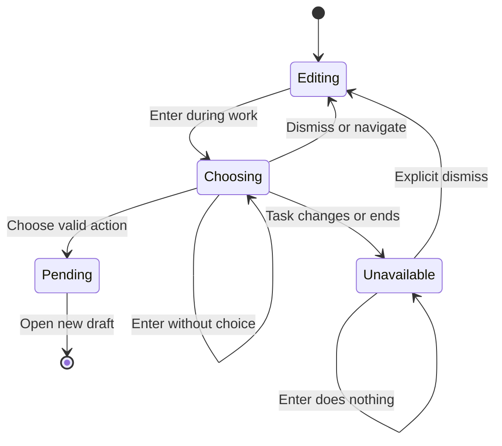
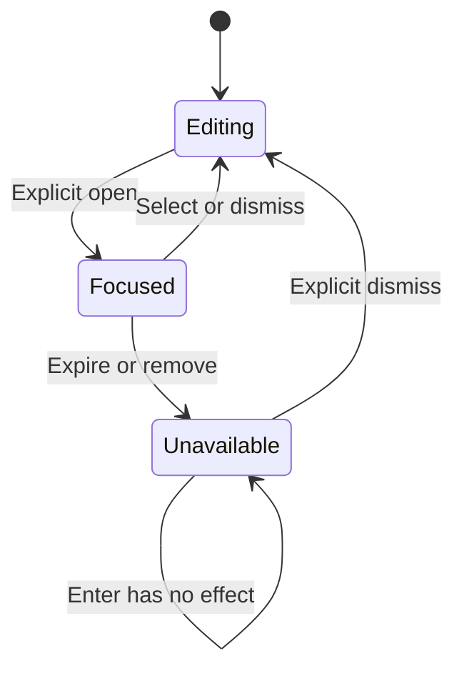
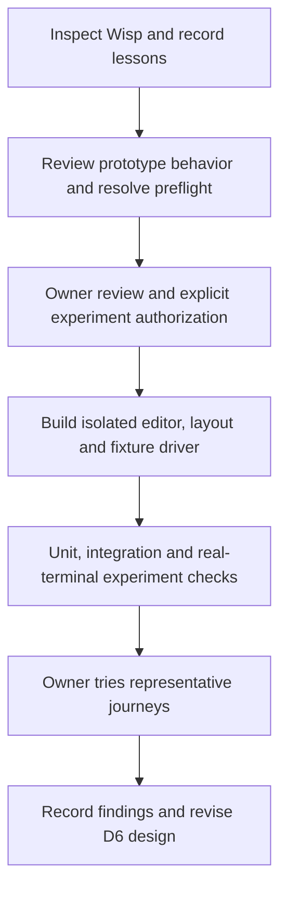

# TUI interaction prototype

Status: isolated experiment authorized on 2026-09-24 after preflight. The owner requested
multiline input and dynamic controls, status and information around the input
pane. Enter sends; a separate shortcut inserts a newline. During active work,
sending requires an explicit Steer/Queue choice. Ghostty and Terminal.app have
equal support from the first trial. These owner choices were recorded on 2026-09-24.
The [implementation packet](../plans/tui-prototype-implementation.md) selects the
concrete experiment choices below. None selects production behavior.

The [design gate](../design-process.md) still applies before executable work.
This experiment does not complete D0-D8 or authorize I0/I4.
The [preflight report](tui-prototype-preflight.md) records readiness findings and
the findings that the implementation packet resolves and must qualify.

## Question and boundary

Can one terminal interface make composing, following and switching work feel
natural while the surrounding information changes? Explore this with real input,
rendering and navigation, backed by scripted responses and events.

The [interaction brief](interaction-and-extension-boundaries.md) owns product UX
goals and extension boundaries. [W6](product-workflows.md#w6-navigate-projects-and-concurrent-activities)
owns project navigation and command scope. This experiment supplies evidence for
D6; its fixtures cannot prove orchestration, authorization or model behavior.

Build an isolated Rust/Ratatui executable under `experiments/tui-chat/`, with
in-memory fixtures for two projects and concurrent activities. The owner authorized
this isolated scope after preflight. A visible prototype indicator identifies
simulated work. No service, database, model, subprocess tools or external servers
are needed. Instruction, skill, MCP and LSP displays use labelled fixtures.

## Wisp evidence and lessons

Read-only inspection used the peer Wisp checkout at revision `cb456c0` on
2026-09-24. Paths and line references below are relative to that repository.
Its current source outranks older proposal text. No Wisp binary, backend, model
or test was run; historical visual/test claims were not freshly reproduced.

| Evidence | Observed lesson | Proposed Asura treatment |
| --- | --- | --- |
| `tools/wisp-tui/src/app.rs:264-307`, `main.rs:172-187` | One-cell inset aligns band text and committed history; input tint extends to both terminal edges | Keep one shared text inset. Compute background and content rectangles separately. |
| `app.rs:13-24`, `palette.rs:50-56` | `▄` and `▀` create half-row-looking space around the input, consuming two actual rows | Retain this light treatment as the first visual baseline; count actual rows in all sizing. |
| `docs/proposals/2026-09-22-tui-spike.md:35-46`, ADR 0029 | Two-cell margins, a three-row box and an earlier greener/darker palette were rejected by eye | Start from the refined spacing. Compare deliberate alternatives rather than accumulating padding. |
| `palette.rs:1-64` | Quiet information, attention and danger have distinct colour roles | Use restrained semantic colours plus text/focus indicators; colour alone cannot carry meaning. |
| `app.rs:643-708` | A buffer test checks inset, tint, strips and background reset | Test cell geometry and style boundaries, then inspect actual terminals. |

Wisp currently has a six-row inline band: partial reply, approval, upper strip,
single input row, lower strip and status. Older four-row wording is stale. Completed
lines enter terminal-owned scrollback. Its input appends characters and removes
the last character; busy work drops typing. Approval arrival redirects ordinary
characters into decision answers. These behaviors are not suitable for Asura's
editable drafts and changing controls (`app.rs:165-195`, `main.rs:131-148`).

Wisp also estimates wrapping by character count and notes wide-character limits
(`main.rs:191-198`). Its render test leaves the approval row empty. It does not
prove multiline cursor geometry, long decisions or adaptive status allocation.

## Prototype ownership and contract

Proposed in-process boundary. Arrows show local events and fixture commands.
The driver simulates responses; it has no production lifecycle or policy authority.



- The client owns draft text, cursor, selection, undo history, visible project,
  transcript position and focus. One composer instance per selected draft uses
  the same editor implementation; project navigation retains each draft's state.
- The scenario driver owns only scripted fixture state and a controllable clock.
  It provides progress, decision, failure and reconnect cases without inference.
- Commands carry request identity, project/conversation/task target as applicable,
  draft revision and action kind. Events carry scope, scenario generation and
  sequence; acknowledgements also identify their request. These are prototype
  types, not the final control wire schema.
- A submission captures its text and target. A later draft edit or project switch
  cannot mutate that request. Keep an immutable pending copy until acknowledged;
  rejection/uncertainty cannot erase it or overwrite a newer draft.
  Proposed transition: local validation failure leaves the editor untouched.
  Once a valid action is chosen, move the submitted draft into a pending entry
  and open a new empty draft. Acknowledgements update only that entry, never the
  newer draft. Ignore duplicate acknowledgements by request identity. A rejection offers explicit
  restoration; if newer text exists, retain both versions and require a choice.
  Unknown outcome requires reconciliation before any explicit retry.
- Disconnect disables new submission, retains editing and exposes pending state.
  Reconnect consumes a fixture snapshot/replay; it never resubmits automatically.
  Reset starts a new scenario generation and rejects old fixture events.
- Exit discards in-memory demo state after an explicit warning when drafts exist.
  Persistent recovery, real authorization and effects are outside the experiment.
  Production contracts remain with their canonical owners.

## Composer layout

The composer includes the editor and its adjacent context, notice and control
areas. Proposed normal layout, top to bottom:

| Region | Initial row budget | Behavior |
| --- | --- | --- |
| Transcript | Remaining height, at least 3 rows | Stream without moving a reader who has scrolled away; show a new-output indicator |
| Destination/context | 1 | Project/conversation and current work target; optional capability summary |
| Attention notice | 0 or 1 | Scoped decision, unavailable connection or rejected submission; detail opens explicitly |
| Upper tint strip | 1 | Wisp-style `▄`, edge to edge |
| Editor | 1 to 6 visible rows | Grow with hard lines and soft wrapping; scroll internally after the cap |
| Lower tint strip | 1 | Wisp-style `▀`, edge to edge |
| Controls/status | 1 | State-specific actions and key hints; reserve predictable positions |

Use one-cell left/right text insets, clamped for narrow widths. A separate prompt
gutter aligns all editor continuation lines. Fill the entire editor background
before drawing text; reset the strips' background and the following status row.
Changing editor height must not change these horizontal anchors.

Suggested compact behavior: remove decorative strips first, collapse optional
metadata into an inspect action, then reduce the editor's visible height. Preserve
the destination, one editable row and access to essential controls. Below the
reviewed minimum geometry, show a resize message and disable submission; retain
the draft and exit access. The implementation packet specifies exact thresholds.

A notice cannot silently steal focus. Changing controls cannot reuse the focused
position for a different action. Use stable action identities; if a focused action
expires or disappears, retain a disabled placeholder until explicit dismissal.
Enter on that placeholder does nothing; it cannot fall through to draft submission.
Restore editor focus only through an explicit user action. Recompute
layout, cursor position and hit regions together after every relevant change.

### Dynamic surrounding information

Proposed presentations, with independent editing and execution state:

| Situation | Surrounding change | Draft behavior |
| --- | --- | --- |
| Idle | Destination, capability summary, Send and newline hint | Editable; empty/whitespace-only submission disabled |
| Working | Scoped progress and Stop; preparing another message remains possible | Editable; Enter opens the required Steer/Queue choice |
| Decision pending | Attention notice and Review action | Typing remains editing; open the decision before answering |
| Suggestions open | Bounded command/skill suggestions adjacent to the editor | Enter accepts the focused suggestion; it does not also submit |
| Disconnected or stale target | Clear status and reconnect/inspect action | Editable; sending disabled and pending text retained |
| Submission rejected | Scoped explanation and explicit recovery action | No clearing or automatic resend |

Only the active notice uses the optional row. Prioritize blocked submission,
then a pending decision, then ordinary progress; make other notices discoverable
through a count and scoped list. Do not hide a disabled action's reason. Progress
and background events must not move the selected project or transcript position.

### Owner direction: status and submitted messages

**Required UX direction, recorded on 2026-09-24:** While work continues, drafting
another message must expose contextual next-message controls in the status row
**below** the input. Submitted Steer and Queue message text must remain visible
**above** the input, so the user can follow their own instructions and follow-ups.
The lower row supplies controls and status; it does not replace that message text
with only a queue count. The subsequently authorized [composer design](tui-composer.md)
owns the selected presentation, shortcut, retention and validation contracts.
It records implementation evidence separately from native observations.

The owner's illustrative lower row is a proposal, not a selected binding or layout:

```text
[actioning word][spinner] [3 queued] Next message... -> Steer [cmd+return] -> Queue [opt+return]
```

Keep the existing Enter contract: active work opens an explicit choice with no
default. The composer design selects Ctrl+S and Ctrl+T as explicit actions,
subject to captured target, revision and availability checks. Command+Return and
Option+Return were illustrative candidates; the former is reserved in the recorded
Ghostty profile, and the latter overlaps the Alt+Enter newline alias. The composer
design owns selected wording, spacing and animation. New physical shortcuts still
require evidence in both terminals.

Typing changes the presentation of available actions, not the task or its queue.
Retain draft text, cursor, selection, undo and focus while the lower row changes.
Use only known fixture activity for the action word and count. A spinner cannot
imply acceptance, progress or connectivity that has not been observed. When sends
are blocked, show the reason instead of advertising an available Steer/Queue action.
Unknown queue state must not be rendered as a confirmed count of zero.

### Submitted-message presentation boundaries

Required distinction between states; labels below describe meaning, not final copy.
The existing fixture remains the lifecycle owner. This presentation does not create
a second queue, change acceptance semantics or define production steering behavior.

| Observed state | Presentation above the input |
| --- | --- |
| Choice open, no action submitted | Keep the text in the draft/choice. Do not count it as submitted or queued. |
| Steer or Queue awaiting acknowledgement | Show captured text and action with a pending label. Do not claim the instruction was applied or the follow-up was accepted. |
| Steer acknowledged | Identify the text as acknowledged for its captured task. This does not prove that an agent followed it or completed the requested change. |
| Queue acknowledged | Show the accepted follow-up text as queued for the captured conversation/task relationship. Derive queue counts from delivered fixture state. |
| Queued follow-up starts | Identify its text with the running follow-up; do not continue counting that item as waiting. Only the fixture may start it. |
| Rejected or held after cancellation/failure | Retain text and reason with an explicit recovery route. It must not appear to be active or eligible to run automatically. |
| Outcome unknown | Retain the captured text and identify uncertainty. Do not reveal acceptance or other hidden fixture effects before acknowledgement or reconciliation. |

Each visible item retains its request identity and captured project, conversation
and task scope. Navigation selects that project's presentation; it cannot move
an item into the newly selected project's work. A late acknowledgement updates
only its item and cannot replace a newer draft. Duplicated events must not create
duplicate message entries. Rendering must use delivered fixture views, including
their unavailable states, rather than inspecting hidden accepted outcomes.

The client owns presentation and inspection focus; `model.rs` retains fixture
acceptance, queue progression, rejection, recovery and reconciliation. Any retained
presentation references must use its identities and bounded text ownership.
Do not fabricate delivered transcript identities for pending messages or duplicate
protected text into an independently managed queue. The experiment remains one
Rust process. This change introduces no Swift bridge, model operation or service.

### Initial presentation proposal

Original proposal, refined by the selected [composer design](tui-composer.md).
Arrows distinguish fixture state and
derived client views from explicit submission requests. Pending text is known at
submission. An accepted effect becomes visible only when the fixture delivers it.
Existing submission and reconciliation diagrams retain authority over transitions
and failure handling.



### Presentation decisions resolved by the composer design

The [composer design](tui-composer.md) specifies placement, retention, bounds,
full-text access, ordering, counts, lower-row states and shortcuts. Its validation
maps these contracts to unit, integration, process and native checks. The revised
[guided tour](tui-guided-tour.md) preserves the ordinary status bar beneath the input.
Viewing the tray does not authorize editing, reordering, cancelling or reprioritizing
individual entries. Those actions still need separate requirements and lifecycle design.

### Submission state contract

The owner requires an explicit choice during active work. The following fixture
semantics are proposed for review; they do not select the production steering or
queue lifecycle. UI wording must show the intended target and effect.

| Current state | Enter from editor focus | Required presentation result |
| --- | --- | --- |
| Idle or completed | Submit a new fixture turn in the selected conversation | Capture destination and text; show a pending entry before acknowledgement |
| Working | Capture text, destination and task revision; open Steer/Queue choice | Do not dispatch or clear the draft until a valid explicit choice |
| Decision pending with active work | Open the same Steer/Queue choice | A typed message cannot answer the pending decision; Review remains separate |
| Choice open | Enter activates only a deliberately focused choice | Initially focus the heading; require explicit movement to an action, with no default or reused previous choice |
| Submission awaiting acknowledgement | Disable further sends in that conversation; allow continued drafting | Ignore duplicate request activation; a late acknowledgement cannot clear the newer draft |
| Disconnected or stale destination | No submission | Keep the draft and explain the unavailable action |

In fixtures, **Steer** requests a change to the captured active task and waits for
an acknowledgement before showing it as applied. **Queue** records a follow-up
for the same conversation after that task succeeds. After cancellation or failure,
hold queued work for an explicit user decision; do not silently restart work.
Final production lifecycle semantics remain D3/D6 decisions.

While the choice is open, retain the draft's text, cursor, selection and undo state.
Editing resumes only after dismissal; text and paste cannot activate either choice.
Opening the choice and immediately pressing Enter again has no effect. Tab or an
arrow key explicitly moves focus to Steer or Queue before activation.

Dismissal or navigation away closes the choice without sending and retains the
original draft. If the captured task ends or changes revision while the choice
is open, disable the affected choice and retain focus. Require explicit dismissal
and a fresh send; do not reinterpret the old choice as an idle submission.
At acceptance, the driver checks the captured task identity/revision and the
action's active-task precondition. If completion, revision, connection or fixture
authority changes invalidate the request first, reject with the captured scope
and preserve the pending text. If acceptance wins, record that action before
processing the later task event. Repeat fixtures with both event orderings.

### Submission choice transitions

Proposed fixture presentation flow. Arrows name explicit user actions or captured
task changes. The pending entry is separate from the new editable draft;
acknowledgement and recovery follow the ownership contract above.



## Multiline editing and key dispatch

**Selected for this prototype by the owner:** Enter sends and a separate shortcut
inserts a newline. The [composer input contract](tui-composer.md#selected-input-routes) selects
Option+Return after verification in both terminals:

- Option+Return (Alt+Enter) inserts a newline. A distinct Shift+Enter remains an
  unadvertised compatibility alias. F1 lists the working binding; the status bar
  follows the [project status amendment](tui-project-status.md).
- In the editor, Enter follows the submission state contract: idle work submits
  once after validation; active work opens the required choice. In an explicitly focused
  suggestion/decision/control, Enter activates that item only. The event is consumed
  once; no fallthrough to submission. Submission and control activation accept only
  key press events, never repeat or release events.
- Arrow keys move within the draft; Up/Down do not switch to history at a boundary.
  History recall uses an explicit action and retains the unfinished draft.
- Support insertion, deletion, Home/End, selection, undo/redo, multiline paste and
  soft wrapping. Cursor movement/deletion must preserve grapheme clusters; screen
  positioning uses display-cell width. Tabs and pasted control characters require
  an explicit normalization/display policy before implementation.
- Paste is one editing transaction, preserving newlines without submitting or
  invoking commands. Enable bracketed paste on supported terminals. Where safe
  paste separation is unavailable, use an explicit paste mode that treats Enter
  as text until the user leaves it; do not promise automatic detection there.
- A streaming reply, notice, resize or project switch must preserve text, cursor,
  selection and undo state. The selected draft's viewport keeps its cursor visible.
- Stop work, clear draft, dismiss an overlay and exit are distinct actions.
  Ordinary typing must never accept or reject a newly arrived approval.

### Focus transition proposal

This is presentation state, not task lifecycle. Focused means a suggestion,
submission choice, decision or control surface. Arrows show the listed event;
expiry/removal comes from background state. Background progress preserves editor focus. Returning to
editing restores the draft; an unavailable surface requires explicit dismissal.



## Dependencies and viewport experiment

Wisp declares Ratatui 0.30 and Crossterm 0.29, with Rust edition 2024 and minimum
Rust 1.98. These are source declarations, not an Asura toolchain selection.

Read-only primary documentation checked on 2026-09-24:

- Ratatui's [input example](https://ratatui.rs/examples/apps/user_input/) recommends
  an editor widget for richer input. Evaluate reuse before implementing an editor.
- [ratatui-textarea 0.9.2](https://docs.rs/ratatui-textarea/0.9.2/ratatui_textarea/)
  documents multiline editing, selection, undo/redo and soft wrapping. It is a
  researched candidate, but the preflight source review found scalar-based cursor
  and deletion operations. It does not meet the grapheme contract as-is. Resolve
  the editor choice before implementation; do not assume key remapping fixes its
  internal text model or inherit its key map implicitly.
- Crossterm documents [keyboard enhancement](https://docs.rs/crossterm/0.29.0/crossterm/event/struct.PushKeyboardEnhancementFlags.html)
  and [bracketed paste](https://docs.rs/crossterm/0.29.0/crossterm/event/struct.EnableBracketedPaste.html).
  Enabling a mode is not proof that every terminal reports the expected events.

Propose a full-screen, application-owned transcript for the first experiment,
because project switching needs replaceable views. Preserve Wisp's light visual
treatment. Record the cost to native scrollback, selection and copying explicitly.
Compare an inline variant if those costs undermine the intended experience; do
not silently turn this prototype choice into a production viewport decision.

## Experiment plan and readiness

The primary agent owns this design and integrates reviews. Wisp investigation and
prototype review are read-only delegate tasks. The implementation packet records
exact writer ownership and the selected checks before executable work.

Proposed dependency order. Arrows show completion prerequisites. The authorization
node covers only the reviewed experiment; production delivery gates stay separate.



The implementation packet resolves exact dependency/toolchain versions, editor compatibility,
font/keyboard profiles and key behavior for both selected terminals, compact
thresholds, normalization rules, event-loop bounds, input/history limits and
canonical check commands. Its first slice qualifies editor and terminal assumptions.
It specifies terminal restoration on normal exit, setup error, interruption and panic. A fatal
driver/rendering failure must leave a usable shell and an honest error result.

Propose a 64 KiB UTF-8 draft limit, atomic rejection of an oversized paste,
bounded fixture transcripts and a manually stepped clock for deterministic tests.
Pin remaining bounds during preflight. Run fully offline with synthetic fixtures;
do not load real project instructions, credentials or content. Keep transcripts
in memory and any approved screenshots free of private prompts or local paths.

After preflight and review, implement the single-project editor first, then dynamic
surrounding rows, then two-project navigation and fault scenarios. Retain only
changes that answer an experiment question. Evidence and learned interaction
contracts feed D6; code reuse requires a separate production review and validation.
For the first slice, use one progress/decision notice and defer command/skill
suggestions and rich capability displays. They remain later prototype experiments.
Validate the editor and viewport before expanding the fixture interface.

## Validation and owner trial

Each case requires unit rules, actual editor/layout/driver integration and PTY
coverage, plus the applicable native observations below. The owner accepted the
[guided tour](tui-guided-tour.md) on 2026-09-24 to replace repetitive manual TP3/TP4
setup with checked synthetic scenes. These are prototype checks, not Asura's required
end-to-end service/agent proof. Split fault variants into separate test IDs.

### TP1: Spacing and resizing

- **Initial state:** Empty, one-line and six-line drafts with long surrounding text.
- **Trigger:** Render at 120x40, 80x24 and 40x12; resize through compact thresholds.
- **Required result:** Aligned insets, edge-to-edge tint, no style bleed or overlap;
  cursor remains visible and important state remains reachable.
- **Checks:** Unit row allocation; buffer geometry/style integration; visual review
  at actual font size in supported light/dark terminal profiles.

### TP2: Editing and submission

- **Initial state:** A partially edited draft, including emoji, combining marks,
  wide characters, hard lines and wrapped lines.
- **Trigger:** Edit, select, undo, paste, invoke newline, submit and exceed limits.
- **Required result:** Text remains intact; paste/newline never sends. Enter with
  editor focus submits once when idle or opens Steer/Queue during active work.
  A rejected submission preserves recoverable text.
- **Checks:** Unit event routing and text boundaries; editor/backend integration;
  physical keyboard and paste checks with enhanced keys available and unavailable.

### TP3: Dynamic controls without focus theft

- **Initial state:** User types while one fixture activity streams.
- **Trigger:** Independently show a decision, suggestions, error or changed control;
  expire a decision or remove the focused action while typing.
- **Required result:** Preserve editor state, avoid implicit decisions and consume
  Enter once. Controls retain their identity and purpose across layout changes.
  A disappearing/expired focused item becomes inactive and retains focus until
  explicitly dismissed. An intended control activation cannot submit a draft.
- **Checks:** Unit focus transitions; event/layout and PTY integration through
  each transition, including long decision text and compact layouts. Inspect
  representative native states through the guided tour; physical-key changes
  require the affected native input checks.
  Test both orderings of Enter against decision expiry and focused-control removal.
  Include choice opening with no default action, repeated Enter, explicit focus,
  dismissal and task completion/revision while the choice is open.

### TP4: Navigation and uncertain submission

- **Initial state:** Two projects have distinct drafts and concurrent fixture work.
- **Trigger:** Submit in A, switch to B, deliver A's delayed result, disconnect,
  reconnect, reset the scenario and deliver an obsolete event.
- **Required result:** No retargeting, duplicate submission, lost draft or stale
  generation update. Background work remains discoverable without stealing focus.
- **Checks:** Unit identities/revisions; driver replay, actual editor/renderer and
  PTY integration checking text, cursor, selection, undo and transcript position
  in both projects. Inspect navigation and recovery presentation through the
  guided tour in both native terminals.
  Cover both orderings of action acceptance against task completion/revision,
  connection and fixture authority changes. Delay and duplicate acknowledgements
  while the user types into the new draft. Cover explicit restoration after rejection,
  unknown-outcome reconciliation and queued work held after cancellation/failure.

### TP5: Terminal ownership and human evaluation

- **Initial state:** Supported terminal with a known shell mode and synthetic data.
- **Trigger:** Normal exit, setup error, interruption and injected runtime failure;
  separately perform the three start/refine, switch and recover journeys.
- **Required result:** Restore terminal modes/cursor; no unintended external access.
  Record where the user hesitates, mispredicts an action or loses track of work.
- **Checks:** Unit cleanup decisions; terminal-adapter fault integration; actual
  terminal restoration, copy/scroll, keyboard-only and user-observed trials.

### TP6: Contextual lower status during drafting

Acceptance obligations mapped to CP1/CP4/CP5 in the [composer design](tui-composer.md).

- **Initial state:** Active fixture work, a known queue and an editable draft.
- **Trigger:** Type, paste, clear or undo text; deliver progress or a decision;
  independently disconnect, lose an acknowledgement or resize the terminal.
- **Required result:** Controls below the input reflect valid next-message actions
  without changing task state or stealing focus. Counts and activity remain truthful.
  Enter retains its explicit no-default choice. Unavailable actions explain why.
- **Unit:** Presentation selection, count/availability rules, stable action identity
  and selected animation timing. Input alone cannot mutate fixture lifecycle.
- **Integration:** Actual editor, fixture and renderer across widths and both
  palettes; verify text, cursor, selection and undo through each status change.
- **Prototype end-to-end:** PTY exercises the selected input routes and blocked
  actions. Inspect the actual lower row and any new physical shortcuts in both
  native terminals; a tour footer or synthetic key event is insufficient evidence.

### TP7: Visible submitted Steer and Queue messages

Acceptance obligations mapped to CP2/CP3 in the [composer design](tui-composer.md).

- **Initial state:** Two projects have distinct drafts, pending Steer/Queue requests
  and acknowledged queued items, including long and multiline text.
- **Trigger:** Acknowledge, reject, start a queued item, cancel/fail its prerequisite,
  lose an acknowledgement, reconnect, duplicate delivery or switch projects.
- **Required result:** The above-input presentation preserves each message's text,
  identity, scope and observed state. No premature acceptance, duplicate count,
  hidden text loss, implicit retry or mutation of a newer draft is permitted.
  Every bounded/truncated presentation retains an explicit route to full text.
- **Unit:** Identity-based projection, state labels, ordering, retention and bounds.
- **Integration:** Canonical fixture delivery and actual renderer/inspector; test
  both acceptance/rejection orderings, unknown outcomes and transcript eviction.
  Verify full-text access, geometry, focus and per-project restoration.
- **Prototype end-to-end:** PTY runs success and recovery through the real binary.
  Inspect multiple/long messages and compact layouts in Ghostty and Terminal.app;
  ask the owner to identify which instructions are pending, acknowledged or held.

Native observations need both Ghostty and Terminal.app; buffer and guided-state
checks cannot establish physical key compatibility. Pin both version/font/key
profiles before coding. The preflight records currently installed versions.
Measure input-to-paint and resize behavior during fixture bursts, recording hardware
and workload. Select the trial's responsiveness threshold during preflight.
Do not call the interaction intuitive until the owner has tried and reviewed it.

## First implementation checkpoint on 2026-09-24

The isolated editor qualification shell now exists under `experiments/tui-chat/`.
It includes one synthetic conversation, delayed acknowledgements, multiline editing,
bounded paste/undo, retained transcript reading position and terminal cleanup.
The [implementation packet](../plans/tui-prototype-implementation.md#recorded-evidence)
records executed checks and their proof limits. The first checkpoint excluded
active-work Steer/Queue, decisions, multi-project navigation and recovery
fixtures until the required native editor trials passed.

The computer-use tool refused access to both Ghostty and Terminal.app. A manual
trial is documented in the [experiment README](../../experiments/tui-chat/README.md#first-native-trial).
The owner subsequently reported that both terminals passed the requested first
editor trial. That report satisfies the native editor prerequisite for expansion;
it is separate from the PTY evidence. The additional interaction journeys and
overall usability evaluation remain outstanding.

## Expanded interaction checkpoint on 2026-09-24

After the reported native editor pass, the experiment added Studio/Observatory
navigation, active work, explicit Steer/Queue, scoped decisions and text recovery.
Each project retains its actual editor and transcript reading position. Pending
messages use a separate inspector so they cannot reuse delivered transcript
identities. Reconnect resolves the original request; acceptance does not become
visible as applied before acknowledgement or reconciliation.

The [second-stage evidence](../plans/tui-prototype-implementation.md#second-stage-evidence)
records automated checks and review. The
[interaction trial](../../experiments/tui-chat/README.md#interaction-trial) covers
the additional native journeys and usability observations still required in both
terminals. Command/skill suggestions, richer capability displays and production
integration remain later work.

## Initial documentation verification on 2026-09-24

Independent read-only review found an activation race when a disappearing control
returned focus to the editor. The revised design retains an inactive focused
placeholder until explicit dismissal; TP3 covers both event orderings. The reviewer
confirmed closure at the design level.

Mermaid CLI 11.16.0 rendered all three diagrams, which were visually inspected.
The focus diagram was simplified after overlapping labels were found. All 278
local Markdown links and anchors across 29 documents passed, along with whitespace
checks and `git diff --check`. Previews remained outside the repository.
No executable prototype, tests, terminal sessions, model calls or Wisp changes
were produced. Dependency and terminal claims remain documentation/source evidence.
The [preflight report](tui-prototype-preflight.md#documentation-verification)
records the subsequent submission review and documentation checks.

## Composer direction documentation check on 2026-09-24

At this earlier checkpoint, the status/message direction and TP6/TP7 remained
design work. The [composer design](tui-composer.md) records the later increment. Mermaid CLI
11.16.0 rendered all five diagrams; the new presentation flow was visually inspected.
All 12 local links and anchors in this document, its whitespace check and
`git diff --check` passed. Previews remained in temporary storage. No implementation,
input-binding change or native validation was performed for this addendum.
