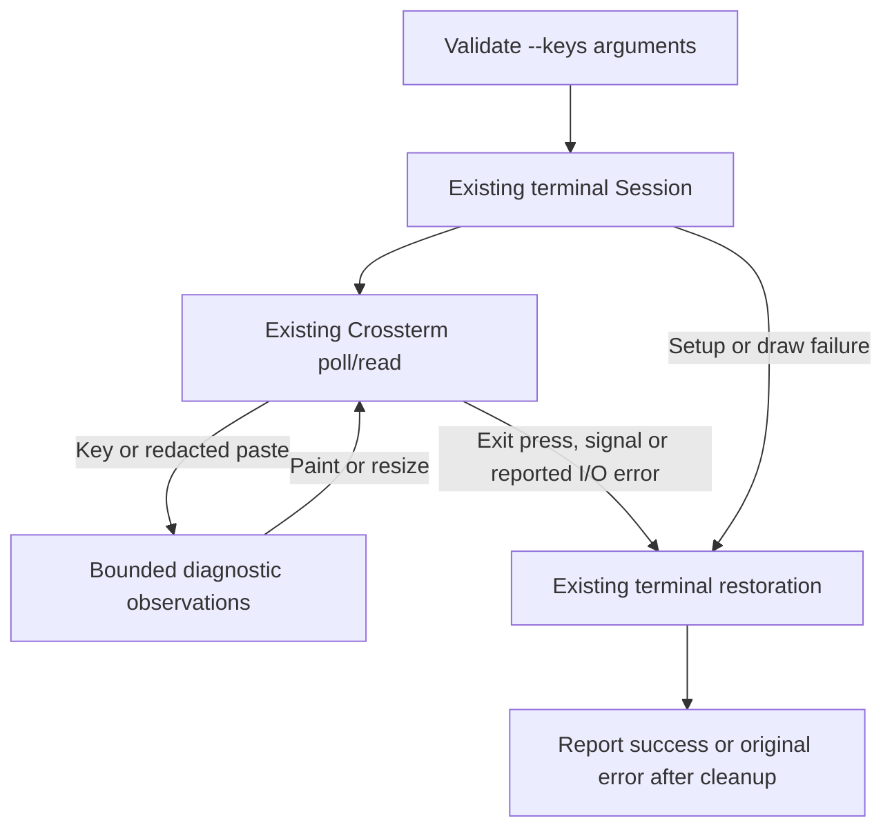

# Native terminal key inspection

Status: implemented diagnostic on 2026-09-24; partial native results are recorded
below. Return-based submission bindings remain unselected.
The owner requested checking
Control+Return, Command+Return and Shift+Return before replacing direct submission shortcuts.
The [composer](tui-composer.md) stays implemented with its tested bindings while
this diagnostic gathers evidence. The subsequent
[composer amendment](tui-composer.md#selected-input-routes) selects Option+Return
as the advertised newline shortcut using the native observations below.
Shift+Return is also currently a newline alias when decoded distinctly; selecting
it for submission would require an explicit composer binding amendment.

## Question and boundaries

Determine which key code and modifiers the current prototype receives under each
terminal's existing settings. An OS/emulator shortcut may consume a key or emit
plain Return; the client cannot infer the physical modifier when it is absent.
Decoder capability and native delivery are separate evidence.

Ghostty 1.3.1's effective `+list-keybinds` output reserves Command+Return for
fullscreen. Terminal.app 2.15's Pro profile has no saved custom keyboard mapping
or app-menu override; [Apple documents](https://support.apple.com/guide/terminal/keyboard-shortcuts-trmlshtcts/mac)
Command+Return as marking a line and sending Return. These observations do not
prove what Control+Return sends in either running native window.

No shortcut is rebound, no terminal preference is changed and no enhanced keyboard
mode is pushed. The [build packet](../plans/tui-prototype-implementation.md) still
owns dependencies and terminal acquisition/restoration. No model, service, file
write, external tool execution or user draft is involved at runtime.

## Selected diagnostic contract

Add `--keys` as a separate surface, mutually exclusive with `--tour`. `--light`
still selects the palette; `--manual` is accepted but has no diagnostic effect.
Reject incompatible arguments before terminal acquisition. Existing setup, draw
and panic faults use the common cleanup path; `--fault=tour` still requires a tour.

`key_probe.rs` owns only a bounded list of observed events and its presentation.
`main.rs` owns surface selection and existing polling. `terminal.rs` remains the
sole owner of raw mode, alternate screen, bracketed paste and signal cleanup.
Do not create an `App`, fixture or command interpreter for this surface.

Show a clear no-submission label, candidate Return combinations and exit keys.
For each decoded key, display its key code, modifiers and press/repeat/release kind.
Use escaped diagnostic text, never raw terminal control characters. Keep the most
recent eight observations; an event counter saturates rather than overflowing.
Only visible rows are drawn, with newest observations reachable at small sizes.
Resize redraws the same retained observations; either palette remains readable.

Paste records only `Paste ignored`, without content or echo. Mouse/focus events
are ignored. Unmodified Escape, Control+Q and Control+C on press exit. Repeat or
release of those keys cannot exit. Return and all its modifiers only record events.
No key can send, steer, queue, answer a decision or change a draft in this mode.

Use the same Crossterm event decoder and existing modes as ordinary chat. Do not
guess a modifier from timing. Propagated I/O errors restore the terminal before
reporting through the existing error path. Crossterm 0.29.0's Unix reader silently
discards some unsupported encodings, including xterm's `CSI 27;5;13~` form.
No displayed event can therefore mean emulator interception or decoder rejection;
this mode cannot distinguish those causes or prove that no bytes arrived.

### Diagnostic event and cleanup flow

Selected flow. Arrows name local routing and exit outcomes; no path reaches chat
submission. Native key delivery is an input to this flow, not simulated by it.

## Validation and evidence

| Case | Unit | Integration | PTY / native |
| --- | --- | --- | --- |
| KI1: Classification | Enter/modifier/kind text, bounded retention and paste redaction | Actual Ratatui buffers at 80x24, 40x12 and 30x8 in both palettes | Inject distinct encoded Enter variants through real decoder; owner presses physical keys in each terminal |
| KI2: Inert input | Candidate keys cannot request exit; only explicit exit presses do | Surface has no fixture/editor dependency | Paste containing command-like text cannot submit or appear as content |
| KI3: Cleanup | Reuse existing terminal unit coverage | Main selection and pre-acquisition argument rejection | Normal exit, signal and diagnostic draw fault restore tty flags; discarded encoding followed by a valid key remains usable |

Run format, Clippy, Rust and PTY checks. A synthetic escape sequence proves decoding,
not native delivery. Record the owner's exact displayed key/modifiers per terminal.
Keep Command+Return's native action separate from any key event seen by the probe.
The results inform a later binding amendment; this diagnostic does not select one.

### Automated qualification on 2026-09-24

Format, Clippy with warnings denied, the locked build, 113 unit tests and 30
integration tests passed. The two ordinary ignored tests remain the previously
qualified performance and tour-export checks; this diagnostic changes neither
chat rendering nor fixture scheduling.

All 31 named PTY/CLI checks passed. The added checks exercise decoded Return
modifiers and repeat events, unsupported encoding followed by a valid key,
redacted paste, compact resizing, normal exit, SIGTERM and draw-fault cleanup.
Incompatible surface arguments and non-TTY use fail before terminal acquisition.
These are synthetic decoder and process checks, not physical-key evidence.

The diagram was rendered and visually inspected with Mermaid CLI 11.16.0.
Repository documentation checks passed for 40 Markdown files, 403 local links and
four directory indexes containing 35 entries. These counts describe the automated
qualification before the native-results follow-up below.

### Native observations and decoder investigation on 2026-09-24

The owner supplied diagnostic output from Ghostty, then Terminal.app. Each extract
contains two `code=Enter kind=Press` observations with `modifiers=ALT`. Combined
with the owner's physical-key report, this confirms Option+Return is distinguishable
in both terminals under their tested settings.

The earlier Ghostty report described Command+Return entering fullscreen, with
Shift+Return and Control+Return producing no visible action. Neither subsequent
diagnostic extract contains a Shift or Control event. The extracts do not include
a plain Return observation or establish Terminal.app's Command+Return behavior.
No-event results do not establish whether the emulator or decoder discarded input.

The owner then reported that Control+Return opens Terminal.app's context menu.
That native action makes it unsuitable as a shared submission shortcut under the
tested settings. Preserve the distinction between that observed action and the
decoder's separate inability to publish some modified Return sequences.

Source inspection identifies a concrete compatibility gap. Ghostty 1.3.1's
[legacy Enter table](https://github.com/ghostty-org/ghostty/blob/v1.3.1/src/input/function_keys.zig#L179-L201)
encodes Shift+Return as `CSI 27;2;13~` and Control+Return as `CSI 27;5;13~`.
The installed Crossterm 0.29.0 parser rejects the leading `27` in this encoding;
its Unix reader clears rejected sequences without publishing an event. The earlier
PTY case verifies this discard for Control+Return followed by a valid key.

This gap is a source-supported explanation for Ghostty's result, not a capture of
the bytes from the owner's terminal. Terminal.app's Shift+Return behavior remains
unresolved. Shift+Return remains a candidate after resolving decoding and native
delivery; it is not a verified shared shortcut. Keep the current submission routes.

Ghostty also implements the [Kitty keyboard protocol](https://sw.kovidgoyal.net/kitty/keyboard-protocol/),
which Crossterm supports. That is a possible compatibility route, not a selected
fix or proof for Terminal.app. The current packet explicitly prohibits pushing
keyboard enhancement modes. This investigation changes no terminal modes,
preferences, dependencies or bindings. Any decoder correction or protocol change
requires its own scoped design and validation before implementation.

Primary owns this design, `main.rs`, `lib.rs`, README, PTY cases and integration.
A module delegate may own only `src/key_probe.rs`, including unit/buffer checks.
Obtain a read-only design check before implementing this packet; render and inspect
the diagram locally. No changes to terminal ownership or dependencies are needed.
