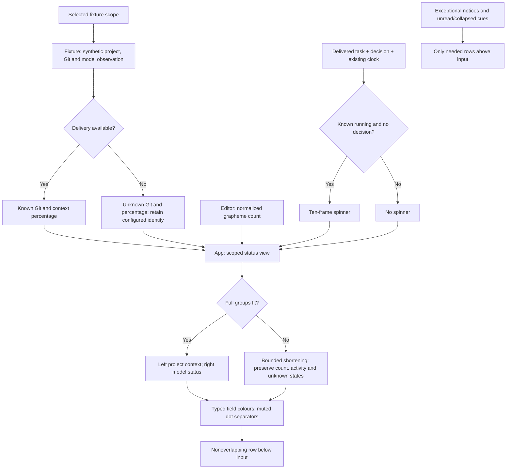

# TUI project and model status bar

Status: implemented and automatically qualified in the isolated prototype on
2026-09-24. The owner requested this amendment and confirmed that `% used` means
the current conversation's context-window usage. This replaces the ordinary
action-hint footer and permanent destination row from the
[composer design](tui-composer.md). Existing submission, recovery, message retention
and keyboard contracts remain authoritative.

## Scope and visible behavior

Use one status row below the input, with project context on the left and model
context on the right. Each fact appears once. The normal wide layout is:

```text
Studio · ~/src/studio · main · +24-8                    18% used · demo v1 fast
Studio · ~/src/studio · main · +24-8 · 12 chars         18% used · demo v1 fast
Studio · ~/src/studio · main · +24-8 ⠋                 18% used · demo v1 fast
Studio · ~/src/studio · main · +24-8 · 12 chars ⠋      18% used · demo v1 fast
```

The four cases are empty/idle, drafting/idle, empty/running and drafting/running.
Use Wisp's muted middle dot with one space on each side (` · `) between fields.
The owner selected this after initially requesting two-space separators. Do not
add pipe separators or bracket wrappers. Keep additions and deletions adjacent (`+24-8`); each retains its own colour. Group model name, version
and optional fast marker with single spaces. A spinner follows the last left
field with one space; it has no separate dot. Other field boundaries, including
path, branch, operation, character count and percentage/model, use the dot.
Add `merge` or `rebase` as a field only when observed.

Counts represent added and deleted lines in the working tree versus
HEAD, including staged changes without double-counting. Binary changes have no
invented line count. This trial uses fixed synthetic counts; it does not implement
a Git collector or select a production collection algorithm.

The model group shows context percentage, model name, version, and `fast` only
when enabled. Percentages are fixture observations, not estimates from draft
length. Unknown utilization displays `?%`; unknown Git state displays `git ?`.
A known non-repository omits Git groups. A detached reference has an explicit
`detached:` label. Clean Git state is `+0-0`, distinct from unknown state.

All metadata is synthetic and documented as such in the prototype help, tour and
README. Do not present the Codex host's current model or repository as application
telemetry. No filesystem, Git subprocess, provider, network, storage or global
configuration access is added at runtime. Production observation, token accounting
and permission boundaries remain later designs.

## Owners and concrete contracts

| Owner | Contract |
| --- | --- |
| `model.rs` | `Fixture::project_status() -> ProjectStatus`, derived from that fixture's scope and delivered availability |
| `ProjectStatus` | Public `project: Project`, `path: &'static str`, `git: GitStatus`, `model: ModelStatus` |
| `GitStatus` | `Unavailable`, `NotRepository`, or `Available { reference: GitReference, added: u32, removed: u32, operation: Option<GitOperation> }` |
| `GitReference` | `Branch(&'static str)` or `Detached(&'static str)`; the renderer adds `detached:` only for the typed detached variant |
| `GitOperation` | `Merge` or `Rebase`; absence means neither operation |
| `ModelStatus` | Public `name: &'static str`, `version: &'static str`, `fast: bool`, `context_used_percent: Option<u8>` |
| `editor.rs` | `Editor::character_count() -> usize`, counting extended grapheme clusters in normalized draft text |
| `app.rs` | `App::composer_status() -> ComposerStatus`, combining `project: ProjectStatus`, `characters: usize`, and `spinner: Option<char>` |
| `app.rs` | `App::draft_limit_reached() -> bool`, sharing the submission revision-limit predicate with exceptional notices |
| `ui.rs` | Cell-aware shortening, separate left/right rectangles, conditional cue/notice geometry and painting |

These are experiment-local types, not a production wire schema. Derive ordinary
debug/clone/equality traits as needed. Fixture constants are bounded to 256 UTF-8
bytes per name/reference/version and 1,024 bytes per path. Never evaluate a path
as shell syntax. Render metadata as literal single-line text; control characters
must not create terminal commands or additional rows. Percentage values outside
0–100 display unknown instead of an impossible measurement.

Studio uses path `~/src/studio`, branch `main`, `+24-8`, no Git operation, and
`demo v1 fast` at 18%. Observatory uses `~/src/observatory`, branch `feature/chat`,
`+103-21 · rebase`, and `demo v2` at 42%. These values do not change when synthetic
work advances. Switching projects selects that fixture's metadata atomically
with its draft. Reset restores its initial fixture values.

During blocked delivery, project/path and configured model identity remain known;
Git and utilization become unknown. Reconnection restores the fixture observation.
Do not inspect authoritative hidden task state to infer activity or metadata.
No new asynchronous collector, cache, revision stream or durable state is added.

## Character count and running indication

Show the count only when draft text is nonempty. Count spaces and normalized
newlines; `e` plus a combining accent and a joined emoji each count as one.
Whitespace-only drafts still have a count although submission rejects them.
Paste capture counts only the unchanged editor draft until insertion succeeds.
Undo, redo, recovery and project switching derive the count from the same editor.
Do not add another text copy or independently maintained counter to application
state. One bounded scan of the existing 64 KiB draft per paint is acceptable.

Use the ten one-cell Braille frames `⠋ ⠙ ⠹ ⠸ ⠼ ⠴ ⠦ ⠧ ⠇ ⠏` at the existing
125 ms interval. Display them only for a connected, delivered running task without
a pending decision. Pending Steer/Queue acceptance, full protected capacity, an
overlay or paste capture does not stop an otherwise running task's indicator.
An unacknowledged new turn has no delivered running task, so it has no spinner.
Blocked delivery and decisions stop it; completion removes it. Manual mode may
animate without advancing work. Reuse the existing clock/redraw mechanism.

## Layout, exceptional information and controls

Remove the ordinary project/conversation row above the editor because the footer
now owns project context. The prototype has one conversation per project. Do not
add an empty replacement row. Keep the message tray's selected filtering rules.
The old destination allocation becomes an optional cue row for unread output or
a collapsed tray only; it does not repeat the project name.

Determine unread state before allocating rows. Reserve the cue if unread output
exists. Allocate the existing bounded tray; if it cannot show an excerpt, reserve
one cue row with its relevant count and Messages route. Combine unread and tray
cues into that row when both apply. A collapsed cue must not displace the minimum
three transcript rows and one editor row. Full/compact editor and tint-strip
limits, translated origins and the 30x8 minimum remain unchanged.

Keep exceptional notices above input: explicit feedback, disconnection/reconnect,
manual pending acceptance, decisions, recovery, capacity or identity exhaustion,
paste size/review/error, reading and truncation. Move any reason formerly visible
only in the old footer into this canonical notice. A disconnected notice says
`Disconnected · F2 reconnects`; a pending row already labels its submitted text.
The notice must preserve applicable action routes at minimum width. Explicit
action errors may take precedence over generated notices; preserve a decision's
Ctrl+O route in the optional cue row when an explicit error occupies the notice.
Capacity advertises Ctrl+O only if a scoped attention item exists; otherwise it
shows `8 protected · capacity full`. Admission and disconnected-state guidance
take precedence over the fixture's armed-rejection hint.
Do not add ordinary Ready, Working, action menus or queue totals to the new footer.

F1 remains the complete keyboard reference. Enter still sends when idle and opens
the explicit Steer/Queue choice during work; direct Ctrl+S/T remain available.
Ctrl+B inspection and exit routes remain unchanged. Option+Return inserts a
newline under the selected [input contract](tui-composer.md#selected-input-routes). Overlays own
their dismissal hint. Paste capture's notice owns its Ctrl+V review route.

### Field styling

Selected on 2026-09-24 after owner feedback and revised on 2026-09-25 to use
Wisp's dark blue baseline. `ui::Palette` owns three additional roles. The dark
project name uses Wisp's main blue (`#8fd3f4`); the light palette keeps `#0e7490`.
Added lines, including `+`, use green (`#86efac` dark,
`#15803d` light). Deleted lines, including `-`, use red (`#fca5a5` dark, `#b91c1c`
light). Other fields keep the existing muted text colour and base background.
The rest of the interface retains its blue accents. The owner also requested no
application colour on the main background. `Palette::base` uses terminal default
(`Color::Reset`) in both themes. Main transcript, footer, empty space and the
unfilled halves of tint strips use that default; editor and submitted-message
bands retain their existing fills. Do not query or change the terminal theme.
`--light` still selects foreground and band colours for a light terminal.

Synthetic HTML previews must label the assumed terminal background (`#111111`
dark, `#ffffff` light). These are preview-only samples for default-background
cells, not runtime colours or observed native terminal settings.

Keep typed field roles through fitting and paint them as styled spans. Do not
recover roles by parsing formatted strings or matching metadata content. An
ellipsis inherits its field colour; shortened or omitted counts cannot leak colour
to neighboring fields. Signs distinguish addition and deletion without colour.
No new metadata, state, dependency, terminal mode or authority is introduced.

### Width allocation

Always keep at least two blank cells between groups and right-align the model
group within the existing one-cell outer insets. Fit by display cells and whole
graphemes, never by bytes. A long path or model name cannot overwrite its neighbor.

At 60 columns or more, prefer the full requested fields. Shorten the path first;
then omit optional Git line counts, then branch, if required. Retain an active
merge/rebase label when dropping its count. If necessary, shorten the project
name with an ellipsis, preserving the character count and spinner suffix.
The right group receives at most half the available cells if its full text would
starve the left group. Shorten model identity with an ellipsis before dropping
the known percentage or enabled fast indication.

Below 60 columns, omit path/Git detail; use `Nc`, `%` without `used`, and `F` for
enabled fast mode. Preserve project identity, draft count, spinner, percentage and
model indication with bounded ellipses. Reserve at least the first project grapheme
and an ellipsis when shortening its name, including a 65,536-character draft and
spinner at 30 columns. Reduce the model budget before losing that project cue.
At the 30-column minimum these summaries
must remain separate and readable; the full representation returns on expansion.
Unknown measurements remain unknown in both layouts. The minimum-size omission
is presentation only; it never changes task targets, draft text or model state.

### Status derivation and fitting

Selected dependency/decision view. Arrows denote read-only derivation; the fixture
retains lifecycle ownership and the renderer does no I/O.



This is a presentation amendment; no new lifecycle, storage, security authority
or transport exists, so their existing diagrams remain governing.

## Validation and assignments

| Case | Unit | Integration | Real executable / visual |
| --- | --- | --- | --- |
| PS1: Four requested states | Metadata defaults, grapheme count, delivered spinner eligibility/cycle | Empty/drafting and idle/running, Unicode, whitespace, undo/redo, paste capture | Type/newline/paste, acknowledge, complete and inspect the actual footer |
| PS2: Project and observation truth | Both fixtures, blocked delivery, reset, clean/unknown/non-repository and invalid percentage formatting | Switch with independent drafts, reconnect, no hidden activity, detached/Git operation formatting | PTY switch/reconnect and unchanged pending/recovery journeys |
| PS3: One compact status row | Width bounds, grapheme truncation, no control injection, two-cell gap, typed colour roles | Both themes, 120x40/80x24/40x12/30x8, translated origin, long metadata, cues and errors | Regenerate 60 tour previews and inspect full/compact groups |
| PS4: Preserve controls and performance | Spinner while full/pending/focused; no mutation from formatting | Existing submission, recovery, reading anchors and 1,000-batch timing workload | Existing fault/signal/paste/exit suite; native appearance remains a separate report |

1. Primary owns design/indexes, `app.rs`, `editor.rs`, tour text and external tests.
2. A delegate owns only `model.rs` and its unit tests for the typed fixture API.
3. A delegate owns only `ui.rs` and its unit tests for fitting, notices and geometry.
4. Obtain independent readiness review before code. Publish the API above before
   parallel implementation; do not overlap writer ownership.
5. Primary integrates and reviews all changes, runs format/Clippy/build, the Rust
   suite, PTY suite, explicit timing/export and diagram/preview inspection. Record
   exact evidence and native proof limits. No commit or push is requested.

## Current refinement assignment

The owner selected muted dot separators after a two-space proposal, removal of
wrappers and field colours,
terminal-default main background, plus Option+Return as the newline shortcut. Primary owns documentation, input
routing, tour setup and external tests. The UI delegate owns only `ui.rs` and its
unit tests. A read-only reviewer checks the amendment before implementation.
PS3 checks must assert exact field spacing and actual buffer foreground colours
in both palettes, including shortened fields and translated/compact geometry. Assert terminal-default
background on main/footer/strip cells, retained band fills, and actual PTY output.
Existing PS1–PS4 checks and preview inspection remain required.

## Verification record

The following record qualifies the preceding layout. The spacing/colour refinement
will have its own results below after validation.

Independent readiness review accepted ownership, delivered-state handling,
spinner eligibility, width priorities and validation. It required an explicit
branch/detached distinction; the `GitReference` contract above resolves that gap.

The primary integrated the two delegates' owned files and inspected their results.
Read-only implementation review checked delivered-state provenance, Unicode
counting, activity during pending/focused work, geometry and control availability.
It identified misleading Ctrl+O capacity guidance and armed-rejection precedence;
the final implementation and regression assertions resolve both. Closure review
found no remaining issue in that scope.

| Check | Observed result |
| --- | --- |
| Format, lint and build | `cargo fmt --all -- --check`, `cargo clippy --locked --all-targets -- -D warnings` and `cargo build --locked --quiet` passed. |
| Rust suite | `cargo test --locked --quiet`: 133 unit and 42 integration tests passed; the two ignored measurement/export tests ran separately. |
| Process suite | All 35 named CLI/PTY checks passed against the rebuilt executable, including the four status states, Unicode count, project switching, unknown/reconnect state and compact resize. |
| Responsiveness | The existing 1,000-batch debug workload passed on Apple M4 Max: p95 14.962 ms, maximum 17.554 ms, against the 50 ms p95 target. |
| Visual artifacts | All 60 tour combinations exported. Six rendered contact sheets and selected full-size scenes were inspected in both palettes. Mermaid CLI 11.16.0 rendered the new diagram; its image was inspected. |
| Documentation | All 418 local links/anchors across 42 Markdown files passed, documentation directory indexes were complete, and `git diff --check` passed. |

The new [status integration cases](../../experiments/tui-chat/tests/project_status.rs)
complement the model/editor/UI unit tests and existing composer journeys.
The [PTY suite](../../experiments/tui-chat/tests/terminal_e2e.py) waits for current
notice/footer facts rather than matching stale connection events in transcript
history. It retains terminal restoration and fault/signal checks.

These results cover the synthetic experiment. Paths, Git observations, model
identity and context usage are fixture values, not live repository/provider data.
No new native-terminal appearance report or physical-key evidence was obtained.
The timing measures updates and TestBackend paint, not native input-to-paint
latency. No dependency, global configuration, production service, commit or push
is included.


### Separator, colour and newline refinement on 2026-09-24

Implemented the owner's final selection: muted Wisp-style dots, no wrappers,
adjacent independently coloured `+24-8`, cyan project identity and terminal-default
main background. Input and history bands retain their fills. Option+Return is the
advertised newline shortcut; Ctrl+J no longer edits an ordinary draft. Plain-text
capture still accepts LF bytes. Independent design and implementation reviews
found no remaining issue after preserving the project cue at minimum width.

Format, all-target Clippy with denied warnings and locked build passed. All 136
unit and 42 integration tests passed. The 36 named process/decoder checks passed,
including Option+Return, inert Ctrl+J, terminal-default backgrounds, exact coloured
status cells, retained bands, resizing and restoration. A pyte wide-cell overwrite
compatibility correction is specified in the build packet; original journey
assertions remain intact.

All 60 renderer previews were regenerated and full/compact scenes inspected in
both palettes. The changed diagram rendered with Mermaid CLI 11.16.0 and was
visually inspected. The 1,000-batch responsiveness check passed: p95 15.403 ms,
maximum 18.202 ms. Native appearance remains the owner's separate observation;
Option+Return uses its previously verified native event route.
