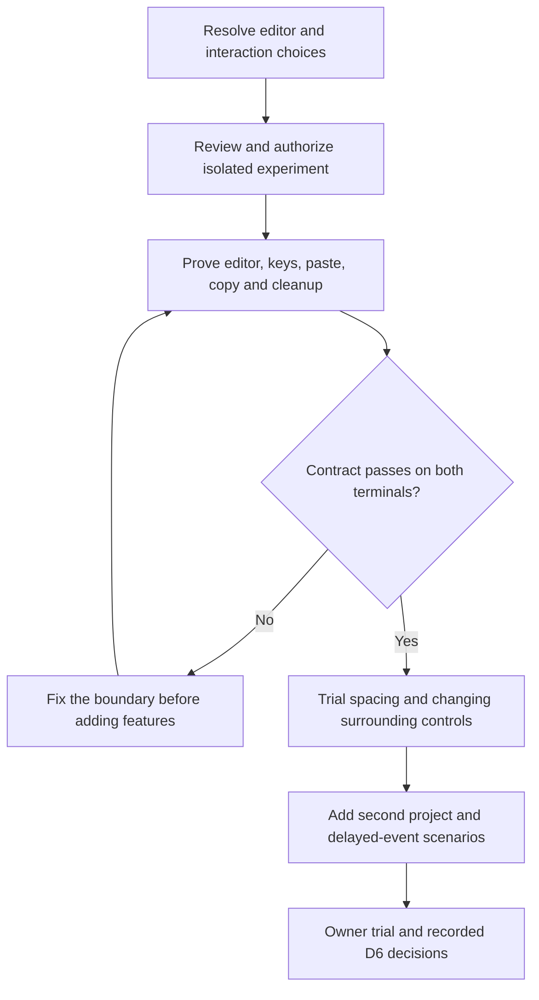

# TUI prototype preflight

Status: initial preflight investigation on 2026-09-24. At this checkpoint tooling
was available, but editor fit, interaction choices and experiment entry remained
open. The owner subsequently authorized proceeding. The
[implementation packet](../plans/tui-prototype-implementation.md) records closure
and the required executable qualification. Evidence below is the initial checkpoint;
no product code was written or run during that investigation.

The [prototype design](tui-interaction-prototype.md) owns the intended behavior.
This report owns evidence and readiness tracking. Recommendations below remain
proposals until incorporated into a reviewed implementation packet.

## Local evidence

| Check | Observed result | Proof limit |
| --- | --- | --- |
| Platform | macOS 27.0, build 26A428, arm64 | Does not establish terminal rendering or confinement |
| Rust and Cargo | Both report 1.98.0; active stable aarch64 macOS toolchain | Asura has no package, lockfile or resolved dependency graph yet |
| Quality tools | Clippy and rustfmt installed; Apple Clang 21.0.0 available | No build, lint or executable prototype test ran |
| Terminal applications | Ghostty 1.3.1, build 15212; Terminal.app 2.15, build 488 | Owner selected equal support from the first trial; actual input/rendering checks remain pending |
| Optional tooling | tmux 3.7c, cargo-nextest 0.9.132, `script` and `expect` present | None is required for the first slice or proof of an interactive terminal |
| Ghostty default bindings | Command+Enter is fullscreen; Command+C/V are copy/paste | Default listing only; active user overrides and physical key events were not verified |
| Tool input | Current command input is not a terminal | Pipe/PTY results cannot replace visual and physical-key checks |
| Repository | Documentation changes exist; no Asura Cargo manifest or lockfile | Preserve those changes; do not treat a dependency declaration as a successful build |

Evidence came from installed version/component commands, application bundle
metadata and Ghostty's documented `+list-keybinds --default` command. No global
configuration was changed. Primary references: [Ghostty keybindings](https://ghostty.org/docs/config/keybind)
and [Option/Alt behavior](https://ghostty.org/docs/config/reference#macos-option-as-alt).
The latter depends on keyboard layout and settings; a proposed shortcut still
needs a real-key check on the selected profile.

## Findings that affect the first build

### PF1: Editor compatibility is a real gate

The proposed `ratatui-textarea` 0.9.2 is not suitable unchanged for the existing
grapheme-preservation requirement. Source inspection found scalar-character
movement/deletion and scalar-based screen-column accounting. Soft wrapping at
grapheme boundaries does not make the rest of the editing model grapheme-safe.
Evidence: published [deletion code](https://docs.rs/ratatui-textarea/0.9.2/src/ratatui_textarea/textarea.rs.html#1149-1197)
and tagged [screen mapping](https://github.com/ratatui/ratatui-textarea/blob/ratatui-textarea-v0.9.2/src/screen_map.rs#L24-L62).

`rat-text` 3.1.0 is the preferred candidate for qualification. Its published
[TextCore contract](https://docs.rs/rat-text/3.1.0/rat_text/core/struct.TextCore.html)
uses grapheme-index cursor/selection positions. Published sources use grapheme
indexes for editing and the whole glyph string for ordinary glyph width.
Its Ratatui core/widgets/terminal
bridge dependency ranges fit the 0.30 family by declaration. This is not a resolved
or compiled dependency graph. Its larger dependency footprint, unstable rendered
line-info feature and terminal-dependent emoji behavior need qualification.
Sources: [published package metadata](https://docs.rs/crate/rat-text/3.1.0),
[published editing operations](https://docs.rs/crate/rat-text/3.1.0/source/src/text_area/text_area_op.rs),
and [published glyph widths](https://docs.rs/crate/rat-text/3.1.0/source/src/glyph2.rs).
The package's [VCS metadata](https://docs.rs/crate/rat-text/3.1.0/source/.cargo_vcs_info.json)
records commit `1a35c8ed26f187f4d11ac05556a0ff0dc080c420`. These source checks do not
prove runtime behavior. In particular, selection replacement and insertion need
qualification as one undo transaction. The documented word-wrap rules do not
establish comprehensive Unicode line breaking.

Use Ratatui 0.30.2, Crossterm 0.29.0 and Rust 1.98.0 as the proposed comparison
baseline, with the editor version and full transitive graph pinned after inspection.
Exercise combining marks, joined emoji, flags, skin-tone modifiers, selections,
undo and insertion that merges clusters. Include wrapped vertical movement,
resize and paste replacing a selection as one undo transaction on both terminals.

Do not begin a custom editor or silently narrow Unicode support. First identify
one reusable editor whose text and rendering models meet the contract, then pin
compatible dependencies and run focused acceptance tests in the authorized first
slice. If no candidate fits, bring the cost/scope decision to the owner before
implementation. A keybinding wrapper alone cannot correct an internal text model.

### PF2: Freeze submission and draft semantics

The owner selected Enter to send and an explicit Steer/Queue choice during active
work. The [submission contract](tui-interaction-prototype.md#submission-state-contract)
now defines this proposed fixture behavior and its races. The choice is required;
the detailed fixture semantics still need design review before implementation.

The prototype now proposes exact pending-draft behavior: after a valid action is
chosen, successful local validation detaches an immutable submission and starts
a new draft. An acknowledgement cannot clear newer typing. Rejected text remains recoverable,
and uncertain submission never triggers automatic replay. Review the complete
idle/working/decision/completed/disconnected action table before coding.

### PF3: Validate terminal input and copying before layout expansion

The owner selected Ghostty and Terminal.app equally from the first trial. Record
the font, size and keyboard layout for both. Neither terminal can be deferred to
a later compatibility pass. Avoid tmux in the first trial; it adds a separate
input/rendering path without answering the current interaction question.

Define a complete key map for send, newline, paste mode, selection/copy, focus,
Stop, dismiss, project selection and exit. Do not assign Command+Enter to sending:
the inspected Ghostty defaults consume it. Alt+Enter remains a proposal, and
Shift+Enter remains conditional on distinct event support. Preserve the owner's
Enter-send choice throughout.

Treat physical newline keys, bracketed paste and unsupported paste mode as
separate acceptance cases. The application must not pass terminal escape payloads
through as display commands. Select CRLF normalization, tabs and control-character
display/rejection rules. Require atomic rejection of an oversized paste.

Keep the proposed application-owned transcript for one initial trial. Before
adding navigation, scroll away during streaming, select/copy a multiline excerpt,
return to the latest output and resize. Record an acceptable copy path. This
trial must pass on both terminals before committing more interface work to that
viewport choice.

### PF4: Complete the bounded layout and event contract

The design has useful normal-state row budgets. It still needs exact compact
thresholds, control overflow, transcript/undo retention and event limits. Define
what happens at each bound, not only a maximum value. Keep input/draft data,
decisions and submission acknowledgements intact; only replaceable progress
updates may coalesce. An overfull command queue must reject visibly without
losing the draft or implying acceptance.

Freeze three visual states first: empty composer, multiline draft with a streaming
reply, and a scoped decision while the user edits. Apply Wisp's one-cell inset
and light tint treatment consistently. Compare these same states at 120x40,
80x24 and 40x12 before adding more controls.

### PF5: Make the first slice small and observable

Start with one editor, one transcript, one progress/decision notice and a scripted
driver. Add the second project immediately after those checks pass. Defer rich
capability displays, command/skill suggestions, real models, servers and alternate
viewport implementations. Their product requirements remain unchanged.

Use the same state update and renderer for interactive operation and deterministic
fixture tests. Version the event traces and control the clock. Capture fixture IDs,
terminal/profile versions, dimensions and expected state; avoid screenshots alone
as the correctness test. No general plugin framework or production control schema
is needed to test this slice.

### PF6: Close experiment entry and validation explicitly

The [design process](../design-process.md) includes executable experiments. The
[main plan](../plans/architecture-and-design.md#outcome) also requires system
boundaries before implementation. The early prototype remains a proposed,
independently scoped experiment feeding D6; this preflight does not infer an
exception or mark D6/I4 complete. Owner review must resolve that entry scope and
authorize the exact isolated paths, dependencies and synthetic execution boundary.

Pin the executable check commands with the final dependency choice. Proposed
commands from the future experiment directory are `cargo fmt --all -- --check`,
`cargo clippy --locked --all-targets -- -D warnings` and `cargo test --locked`.
These commands have not run against Asura and do not replace real-terminal trials.

Specify cleanup after partial setup, normal exit, recoverable I/O failure,
interruption and panic. An uncatchable kill cannot run process cleanup; describe
manual recovery rather than promising restoration in that case. Check restoration
of raw mode, alternate screen, cursor, paste mode and keyboard enhancement state.

## Smallest useful acceptance contract

Proposed trial criteria:

- Zero unintended sends or decision answers across the scripted race cases.
- Exact draft preservation across paste, undo, navigation, rejection and reconnect.
- No split grapheme, clipped cursor, overlapping control or background-style bleed
  in the declared text/size corpus; record terminal-specific display limitations.
- The owner can predict what Enter does and where the content goes in all three
  start/refine, switch and recover journeys. Record assistance and hesitation.
- Copying an excerpt and returning to live output are usable on both terminal
  profiles. A viewport that fails this criterion must be reconsidered immediately.
- Select a responsiveness target and fixed fixture burst before implementation.
  Measure input-to-paint and resize latency; synthetic correctness alone cannot
  establish interactive feel.

TP1-TP5 remain the canonical unit, integration and real-terminal experiment cases.
Service recovery, model quality, extension enforcement and release qualification
remain later product evidence. They are not prerequisites for this fixture trial.

### Order that limits rework

Proposed experiment gates. Arrows show prerequisites, with expensive interface
expansion held until editor and terminal assumptions have actual evidence.

The remaining work before implementation is a small contract and dependency
closure, not completion of the production backend. Report source inspection,
dependency resolution, compiled tests, terminal observation and owner judgement
as separate evidence states.

## Documentation verification

Independent read-only review found a gap between choosing an action and driver
acceptance. The revised design revalidates task identity, revision and active-task
preconditions at acceptance. TP2-TP4 now cover both race orderings, explicit choice,
draft recovery and delayed acknowledgements. A follow-up review confirmed closure
at the design level; it did not test an implementation.

Mermaid CLI 11.16.0 rendered the preflight diagram and updated prototype diagrams.
Both new diagrams were visually inspected. Overlapping labels in the submission
diagram were shortened and checked again. Local Markdown links, anchors and
whitespace were checked, as was `git diff --check`. Previews stayed outside the
repository. No Asura executable, dependency build or real-terminal trial ran.
