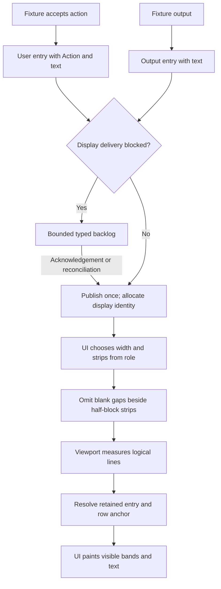

# User messages in the TUI transcript

Status: implemented visual change requested by the owner on 2026-09-24. This extends
the isolated [prototype](tui-interaction-prototype.md) and [composer](tui-composer.md).
It changes presentation and typed display metadata, not submission or task behavior.

## Presentation contract

Accepted user inputs in the main transcript use the composer's full-width band,
one-cell prompt inset and three-cell text inset. Show the submitted text alone
for a new turn. Prefix a steering or queued entry with `Steer  ` or `Queue  ` so
the action remains explicit without color. Do not add `You` before any user entry.
Show `›` beside the first content row. Continuation rows align with that text.
Assistant/fixture output keeps its existing one-cell inset and base background.

Use a slightly darker background than the active input pane in both palettes:

| Role | Dark | Light |
| --- | --- | --- |
| Active input | `#253b4e` | `#e2e8f0` |
| Submitted user input | `#1c2e3d` | `#d4deea` |

The dark active input uses Wisp deep. Wisp has no separate submitted-message
band, so Asura derives the darker shade. The light colours remain unchanged.

Text and prompt use the existing foreground and accent. Color is supplemental to
the labels and prompt. User bands reach both edges of the available transcript
rectangle, including empty cells and blank content lines. At widths of at least
60 and heights of at least 16 in the available application area, use the same
`▄` upper and `▀` lower strips as the input pane. Use the composer's strip
eligibility, not the smaller transcript rectangle's height. Compact layouts omit
those strips.

The half-block strips provide the vertical spacing around a full-layout user
band. Do not add a blank separator after that band or immediately before the next
band's upper strip. Keep one base-colored separator between undecorated entries;
compact layouts therefore retain their existing separation. Preserve blank lines
inside message text. Do not add borders or change the composer, tray or status bar.

The transcript remains clipped to its own rectangle. Scrolling into the middle
of an input preserves its background and continuation inset; do not repeat its
prompt or add a false upper edge. Resize recalculates wrapping with the correct
content width. Preserve Unicode graphemes and existing whitespace behavior.

## Ownership and interfaces

`model.rs` remains the only owner of display provenance. Introduce
`TranscriptEntry { kind: TranscriptKind, text: String }` with `Output` and
`User(Action)` variants. Assign `User` only when `Fixture::apply` accepts a new
turn, Steer or Queue. Keep existing display strings, text limits and ordering.
Fixture messages that quote user text remain `Output`, regardless of their text.
Do not infer roles from prefixes or maintain a parallel role collection.

Carry the typed entry unchanged through the display backlog and delivered
transcript. Pending, rejected and unknown inputs retain their existing tray and
recovery treatment. Do not publish an accepted entry before acknowledgement or
reconciliation. Reconciliation publishes once; display eviction removes text and
metadata together and preserves existing identity allocation. Count text bytes
explicitly against the existing 200-entry/256-KiB bounds in each collection.

`ui.rs` owns palette selection, content insets and drawing. `viewport.rs` owns the
entry/row anchor and the canonical measurement of display lines. Introduce a
presentation layout for each entry: its borrowed text lines, content width,
optional upper/lower strip lines and an optional separator. The UI includes the
separator only when neither the current nor next entry has half-block strips.
The last undecorated entry retains its separator. Keep at least one measured row
even for an empty entry whose separator is omitted. Measure each text line using the
same Ratatui Paragraph wrapping used to draw it. Strip and separator lines each
occupy exactly one row. Keep measurements as `usize`.

Change `TranscriptViewport::plan` to accept those measured entry layouts, the
base identity and available height. Preserve its entry, logical-line and wrapped
row offsets, reading mode and eviction reporting. Render only the visible portion
of each logical line with the remaining bounded `u16` wrapped offset. Never cast
a whole transcript's row count to `u16`. The minimum user text width is 26 cells
at 30 columns; narrower or shorter-than-three-row views preserve the anchor.

The renderer fills the visible user content rows before drawing their text.
Upper/lower strip colors use the user band against the base. Output and separator
rows use the base. Measurements and painting consume the same layout, preventing
scrolling from drifting when decorations or role-specific widths differ.

### Selected display flow

Arrows show local metadata and layout flow. Publication is the existing fixture
boundary; the presentation layer cannot accept work or infer delivery.

## Failure, security and validation

This is synthetic terminal-only rendering. No new dependency, protocol, storage,
thread, external service or configuration is introduced. Existing terminal cleanup
and draft ownership remain unchanged. Existing limits bound measurement work;
transcript retention cannot delete protected pending/recoverable input.

| Case | Unit | Integration | Process / visual |
| --- | --- | --- | --- |
| TS1: Typed provenance | All three user actions; output containing user-looking text; backlog/rejection/eviction metadata | Actual fixture acceptance and rendering | PTY accepted input gets user background; output does not |
| TS2: Matching bands | Darker palette and measured strips/content/separators | Actual buffers: both themes, full/compact/minimum geometry, multiline/wrapped Unicode and translated area | Inspect actual-buffer previews; native appearance remains owner judgement |
| TS3: Stable reading | Measured layout anchors through append, resize and eviction | Existing retention and maximum-multiline reachability regressions; scroll into a band | PTY resize/scroll and existing journeys; rerun responsiveness measurement |

Exercise the strip thresholds at 60x16, 59x16 and 60x15. Scroll onto actual
strip/separator rows and into wrapped content. A message clipped at the bottom
must not acquire an artificial lower strip.
Verify output-to-user, user-to-output and adjacent user bands have no additional
blank separator in full layouts. Undecorated output pairs and compact layouts
retain one separator. Reaching a lower strip remains a valid scroll position;
separators remain valid positions only where the spacing rule includes them.

Run format, Clippy, locked Rust tests/build and the PTY suite. Extend existing
tests and preview export; do not create another transcript implementation for
testing. Render and inspect the changed Mermaid and actual-buffer previews.
Report automated evidence separately from native visual acceptance.

The primary owns design, viewport, UI, cross-module mechanical migrations,
integration/process tests, documentation and visual review. A model delegate may
own only `src/model.rs`, including provenance/backlog unit tests, after design
review. No other delegate has write ownership.

## Recorded verification on 2026-09-24

The design received a read-only readiness review before implementation. The model
delegate changed only `model.rs`, then released ownership. Primary integration
preserved existing strings and tests while adding role-aware rendering and shared
layout measurements. A subsequent source review found no functional defect and
identified missing lower-strip/separator anchor coverage; the added integration
case exercises those positions and resizing across the strip thresholds.

- Format, Clippy with warnings denied and the locked build passed.
- 116 unit tests and 33 integration tests passed. The two ordinary ignored
  performance/export tests were also run explicitly and passed.
- All 33 named PTY/CLI checks passed, including truecolor user bands and output
  separation in both themes, resizing, existing interaction journeys and cleanup.
- The existing 1,000-batch responsiveness measurement recorded p95 14.661 ms and
  maximum 15.433 ms on Apple M4 Max in the debug profile. Its p95 target is 50 ms;
  this measures update plus TestBackend paint, not native input-to-paint latency.
- All 60 tour combinations were exported from completed Ratatui frame buffers.
  Six contact sheets and selected full-size scenes were visually inspected.
  Completed frames preserve wide-glyph continuation styles that terminal diffing
  omits from emitted backend cells. The editable Mermaid diagram was rendered
  with CLI 11.16.0 and visually inspected.

These results establish automated and synthetic visual behavior. The owner
subsequently confirmed the new treatment was visible and good, then requested
less vertical spacing because the half-cell edges already supply it.

### Spacing follow-up

The selected amendment removes blank separators beside full-layout half-cell
edges. Compact entries and pairs of undecorated output entries retain their
separator. Authored blank lines remain unchanged. Unit layout anchors, both-theme
actual-buffer assertions for adjacent user/output combinations, strip-threshold
resizing and PTY rendering cover the change. Completed frame buffers are used for
background assertions so wide-glyph continuation cells retain their actual style.
Combined qualification with the [composer reduction](tui-composer.md#cp6-and-transcript-spacing-follow-up)
passed 160 Rust tests and 34 CLI/PTY checks, plus lint, build, performance and
preview checks. Both updated Mermaid diagrams and actual-render previews were
visually inspected. New spacing has no separate native acceptance report.
No new physical-key behavior, production service, persistence, commit or push is
included.

### Prefix and Wisp palette follow-up

On 2026-09-25 the owner selected Wisp's dark palette and removed the `You`
prefix from submitted-message history. The typed `User(Action)` metadata remains
the source of role and action; only its display text changes. Existing provenance,
retention, spacing, and recovery rules still apply. Unit checks must verify each
action's exact display text without confusing quoted fixture output with user
history. Buffer and PTY checks must verify the prompt, spacing, band colours and
absence of the prefix at full and compact widths in both themes. Native colour
appearance in Ghostty and Terminal.app still needs separate owner observation.
