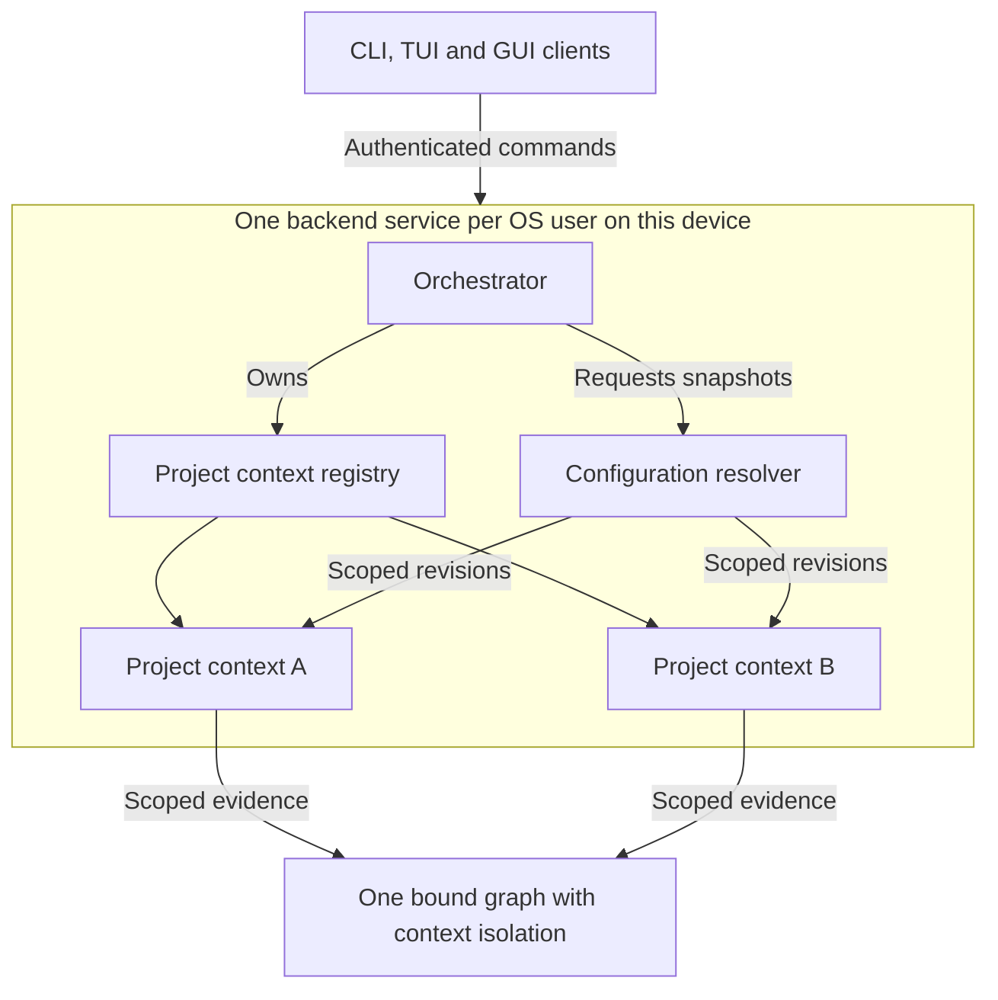
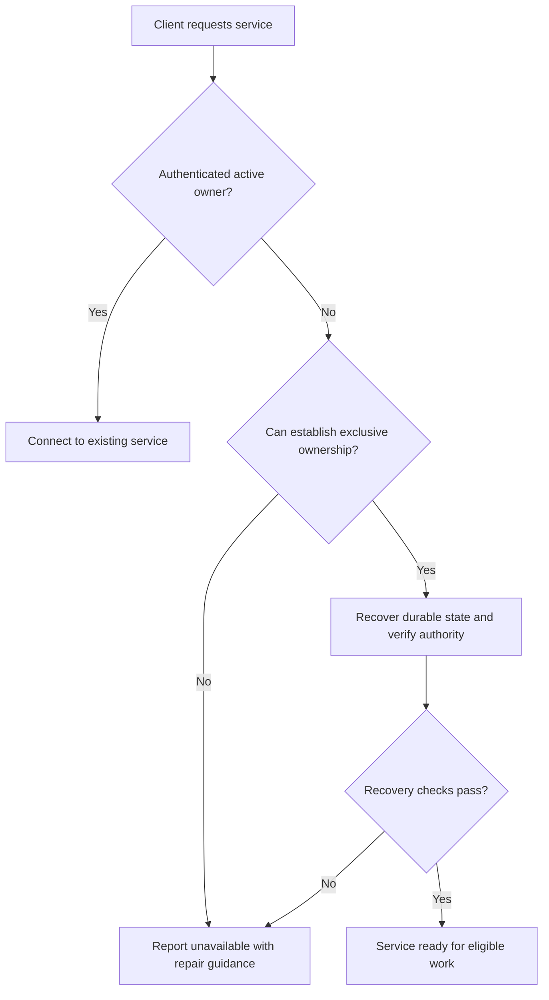
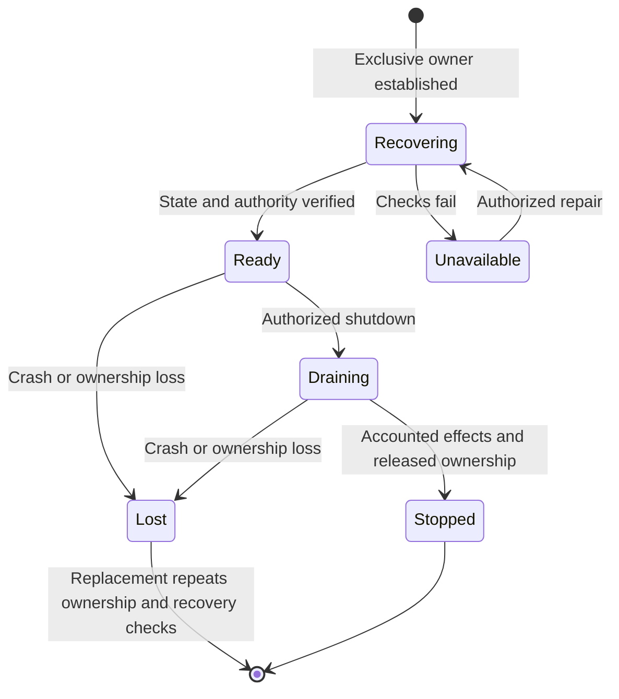
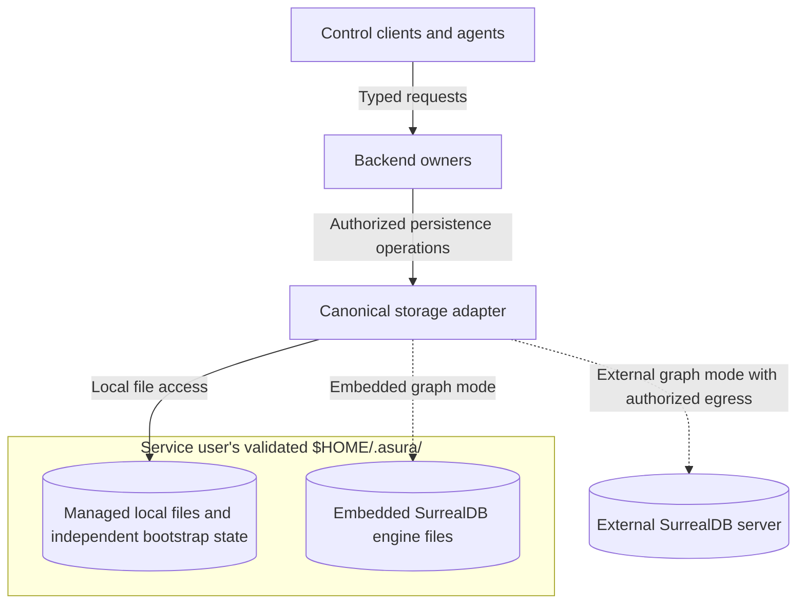
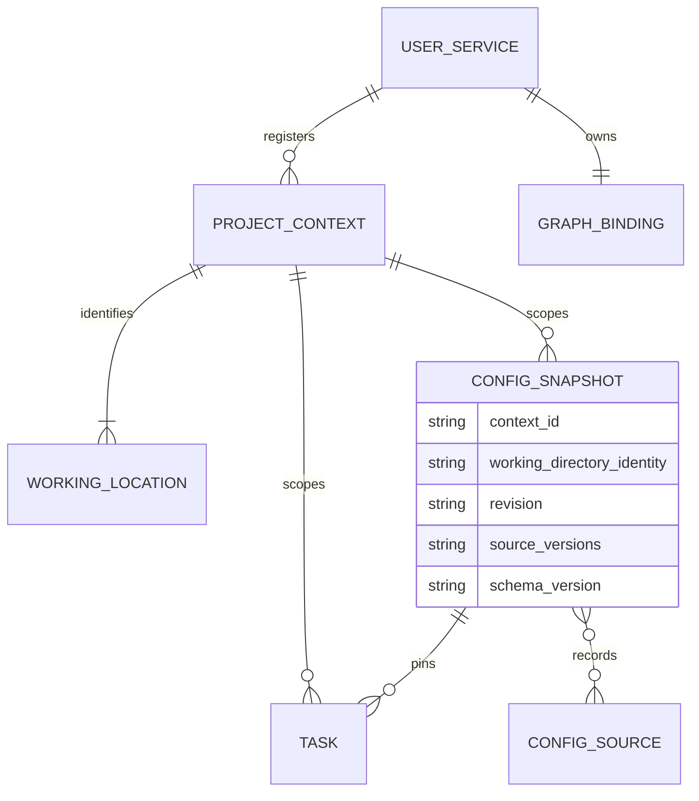
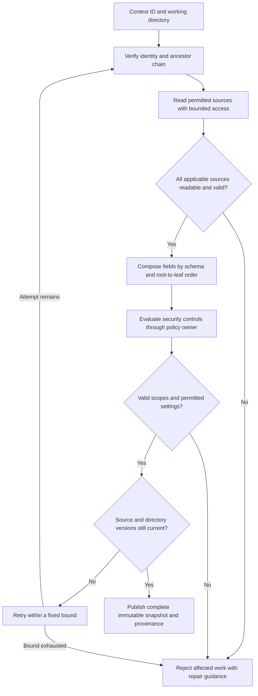
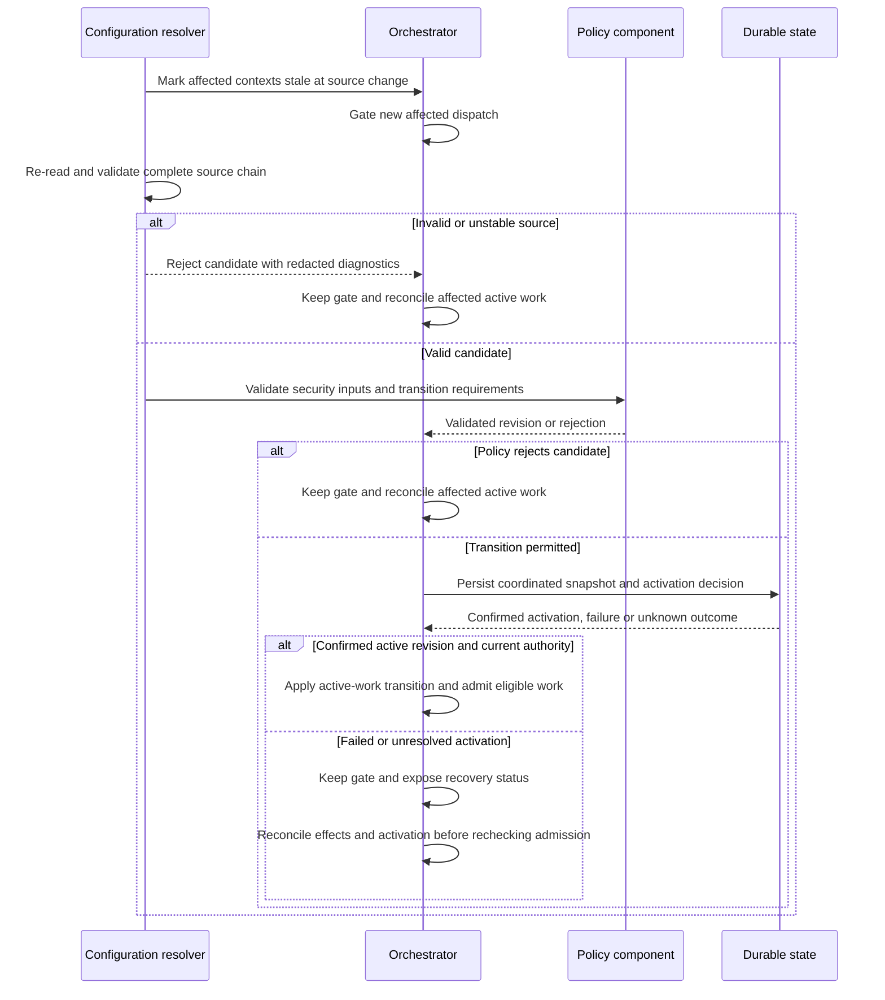

# Per-user service, project contexts and configuration

Status: required behavior selected in [ADR-0004](../decisions/0004-user-service-contexts.md),
with the per-user `$HOME/.asura/` root selected by the owner on 2026-09-24.
This brief defines ownership and composition rules. It is not implementation-ready.
Service supervision, schemas and filesystem consistency mechanisms remain open.
No runtime behavior is implemented or verified.

## Scope and ownership

On a user device, Asura runs one backend service per operating-system user.
CLI, TUI and GUI clients connect to that service. Opening a project, repository,
terminal or client does not create another backend. The service can manage many
project contexts and agent instances at the same time.

The orchestrator owns the context registry and service lifecycle. One configuration
resolver within the backend owns discovery, validation, composition and configuration
revisions. Under the proposed language allocation, these owners reside in Rust.
Clients display results from this resolver; they do not implement their own merge rules.
The canonical policy component continues to own authorization.

The service may use separate agent, model and host-helper processes. “One service”
means one active backend owner for the user, not one operating-system process.
Remote hosts retain their own identity and enforcement. D5 must define their
deployment topology; this decision does not prescribe a shared multi-user server.

### Service and context ownership

Required behavior. Arrows show requests or ownership. Helper process placement
and local transport are open D2 decisions. Policy, agent and remote boundaries
are shown in the [architecture views](../architecture.md#logical-component-and-trust-boundaries).

## Service identity and lifecycle

Required behavior:

- The service identity includes the host and OS user. A project path, terminal
  session or state-directory option must not create a second active owner.
- Concurrent client starts must converge on the same authenticated service.
  A stale endpoint or PID alone is not evidence of a live owner or permission
  to replace one. The startup contract must prevent two owners from dispatching.
- Closing a client does not terminate the service or imply task cancellation.
  Explicit service shutdown stops admission and follows the existing task and
  action settlement contracts. Restart must reconcile previously admitted work.
- A disconnected client can reconnect to the same project contexts and tasks.
  The service does not depend on the first client's working directory, environment
  or lifetime. Other OS users cannot attach merely because they know its endpoint.
- The backend schedules all contexts under applicable shared resource limits.
  A busy context must not prevent bounded status and cancellation processing.

D2's [standalone service design](system-architecture.md) proposes supervision,
endpoint discovery and duplicate-start prevention for I1; qualification remains.
D3 must define owner generations, durable registry recovery, shutdown semantics
and authentication. D0 must set responsiveness and concurrency targets.
Login, logout, sleep and upgrade behavior require explicit D2-D3 contracts.
No claim about a particular macOS service facility is made here.

### Service ownership and recovery

Required startup flow. Arrows name checks and outcomes. The mechanism that proves
exclusive ownership and fences an old owner remains a D2-D3 decision.

### Active owner lifecycle

Required states after ownership is established. Arrows name lifecycle events.
Recovering permits authenticated status and repair, but no task dispatch before
its admission checks. A replacement owner must repeat the startup checks above.

For this deployment, an **installation** is the persistent state scope of the
user's backend. Its one active graph binding can contain evidence for multiple
project contexts. A context switch must not select another database. Separate
installation identities remain relevant to other hosts and isolated validation
environments; they are not a way to run competing backends for one device user.

## Per-user home and hybrid persistence

Required behavior. Asura uses `$HOME/.asura/` as its per-user local state root.
Here, `$HOME` denotes the service user's validated home directory. An attaching
client's environment or working directory cannot redirect the backend's state.
Home-directory resolution and access checks remain D1-D3 mechanisms to design.

Asura stores some data as files and other data in SurrealDB. The directory root
does not select a file format, database schema or second source of authority.
The [hybrid storage contract](context-storage-candidates.md#hybrid-data-ownership-and-recovery)
owns the data split, cross-store consistency and recovery obligations.

Local Asura-managed persistent files belong under this root. Embedded SurrealDB's
engine files also belong under it, at a subpath that D3 must select. Those engine
files are the database's representation, not a separately editable copy of graph
records. An external SurrealDB's physical data remains at its configured server.
External mode still needs local bootstrap state; it must not initialize an
embedded graph merely to populate this directory.

Project source trees and repository instruction files remain at their working
locations. Credentials remain under the selected credential facility's contract;
the home directory requirement does not authorize plaintext secret files.
Clients and agents use owning backend contracts to access managed state. Knowing
the directory path grants no additional filesystem, credential or database access.

The orchestrator owns installation identity, initialization and recovery. The
configuration resolver owns effective settings and their provenance. The storage
adapter owns physical access under these owners' typed contracts. These backend
responsibilities follow D2's proposed Rust allocation; only the Rust chat client
and backend allocation is selected. Swift platform adapters may provide narrow
protected-file or credential operations after D1-D2 defines them. Swift
model services and control clients do not independently select the root or stores.
No new process boundary or Swift/Rust IPC mechanism is selected here.

### Local root and database boundary

Required placement and ownership view. Arrows show storage access through the
canonical adapter; dotted arrows identify mutually exclusive graph modes.
Subdirectory names, file schemas and helper process placement remain open.

### Proposed directory areas

Proposed mechanism for D3 review. These names organize the design discussion;
they are not a selected layout or instructions to create directories.

| Proposed area under `.asura/` | Intended role and unresolved placement |
| --- | --- |
| `config/` | Human-managed service settings and preferences; filenames and schemas remain open |
| `state/` | Protected local bootstrap and recovery metadata; exact records and atomic update mechanism remain open |
| `data/` | Embedded database engine files; engine choice and subdirectory remain open |
| `artifacts/` | Retained file payloads if D3-D4 selects file-backed artifacts; database references and retention require a contract |
| `cache/` | Rebuildable data only; eviction must not erase authoritative history or unresolved effects |
| `logs/` | Bounded redacted diagnostics if file logging is selected; required audit persistence is a separate contract |

D3 must select a physical home for each record before implementation. Task state,
conversation history, configuration snapshots and audit records are not assigned
to files or database tables by this proposal. D3 must also select format versions,
retention and compatibility rules. The same record must not have independently
writable authoritative copies in both stores.

Root override support, alternate installation roots, service socket/runtime paths,
numeric permission modes and the exact backup layout remain open. An override,
if later authorized and designed, cannot create another active owner for one user.
The root requirement does not select a socket location or a credential backend.
D1-D3 must specify private access, tamper and symlink/replacement handling before
any directory creation or state access is implemented.

## Project context identity

A **project context** identifies a registered project or repository and its
working locations. It is distinct from the evidence assembled for a model call.
A project can contain several repositories. A repository worktree has its own
working location, even when it shares repository history with another worktree.

The registry assigns a stable context ID. A command identifies that context and
its working directory explicitly. A client may request registration from a path;
the service validates and resolves it before returning a context ID. The backend
must not maintain a single mutable “current project” shared by all clients.

The directory hierarchy and the context registry are different structures.
Nested contexts can share ancestor configuration, but they do not inherit each
other's task state, model history or permission. Registration grants no filesystem
access. A repository remote URL is not a unique working-location identity.

D0-D3 must define canonical location identity, aliases, overlapping registrations,
worktree relationships and relocation. A moved, deleted or replaced directory
requires revalidation. It must not silently redirect an existing task. Graph
queries, events, caches and model sessions must carry the context scope required
by their owner. Cross-context evidence reuse requires explicit authorization and
provenance under the [harness contract](core-harness-brief.md#model-session-ownership-and-effective-context).

### Context and configuration relationships

Required logical relationships, not a physical schema. A source is a versioned
configuration document. A snapshot records an ordered set of sources, including
their trust and directory scope. D3 must define concrete IDs and retention.

## Directory discovery and composition

Required behavior. The resolver starts from the command's validated working
directory. It discovers applicable configuration at that directory and each
parent up to the filesystem root. It evaluates the discovered directory layers
from root to leaf. Repository and project roots do not stop parent discovery.
Configuration in siblings or descendants does not affect that command.

The service uses a verified canonical directory chain. A symlink alias must not
select a different policy chain for the same working location. The detailed
filesystem design must handle links, mounts, replacement and traversal races.
It must not assume that checking a path string makes a later access safe.

Directory discovery reads defined configuration locations only. It does not scan
subdirectory trees, execute configuration, run hooks, import arbitrary files or
fetch remote configuration. Any future include or interpolation feature needs
its own bounded, non-executing contract and source provenance.

Configuration has three classes:

| Class | Owner and permitted sources |
| --- | --- |
| Service settings | Authorized service administration; includes endpoint, graph binding, credential references and telemetry destinations |
| Context and task settings | Resolver combines schema-permitted defaults, user preferences, directory layers and explicit request overrides |
| Security controls | Canonical policy component evaluates authenticated policy sources and admitted restrictions |

For ordinary context settings, precedence is: built-in defaults, user preferences,
directory layers from root to leaf, then permitted explicit request overrides.
Every field must declare its allowed source scopes. A service-only field in a
repository file is an error, not a change to the service. Environment values are
not an implicit extra layer: clients must submit only schema-approved explicit
overrides. D3 must specify any supported service-start environment inputs.

Composition is schema-driven. A nearer value replaces an earlier scalar value
only when that field permits an override. Maps merge by declared child fields;
lists replace as a whole unless the field declares another operation. Absence
means inherit. Null is an error unless the field explicitly defines its meaning.
Unknown fields, type mismatches and conflicting source declarations are errors.
The schema must specify units, bounds and which fields permit reset or deletion.

Security constraints do not use ordinary last-value precedence. Directory depth
does not establish trust. Less trusted settings may narrow authority but cannot
increase permissions, raise an authoritative budget ceiling, select credentials,
redirect data to another destination or disable required audit. A repository policy
file remains untrusted until admitted through the policy administration contract.
The resolver must not become a second policy evaluator.

Discovery requires authorized read access. A genuinely absent configuration file
is an empty layer. An unreadable, malformed or unstable applicable source is an
error; it must not be treated as absent. Resource-limit failures have the same
result. Reject new affected work and explain the source and repair action with
redacted diagnostics. Status, cancellation and repair remain available.

Exact filenames, file encoding, schema grammar, user-preference placement within
the local state root and numeric limits remain D3 decisions. Source locations must be unambiguous; the
same file must not be applied twice as both user preferences and a directory layer.
Relative filesystem values are resolved against the declaring file's directory;
explicit request values use the validated request working directory. The schema
must identify such fields and record their resolved identity. Resolution does not
grant access outside the task's permitted locations.

### Resolution and rejection

Required algorithm. Arrows show resolver decisions. “Compose” handles ordinary
values; policy evaluation remains with the canonical policy component.

## Snapshots, changes and active work

Each accepted task pins a configuration snapshot for its context and working
directory. The snapshot records schema version, source versions, precedence,
effective values and source reasons. Secret values are excluded. Inspection
must show why a field has its value, including inherited and rejected settings.
Inspection and subscriptions require authorization for the context and sources.

Clients submit a stable request ID and, when acting on an inspected configuration,
its expected revision. A stale revision produces a conflict before new work is
admitted. Retrying an accepted request returns its recorded result rather than
creating a task with a different configuration. API schemas remain a D3 deliverable.

A valid ordinary-setting change applies to new tasks. Existing tasks retain their
snapshot until an explicit task revision is admitted. Security revocation, expiry
and lower authoritative limits still apply to active work; a pinned snapshot is
not continuing permission. Changed task inputs must invalidate model state when
required by the harness contract. Starting work in another directory requires an
explicit, validated task scope change or child task; a tool's `chdir` does not
silently adopt another configuration or gain authority.

On a detected source or ancestor change, the resolver marks affected branches
stale and gates new dispatch there until validation completes. A parent change
affects every registered descendant, including tasks whose service remains open
in another client. Unrelated branches remain available. An invalid replacement
does not activate in part or silently restore permission from an older revision.
Existing external effects use the normal stop and reconciliation contract.

D3 must coordinate configuration publication, policy activation and action
admission. Requests must not observe half of an update. File notifications alone
are insufficient: restart and admission need source validation too. D3 must define
the consistency boundary, bounded detection delay, activation point and how
dispatch is fenced during security changes. It must also define restart retention
for task snapshots and superseded policy revisions. These are readiness gates.

### Change processing

Required ordering for one affected branch. Arrows represent requests and durable
acknowledgements. The diagram does not select a transaction or watcher mechanism.

## Validation required before delivery

These are design acceptance cases. D7 must give each race and fault combination
an individual test ID. No tests have been implemented.

### C1: One user service

- **Initial state:** Several clients for one OS user, with no active service.
- **Trigger:** Start clients concurrently; then crash and restart the backend.
- **Required result:** One active owner; all clients observe the same registry.
  Recovered work cannot dispatch from both old and new owners. A different OS
  user cannot attach to this service or read its contexts.
- **Unit:** Owner-generation transitions and endpoint identity rejection.
- **Integration:** Concurrent starts, stale endpoint, owner loss and durable recovery.
- **End-to-end:** Two real clients reconnect to tasks in two projects; repeat
  with a separate OS user and during service shutdown.
- **Environment:** Supported macOS with real service lifecycle and OS identities.

### C2: Hierarchical composition

- **Initial state:** Root, parent, repository and nested-directory fixtures have
  overlapping settings. A sibling has unrelated settings.
- **Trigger:** Resolve requests in each branch with explicit request overrides.
- **Required result:** Deterministic schema-based composition with source reasons;
  parent discovery crosses repository roots. Sibling settings do not leak.
- **Unit:** Scalar, map, list, absence, null and forbidden-source rules.
- **Integration:** Real filesystem discovery, access denial, symlink aliases,
  directory replacement, malformed files and bounded traversal failures.
- **End-to-end:** CLI inspection and submitted task report the same snapshot;
  an unreadable parent or invalid override rejects affected submission.
- **Environment:** Supported macOS filesystem with controlled fixture permissions.

### C3: Context isolation and service settings

- **Initial state:** Two contexts share the service and graph, with distinct tasks,
  private evidence and permitted destinations.
- **Trigger:** One repository tries to replace the graph endpoint, expand access,
  raise a shared budget or read the other context's model history.
- **Required result:** Reject unauthorized changes and access. Preserve the
  service binding and context isolation. Registering a directory grants no rights.
- **Unit:** Field source restrictions, scope checks and policy narrowing.
- **Integration:** Scoped graph queries, event subscriptions, caches and sessions;
  run storage cases in embedded and external modes.
- **End-to-end:** Two clients select different contexts without changing each
  other's scope; prohibited effects are attempted and denied through real controls.
- **Environment:** Supported macOS and an actual external SurrealDB for that mode.

### C4: Parent changes and restart

- **Initial state:** Descendant contexts have running and queued tasks. A client
  holds an inspected revision; one action has an unknown external outcome.
- **Trigger:** Replace or remove parent configuration during admission, revoke
  policy, reject a policy candidate during an active effect, submit a stale
  revision, and restart during activation.
- **Required result:** No partial activation or stale-authority dispatch. All
  affected descendants are revalidated; unrelated branches remain usable.
  Preserve accepted request identity, task snapshots and unresolved effects.
- **Unit:** Dependency invalidation, revision conflicts and candidate rejection.
- **Integration:** Real file replacement, missed notifications, action-start races,
  activation persistence failures and restart at each persistence boundary.
- **End-to-end:** Inspect, change and repair a parent source through two clients;
  verify deterministic task settings, current permissions and available cancellation.
- **Environment:** Supported macOS with real persistence and enforcement.

### C5: Per-user root and storage ownership

- **Initial state:** Two clients attach to one service; their working directories
  and environment values differ. A separate OS user has a separate installation.
- **Trigger:** Initialize or reopen in each graph mode, alter a client's `HOME`
  value, substitute an unsafe state path, or remove existing bootstrap data.
- **Required result:** Both clients use the service user's validated `.asura`
  root and the same installation. Reject unsafe or missing existing state with
  repair guidance. Preserve the graph binding and separate users' state.
  External mode creates no embedded graph. No client writes managed state directly.
- **Unit:** Root-source validation, source-scope rejection, record ownership and
  initialization versus recovery decisions.
- **Integration:** Real filesystem ownership/access checks, path replacement and
  concurrent startup; persistent embedded storage and an authenticated external
  server. Verify no local graph creation in external mode.
- **End-to-end:** Attach two real clients from different projects, restart the
  service and recover the same history. Repeat under a separate OS user and
  verify denied access. Exercise missing-bootstrap recovery without empty history.
- **Environment:** Supported macOS with real identities, service lifecycle and
  both storage modes. D7 must give each fault and race a separate test ID.

## Remaining detailed design work

D0 defines context relationships and service workload targets. D1 defines source
trust, service endpoint protection, file-access authority and same-user adversary
limits. D2 selects service supervision and helper boundaries. D3 owns the detailed
configuration contract, durable identities, concurrency and recovery mechanisms.
D3 must resolve the proposed directory areas, exact record placement and any
root override before implementation. Coordinate hybrid backup and restore with
the [storage acceptance cases](context-storage-candidates.md#hybrid-storage-acceptance-cases).
D4 binds snapshots to graph retrieval, model sessions and tool execution. D5
defines remote context mapping and host-local configuration checks; local paths
must not be interpreted as paths on another host. D6 owns editing and explanation
workflows. D7-D8 consolidate evidence and review all boundaries before packets.

Configuration semantics must be designed in D3, before the agent loop consumes
them. D6 adds the user workflow; it must not introduce a second resolver.
