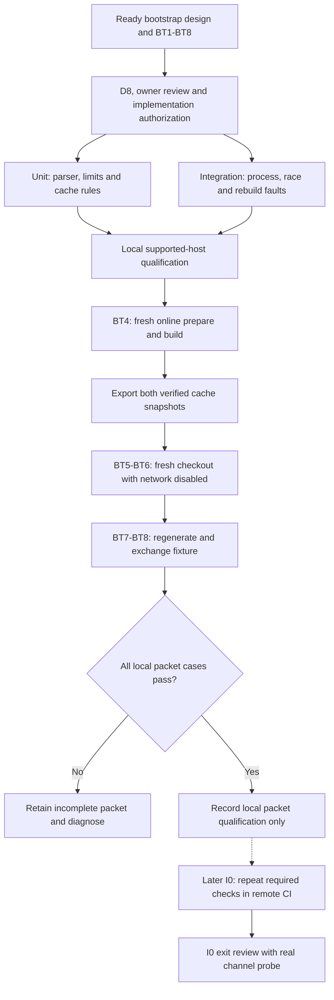

# D7 validation strategy

Status: proposed D7 design. This revision defines the first Protobuf toolchain
bootstrap packet's local evidence and its later I0 CI gate. It does not qualify
the full I0 model channel or the product release. D7 still must set the wider
test environments, model evaluations, performance budgets and canonical checks
for later increments.

## Evidence ownership and scope

The [bootstrap design](protobuf-toolchain-bootstrap.md) owns behavior and
acceptance cases BT1-BT8. This strategy owns where those checks run, how a
runner records evidence, and which result permits a completion claim. The
[implementation plan](../plans/implementation.md#i0-repository-and-contracts)
owns the I0 exit gate. A local pass may qualify the first packet on the tested
host after implementation authorization. It cannot complete I0 without the real
channel probe and remote CI evidence.

The check driver must report its source revision, tool-lock and Cargo-lock
digests, OS build, architecture, Xcode build, Swift version, Rust/Cargo versions,
mode, cache snapshot identity, elapsed time and BT case results. Logs must not
include prompts, credentials or private source content. The runner retains
failure category, bounded child output and artifact paths under an ignored
task-local directory. It must label a missing check as pending, not passed.

### First-packet evidence path

Selected packet validation flow. Solid arrows show required evidence order.
The dotted edge is the later I0 CI repetition; it does not block recording the
local packet result.

## Required first-packet environments

The first qualification host is macOS 27 on Apple silicon with Xcode 27.0 build
`27A266a`, Swift 6.4 and Rust/Cargo 1.98.0. The runner records the actual OS
build and tool identities. A different tuple needs a reviewed lock entry and
its own qualification. The local runner executes the designed commands
`scripts/check-i0-toolchain --prepare-only`,
`scripts/check-i0-toolchain`, and
`scripts/check-i0-toolchain --offline`.

BT1-BT3 run as unit and integration checks on the supported host. BT4 starts
from a clean checkout and empty caches with network access available. The
runner retains the verified tool and Cargo snapshots after preparation. BT5
restores those snapshots into a second clean checkout. The host disables
network access before that checkout's first build and keeps it disabled through
binding generation and fixture exchange. BT5 also removes the derived generator
and proves that the command rebuilds it under the worktree lock from verified
local source. The runner records the network state
and route evidence. A blocked proxy alone is insufficient because a tool could
bypass it. BT6 separately removes one required cached item at a time and checks
the failure stage and absence of fallback. BT7 changes the test schema, changes
the lock identity and removes generated output in separate runs. BT8 checks the
binary Rust–Swift fixture exchange and its timeout and cleanup failures.

BT3a-BT3h cover a busy worktree lock, independent worktrees, interrupted cache
replacement, a partially published snapshot pair and an incomplete run marker
after driver loss. Record each case separately. BT5a covers the offline generator
rebuild described above. Each case follows
the [bootstrap recovery contract](protobuf-toolchain-bootstrap.md#cache-replacement-and-recovery).
The driver must prove child cleanup before it reports success or permits cache
replacement. An unresolved child state requires an explicit failed check.

Each fault run uses its own isolated cache and output path. The runner must not
reuse a previously compiled bootstrap, generator, Rust binding or Swift binding
for a clean-build claim. It records the command, exit status, bounded logs,
observed artifact hashes and case verdict. A timed-out or missing check fails
the packet. Failed validation may prompt a design revision; the agent must
update the design before changing behavior or weakening an assertion.

## Deferred gates

### Early production status evidence

The proposed [status race cases PBS12-PBS14](production-bootstrap-status.md#detailed-status-race-cases)
require separate evidence for each named fault schedule. Unit checks cover
disclosure ordering, attachment retirement, observation ordering and expiry.
Integration checks use the real service transport, Git fixtures and controlled
collection/delivery barriers on supported macOS. End-to-end checks run in
Ghostty and Terminal.app and verify current status and preserved drafts.

D3 must select the publication, attachment and observation contracts first.
D7 must then name executable checks, host versions, bounds and evidence records.
The TUI experiment and the Protobuf fixture cannot qualify these service cases.
No runtime evidence exists for PBS12-PBS14.

### Remaining I0 and release evidence

Remote CI is deferred for the first packet by owner decision. Before I0 exit,
CI must run the same BT1-BT8 checks on a qualified supported runner and retain
the same provenance. It must also run the later full `check-i0 --offline` with
the real Protobuf channel schema, numeric probe limits and BP1-BP31 cases.
No local smoke fixture can substitute for that channel or for actual model,
service, confinement or release evidence.

The wider D7 strategy remains open. D7 must map every delivered requirement to
unit, integration and end-to-end IDs; define supported macOS and multi-host
environments; choose model datasets and thresholds; set fuzz, property and
performance checks; and name canonical release checks. These decisions belong
to their governing designs before their implementation packets begin.
