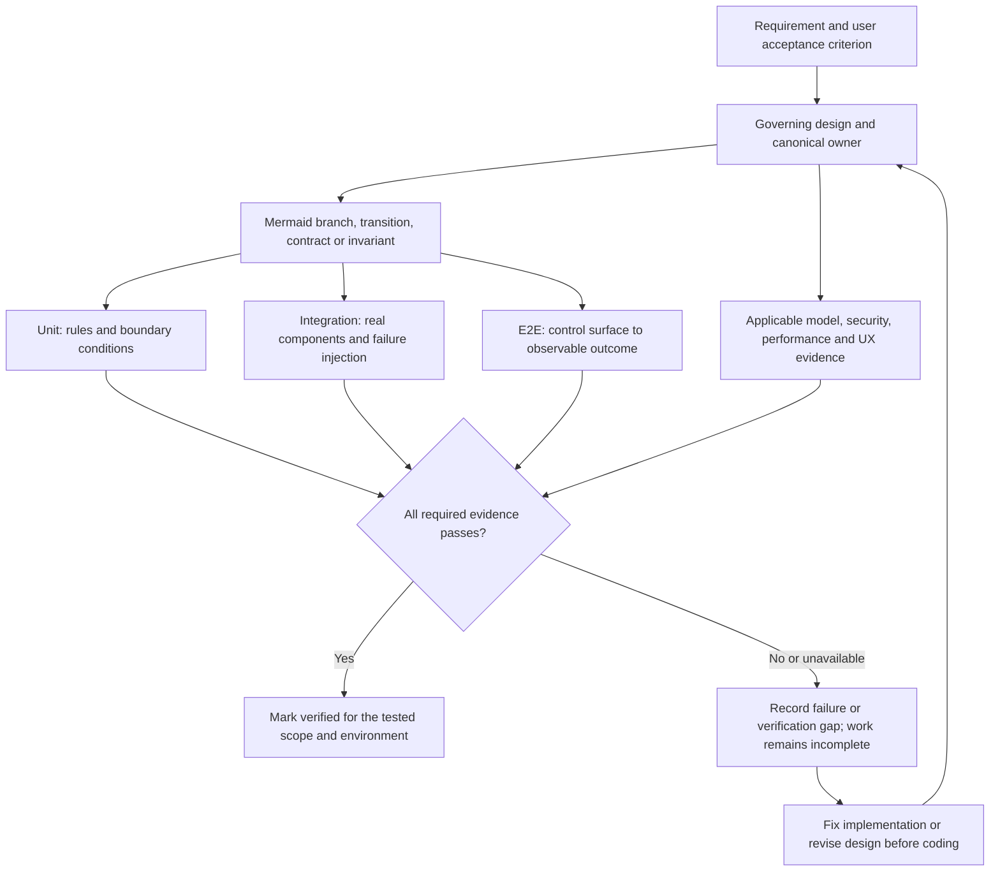

# Engineering and testing standards

## Design and ownership

Every code change must follow a governing design under the
[design process](design-process.md). Prefer cohesive components with explicit
contracts and one owner for each behavior. Search for existing implementations
before adding capabilities. Reuse through the owning component; do not copy
business logic across clients, agents, or adapters.

Keep dependencies directional and document them in the design. Separate model
inference, I/O, time, persistence, and transport from logic that can be evaluated
deterministically. This separation must support testing without creating a
parallel implementation used only by tests.

## Required test layers

Every element of production code must be covered by the testing strategy.
Every delivered behavior must be traced to unit, integration, and end-to-end
tests at the appropriate boundaries. The layers are complementary and cannot
substitute for one another.

| Layer | Required evidence |
| --- | --- |
| Unit | Component rules, state transitions, input validation, boundary conditions, and failure decisions in isolation |
| Integration | Actual interactions between components and dependencies, including protocols, persistence, process boundaries, and OS enforcement where applicable |
| End-to-end | User-observable workflows through a real control surface, orchestrator, and agent execution, including relevant failure and recovery paths |

Tests must assert externally meaningful behavior or invariants rather than mirror
implementation details. Cover success, rejection, partial completion, and failure.
Exercise concurrency, cancellation, timeout, retry, replay, reconnect, and restart
where those concepts apply. Verify that repeated requests cannot silently repeat
non-idempotent effects.

### Requirement-to-evidence traceability

Required validation flow. Arrows denote specification/test derivation or evidence
needed by the completion gate; the three test layers are cumulative requirements.

Security tests must include denied actions and attempts to cross the designed
trust boundaries. OS confinement claims require tests of actual OS enforcement
on supported macOS hosts. Remote execution claims require evidence across the
relevant host boundary.

## Model-driven behavior

Use controlled model substitutes for deterministic unit tests and fault injection.
Separately evaluate actual on-device model behavior against versioned,
representative cases with defined acceptance criteria. Evaluate classification,
delegation, tool selection, invalid output, and adversarial inputs as applicable.

Model evaluations complement unit, integration, and end-to-end tests. Mock success
does not establish model quality, and model output alone does not prove a tool
executed or an authorization boundary held.

## Test execution and evidence

Define the test runner, canonical check commands, required environments, and CI
gates in a design before implementation begins. No such commands exist yet.
Required tests must be available and runnable as part of the delivery process;
missing hardware, credentials, or runners are validation gaps, not passing results.

Keep tests isolated, repeatable, and bounded in time and resource use. Do not
depend on arbitrary sleeps for synchronization. Control nondeterministic inputs
and retain enough failure evidence to diagnose regressions without leaking secrets.

Coverage reports identify unexercised code but do not establish assertion quality.
Do not add empty assertions, implementation-mirroring tests, exclusions, or broad
skips to meet a number. Coverage policy and thresholds must be defined with the
test infrastructure; all required test layers remain mandatory.

## Operational and UX validation

Measure performance against the workloads and limits defined in the design.
Include responsiveness under concurrent work and model inference, bounded memory,
and behavior when telemetry collection is unavailable.

Validate configuration precedence, progress reporting, user decisions,
accessibility, and recovery workflows through the supported surfaces. Automated
checks and usability review provide different evidence; record both where required.

## Completion criteria

A change is complete only when:

1. Its design and contracts describe the delivered behavior and ownership.
2. Its implementation respects that design and introduces no duplicate owner.
3. Required unit, integration, end-to-end, and applicable model/security/performance
   validation pass in the environments needed to support the claims.
4. User documentation and operational guidance reflect the change.
5. The handoff identifies the governing design, changes, validation commands and
   results, and any remaining limitations.

If required validation cannot run, describe the work as incomplete or unverified
in that respect. Do not imply that narrower evidence proves the full behavior.
