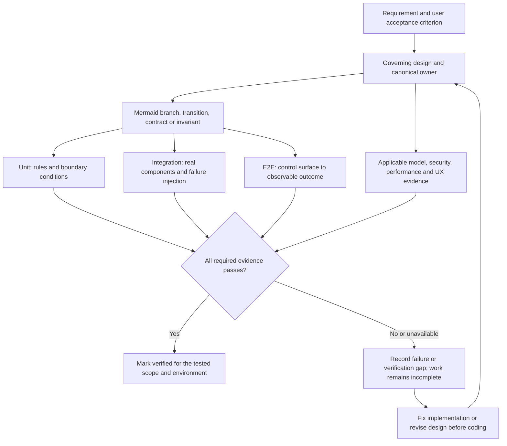

# Engineering and testing standards

Status: required engineering and testing practice. The proposed
[coding standards and enforcement rules](coding-standards.md) add detailed coding
discipline and a rule-to-check contract. That draft awaits owner review; it does
not change the active design gate or claim that automated checks exist.

## Design and ownership

Every code change must follow a governing design under the
[design process](design-process.md). Prefer cohesive components with explicit
contracts and one owner for each behavior. Search for existing implementations
before adding capabilities. Reuse through the owning component; do not copy
business logic across clients, agents, or adapters.

Use the [writing standard](writing-standard.md) for specifications and test
descriptions. Each acceptance case must state the initial state, trigger and
observable result. Give independently testable failures and races stable IDs.

Keep dependencies directional and document them in the design. Separate model
inference, I/O, time, persistence, and transport from logic that can be evaluated
deterministically. This separation must support testing without creating a
parallel implementation used only by tests.

## Wire protocol change authority

This rule covers all format, API and protocol version numbers. The wire protocol
stays at **0.1**. The journal format stays at **1**. Change these or other format,
API or protocol version numbers only on the repository owner's explicit instruction.
Feature work and schema changes do not authorize a number increase.

Schemas and operations may evolve within the current numbers for authorized feature
work. Follow the normal design, ownership and testing rules. Keep producers,
consumers, contracts, fixtures and generated bindings consistent. Document effects
on existing data and peers; an unchanged number does not prove compatibility.
Preserve data and define rejection or recovery for incompatible records. This rule
does not authorize deleting user data or silently treating incompatible data as valid.
Schema work does not require separate permission merely because a message or record
changes. Follow the [iteration rules](design-process.md#iteration-and-escalation).

## Asynchronous execution and recovery

Status: mandatory implementation rules for the architecture selected in
[ADR-0006](decisions/0006-async-event-pipelines.md). These rules are active;
they do not depend on approval of the separate coding-standards draft.

Asura must be asynchronous, nonblocking, reliable, recoverable and scalable
throughout the product. This includes clients, orchestration, storage, model
calls, tools, transports and platform adapters. Startup, idle operation,
reconnect, cancellation and shutdown have the same obligations as normal work.

| Rule | Required behavior |
| --- | --- |
| AE-01: Responsive execution | Control, rendering and scheduler paths must yield while external work is pending. They must not wait synchronously for inference, storage, network, child processes or slow terminal consumers. Each handler must have a finite work budget. |
| AE-02: Blocking boundaries | Designs must identify potentially blocking calls, including dependency internals, filesystem/account lookup, locks, flushes, process waits and thread joins. Unavoidable blocking APIs must run behind a bounded isolation boundary. A wrapper named `async` does not change the underlying behavior. |
| AE-03: Resource bounds | Each boundary must specify numeric payload, queue, concurrency and memory limits. It must define admission, backpressure and overload results. Do not create an unbounded thread, task or queue for incoming work. Independent contexts must not starve each other's controls. |
| AE-04: Time and cancellation | Each blocking boundary must have a defined deadline and cancellation owner. Conversation generation uses the owner-selected [cancellation-driven lifetime](designs/model-provider-integration.md#cancellation-driven-turn-lifetime--selected-2026-09-30), with no fixed whole-turn expiry. Partial progress and retries must not silently reset an absolute deadline. Cancellation must stop new admission and reach pending work. A timeout must state whether the operation stopped, continues, or has an unknown outcome. |
| AE-05: Recovery and effects | Owners must define retry, idempotency, reconnect, restart and reconciliation. Preserve accepted work and required outcome evidence. Do not retry an effect with an unknown outcome until its contract makes that safe. Reject stale results using the designed identities and generations. |
| AE-06: Lifecycle settlement | Startup and shutdown must remain bounded and independent of stalled dependencies. Define ingress closure, draining, resource ownership, child lifetime and recovery. Detaching a worker is allowed only under an explicit ownership and process-lifetime contract; it must not conceal unfinished effects or leak resources. |
| AE-07: Runtime evidence | Verify responsiveness, bounds and recovery under the failures below. Happy-path tests, mocks, `async` syntax and background-thread placement do not prove compliance. Missing required evidence blocks a completion claim for the affected scope. |

A bounded synchronous wait on a control path still violates AE-01. A finite
readiness poll that yields to input, signals and deadlines is permitted by its
selected reactor design. Moving a blocking call to a worker does not satisfy
AE-02 unless worker count, cancellation and settlement are also defined.
A local in-memory operation may remain synchronous when its work is bounded.
These rules do not select an async runtime or require a new scheduler.

### Required failure evidence

Each governing design must select numeric acceptance limits and map applicable
cases to unit, integration and end-to-end tests. Explain inapplicable cases.
Use the existing [pipeline diagrams](decisions/0006-async-event-pipelines.md#pipeline-responsibilities)
for ownership and the [durable delivery sequence](decisions/0006-async-event-pipelines.md#durable-control-and-event-delivery)
for effect ordering; do not introduce a second lifecycle owner.

- Leave the client idle, then send input without an extra wakeup event.
- Stall a backend, model, storage operation or child process while controls remain usable.
- Exercise partial input, simultaneous signals, slow output and queue saturation.
- Cancel and exit during startup, active work and dependency failure.
- Disconnect or crash around acceptance and completion; verify retry and recovery without duplicate effects.
- Increase concurrent contexts and workload to the designed limits; measure latency, memory and fairness.

A component must disclose unavailable or uncertain state while recovery proceeds.
It must not present a stalled operation as success or fabricate progress.
Record tested environments and remaining dependency or OS limitations explicitly.
A known blocking path is a defect or a scoped proof gap, not an architectural
exception merely because it is rare. This decision does not claim that all
existing code has already met these rules.

## Required test layers

Every element of production code must be covered by the testing strategy.
Every delivered behavior must be traced to unit, integration, and end-to-end
tests at the appropriate boundaries. The layers are complementary and cannot
substitute for one another.

| Layer | Required evidence |
| --- | --- |
| Unit | Component rules, state transitions, input validation, boundary conditions, and failure decisions in isolation |
| Integration | Actual interactions between components and dependencies, including protocols, persistence, process boundaries, and OS enforcement where applicable |
| End-to-end | User-observable workflows through a real control surface, orchestrator, and agent execution, including relevant failure and recovery paths |

Tests must assert externally meaningful behavior or invariants rather than mirror
implementation details. Cover success, rejection, partial completion, and failure.
Exercise concurrency, cancellation, timeout, retry, replay, reconnect, and restart
where those concepts apply. Verify that repeated requests cannot silently repeat
non-idempotent effects.

### Requirement-to-evidence traceability

Required validation flow. Arrows denote specification/test derivation or evidence
needed by the completion gate; the three test layers are cumulative requirements.

```mermaid
flowchart TD
    Req["Requirement and user acceptance criterion"] --> Design["Governing design and canonical owner"]
    Design --> Diagram["Mermaid branch, transition, contract or invariant"]
    Diagram --> Unit["Unit: rules and boundary conditions"]
    Diagram --> Integration["Integration: real components and failure injection"]
    Diagram --> E2E["E2E: control surface to observable outcome"]
    Design --> Extra["Applicable model, security, performance and UX evidence"]
    Unit --> Gate{"All required evidence passes?"}
    Integration --> Gate
    E2E --> Gate
    Extra --> Gate
    Gate -->|Yes| Complete["Mark verified for the tested scope and environment"]
    Gate -->|No or unavailable| Gap["Record failure or verification gap; work remains incomplete"]
    Gap --> Review["Fix implementation or revise design before coding"]
    Review --> Design
```

Security tests must include denied actions and attempts to cross the designed
trust boundaries. OS confinement claims require tests of actual OS enforcement
on supported macOS hosts. Remote execution claims require evidence across the
relevant host boundary.

## Model-driven behavior

Use controlled model substitutes for deterministic unit tests and fault injection.
Separately evaluate actual on-device model behavior against versioned,
representative cases with defined acceptance criteria. Evaluate classification,
delegation, tool selection, invalid output, and adversarial inputs as applicable.

Model evaluations complement unit, integration, and end-to-end tests. Mock success
does not establish model quality, and model output alone does not prove a tool
executed or an authorization boundary held.

## Test execution and evidence

Define the test runner, canonical check commands, required environments, and CI
gates in a design before implementation begins. The
[isolated TUI packet](plans/tui-prototype-implementation.md#validation-and-completion)
defines experiment checks. Production command regressions use the
[mandatory CLI lifecycle gate](designs/early-production-status-slice.md#mandatory-command-regression-execution).
Required tests must be available and runnable as part of the delivery process;
missing hardware, credentials, or runners are validation gaps, not passing results.

For a user-reported defect, add a regression at the boundary that failed. Include
the reported initial state, repeated use and restart where relevant. Test both
the real service reply and user-visible feedback for command failures. A unit
test that injects formatted success does not prove the service/client mapping.
Put deterministic regressions in the normal Cargo test path before declaring
the fix complete. Optional native-model checks supplement that path.

Every command must have a Mermaid flowchart in its governing design or the
command-flow index. Show validation, dispatch, success, rejection, timeout,
cancellation and retry where applicable. Label inapplicable outcomes explicitly.
Compare each branch with implementation and tests before declaring it verified.
Render and inspect changed charts under the design process. A chart alone is
not evidence that its implementation handles the outcome.

Keep tests isolated, repeatable, and bounded in time and resource use. Do not
depend on arbitrary sleeps for synchronization. Control nondeterministic inputs
and retain enough failure evidence to diagnose regressions without leaking secrets.

Coverage reports identify unexercised code but do not establish assertion quality.
Do not add empty assertions, implementation-mirroring tests, exclusions, or broad
skips to meet a number. Coverage policy and thresholds must be defined with the
test infrastructure; all required test layers remain mandatory.

## Operational and UX validation

Measure performance against the workloads and limits defined in the design.
Include responsiveness under concurrent work and model inference, bounded memory,
and behavior when telemetry collection is unavailable.

Validate configuration precedence, progress reporting, user decisions,
accessibility, and recovery workflows through the supported surfaces. Automated
checks and usability review provide different evidence; record both where required.

## Completion criteria

A change is complete only when:

1. Its design and contracts describe the delivered behavior and ownership.
2. Its implementation respects that design and introduces no duplicate owner.
3. Required unit, integration, end-to-end, and applicable model/security/performance
   validation pass in the environments needed to support the claims.
4. User documentation and operational guidance reflect the change.
5. The handoff identifies the governing design, changes, validation commands and
   results, and any remaining limitations.

If required validation cannot run, describe the work as incomplete or unverified
in that respect. Do not imply that narrower evidence proves the full behavior.
