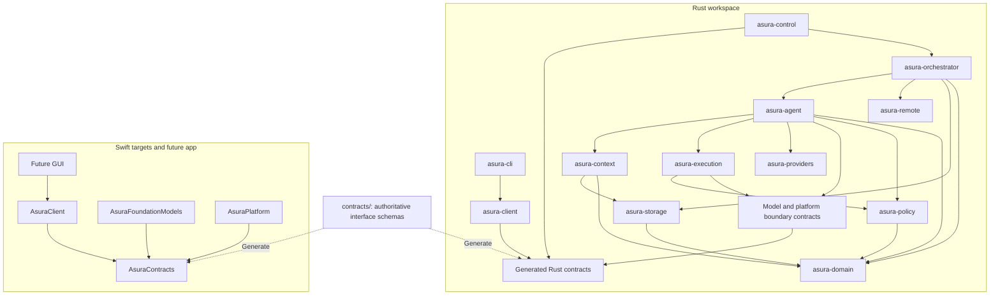
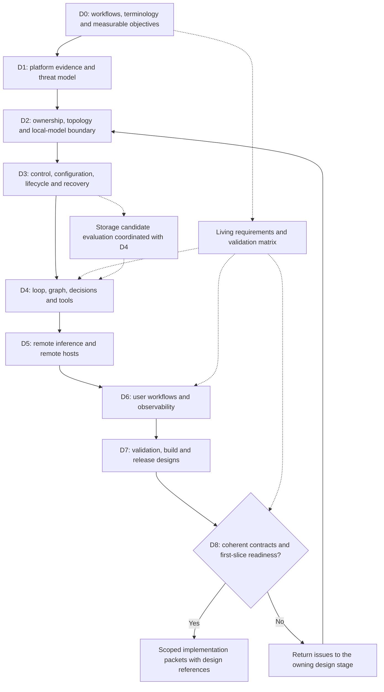
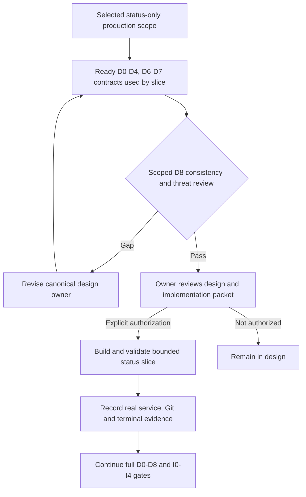

# Architecture and design production plan

**Status: Proposed mechanism.** This plan sets the order of design work.
Swift and Rust are selected. Ratatui and the Rust chat backend are selected in
[ADR-0005](../decisions/0005-default-ratatui-chat.md). Remaining component allocation,
repository layout, protocols and runtime mechanisms remain open.
The asynchronous, event-driven architecture and input/signal pipelines are
required by [ADR-0006](../decisions/0006-async-event-pipelines.md).

**Required behavior:** Production work remains within design and planning. Repo owners must
review the design and implementation plan, then explicitly authorize implementation.
The owner separately authorized the [isolated TUI experiment](tui-prototype-implementation.md)
after preflight on 2026-09-24.
The [decision index](../decisions/README.md) records selected behavior and its rationale.
Use the [writing standard](../writing-standard.md) and [glossary](../glossary.md).

## Outcome

Produce a coherent architecture, scoped implementation designs, decision records,
test specifications, and bounded implementation packets. Establish the whole
system's boundaries before production implementation, then finish each feature's
detailed design before coding it. GUI-specific behavior awaits the user's
additional requirements; its client boundary must be supported from the start.

The [architecture baseline](../architecture.md) is the requirements authority.
The [core harness brief](../designs/core-harness-brief.md) supplies proposed loop
and context-graph semantics for investigation. This plan owns sequencing and
deliverables rather than duplicating their specifications.

The [user-service brief](../designs/user-service-configuration.md) fixes one backend
per device user, multiple project contexts and hierarchical configuration.
D2-D3 must resolve its mechanisms before D4 consumes those contracts.

## Proposed language ownership

The table remains a proposed full-system allocation. The Rust chat client/backend
choice is selected; D2 must refine its module boundaries within the existing
per-user service. Ratatui owns terminal presentation, not backend orchestration.

| Owner | Language | Responsibility |
| --- | --- | --- |
| Orchestrator | Rust | Scheduling, task lifecycle, durable transitions, shared budget reservations and usage records, agent coordination, control API |
| Configuration resolver | Rust | Directory discovery, field composition, source provenance and immutable snapshots within the backend |
| Agent core | Rust | Bounded step semantics, action proposals and lifecycle coordination, budget requests, progress and termination rules |
| Context subsystem | Rust | Graph semantics, provenance, retrieval, context assembly, invalidation |
| Policy and execution | Rust | Canonical capability evaluation, execution coordination, tool registry and contracts |
| Local-model port and selection | Rust | Semantic operation and capability contract, eligible implementation selection, task and context identity |
| First local-model implementation | Swift | macOS Foundation Models sessions, availability and model-specific limits |
| Native platform services | Swift | Narrow adapters to selected macOS security, identity, and lifecycle facilities |
| CLI/TUI | Rust | Ratatui chat presentation and control-client interactions through a reusable client library |
| GUI | Swift | Future native interface using the same semantic control contract |
| Remote integrations | Rust | Remote AI adapters and remote Asura host coordination as separate modules |

This allocation gives orchestration state one owner and keeps Apple framework
integration explicit. Validate it against concurrency, packaging, API support,
performance, and security evidence. A module is not automatically a process.

### Proposed module and language dependencies

Proposal for D2. Solid arrows mean the source consumes the target's contract;
dotted arrows mean bindings are generated from one schema source. This is a
module view, distinct from the architecture's runtime data-flow diagram. Host
composition wires these modules together and is omitted from the dependency view.



The [local-model boundary](../designs/swift-rust-boundary.md#capability-selection-and-portability)
admits alternative platform implementations through one Rust-owned semantic port.
The [selected supervised Swift process](../decisions/0009-supervised-local-model-helper.md)
connects the first macOS implementation through a private IPC binding. It is
not a second model or policy implementation. Cross-cutting
telemetry consumes boundary events and must not create reverse domain dependencies.

The rejected in-process FFI alternative would share crash fate and require
explicit buffer, executor, callback and cancellation contracts. D2 must still
specify IPC identity, framing, versioning, backpressure, restart and outstanding
request recovery. A separate process does not grant security automatically.
Avoid per-token or per-node language crossings unless measurements justify them.

## Proposed repository layout

This tree is a design proposal, not a scaffolding task. Create members only when
their governing design and implementation packet are ready.

[Nested instruction files](../designs/repository-agent-configuration.md#directory-scoped-instructions)
are selected for directory-specific guidance. Include each language's `AGENTS.md`
when its code tree is introduced; the remaining layout below is still proposed.

```text
asura/
  AGENTS.md
  README.md
  docs/
    architecture.md
    engineering.md
    design-process.md
    plans/
    designs/                    # canonical subsystem specifications
    decisions/                  # rationale and alternatives
  contracts/                    # authoritative cross-language wire/bridge schemas
  rust/
    AGENTS.md                   # Rust-specific instructions and canonical rule links
    Cargo.toml                  # Cargo workspace
    crates/
      asura-domain/             # IDs, task/action states, domain invariants
      asura-orchestrator/       # scheduling, lifecycle and durable coordination
      asura-agent/              # agent loop
      asura-context/            # graph and context assembly
      asura-storage/            # persistence adapters and migrations
      asura-policy/             # canonical authorization rules
      asura-execution/          # tool lifecycle and host enforcement coordination
      asura-control/            # server protocol adapter
      asura-client/             # shared Rust control client
      asura-providers/          # remote inference adapters
      asura-remote/             # remote host protocol adapter
      asura-observability/      # shared Rust telemetry setup
      asura-cli/                # CLI and TUI presentation
      asura-host/               # host composition and process entry points
  swift/
    AGENTS.md                   # Swift-specific instructions and canonical rule links
    Sources/
      AsuraContracts/           # thin adapters; generated model bindings are build outputs
      AsuraFoundationModels/   # model session adapter
      AsuraPlatform/           # native macOS adapters
      AsuraModelService/       # entry point if process boundary is selected
      AsuraClient/             # future GUI control client
    Tests/
  apps/
    macos/                     # future GUI target; create after its design
  tests/
    contracts/                 # shared compatibility fixtures
    integration/               # cross-language and process scenarios
    e2e/                       # user workflows
    security/                  # adversarial host/control scenarios
    performance/               # reproducible benchmark workloads
  Package.swift                # root SwiftPM package; Swift targets remain under swift/
  evals/                       # versioned model-decision cases and scoring
  scripts/                     # designed build and quality entry points
```

Local unit tests stay with their owning Swift target or Rust crate. Cross-system
tests use the root suites. Shared schemas produce bindings; handwritten competing
definitions are prohibited. Protocol schemas do not become a second domain-policy
implementation. Decide in D2 which boundaries warrant separate crates or targets;
collapse purely organizational splits before scaffolding.
The first private Rust–Swift model-channel bindings are generated during the
build from one schema with pinned local tools. Neither language checks those
generated files into its source tree. A Swift target may keep thin handwritten
adapters under `AsuraContracts`; its generated model bindings live in derived
build output, as do Rust's generated model bindings.

## Design sequence and exit gates

Artifact names below are planned outputs unless linked as existing drafts.
D0-D8 establish the architecture baseline for implementation. Work can be investigated concurrently
only where dependencies permit; reconcile it into one consistent design set.

### Design-stage dependency graph

Proposed sequencing. Solid arrows are prerequisites; dotted arrows identify
cross-cutting evidence maintained throughout. Transitive prerequisite edges are
omitted for readability; the stage table records the full dependency sets.



The revision arrow returns to architecture coordination; individual issues must
be fixed in their canonical document, including D0 or D1 where necessary.

| Stage | Subject | Prerequisites |
| --- | --- | --- |
| [D0](#d0-product-scenarios-and-terminology) | Workflows and terms | Existing requirements |
| [D1](#d1-platform-and-threat-model) | Platform and threats | D0 |
| [D2](#d2-ownership-and-topology) | Components and processes | D0, D1 |
| [D3](#d3-control-policy-and-durable-state) | Control, policy, configuration and recovery | D2 |
| [D4](#d4-core-cognition-and-execution) | Agent loop, context and tools | D2, D3 |
| [D5](#d5-remote-boundaries) | Remote inference and hosts | D1–D4 |
| [D6](#d6-interaction-and-operations) | Interaction and operations | D3–D5 |
| [D7](#d7-validation-and-delivery) | Validation and delivery | D2–D6 |
| [D8](#d8-consistency-and-implementation-readiness) | Design review and packets | D0–D7 |

### D0: Product scenarios and terminology

**Outputs:** [Product workflows](../designs/product-workflows.md),
[domain model](../designs/domain-model.md), and the
[requirements and validation matrix](../designs/requirements-validation.md).
These are initial D0 drafts. The owner selected local CLI/TUI with on-device
assistance for the first release on 2026-09-22. Domain refinements, workflow details
and numerical targets await review; D0 is not yet complete. The matrix records
each exit item.

**Exit checks:**

- Define task, conversation, agent, host, action, observation and decision.
- Distinguish project contexts, repositories, worktrees and model context; define
  overlapping registrations and working-location identity.
- Specify the initial user workflows.
- Assign delivery scope for AGENTS.md, Agent Skills, MCP and LSP support from the
  [interaction and extension brief](../designs/interaction-and-extension-boundaries.md).
  Agent Plugins are later work; do not infer other integration increments.
- Set measurable UX, reliability, and performance objectives.

### D1: Platform and threat model

**Outputs:** [Platform capabilities](../designs/platform-capabilities.md) and
[threat model](../designs/threat-model.md). Both now contain scoped D1 proposals
for the first local service; their open security and runtime decisions remain
before D1 can pass its exit checks.

**Exit checks:**

- Verify API support from installed SDKs and public documentation.
- Identify adversaries, protected assets, data flows, and trust boundaries.
- Record entitlement and distribution constraints.
- Identify OS mechanisms that require tests on a real supported host.

### D2: Ownership and topology

The [runtime sketch](../designs/runtime-architecture.md) proposes process boundaries,
async task groups and input/signal pipelines for D2-D6 review. It does not satisfy
this stage's exit checks or select its open mechanisms.

**Outputs:** [system-architecture.md](../designs/system-architecture.md),
[swift-rust-boundary.md](../designs/swift-rust-boundary.md), and
`repository-layout.md`.

**Exit checks:**

- Assign each behavior to one component.
- Select module and process boundaries, including IPC or FFI between Swift and Rust.
- Preserve one backend owner per OS user on a user device. Select supervision,
  authenticated service discovery, concurrent-start arbitration and helper boundaries.
- Select the toolchain and packaging approach.
- Define asynchronous execution contexts and isolation for blocking APIs under
  ADR-0006; preserve responsive control, input and signal processing.
- Draw component dependencies and deployment views.

### D3: Control, policy and durable state

**Outputs:** `control-api.md`, `security-policy.md`, `task-lifecycle.md`,
[persistence-recovery.md](../designs/persistence-recovery.md), and
`configuration.md`. The persistence document now contains an I1 proposal;
the remaining D3 contracts and mechanisms are still open.

**Exit checks:**

- Define command and event schemas.
- Resolve catalogue identity, scoped resolution, invocation capture and replay in
  the [command-system proposal](../designs/command-system.md). Do not infer a
  command's authority from its displayed name or the client catalogue.
- Specify input/signal routing, ordering domains, bounded queues, backpressure,
  duplicate/stale-event handling, durable publication and shutdown/restart rules.
- Define durable service/context identities, owner replacement and context-scoped
  commands, event subscriptions, configuration revisions and restart recovery.
- Specify hierarchy discovery, field schemas, scope restrictions, source provenance,
  snapshot consistency and parent-change activation under the
  [configuration contract](../designs/user-service-configuration.md).
- Define `$HOME/.asura/` initialization and record placement under the
  [home contract](../designs/user-service-configuration.md#per-user-home-and-hybrid-persistence).
  Specify cross-store commit, backup, restore and migration under the
  [hybrid persistence requirements](../designs/context-storage-candidates.md#hybrid-data-ownership-and-recovery).
  Use the [production bootstrap and status proposal](../designs/production-bootstrap-status.md)
  to resolve the I1 registry and graph-binding sequence without treating TUI
  fixture values as live data.
- Select the policy format and evaluator. Define trusted policy sources,
  composition rules, activation, and revocation.
- Define caller and host identities, and authorization checks.
- Specify state transitions, transaction boundaries, retries, and event replay.
- Resolve lifecycle, budget and recovery ownership for input interpretation before
  a task exists if the proposed processor separation is selected.
- Persist control requests received during reconciliation.
- Define how the orchestrator chooses one outcome when a user response, deadline,
  and cancellation occur concurrently.
- Explain how to record and resolve effects whose outcome is unknown.

The lifecycle and storage gates below add required detail to these checks.

### D4: Core cognition and execution

**Outputs:** `agent-loop.md`, `context-graph.md`, `model-decisions.md`, and
`tools-execution.md`.

**Exit checks:**

- Resolve the open mechanisms in the core harness brief.
- Specify selection algorithms, state machines, graph consistency, and authority checks.
- Define context budgets and provenance, including retained model-session state.
- Define invalidation rules and rejection of stale model results.
- Bound model interactions and specify their evaluations.
- Enforce separate permissions for source writes and generated-output writes.
- Design instruction/skill discovery, composition and provenance through canonical
  context ownership. Pin MCP/LSP conformance, server lifecycle and capability
  registration under the [extension boundaries](../designs/interaction-and-extension-boundaries.md#required-integrations-and-ownership).
  Evaluate input processor contracts without duplicating context or tool owners.
  Decide how Asura-shipped optional work features contribute through the same
  extension contract as integrations, while reserved controls stay with their
  existing owners.
  Reserve the `asura`, `core` and `internal` extension source handles for trusted
  Asura contributions. Define the trusted registration provenance and fail-closed
  rejection of integration claims without changing an internal source.
- Define explicit extension contributions and Skill command activation against the
  [command-system proposal](../designs/command-system.md), including invalidation
  and ordinary tool admission.

### D5: Remote boundaries

**Outputs:** `remote-inference.md` and `remote-hosts.md`.

**Exit checks:**

- Keep remote inference separate from remote host execution.
- Define permitted data disclosure, host enrollment, and trust revocation.
- Define behavior for expired leases and network partitions.
- Specify result provenance and compatibility checks.

### D6: Interaction and operations

**Outputs:** `cli-tui.md`, configuration workflows in D3's `configuration.md`, and
`observability-audit.md`.

The [TUI prototype plan](../designs/tui-interaction-prototype.md) defines the early
interaction experiment based on Wisp's layout lessons. Its
[scoped packet](tui-prototype-implementation.md) records the owner's authorization
and required qualification. Its fixture evidence informs D6; it does not satisfy earlier system-design
or production-delivery gates.

**Exit checks:**

- Walk through successful and failed user workflows.
- Design chat around user intent and correction using the
  [interaction goals](../designs/interaction-and-extension-boundaries.md#interaction-goals-for-d6).
  Define when a message discusses, creates or revises work. Resolve whether
  conversations span projects before changing the proposed domain model.
- Resolve [W6 multi-project navigation](../designs/product-workflows.md#w6-navigate-projects-and-concurrent-activities),
  including scoped drafts, background decisions, keyboard access and view recovery.
  Use D3's authorized discovery, subscription and explicit command-target contracts.
- Define controls and configuration editing, inspection and repair workflows.
  Use D3's canonical precedence and activation contract.
- Resolve the [TUI command proposal](../designs/tui-command-discovery.md), including
  syntax, literal escape, completion, mode presentation and native key behavior.
- Specify redaction, audit durability, telemetry correlation, and export limits.

### D7: Validation and delivery

**Outputs:** [validation-strategy.md](../designs/validation-strategy.md), `build-release.md`, and the
[release distribution proposal](../designs/release-distribution.md). The
[Homebrew tap decision](../decisions/0008-homebrew-tap-distribution.md) selects
the release channel; the procedure and qualification remain open.
The validation strategy currently covers only the first Protobuf bootstrap
packet. It does not satisfy the wider D7 exit checks or the missing build and
release design.

The [draft coding standard](../coding-standards.md#adoption-and-delivery-work)
proposes a rule-to-check registry and enforcement qualification cases for D7/I0.
Owner adoption remains pending. Include accepted rules in these designs before
their dependent implementation begins.

**Exit checks:**

- Map behavior to unit, integration, and end-to-end tests.
- Define model datasets, fuzz tests, and property tests.
- Specify supported-macOS and multi-host test environments.
- Set performance budgets and canonical check commands.
- Define signing and update procedures.

### D8: Consistency and implementation readiness

**Outputs:** Completed requirements matrix and a backlog of scoped implementation packets.

**Exit checks:**

- Walk representative scenarios through all contracts.
- Resolve conflicting ownership and blockers for the first implementation scope.
- Identify the gates that apply to later features.
- Prepare the design and implementation plan for owner review.

Passing D8 does not authorize implementation. The owner review and explicit
authorization required by the [implementation entry gate](implementation.md#entry-gate) still apply.

### Early status-slice readiness

The owner selected a faster, reusable [production status slice](../designs/early-production-status-slice.md)
on 2026-09-25. D8 may review a bounded slice before the full D0-D7 design set is
finished only when every contract exercised by that slice is ready and the
review records later capability gates. D0 project identity/onboarding, D1 host
boundaries, D2 service/control ownership, D3 durable registration and status,
D4 Git observation, D6 trial interaction and D7 executable validation are in
scope. D5 remote execution and D4 model/agent behavior are outside this slice;
their absence must be visible in the client, not replaced by fixtures.

Scoped D8 does not declare full-system D8 complete or authorize implementation.
The owner must review the ready slice design and packet, then explicitly
authorize the packet. The full D8 review remains required before claiming the
I0-I4 increments or first release complete.

Selected gate sequence. Arrows indicate prerequisites rather than permission to
code. The later full review retains its original dependency graph above.



Draft the validation matrix in D0 and evolve it in every stage; D7 consolidates
infrastructure and execution gates. Security, observability, and UX apply throughout.
Write decision records as choices arise, linking to specifications rather than
copying them. Revisit earlier contracts when later design exposes an inconsistency.

### Lifecycle, model-state and execution design gates

The [core harness brief](../designs/core-harness-brief.md) owns the rules for control
requests, decision deadlines, and effective context.

D3 must define how the orchestrator persists pause and cancellation requests during
reconciliation. Cancellation must prevent work from resuming. D3 must also define
how concurrent user responses, deadline expiry, and cancellation produce one outcome.
The persistence point determines the winner. Client timing alone cannot determine it.
Test restart and replay on both sides of that persistence point.

A winning decision timeout stops new model calls and task work. The orchestrator
accounts for existing effects before reporting terminal failure.
[ADR-0002](../decisions/0002-failure-settlement.md) applies this procedure to fatal
errors, task deadlines, and budget exhaustion in every nonterminal state.

D3 must specify:

- Deadline behavior during pause and restart.
- How to prevent dispatch after a failure intent wins.
- How to account for effects and resource usage.
- Behavior when the authoritative state store is unavailable.
- How terminal results report unresolved uncertainty.

D4 must define separate permissions and resource limits for cleanup.
Every terminal failure path must use this procedure.

The orchestrator owns shared budgets, as selected in
[ADR-0003](../decisions/0003-aggregate-budget-admission.md). Before work starts,
it reserves the required amount against each applicable limit. See the
[core budget contract](../designs/core-harness-brief.md#aggregate-budget-ownership-and-admission).

D3 and D4 must define budget units and parent/child limits. They must specify how
to save a reservation and its action intent atomically. Repeated requests must
not reserve or charge twice. Unknown usage must remain accounted for after failure
or restart.

D5 must define the allowance reserved for remote work. It must prevent a replaced
owner from dispatching work, and require evidence before releasing an allowance.
Provider designs must establish enforceable cost limits. Loop checks and host
limits use the same budget records. Model decisions, framework callbacks, and
retries must all use this contract.

D4 must choose stateless model interactions or explicitly scoped retained state.
If a session retains state, include it in context provenance and budget accounting.
Define when to retire or rebuild state after revocation, deletion, or cancellation.
Reject results that refer to invalidated state.

Under the proposed allocation, Rust owns task authority and context eligibility.
Swift owns Foundation Models session mechanics. D2 and D4 must define the same
cross-language contract for either IPC or FFI. It must carry scope and generation
identity, acknowledge invalidation, and cover cancellation, restart, and late results.
A separate process or fresh request payload does not establish that session history is absent.

D4 must distinguish source-write permission from permission to write scratch files
and generated build outputs. Host enforcement covers scripts, child processes,
and indirect access through filesystem aliases. I2 keeps source files read-only.
I6 permits source edits only under its ready editing contract.
Reject a tool or operation if the required confinement is unsupported.
D7 must map these boundaries to the
[implementation acceptance gates](implementation.md#early-increment-acceptance-gates).

### Security policy format and enforcement

The [security policy brief](../designs/security-policy-brief.md) governs this work.
Each design stage has a separate responsibility:

- D1 defines resource and administrator trust boundaries.
- D3 selects the policy format and evaluator, and defines the versioned contract.
- D4 specifies host enforcement.
- D5 preserves each host's authority across remote connections.
- D6 makes validation, policy decisions, and bounded approval requests understandable in every client.

Resolve command, sandbox, credential, data-disclosure, and delegation controls
before their implementation packets. A selected policy language does not prove OS confinement.

### Context storage candidate evaluation

D3 and D4 must evaluate optional embedded and configured external SurrealDB modes.
Use the [storage brief](../designs/context-storage-candidates.md) for the required behavior.
The evaluation must cover:

- Endpoint, namespace, and database identity.
- Credentials, server trust, and permitted data disclosure.
- Network failures and commits whose outcome is unknown.
- Schema and migration ownership.

D3 defines the service-level storage configuration contract; D6 defines its
editing and diagnostics. For a new installation, use embedded
storage when no external connection is configured. Use external storage when one
is configured. Before reopening an installation, verify its persisted store binding,
as required by [ADR-0001](../decisions/0001-context-store-binding.md).
Missing existing settings, invalid settings, and connection failure must not cause fallback.

D3 and D6 must define bootstrap identity independent of the graph store. They must
also define authenticated graph identity, authorized migration or rebinding, and
recovery if the process stops while switching stores.

Coordinate this work with persistence and recovery design. Decide whether graph
and action-ledger updates share transactions or use a recoverable projection.
Record the decision with representative queries, correctness results, resource
measurements, and dependency and license inspection for pinned versions.

**Open decision:** Select the SDK, server version, and embedded engine before adding
a dependency. External operation must neither require an embedded graph database
nor silently fall back to one. Validate both modes at the I2 delivery gate.

### Diagram deliverables by design stage

Each artifact must follow the [Mermaid standard](../design-process.md#mermaid-diagram-requirements).
The diagrams already in the baseline and briefs provide starting views; detailed
designs refine them and become the canonical source for selected behavior.

Use these checklists when reviewing each stage's diagrams.

**D0–D1:** Show user workflows, domain relationships, data flows, and threat boundaries.

**D2:** Show component dependencies and process deployment. Add Swift/Rust sequences
for requests, cancellation, and shutdown.

**D3:** Provide separate detailed views for:

- Commands, events, and policy schema.
- Policy activation and revocation states, including concurrent authorization and launch.
- Task and action states, including the common failure procedure.
- Control requests received during reconciliation.
- Durable resolution of concurrent responses, deadline expiry, and cancellation.
- Budget reservation and usage settlement.
- Store binding and the switch between stores during migration.
- Transaction boundaries, reconnect, and crash recovery.

**D4:** Show the agent step and its decision branches. Show graph entities and
relationship cardinalities. Add context and session scope, invalidation, tool
authorization, and failure sequences. Include source and output confinement.

**D5:** Separate remote-inference and remote-host sequences. Show enrollment,
revocation, network partitions, leases, stale-owner rejection, and reconciliation states.

**D6:** Show interactive and non-interactive workflows, multi-client decisions,
configuration precedence, telemetry flow, and audit persistence.

**D7–D8:** Map tests to required evidence. Show packaging, update and migration
flows, packet dependencies, and readiness gates.

## Scenarios that must survive the design review

1. Non-interactive request inspects a workspace, returns evidence, and exits with
   a deterministic status; execution and remote inference remain separately scoped.
2. Interactive request investigates a failing test, obtains bounded remote help
   if needed, applies a permitted change, validates it, and reports the evidence.
3. A second client attaches, observes the same state, handles a pending decision,
   and redirects or cancels work without creating conflicting task owners.
4. A model call stalls while status and cancellation remain responsive.
5. The host crashes after an external effect but before recording its result;
   recovery reports uncertainty and reconciles instead of blindly repeating it.
6. A file changes after retrieval; the next action detects stale context and
   revalidates affected evidence and proposals.
7. Remote inference is denied or unavailable; the system explains the remaining
   options without silently sending data or retrying indefinitely.
8. A remote Asura host disconnects during work; ownership, cancellation guarantees,
   expired grants, and eventual reconciliation remain well-defined.
9. Malicious workspace text, a compromised tool result, or an unauthorized client
   cannot expand capabilities; collector failure cannot block control operations.
10. A pause or cancel first arrives while reconciling uncertain work; restart and
    reconnect preserve it, and cancellation prevents subsequent dispatch.
11. A user response races decision expiry and cancellation; one durable outcome
    wins, and a winning timeout ends the task after settling existing effects.
12. A model session contains evidence whose access is revoked or whose source is
    deleted during inference; subsequent requests and late responses cannot use
    that state, and another task cannot inherit it outside its authorized context.
13. A permitted build attempts a source write through a script, child process or
    filesystem alias; host enforcement denies it while allowing only explicitly
    granted scratch/generated outputs.

## Evidence and decision discipline

Use installed SDKs and primary documentation to verify concrete API choices.
Any executable feasibility probe requires its own scoped design, threat bounds,
and tests before code, and does not establish production readiness.

Initial read-only environment inspection on 2026-09-19 found macOS 27.0,
Xcode selected at `/Applications/Xcode.app/Contents/Developer`, Swift 6.4, and
Rust 1.98.0. This is availability evidence only; versions are not yet pinned and
Foundation Models availability, signing, sandboxing, and cross-language behavior
have not been exercised for Asura.

Relevant primary references for the design work:

- Apple's [Foundation Models tool-calling documentation](https://developer.apple.com/documentation/foundationmodels/expanding-generation-with-tool-calling)
  is the starting point for verifying model-session execution against Asura's
  independently owned action lifecycle.
- The [Rust FFI guidance](https://doc.rust-lang.org/nomicon/ffi.html) describes
  ownership, callbacks, and unwinding hazards to address if a bridge is selected.
- [OpenTelemetry context propagation](https://opentelemetry.io/docs/concepts/context-propagation/)
  provides the tracing context model; it does not define Asura's knowledge graph
  or authorization state.

The output of D8 is the input to the [implementation plan](implementation.md).
Do not assign calendar estimates until designs expose workload size, required
hardware, and external dependencies.
