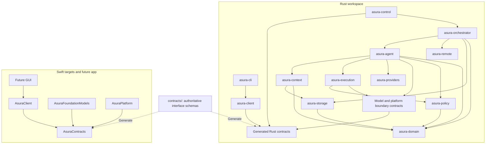
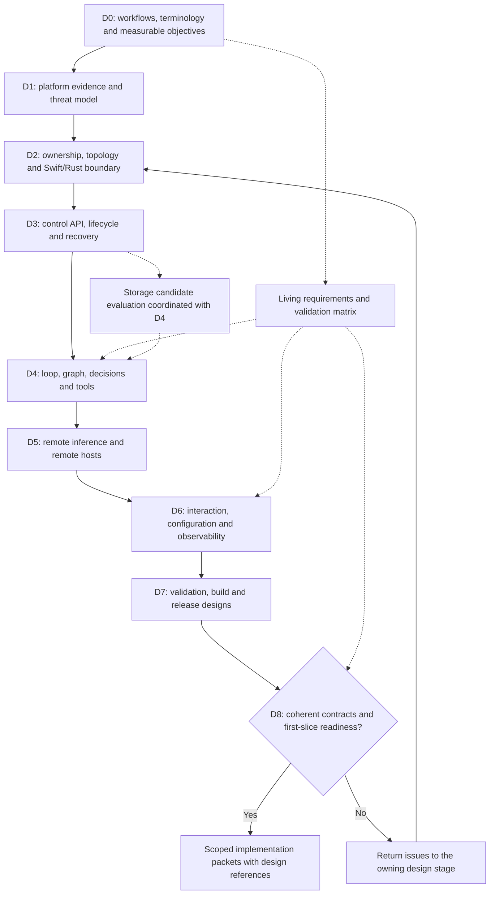

# Architecture and design production plan

Status: proposed work plan. Swift and Rust are selected; component allocation,
repository layout, protocols, and runtime mechanisms below are proposals to
resolve through design. No implementation work is authorized by a plan alone.

## Outcome

Produce a coherent architecture, scoped implementation designs, decision records,
test specifications, and bounded implementation packets. Establish the whole
system's boundaries before any implementation, then finish each feature's
detailed design before coding it. GUI-specific behavior awaits the user's
additional requirements; its client boundary must be supported from the start.

The [architecture baseline](../architecture.md) is the requirements authority.
The [core harness brief](../designs/core-harness-brief.md) supplies proposed loop
and context-graph semantics for investigation. This plan owns sequencing and
deliverables rather than duplicating their specifications.

## Proposed language ownership

| Owner | Language | Responsibility |
| --- | --- | --- |
| Orchestrator | Rust | Scheduling, task lifecycle, durable transitions, agent coordination, control API |
| Agent core | Rust | Harness state machine, action lifecycle, budgets, progress and termination rules |
| Context subsystem | Rust | Graph semantics, provenance, retrieval, context assembly, invalidation |
| Policy and execution | Rust | Canonical capability evaluation, execution coordination, tool registry and contracts |
| Model service | Swift | Foundation Models sessions, typed decisions, availability and model-specific limits |
| Native platform services | Swift | Narrow adapters to selected macOS security, identity, and lifecycle facilities |
| CLI/TUI | Rust | Control-client interactions and presentation through a reusable client library |
| GUI | Swift | Future native interface using the same semantic control contract |
| Remote integrations | Rust | Remote AI adapters and remote Asura host coordination as separate modules |

This allocation gives orchestration state one owner and keeps Apple framework
integration explicit. Validate it against concurrency, packaging, API support,
performance, and security evidence. A module is not automatically a process.

### Proposed module and language dependencies

Proposal for D2. Solid arrows mean the source consumes the target's contract;
dotted arrows mean bindings are generated from one schema source. This is a
module view, distinct from the architecture's runtime data-flow diagram. Host
composition wires these modules together and is omitted from the dependency view.



The model/platform boundary connects implementations through the selected IPC or
FFI mechanism; it is not a second model or policy implementation. Cross-cutting
telemetry consumes boundary events and must not create reverse domain dependencies.

Compare a separately supervised Swift model service with an in-process bridge.
Prefer exploring process isolation first to separate model-service failure from
control-state ownership, but measure its cost. If FFI is chosen, specify buffer
ownership, lifetimes, cancellation, callback isolation, panic/error translation,
and shutdown. If IPC is chosen, specify peer identity, framing, versioning,
backpressure, restart, and outstanding-request recovery. Neither boundary grants
security automatically. Avoid per-token or per-node language crossings unless
measurements justify them.

## Proposed repository layout

This tree is a design proposal, not a scaffolding task. Create members only when
their governing design and implementation packet are ready.

```text
asura/
  AGENTS.md
  README.md
  docs/
    architecture.md
    engineering.md
    design-process.md
    plans/
    designs/                    # canonical subsystem specifications
    decisions/                  # rationale and alternatives
  contracts/                    # authoritative cross-language wire/bridge schemas
  rust/
    Cargo.toml                  # Cargo workspace
    crates/
      asura-domain/             # IDs, task/action states, domain invariants
      asura-orchestrator/       # scheduling, lifecycle and durable coordination
      asura-agent/              # agent loop
      asura-context/            # graph and context assembly
      asura-storage/            # persistence adapters and migrations
      asura-policy/             # canonical authorization rules
      asura-execution/          # tool lifecycle and host enforcement coordination
      asura-control/            # server protocol adapter
      asura-client/             # shared Rust control client
      asura-providers/          # remote inference adapters
      asura-remote/             # remote host protocol adapter
      asura-observability/      # shared Rust telemetry setup
      asura-cli/                # CLI and TUI presentation
      asura-host/               # host composition and process entry points
  swift/
    Package.swift
    Sources/
      AsuraContracts/           # generated contracts/adapters, no domain policy
      AsuraFoundationModels/   # model session adapter
      AsuraPlatform/           # native macOS adapters
      AsuraModelService/       # entry point if process boundary is selected
      AsuraClient/             # future GUI control client
    Tests/
  apps/
    macos/                     # future GUI target; create after its design
  tests/
    contracts/                 # shared compatibility fixtures
    integration/               # cross-language and process scenarios
    e2e/                       # user workflows
    security/                  # adversarial host/control scenarios
    performance/               # reproducible benchmark workloads
  evals/                       # versioned model-decision cases and scoring
  scripts/                     # designed build and quality entry points
```

Local unit tests stay with their owning Swift target or Rust crate. Cross-system
tests use the root suites. Shared schemas produce bindings; handwritten competing
definitions are prohibited. Protocol schemas do not become a second domain-policy
implementation. Decide in D2 which boundaries warrant separate crates or targets;
collapse purely organizational splits before scaffolding.

## Design sequence and exit gates

Artifact names below are planned outputs, not existing files. D0-D8 establish
the architecture baseline for implementation. Work can be investigated concurrently
only where dependencies permit; reconcile it into one consistent design set.

### Design-stage dependency graph

Proposed sequencing. Solid arrows are prerequisites; dotted arrows identify
cross-cutting evidence maintained throughout. Transitive prerequisite edges are
omitted for readability; the stage table records the full dependency sets.



The revision arrow returns to architecture coordination; individual issues must
be fixed in their canonical document, including D0 or D1 where necessary.

| Stage | Depends on | Produce under `docs/designs/` | Exit evidence |
| --- | --- | --- | --- |
| D0: product scenarios and terminology | Existing requirements | `product-workflows.md`, `domain-model.md`, requirements/validation matrix | Define task, conversation, agent, host, action, observation, context, and decision; specify initial workflows and measurable UX/reliability/performance objectives |
| D1: platform and threat model | D0 | `platform-capabilities.md`, `threat-model.md` | Verify installed/public API evidence; identify adversaries, data flows, protected assets, entitlements/distribution constraints, and OS mechanisms needing live proof |
| D2: ownership and topology | D0, D1 | `system-architecture.md`, `swift-rust-boundary.md`, `repository-layout.md` | Assign each behavior exactly one owner; select process/module boundaries, IPC/FFI, toolchain and packaging approach; draw dependencies and deployment views |
| D3: control and durable state | D2 | `control-api.md`, `task-lifecycle.md`, `persistence-recovery.md` | Command/event schemas, versioning, state transitions, transactions, retry/replay semantics, caller/host identities and authorization; no unexplained ambiguous effects |
| D4: core cognition and execution | D2, D3 | `agent-loop.md`, `context-graph.md`, `model-decisions.md`, `tools-execution.md` | Resolve the core brief; specify selection algorithms, state machines, graph consistency, authority checks, context budgets, bounded model interactions and evaluations |
| D5: remote boundaries | D1-D4 | `remote-inference.md`, `remote-hosts.md` | Separate inference from host execution; define data egress, trust enrollment/revocation, lease/partition behavior, result provenance and compatibility |
| D6: interaction and operations | D3-D5 | `cli-tui.md`, `configuration.md`, `observability-audit.md` | Walk through happy/failure journeys; define controls, configuration precedence, redaction, audit durability, telemetry correlation and bounded export |
| D7: validation and delivery | D2-D6 | `validation-strategy.md`, `build-release.md` | Unit/integration/e2e mapping, model datasets, fuzz/property tests, actual macOS/multi-host runners, performance budgets, signing/update plan and check commands |
| D8: consistency and implementation readiness | D0-D7 | Requirements matrix completed; scoped packet backlog | Walk representative scenarios across all contracts; resolve conflicting ownership and first-slice blockers; identify later feature gates explicitly |

Draft the validation matrix in D0 and evolve it in every stage; D7 consolidates
infrastructure and execution gates. Security, observability, and UX apply throughout.
Write decision records as choices arise, linking to specifications rather than
copying them. Revisit earlier contracts when later design exposes an inconsistency.

### Context storage candidate evaluation

During D3-D4, evaluate embedded SurrealDB for the context graph using the
[candidate assessment](../designs/context-storage-candidates.md). Coordinate the
decision with persistence/recovery design: decide whether graph and action-ledger
updates share transactions or use an explicitly recoverable projection. Produce
a storage decision record backed by representative queries, correctness evidence,
resource measurements, and pinned-version dependency/license inspection. The
candidate is not selected and no dependency should be added before this work.

### Diagram deliverables by design stage

Each artifact must follow the [Mermaid standard](../design-process.md#mermaid-diagram-requirements).
The diagrams already in the baseline and briefs provide starting views; detailed
designs refine them and become the canonical source for selected behavior.

| Stage | Required detailed views before its exit gate |
| --- | --- |
| D0-D1 | User journeys, domain relationships, data flows and threat boundaries |
| D2 | Component/dependency, process/deployment, and Swift/Rust request/cancellation/shutdown sequences |
| D3 | Command/event sequences, task/action state machines, transaction boundaries, reconnect and crash recovery |
| D4 | Agent-step flow, decision branches, graph schema/cardinalities, retrieval/invalidation flow, tool authorization and failure sequences |
| D5 | Separate remote-inference and remote-host sequences; enrollment, revocation, partition, lease/fencing and reconciliation states |
| D6 | Interactive and non-interactive workflows, multi-client decisions, configuration precedence, telemetry and audit pipelines |
| D7-D8 | Test/evidence mapping, packaging/update/migration flows and packet dependency/readiness gates |

## Scenarios that must survive the design review

1. Non-interactive request inspects a workspace, returns evidence, and exits with
   a deterministic status; execution and remote inference remain separately scoped.
2. Interactive request investigates a failing test, obtains bounded remote help
   if needed, applies a permitted change, validates it, and reports the evidence.
3. A second client attaches, observes the same state, handles a pending decision,
   and redirects or cancels work without creating conflicting task owners.
4. A model call stalls while status and cancellation remain responsive.
5. The host crashes after an external effect but before recording its result;
   recovery reports uncertainty and reconciles instead of blindly repeating it.
6. A file changes after retrieval; the next action detects stale context and
   revalidates affected evidence and proposals.
7. Remote inference is denied or unavailable; the system explains the remaining
   options without silently sending data or retrying indefinitely.
8. A remote Asura host disconnects during work; ownership, cancellation guarantees,
   expired grants, and eventual reconciliation remain well-defined.
9. Malicious workspace text, a compromised tool result, or an unauthorized client
   cannot expand capabilities; collector failure cannot block control operations.

## Evidence and decision discipline

Use installed SDKs and primary documentation to verify concrete API choices.
Any executable feasibility probe requires its own scoped design, threat bounds,
and tests before code, and does not establish production readiness.

Initial read-only environment inspection on 2026-09-19 found macOS 27.0,
Xcode selected at `/Applications/Xcode.app/Contents/Developer`, Swift 6.4, and
Rust 1.98.0. This is availability evidence only; versions are not yet pinned and
Foundation Models availability, signing, sandboxing, and cross-language behavior
have not been exercised for Asura.

Relevant primary references for the design work:

- Apple's [Foundation Models tool-calling documentation](https://developer.apple.com/documentation/foundationmodels/expanding-generation-with-tool-calling)
  is the starting point for verifying model-session execution against Asura's
  independently owned action lifecycle.
- The [Rust FFI guidance](https://doc.rust-lang.org/nomicon/ffi.html) describes
  ownership, callbacks, and unwinding hazards to address if a bridge is selected.
- [OpenTelemetry context propagation](https://opentelemetry.io/docs/concepts/context-propagation/)
  provides the tracing context model; it does not define Asura's knowledge graph
  or authorization state.

The output of D8 is the input to the [implementation plan](implementation.md).
Do not assign calendar estimates until designs expose workload size, required
hardware, and external dependencies.
