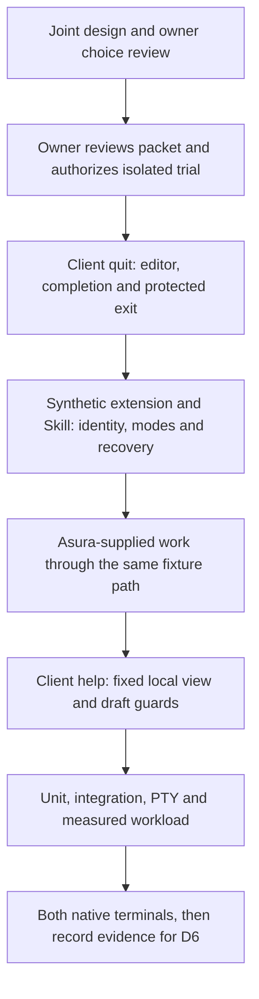

# Command interaction trial packet

Status: **authorized and validated isolated experiment packet**, 2026-09-24. After reviewing
this packet, the owner selected the [TUI command design](../designs/tui-command-discovery.md)
and said “go for it”. It extends only the existing
[authorized TUI experiment](tui-prototype-implementation.md). The
[production command design](../designs/command-system.md) remains proposed; no
production service contract or implementation is authorized.

The owner subsequently selected `/ext:` instead of `/extension:` as the canonical
extension prefix. CT8 limits the amendment to names and rejection of the old
form. Source identity, operation ownership, captured scope and keyboard controls
do not change. The existing dependency diagram and test layers still apply.

The owner also authorized a first-party extension trial after reviewing the
proposed built-in/extension boundary. CT9 adds one inert Asura-supplied work
definition to the same in-memory contribution and submission path. It does not
authorize a production extension API, loader or privileged first-party route.
The owner subsequently authorized `/help` as another client-local built-in in
this experiment. CT10 maps it to the existing F1 controls view.

## Question and boundary

The trial asks whether a user can find, distinguish, complete and intentionally
invoke three command categories without losing a draft or confusing command
selection with chat submission. It evaluates the selected trial slash syntax and
qualified names in the existing fast, minimal composer.

The package remains `experiments/tui-chat/`, offline and synthetic. Terminal
input/output is its only runtime I/O. It does not read projects, AGENTS.md or
Skills, start MCP/LSP servers, call models, access credentials, use a database or
execute extension/Skill code. Fixture acceptance is not production admission.
No new dependencies, protocol, global configuration or terminal preferences are
selected. Use the existing Rust toolchain, pinned dependencies and check runners.

## Selected scope and file ownership

| Owner | Selected change |
| --- | --- |
| `editor.rs` | Identify eligible first-token spans and replace one span as one undoable rat-text edit; keep grapheme mapping here |
| `app.rs` | Own browser focus, displayed binding, F9 and contextual Tab routes, explicit completion, contextual cue and captured project/draft revision |
| `model.rs` | Own bounded, deterministic synthetic definitions and scoped acceptance/rejection/invalidation events; no service registry |
| `ui.rs` | Render suggestions/browser, source origin and optional cue using existing palette, overlay and minimum-geometry rules |
| `viewport.rs` | Reuse existing transcript and message-tray allocation; change only if a demonstrated layout case requires it |
| `terminal.rs`, `main.rs` | Retain modes, cleanup and event loop; add no terminal protocol without a design amendment |
| `tour.rs` | Add representative command scenes only after interactive behavior and automated checks pass |

The first built-in is `/quit`, with `/exit` as its alias and the same client-session
identity. `/help` is a separate client-view built-in. `/ext:checks/test` and
`/skill:project/review` are inert synthetic service entries. A second source
shares a friendly label to exercise collisions.
Unavailable, stale and revoked revisions are synthetic events. `/projects` is
outside this packet. No fixture may create a real task or effect.
The CT9 definition is `/ext:core/check`, from `extension:core`. Its origin is
Asura-supplied, but its category and operation class remain Extension and
WorkRequest. A shared fixture contribution constructor supplies those two values,
fixed source identity, name shape and reserved-name exclusion for both first-party and
integration definitions. It uses the same fixture request path as
`/ext:checks/test`. The app routes only fixed `builtin:quit` and `builtin:help`
locally; fixture admission rejects a contributed non-work operation before
acceptance.
The source handles `asura`, `core` and `internal` are reserved for Asura-supplied
extensions. The fixture assigns only `core`, with no `asura` or `internal`
definitions. D3/D4 must qualify rejection of external registration claims; this
static trial cannot exercise a production registration API.

## Dependency and review gates

This delivery view names prerequisites and checks. The owner reviewed the five
[interaction decisions](../designs/tui-command-discovery.md#selected-trial-decisions-and-boundaries)
and authorized this isolated trial on 2026-09-24. Arrows show the required order.

Implement one thin vertical slice before widening the catalogue: local `/quit`
and `/exit` discovery, completion, undo and protected exit. Then add synthetic extension
and Skill entries, stale revisions, modes and recovery. The existing editor and
fixture submission owners remain canonical. A design change precedes any code
that needs a new owner or protocol.

## Required acceptance and checks

Each case has an initial state, trigger and observable result. The unit,
integration and PTY layers qualify only the experiment. Production
[CS1-CS6](../designs/command-system.md#validation-and-unresolved-decisions)
remain separate.

| ID | Initial state and trigger | Required result | Evidence |
| --- | --- | --- | --- |
| CT1 | Empty draft; press F9, select `/quit`, press Tab, then Enter | Name completes without invoking; Enter uses the existing exit path and restores terminal modes | Unit focus state, integrated editor undo/exit, PTY keyboard and cleanup, native F9 and Tab in both terminals |
| CT1B | Eligible `/qu` or `/ex` header; press Tab, undo, then press Tab | Matched alias completes in one undoable name edit; both aliases retain one definition identity and do not invoke | Unit prefix/alias/span/undo, editor integration, PTY and native Tab in both terminals |
| CT1C | Eligible header with multiple matches, incomplete catalogue or no match; press Tab | Common prefix extends only when safe; otherwise browser opens without a selected definition or draft remains with an explicit reason | Unit ranking/completeness, app/catalogue integration, PTY ambiguity and unavailable flows |
| CT1D | Draft begins with any quote character followed by `/tmp/file`; press Tab, Enter or Ctrl+S/T as applicable | Scanner stays inactive, Tab follows ordinary editing, and submission sends the exact quoted text without dequoting or command dispatch | Unit first-grapheme rule across ASCII and Unicode quote fixtures, editor/app integration, PTY literal-path flow |
| CT1E | Draft begins `/tmp/file` or `//tmp/file`; press Enter | Unknown or invalid command explanation retains the raw draft; no chat fallback or slash removal occurs | Unit grammar, app/fixture integration, PTY rejection flow |
| CT1F | Another project has protected text; complete `/exit`, press Enter, cancel, then confirm | No default exit; cancel retains command and protected text; confirm follows existing exit cleanup without issuing a service stop | Unit alias/exit guard, app integration, PTY both choices and terminal cleanup |
| CT2 | Multiline draft beginning `/ext`; move cursor, paste, select and complete | Only eligible name span changes in one undo step; arguments, cursor and selection survive or a stale edit is rejected atomically | Unit spans/normalization, editor integration, PTY paste/undo/resize |
| CT3 | Two projects with same friendly command label; browse and switch | Category and source remain visible; captured binding cannot move to the other project; no discovery dispatch | Unit identity guards, app/fixture integration, PTY project switching |
| CT4 | Active fixture work; complete an extension or Skill then submit | Enter presents explicit Steer/Queue choices with no default; Skill Steer remains unavailable | Unit mode table, app/fixture integration, PTY choice and recovery |
| CT5A | Focused definition is replaced or revoked with F10 before Enter; press Enter | Unavailable reason appears; no completion, fallback chat or successor binding occurs | Unit revision guard, app/fixture integration, PTY unavailable flow |
| CT5B | Captured command is awaiting fixture acceptance; press F10, then F5 | Original request rejects as stale, protected input remains and no successor effect starts | Unit capture guard, fixture/app race integration, PTY rejection |
| CT5C | Captured command is accepted; press F10 before synthetic successor effect | Accepted identity remains, pending effect is blocked and source-unavailable outcome is reported | Unit lifecycle guard, fixture/app reverse race integration, PTY outcome |
| CT6 | Captured request uncertain, then new draft typed and project switched | Original identity and protected text persist; newer draft remains; reconciliation cannot send a second effect | Unit request guard, synthetic duplicate/replay integration, PTY reconnect journey |
| CT7 | Full 128-entry catalogue, Unicode draft and 30x8 terminal; filter, paint and resize | No clipped critical route, control escapes or hidden selection; p95 under 50 ms in the existing 1,000-batch workload | Unit bounds, TestBackend both palettes and sizes, PTY resize, measured workload |
| CT8 | Complete and submit `/ext:checks/test`; then try `/extension:checks/test` | The short name binds the existing extension definition and preserves captured scope; the old long prefix is unknown, retains its draft and never falls through to chat | Unit name and identity rules, app/fixture integration, PTY completion, submission and rejection |
| CT9A | Browse `/ext:core/check` beside `/ext:checks/test`; attempt an extension control claim | Both show distinct origin and source with Extension category; the Asura origin does not permit ClientSession or a built-in alias | Unit provenance and operation guards, TestBackend 30x8 both palettes, PTY discovery |
| CT9B | Submit each source's work definition with a text body | Both use the existing pinned catalogue and protected request path; no client branch depends on source origin | Unit capture equality, app/fixture integration, PTY submission and tray inspection |
| CT9C | Submit first-party work, then revoke `extension:core` before acceptance | Original request rejects, protected text remains recoverable, integration source and other project remain available | Unit targeted revision and rejection, integration identity checks, PTY recovery |
| CT9D | Accept queued first-party work, then revoke before its synthetic effect starts | Queue is held with source-unavailable outcome under original ID; restore cannot revive it | Unit both race orders and replay, integration outcome/tray, PTY held-text view |
| CT9E | Lose acknowledgement, type a newer draft and switch projects before reconnect | Reconcile the original first-party request once in its original scope without clearing either newer draft | Unit replay identity, app integration, PTY project/reconnect journey |
| CT9F | Enter the superseded `/ext:asura/check` name after the `core` rename | The old name is unknown, retains its raw draft, and cannot invoke `/ext:core/check` or fall through to chat | Unit catalogue and name resolution, app integration, PTY rejection |
| CT10A | Type `/he`, press Tab, browse `/help`, then invoke after presentation | Completion does not open help; Enter opens the existing F1 controls view and consumes only the command draft; no fixture request occurs | Unit identity and completion, app/editor integration, PTY browser/completion/view journey |
| CT10B | Invoke `/help` during work, disconnection and F10 source revocation | Help remains available and never opens Steer/Queue or changes work, source or pending state | Unit source and mode guards, app integration, PTY active/disconnected journey |
| CT10C | Submit `/help topic`, then valid `/help`; close with Escape or F1 and switch projects | Invalid arguments retain the draft and undo history; valid invocation leaves an empty editor on close and preserves other project drafts and protected text | Unit argument/focus guards, app integration, PTY invalid and close paths |
| CT10D | A contributed definition asserts ClientView or copies the help name | Only the fixed `builtin:help` identity can open local help; contributed work cannot take a client route or override a built-in | Unit forged-definition guard, app/fixture integration, PTY qualified-name rejection |

Run `cargo fmt --all -- --check`, `cargo clippy --locked --all-targets -- -D warnings`,
`cargo test --locked`, the existing `tests/terminal_e2e.py` PTY suite and the
ignored responsiveness measurement from the authorized packet. Add assertions
for CT1, CT1B-CT1F, CT2-CT4, CT5A-CT5C and CT6-CT9 at their existing owners.
A short physical-key and layout trial in
Ghostty and Terminal.app qualifies F9, F10, Tab and native readability separately from PTY.
The tour may reduce repeated scenario setup but cannot prove native key delivery.

Do not mark the trial complete when a required layer fails or is unavailable.
Record the exact command, environment, observed result and proof limit. No
production catalogue, durable replay, permission or Skill-execution claim can be
made from this packet.

## Documentation evidence

On 2026-09-24, Mermaid CLI 11.16.0 rendered the dependency diagram locally and
it was visually inspected. The Tab-completion amendment adds no plan-diagram
transition. Local links and index entries were checked again. The isolated TUI
trial implements command parsing, completion, browsing, client-local quit and
synthetic extension/Skill requests using the existing protected request path.
`cargo fmt --all -- --check`, Clippy with `-D warnings`, the Rust test suite and
the PTY process suite passed after the `/ext:` amendment, including CT8. The
1,000-batch debug responsiveness measurement reported p95 15.122 ms against the
50 ms target. The PTY suite covers F9/F10
decoding and terminal cleanup, but it cannot prove physical key delivery or
readability in Ghostty and Terminal.app. Computer-use access to both apps was
denied. The owner reported that the short F9/F10, Tab-completion and compact-browser
check passed in both terminals on 2026-09-24. This is owner-observed evidence;
individual palette and size combinations were not recorded. The isolated trial's
required validation is complete for the tested scope. The new `/ext:` spelling
has automated completion/submission/rejection evidence; native display inspection
still refers to the prior spelling. No production service, Skill loading or real
agent execution was qualified.

CT9 was subsequently implemented in the same isolated fixture. On 2026-09-24,
`cargo test --locked` passed (169 library tests and the integration suites),
`cargo clippy --locked --all-targets -- -D warnings` passed, and the PTY suite
passed using the experiment's pinned Python environment. CT9 PTY cases covered
discovery/completion, pre-acceptance revocation and recovery, accepted Queue
revocation, and lost-acknowledgement reconciliation across project switching.
The changed Mermaid blocks were rendered with Mermaid CLI 11.16.0; the new
ownership and packet diagrams were visually inspected. These checks do not
qualify a production extension API, real tool effects or the CT9 appearance in
Ghostty and Terminal.app; no CT9-specific native observation is recorded yet.

The owner then selected `core` instead of `asura` for the first-party trial
source. On 2026-09-24, `cargo test --locked` passed (170 library tests and the
integration suites), Clippy passed with `-D warnings`, and the full PTY suite
passed with `/ext:core/check` and CT9F old-name rejection. The change affects
only the isolated fixture identity and trial documentation; it does not qualify
the production registration contract. Native visual inspection of the renamed
command in Ghostty and Terminal.app is still unrecorded.

The owner then added `/help` to the isolated trial. On 2026-09-24,
`cargo test --locked` passed (176 library tests and the integration suites), strict Clippy
passed, and the full PTY suite passed. CT10 PTY journeys covered browser
completion, the F1-equivalent controls view, argument rejection, and help during
disconnected work with synthetic sources revoked. Mermaid CLI 11.16.0 rendered
the changed interaction and dependency diagrams; both were visually inspected.
The 1,000-batch debug responsiveness measurement reported p95 16.192 ms against
the 50 ms target.
This is offline client behavior only. No new native Ghostty or Terminal.app
observation or production client/service check is recorded for `/help`.
