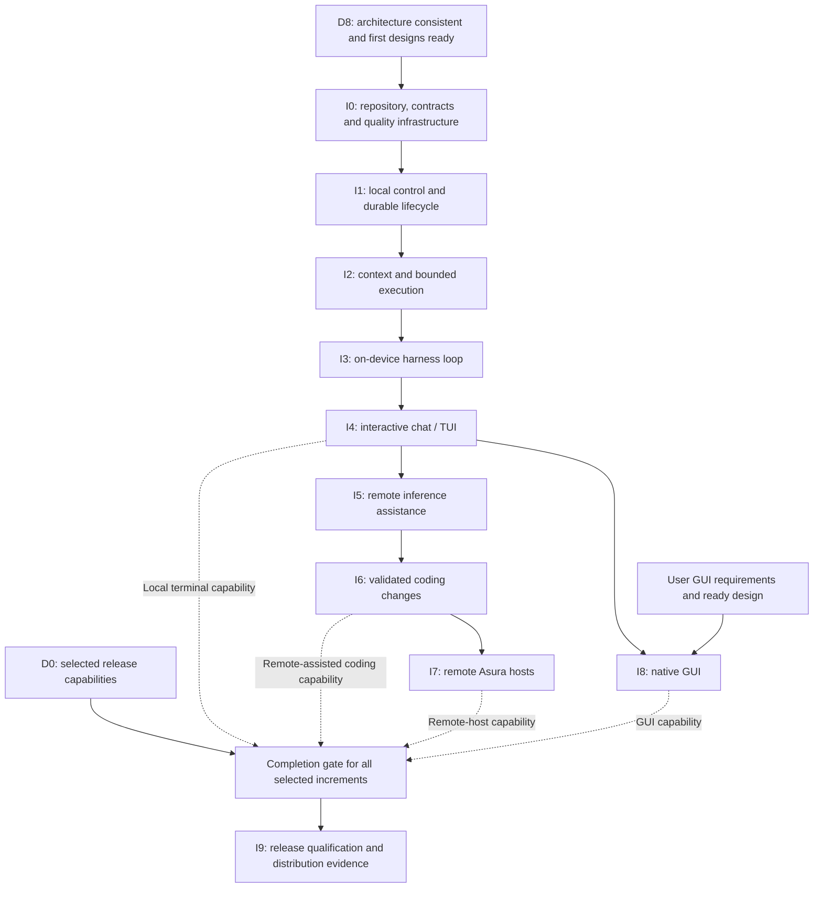
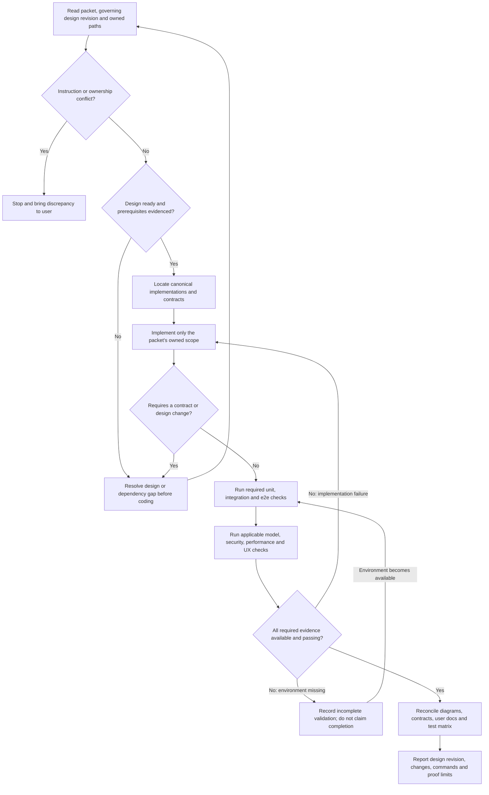
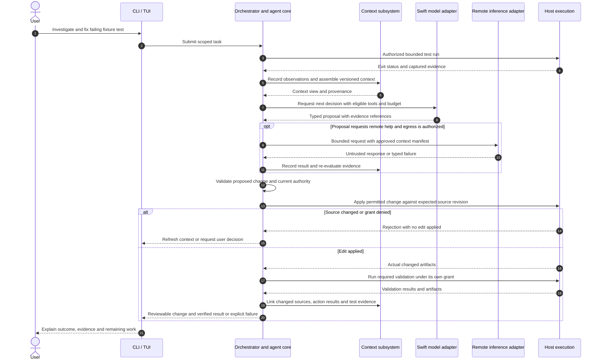

# Implementation delivery plan

Status: proposed sequence, gated by the
[architecture and design plan](architecture-and-design.md). No code is to be
written from this plan alone. Swift/Rust allocation and paths refer to that
plan's proposed layout until D2 resolves them.

## Entry gate

Begin I0 only after D8 establishes coherent system boundaries and the initial
implementation designs are ready. Each later increment requires its own ready
design and completed dependencies. A later feature may retain detailed open
questions only if they do not undermine an earlier contract or security boundary.

Do not defer testing, observability, or security to a final hardening phase.
Every increment includes its unit, integration, and end-to-end coverage, relevant
model evaluations and operational documentation. Hardware/provider-dependent
checks require the real environment before claiming those behaviors work.

## Increment sequence

### Delivery dependencies

Proposed delivery graph. Solid arrows are prerequisite milestones; transitive
edges are omitted. Dashed arrows into release scope mean feature inclusion is
decided at D0, not that every release must contain the GUI and remote hosts.

Every milestone also depends on its own ready design and the required validation
environment. Those gates apply even where the graph only shows delivery ordering.

| Increment | Depends on | Deliver | Exit demonstration |
| --- | --- | --- | --- |
| I0: repository and contracts | D8; ready build/layout/contract designs | Minimal Cargo/Swift package structure, pinned toolchains, generated bindings, CI and test runners; initial telemetry setup | Clean build on supported macOS; cross-language contract round trip, compatibility rejection and bounded cancellation through a test composition |
| I1: local control and durable lifecycle | I0 | Host entry point, control API, client library, non-interactive CLI; task IDs, event stream, configuration, local caller authentication and authorization; selected policy format validation, evaluator and atomic activation | Submit a no-effect diagnostic task, inspect it, attach a second client, disconnect/reconnect, cancel and recover state after restart; reject unauthorized callers and invalid policy updates |
| I2: context and bounded host execution | I1 | Initial graph/storage, workspace observations, canonical tool registry, grants, policy-to-sandbox enforcement, constrained read/process tools and action recovery | CLI runs a permitted fixture inspection/build with graph-linked evidence; denied access, unsupported restrictions, policy revocation/launch races, output bounds, timeout, crash ambiguity and stale files are handled |
| I3: on-device harness loop | I2 | Swift model adapter/service, core loop, structured decisions, context assembly, progress/budget rules and evaluation suite | Real on-device decisions complete a bounded local task; invalid proposals are rejected; stalled/unavailable model does not block control; graph and loop resume consistently |
| I4: interactive chat/TUI | I3 | Streaming chat, task/agent views, explainable decisions, pause/resume/cancel/redirect and pending user decisions | Reattach without state loss, resolve a decision from either client, steer active work, navigate by keyboard, and recover from errors clearly |
| I5: remote AI assistance | I3, I4 | One selected remote inference provider behind canonical contracts, egress context views, credential handling and budgets | Local decision requests bounded remote help; authorized context is sent; rate limits, failure, denial and ambiguous provider outcomes remain visible and bounded |
| I6: coding task completion | I2-I5 | Designed change/patch application and validation workflow, workspace concurrency controls and reviewable artifacts | Reproduce a failing fixture test, investigate, make a scoped change, run validation and present evidence; handle stale edits, failures and cancellation without claiming unverified success |
| I7: remote Asura hosts | I6 | Host enrollment and identity, task placement, remote execution control, grant expiry/revocation, reconciliation and compatibility handling | On two actual supported machines, disconnect during execution, revoke authority, reconnect and reconcile; prevent duplicate dispatch by stale owners |
| I8: GUI | I4; user's GUI requirements and ready GUI design | Native Swift client over the established control contract | GUI and terminal observe/control the same task without duplicated orchestration rules; pass accessibility and usability scenarios |
| I9: release qualification | Required release increments | Signed/distributable artifacts, install/upgrade/recovery guidance, compatibility and performance evidence | Fresh supported host installation, upgrade/migration recovery, security regressions, collector outage, sustained workload and usability acceptance all meet the design |

I2 uses deterministic fixture requests to verify execution before connecting the
model loop. Such fixtures are test drivers of the production interfaces, not an
alternative harness implementation. Controlled file modification is first enabled
when I6's edit design and enforcement tests are ready.

The first useful terminal milestone is I4: both non-interactive and interactive
local workflows. I6 adds the remote-assisted coding workflow. Remote-host and GUI
delivery are separate capabilities; I8 need not wait for I7 unless its requirements
depend on remote hosts. Define release scope at D0, and never call an incomplete
feature shipped because its interface was reserved.

## Cross-cutting delivery in every increment

- Add instrumentation at the component boundary where behavior first exists;
  propagate trace context, control cardinality, redact payloads and exercise
  collector unavailability. Verify Swift/Rust exporter capability before claiming
  equivalent support for all three OpenTelemetry signals.
- Add capability enforcement before exposing an effect, including local-only
  operations. Remote transports start with authenticated/authorized test requests.
- Apply the selected policy contract through its canonical owner. Include policy
  conformance and actual host-enforcement evidence for every new protected effect;
  follow the [security policy brief](../designs/security-policy-brief.md) and its
  successor detailed designs. Do not add client-specific permission engines.
- Deliver meaningful unit, integration and e2e assertions with the feature.
  Include failure injection and recovery tests as durable boundaries are introduced.
- Update the requirements/test matrix, public contract compatibility fixtures,
  design status and user-facing documentation.
- Measure latency, throughput and bounded resource usage against the budgets
  selected during design; include graph retrieval and concurrent model work.

## Implementation packet contract

Before an implementation agent starts, record:

1. Packet ID, objective, governing design revision and prerequisite evidence.
2. Exact owned files/modules and explicit non-goals.
3. Existing functionality to reuse and contracts consumed or produced.
4. Acceptance criteria and unit/integration/e2e cases, with the required real
   environments and canonical check commands.
5. Security, resource, failure and compatibility invariants that must remain true.
6. Integration order, documentation changes and completion evidence required.

Reject a packet with unresolved implementation-affecting design questions. If
implementation reveals a contract conflict, stop and resolve the design before
continuing. Do not expand a packet to absorb adjacent work or invent a duplicate
helper because another component is inconvenient to call.

### Packet execution and completion gate

Required workflow for implementation agents. Edges name checks and outcomes;
scope or instruction discrepancies require stopping work and raising the issue
with the user, as required by `AGENTS.md`.

### I6 coding workflow acceptance sequence

Proposed end-to-end scenario for I6. It composes prior milestones through their
canonical interfaces. The remote path is conditional, and edit execution has
independent authorization and stale-source checks.

## Verification and release evidence

Use progressively broader evidence: deterministic component tests; real storage,
protocol and process integration; supported-macOS end-to-end workflows; actual
Foundation Models evaluations; credentialed provider checks; and two-host tests.
Each increment runs all layers applicable to its claims, not just the cheapest one.

Maintain a capability matrix with designed, implemented, verified and released
states. Record environment and versions for every platform-dependent result.
Document unverified limitations instead of silently substituting mocks.

I9 consolidates already-running checks and tests distribution-specific behavior;
it is not the first security, UX, load, or recovery review. The final release gate
must include user workflows, hostile input, interrupted actions, upgrades, and
clean uninstall/data-retention behavior specified in D7.
