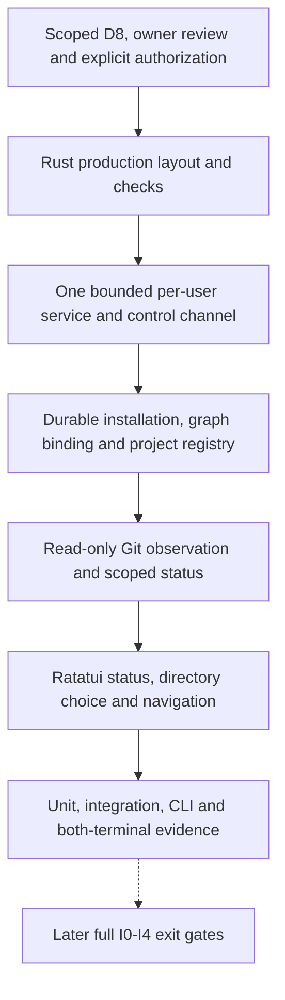
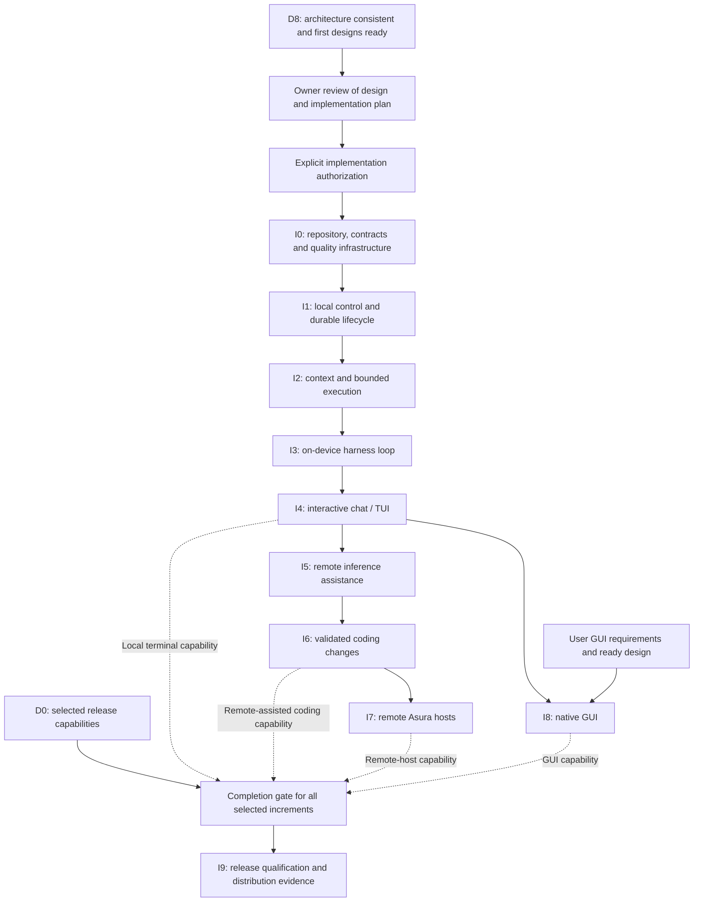
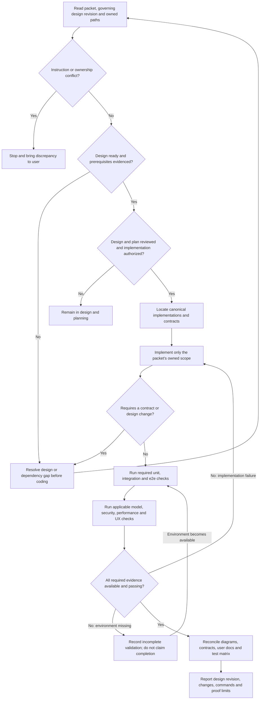
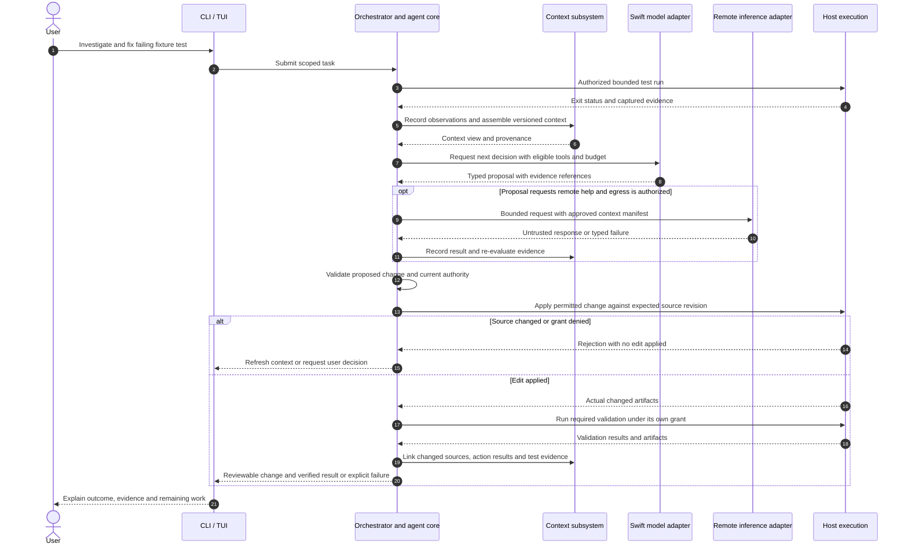

# Implementation delivery plan

**Status: Proposed mechanism.** This plan defines delivery order and required
acceptance evidence. It depends on the
[architecture and design plan](architecture-and-design.md).

**Open decisions:** D2 must refine the selected Rust chat client/backend ownership
and select the remaining Swift/Rust allocation and repository layout.
Each increment needs a detailed design before its implementation can start.
Use the [writing standard](../writing-standard.md) and [glossary](../glossary.md).

**Selected release scope:** The owner selected local CLI/TUI with on-device
assistance on 2026-09-22. The
[D0 scope](../designs/product-workflows.md#selected-first-release-scope) selects
I0-I4 functionality and I9 release qualification. I5-I8 remain later capabilities;
their architectural boundaries still require design. Both I2 storage modes remain
required. This selection does not authorize implementation.

## Entry gate

Implementation is not currently authorized. Begin I0 only after repo owners have
reviewed both the design and this plan, explicitly authorized implementation, and
D8 establishes coherent system boundaries with ready initial implementation
designs. Each later increment requires its own ready
design and completed dependencies. A later feature may retain detailed open
questions only if they do not undermine an earlier contract or security boundary.

Do not defer testing, observability, or security to a final hardening phase.
All increments follow [ADR-0006's asynchronous pipelines](../decisions/0006-async-event-pipelines.md).
Validate overload, slow consumers, signal handling and recovery at each introduced
boundary; I4 adds real-terminal input/rendering evidence.
Every increment includes its unit, integration, and end-to-end coverage, relevant
model evaluations and operational documentation. Hardware/provider-dependent
checks require the real environment before claiming those behaviors work.

The [production bootstrap and status proposal](../designs/production-bootstrap-status.md)
maps the path from the isolated TUI to a real installation, project registration
and scoped status. The owner subsequently selected an
[early production status slice](../designs/early-production-status-slice.md) for
practical evaluation. Its scoped D8 and owner-review gate is defined in the
[design plan](architecture-and-design.md#early-status-slice-readiness). This
reorders a bounded Rust status client ahead of agent chat; it does not complete
I0-I4, remove their exit checks or permit code while its own design remains open.
I1 supplies the service, installation and registry. I2 supplies workspace
observations. I3 supplies measured model-context usage. I4 connects the TUI to
those owners. Until a source exists, the client reports an explicit unknown
value instead of a fixture value.

### Early production status trial

Selected learning milestone, proposed implementation packet. The trial reuses
the intended Rust service, registry, workspace observer and TUI presentation
owners. It exposes real installation/project/Git status and keeps draft text
local; agent submission and model telemetry remain unavailable. It can begin
only after the scoped D8 review and explicit owner authorization above. Its
implementation must use production-owned modules and contracts, not extend the
synthetic experiment with filesystem or network access.

The packet must sequence: minimal Rust workspace and checks; bounded local
control channel and single service owner; durable installation, binding and
registry; read-only Git observer; then the status TUI and first-use/navigation
journeys. A predecessor's interface and failure tests must pass before the next
stage consumes it. The exact module paths, schema, limits, check commands and
fault matrix remain D2-D3/D7 work. No stage can be marked complete from a mock
or a screenshot alone.

Selected dependency view. A solid arrow means the next stage consumes real,
validated output from its predecessor. The dotted arrow marks a later full
increment that reuses the slice without inheriting an unverified completion
claim.

## Increment sequence

### Delivery dependencies

Proposed full-increment delivery graph. Solid arrows are prerequisite milestones;
transitive edges are omitted. The earlier status trial follows its separate scoped
gate above and does not satisfy an increment exit check. Dashed arrows into
release scope mean feature inclusion is decided at D0, not that every release
must contain the GUI and remote hosts.

Every milestone also depends on its own ready design and the required validation
environment. Those gates apply even where the graph only shows delivery ordering.

| Increment | Prerequisites |
| --- | --- |
| [I0: Repository and contracts](#i0-repository-and-contracts) | D8; ready build/layout/contract designs |
| [I1: Local control and durable lifecycle](#i1-local-control-and-durable-lifecycle) | I0 |
| [I2: Context and bounded host execution](#i2-context-and-bounded-host-execution) | I1 |
| [I3: On-device harness loop](#i3-on-device-harness-loop) | I2 |
| [I4: Interactive chat/TUI](#i4-interactive-chattui) | I3 |
| [I5: Remote AI assistance](#i5-remote-ai-assistance) | I3, I4 |
| [I6: Coding task completion](#i6-coding-task-completion) | I2-I5 |
| [I7: Remote Asura hosts](#i7-remote-asura-hosts) | I6 |
| [I8: GUI](#i8-gui) | I4; user's GUI requirements and ready GUI design |
| [I9: Release qualification](#i9-release-qualification) | Required release increments |

### I0: Repository and contracts

**Deliver:** Minimal Cargo and Swift packages, pinned toolchains, build-time
generated bindings from one Protobuf schema, CI, test runners, and initial
telemetry setup.
The [I0 Protobuf bootstrap design](../designs/protobuf-toolchain-bootstrap.md)
defines the tool lock, verified first download, offline cache, generated-output
ownership and BT1-BT8 evidence. Its first packet uses a test-only smoke schema
and fixture exchange, before the real channel schema and process probe. It is
a scoped part of I0 and remains behind this plan's entry gate. The first build
entry point must prepare the cache and generate both smoke bindings. It must
not use ambient generators or checked-in binding output. The later complete
`check-i0 --offline` must rebuild and run the real probe without network access.
The owner deferred remote CI for the first bootstrap packet. Record its local
BT1-BT8 evidence now; repeat the required checks in CI before claiming I0's
exit gate. Local success does not substitute for the planned CI evidence.
The [D2 bridge-probe slice](../designs/swift-rust-boundary.md#i0-contract-probe-boundary)
defines the cross-language test boundary. It has no per-user service, durable
task admission or Foundation Models quality claim; those arrive in later
increments under their own ready designs.

**Exit checks:**

- Build from a clean checkout on supported macOS.
- Regenerate both Rust and Swift model-channel bindings with pinned local tools;
  missing or mismatched tools fail before stale output can compile.
- Test a cross-language contract request and response.
- Reject incompatible contracts.
- Demonstrate bounded cancellation through connected test components.

### I1: Local control and durable lifecycle

**Deliver:**

- One backend service per device user, control API, client library and non-interactive CLI.
- Persistent project context registry, scoped task identities and event stream.
- Hierarchical configuration resolver and inspectable snapshots under D3's design.
- Local caller authentication and authorization.
- Validation, evaluation, and atomic activation for the selected policy format.
- Durable control requests and rules for concurrent user responses and decision deadlines.
- Minimal embedded and external graph-binding adapters, bootstrap identity and
  verification. I1 establishes or reopens the bound installation before it claims
  graph readiness; I2 adds graph semantics and workspace observations.

**Exit checks:**

- Submit and inspect a diagnostic task that causes no external effects.
- Attach a second client, disconnect, reconnect, and cancel the task.
- Recover state after restart, including control requests received during reconciliation.
- Reject unauthorized callers and invalid policy updates.
- Replay concurrent response, deadline, and cancellation events with one durable outcome.
- Verify the saved graph identity in both modes before graph-dependent work;
  preserve the external binding through outage and reject missing embedded data.
- Meet [C1-C4](../designs/user-service-configuration.md#validation-required-before-delivery)
  for the delivered boundaries: concurrent startup, multiple contexts, parent
  configuration changes, stale revisions and service recovery. I2 adds scoped
  graph and real tool-enforcement evidence; I3 adds model-session evidence.

Configuration semantics are a prerequisite, not work deferred until the TUI.
Unit rules, real filesystem/service integration and CLI end-to-end checks must
cover the delivered service and configuration behavior. Later increments add
their boundaries to the same C1-C4 cases.

### I2: Context and bounded host execution

**Deliver:**

- Context graph semantics, storage queries, and workspace observations over I1's
  verified binding.
- Runtime AGENTS.md discovery and nested instruction resolution for validated
  task working locations, with source provenance and change invalidation.
- Language-server lifecycle and versioned, scoped navigation results for Rust
  and Swift through explicitly configured, identity-checked installed
  toolchains. Language servers remain within I2's source-read-only
  host boundary and cannot authorize edits.
- Canonical tool registry, grants, constrained read and process tools, and action recovery.
- Host sandbox enforcement of policy decisions.
- Explicit task-local scratch and output permissions, with read-only source access.

**Exit checks:**

- Run a permitted fixture inspection or build through the CLI. Link its evidence to the graph.
- Deny source writes from commands and their descendants.
- Handle unsupported restrictions and concurrent policy revocation and process launch.
- Enforce output limits and timeouts.
- Detect stale files and account for unknown outcomes after crashes.
- Reject unreadable or conflicting instruction sources rather than silently
  omitting them; verify nested applicability and change invalidation before
  context is supplied to I3.
- Start selected language servers under the actual host restrictions. Reject
  stale document results and attempted source writes, including descendant
  effects, while preserving versioned navigation evidence. Report a missing or
  mismatched toolchain as unavailable without an ambient or project-selected
  executable fallback.
- Verify that cancellation during reconciliation prevents work from resuming.

### I3: On-device harness loop

**Deliver:** Swift model adapter or service, core loop, structured decisions,
context manifests, model-state isolation and invalidation, progress and budget
rules, and the model evaluation suite. Include Agent Skill discovery,
provenance, scoped activation and invalidation. Optional skill scripts must use
I2's ordinary admitted tool path.

**Exit checks:**

- Use real on-device decisions to complete a bounded local task.
- Reject invalid or stale proposals.
- Keep control responsive when the model stalls or is unavailable.
- Prevent session state from crossing task or authority scope.
- Include session state in provenance and budget checks.
- Verify that terminal decision timeout prevents another model call or action.
- Reject unavailable or stale skills and show their provenance in the context
  manifest; verify that activation never grants tool authority.

### I4: Interactive chat/TUI

**Deliver:** Ratatui chat as the default launch mode, using the shared Rust backend
under [ADR-0005](../decisions/0005-default-ratatui-chat.md). Include streaming chat,
task and agent views, explanations for decisions, pause, resume, cancellation,
redirection, and pending user decisions.

Include navigation among authorized projects and concurrent activities within the
same client under [W6](../designs/product-workflows.md#w6-navigate-projects-and-concurrent-activities).
The launch directory must not bind the interface to one project.

Deliver multiline composition and changing controls/status around the input pane
under the [interaction goals](../designs/interaction-and-extension-boundaries.md#interaction-goals-for-d6).
The separate [prototype](../designs/tui-interaction-prototype.md) can inform this
design; fixture-based prototype checks do not satisfy I4 delivery dependencies
or its real-service validation.

**Exit checks:** Reattach without state loss. Resolve a decision from either client.
Steer active work and navigate by keyboard. Verify clear recovery from errors.
Pass [W0 launch checks](../designs/product-workflows.md#w0-launch-chat-by-default),
including explicit non-interactive commands and terminal restoration after exit/failure.
Pass W6-A through W6-C: retain scoped drafts and command targets while switching;
keep background work discoverable; recover authorized views without repeating effects.
Measure navigation under concurrent work against D6/D7's selected limits.

### I5: Remote AI assistance

**Deliver:** One selected remote inference provider through the canonical contracts.
Include context views approved for disclosure, credential handling, and budgets.

**Exit checks:** A local decision requests remote help within defined limits.
Only authorized context is sent. Rate limits, failures, denial, and unknown
provider outcomes remain visible to the user and within those limits.

### I6: Coding task completion

**Deliver:** The designed patch and validation workflow, controls for concurrent
workspace changes, and reviewable artifacts. Add MCP adapters through the
canonical tool registry and context subsystem, with server lifecycle,
permissions and recovery under their existing owners. I6's first MCP transport
is local stdio. Remote HTTP, its authorization and network-evidence contract
need a later profile. This I6 profile includes tools, resources and prompts.
Resource and prompt inputs need explicit context provenance; a prompt cannot
silently become a chat command or confer tool authority.

**Exit checks:** Reproduce and investigate a failing fixture test. Make a scoped
change, run validation, and present evidence. Handle stale edits, failures, and
cancellation without claiming unverified success.
Exercise permitted and denied MCP operations through real local server processes.
An MCP definition or result must not bypass tool admission, source-write
protection, provenance or outcome reconciliation.
Verify explicit prompt activation, stale or changed resource rejection, and
that discovered prompts do not appear as executable commands without a
separate authorized definition.

### I7: Remote Asura hosts

**Deliver:** Host enrollment and identity, task placement, remote execution control,
grant expiry and revocation, outcome reconciliation, and compatibility checks.

**Exit checks:** Use two real supported machines. Disconnect during execution,
revoke authority, reconnect, and reconcile outcomes. Prevent duplicate dispatch
by owners whose authority is no longer current.

### I8: GUI

**Deliver:** A native Swift client that uses the established control contract.

**Exit checks:** Observe and control the same task from the GUI and terminal.
Keep orchestration rules in their canonical owner. Pass accessibility and usability scenarios.

### I9: Release qualification

**Deliver:** Signed distribution artifacts and an `asura` formula in the existing
`pidster/homebrew-tap`, plus installation, upgrade and recovery guidance and
compatibility and performance evidence. Follow the
[release distribution design](../designs/release-distribution.md).

**Exit checks:** Verify each of the following against its design:

- Fresh installation on a supported host.
- Formula audit and installation from the exact qualified prebuilt release asset.
- Recovery during upgrade and migration.
- Upgrade with a live per-user service, uninstall with user data retained, and
  rejection of an unsupported binary or authority schema.
- Security regression tests and collector outage.
- Sustained workloads and usability acceptance.

### I2 source protection boundary

I2 uses deterministic fixture requests to verify execution before connecting the
model loop. Such fixtures are test drivers of the production interfaces, not an
alternative harness implementation. I2 may grant writes only to explicitly
identified task-local scratch and generated-output locations, including bounded
build artifacts and caches. The source workspace remains read-only for tools,
build scripts and all child processes. A build that requires source writes must
be rejected or redesigned to use authorized outputs; calling it a build does not
expand its authority. Source modification is first enabled when I6's edit design
and enforcement tests are ready. Generic command execution cannot bypass that gate.

### Early-increment acceptance gates

I2's context storage delivery includes both optional embedded SurrealDB and a
configured external connection, following the [storage brief](../designs/context-storage-candidates.md).
Verify embedded initialization when no external connection is configured and
external initialization when one is configured; reject partial settings without
falling back. Reopening must honor the persisted binding, reject missing or
mismatched identity/configuration, and recover interrupted migration/rebinding.
Include the storage brief's B1-B5 cases and ensure bootstrap metadata does not
require an embedded graph in external mode.
Require configuration/security unit cases, real embedded/server integration and
CLI workflows for both modes. External-mode validation must cover authenticated
connection setup, incompatible schemas, partitions and unknown commits, responsive
status/cancellation, and operation without an embedded graph store. Do not defer
this capability to remote inference (I5) or remote Asura hosts (I7); those are
different boundaries. The exact engine, transport and schema require ready designs.

These cases refine delivery evidence, not the canonical lifecycle or context
contracts in the [core harness brief](../designs/core-harness-brief.md). Detailed
designs must retain the cases when resolving implementation mechanisms. Under the
proposed allocation, the Rust orchestrator owns durable task/control arbitration,
the Rust context subsystem owns effective-context provenance, the Swift adapter
owns model-session mechanics, and host execution owns confinement of the full
process tree. D2 must select their process and Swift/Rust boundary contracts;
placing them in one process cannot remove the checks.

| Case | Increment | Subject |
| --- | --- | --- |
| [A1](#a1-common-failure-settlement) | I1–I2 | Stop and account for failed work |
| [A2](#a2-shared-budget-reservations-and-recovery) | I2 | Reserve and account for shared budgets |
| [A3](#a3-control-during-reconciliation-and-decision-expiry) | I1–I2 | Preserve control requests and decision deadlines |
| [A4](#a4-output-writes-with-read-only-source) | I2 | Permit output writes while protecting source |
| [A5](#a5-model-state-isolation-and-invalidation) | I3 | Isolate and invalidate model state |

### A1: Common failure settlement

**Initial state:** A task is in any nonterminal state, including paused or waiting.
An action can still have effects or usage whose outcome is unknown.

**Trigger:** A fatal error occurs, the task deadline expires, or a budget is exhausted.
Success or cancellation can occur concurrently.

**Required result:** The orchestrator records one outcome for concurrent requests.
After a failure intent wins, it dispatches no new task work. It accounts for
existing effects and usage before reporting a terminal result. The result states
whether effects are accounted for or remain uncertain.

**Unit tests:**

- Exercise each failure trigger in every nonterminal state.
- Race each trigger against success and cancellation.
- Verify that a winning failure intent prevents new dispatch.

**Integration tests:**

- Crash before and after failure persistence, and while stopping actions.
- Recover unresolved effects and usage without resetting deadlines or refunding reservations.
- Make the authority store unavailable.
- Exhaust the permitted recovery attempts and check the uncertainty record.

**End-to-end tests:** Fail a task while a fixture action is active. Check that the
CLI reports failure or reconciliation. Restart and verify that the cause persists.
Check that terminal output distinguishes accounted effects from uncertainty.

### A2: Shared budget reservations and recovery

**Initial state:** Concurrent child operations use one shared task allowance.
Only enough allowance for one operation remains.

**Trigger:** The operations request reservations concurrently. A duplicate request,
crash, cancellation, store outage, or unknown usage can interrupt the procedure.

**Required result:** Admission must not reserve more than the remaining allowance
at any applicable parent limit. If actual usage exceeds a limit, record all usage
and the breach; do not reduce the recorded amount. The orchestrator does not
release allowance without supporting evidence. The [core budget contract](../designs/core-harness-brief.md#aggregate-budget-ownership-and-admission)
owns the rules; adapters and child tasks do not maintain competing accounts.

**Unit tests:**

- Verify that concurrent admissions cannot reserve more than a parent budget permits.
- Verify that actual usage above a limit remains recorded as a breach.
- Repeat reservation and usage-settlement requests; verify no duplicate charge or release.
- Keep budget units, context capacity, and concurrent occupancy distinct.

**Integration tests:**

- Use the real durable store to race requests for the last allowance.
- Crash around reservation, dispatch, and settlement persistence points.
- Inject unknown usage and store outages.
- Verify no double spending and no release of allowance without evidence.

**End-to-end tests:** Run concurrent fixture operations against one task allowance.
Cancel and restart while usage is uncertain. Verify that the allowance remains
reserved and the CLI explains why further work cannot start.

### A3: Control during reconciliation and decision expiry

**Initial state:** A task has uncertain action effects or a pending user decision.

**Trigger:** Pause, cancellation, a user response, or a decision deadline occurs.
The client can disconnect and reconnect while the orchestrator resolves effects.

**Required result:** The orchestrator preserves the winning control or decision
outcome across restart. Cancellation prevents resumption. A winning decision timeout
stops new model calls and task work while existing effects are accounted for.

**Unit tests:**

- Submit pause and cancellation while reconciliation is active.
- Verify cancellation precedence.
- Exercise every ordering of user response, deadline expiry, and cancellation.
- Verify that terminal decision expiry prevents new model calls and task work.

**Integration tests:**

- Restart after control intent is persisted but before effects are accounted for.
- Replay the winning decision outcome.
- Deliver late results after cancellation or timeout; verify that work cannot resume.

**End-to-end tests:** Disconnect the CLI during an uncertain action. Accept
cancellation while reconciling, then reconnect and verify no new dispatch.
Separately, let a pending decision expire. Verify a visible terminal failure after
required reconciliation, with no new decision loop.

### A4: Output writes with read-only source

**Initial state:** A tool has permission to write to specified task-local output
roots. Source files remain read-only.

**Trigger:** A fixture build, build script, or child process attempts an allowed
output write, a source write, or a write outside those roots.

**Required result:** Host enforcement permits only the granted writes. Source files
remain unchanged. A build that needs source modification is rejected with an explanation.

**Unit tests:**

- Reject grants and resolved paths outside the authorized output roots.
- Check source aliases through links and path traversal.
- Distinguish generated-output permission from source-edit permission.

**Integration tests:** On supported macOS, run real fixture builds and hostile
scripts with child processes. Attempt direct and indirect source writes and
output-root escapes. Verify that allowed outputs succeed and source contents remain unchanged.

**End-to-end tests:** Run an allowed out-of-source build through the CLI. Check its
evidence and bounded artifacts. Run a fixture that requires source mutation.
Verify denial, a useful explanation, and unchanged source files.

### A5: Model-state isolation and invalidation

**Initial state:** Model sessions contain scoped evidence for separate tasks.
Retained history contributes to each task's context and budget.

**Trigger:** Access is revoked, a source is deleted, or a task is cancelled during
inference. An old inference result can arrive after invalidation or adapter restart.

**Required result:** Only current, permitted context can contribute to an accepted
result. No task inherits another task's model state outside its authorized scope.

**Unit tests:**

- Check scope and generation identity, and account for retained-context budgets.
- Invalidate state after revocation, deletion, and cancellation.
- Reject stale results and cross-task state reuse.

**Integration tests:** Across the selected Rust/Swift boundary, retire and rebuild
affected model state. Inject late completions and restart the adapter. Verify that
invalidated evidence and untracked history cannot enter accepted context.

**End-to-end tests:** Use the real on-device model with interleaved tasks containing
distinguishable private fixtures. Invalidate one task's context during inference.
Verify that only current scoped results can drive actions. Inspect provenance and
records of state use, as well as generated text.

I2 cannot pass without real host-confinement evidence for every process capability
it exposes. If the selected macOS mechanism cannot enforce the required boundary,
the affected process tool remains unavailable; reducing the source protection is
not an acceptable substitute. I3 similarly cannot pass by checking model responses
alone: the evidence must establish what state was eligible for each invocation.
Two-host reconciliation evidence is added in I7; early local fault injection does
not establish remote-host guarantees.

I3 applies the same reservation checks to real local inference and framework
callbacks. I5 must test billable limits, unknown provider outcomes, and delayed
usage reports with the real provider. Mock billing cannot prove a monetary limit.

I7 must test reserved remote allowances on two hosts. Tests must cover network
partition, restart, and handoff from an owner whose authority has expired.
The old owner must be unable to dispatch work. These checks use the I2 budget
records; providers and child tasks do not create independent accounts.
The common failure procedure applies at each new boundary.
[ADRs 0002 and 0003](../decisions/README.md) record the rationale.

The first useful terminal milestone is I4: both non-interactive and interactive
local workflows. I6 adds the remote-assisted coding workflow. Remote-host and GUI
delivery are separate capabilities; I8 need not wait for I7 unless its requirements
depend on remote hosts. Define release scope at D0, and never call an incomplete
feature shipped because its interface was reserved.

## Cross-cutting delivery in every increment

- Add instrumentation at the component boundary where behavior first exists;
  propagate trace context, control cardinality, redact payloads and exercise
  collector unavailability. Verify Swift/Rust exporter capability before claiming
  equivalent support for all three OpenTelemetry signals.
- Add capability enforcement before exposing an effect, including local-only
  operations. Remote transports start with authenticated/authorized test requests.
- Apply the selected policy contract through its canonical owner. Include policy
  conformance and actual host-enforcement evidence for every new protected effect;
  follow the [security policy brief](../designs/security-policy-brief.md) and its
  successor detailed designs. Do not add client-specific permission engines.
- Deliver meaningful unit, integration and e2e assertions with the feature.
  Include failure injection and recovery tests as durable boundaries are introduced.
- Update the requirements/test matrix, public contract compatibility fixtures,
  design status and user-facing documentation.
- Measure latency, throughput and bounded resource usage against the budgets
  selected during design; include graph retrieval and concurrent model work.

## Implementation packet contract

Before an implementation agent starts, record:

1. Packet ID, objective, governing design revision and prerequisite evidence.
2. Exact owned files/modules and explicit non-goals.
3. Existing functionality to reuse and contracts consumed or produced.
4. Acceptance criteria and unit/integration/e2e cases, with the required real
   environments and canonical check commands.
5. Security, resource, failure and compatibility invariants that must remain true.
6. Integration order, documentation changes and completion evidence required.

Reject a packet with unresolved implementation-affecting design questions. If
implementation reveals a contract conflict, stop and resolve the design before
continuing. Do not expand a packet to absorb adjacent work or invent a duplicate
helper because another component is inconvenient to call.

### Packet execution and completion gate

Required workflow for implementation agents. Edges name checks and outcomes;
scope or instruction discrepancies require stopping work and raising the issue
with the user, as required by `AGENTS.md`.

### I6 coding workflow acceptance sequence

Proposed end-to-end scenario for I6. It composes prior milestones through their
canonical interfaces. The remote path is conditional, and edit execution has
independent authorization and stale-source checks.

## Verification and release evidence

Use progressively broader evidence: deterministic component tests; real storage,
protocol and process integration; supported-macOS end-to-end workflows; actual
Foundation Models evaluations; credentialed provider checks; and two-host tests.
Each increment runs all layers applicable to its claims, not just the cheapest one.

Maintain a capability matrix with designed, implemented, verified and released
states. Record environment and versions for every platform-dependent result.
Document unverified limitations instead of silently substituting mocks.

I9 consolidates already-running checks and tests distribution-specific behavior;
it is not the first security, UX, load, or recovery review. The final release gate
must include user workflows, hostile input, interrupted actions, upgrades, and
clean uninstall/data-retention behavior specified in D7.
