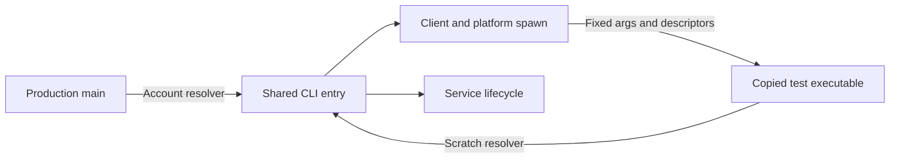
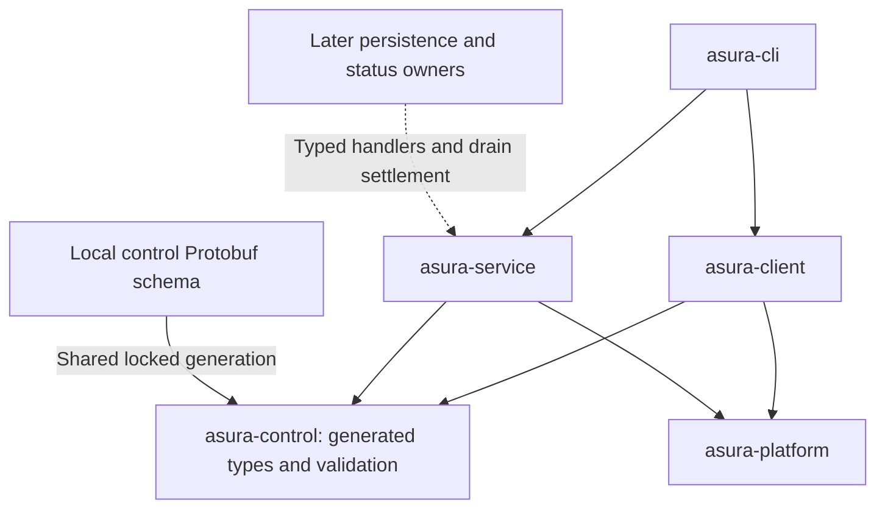
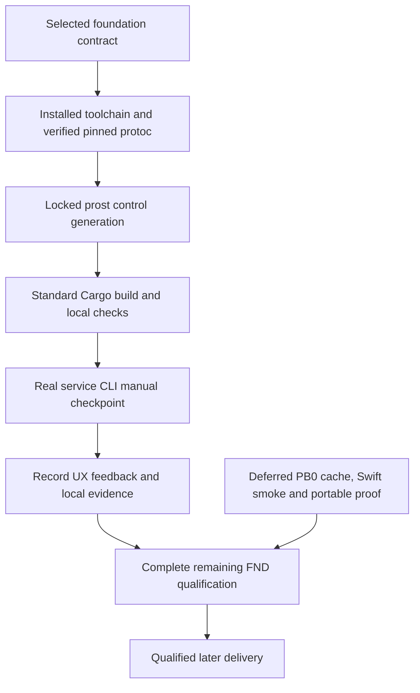

# Production foundation implementation packet

This packet records the initial service delivery stages. Later component packets
add the production TUI, automatic fresh initialization, storage and model execution.
Use the [project overview](../../README.md) for the current developer workflow and
the [design index](../designs/README.md) for current contracts and evidence.
The initial `authority_not_installed` checkpoint below describes that earlier
scope; it is not the expected result of a fresh launch with the current build.

**Status: the owner authorized progress toward a real manual trial on 2026-09-26.**
The owner's latest instruction makes Asura implementation approval implicit and
selects service-first delivery. Stages 1–2 use standard Cargo, the installed
toolchain, verified pinned protoc and locked prost generation. Full PB0 cache,
Swift smoke, portable snapshot and custom-driver work are not prerequisites.
The [service design](../designs/system-architecture.md#foundation-service-proposal-stages-12)
owns the service contract. The [early status slice](../designs/early-production-status-slice.md)
consumes it in later stages. This packet does not complete I0 or I1.

## Delivery boundary and decisions

Stage 1 establishes the minimal Rust workspace and checks. Stage 2 adds the
local service, reusable client and explicit lifecycle CLI. This packet creates
no authority journal, graph store, registry, Git observer, TUI, task or model.
It does not copy the synthetic experiment into production.

The proposed qualification tuple is Rust/Cargo 1.98.0, edition 2024, macOS 27
and Apple silicon. Use the installed Xcode 27 SDK. The
[Protobuf bootstrap](../designs/protobuf-toolchain-bootstrap.md) owns its Swift
and generator qualification. Foundation proposes `libc` 0.2.189. Local control
uses the shared `prost` and `prost-build` 0.14.3 pins; descriptor processing uses
matching `prost-types` 0.14.3 at build time. CLI JSON presentation alone uses
`serde` 1.0.229 and `serde_json` 1.0.151. This document does not claim that the
proposed service builds with this dependency combination.
No async runtime is selected. One nonblocking reactor owns event admission.

### First developer manual checkpoint

Use the existing stage-2 contract for a small real trial: inspect absent status,
start the service, attach from a second terminal, stop it and restart it. Confirm
that attachments share the current epoch and restart creates a new epoch. Also
run foreground mode and interrupt it. Installation must remain explicitly
`authority_not_installed`; this checkpoint includes no graph, task, model or TUI.

This checkpoint is a developer trial, not full foundation qualification. Required
local checks run before the trial. Cross-account, login-session and performance
qualification remain recorded separately until their host fixtures are available.
Manual feedback does not waive any FND acceptance criterion or establish release
readiness. The real project/Git TUI remains the next user-facing milestone.

**Selected FND-D1:** the owner chose `~/.asura/run/` on 2026-09-26. Runtime-only
directories do not establish installation state. The service design defines the
proposed path validation and live-replacement support boundary.

**Selected FND-D2:** the owner chose Protobuf for both control and model channels.
The service contract remains separate from model-channel semantics. Its framing,
strict validation and schema assignments still need scoped review. The foundation
consumes the existing pinned bootstrap; it does not create another generator owner.

## Later feature sequence

**Selected user sequence:** Complete the main functionality before adding further
features. The later feature list includes:

- System status and resource monitoring.
- Multi-agent coordination and management.
- Standardised maintenance workflows.

This list is not exhaustive. These features remain outside the current logging
implementation scope. Their detailed contracts and acceptance cases belong to
later scoped designs.

## Logging implementation delta

The owner requested standard Rust `tracing` output and optional `--logs DIR`.
The selected [service logging contract](../designs/system-architecture.md#service-logging)
supersedes detached stderr suppression. This feature remains unverified until the
following checks pass; earlier checkpoint evidence does not include logging.

| Owner | Scoped work |
| --- | --- |
| CLI | Parse `--logs` for start/run/stop/status; install one standard fmt subscriber, preserve JSON stdout and typed setup errors |
| Platform | Open/validate append sink safely and duplicate its borrowed descriptor onto spawned stderr; preserve startup descriptor 3 |
| Service | Emit bounded serving/draining/stopped/error events through tracing; own no subscriber or log path |
| Root integrator | Pin/review tracing dependencies and update the existing root lock; no new cache, wrapper or supervisor |

Keep default stderr logging and append-only `asura.log` selection. Do not add
rotation, background queues, remote collectors or dynamic service reconfiguration.
A repeated start with another sink only changes the client invocation's output.

### Logging acceptance

**Unit:** Parse every public command with and without `--logs`; reject duplicates
and missing values. Verify stable event/error fields, formatting without ANSI,
JSON separation and setup failure before service operations. Subscriber setup
must not race across tests through repeated global installation.

**Integration:** Use real temporary directories and files. Check creation modes,
append preservation, symlink/nonregular/unsafe existing entries, invalid paths
and failure without fallback. Spawn a real service with a file sink; verify child
lifecycle events reach that file after the start client exits, with descriptor 3
still carrying only the startup notice. An existing service keeps its original
sink when another client selects a different directory.

**CLI end-to-end:** Run foreground start/interrupt and detached start/status/stop
with default stderr and `--logs`. Check timestamp/level/event format, serving then
draining/stopped events, JSON-only stdout, no raw path/payload disclosure and no
runtime mutation on sink-setup failure. Use a regular file or `/dev/null` for
captured detached stderr; inherited pipe EOF is not command completion evidence.
These cases extend FND2/FND7/FND9/FND10. Existing service tests remain required.

### Isolated CLI lifecycle test

The CLI keeps one application entry point in `asura-cli/src/app.rs`. It accepts
a runtime-directory resolver function. The production entry point supplies
`RuntimeDirectory::account`; no production argument or environment override is added.
A Cargo test executable with `harness = false` supplies the existing scratch
resolver. Its private home is relative to its copied executable, so detached
startup preserves isolation after clearing the environment and changing cwd.
Only the test executable uses this resolver. Platform spawn, child arguments,
startup descriptor 3, logging, client and service code remain shared.

The test controller copies its executable into a fresh private temporary directory.
Service arguments enter the shared CLI application; invocation without arguments
runs the test controller. Each case uses a separate private home. Capture detached
stderr in a regular file. Bound each child wait and status poll by a deadline.
Before deleting a case directory, send Stop through its control client and verify
owner release. Signal only a foreground child that the controller still owns. Use a narrow
test-only `libc::kill(SIGINT)` call after checking the retained child is unreaped;
the existing pinned libc is a test dependency. Do not spawn a delayed signal helper.
If cleanup cannot confirm settlement, keep the case directory and fail the test.

Cover foreground run/interrupt and detached start/status/stop with each sink.
Check log append, timestamps, levels, lifecycle order, JSON separation, and
unchanged daemon sink on repeated start. Reject an unsafe log destination before
runtime creation. These tests use no account runtime and add no release switch.



### Logging validation checkpoint (2026-09-26)

Implemented the logging delta and rebuilt `target/debug/asura`. Reviewed exact
pins `tracing 0.1.44` and `tracing-subscriber 0.3.23`, with minimal std/fmt features,
and the full 135-package registry lock before building. The CLI fixture uses the
already reviewed libc 0.2.189 as a test dependency; no registry package was added.

- All 36 tests across the five production crates and five isolated CLI lifecycle
  cases passed with `--test-threads=1`.
- Real filesystem tests cover private creation, append, aliases, unsafe modes,
  hard links and nonregular entries. The native spawn fixture checks stderr and
  startup descriptor routing through the production file actions.
- Two real scratch service cycles verify serving/draining/stopped log order.
- CLI tests check parsing, append formatting and JSON setup-failure separation.
- Clippy for all five crates and all targets passed with `-D warnings`.
- Workspace formatting, diff whitespace and the normal CLI build passed.

The command is `cargo test --locked -p asura-platform -p asura-control
-p asura-client -p asura-service -p asura-cli -- --test-threads=1`, with the verified
local protoc selected through `ASURA_PROTOC`.

The user's existing service was not stopped or reconfigured. A later isolated CLI
trial passed all five cases: foreground stderr/file, detached stderr/file and
unsafe log setup. The test executable uses the shared CLI application with a
scratch resolver; production retains the account resolver. These cases verify
child startup, lifecycle events, repeat-start sink retention, JSON separation and
failure before runtime creation. Full host and release qualification remains
incomplete.

The new test-flow Mermaid diagram was checked against its prose. Local Mermaid
CLI 11.16.0 could not launch Chrome in the sandbox; its elevated retry stalled
and was cancelled. No renderer processes remained after cancellation. Visual
validation of that diagram remains incomplete.

## Canonical paths and owners

The root workspace excludes `experiments/tui-chat`. That experiment keeps its
own lock and established validation. Production modules must not import its
synthetic model, fixtures or lifecycle policy.

| Owned path | Responsibility |
| --- | --- |
| `Cargo.toml`, `Cargo.lock`, `rust-toolchain.toml` | Foundation owns root workspace, pins and member integration. |
| `rust/crates/asura-platform/` | macOS account paths, descriptor validation, peer UID, owner lock, polling, signals and fixed spawn. Only FFI owner. |
| `contracts/control/v1/control.proto` | Canonical local control schema. Separate from the bootstrap smoke and model-channel schemas. |
| `rust/crates/asura-control/` | Generated Protobuf bindings, descriptor-derived validation tables, strict frame codec and semantic validation. Runtime code has no filesystem or process access. |
| `rust/crates/asura-control/build.rs` | Generate bindings and tables into OUT_DIR through the shared locked toolchain. No tool acquisition. |
| `rust/crates/asura-client/` | Bounded attachment, identity validation, request correlation and client result mapping. |
| `rust/crates/asura-service/` | Sole reactor, lifecycle dispatcher, service inspection and drain barrier. Future registry/persistence owners attach here. |
| `rust/crates/asura-cli/` | Binary `asura`; argument parsing and output. Uses client/service owners; contains no duplicate policy. |
| `scripts/check` | Deferred check integration; not required for the first manual checkpoint. No new wrapper or supervisor is introduced. |
| `rust/crates/asura-service/tests/` | Real socket/process/lock integration and fault scenarios. |
| `rust/crates/asura-cli/tests/` | CLI end-to-end workflows through compiled binaries. |
| `.github/workflows/foundation.yml` | Same supported check entry on a qualified macOS 27 arm64 runner. |

Production directories receive scoped `AGENTS.md` files when their creation is
authorized. Root and directory guidance retain the design and test gates.
Test-only fault entry points must compile only into harness binaries. The release
CLI has no runtime path override or fault flag. Test endpoints stay inside owned
scratch roots; tests must never address the real account endpoint.

The platform module exposes owned handles: `RuntimeDirectory`, `OwnerGuard` and
`AuthenticatedStream`. Constructors validate identity before returning success.
Only `OwnerGuard` may bind/remove the endpoint. `ControlCodec` accepts bytes and
returns typed messages or errors. `ServiceDispatcher` owns lifecycle transitions.
`ControlClient` owns attachment identities and request counters. Errors remain typed
until the CLI renders them. This dependency direction prevents a second owner.

### Proposed module dependency view

Arrows mean compile-time dependency. Later status owners register typed handlers
with the service. They must not introduce another listener or client registry.



## Service-first build sequence

The owner's latest instruction supersedes the earlier requirement to complete PB0
before foundation implementation. Use the installed pinned Rust toolchain and
standard Cargo commands. Verify the selected protoc identity and use the locked
prost/prost-build versions for control generation. Reuse the existing verification
owner and prepared compiler; do not create another downloader, cache or supervisor.
The build script remains a thin schema adapter and fails on missing/wrong tools.
Supply `ASURA_PROTOC` as an explicit absolute verified compiler path. It must
report the locked version 36.2. There is no ambient PATH lookup, download or
Swift-generator requirement. The primary verifies the pinned archive/member
identity or supplies the verified staged compiler; a version string alone is
not archive provenance.

Integrate in this order:

1. Add the reviewed service crates and canonical control schema to the existing
   root workspace, with one manifest/lock writer and dependency review.
2. Generate Rust control bindings using verified pinned protoc and locked prost.
   No Swift service binding or smoke fixture is needed for this generation.
3. Run the standard Cargo checks below and real local service/CLI cases.
4. Exercise the documented developer manual checkpoint and record UX feedback.
5. Complete remaining FND host/offline and PB0 qualification separately before
   claiming full foundation or release readiness.

The existing driver has 45 passing checks. Stop expanding it for this milestone.
PB0.3 full cache publication, PB0.4 Swift smoke, PB0.5 portable-cache qualification
and a custom foundation driver profile remain deferred work. They are not a
reason to delay this service checkpoint. Existing driver/cache owners remain
canonical when that deferred work resumes.

### Delivery dependencies

Selected immediate path and deferred qualification. Arrows show dependencies;
the manual preview is distinct from completed qualification.



## Validation and executable check contract

Run these standard commands from the repository root with the installed selected
toolchain and verified protoc supplied through the existing build contract:

```sh
cargo fmt --all -- --check
cargo clippy --locked -p asura-platform -p asura-control -p asura-client -p asura-service -p asura-cli --all-targets -- -D warnings
cargo test --locked -p asura-platform -p asura-control -p asura-client -p asura-service -p asura-cli
cargo build --locked -p asura-cli
```

Use the physical installed Rust 1.98.0 toolchain binaries when a rustup component
proxy is unavailable. In the recorded run, the installed `stable` toolchain also
reported 1.98.0 and supplied Clippy; the named `1.98.0` component proxy did not.
The primary used that matching physical toolchain, not a different Rust version.
Record the resolved compiler identity with later runs.

No new `scripts/check` wrapper, custom driver extension or replacement process
supervisor is required. Use Cargo's normal build paths and locking. Do not claim
portable/offline cache qualification from these commands. Source generation must
still reject absent or mismatched protoc and regenerate changed control inputs.

Tests select the five named packages; report that scope. Formatting covers the
workspace. Preserve unit, real integration and CLI end-to-end cases below. Each
foundation test process retains its 60-second bound; stress retains 120 seconds.
Keep original failures when cleanup also fails. Record host cases requiring a
second account or login session as incomplete until available. They are not
silently passed or removed for the developer trial.

Later check-driver/CI integration can reuse the existing canonical driver under
its existing ownership. The shared-driver and portable-cache cases remain full
qualification tasks rather than prerequisites for standard Cargo development.

| ID | Initial state and trigger | Required result | Required evidence |
| --- | --- | --- | --- |
| FND1 | Valid or malformed frame arrives in fragments. | Exact frames decode once; invalid version, wire type, duplicate/unknown field, oneof, enum, depth, UTF-8, size and sequence fail before dispatch. | Unit boundary corpus; real fragmented/coalesced socket integration; CLI against malformed peer fixture. |
| FND2 | No service; two clients start concurrently. | One guard and listener win. Both clients attach or return bounded unavailable. | Unit arbitration; 100 real paired starts; CLI starts and status agree on epoch. |
| FND3 | Owner dies before bind or after serving. | Lock releases on death. Next owner removes only validated stale socket and gets a new epoch. | Unit startup/cleanup decisions; separate kill points; CLI restart rejects old attachment. |
| FND4 | Lock held while endpoint is absent, hung or incompatible. | No takeover or forced signal. Start exits within five seconds. | Unit retry policy; real held-lock/hung-peer tests; CLI reason and unchanged owner. |
| FND5 | Peer effective UID differs; same-UID peer attaches. | Different UID receives no status bytes. Same UID negotiates; it gains no other principal claim. | Unit UID predicate; actual two-account socket clients and server; CLI rejection in both directions. |
| FND6 | Alias, ACL, hard link, unsafe mode, long path or endpoint substitution. | Reject before unsafe access/removal. Preserve replacement. | Unit path rules; separate real filesystem cases; CLI typed failure and file hashes. |
| FND7 | Serving epoch receives Stop, duplicate Stop, disconnect or termination signal. | One drain. Matching owner settles; successor is untouched. Unknown outcome stays explicit. | Unit state orders; real signal/drop/successor races; CLI stop/status reconciliation. |
| FND8 | 32 clients fill buffers or send slow partial frames while one inspects. | Caps hold. Timers/signals run. No unbounded allocation or starvation. | Unit accounting; real flood/slow-reader integration; CLI inspect p95 under 100 ms over 1,000 samples on recorded host. |
| FND9 | Client terminal exits; login session ends; cache cleanup runs. | Detached service remains attachable where session policy permits. Anchor persists; unsupported logout behavior is reported. | Unit launch environment; real process/session and cache lifecycle; second-session CLI attach. |
| FND10 | Stage 2 has no authority module; user inspects or requests unsupported work. | Explicit authority unavailable; only validated runtime creation; no authority/project write, fabricated readiness, task or model request. | Unit capability projection; filesystem snapshots and real service integration; CLI output and absent effects. |
| FND11 | Build overlaps another check, times out or loses driver. | Shared driver excludes overlap and preserves its established cleanup marker rules. | Bootstrap BT3 evidence plus foundation check through the same driver. |
| FND12 | Control schema/tool lock changes, output is removed or tools are missing; repeat offline. | Bindings and validation tables regenerate together, or compilation fails. No ambient generator or stale output passes. | Unit tool-selection checks; actual control rebuild variants; clean offline control build from refreshed root Cargo snapshot. |

FND6 includes live directory, lock and socket replacement as separate cases.
Detection and fail-closed behavior do not prove exclusivity against malicious
same-UID replacement; the documented runtime lifecycle remains an explicit support boundary. FND7 includes
normal exit, SIGINT, SIGTERM, SIGHUP and crash as separate process variants.
FND9 must record terminal/logout policy rather than claiming every macOS session
manager leaves arbitrary detached children alive.

Cross-UID and login-session cases use a prepared test host. Do not change account
policy, create users, purge a real cache or log out a user's active session as a
side effect of the ordinary test command. The host runner must explicitly provide
isolated accounts and session fixtures. Missing prerequisites are a proof gap.

## Completion and handoff

Record host/SDK/compiler versions, dependency lock digest, exact commands, timing,
case results and remaining gaps. Keep stdout machine-readable for `--json`;
write bounded diagnostics to stderr without payloads or private paths.
Exit codes are 0 for success, 2 for invalid arguments, 3 for unavailable service,
4 for incompatible protocol, 5 for unsafe runtime and 6 for outcome unconfirmed.
A stopped service is a successful inspection result with `service: absent`.

PB0 smoke success cannot replace FND12. Test missing protoc and a wrong tool
lock independently during local generation checks. Refresh the canonical snapshot
and prove clean offline control builds during deferred full qualification; local
manual-preview evidence must state that gap.

Stage 1 completion proves the reviewed workspace builds and its checks run.
Stage 2 completion additionally requires FND1–FND12 on the supported host.
Neither proves journal durability, graph binding, Git confinement, native TUI
behavior or model execution. Those remain later packet gates.

Current readiness: the five production crates and canonical control schema are
implemented. The local developer manual checkpoint passed. Full foundation
qualification remains incomplete; the evidence below does not mark every FND
case complete or establish release readiness.

### Developer checkpoint evidence on 2026-09-26

The primary recorded this evidence on the selected macOS host. This documentation
update did not rerun the commands. Standard Cargo used verified pinned protoc,
locked generation and the physical installed Rust 1.98.0 toolchain.

| Check | Recorded result and scope |
| --- | --- |
| Foundation package tests | 29 passed across the five production packages |
| CLI | Two unit and two command tests passed |
| Client | Three tests passed, including the native held-lock case |
| Control | Six validation-corpus tests passed |
| Platform | Twelve tests passed, including real filesystem and startup-pipe cases |
| Service | Three unit tests and one real socket integration test passed |
| Clippy | All targets in the five packages passed with warnings denied |
| CLI build | Default build passed without features |

The reviewed root lock contains 128 registry packages; the previous 105 are
unchanged. Its SHA-256 is
`a52cdb675d4b6e3ede9a303be053b0cc350e788af9e0661d55e0fb2ee0255650`.
This records the tested dependency identity; it is not portable-cache evidence.

The real-account CLI journey passed in this order:

1. Status reported absent without starting a service.
2. Start and an independent status request reported the same service epoch.
3. Repeated start attached to that same epoch.
4. Stop completed, then status reported absent.
5. Restart reported a new epoch, followed by successful stop.

Two simultaneous starts also converged on one epoch. Foreground `service run`
followed by SIGINT exited normally; status then reported absent. The service was
left stopped. The trial created only runtime state under `~/.asura/run/`, with
directory mode 0700 and lock mode 0600. It created no database, task or model state.

The manual preview is available for UX feedback. Remaining full FND work includes
100 paired starts, cross-UID checks, the complete fault/load/logout matrix and
FND12 offline/regeneration variants. Shared-driver and portable-cache qualification
remain deferred as specified above. These gaps do not block this local preview,
but they do prevent a claim of completed foundation or release qualification.

## Documentation checks on 2026-09-26

Mermaid CLI 11.16.0 rendered the service and packet diagrams locally. PNG previews
were inspected; overlapping state labels were shortened. Local link targets and
`git diff --check` passed. These checks validate documentation only. The separate
developer-checkpoint record above supplies the current implementation evidence.

The service-first dependency diagram supersedes the prior bootstrap-first view.
Its current visual inspection is pending because local Mermaid browser launches
are stalled; this proof gap does not block the owner-directed implementation path.
