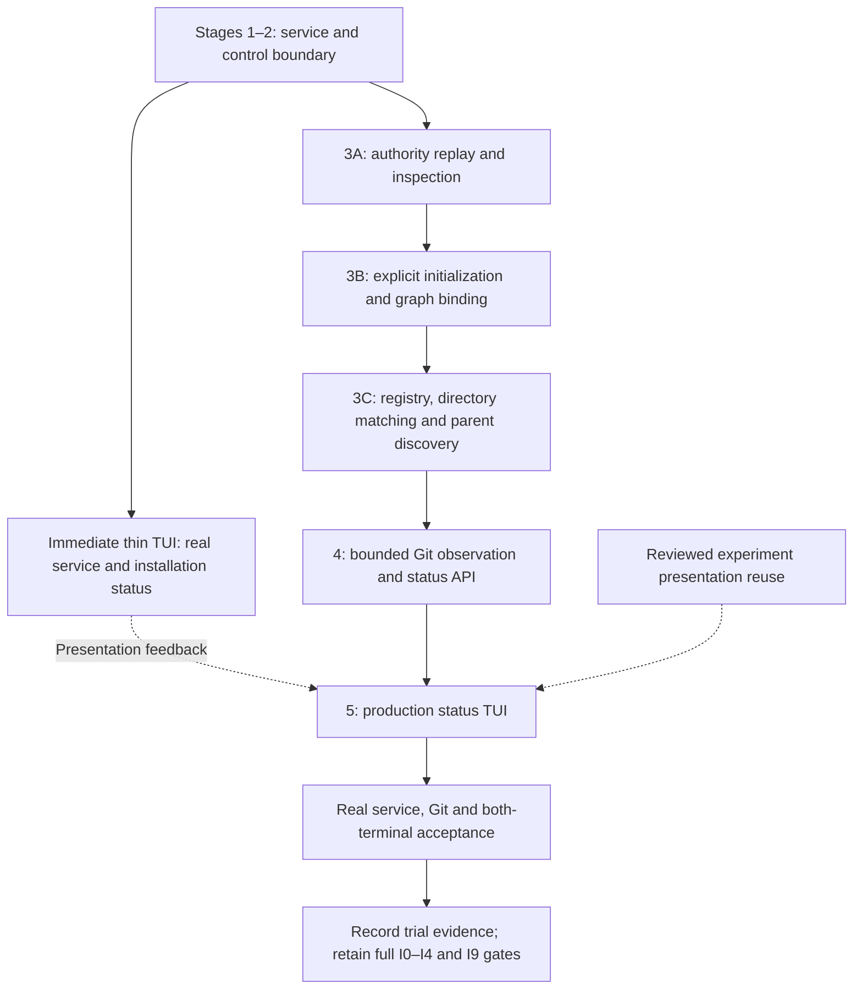
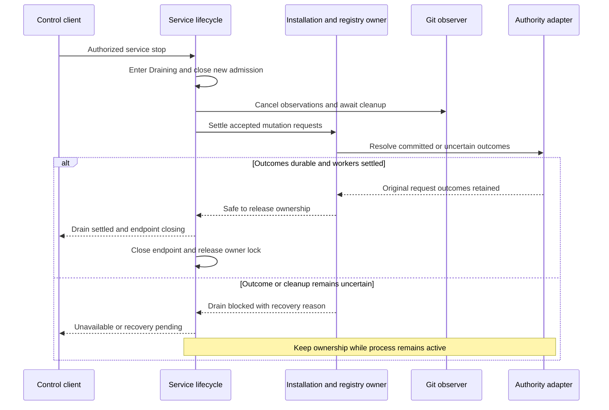
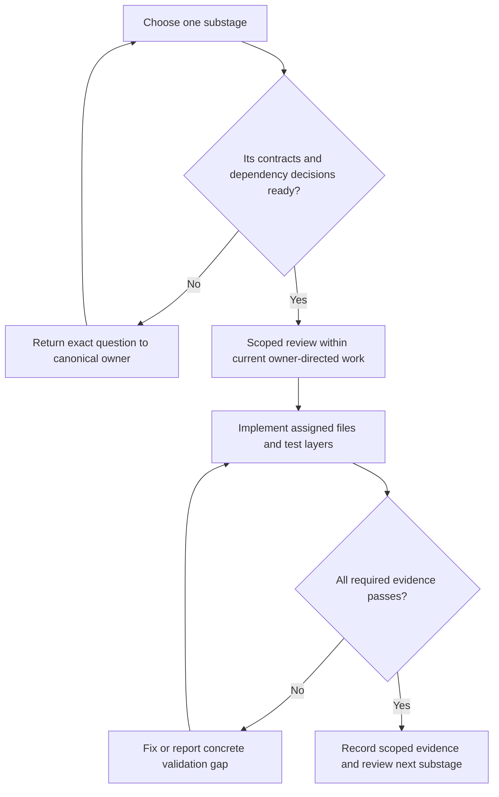
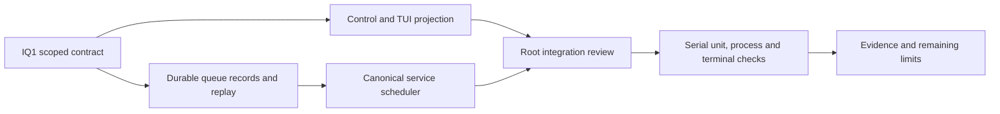

# Production status delivery: stages 3–5

Status: stage 3A read-only inspection is selected for scoped implementation under
the current implicit authorization. Later deliveries remain proposed. This packet
divides the selected early status trial into small deliveries.
Several prerequisite contracts remain open; the readiness register identifies
the exact owner for each. No production behavior is implemented or verified by
this document.

## Scope and prerequisites

Stages 1–2 provide the Rust workspace and standalone service under the
[service design](../designs/system-architecture.md). This packet consumes their
single control channel, account authentication, service lifecycle and drain hook.
It adds installation recovery, graph binding, registration, Git observation and
the real status TUI. The [early status design](../designs/early-production-status-slice.md)
owns trial scope. The [bootstrap design](../designs/production-bootstrap-status.md)
owns user-visible registration and status semantics.

The [implementation entry gate](implementation.md#entry-gate) applies separately
to every substage. Design review can proceed now. Implementation starts only
when its dependencies are ready. The current owner instruction supplies
implementation authorization; no repeated approval request is needed.
Later substage gaps do not authorize earlier code or excuse missing checks.

The packet exposes no agent execution, model session, remote inference, host tool,
source modification, Skill or MCP capability. Agent submission remains unavailable
and preserves the draft. Model identity is unavailable and context use is `?%`.
Both embedded and external graph bindings remain required. No external outage
selects an embedded fallback.

### Delivery dependencies

Proposed delivery view. Solid arrows require the predecessor's real component
and user-visible checks. The dashed edge supplies independent presentation work
only after its own design review; it does not bypass a service prerequisite.

## Canonical owners and serial integration

Use the [proposed language and module allocation](architecture-and-design.md#proposed-language-ownership).
The Rust orchestrator, composed within the foundation service, owns installation,
registry and status projection. The
storage adapter owns file encoding/replay and graph access. The service control
adapter owns peer checks, wire validation, disclosure and delivery. The reusable
Rust client owns attachment and response routing. The TUI owns input and display.
The canonical policy owner decides authorization; the protocol does not invent
an allow-all policy for the same-UID principal.

The Git collector belongs to the existing host execution responsibility. Its
module and backend require D2/D4 review. It supplies observations and cannot
write the registry or publish directly. A Swift native adapter, if required by
D1, returns narrow platform evidence to the Rust owner. The selected Swift model
helper is absent from this slice's execution path.

The following are proposed file ownership boundaries, not scaffolding permission.
Use the foundation's final module layout before assigning implementation writers.
A module's root, manifest, shared schema and host wiring have one integration
owner. Component writers do not edit those shared files concurrently.

| Delivery | Exclusive component responsibility | Proposed area |
| --- | --- | --- |
| 3A | Authority frame adapter and replay | `rust/crates/asura-storage/src/authority/` |
| 3A–3B | Installation state and recovery coordination | `rust/crates/asura-service/src/installation/` |
| 3B | Bound graph identity adapter | `rust/crates/asura-storage/src/binding/` |
| 3C | Registry and logical-location validation | `rust/crates/asura-service/src/registry/` |
| 4 | Bounded Git observation | `rust/crates/asura-service/src/git_observation/` |
| 4 | Scoped status projection | `rust/crates/asura-service/src/status/` |
| 5 | Production status TUI | `rust/crates/asura-cli/src/tui/` |
| Serial integration | Domain types, policy calls, control/client adapters and host composition | Foundation service, platform, control, client and CLI modules; canonical policy owner |

These areas require exact filenames in each authorized handoff. That handoff must
also assign the matching unit, integration and end-to-end test paths. Do not create
all crates in advance. Reuse existing canonical modules where the foundation
collapses organizational boundaries. The experiment remains isolated; production
does not add filesystem or network access to its fixture providers.

## Shared service contracts

Service lifecycle and installation state are separate. A stage-2 service reports
installation unavailable with reason `authority_not_installed`. It may validate and create
the selected `.asura/run/` runtime area, but cannot infer installation state
from that directory. Stage 3A installs the authority owner,
which may then report the installation states defined by the bootstrap design.
The service can answer diagnostic status while installation recovery is blocked.

### Semantic operations

Proposed operation names; CLI spelling and wire encoding remain with their
canonical D6 and control-protocol owners. Every request uses the foundation's
authenticated attachment. Every result rechecks disclosure authority.

| Operation | Input and result | Owner and admission |
| --- | --- | --- |
| InspectInstallation | Current installation availability, reason and permitted recovery hints | Orchestrator; diagnostic access does not create files |
| InitializeInstallation | Stable request ID, graph mode, configuration revision and credential reference; original operation outcome | Orchestrator; explicit authorization and qualified root creation |
| ResolveRequest | Original request ID and command digest; committed, absent or unresolved result | Authority owner; current disclosure checks precede result access |
| RegisterLocation | Stable request ID, directory, name, optional context ID and expected revision; durable association plus current availability | Registry owner; graph-ready, current policy and pinned identity |
| ListProjects / MatchLocation | Bounded authorized identities or matching associations | Registry owner; no metadata for denied contexts |
| MarkProjectParent / ListCandidates | Explicit marker request or bounded discovery request | Registry/discovery owner; candidates grant no project or work authority |
| GetStatus | Installation, project, location, logical directory, optional conversation and view identity; ordered observation or unavailable | Projection owner through the control API |

The durable request ID and command digest survive a transport timeout. A retry
uses the original identity; a changed digest is a conflict. A committed registry
result is distinct from current location availability. Replayed success cannot
retarget a replacement pathname or reveal a result after permission loss.

Status uses the [publication and attachment contract](../designs/production-bootstrap-status.md#publication-and-attachment-validity).
A view generation alone cannot fence an old attachment or order two Git results.
The proposed first mechanism has one outstanding request per attachment, bounded
polling and no stale cache reuse. Wire schemas must carry the identities needed
for those checks. The owner selected Protobuf for service control on 2026-09-26.
These operations extend `contracts/control/v1/control.proto` through its canonical
owner after schema review. They do not introduce another codec or toolchain.

### Shutdown integration

Proposed sequence extending the foundation's canonical drain hook. Arrows denote
control and settlement evidence. An accepted stop is a request; final Stopped
requires the owner lock to be released after all owners settle.

A crash does not complete this handshake. The next owner replays authority before
admitting mutations. Stage 4 extends the same drain hook to its observer. It does
not add another process supervisor or treat a timeout as proof that workers exited.
The foundation owns the wire meaning of final shutdown acknowledgement.

## Stage 3A: authority replay and inspection

**Runnable result:** the real CLI attaches and inspects existing authority or an
uninitialized installation. Normal launch may create the validated `.asura/run/`
runtime area, but writes no installation record. A runtime-only root can remain
Uninitialized; partial or unknown installation content requires repair. Invalid
or ambiguous state returns RepairRequired with bounded diagnostics.

Implement the [authority adapter](../designs/persistence-recovery.md) only after
its encoding, checksums, limits, durability, replay and compaction contracts are
ready. Recover its installation identity, original request outcomes and owner
generation. The service must not publish ready state from an uncertain replay.
This substage introduces no user initialization or registration command.

**Unit acceptance S3A-U:** validate every field/version boundary; reject broken
chains, interior corruption and unsupported formats; distinguish an incomplete
tail from a proved commit. Test denial of an obsolete owner.

**Integration acceptance S3A-I:** use real files and processes for short writes,
failed flush, process death and slot-switch faults. Preserve original bytes.
Test replacement of authority paths and rejection by another OS account.

**End-to-end acceptance S3A-E:** launch the CLI against absent, runtime-only, valid, incomplete
and corrupt fixture installations in isolated OS accounts or VMs. Observe the
correct service state after restart. A test state-directory flag cannot create
another production owner under the same account.

**Exit evidence:** PR7–PR8 and applicable PBS1–PBS2/PBS15 cases, plus the authority
format's independent fault matrix. Filesystem durability claims require the
qualified supported filesystem; process-kill tests do not prove power-loss safety.

### Selected first delivery: 3A inspection only

Implement the [read-only authority contract](../designs/persistence-recovery.md#stage-3a-bounded-read-only-authority-inspection)
before the write-enabled authority adapter. The user can inspect an uninitialized
installation or diagnostic replay result through the real service. No command
creates installation state, repairs a tail, connects to SurrealDB or dispatches
work. This delivery does not complete full stage 3A or claim its writer evidence.
The existing S3A-U/I/E and PR7–PR8 requirements remain; short-write, flush,
slot-switch and writer restart tests are mandatory before write-enabled delivery.

Reuse the foundation runtime checks, reactor, attachment identity and drain hook.
Do not add a wrapper, cache, supervisor, Swift helper or separate service.
System/resource monitoring, multi-agent management and maintenance workflows
remain later features. This inspection is installation state, not resource monitoring.

#### Control and CLI contract

Extend the canonical `contracts/control/v1/control.proto` and strict validator
through their existing owner. Select exact local protocol version 1.1; preserve
1.0 rejection semantics, with no silent version fallback. Both ends must be
upgraded together. Existing message tags remain unchanged.

Add Envelope body tags 17 `InspectInstallation` (empty request) and 18
`InspectInstallationReply`. Add capability 3 `INSPECT_INSTALLATION`. Both messages
use existing authenticated attachment, epoch and request counter rules. Only
that capability permits the request; read-only inspection needs no durable request
ID. Existing Inspect reports the same installation state/reason as the new reply.
Existing Stop behavior remains available while the scan is pending or failed.

| Reply field | Tag and wire type | Semantic requirement |
| --- | --- | --- |
| `installation` | 1, optional InstallationState | Required; current classified state |
| `reason` | 2, optional InstallationInspectionReason | Required; stable code below |
| `installation_id` | 3, optional bytes | Exactly 16 nonzero bytes only after complete valid replay |
| `authority_revision` | 4, optional uint64 | Positive final revision; present only with installation ID |
| `recorded_owner_generation` | 5, optional uint64 | Positive historical generation; never a current dispatch grant |
| `binding_generation` | 6, optional uint64 | Positive only for valid ActiveBinding |
| `authority_format` | 7, optional uint32 | 1 only after complete valid replay |

Preserve InstallationState values 0 unspecified and 1 unavailable. Add 2
uninitialized, 3 recovering, 4 graph_unavailable and 5 repair_required. No
GraphReady value or authority capability is added in this delivery.

Use one new reason enum: 0 unspecified (invalid); 1 inspection_pending;
2 runtime_only; 3 initialization_pending; 4 graph_verification_unavailable;
5 installation_remnants; 6 unknown_content; 7 unsupported_layout;
8 unsupported_format; 9 incomplete_tail; 10 corrupt_authority;
11 inspection_limit; 12 inspection_timeout; 13 unsafe_authority;
14 authority_changed; 15 inspection_io. Existing Inspect's reason field must
represent these same codes through a separate new field at tag 4 of that reply;
its old unavailable_reason field is absent in protocol 1.1. The validator rejects
mixed old/new reason fields rather than choosing one silently.

`runtime_only` pairs only with Uninitialized. Pending scan/initialization pair
with Recovering; valid binding pairs with GraphUnavailable. Remnants, unknown
content, unsupported layout/format, incomplete tail and corruption pair with
RepairRequired. Limits, timeout, unsafe/access failure, change and I/O failure
pair with Unavailable. Failed or incomplete replay omits all journal-derived
fields. No raw paths, configuration bytes, graph endpoints or OS error strings
cross this interface. Same-UID service authentication remains required.

Select `asura installation status [--json] [--logs DIR]`. It attaches without
starting the service or creating runtime state; absent owner returns unavailable
with `service_absent`. Reuse current logging selection and JSON isolation. Human
output uses one concise state/reason line. JSON is an object with
`schema_version: 1`, `service_epoch` (hex or null), `installation`, `reason`,
`installation_id` (hex or null), `authority_revision`, `recorded_owner_generation`,
`binding_generation` and `authority_format` (numbers or null). Include
`error_code` (null on a valid inspection reply; existing stable client error
otherwise). Local absent/incompatible/transport/logging errors use the existing
client/CLI owners; they do not fabricate a service reply or journal identity.
Exit 0 on a valid typed reply, including repair/uninitialized states. Preserve
the existing CLI classification: invalid arguments 2, unavailable transport or
log setup 3, incompatible protocol 4, unsafe runtime 5 and unconfirmed outcome 6
where applicable. An inspection reply cannot manufacture an unconfirmed mutation.
Inspection describes
state; exit 0 does not mean initialization or graph readiness.

The existing `service status --json` retains its fields and adds the new states
and reasons within its existing string fields. Its success remains service
inspection success; do not change its lifecycle meaning. Update shared human
rendering so it cannot imply a GraphUnavailable installation is ready.

#### Exact implementation ownership and checks

| Owner | Files for this delivery |
| --- | --- |
| Storage | `rust/crates/asura-storage/src/lib.rs`, `src/authority.rs`, `tests/authority_replay.rs`: byte parser and bounded replay only |
| Platform | Existing platform module plus `src/authority.rs`: validated read-only handles, directory census and retained identity checks |
| Service | `rust/crates/asura-service/src/installation.rs` and existing reactor wiring: one scan worker, state projection and drain join |
| Control/client | Existing schema, codec/validator and client modules: protocol 1.1 extension and bounded request/result mapping |
| CLI | Existing CLI parser/output plus `tests/installation_status.rs`: truthful inspection command |
| Root integration | Existing workspace manifest/lock: one storage member and reviewed digest dependency; no scripts or bootstrap additions |

Component writers own only assigned modules. The primary serializes manifests,
module roots and shared schema edits. Confirm existing module filenames before
handoff; do not create a second platform or protocol owner. New storage code has
no write API. Production paths are fixed; test roots use the existing isolated
fixture capability, never a production state-directory override.

| ID | Unit | Integration | End-to-end |
| --- | --- | --- | --- |
| S3AR1 | Every header/payload boundary, hash, kind, transition, overflow and duplicate ID | Real files for valid PendingInit/ActiveBinding, byte damage and size limits | CLI reports the corresponding state and no graph-ready claim |
| S3AR2 | Root-entry classification and all state/reason pairs | Absent/runtime/log-only, remnants, unknown entries, unsafe modes, links and denied reads | Start service then inspect each isolated installation; preserve bytes and no installation creation |
| S3AR3 | Partial frame and unsupported layout/version classification | Kill a fixture writer at each byte boundary; verify inspection never alters its bytes | Restart and inspect damaged state; no automatic repair or new identity |
| S3AR4 | Scan ID/epoch retirement, deadline and cancellation | Delayed scan, replacement, Stop during scan; reactor remains responsive and joins worker | Separate CLI status/stop during slow inspection; no stale result after restart |
| S3AR5 | Protocol fields, exact 1.1 version, capability and JSON nullability | Real socket/peer authentication, malformed frames and mismatched client | Absent service, valid reply, logging failure and incompatible service give specified outputs/exits |

S3AR3 tests the reader against crash residues. It does not qualify the future
writer's commit, flush or slot-switch behavior. Retain original files and hashes
before and after every integration/E2E inspection. Real-account mutation is not a
fixture strategy; use isolated accounts/VMs or the established test-only root.

Use standard Cargo with the foundation's verified `ASURA_PROTOC` and installed
pinned toolchain: `cargo fmt --all --check`, selected package `cargo test --locked`
and `cargo clippy --locked --all-targets -- -D warnings`. Select the storage,
platform, control, client, service and CLI packages explicitly for the test/lint
runs. Record actual commands and named S3AR cases. No new `scripts/check` entry is
required. File/worker integration and CLI journeys are required in addition to
parser unit tests. Full cross-account and host qualification remains recorded
separately; a local preview cannot claim those gates passed.

### Read-only implementation checkpoint (2026-09-26)

The scoped reader, filesystem adapter, startup scan, protocol 1.1 client and
`installation status` command are implemented. The normal developer CLI was
rebuilt. No initialization, authority write, repair or graph connection API is
implemented by this delivery.

The primary ran the following checks with the installed Rust 1.98.0 binaries and
verified local protoc selected through `ASURA_PROTOC`:

| Command scope | Result |
| --- | --- |
| `cargo test --locked -p asura-service -p asura-control -p asura-client -p asura-cli -- --test-threads=1` | 29 tests and 15 isolated CLI journeys passed |
| `cargo test --locked -p asura-platform -- --test-threads=1` | 21 tests passed |
| `cargo test --locked -p asura-storage -- --test-threads=1` | Six tests passed; real writer death covered all 482 fixture byte boundaries |
| `cargo clippy --locked` for all six packages, `--all-targets -- -D warnings` | Passed |
| `cargo fmt --all -- --check`, `git diff --check` | Passed |
| `cargo build --locked -p asura-cli` | Passed without test features |

The 56 tests exclude repeated child invocations of their fixture entry points.
The 15 CLI journeys comprise five logging/lifecycle cases and ten installation
cases. Installation cases cover absent and incompatible services, runtime-only
state, remnants, pending initialization, active binding, corrupt/incomplete or
unsupported authority and log setup failure. Journal fixtures remain byte-for-byte
unchanged across inspection and restart. These use the real CLI application,
service, socket and filesystem with a test-only scratch runtime resolver.

The delayed-worker integration test verifies real socket inspection and Stop,
responsive RepairOnly state, retained ownership and eventual release. Worker
unit tests reject late/obsolete results. A real root-entry change between scan
completion and publication rejects the retained witness. The delayed-worker case
uses the reusable client, not a separate CLI process; that precise CLI fault
journey remains additional qualification. Cross-account, power-loss and full
host/release qualification are not established by this checkpoint.

The lock contains the same 135 registry packages. The storage crate reuses
`sha2 0.10.9`; no new registry dependency was selected. The reviewed lock digest is
`4e452b20d2d7e4429dc7bba78b37bba740da4173dc99b9cf2202939442eb799a`.

The user's running service was not stopped or reconfigured. Protocol 1.1 requires
a matching service; a 1.0 client must stop an older service before replacement.
The existing diagram-rendering gap remains recorded below. This checkpoint does
not complete write-enabled stage 3A, stage 3B or the full status TUI.

## Stage 3B: explicit initialization and binding

**Runnable result:** an explicit CLI action initializes and reopens one installation
in embedded mode or against a configured external graph. The CLI resolves a lost
acknowledgement using the original request ID.

The orchestrator writes PendingInit, verifies the selected graph marker, then
writes ActiveBinding through the stage-3A adapter. No cross-store transaction is
assumed. An unknown graph write remains pending reconciliation. Missing embedded
data or conflicting identity requires repair. External unavailability preserves
local inspection and never initializes another graph.

**Unit acceptance S3B-U:** test initialization state transitions, partial external
settings, duplicate IDs and changed payloads. Deny initialization during uncertain
replay and preserve the original operation during retry.

**Integration acceptance S3B-I:** run PR1–PR6 against actual embedded and external
SurrealDB. Inject loss before/after each durable boundary and external partition.
Verify the expected graph marker and absence of embedded files in external mode.

**End-to-end acceptance S3B-E:** initialize, restart and inspect both modes through
the CLI. Repeat with a lost acknowledgement and a recreated database of the same
name. The latter cannot satisfy the saved graph identity.

**Exit evidence:** B1–B2, PBS2/PBS8 and PR1–PR6. Engine/version, external trust,
credential reference, marker schema and supported restore procedure are required
contracts before implementation. This substage does not deliver graph query or
model-context features.

## Stage 3C: registration and discovery

**Runnable result:** the CLI registers an existing directory, lists authorized
projects and asks the service to match a launch directory. The service returns
all eligible overlap matches. It never chooses the deepest match automatically.
The same registry owns an explicitly marked project parent and bounded candidate
discovery. A child needs a separate registration action.

One durable association binds the validated object identity. Recheck before
append, after commit and before each use. A replacement crossing commit creates
a committed but stale association. The result includes the canonical resolver's
configuration state; clients do not compose their own settings. Configuration
schema and admission rules must be ready before this substage.

**Unit acceptance S3C-U:** cover aliases, overlap, request replay, parent versus
project classification, logical-directory restoration and disclosure denial.

**Integration acceptance S3C-I:** replace real paths at every PBS3 interval; race
two registrations; inject unknown writes and graph outage. Test escaped child
symlinks, inaccessible entries and discovery limits. Verify no graph registry copy.

**End-to-end acceptance S3C-E:** register and inspect through the CLI, recover the
original result after reconnect, choose overlap explicitly, and register a child
of a discovery-only parent. No action creates source files, a conversation or task.

**Exit evidence:** PBS3–PBS4/PBS10–PBS11 and ES2–ES3. Initial visible TUI selection
waits for stage 5. Marker schema, filesystem identity and numerical discovery
limits remain required upstream decisions.

## Stage 4: real Git observation and status

**Runnable result:** a scoped CLI status command returns real typed Git observations
or explicit unavailable fields. The CLI receives the same status contract as the
later TUI. Model and task activity remain unavailable.

Use the [Git safety decision](../designs/production-bootstrap-status.md#git-collection-safety-decision)
and the [delivery mechanism proposal](../designs/production-bootstrap-status.md#proposed-first-status-delivery-mechanism).
Before implementation, D4 must select a collector that cannot invoke unapproved
helpers, write source/index data or perform network access. Command flags alone
are not evidence of confinement. Worktree metadata outside the selected directory
needs explicit validated access; a `.git` pointer is not a permission grant.

**Unit acceptance S4-U:** cover clean, dirty, detached, merge, rebase, unknown and
non-repository results. Verify HEAD counts without staged double counting and
no invented binary line counts. Cover PBS12–PBS14 ordering and expiry decisions.

**Integration acceptance S4-I:** use real Git fixtures, collector faults and actual
transport delays. Exercise configuration-controlled helpers, malformed metadata,
linked worktrees and exhausted bounds. Assert no helper/network/source-write
escape using the selected host enforcement boundary. Verify observer cleanup.

**End-to-end acceptance S4-E:** inspect each fixture through the CLI while switching
scope, reconnecting and restarting. A delayed success or unavailable result from
an obsolete request cannot change current status. Unrelated service control must
remain responsive during slow collection.

**Exit evidence:** PBS5/PBS7/PBS9/PBS12–PBS14 and ES4/ES6 at the CLI boundary. The
full terminal proof remains stage 5. Unsupported repositories must report unknown;
this cannot be counted as passing a fixture whose support the design requires.

## Selected immediate thin TUI checkpoint

The user brought the production TUI forward. Implement the
[thin TUI contract](../designs/early-production-status-slice.md#selected-thin-production-tui)
now using the delivered service/client and installation status. Stages 3B–4 are
not dependencies of this checkpoint. Full stage 5 below remains the later real
project/Git trial; none of its tests or capabilities is removed.

### Owned implementation and dependencies

The CLI owns `rust/crates/asura-cli/src/tui/mod.rs`, `editor.rs`, `view.rs` and
`terminal.rs`, plus `tests/tui_session.rs`. Reuse the experiment's editor and
terminal-guard implementation after removing fixture/task coupling. Production
must not depend on the experiment crate, fixture provider or synthetic model.
The one worker calls the existing client; no protocol addition, service policy,
new service process or direct Git/database reader is needed.

Use the experiment's pinned dependencies: Ratatui 0.30.2 with crossterm backend,
crossterm 0.29.0, rat-text 3.1.0 without default features,
unicode-segmentation 1.12.0, unicode-display-width 0.3.0 and signal-hook 0.3.18
where needed by the reused terminal guard. Root integration owns manifest/lock
changes and verifies compatibility with the production dependency graph. These
are existing experiment pins, not a claim that production builds already pass.
Do not add a second signal handler or copy platform service signal registration
into the terminal process. Standard Cargo checks remain the runner.

### Acceptance and manual feedback

| ID | Required evidence |
| --- | --- |
| TT1 unit | Editor Unicode, cursor, undo/redo, atomic paste and cap; Enter preserves exact draft/history; unsupported task/fixture keys emit no commands; help/exit confirmation/empty Ctrl+D routes |
| TT2 unit | Real typed snapshots rendered without invented project/Git/model/task fields; stale generation/epoch and five-second expiry clear claims; literal control escaping; 120×40, 80×24, 40×12 and below 30×8 layouts |
| TT3 integration | Actual service and authenticated client on isolated test paths; absent service then later startup, disconnect/restart/new epoch, slow or failed Inspect; editor remains usable and worker count/result slot remain bounded |
| TT4 PTY end-to-end | Real production binary: resize, multiline/paste, retained draft on Enter, empty exit and discard confirmation; setup/draw/unwind/handled-signal cleanup restores terminal modes; redirected input/output fails without mode changes |
| TT5 manual UX | Run in Ghostty and Terminal.app with a real service; type, paste, resize, inspect installation, stop/restart service from another terminal, then exit; record usability and native-key results separately |

TT3 must prove automatic startup only for absent/refused service, using the
existing launcher and default file log. It must prove no database initialization,
submission, duplicate owner or startup on unsafe/incompatible state. Tests address isolated service fixtures, not the developer's
live installation. Extend the existing `asura-fixture` basename dispatch so bare
fixture arguments enter the same application. The stdlib PTY harness receives
the fixture executable and its isolated root explicitly, using a temporary copy.
No release state-directory override or public fault flag is added. Slow Inspect must not delay input rendering: target at most
100 ms from supplied input to updated frame in the supported test geometry,
recording measured environment and result. After terminal restoration, worker settlement waits at most 100 ms; only a
finished thread is joined, then the binary exits. Gated worker tests prove the
UI does not depend on synchronous OS lookup completion. A failed PTY or
missing native terminal record remains a named gap, not a passing manual trial.

Run `cargo fmt --all --check`, selected CLI/client/service package
`cargo test --locked` and `cargo clippy --locked --all-targets -- -D warnings`
with the foundation's existing installed toolchain and verified ASURA_PROTOC.
Record exact selected packages and test names; no new wrapper, cache or driver.
The user can launch bare `asura` in a terminal; it starts an absent backend. The TUI
stops only the backend it launched when it exits; attached backends keep their
independent lifetime. Invite feedback on layout, editing,
status clarity and recovery before adding project/Git controls.

## Stage 5: production status TUI

**Runnable result:** `asura` shows the production composer, explicit initialization
and directory choices, project navigation and live status from stages 3–4.
Reuse presentation only after its dependencies and fixture separation are reviewed.
The TUI never reads Git metadata, managed authority files or model telemetry.

The client keeps per-project drafts and valid logical-directory selections.
Navigation does not change process cwd or retarget a draft. Enter reports agent
execution unavailable and preserves text. A hidden or stale scope cannot supply
the visible bar. Literal metadata rendering must reject terminal control injection.

**Unit acceptance S5-U:** test exact draft preservation, grapheme count, rendering
at supported widths, unavailable wording, keyboard focus and generation routing.

**Integration acceptance S5-I:** connect the actual client to the real service;
combine registration failure, status timeout, scope invalidation and resize.
Verify that no Enter path emits an agent-submission command.

**End-to-end acceptance S5-E:** run ES1–ES6 and all applicable PBS cases in Ghostty
and Terminal.app separately. Use real installation, registry and Git state. Record
input latency under slow collection, focus behavior, native shortcuts and recovery.
Screenshots and PTY checks supplement these journeys; they cannot replace them.

**Exit evidence:** both terminal records, real service fault results and a reviewed
capability matrix. The trial does not complete I0–I4 or I9 release qualification.

## Check commands and evidence record

For later stages, proposed invocations are `scripts/check status 3a`,
`scripts/check status 3b`, `scripts/check status 3c`, `scripts/check status 4`,
and `scripts/check status 5`. They do not exist yet and do not gate the selected
read-only 3A Cargo delivery above. D7 must define later runner invocations,
fixture creation/cleanup and supported versions before code starts. Each command
must run the stage's unit, integration and end-to-end checks; it must fail when a
required environment is missing. A separate documentation check cannot replace it.
The foundation owns shared formatting, linting and workspace checks. Its shared
check driver is extended serially; this packet does not add another bootstrap
or dependency preparation script.

Record design revision, source revision, command, result, toolchain, macOS build,
filesystem, database mode/version and terminal version. Record each fault case
separately. Store bounded redacted evidence and preserve source-tree integrity.
No test may use the developer's live installation or external database as a fixture.

## Readiness questions and dependency owners

The recommended answers below are proposals for review, not selected decisions.
The parent owns shared dependency documents and directory indexes.

| ID | Decision required before | Owner and concrete question | Recommendation |
| --- | --- | --- | --- |
| SP1 | 3A | D3: approve journal mechanism and specify frame/slot format, bounds, durable flush and recovery? | Keep the proposed single journal; finish `persistence-recovery.md` before its code. |
| SP2 | 3A | D1/D2: which filesystem, home/ACL rules and owner-loss mechanism are qualified? | Start with an explicit supported local-filesystem profile; reject unsupported homes. |
| SP3 | 3B | D3: which pinned embedded engine/server versions, marker schema and external trust/credential contract? | Qualify both required modes; retain one installation binding authority. |
| SP4 | 3C | D1/D3: exact location identity, resolver schema, parent marker and discovery limits? | Use the canonical resolver and registry; retain explicit child registration. |
| SP5 | 4 | D4: constrained Git process or Rust library, supported repository semantics and access envelope? | Select only after helper, source-write and metadata-escape evidence; do not assume Git is inert. |
| SP6 | 4 | D3/D7: accept proposed polling/deadline/expiry limits and define publication ordering? | Review the one-request mechanism, then qualify its numeric limits and disclosure point. |
| SP7 | 5 | D6: exact first-use actions, focus, project names, unavailable messages and saved-view lifetime? | Preserve one composer row and the selected launch-match priority; review actual controls before TUI code. |
| SP8 | Each stage | D7 and foundation owner: freeze module paths, runners and evidence environments? | Add one bounded substage at a time and integrate shared files serially. |

### Implementation gate

Required gate from the design process. Arrows name review results and missing
prerequisites. A predecessor's successful checks cannot approve a new mechanism.

The existing bootstrap document contains installation/registration state diagrams,
status entity relationships and publication sequences. This plan links those
canonical contracts rather than copying their states or inventing a second schema.

## Proposal validation

On 2026-09-26, Mermaid CLI 11.16.0 rendered all three packet diagrams. Each
preview was visually inspected at normal document width. A sequence-label
punctuation error was corrected before the successful render. The updated
bootstrap recovery diagram was also rendered and inspected. All 35 local links
and anchors across this packet and its two scoped design documents resolved.
Whitespace and delegation-baseline checks passed; only the three assigned
document paths changed.

These are documentation checks. The proposed status commands, numeric defaults,
filesystem/graph recovery and real-terminal journeys have no production runtime
evidence. The shared runtime-root contracts and plan indexes require the
parent's coordinated updates before this packet is integrated.

### Read-only 3A documentation validation

The read-only 3A update resolved all 17 local links across this packet and the
authority design. Whitespace checks passed. Two diagrams were added for inspection
and publication; the packet's implementation gate now reflects implicit approval.
Visual validation remains outstanding: the installed Mermaid CLI 11.16.0 browser
renderer failed or stalled in the primary's bounded attempt. A browser-free parse
accepted the sequence diagrams but hit a DOMPurify environment error for state
and flow diagrams. No syntax or visual pass is claimed for those affected views.
The earlier render record above does not cover these changes. No product code,
fixtures, builds or database operations ran during this design update.

### Thin TUI documentation validation

The thin checkpoint adds a selected interaction sequence and updates the delivery
view. It does not change the full project/Git acceptance gate. Local link and
whitespace checks cover the changed documents. Visual Mermaid validation remains
outstanding under the already recorded renderer failure; prior rendered diagrams
do not prove this update. No product checks or manual-terminal pass is claimed by
the design work.

## Thin TUI implementation checkpoint (2026-09-26)

Bare `asura` now opens the production TUI. It reuses the experiment's bounded
Unicode editor and terminal guard, with a new view over real service Inspect
results. The production binary and isolated fixture share one CLI library entry.
The existing synthetic experiment remains separate and unchanged.

The primary ran `cargo test --locked -p asura-cli -- --test-threads=1`: 30 unit
tests, three command tests and 15 isolated lifecycle/installation journeys passed.
The selected PTY command was `python3 rust/crates/asura-cli/tests/tui_pty.py
<compiled-lifecycle-test-executable>`. Both PTY journeys passed: absent/non-TTY,
empty exit and SIGTERM restoration; and live attach/restart, multiline paste,
Enter/resize draft retention, default Keep selection and explicit discard exit.
All service operations used the copied fixture's scratch runtime. The user's
running service was not stopped or changed.

The first PTY attempt misread differential terminal output as a full screen.
The assertion now forces a resize before checking fresh rendered text. The
production status was correct; no assertion was weakened. Termios, alternate
screen, bracketed-paste and cursor restoration checks remain required and passed.

The existing rendering test exported actual TestBackend cells through a test-only
environment variable. Local SVG/Quick Look previews at 80×24 and 50×14 were
visually inspected. These verify cell layout, not native font or selection
behavior. Native Ghostty and Terminal.app manual UX feedback remains outstanding,
as does PTY panic/draw-failure injection; deterministic guard tests cover partial
setup and cleanup failures. No complete native-terminal qualification is claimed.

The reviewed root lock contains 238 registry packages. Its 103 additions match
the isolated experiment lock and the six exact selected TUI dependencies.
Clock discontinuity tests retire old observations; failed/expired cycles remove
prior connected-state claims. The renderer never submits a task or fabricates
project, model or Git activity.

Final checks passed: Clippy across all six production packages and all targets
with warnings denied, workspace formatting, diff whitespace and the normal
`cargo build --locked -p asura-cli`. The rebuilt `target/debug/asura` includes
the interactive default entry point without test-only runtime selection.

### Composer placement correction (2026-09-26)

The input band now contains only the editor. A separate row below its lower
strip shows project/path/Git placeholders on the left and unknown context/model
on the right. Normal key hints moved to F1 help; temporary paste guidance remains
above input. Compact layouts retain the draft count and unknown model state.

The CLI's 32 unit tests passed, including default-background status cells,
project colour, 30-column fitting and maximum draft count. CLI all-target Clippy
with denied warnings, formatting and the production build passed. Actual buffer
previews at 80×24 and 50×14 were inspected; native appearance remains unverified.

Both isolated PTY journeys passed against the rebuilt fixture, including explicit
Keep/edit and selected-Discard barriers. An earlier run lost key input when the
harness forced SIGWINCH immediately after a key; the harness now waits 100 ms
before its first forced repaint. This qualifies separated input/resize journeys,
not concurrent key/resize reliability. The latter remains an input-library
investigation. The user's service was not changed.

### Local composer commands (2026-09-26)

The CLI App now handles `/help`, `/quit` and `/exit` on plain Enter. The commands
are local and work without a service. Help consumes only its command draft;
exit commands use the existing terminal cleanup. Arguments and unknown names
retain draft and undo history with a visible error. Completion remains deferred.

All 33 CLI unit tests passed. The isolated PTY suite passed, including `/help`
dismissal, both exit names, terminal restoration and no runtime creation, plus
existing live-service reconnect and retained-draft journeys. CLI all-target
Clippy with denied warnings and the production build passed. The previously
recorded simultaneous resize/input limitation remains open.

### Local command Tab completion (2026-09-26)

The editor now captures and validates slash-name spans for atomic completion.
App uses the same three fixed command names for matching and invocation. Unique
prefixes complete directly; `/` opens an unselected command list. Selection and
completion do not invoke a command. Unknown prefixes retain the draft. Ordinary
text, arguments, later lines and selections keep two-space Tab insertion.

All 35 CLI unit tests passed, including completion undo, Unicode-tail retention,
stale captures, capacity rejection, list selection/cancellation and non-invocation.
The isolated PTY suite passed with direct completion of all three names and list
selection before help invocation, plus the existing live-service draft journey.
Formatting, CLI all-target Clippy with denied warnings, diff whitespace and the
production build passed. Native appearance and simultaneous resize/input remain
outside this result. The new design flow diagram has not been rendered locally.

### Responsive terminal and automatic backend startup (2026-09-26)

The selected correction replaces edge readiness with Crossterm's level-readiness
backend and guards nonblocking stdin/stdout. A bounded output queue yields on
backpressure; the event loop continues input, status expiry and cancellation.
Terminal cleanup restores modes and descriptor flags before bounded worker
settlement. Initial observations expire even when the worker never returns.

Bare interactive launch now attaches or makes one canonical backend-start attempt
on absent/refused state. It opens the account default file log before runtime
creation, passes that sink to the existing child launcher, and leaves the shared
backend running after client exit. Unsafe/incompatible state does not authorize
spawn. Unit fixtures inject scratch runtime and log resolvers.

Dependency review: enabling `use-dev-tty` adds filedescriptor 0.8.3, thiserror
1.0.69 and thiserror-impl 1.0.69, retaining all prior package versions. The lock
now has 241 registry packages. All three cached archive SHA-256 values matched
Cargo.lock. Filedescriptor has no build script; thiserror's script probes the
installed Rust compiler, with no downloads. Installed source confirms macOS
select readiness. Crossterm's zero-duration-poll limitation is avoided by positive
polls only; the [upstream report](https://github.com/crossterm-rs/crossterm/issues/839)
provides supporting context. Platform ownership remains canonical.

The selected unit suites passed: 38 CLI, 29 platform and three client tests.
Three command tests and 15 isolated service/installation journeys passed before
the final output-queue integration; the final unit suites cover that integration.
Clippy across CLI/client/platform and all targets with warnings denied, formatting,
diff whitespace and the normal production build passed. The completed PTY run passed four groups: automatic startup/default file logs,
same-epoch service reuse and signal cleanup; input after 5.2 seconds idle,
simultaneous queued resize/input and incomplete escape cleanup; live restart and
draft retention; and a deliberately paused owned backend while editing and exiting.
The paused-backend exit measured 0.113 seconds. All journeys checked exact terminal
mode and descriptor-flag restoration. Scratch services/processes were stopped and
reaped, and test roots removed. The 100 ms test resize workaround is removed.

The stdlib PTY screen decoder tracks cursor movement and erasure for ASCII draft
assertions; this prevents status-counter redraws from corrupting string matching.
No extra key or resize wakes the idle and simultaneous-readiness cases. These
checks establish the selected runtime cases, not native visual qualification or
a universal operating-system guarantee. The earlier simultaneous-input/resize
proof gap is closed for this tested queueing scenario. Terminal loss that causes
the dependency's terminal-size ioctl fallback to external tput remains outside
this qualification; no general OS-call cancellation guarantee is claimed.

### Launching-client backend lifetime (2026-09-26)

The owner selected two distinct lifetimes. A TUI that starts its backend retains
one private pipe writer; its exit closes the pipe and requests that backend's
canonical drain. A TUI attached to a pre-existing backend has no stop authority
through this channel. Explicit service startup and an OS-started backend retain
independent lifetimes. A successful initial attachment prevents later automatic
replacement by that TUI.

Platform owns the pipe and fixed fd4 launch inheritance. The existing client
startup implementation handles both launch modes. Service EOF handling reuses
its existing reactor/drain; it never performs PID lookup or kills a replacement.
The child cannot inherit the sole writer. This also covers cancellation before
startup acknowledgement and launching-client process death.

Validation passed: 38 CLI, three client, 32 platform and nine service unit tests;
three CLI argument tests, 15 isolated CLI journeys and the real-socket service
integration test. The complete PTY suite passed owned normal/command/signal/crash
shutdown; independent, concurrent and replacement backend isolation; early
startup cancellation at 0/10/50 ms; idle/resize/partial-input regressions; draft
retention and exact terminal restoration. A paused-backend exit took 0.111 seconds.
Early-cancellation absence observation is bounded; pipe inheritance and reactor
integration provide the separate late-child mechanism evidence.

The early-exit PTY case exposed transient output backpressure during terminal
restoration. Final teardown now retries only WouldBlock within an absolute
100 ms budget after interactive input closes. The successful rerun retained all
assertions. All test services were stopped/reaped and scratch roots removed.
CLI/client/platform/service all-target Clippy with denied warnings, formatting,
diff whitespace and the production build passed. Service drain can only proceed
when the process and OS dependencies run; no forced-kill or OS scheduling
certainty is claimed. The new lifetime sequence diagram was rendered locally
and visually inspected. A separate read-only review found no blocking lifetime
ownership issue.

### Wisp composer spacing correction (2026-09-26)

The owner clarified that composer backgrounds extend to both terminal edges.
The input content retains one cell of internal padding and its two-cell prompt
gutter. The status row now aligns with the prompt. Log content retains its
internal padding. Future user-message history uses darker full-width bands;
this change does not add conversation execution or synthetic history.

All seven UI unit tests passed. Full and compact exported buffers passed edge
background and status-alignment checks. Rust formatting, diff whitespace and the
production CLI build passed. The local browser preview stalled, so rendered
visual inspection remains unverified; the test browser processes were stopped.

### Top status pane (2026-09-26)

The top row now shows Asura, the compiled version, the observed connection state
and `< No projects >` until project discovery exists. It shares the composer's
full-width fill and internal padding. The next row uses upper half blocks on the
terminal-default background. Compact layouts omit the project area and Service
label. Lifecycle and installation observations remain below this pane.

All seven UI unit tests passed. Full and compact buffer checks verified header
fill, upper-half-block spacing, connection text and placeholder visibility.
The production binary and terminal fixture were rebuilt. Formatting and diff
whitespace checks passed. A local AppKit rendering of the exported 80×24 buffer
was visually inspected; this verifies layout, not native-terminal font fidelity.
The full isolated PTY suite also passed attachment/restart, owned-service exit,
independent-service preservation, idle/resize input, draft retention and terminal
restoration. Paused-backend exit took 0.110 seconds.

### YAML configuration commands (2026-09-26)

The owner approved extending backend operations and selected model plus audit
settings. The [config contract](../designs/config-commands.md) governs the packet.
Root owns integration and TUI handling. Delegated storage/schema and transport
packets used disjoint files; root inspected both and ran the checks.

Implemented `/config get name` and `/config set name value`, dotted keys, typed
YAML, audit defaults, validated atomic storage and a bounded service worker.
Protocol 1.2 adds correlated config messages. The TUI remains responsive, retains
failed or newer drafts and shows results after any active overlay closes. These
commands save settings; they do not activate model inference or audit rotation.
Config-only roots remain uninitialized; real installation remnants still require
repair. Mutations wait for initial installation inspection by returning busy
until its retained snapshot settles. Gets remain available.

The dependency review added only serde_yaml_ng 0.10.0 and unsafe-libyaml 0.2.11
to the lock graph; both are MIT, with no dependency build scripts. Other parser
dependencies were already locked. The strict application tree bounds depth and
entry count and rejects unsupported YAML types before typed schema conversion.
The new sequence diagram rendered with Mermaid CLI 11.16.0 and was inspected.

Validation passed for CLI/client/control/platform/service tests, including 42
CLI unit tests after the deferred-result fix, 11 protocol checks, 33 platform
checks, 15 service checks, 15 isolated CLI journeys and two real-socket service
journeys. Client tests and CLI argument tests also passed. The service checks
were rerun after the startup-inspection mutation guard. Full PTY coverage passed
config completion/get/set/rejection/persistence, idle/resize input, attachment and
owned-backend lifetimes, draft restoration and exit during a stalled config
request (0.368 seconds). A test-side pending/result wait race was corrected.
The PTY run also exposed config-only remnant classification; the correction
retained explicit state-remnant checks. No real account config was modified.

Wisp source patterns for model registries, classifier versioning, audit harvesting
and evaluation are recorded in the [platform reference](../designs/platform-capabilities.md#wisp-model-and-classifier-reference-2026-09-26).
That investigation did not implement classifiers or providers in Asura.
Final all-target Clippy with warnings denied, formatting and diff whitespace
checks passed. The normal developer binary was rebuilt, and the config PTY
journey passed again against the final build after the inspection guard.

### Protocol numbering correction (2026-09-27)

The owner selected wire protocol 0.1. It supersedes earlier development numbering
without changing message fields or capabilities. The header and rejection response
now advertise 0.1; incompatible versions remain rejected without fallback.

Wire protocol numbering changes require explicit owner instruction; schemas may
evolve for authorized feature packets. The shared engineering rule and scoped control instructions
record this requirement. Protocol and real-socket config/lifecycle tests passed
for version 0.1.

### Parallel product work (2026-09-27)

The owner requested agents to resume known activities. These initial assignments
resolve the detailed designs needed for implementation; they do not change the
wire protocol version number. Protocol numbering remains 0.1; schema changes
for authorized features follow the normal design and validation process.

| Agent | Exclusive document ownership | Next concrete result |
| --- | --- | --- |
| wisp_models | `docs/designs/platform-capabilities.md` | First usable conversation-model adapter packet, using Wisp and installed SDK evidence |
| config_storage | `docs/designs/config-commands.md` | Separate audit consumption/rotation packet for the delivered audit settings |
| config_transport | `docs/designs/hybrid-memory-ontology.md` | Minimum embedded memory initialization/binding packet and typed storage boundaries |

Root owns integration, cross-packet review, indexes and serial builds. Agents
must report blockers immediately. No agent may edit another agent's document,
change protocol numbering, install dependencies, create user data or implement an
insufficient design. Root reviews each packet before assigning its code paths.
Model, audit and memory design work proceeds independently; implementation follows
their named prerequisites and the existing design-to-validation workflow.

The owner clarified that the freeze applies to numbering alone. Model and memory
agents may design the missing messages under 0.1; schema absence is a design task,
not an owner-approval blocker. Versioning waits for stable features and release.

### Reviewed code assignments and storage ownership (2026-09-27)

The owner approved expanding storage beyond read-only inspection and clarified
that asura-storage owns both files and SurrealDB. Root integrated that decision
in the [storage ownership contract](../designs/storage-adapters.md).

| Agent | Exclusive code ownership | Reviewed scope |
| --- | --- | --- |
| config_storage | storage config/log modules; platform private-file and append primitives | Move existing file persistence ownership without changing file formats or user data |
| config_transport | storage memory subtree and embedded_memory tests | Optional HM0-A scratch adapter qualification; no production DB initialization |
| wisp_models | service model.rs | Identifier parsing and provider registry; no inference or invented availability |

Root owns all manifests, exports, callers, integration and serial builds. Audit
restart activation, bounded nonauthoritative loss semantics and existing JSON
encoder are selected. Its file adapter belongs in storage; implementation follows
the config migration. Full model inference still needs the canonical admission
writer and verified helper. Schema additions may use wire version 0.1.

### Storage integration evidence (2026-09-27)

Config serialization and diagnostic file selection now belong to `asura-storage`.
Platform exports format-independent private-file and append primitives. Service
admission and CLI tracing setup retain their existing owners. The locked default
test run for CLI, platform, service and storage passed, including real-socket
config persistence across restart, rejection without mutation, log destinations
and authority replay. The isolated PTY config, idle-input and owned/attached
backend lifecycle journeys also passed. Clippy passed for those four crates and
all default targets with warnings denied. This does not verify the optional
database adapter.

The normal `asura` debug binary was rebuilt successfully with these changes.
The optional engine's first build compiled its native dependencies. After correcting
the SDK constructor and initial review findings, the serial optional storage test
run passed: eleven unit tests, six authority-replay tests and four embedded test
entries (one is a child-process fixture). Real-engine checks cover literal notes,
links, receipts, close/reopen and process-kill boundaries. These do not establish
power-loss durability or deterministic interruption inside commit. HM0-A still
needs its remaining fault/resource checks and is not part of the normal service
build. Optional storage Clippy passed with warnings denied after the final fixes.

The optional database graph was reviewed before compilation for scratch
qualification. The lock selects SDK, core, types, derive, collections and strand
3.2.4, SurrealKV 0.21.2 and Tokio 1.52.1. The database dependency closure contains
383 packages on the macOS ARM64 target. Only `kv-surrealkv` is enabled on the SDK;
network transport, scripting and ML engine features remain disabled. Transitive
Tokio features include filesystem and network support. SurrealDB packages carry
the Business Source License in their package LICENSE files; SurrealKV is Apache
2.0. Native build dependencies include AWS-LC and BLAKE3. Installed Clang supports
their C compiler build path; CMake is not installed and a required fallback would
be a build blocker. This review permits the scratch qualification build; it is
not production engine, licensing or durability qualification.

### First conversation work ownership (2026-09-27)

The owner approved replacing the service's inspection-only execution restriction
with the reviewed conversation scope. Inputs retain the ADR-0006 processing
pipeline: decode, validate, normalize, route, admit, execute and publish events.
The client owns syntax and presentation; the service owns admission and effects.

| Owner | Exclusive paths | Immediate deliverable |
| --- | --- | --- |
| config_transport | `docs/designs/conversation-admission.md` | Durable admission and recovery design for review before writer code |
| wisp_models | `docs/designs/swift-rust-boundary.md` | Reconcile first model/helper packet into canonical D2 before helper code |
| Root | Instructions, indexes, this plan and integration | Review designs, assign disjoint implementation paths and run serial checks |

The writer precedes model dispatch. Helper transport can be developed independently
under its reviewed contract. Control/TUI integration follows both owners; live
model evidence is required before claiming a working conversation. The dependency
sequence and validation branches are defined in the first-conversation packet in
`platform-capabilities.md`. Wire numbering remains 0.1. No new build supervisor is
part of this work.

Root reviewed the scoped D2 helper contract and assigned independent code packets:
`config_storage` owns `contracts/model/v1/model.proto` and the `asura-control`
codec/generation sources and tests; `wisp_models` owns `swift/AGENTS.md` and
`swift/model-helper/`. They may implement model-free transport/SDK-wrapper checks.
Root owns serial builds, dependency review and integration. Neither packet enables
service model dispatch before durable admission. The journal design assignment
remains with `config_transport`.

After review of the exact format, request digests, start-permit ordering and
unknown-usage accounting, `config_transport` owns CA-A implementation in
`asura-storage/src/authority.rs`, its `authority/` subtree and
`tests/authority_conversation.rs`. Existing diagnostic record payloads remain unchanged.
Filesystem writes and live model dispatch remain later integration stages.

### Conversation component checkpoint (2026-09-27)

The private model schema and `asura-control::model` codec are implemented. The
existing descriptor validator handles both contracts; public control tests passed.
The pinned Swift generator built with standard SwiftPM. The helper package resolved
only SwiftProtobuf at the locked commit. Nine model-free Swift tests passed,
including a stalled-generation deadline observed in 0.106 seconds. Independent
Rust/Swift runs agreed on 22 valid canonical fixtures and rejected 14 malformed
fixtures. These checks do not prove actual SDK generation or packaged supervision.

CA-A implements conversation encoding and replay under the existing authority owner.
Before the numbering correction, seven storage unit checks, eleven conversation
cases and six diagnostic replay cases passed. Review corrected terminal-capacity
reservation for replay memory as well as journal bytes. Existing diagnostic data
is not migrated. The owner corrected the journal number to 1. Request-bearing initialization now uses distinct kinds 10 and 11;
diagnostic kinds 1 and 2 retain their original payloads. Validation of this
correction is recorded separately from those earlier results. Before the correction,
Clippy passed for storage, control, service and CLI with warnings denied. The remaining
work is the durable writer, production binding/init/project flow, owned helper
supervision, service admission and TUI conversation integration. No live model
inference or user database initialization ran at this checkpoint.

The owner's `/config` extension is independently delivered: no arguments display
effective YAML through the existing pipeline. Defaults and saved values, read-only
behavior, real-service transport and the isolated TUI journey passed. The normal
debug binary was rebuilt; an already running backend must restart to load the
new absent-key request behavior.

### Journal numbering correction validation

The format-1 correction passed seven storage unit tests, twelve conversation
replay cases and six diagnostic replay cases. The CLI passed 43 unit tests,
including the incompatible-backend recovery message. The isolated PTY suite
passed owned-service exit, attached-service preservation, startup cancellation,
config and idle-input journeys. The debug binary rebuilt successfully. Rust
formatting and whitespace checks passed. These checks do not prove live model
inference or production journal writes.

### Active first-conversation integration

The owner authorized CA-B through CA-D and live testing on 2026-09-27.
Assignments: durable_storage owns storage and new platform journal/project IO;
native_model_owner owns new platform model process and service model owner;
conversation_client owns public control, client and CLI/TUI. Root owns service
admission integration, module wiring, dependency files, serial builds and final
validation. Dependencies are CA-B durability before CA-C permits, then CA-D live
execution. All test backends and helpers must be stopped and reaped. Journal
format remains 1 and wire numbering remains 0.1.

### Follow-up requirement: background reconciliation and learning

The owner requests a background process that examines Asura's stored memory and
activities, reconciles their state, and learns from the evidence. This is a
required future capability, not implemented behavior or a prerequisite for the
first conversation. Its design must assign canonical ownership, bounded scheduling,
provenance and audit records, interruption/recovery, and validation of proposed
learning before it changes active behavior. Reuse the memory graph, activity
records and classifier storage rather than introducing parallel stores.

Both activity and inactivity must trigger this background work. The triggers may
select different but related actions:

| Trigger | Candidate actions |
| --- | --- |
| Activity | Consolidate memory, reconcile state, and check consistency across related data |
| Inactivity | Reflect on recorded work, perform deeper analysis, and build classifier candidates |

These actions may share evidence and results. A classifier candidate must pass
validation before it can change active behavior. The detailed design must define
which activity counts, the inactivity threshold, and how resumed activity affects
background work. It must also specify scheduling limits, duplicate-trigger handling,
and recovery. These mechanisms and numeric limits remain open design decisions.

### First conversation: integrated developer checkpoint

CA-B through CA-D are integrated into the existing service reactor. A serialized
writer owns setup and durable admission; the service owns start permits and
terminal publication. A verified Swift helper runs only the system text model.
The CLI/TUI now expose initialization, project registration/selection, submission,
observation, explicit retry with the original request, and cancellation.

Recorded on macOS 27.0 (26A428), Apple Swift 6.4
(swiftlang-6.4.0.34.1), using synthetic prompts and private scratch homes:

- Storage: 15 unit, 12 conversation replay, 6 diagnostic replay, and 5 journal
  integration cases passed. They cover full-sync/reopen, both restart accounting
  branches, identity replacement, incomplete-tail preservation, missing graph
  no-create behavior, and snapshot backpressure.
- Service: all 24 unit/reactor cases passed with local socket access. Initial
  sandbox execution could not attach to socket fixtures; the final run used
  scoped socket permission. Delayed Stop now resumes automatically after worker
  settlement; the tests retain lock-ownership assertions during the stall.
- Native process journey passed setup, registration, durable restart, real first
  response, second response using committed history, exact terminal replay,
  cancellation, active same-request replay, and changed-digest rejection. Inspect
  during generation measured below 1 ms.
- Crash journey killed and reaped its exact backend during generation. The
  witnessed helper exited after channel EOF; the OS reaped that orphan. Restart
  returned Interrupted for the same operation without spawning another helper.
- Native PTY journey passed initialization, project registration/selection, real
  model response, terminal restoration, and owned-backend shutdown. Existing PTY
  journeys passed idle input, resize, paste, config, lifetime ownership, startup
  cancellation and stalled-service exit (0.207 seconds).

This is a manual product checkpoint, not release qualification. Physical power
loss, exhaustive injected storage failures, hostile OS/filesystem stalls, peak
RSS and signed distribution/confinement remain unqualified. Existing filesystem
identity checks in the reactor are not proof of responsiveness under a stalled OS.
No user account database was initialized by these tests. Journal stays 1; wire
numbering stays 0.1. The future reconciliation/learning requirement remains queued.

### Repeat initialization correction

The owner reported `request_conflict` from `/init` on an existing installation.
The writer incorrectly required the original initialization request ID even after
ActiveBinding. Fresh IDs now return `installation_already_initialized`; the CLI
and TUI display a successful no-change setup result with project guidance.
Pending initialization remains busy, and IDs belonging to other commands still
conflict. Transport uncertainty retains the original request ID for `/retry`.

Validation on the same macOS development host: two focused CLI unit tests and all
six journal writer integration tests passed. The real service journey verified
the typed repeat-init response after restart. The `tui_pty.py --setup` journey
verified first initialization and the repeat result after TUI/backend restart,
without resize or extra input to reveal either result. Clippy passed for storage,
service and CLI, including all targets. Test services stopped and released their
owners. The first regression run exposed a typed-reply/client mapping mismatch;
the mapping was corrected before the successful reruns.

### Automatic setup and mandatory command regression gate

The owner requests automatic installation setup and a first-project prompt.
The [startup contract](../designs/conversation-admission.md#automatic-initialization-and-explicit-registration-workflow)
and [prompt contract](../designs/early-production-status-slice.md#first-project-prompt)
govern this increment. The service initializes only verified fresh state through
the existing writer. The TUI waits for GraphReady, queries the canonical registry,
and offers to register its launch directory only when the registry is empty.
Yes registers and selects on success. No and Escape preserve the empty registry.
Existing pending, damaged or missing associated state is never replaced.

Ownership: conversation_client delivered service initialization, service process
fixtures and TUI discovery/confirmation; durable_storage updated CLI installation
fixtures. Root owns the mandatory Cargo-to-PTY gate, integration, logging filter,
documentation and serial validation. native_model_owner performs focused review.
The dependency is verified service readiness before project discovery, then user
confirmation before service-owned registration.

The normal CLI lifecycle Cargo test now invokes both deterministic PTY journeys.
They are required, not optional native-model tests. The gate covers repeated init,
restart identity, repeated project registration, listing/selection, invalid paths,
Yes/No confirmation, no prompt for existing projects, configuration and lifecycle
regressions. Command-result assertions do not send resize events to force output.
The harness reports missing prerequisites and failed cleanup as failures.

`cargo test --locked -p asura-cli -p asura-service` passed on the development Mac:
54 CLI unit tests, three argument tests, 15 CLI process cases, both mandatory PTY
journeys, 26 service unit/reactor tests, the service setup/preservation journey,
and two service lifecycle integrations. Service cases preserve pending intent,
corrupt bytes and a missing bound graph; invalid configuration makes automatic
setup fail visibly without replacement. Existing shutdown tests remain enabled.

The first integrated run exposed dependency tracing that logged raw database
paths after automatic setup. The CLI now filters dependency events and preserves
Asura-owned lifecycle/error events; both unit and real lifecycle checks passed.
A worker-retirement regression also checks that a published final result does
not release the worker slot before the thread exits. Pending requests remain
queued during retirement. Startup diagrams were rendered and visually checked
with installed Mermaid CLI 12.0.0; previews remain untracked build artifacts.

Focused review also found that test cleanup reused the expired work deadline.
Cleanup now gets its own eight-second deadline. The default PTY journey starts
an independent test backend, expires the work budget, and proves cleanup still
stops the backend. That regression passed. The optional native PTY journey also
passed automatic startup, project registration, a real response and owned-backend
cleanup. Final Clippy, formatting and debug build passed before the subsequent
mailbox nonblocking refinement.

After that refinement, all 57 CLI unit tests and the full CLI lifecycle gate
passed, including both mandatory PTY journeys. Mailbox contention tests prove
that UI result reads and observation cancellation do not wait for producer
locks. Terminal error reporting tolerates stderr backpressure without a second
panic. The PTY harness drains live terminals while independent CLI commands run,
so its own status checks cannot stall terminal output. Final Clippy with warnings
denied, formatting, diff checks and the debug executable build passed. The final
process census found no remaining test backends or conversation fixtures.

Socket calls remain in workers behind bounded request/result mailboxes. Rendering
uses display state only. The terminal dispatcher still checks events on a bounded
16 ms cycle; this increment does not claim a fully wake-driven event loop.

### Finder metadata and command-flow regression

The reported startup error was traced to a regular root `.DS_Store` with mode
0644. The scanner previously rejected this Finder metadata before reading the
journal. It now accepts the exact metadata name under the selected ownership,
type, link, ACL and no-write conditions. Existing installation data is preserved.
Three platform regression tests passed. The real CLI and terminal lifecycle gate
passed with metadata present through initialization, project Yes/No confirmation,
repeated `/init`, project registration and restart. Metadata bytes were unchanged.

The command audit produced twelve rendered and visually inspected Mermaid charts
in [command flows](../designs/command-flows.md). It found invalid `/retry` arguments
and misleading cancellation feedback without an active conversation. Both are
corrected. All 58 CLI unit tests and the mandatory terminal journeys passed.
The command-flow document retains separate unresolved audit gaps.

### Prior-input presentation

User history now uses the composer's full-width background, prompt gutter,
internal padding and half-block spacing. Multiline and wrapped content retains
the gutter; clipped history does not repeat the prompt marker. Responses retain
their separate one-cell inset. All 59 CLI unit tests and Clippy passed. Rendered
Ratatui buffer previews at 80 by 24 and 40 by 14 were visually inspected; tests
also cover history overflow. These are renderer checks, not a new native-model
or live terminal qualification run.

### Registered-project discovery and launch selection

The TUI previously discarded nonempty registry replies and confused no selection
with no projects. It now retains the complete bounded registry, displays names,
and selects the deepest current project containing the launch directory. A sole
current project is the fallback. A new service epoch refreshes the registry while
preserving a still-current selection and the draft. Listing shares the canonical
bounded client helper. Invalid or incomplete pagination never publishes a partial
registry. All socket calls remain in the worker.

The first terminal run exposed a refresh race that rejected the next command as
busy. Registration now refreshes within its original worker job before reporting
completion. Refresh failure reports the committed registration separately and
does not retry it. All 63 CLI unit tests and the full lifecycle gate subsequently
passed, including the new real terminal restart from a nested project's child
directory with parent and nested registrations present. Updated Mermaid charts
were rendered with CLI 12.0.0 and visually inspected.

## IQ1 service-owned input queue packet

Status: design and implementation in progress. Parent root owns integration and
all serial Cargo builds/tests. `durable_input_queue` owns queue amendments in
conversation-admission.md, queue storage/control/client/service code and tests,
and queue TUI code. Root owns separate context observation files, shared lifecycle
test registration, final integration, and serial Cargo execution. Agent capacity
prevented a further storage delegate; queue code was implemented serially.
Existing unrelated dirty work is preserved. Test services use private scratch
roots and guards; no delegate starts account-root services or runs Cargo.

## Context path and Git observation delivery, 2026-09-27

The selected [context observation contract](../designs/context-observations.md)
is implemented. Root integrated control tags 39/40, service subscription leases,
client correlation, context-path presentation and scratch-service tests. The
sensor agent delivered FSEvents/Git collection and review; the queue agent
integrated the dedicated TUI subscriber and terminal regression. There are no
Git, filesystem or network operations in the renderer. Protocol remains 0.1.

Recorded checks:

- `cargo test --locked -p asura-cli --test lifecycle` passed, including shared and
  independent scopes, capacity, disconnect, out-of-scope rejection, nested cwd,
  clean/dirty/clean changes without terminal input and owned service cleanup.
- CLI/service units passed (78 CLI tests and 35 service tests at that checkpoint).
  Platform units passed all 53, including confined Git and concurrent socket bind.
- Final affected-crate tests passed CLI, client, control, platform and service
  checks. Storage exposed a fixture concurrency defect: embedded tests violated
  the documented single-engine-per-process requirement. A test-local lifetime
  guard fixed it without changing production admission or assertions.
  `cargo test --locked -p asura-storage --features embedded-memory` then passed
  15 unit, 19 conversation replay, 6 authority replay, 4 embedded and 6 writer tests.
- `cargo clippy --locked -p asura-cli -p asura-service -p asura-platform
  -p asura-client -p asura-control --all-targets -- -D warnings` passed.
- The regenerated Swift helper passed 18 model-free tests under network denial.
  Its build/schema/helper identities were reassembled with the Rust package.
- `cargo test --locked -p asura-service --test conversation_flow -- --native`
  passed real responses/history, queue FIFO, steering, cancellation, restart and
  witnessed helper/service cleanup. Tools remain disabled pending their separate
  accounting, UI and native execution qualification.

Git line counts and linked-worktree metadata remain unsupported. This evidence
covers ordinary in-scope local repositories and the tested failure boundaries;
it does not claim full repository, OS-stall or release qualification.

## Event routing implementation ownership

The durable-input-queue agent owns `event-routing.md`, platform `events.rs`, its
export and local tests for E1. Root owns TUI integration. Service integration
requires explicit file handoff from root and model-tools before E3 edits.
E1 precedes E2/E3; cursor subscriptions E4 follow owner readiness integration.
No concurrent Cargo builds: root remains the validation owner.
