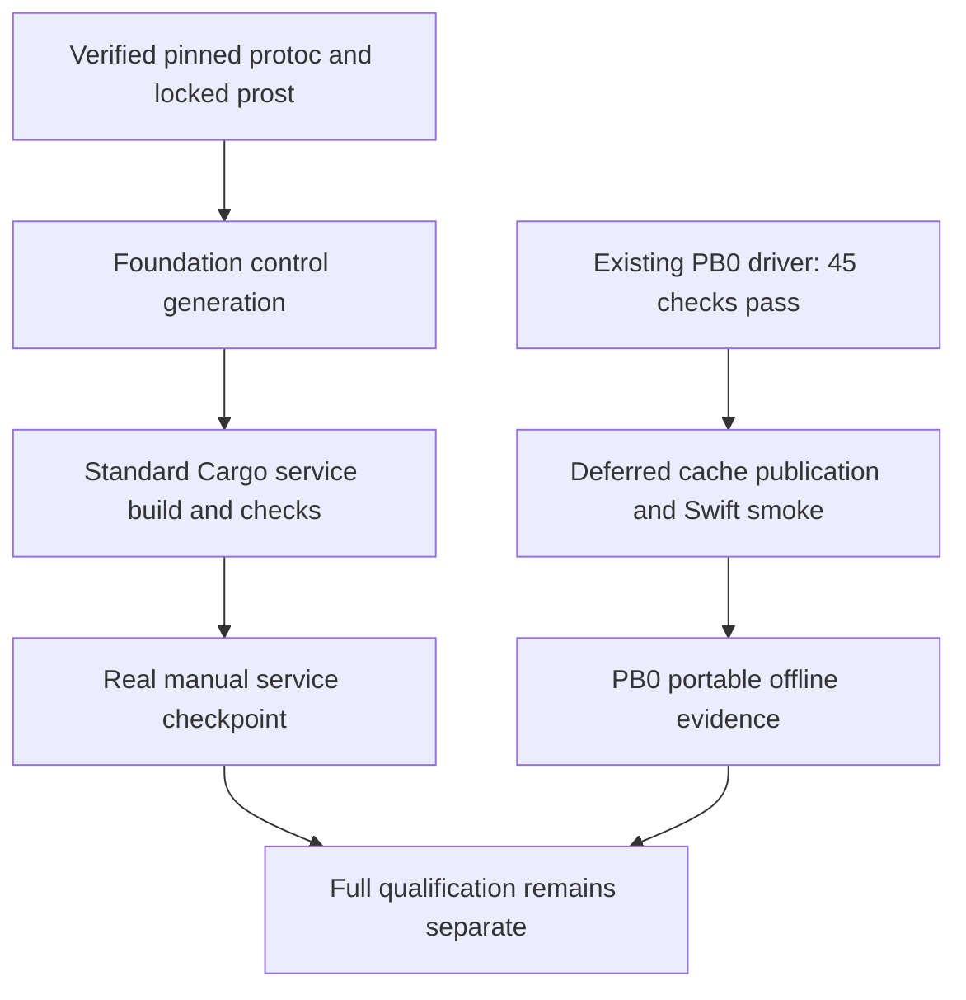
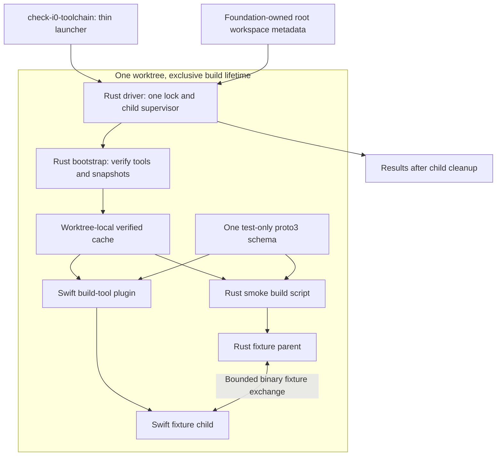
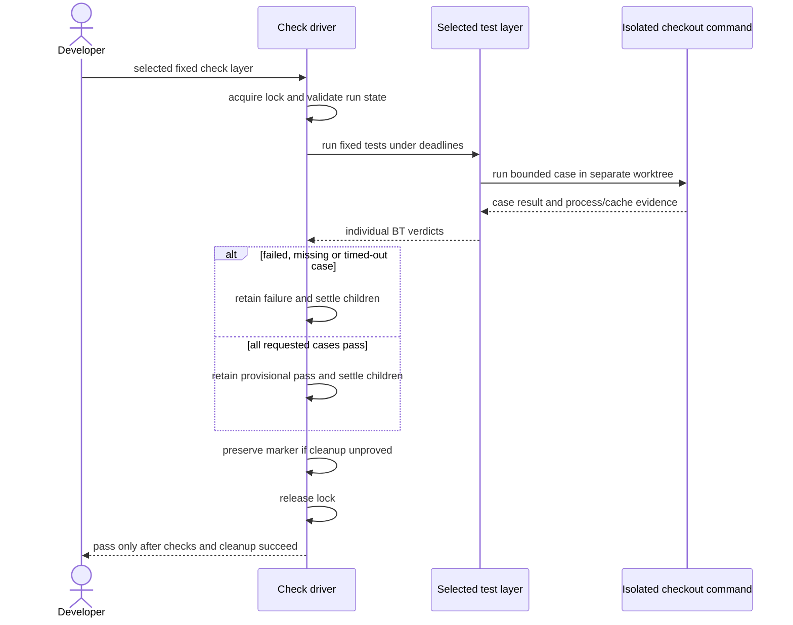

# Protobuf bootstrap implementation packet

Status: the owner authorized Asura implementation and selected service-first
delivery on 2026-09-26. Existing PB0.0–PB0.3 work and evidence remain valid.
The current driver passes 45 checks; further bootstrap expansion is deferred
while foundation stages 1–2 use standard Cargo and verified pinned protoc with
locked prost generation. Full cache publication, Swift smoke and portable-cache
qualification remain required PB0 work, not gates for the first manual service trial.
The latest instruction resolves earlier bootstrap-first sequencing in this packet.

The [bootstrap design](../designs/protobuf-toolchain-bootstrap.md) owns behavior,
limits, selected dependencies and BT1-BT8 acceptance cases. The
[validation strategy](../designs/validation-strategy.md) owns evidence recording
and the later remote CI gate. The [implementation plan](implementation.md#i0-repository-and-contracts)
owns full I0 completion. PB0 qualifies only tool preparation and a synthetic
Rust–Swift message exchange. Both production connections reuse its pinned
tools: local CLI/TUI–service control and Rust–Swift model communication. PB0
does not qualify either production protocol.

## Objective and dependencies

The first runnable packet must prepare pinned Protobuf tools, generate both
bindings and exchange the specified smoke message. A second clean checkout
must repeat this check with network access disabled and restored snapshots.
One worktree permits one active check. Different worktrees remain independent.

Foundation owns the existing root metadata and production control schema.
`contracts/control/v1/control.proto` and `asura-control/build.rs` use verified
pinned protoc and the locked Rust generation dependencies. They do not import
the smoke schema or need its Swift fixture to start service implementation.
Foundation receives an explicit absolute `ASURA_PROTOC` path to the verified
compiler; its version must match the lock (36.2). No ambient lookup or download
is permitted. The primary supplies pinned archive/member provenance or the
verified staged binary. No new foundation wrapper, cache or supervisor is introduced.

The earlier PB0.6-before-control and driver-extension handoffs are superseded for
the manual checkpoint. Full PB0 still qualifies both generators, smoke exchange,
cache publication and portable offline reproduction. Foundation separately owes
its extended-lock offline checks before full qualification. Neither development
success nor a manual preview supplies that deferred evidence.

### Packet dependency view

Selected service-first sequencing. Solid arrows show each path's dependencies;
deferred PB0 evidence joins full qualification, not the first manual service trial.

## File ownership and integration

These are proposed implementation assignments. No path is permission to write
code before the entry gate. The primary agent records the exact revisions and
active writer before assigning each step. An implementation assignment names
files within these directories; it does not expand their behavior.

| Owner | Paths | Deliverable and boundary |
| --- | --- | --- |
| Foundation integration owner | `Cargo.toml`, `Cargo.lock`, `rust-toolchain.toml`, `rust/AGENTS.md`, `.gitignore`, `scripts/check` | One root Cargo workspace, pinned Rust metadata and common dispatch. PB0 requests workspace members and lock updates through this owner. No second workspace under `rust/`. |
| PB0 bootstrap implementer | `tools/protobuf/lock.json`; `rust/crates/asura-toolchain-bootstrap/Cargo.toml`, `src/`, `tests/` | Strict lock parsing, bounded archive acquisition/extraction, verified cache replacement and unit tests. No service policy or model schema. |
| PB0 driver implementer | `rust/check-i0-driver.rs`; `scripts/check-i0-toolchain` | Standard-library Rust supervisor and thin launcher. Own the worktree lock, deadlines, child settlement, entry modes and evidence result. |
| PB0 Rust fixture implementer | `rust/crates/asura-toolchain-smoke/Cargo.toml`, `build.rs`, `src/main.rs` | `prost-build` generation and bounded Rust parent fixture. Generated Rust remains in `OUT_DIR`. |
| PB0 Swift fixture implementer | `Package.swift`; `swift/AGENTS.md`; `swift/Plugins/AsuraProtobufPlugin/plugin.swift`; `swift/Tests/ToolchainSmoke/main.swift` | One root SwiftPM package, explicit cached tool paths and the test-only Swift executable. Generated Swift remains in plugin output. |
| PB0 contract/test implementer | `tests/contracts/toolchain_smoke.proto`; `tests/integration/protobuf_toolchain.rs`; `tests/e2e/protobuf_toolchain.rs` | One smoke schema, real process/cache faults and clean online/offline command journeys. Register the Rust test targets in the bootstrap crate manifest. |
| Primary documentation owner | Documentation indexes, architecture layout proposal and validation strategy | Integrate path changes, packet links and accepted evidence without duplicating bootstrap rules. |

The primary may assign the PB0 rows to one implementer. If work is delegated,
the rows remain disjoint. `Cargo.lock` always has one writer. The foundation
owner adds each PB0 crate when its manifest and source are available. It
generates and submits each complete locked dependency graph for review before
a build executes new dependencies. Adding the smoke member changes the lock
and requires a fresh complete snapshot.

The root workspace must permit a targeted bootstrap build without compiling the
smoke member or requiring `protoc`. The smoke crate may depend on generated
bindings; the bootstrap crate must not. Root default members must not introduce
that cycle. PB0 adds no production `contracts/` tree, service crate or TUI code.
It does not change the isolated experiment's independent Cargo package.

A future foundation driver profile may reuse this driver after a reviewed
handoff. It is deferred; standard Cargo is the selected immediate service entry.
Control generation still uses pinned protoc and locked prost-build, with no Swift
control binding or model dependency. PB0's own Cargo/Swift subprocesses remain
inside its supervised workflow; this restriction does not prohibit the selected
standard Cargo foundation path. Do not run cache replacement concurrently with
a consumer of that managed cache.

### Ownership and execution view

Proposed packet view. Solid arrows are invocation or data dependencies. The
worktree boundary contains all mutable caches and compiled outputs.

## Ordered implementation steps

Each step consumes a reviewed predecessor. A failed check stops progression;
changes to behavior first return to the governing design.

| Step | Inputs | Work and exit evidence |
| --- | --- | --- |
| PB0.0 | Ready reviewed design/packet and explicit authorization | Foundation owner supplies root workspace metadata and nested Rust instructions. Record the ownership handoff and Rust pin. No service scaffolding is needed. |
| PB0.1 | PB0.0 and the selected supervision contract | Implement launcher and standard-library driver. Run `--check driver` to prove busy-lock rejection, lock lifetime, bounded startup compilation and child cleanup with isolated fixture processes. No downloaded build dependency is needed for these driver tests. |
| PB0.2 | PB0.1 and exact direct dependency selections | Add the bootstrap manifest and source. Foundation owner registers that member and produces the one Cargo lockfile. Review its sources, checksums and full graph before executing dependency builds. |
| PB0.3 | Reviewed lockfile and driver supervision | Implement archive checks, safe extraction, local cache preparation, snapshot completeness and staged replacement. Pass available bootstrap unit and process/cache checks. Full snapshot completeness remains pending until the smoke member exists. |
| PB0.4 | Verified cached tools and local runtime source | Add the canonical schema, Rust build script, Swift package/plugin and fixture executables. Foundation owner registers the smoke member and refreshes the reviewed lock. Rebuild the complete snapshot; prove BT7 and BT8. |
| PB0.5 | PB0.1-PB0.4 checks | Run all BT1-BT3 checks, including BT3a-BT3h, against the final lock. Run BT4 online from a clean checkout. Export a verified complete snapshot under the lock. Run BT5/BT5a and BT6 in fresh checkouts with network disabled. |
| PB0.6 | Complete local case records | Primary reviews the complete diff, checks provenance and records local PB0 qualification. Keep full I0 and remote CI pending. Transfer driver-extension ownership to the next packet only after this review. |

Driver fault tests in PB0.1 may use designed test-only children. They must not
execute arbitrary caller-supplied commands in the supported check interface.
One fixture starts a nested supervisor that creates a child in a separate
process group. Kill the nested supervisor while that child remains alive.
The check must fail, retain the incomplete marker and reject cache reuse until
the harness proves settlement. Reaping only the supervisor cannot pass cleanup.
Archive faults use deterministic local fixtures. They must not depend on an
upstream server becoming slow or serving a malicious archive. Process fault
tests use shorter fixture deadlines selected inside the test target. Unit
checks verify the production deadline values. The supported command cannot
accept an arbitrary deadline override. The aggregate command bound still
applies to all selected tests and their cleanup.

## Check interface and evidence

The proposed entry point is `scripts/check-i0-toolchain`. Its preflight resolves
already installed compiler binaries against the root
pin and selected host tuple. A missing toolchain fails before a build starts;
the launcher must not trigger a rustup download, including during offline
startup. Qualification includes that negative case. Its normal invocation
prepares the cache, builds both bindings and runs the bounded fixture exchange.
`--prepare-only` performs preparation and completeness checks. `--offline`
prohibits network access and uses the prepared snapshots. Their detailed
behavior and numeric limits remain in the governing design.

The proposed packet adds `--check driver`, `--check unit`, `--check integration`, `--check e2e` and
`--check all` as fixed validation selectors. A selector does not combine with
preparation/offline modes. Unknown arguments fail before cache mutation. Each
selector has the same worktree lock, aggregate deadline and supervision rules.
It prepares the dependencies required by that layer before invoking its tests.
`--check driver` uses only the installed Rust compiler and standard library; it
does not prepare tools or invoke Cargo. The unit selector includes those driver
tests as well as the bootstrap and fixture unit tests. `--check all` runs
the three layers sequentially and fails on any missing, failed or timed-out
case. It never marks an unavailable end-to-end environment as passed.

For the approved PB0.2 checkpoint, `--check bootstrap` is a separate fixed
selector. It runs only the bootstrap library's compile, lint and test checks
under the existing driver. It uses `--locked --offline`, the physical Cargo,
rustc and rustdoc binaries from the verified toolchain, and these isolated paths:
`CARGO_HOME=.build/asura-deps/cargo/work` and
`CARGO_TARGET_DIR=.build/asura-deps/cargo/target`.
The primary validates Cargo's version and prepares the reviewed cache inputs
under the worktree lock before the first check. The command does not fetch,
import or publish a cache; missing input fails explicitly. Its fixed commands
select only `asura-toolchain-bootstrap`: build, Clippy with warnings denied,
and tests. They inherit the driver-created process group; neither the crate
tests nor their subprocesses create another group. Inspect dependency build
scripts for that condition before execution. Unknown cleanup retains the marker.
This selector cannot claim the later smoke fixture or full PB0 qualification.

| Command | Required coverage | Supervised inner work |
| --- | --- | --- |
| `scripts/check-i0-toolchain --check driver` | Driver ownership, deadlines, argument rejection and cleanup rules needed by PB0.1 | Driver tests compiled with `rustc --test` and supervised as test-only children. |
| `scripts/check-i0-toolchain --check unit` | BT1/BT2 parsing, identities, limits and cache rules; BT3 transitions; BT7 invalidation; BT8 decoded fields | Driver tests compiled with `rustc --test`; locked Cargo unit tests for bootstrap and Rust fixture. |
| `scripts/check-i0-toolchain --check integration` | BT2 real rejection; BT3a-BT3h process/cache faults; BT7 Rust/Swift regeneration; BT8 malformed/oversized/failed fixture cases | Cargo integration test target `protobuf_toolchain_integration`; real SwiftPM plugin and process tests under isolated worktree roots. |
| `scripts/check-i0-toolchain --check e2e` | BT4-BT8 command workflows, including BT5a | Cargo test target `protobuf_toolchain_e2e`; separate clean checkout commands, real tool execution and externally disabled network for offline cases. |
| `scripts/check-i0-toolchain --check all` | All local PB0 cases | Sequential selectors under the driver. No remote CI or full model-channel completion claim. |

Every nested command uses a separate isolated worktree root. A test harness
must not recursively invoke the entry point against its own held lock, except
to assert `worktree_busy`. The supervising driver owns the test process; each
nested check owns only its isolated worktree. Tests may share read-only source
input, but never mutable cache directories, lock files or derived binaries.

An end-to-end run needs the complete candidate source revision available in
fresh checkouts. Record any uncommitted source overlay and its digest. Copy only files within
the reviewed packet source manifest; exclude credentials and unrelated files. A
working-tree overlay must not be labelled a committed revision. No cache,
compiled target or generated binding may enter the source overlay.

The offline environment must disable network access for the tested checkout
before its first bootstrap build. Its controlling harness may run elsewhere.
A proxy setting is insufficient. If that environment is unavailable, report
BT5/BT6 pending and keep PB0 incomplete. PB0 does not change host networking
silently or weaken the offline acceptance requirement.

The driver returns zero only after all requested checks and child cleanup
succeed. A nonzero result identifies the stage and typed failure category,
including `worktree_busy` or `cleanup_required`. The report includes each case
ID and its passed, failed or pending result. It records the source identity,
lock digests, actual host/compiler identities, snapshot identity, durations
and bounded diagnostics required by the validation strategy. Diagnostic output
cannot substitute for the process and artifact evidence.

### Validation and failure sequence

Proposed interaction view. Arrows name execution and evidence. The parent lock
stays held through harness cleanup; child checks use separate worktrees.

## Scoped readiness review

Review recorded on 2026-09-26. This is a design assessment, not full-system D8
completion or implementation approval. Owner review must include the governing
design, this packet, the foundation metadata handoff and the validation strategy.

| Concern | Assessment and remaining evidence |
| --- | --- |
| Canonical ownership | Bootstrap owns tool verification; driver owns build lifetime; Rust/Swift generators own only binding output. Foundation owns root workspace metadata. The coordinated handoff must be integrated into both packets before assignment. |
| Entry and dependency cycle | The bootstrap is a targeted Cargo member with no Protobuf requirement. A standalone standard-library driver supervises that first build. The complete Cargo lockfile still needs authorized creation and review. |
| Concurrent access and repair | One worktree lock covers readers and replacement. BT3a-BT3h specify exclusion, interruption and orphan handling. No live process or file-lock evidence exists yet. |
| Security and offline behavior | Pinned archive hashes, strict members, bounded extraction and complete Cargo snapshots are specified. BT2 and BT4-BT6 still require implementation and real checks. |
| Swift build integration | Root SwiftPM package, explicit cached tools and plugin outputs are designed. Actual plugin permission, package-path and relocated-tool behavior remain qualification risks. A failure requires design revision before proceeding. |
| Local host | Read-only checks confirmed macOS 27.0 build `26A428`, arm64; Xcode 27.0 `27A266a`; Swift 6.4; Rust/Cargo 1.98.0. This confirms installed identities only. |
| Existing implementation | No production workspace manifest, Swift package, bootstrap source or selected check command exists in this reviewed baseline. The TUI experiment supplies no PB0 evidence. |
| Production schema handoff | Superseded sequencing: foundation now uses standard Cargo, verified pinned protoc and locked prost without waiting for local PB0 completion. Extended-snapshot and offline-control proof remain deferred qualification; no second tool acquisition owner is introduced. |
| Later gates | Full model-channel BP1-BP31, Foundation Models, production service, release packaging and remote CI remain separate. The Rust service need not wait for real model integration; neither protocol inherits proof from PB0. |

On 2026-09-26, the primary integrated the root Cargo layout, both packet links
and the foundation metadata ownership handoff. Independent review identified
a nested-supervisor cleanup gap. The governing design now requires proof that
delegated process groups stopped, and PB0.1 includes a failure fixture. Follow-up
review confirmed closure. Foundation checks also keep PB0 tests under their
own deadlines and environment requirements.

The owner approved foundation metadata and PB0.0–PB0.1 after this review.
Their first runnable result is `scripts/check-i0-toolchain --check driver`.
The primary owns root metadata and documentation; the driver implementer owns
`rust/check-i0-driver.rs` and `scripts/check-i0-toolchain`, including driver tests.
This scoped authorization does not qualify
later PB0 builds, offline execution or either production protocol.

## PB0.2 dependency review before builds

On 2026-09-26, offline resolution produced a lockfile with 99 registry packages.
Its SHA-256 is
`3f1f27e0c22778687a14966869b7e88af30991886e57ac9157fec65f7e99c0ed`.
All eight direct dependencies match the governing pins. All 99 cached archives
match their lock and local index checksums. None is yanked in that local index
snapshot. The macOS arm64 graph activates 82 registry packages; their highest
declared minimum Rust version is 1.88, below the selected 1.98 compiler.

Independent read-only review covered 14 active build scripts and five procedural
macro crates. Inspected build scripts and process helpers contain no process-group
escape or command-download invocation. The ring build uses packaged C/assembly
and installed compiler/archive tools. This review permits the scoped supervised
build; it is not a vulnerability audit or hostile-code containment proof.

The primary seeded the isolated Cargo work cache under the worktree lock using
verified archives and local index metadata only. No extracted source or build
output was copied. This is PB0.2 validation setup, not a portable snapshot or
PB0.3 cache-preparation implementation.

## PB0.0–PB0.1 implementation evidence

Historical checkpoint recorded on 2026-09-26, before PB0.2. The root workspace metadata, Rust guidance, executable
launcher and standalone driver are implemented. The root workspace has no
members yet and excludes the independent TUI experiment. Cargo accepted its
metadata offline. No dependency lockfile is needed until PB0.2 adds a member.

The public command `scripts/check-i0-toolchain --check driver` passed in the
main workspace: 19 tests, zero failures, 130.95 seconds for the tests and
131.126 seconds for the driver. The host was macOS 27.0 build `26A428`, arm64,
with Rust 1.98.0 (`88d9e12ae`). Compilation treated warnings as errors.

The checks cover fixed arguments and limits, real lock contention, incomplete
markers, cache aliases, child exit/failure, signals, output limits, lost nested
supervisors and command rejection. They also cover a real 120-second compiler
watchdog, missing or proxy compilers, blocked stdout/stderr, and descriptor
restoration. The unreapable-process branch uses a controlled shell model;
it does not claim a live uninterruptible kernel-process test.

An initial run passed 18 tests and failed the descriptor-flags assertion.
Darwin adds `FWASWRITTEN` after a write. The corrected test establishes that
kernel state before recording its baseline and retains exact flag equality.
The failed run preserved its marker. Recovery archived that marker under the
exclusive lock after checking driver exit and the harness settlement receipt.
The corrected full run passed and cleared its active marker.

Rust formatting, shell syntax and whitespace checks passed. Independent review
confirmed closure of the reported process-lifetime and output-bound defects.
A missing-toolchain command also failed under OS-enforced network denial in
the implementation worktree. This does not qualify the later offline tool
bootstrap. The restricted coding sandbox denied the launcher's `ps` inspection;
the successful integration run used permission for real process inspection.

At this checkpoint, only `--check driver` was delivered. Later preparation and test selectors failed
explicitly as unimplemented. PB0.2–PB0.6, downloaded dependency builds, Protobuf
generation, Swift integration, service behavior and remote CI were unverified
and outside that implementation authorization.

## PB0.2 implementation evidence

Recorded on 2026-09-26 in the original workspace, with uncommitted source changes.
The root workspace now includes `asura-toolchain-bootstrap` and the reviewed
Cargo lockfile above. The library provides strict bounded lock parsing,
read-only validated accessors, exact-byte SHA-256 identity and host matching.
It performs no file, process or network operations. The archive declarations
used by tests are fixtures; production tool preparation remains pending.

The public command `scripts/check-i0-toolchain --check bootstrap` passed its
locked, offline build, Clippy with warnings denied, seven unit tests and three
integration tests. Two child runs validated accepted and rejected lock files
under macOS network denial. Each child also confirmed that a local listener
could not bind. This proves the scoped file-validation workflow, not a clean
offline tool bootstrap or archive verification. The successful supervised rerun
took 0.790 seconds with build outputs already present.

The first dependency build passed in 4.85 seconds. Clippy then rejected a
constant platform assertion in the integration test. The source owner replaced
it with an explicit unsupported-platform compile error; the complete bootstrap
check then passed. The settled failure left no active incomplete marker.

The extended driver passed 21 tests in 131.10 seconds. After that run, review
required explicit Cargo wrapper overrides and worktree-local intermediate
outputs with a fixed native target. Both targeted driver tests passed after
those changes. The bootstrap command above then exercised those settings.
Independent review closed the reported parser and driver findings. Rust
formatting, shell syntax and whitespace checks passed.

Validation used macOS 27.0 build `26A428`, arm64, and physical Rust/Cargo 1.98.0
tools. Process inspection and `sandbox-exec` required execution permission
outside the restricted coding sandbox. No active incomplete marker remains.
PB0.3–PB0.6, Protobuf generation, Swift integration, production protocols and
remote CI remain unverified. No commit or push is part of this checkpoint.

## PB0.3 implementation work and dependency review

The owner approved PB0.3 and the [preparation detail](../designs/protobuf-cache-preparation.md)
on 2026-09-26. This includes the narrow leading PAX comment exception measured
in the pinned Swift archive. The driver remains the only process supervisor.
The bootstrap owns archive checks, cache inventories and publication/recovery.

The approved TOML parser changes the lock to 105 registry packages. Its SHA-256 is
`302a34ab4c96f1f67f1f9917bd49ce4f92239dcee55b8fc5dfd9da8538a64774`.
Independent review matched all 105 archives to the lock and cached index; none
was yanked in that local index. The six additions introduce no build scripts or
procedural macros. All declare Rust 1.85 or earlier. The previous 14 build scripts
and five procedural macro crates remain. The primary added 12 reviewed cache
files under the worktree lock before the first new dependency build.

The archive library is implemented. Independent review closed duplicate ZIP,
directory CRC and metadata-test defects. A supervised build and Clippy passed,
with eight unit tests, 13 archive integration tests, five cache integration tests
and three lock integration tests. The archive tests include actual network-denied
file workflows. Cache fixtures exercise missing/changed/unlisted inputs, conditional
publication rollback and restart states; these are not full tool snapshots.
The current crate check took 10.161 seconds.

The first extended driver suite passed 29 tests in 131.12 seconds, including its
real 120-second startup watchdog. Review then required bounded initial copying
and explicit Cargo wrapper overrides. Native process fault checks and the final
driver run remain pending. Real online preparation, generator compilation,
publication and relocated offline proof are also pending. PB0.3 is incomplete.

### Resumed PB0.3 checks

The owner approved the Swift launch correction by resuming PB0.3 on 2026-09-26.
The driver now validates the selected alias and canonical target, then preserves
the alias for dispatch. The extended driver suite passed 35 of 36 tests. Alias
validation, the bounded deep-cache copy and fixed fetch timeout cases passed.
The native Swift test stopped before package readiness because normal Swift driver
version text appeared on stderr. The owner subsequently approved the exact
host-version exception in the preparation design on 2026-09-26. Native Swift descendant settlement,
real generator compilation and online/offline preparation remain unverified.

The primary independently verified failed-run owner 60013 was absent, found no
matching fixture processes, and checked its settlement receipt. The incomplete
marker was preserved in the run evidence directory under the exclusive worktree
lock before the next bootstrap check.

The latest `--check bootstrap` passed in 13.123 seconds: locked offline build,
Clippy, 12 unit tests, 13 archive integration tests, five cache integration tests
and three lock integration tests. Added unit cases exercise real temporary files
with redirect/response rules, the 32 MiB stream boundary, download cleanup and
injected publication rename/removal failures. Final-check corruption here tests
Cargo manifest validation, not tool executable failure. Earlier attempts found a
Clippy test-module placement issue and noncanonical temporary fixture paths; both
were corrected without relaxing checks. Independent source review found no new
blocker in the helper extraction or publication fault boundaries.

After the owner approved the Swift host-version stderr exception, the driver
passed 36 of 37 tests in 133.45 seconds. The exact Swift identity and retained
record checks passed. The native manifest still did not reach readiness:
SwiftPM's nested sandbox returned `sandbox_apply: Operation not permitted`
inside the outer network-denial sandbox. The incomplete marker and settlement
receipt for this failed run were retained. Preparation remains blocked until the
sandbox composition is resolved; this run proves neither native timeout settlement
nor generator compilation.

The owner then approved disabling SwiftPM's inner sandbox for the two scoped
commands while retaining outer network denial. That driver run passed 36 of 37
tests in 163.22 seconds. The manifest reached readiness, but its recorded PID was
present after the supervisor returned. Known-PID cleanup ran and the final
settlement receipt was recorded; the incomplete marker remained. The PID probe
does not distinguish running work from an exited, unreaped process. No live
process-group escape is established by this result. A fixture-only process-state
diagnostic is required before selecting a supervision change.

The later diagnostic observed a sleeping manifest after the supervisor reported
`deadline` and `settled=true`. The session diagnostic then confirmed the manifest
retained the test supervisor's POSIX session while creating a different process
group. That run passed 36 of 37 tests in 162.22 seconds. Harness fallback cleanup
and the settlement receipt completed; the incomplete marker remains preserved.
This is evidence for the [session proposal](../designs/protobuf-process-settlement.md),
not proof that every tool descendant stays in a session. The correction requires
review of scope and signal identity before implementation. No live preparation
or offline relocation check has run.

### Cache recovery and manifest corrections

The owner instructed work to continue on 2026-09-26. Two corrections within the
approved cache contract are implemented. Recovery preserves an invalid published
directory when no valid backup exists and returns `cleanup_required`. A repeated
attempt cannot turn that unresolved state into a success receipt. Archive records
require the `source_commit` key; explicit `null` remains valid for protoc.

The primary checked the completed native fixture's settlement receipt and process
absence, then recovered its incomplete marker under the exclusive worktree lock.
The original marker remains in the failed run's evidence directory.

The latest `scripts/check-i0-toolchain --check bootstrap` passed in 12.195 seconds:
locked offline build, Clippy, 12 unit tests, 13 archive integration tests, seven
cache integration tests and three lock integration tests. Recovery regressions
exercise both tools and Cargo, both recovery operations, and the actual bootstrap
command under network denial. They require failure, retained evidence and no
success receipt. The persisted manifest reader rejects an omitted archive field;
that fixture does not establish tool qualification. Rust formatting passed with
the selected 2024 edition.

The [process qualification packet](../designs/protobuf-process-settlement.md#bounded-api-qualification-packet)
now defines bounded test-only API experiments and their cleanup obligations.
Production supervision remains unchanged. The native driver result remains
36 of 37 passing tests; no live preparation or relocated offline check has run.

### Bounded process API qualification authorization

After the completed packet was presented for approval, the owner instructed the
team to continue on 2026-09-26. This authorizes Q0–Q4 in the
[bounded API qualification packet](../designs/protobuf-process-settlement.md#bounded-api-qualification-packet):
test-only driver fixtures, real API measurements and existing driver regressions.
It does not authorize a production supervision change or reduced cleanup guarantee.

The driver implementer owns only `rust/check-i0-driver.rs`. A separate reviewer
checks the installed ABI, process identity and cleanup boundaries. The primary
owns integration and serialized execution. Unknown fixture cleanup stops dependent
qualification cases and retains the incomplete marker. Production preparation
remains blocked pending the resulting evidence and a reviewed correction.

### Process API qualification results

The authorized test-only packet is implemented in the existing driver. Independent
review checked the installed ABI, authentic-token acquisition, Mach right release,
held-child signalling and setup-failure cleanup. Negative checks cover short token
responses, changed identities and denial of further admission after unknown cleanup.
Production supervision and the launcher are unchanged.

The full `scripts/check-i0-toolchain --check driver` run completed in 182.10 seconds:
38 of 39 tests passed. Both qualification tests passed. The existing native Swift
cleanup test remained the sole failure: its manifest changed process group and
survived the driver's claimed settlement. Harness fallback cleanup completed and
the final test settlement receipt was written. The primary independently checked
that the run owner, test owner, native manifest and all recorded qualification
fixtures were absent. The failed-run marker and evidence remain preserved.

Controlled kernel-token acquisition and TERM/KILL succeeded with target reaping.
Signal zero returned `EINVAL` for both current and stale authentic tokens, so it
provides no stale-generation rejection proof. Group changes, session changes and
orphaning all succeeded. These observations preserve the discovery blocker:
session scans cannot establish complete descendant coverage. See the
[measurement table](../designs/protobuf-process-settlement.md#bounded-qualification-measurements)
for source and runtime proof limits.

The primary requested an explicit owner decision between retaining complete
proof as a prerequisite and adopting a qualified-toolchain contract that states
the residual discovery risk. Neither choice has been inferred from passing
experiments. Live preparation and relocated offline validation remain unrun.

### Qualified-toolchain cleanup selection

The owner answered “use a cleanup contract” after the explicit choice above.
This selects the qualified-toolchain operational assurance contract, including
its residual unobserved detached-child discovery risk. The canonical bootstrap
contract now states the supported scope, requalification rule and detected
uncertainty behavior. Production correction details are being completed before
code under the existing PB0.3 implementation authorization.

Work order: complete and independently review the session/identity/lifetime
mechanism; implement it in the existing driver; run unit, process integration and
native driver checks; then run live preparation and isolated offline checks.
One implementer owns the driver. The design author owns the cleanup detail, a
separate reviewer checks API and recovery contracts, and the primary owns canonical
document integration and serialized validation. The launcher remains separately
qualified. No simultaneous builds will run in this worktree.

### Production cleanup correction: current evidence

The driver now uses session observation, an unreaped direct-child anchor and
authentic audit tokens. Native validation remains incomplete. Two full driver
runs passed 33 of 39 tests, in 202.38 and 200.75 seconds respectively.
Failures cover stubborn-child cleanup, output-limit cleanup, fetch timeout,
native Swift cleanup, nested-supervisor expectations and the final settlement gate.

The latest diagnostic identifies a normal exec transition as one cause: Darwin
changes the audit-token execution generation while the process lifetime continues.
The cleanup design now separates these identities and requires bounded token
refresh. Its BSD-info lookup also includes zombies. The implementation correction
and regression validation remain in progress. The diagnostic `ps` child also
returned a process-inspection permission error. Its installed executable is
setuid-root, and Apple source checks effective user identity for BSD-info access.
This supports a permission-boundary explanation; no permission check is relaxed.

The primary stopped each confirmed stubborn test shell after checking its command,
working directory and group. Recorded owners and fixture processes were absent
before marker recovery under the worktree lock. Original markers and recovery
notes were preserved. Operator cleanup is not proof of driver cleanup.
No live preparation, cache publication or relocated offline qualification has run.

After the exec correction, the full driver suite passed 39 of 40 tests in
189.33 seconds. Native Swift timeout cleanup, actual exec token refresh, stubborn
child cleanup, output-limit cleanup, fetch timeout and nested-supervisor handling
all passed. The final test settlement receipt was written. The remaining failure
is the actual stdout-backpressure test: its nested driver retained a marker.
That fixture discarded stderr, so the cause is not established. It needs retained
diagnostics and another run. Required production orphan, observed-escape and
inspection-fault coverage is also being completed before live preparation.

The next full driver run passed all 43 tests in 191.69 seconds (193.794 seconds
including driver work). Native Swift cleanup, exec refresh, zero-exit orphan
rejection, observed session escape, injected inspection denial and marker handling
passed. The stdout-backpressure failure did not recur after diagnostic capture
was added; its earlier cause remains unconfirmed. No assertion was removed.
The selected cleanup contract retains its stated unobserved-escape risk.

The corrected driver then passed the bootstrap checks: 35 tests, locked offline
build and Clippy, in 17.862 seconds. The first live preparation fetched pinned
inputs and started the Swift generator build. It stopped at a known-process
`ESRCH` inspection result. No tools or Cargo snapshot were published.
Independent inspection found no matching build processes; the original marker
was preserved under the worktree lock, with staging left for canonical recovery.

The cleanup detail now specifies bounded pending observation when a fresh BSD
record confirms the same PID/start after an incomplete session lookup. Pending
ownership permits no signal or success claim. Replacement and permission failure
remain errors. The diagnostic must distinguish these branches; the first live
error did not record enough information to establish which branch occurred.

### Service-first sequencing update

The owner selected standard Cargo service development without waiting for full
PB0.3 publication, PB0.4 smoke, PB0.5 portability or a custom driver profile.
The ordered PB0 steps and their acceptance cases above remain the deferred
qualification plan. Their historical prerequisite language does not reinstate a
manual-trial gate. The revised dependency diagram has not been visually inspected
because the available local Mermaid browser currently stalls; record this gap
without delaying the selected product work.
