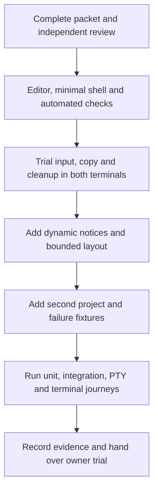
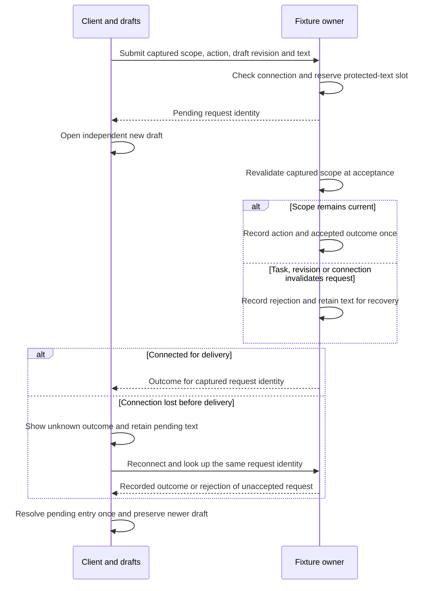

# TUI prototype implementation packet

Status: isolated experiment authorized by the owner on 2026-09-24 after the
preflight report. This packet closes routine implementation choices for that
authorization. It does not authorize the production backend or mark D0-D8 complete.
The [prototype design](../designs/tui-interaction-prototype.md) owns interaction
semantics; this packet owns the scoped build, concrete limits and validation.
The [guided-tour supplement](../designs/tui-guided-tour.md) owns the subsequently
authorized tour, renderer artifacts and reduced native repetition requirements.
The [composer supplement](../designs/tui-composer.md) selects the subsequent status
bar, message tray, direct shortcuts and tour presentation changes.
The [project status amendment](../designs/tui-project-status.md) selects the later
shell-style footer, synthetic metadata and conditional cues above input.

## Scope and ownership

Build only `experiments/tui-chat/`: one standalone Rust package, fixtures, tests,
README and nested agent instructions. Keep Cargo build outputs ignored locally.
The primary agent owns integration and documentation. Delegates may own the editor
adapter and terminal session module separately; record exact assignments below.
No service, database, model, network client, project-content access or subprocess
execution is permitted at runtime. Terminal input/output is the only external I/O.
Native terminal selection and copying use the terminal's own controls; do not
enable mouse capture or write the clipboard from the application.

Use Rust 1.98.0, edition 2024, Ratatui 0.30.2, Crossterm 0.29.0 and rat-text 3.1.0.
Pin direct dependencies and commit the generated Cargo.lock with the experiment
when publication is authorized. Use the installed stable compiler reporting 1.98.0;
do not alter global toolchains. Package `rust-version` is 1.98.
Use rat-text without default clipboard features. Allow its matching Ratatui
core/widgets/bridge dependencies. Use unicode-segmentation 1.12.0 for boundaries
in bounded layout measurements, unicode-display-width 0.3.0 for the editor's
glyph-width convention, and signal-hook 0.3.18 for safe signal flags.
No async runtime is needed: all fixture work is in-memory and stepped.

| Module | Canonical responsibility |
| --- | --- |
| `editor.rs` | One rat-text adapter for draft text, selection, grapheme editing, undo and rendering |
| `model.rs` | Fixture identities, requests, task state, acceptance, queueing and replay; no terminal I/O |
| `app.rs` | Client focus, per-project draft retention, captured choices and event routing |
| `ui.rs` | Pure layout allocation and Ratatui rendering from client/fixture state |
| `viewport.rs` | Retained transcript entry/row anchor and scroll allocation using Ratatui wrapping |
| `terminal.rs` | Terminal setup, mode ownership, cleanup and signal flag registration |
| `main.rs` | Argument validation, monotonic clock, bounded event polling and composition |
| `tour.rs` | Checked synthetic scenario preparation and tour navigation; delegates input and lifecycle to their existing owners |

### Execution and review order

Selected experiment sequence. Arrows name prerequisite completion; the editor
trial prevents unsuitable dependencies from driving more interface work.

## Input and focus

These bindings are selected for the experiment, subject to actual terminal checks.
The Ctrl bindings work without enhanced keyboard protocols. Enable bracketed paste;
do not require keyboard enhancement or modify either terminal's configuration.
Process press/repeat for ordinary editing; action activation requires press only.

| Binding | Action |
| --- | --- |
| Enter | Submission contract: idle send, working Steer/Queue choice, focused action only |
| Option+Return (Alt+Enter) | Insert newline; distinct Shift+Enter remains an unadvertised alias |
| Arrows, Home/End | Move within draft; Up/Down use wrapped visual lines |
| Shift+movement | Extend selection where a distinct event is available |
| Ctrl+A | Select whole draft |
| Ctrl+Z / Ctrl+Y | Undo / redo |
| Ctrl+P | Switch synthetic project; dismiss overlays without sending |
| Ctrl+O | Open the current scoped notice or recovery action |
| Ctrl+X | Stop active fixture work; never clear text or exit |
| Ctrl+L | Open explicit clear-draft confirmation |
| Ctrl+V | Start paste capture, then open an explicit Insert/Cancel choice to finish |
| PageUp/PageDown | Scroll transcript without moving draft cursor |
| Ctrl+E | Return transcript to latest output |
| F1 | Open/close help containing every binding and fixture action |
| F2 | Toggle fixture connection; reconnect reconciles pending outcomes |
| F3 | Raise/expire a synthetic decision during work |
| F4 | Reject the next submission at fixture acceptance |
| F5 | Complete active fixture work, including choice/acceptance races |
| F6 | Reset fixtures only through explicit discard confirmation |
| F7 | Accept the selected pending request, then simulate connection loss before its acknowledgement |
| F8 | Fail active fixture work and hold queued text for explicit recovery |
| Escape | Dismiss overlay; during paste capture mark control input invalid and remain in capture |
| Ctrl+Q / Ctrl+C | Request exit; warn when draft, pending or held text exists |
| Tab/arrows then Enter | Deliberately select and activate a choice; no preselection |

Help, decisions, recovery and confirmation overlays retain their own focus.
Text and paste while an overlay is open do not change the draft or activate actions.
Inactive focused controls remain visible until explicit dismissal. A terminal resize
below minimum disables all sends/decisions but retains draft editing and exit.
Unmodified Tab in editing inserts two spaces; it does not change focus unexpectedly.

Normalize CRLF, CR, Unicode line separator U+2028 and paragraph separator U+2029
to LF; expand each tab to two spaces. This preserves line separation while using
one line-ending representation throughout the editor. Reject an entire paste
containing C0/C1 controls other than normalized newline/tab, or DEL. Reject an
oversized paste before changing selection, text or undo history. Bracketed paste
and explicit paste mode are distinct supported paths; unbracketed paste cannot
be distinguished from typing automatically. Help explains fallback capture and its limits.
The fallback captures text separately from the editor, at most 192 KiB of raw
UTF-8 (three times the normalized draft limit). Enter and LF bytes (decoded as Ctrl+J) insert newline and
Tab inserts a tab into that candidate; ordinary characters append. Other control
keys invalidate the candidate and leave capture active. Ctrl+V opens a finish
choice with no default. Explicit Insert performs one normalized, bounded editor
transaction; failure leaves the original draft/selection/history untouched.
Cancel discards only captured text. Finish actions never submit a message.
Show a captured-byte count and rejection reason; preserve the original editor.
Unbracketed input has no trustworthy origin boundary: control sequences can be
indistinguishable from deliberate keys. This fallback supports plain text capture,
not a security guarantee for hostile terminal sequences. Bracketed paste remains
the qualified path for arbitrary payload validation.

## Geometry and resource bounds

The terminal keeps its configured font and keyboard layout. Record observed
profiles without changing preferences. Test Ghostty and Terminal.app equally.
Use a dark, restrained palette and an explicit `--light` palette for light trials;
no reliance on terminal theme detection. Use hard grapheme-safe wrapping initially.

On 2026-09-25 the owner selected Wisp's dark blue palette as the new baseline.
`ui::Palette` remains the canonical owner for both themes; the tour and preview
exporter use it. Wisp has no matching light theme, so the Asura light values stay
unchanged. The selected colours are:

| Role | Dark | Light |
| --- | --- | --- |
| Main text (Wisp white) | `#e6edf0` | `#1e293b` |
| Muted text (Wisp mist) | `#86aec8` | `#475569` |
| Composer band (Wisp deep) | `#253b4e` | `#e2e8f0` |
| Submitted user input band (derived shade) | `#1c2e3d` | `#d4deea` |
| Accent (Wisp glow) | `#cff1ff` | `#1d4ed8` |
| Project name (Wisp main tone) | `#8fd3f4` | `#0e7490` |
| Added lines, including `+` | `#86efac` | `#15803d` |
| Deleted lines, including `-` | `#fca5a5` | `#b91c1c` |
| Base | Terminal default | Terminal default |

The dark main text, muted text, composer band, accent and project name copy
Wisp's current Rust TUI palette. Wisp has no submitted-message band; Asura uses
a darker shade of Wisp deep to keep that existing distinction. The owner retained
the terminal-default main background and coloured line counts in the
[status refinement](../designs/tui-project-status.md#field-styling).

This is a presentation-only change within the existing geometry and state flow.
TP1 and GT2/GT4 provide style, renderer and truecolor PTY checks. Regenerate and
inspect both preview palettes. Prior native trial reports cover the earlier
palette; physical input behavior does not change with these colour values.

Recorded native profiles on 2026-09-24: Ghostty 1.3.1 build 15212, default font
family (empty family list selects its bundled default), 13 pt; Terminal.app 2.15
build 488, Pro profile, Monaco 11 pt. Both use the macOS British keyboard layout.
Ghostty's effective configuration reports no font or Option-key override; its
documented layout-dependent Option default is false for British. Command+Enter
is reserved for fullscreen. These are configuration observations; native trials
must still verify rendering and the Ctrl+J binding. No preferences were changed.

The initial shell skeleton preceded this profile record in error. Implementation
was paused when the prerequisite was identified, and the omission was reported
to the owner. The required profile check is now recorded; the gate was not removed.

| Resource | Selected bound and behavior |
| --- | --- |
| Draft | 65,536 UTF-8 bytes after normalization; reject whole edit if exceeded |
| Undo | At most 100 retained undo sequences per draft; configure the dependency's trim-before-append behavior and test the boundary |
| Projects | Exactly two synthetic projects, one conversation each |
| Editor height | 1-6 visual rows; then scroll with cursor visible |
| Full layout | Width at least 60 and height at least 16: both tint strips, up to 6 editor rows |
| Compact layout | Width 30-59 or height 8-15: omit strips, editor at most 3 rows |
| Too small | Width below 30 or height below 8: resize message; no submission |
| Transcript | At most 200 entries and 256 KiB per project; evict oldest display entries with a visible truncation notice |
| Protected text | Pending/rejected/held requests live outside transcript retention; never evict them silently |
| Pending requests | One per conversation; reject extra activation without changing draft |
| Queued follow-ups | At most 8 per conversation; reject overflow before draft detachment |
| Recoverable requests | At most 8 per conversation; block new sends at capacity until explicit recovery/discard |
| Event processing | At most 32 terminal events before redraw; fixture ticks coalesce progress only |
| Timing | Poll at most 16 ms; render on changed state; progress every 250 ms; acceptance after 250 ms |
| Task fixture | Completes after 12 seconds unless waiting on a decision; explicit completion available |

Admission reserves protected-text capacity jointly: queued + recoverable + pending
must never exceed eight distinct request identities per conversation. A pending
copy of an already recorded queued or recoverable outcome uses the same reservation
until acknowledgement; it cannot admit another request or produce another copy
on reconciliation. A pending request reserves the slot it
would need after rejection; queued requests reserve their slots after cancellation
or failure. Moving between these states does not allocate another slot. Capacity
rejection happens before draft detachment. Test a full reservation set followed
by cancellation and rejection together; every text must remain recoverable.

Retain at least three transcript rows in full and compact layouts. Allocate
destination, notice and status before editor height. Reserve an additional header
row showing prototype status and project navigation. Long status text clips by
cells; F1 preserves access to the full action map. Overlays scroll within their
available rectangle, and their selected action remains visible. Rendering tiny
rectangles must never subtract unchecked or place a cursor outside the viewport.

Retain transcript reading position by an entry identity and wrapped row within
that entry. Prefix eviction increments a monotonic base entry identity; append
must not move a reader whose anchor survives. If the anchor itself is evicted,
show that fact and position at the earliest retained entry. Recompute wrapping
for the current width and clamp a within-entry row when needed. Follow-latest
is a separate explicit mode. No display retention may delete a pending request.

The owner subsequently requested input-like styling for submitted user messages.
The [transcript styling supplement](../designs/tui-transcript-style.md) governs
typed entries, role-specific insets and decorative rows. It supersedes the plain
string layout interface below while retaining its anchor and large-history rules.

`TranscriptViewport::scroll_rows(i32)` queues relative movement (negative is older),
`follow_latest()` clears the reading anchor, and
`plan(&[String], base_id: u128, width: u16, height: u16) -> ScrollPlan` uses the same
Ratatui Paragraph wrapping as rendering. The plan provides `start_entry: usize`,
`line_offset: usize`, `row_offset: u16`, `reading: bool`, and `anchor_evicted: bool`.
Render entries from that index, skipping complete logical lines in its first entry
before applying the remaining wrapped-row offset. This avoids both global and
per-entry u16 row limits. Each entry ends with one blank display line. For widths
below 26 or heights below 3, return an empty plan and preserve the anchor; normal
UI geometry supplies at least 28 columns. A bounded draft's single logical line
cannot exceed u16 wrapped rows at these widths. The base ID is u128; bounded u64
request, task, decision and connection counters limit the display-producing
transitions within a generation. Reset also resets the associated viewport.

Pending text is presented in the scoped notice and its Ctrl+O inspector, outside
the scrollable transcript. The inspector shows the immutable text until its
request resolves and then retains a resolved placeholder until dismissal. Only
delivered transcript entries receive viewport identities. Pending text must not
borrow the next transcript identity, which another delivered event could reuse.
Validate scrolling while a long pending message is accepted or rejected: existing
transcript anchors stay on the same delivered entry, and the pending text remains
inspectable without becoming part of that anchor space.

Use monotonic milliseconds supplied to the fixture model. Tests advance this
clock directly. There is no background command queue: commands validate capacity
synchronously and enter the per-conversation pending slot. Acceptance compares
captured generation, project, conversation, task identity/revision and connection.
Control/decision changes increment task revision; progress does not.

The editor adapter owns normalization and all explicit key mappings. It must not
inherit rat-text's Ctrl+Y delete-line mapping or pass raw paste to default handling.
Group every insertion/replacement into one undo sequence. Retain each actual
editor instance across navigation; cloning resets dependency navigation/focus state.
Home/End mean line start/end, with Ctrl+Home/End for document start/end. Compute
document end with public grapheme positions because the inspected dependency's
`move_to_end` maps to the last line's start. Derive the actual end from LF-separated
text because the dependency's line count may include a synthetic final row.
Qualify these narrow adapter corrections.
Reset the dependency's stale wrapped sub-row offset when width changes, then let
its renderer scroll the cursor. Clamp navigation's cursor and selection anchor
to the actual document end, excluding the dependency's synthetic final row.

### Editor qualification correction

Source inspection and an executable qualification case reproduced an upstream
panic when inserting a zero-width joiner between two emoji. The dependency mutates
text before constructing a reversed grapheme range. Do not call that insertion
path on nonempty text. The following adapter correction preserves the library
as the owner of text storage, cursor/selection, undo and display mapping.

Construct the complete candidate string from the current text and selection byte
range before mutation. Normalize and validate it against the input and size rules.
For every text replacement, begin one dependency undo sequence, remove the complete
old text through public `TextCore::remove_str_range`, insert the candidate into the
empty store, and set the cursor to the insertion endpoint rounded forward to the
end of a merged grapheme. End the undo sequence and scroll the cursor into view.
Do not select all first: the original cursor/selection must be retained in undo.
Backspace/Delete use the same replacement path so newly adjacent clusters cannot
leave invalid cursor positions. Movement and all undo/redo remain library-owned.

The bounded replacement costs at most two 64 KiB text payloads per history sequence,
about 12.5 MiB per draft at the 100-sequence cap, excluding library overhead.
This is an experiment tradeoff, not a production editor recommendation. Test exact
text/cursor/selection restoration and the responsiveness target before accepting
it. If public API replacement fails those checks, stop editor implementation and
bring the dependency/scope choice to the owner; do not create a custom editor.
Qualification also found that the underlying Ropey store recognizes U+2028/U+2029
as line boundaries. Their normalization above keeps cursor calculations and storage
consistent; tests must cover a subsequent edit, selection, undo and redo.

At acceptance a new turn starts work, Steer appends an acknowledged instruction,
and Queue stores a follow-up for that exact task. On success, run the next queued
turn. Cancellation/failure holds remaining queued text for explicit Restore or
Discard. A rejection keeps its immutable request; Restore uses an empty editor
or offers explicit append with a newline while keeping newer text. Appending must
pass the draft bound first. Discard requires explicit selection. Disconnect leaves
pending outcome unknown; reconnect queries the fixture's recorded result or
rejects an unaccepted stale request. It never creates another request identity.
Reset increments generation and rejects prior events; confirm before discarding
in-memory text. Stale or duplicate acknowledgements do not change new drafts.

### Acceptance and reconciliation

Selected in-memory fixture contract for TP4. Arrows are local calls or results;
they do not select a production transport or persistence mechanism. The fixture
retains an outcome until the client resolves its one pending request.

## Failure handling and terminal ownership

Reject non-TTY input/output before changing modes. Record successfully acquired
mode ownership and unwind partial setup in reverse order. Use a guard with explicit
fallible cleanup and a best-effort Drop fallback. Restore bracketed paste, cursor,
alternate screen and raw mode on normal exit, event/render I/O failure and panic.
Do not push keyboard enhancement modes. A panic hook restores terminal modes
before printing diagnostics; production input cannot deliberately panic.
SIGINT/SIGTERM/SIGHUP set a signal flag through signal-hook; the loop exits and
restores modes within the next poll cycle. SIGKILL cannot be caught; document
`reset` as manual recovery. Ctrl+C arrives as a key in raw mode and follows exit
confirmation. Errors go to stderr only after restoration, with nonzero exit.

Add `--fault=setup|draw|panic` solely for deterministic cleanup qualification and
`--manual` to step fixtures explicitly during race trials. Test builds may expose
state inspection APIs; they must exercise the same implementations as the UI.

## Validation and completion

Run in `experiments/tui-chat/`:

- `python3 -m venv .venv` and `.venv/bin/python -m pip install -r tests/requirements.txt`
- `cargo fmt --all -- --check`
- `cargo clippy --locked --all-targets -- -D warnings`
- `cargo test --locked`
- `cargo test --locked --test composer tp1_responsiveness_measurement -- --ignored --nocapture`
- `cargo build --locked`
- `.venv/bin/python tests/terminal_e2e.py target/debug/asura-tui-chat`

Map tests to TP1-TP5 in the governing design. Unit tests cover normalization,
bounds, layouts, focus and lifecycle races. Integration tests use the actual
rat-text editor, client routing, fixture driver and Ratatui TestBackend. PTY tests
launch the actual binary, send paste/keys and verify exit, exit status and terminal
mode restoration for normal and injected faults. PTY tests complement both native
terminal trials; they do not prove fonts, copy or physical key compatibility.
Use test-only pyte 0.8.2 and wcwidth 0.2.13 in the ignored local virtual environment.
The [pyte screen/stream API](https://pyte.readthedocs.io/en/latest/tutorial.html)
decodes actual terminal output so assertions inspect visible state rather than
fragments of escape sequences. It is not a replacement for native terminal proof.
On Darwin, restoring canonical mode can set the kernel's transient `PENDIN` flag.
The PTY supervisor first requires that this is the only differing termios field,
then uses a non-consuming `FIONREAD` query to settle it and requires full equality.
The test must not mask other flag differences or replace restoration with a reset.

The pinned pyte 0.8.2 model leaves an empty trailing cell when a narrow character
replaces a wide glyph's leading cell. Its `display` then raises `IndexError`.
The PTY screen adapter repairs only that known wide-to-narrow overwrite: replace
the old empty trailing stub with a space, retaining its attributes. Delegate all
other drawing to pyte. A standalone decoder regression must cover unchanged CJK,
space replacement, ASCII replacement and retained neighbouring cells/attributes.
Do not catch or suppress display errors, drop cells, or weaken journey assertions.
Ratatui's default-background diff intentionally omits a redundant trailing clear;
its changed bytes expose this emulator defect. This adapter qualifies the process
suite; it does not establish native terminal appearance.

Version fixtures as `tui-v1`: empty composer; multiline draft during streaming;
decision while editing; Steer/Queue no-default and expiry; project switch with
delayed acknowledgement; rejection/reconnect/reset and queued cancellation.
Text corpus includes `e` plus combining acute, joined-family emoji, flags,
skin-tone modifiers and wide CJK characters. Check insertion that merges clusters,
selection replacement as one undo, wrapped navigation and resize in both palettes.

Responsiveness target: p95 below 50 ms for update plus TestBackend paint at 120x40
over 1,000 iterations, including batches of 32 fixture/input events. Record maximum
and hardware. Native trials check absence of visible stalls; synthetic timing is
not an end-to-end latency claim. Do not turn machine-sensitive timing into a flaky
unit test assertion; record a separately run ignored measurement test.

The final evidence distinguishes compiled tests, PTY behavior, native terminal
observations and the owner's later usability judgement. Hand over an executable
and exact run command; do not claim intuitive UX until the owner has tried it.

### First-slice checkpoint

The editor qualification shell shows one synthetic conversation. An idle message
enters an immutable pending slot and receives a delayed fixture acknowledgement
and echo after 250 ms. Further sends remain disabled until that acknowledgement;
newer typing is independent. There is no active agent task in this checkpoint,
so Steer/Queue, decisions and project switching arrive only after the required
native editor/viewport checks. The first slice must label that scope clearly.
`--manual` leaves acknowledgements pending until F5, allowing deterministic trials.
The complete controls above describe the subsequent scoped prototype, not a claim
that every action exists in the first checkpoint.

On 2026-09-24 the available computer-use tool refused access to both native terminal
applications. Do not bypass that restriction with another UI automation mechanism.
The first slice's executable/PTY checks and a manual native trial were delivered.
The owner subsequently reported both native editor trials passed, as recorded below.

## Assignment record

The primary owns this packet and integration. Initial dependency API research is
read-only. Exact writer assignments will be recorded before delegation; no two
writers may own the same file. All reviewers remain read-only.

- Editor implementer: `experiments/tui-chat/src/editor.rs`, including unit tests.
  Public adapter: `Editor::new()`, `text() -> String`, `is_empty() -> bool`,
  `insert(&str) -> Result<(), EditError>`, `key(KeyEvent) -> Result<bool, EditError>`,
  `visual_rows(width: u16) -> u16`, and `render(Rect, &mut Buffer, Style, bool)`.
  `cursor() -> Option<(u16,u16)>` returns the last rendered screen cursor.
  `insert` normalizes and enforces limits before one undo transaction; `key`
  handles editing only, returning false for application actions.
- Terminal implementer: `experiments/tui-chat/src/terminal.rs`, including tests.
  `Session::enter() -> io::Result<Session>`, `restore(&mut self) -> io::Result<()>`,
  `interrupted(&self) -> bool`, and `install_panic_hook()`; terminal output uses
  stdout via `CrosstermBackend<Stdout>`. Fault injection stays in primary-owned main.
  `Session::enter_with_setup_fault()` follows normal setup through raw mode and
  alternate screen, then returns an injected error after cleanup for the CLI test.
- Primary: all other experiment files, repository documentation and integration.

The editor implementer subsequently owned `experiments/tui-chat/src/viewport.rs`
and its unit tests. That assignment ended before primary integration. The editor
and terminal assignments are complete; their file ownership has been released.

## Recorded evidence

First editor qualification slice, 2026-09-24. The standalone package builds with
Rust 1.98.0 on macOS 27.0 (26A428), arm64. Its dependency versions are locked in
`experiments/tui-chat/Cargo.lock`.

| Check | Observed result |
| --- | --- |
| Formatting | `cargo fmt --all -- --check` passed. |
| Static analysis | `cargo clippy --locked --all-targets -- -D warnings` passed. |
| Rust tests | `cargo test --locked` passed: 35 unit tests and three integration tests. The measurement test is ignored in this ordinary run. |
| Executable | `cargo build --locked` passed. |
| Process tests | Ten PTY cases passed using the actual executable and decoded terminal output. |
| Responsiveness measurement | The separately invoked measurement test passed; 1,000 batches of 32 editing events plus TestBackend paint at 120x40, with 200 transcript entries and a multiline draft, recorded p95 15.085 ms and maximum 19.092 ms on Apple M4 Max in the debug profile. |

The PTY cases cover non-TTY rejection, normal exit, multiline paste retained as a
draft, exit confirmation without a default choice, Ctrl+J newline, and a delayed
acknowledgement preserving newer typing. They also verify terminal restoration
after setup failure, draw failure, panic, SIGINT, SIGTERM and SIGHUP. These scenarios
are grouped into ten process cases; they do not exercise a real terminal app.

Editor qualification exposed grapheme-merging insertion, end-position, wrapped
resize and undo-retention problems in the selected dependency's use. The reviewed
adapter corrections use its public storage, selection, undo and rendering APIs;
tests cover the corrections. Read-only review also identified fallback paste
atomicity, transcript position after eviction and weak process-output assertions.
The implementation and tests now address each finding, and follow-up review
confirmed their closure. This is evidence for the first slice, not qualification
of every behavior in the complete prototype.

The packet's Mermaid diagram rendered with Mermaid CLI 11.16.0 and was visually
inspected. Generated previews remain outside the repository.

### Native editor trial and remaining interaction evidence

The owner reported that both Ghostty and Terminal.app passed the requested editor
trial on 2026-09-24: Ctrl+J newline, multiline paste/undo, newer draft retention
after Enter and F5, native copy, resizing and Ctrl+Q exit. This is owner-reported
native evidence. The computer-use tool refused access to both applications, so
the agent did not independently observe those results. The
[first native trial](../../experiments/tui-chat/README.md#first-native-trial)
provides the executable command and checks for both applications, including both
palettes, physical keys, native copy, paste, resizing and terminal restoration.
The first native editor gate is satisfied. Overall usability and the additional
interaction journeys still require owner trials after their implementation.

The first-slice measurement covers editing and TestBackend rendering, not native
input-to-paint latency or active-work fixture bursts. The second-stage evidence
below records the subsequent interaction work and its larger measurement workload.
There is no production service, model integration
or production security evidence in this experiment. No commit or push was made.

## Second-stage assignments

The native editor prerequisite above is satisfied. Work now follows the existing
interaction and fixture contracts, with these disjoint writer assignments:

- Fixture implementer owns `experiments/tui-chat/src/model.rs` and its unit tests:
  typed scope, captured requests, work, decisions, queueing and recovery. Publish
  the public API before client integration; all task validation stays here.
- Client implementer owns `experiments/tui-chat/src/app.rs` and `ui.rs`, including
  their unit tests: retained project editors/viewports, explicit choices, stable
  overlay identities and rendering. Reuse the qualified editor unchanged.
- Primary owns documentation, integration tests, PTY tests, executable integration
  and review. The qualified editor, viewport and terminal modules have no planned
  behavior changes. Reviewers have no write ownership.

Use exactly two named synthetic project contexts: Studio and Observatory, each
with one conversation. Connection is per context; switching does not affect
background work. Reset applies to both contexts and increments their generation.
The manual clock action F5 first resolves a pending request, otherwise completes
the selected active task. Automatic mode advances both contexts. F3 toggles the
selected task's decision, with explicit Continue/Stop actions; expiration changes
the task revision and retains any open decision as a disabled focused placeholder.
Ctrl+O opens a scoped attention list (connection/pending, recoverable text, decision)
when several items need attention; selecting one opens its captured action.
Recovery restores into an empty draft or explicitly appends after a newline to
newer text, checking the bound before deleting the retained request. No automatic
retry or recovery is permitted. Queued text held on stop remains recoverable;
prevent new sends when protected text reaches its configured capacity.

F7 makes the accepted-but-unacknowledged ordering reachable through the terminal:
the fixture records acceptance or rejection, then disconnects before delivery.
The client retains the original pending identity and shows its outcome as unknown.
F2 reconnects and reconciles that identity without another submission. With no
pending request or an already disconnected context, F7 has no effect. F8 exposes
the existing failure transition; it does not discard held text or the editor.
Both bindings are fixture controls, documented separately from everyday actions.

Acceptance effects belong to the fixture before delivery, but client-visible
acknowledgement text must wait for acknowledgement or reconciliation. Retain that
ordered presentation output separately from the display transcript while delivery
is blocked. Apply the same 200-entry/256-KiB display bound and truncation notice;
protected request text remains outside display retention. Disconnected progress
must not reveal an unacknowledged action as applied. On reconnection, publish the
recorded display outcome once, in order, without reapplying the action. Test F7 on
Steer as well as a new turn, with no acknowledgement visible before reconnect.

The unit and integration cases must exercise both completion/acceptance orderings,
an expired focused decision, navigation with late acknowledgements, reconnect
without resubmission, rejection with newer text, queue cancellation and reset.
PTY journeys must verify their visible consequences through the built executable.

## Second-stage evidence

Recorded on 2026-09-24, after the owner-reported first native editor pass. Both
implementation delegates released their file ownership; the primary integrated
the fixture and client, added process/integration journeys and inspected review
findings. The experiment remains fully synthetic and in memory.

| Check | Observed result |
| --- | --- |
| Formatting and lint | `cargo fmt --all -- --check` and `cargo clippy --locked --all-targets -- -D warnings` passed. |
| Rust tests | `cargo test --locked` passed: 87 unit tests and ten integration tests. The separate measurement is ignored in this ordinary run. |
| Executable | `cargo build --locked` passed. |
| PTY journeys | Twenty cases passed through the built executable with decoded screen assertions and actual terminal-mode restoration checks. |
| Active-work measurement | The separately invoked measurement passed: 1,000 batches at 120x40, each with 30 editing events, both project fixture ticks and TestBackend paint; periodic decision changes and 200 retained transcript entries. Debug build on Apple M4 Max: p95 13.707 ms, maximum 14.135 ms, below the p95 50 ms target. |

The PTY suite now covers no-default Steer selection, expired decisions through
compact resize, cancellation and failure holding queued text, explicit append
and undo, navigation with late acknowledgement, rejection preserving newer text,
both disconnect/acceptance orderings, deliberate reset and the pending inspector's
resolved focus. Lost acknowledgements are tested for both new turns and Steer;
no acknowledgement is displayed before reconciliation. The original non-TTY,
paste/newline and cleanup/fault/signal cases continue to pass.

Unit and integration tests additionally cover task revision races in both orders,
FIFO continuation, duplicate and stale-generation results, eight protected-request
reservations, count/byte retention, two-project reset preflight, selection and undo
across navigation, oversized recovery, long overlay scrolling and new-output cues.
Only delivered entries participate in transcript anchors. A long pending request
cannot redirect a reader's anchor when it resolves; its separate inspector retains
the captured identity and consumes Enter after resolution.

Read-only adversarial review found capacity, presentation, scrolling and evidence
gaps during implementation. The final review confirmed closure by source
inspection, with no remaining material findings in its assigned scope. Corrections
include joint capacity reservation, ordered bounded display delivery, short
distinguishable recovery labels, visible recovery errors, complete overlay scroll
range, independent new-output cues and pending/transcript identity separation.
Process assertions now wait for a complete editor frame and use a typing barrier
to prove undo, rather than treating a partially received redraw as a final screen.

Mermaid CLI 11.16.0 rendered the new acceptance/reconciliation diagram, and its
output was visually inspected. The earlier dependency diagram was unchanged.
These diagrams describe the in-memory fixture, not a production control protocol.
All 348 local links and anchors across 36 Markdown files passed. All four
documentation directories have complete indexes covering 31 entries; whitespace
and `git diff --check` passed.

The [expanded native interaction trial](../../experiments/tui-chat/README.md#interaction-trial)
is ready for Ghostty and Terminal.app. Those new journeys and the owner's usability
judgement remain outstanding; the first editor pass does not establish them.
The timing above is synthetic update/render work, not physical input-to-paint
latency. There is no service/agent, model, production recovery or security proof.
No commit or push was made.

### Guided validation follow-up

The owner subsequently accepted replacing repetitive manual interaction setup
with a checked guided tour. The [tour supplement](../designs/tui-guided-tour.md#initial-eight-scene-verification-on-2026-09-24)
records its implementation, updated checks and proof limits. Its eight paused
scenes are now the primary native presentation trial. The original detailed
journeys remain optional reproduction instructions. The owner reported on
2026-09-24 that the tour worked in both Ghostty and Terminal.app, with no issues
reported. The supplement records that native evidence and its scope; a complete
usability evaluation remains separate.

### Blue palette verification

The previous blue palette was applied to both themes on 2026-09-24. The preview
exporter now derives default colours from `ui::Palette`, avoiding a separate
palette definition. Truecolor PTY expectations use the selected blue base colours.

Formatting, Clippy, build, 91 unit tests and 15 integration tests passed. All 24
named PTY cases passed. The explicit preview export generated all 48 combinations;
dark/light and compact/full-size PNGs were visually inspected. The existing debug
responsiveness measurement passed: p95 14.430 ms, maximum 15.323 ms, across the
packet's 1,000-batch workload on Apple M4 Max. `git diff --check` passed.

This change did not alter input or lifecycle behavior. At this checkpoint,
owner-reported terminal passes preceded the colour refresh; native appearance
of the blue palette had not been reported. Existing diagrams retained the same
geometry/state flow.
This historical evidence does not qualify the 2026-09-25 Wisp colour revision.

### Wisp dark palette and history-prefix follow-up

On 2026-09-25 the owner selected Wisp's dark blue palette and removed the
visible `You` prefix from submitted-message history. The dark theme now uses
Wisp's white, mist, deep, glow and main blue from peer revision `eda4cd7`.
Asura's darker submitted-message band is a derived shade. The light theme,
terminal-default base and green/red line counts remain unchanged.

Format, Clippy with warnings denied, locked build, 176 unit tests and 46
ordinary integration tests passed. All 47 named PTY checks passed. The ignored
preview exporter passed; dark and light 80x24 scenes and a dark 40x12 scene
were captured from its actual cells and visually inspected. The ignored
1,000-batch responsiveness check passed with p95 15.834 ms and maximum
17.833 ms in the debug profile. Native appearance of this revision in Ghostty
and Terminal.app remains unobserved.

### Composer qualification

The subsequently authorized [composer increment](../designs/tui-composer.md)
implements the contextual status bar, delivered message tray, direct shortcuts
and read-only full-text inspection. The tour now has ten scenes and preserves the
ordinary status bar. The earlier eight-scene native pass remains evidence for
that earlier version.

The [composer verification record](../designs/tui-composer.md#recorded-verification-on-2026-09-24)
reports 108 unit tests, 30 integration tests, 28 PTY cases, 60 inspected preview
combinations and a 14.060 ms p95 responsiveness measurement. Format, Clippy and
build passed. The owner reported the short new-key/presentation smoke passed in
both Ghostty and Terminal.app; individual palette/size combinations were not recorded.
No production runtime, storage,
command registry, commit or push is included.
